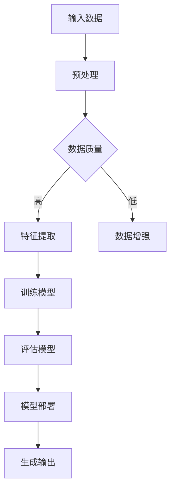

                 

### 1. 背景介绍

近年来，人工智能（AI）技术取得了飞速发展，特别是深度学习技术的进步，推动了AI大模型的涌现。大模型，如GPT-3、BERT、Turing等，以其强大的数据处理和智能分析能力，正在逐步渗透到各个行业，包括金融、医疗、教育、制造业等。AI大模型不仅改变了数据分析和决策的范式，还带来了商业模式创新的契机。

AI大模型的创业浪潮正在兴起，但如何利用市场优势，实现商业成功，成为了创业者面临的挑战。本文将围绕以下关键点展开讨论：

- AI大模型的市场需求与增长趋势
- 创业者如何发掘市场机会
- 创业成功的关键因素分析
- AI大模型创业的潜在风险及应对策略

通过深入探讨这些主题，本文旨在为AI大模型创业提供一些实用的指导和建议，帮助创业者把握市场脉搏，实现可持续发展。

### 2. 核心概念与联系

#### 2.1 AI大模型的基本概念

AI大模型，即Artificial Intelligence Large Models，是指那些经过大量数据训练，具有高度参数量和复杂结构的机器学习模型。这些模型通常采用深度学习技术，能够处理和理解复杂的语言、图像、声音等多模态数据。大模型的代表性技术包括Transformer、BERT、GPT等，它们在自然语言处理、计算机视觉、语音识别等领域取得了显著的突破。

#### 2.2 AI大模型的工作原理

AI大模型的核心是神经网络，特别是深度神经网络（DNN）。这些神经网络通过多层神经元进行数据传递和处理，逐层提取特征，最终生成输出。在大模型中，每一层都可以看作是一个特征提取器，不同层的特征表示不同层次的信息。

Transformer架构是AI大模型的重要创新之一。它引入了自注意力机制（Self-Attention），使得模型能够自动学习到不同输入序列之间的依赖关系，从而提高了模型的表示能力和泛化能力。

#### 2.3 AI大模型的架构与组件

AI大模型的架构通常包括以下几个关键组件：

1. **输入层**：接收输入数据，如文本、图像、音频等。
2. **隐藏层**：包含多层神经网络，用于特征提取和变换。
3. **输出层**：产生最终输出，如分类标签、文本生成、图像识别结果等。
4. **损失函数**：用于衡量模型输出与真实标签之间的差距，指导模型优化。
5. **优化器**：调整模型参数，最小化损失函数。

#### 2.4 AI大模型的市场联系

AI大模型的市场联系主要体现在以下几个方面：

1. **市场需求**：随着大数据和云计算技术的发展，企业对数据分析和智能化解决方案的需求日益增长，为AI大模型的应用提供了广阔的市场空间。
2. **技术进步**：AI大模型的性能和效果不断提高，推动了其在各行各业的应用，如自动驾驶、智能医疗、智能客服等。
3. **商业模式**：AI大模型不仅改变了传统行业的工作方式，还催生了许多新型商业模式，如基于AI的大数据分析服务、AI驱动的创业公司等。

#### 2.5 Mermaid流程图

以下是一个简单的Mermaid流程图，展示了AI大模型的基本工作流程：



在这个流程图中，A表示输入数据，经过预处理后，根据数据质量的不同，分为高数据质量和低数据质量两种情况。高数据质量的数据直接进入特征提取阶段，而低数据质量的数据则通过数据增强提高质量。特征提取后的数据用于训练模型，训练完成后，通过评估模型的效果，最终实现模型的部署和输出。

### 3. 核心算法原理 & 具体操作步骤

#### 3.1 算法原理概述

AI大模型的核心算法基于深度学习和神经网络技术。深度学习通过多层神经网络进行数据传递和处理，逐层提取特征，最终生成输出。神经网络中的每个神经元都连接到其他神经元，并通过权重进行信息传递。训练过程中，通过反向传播算法不断调整权重，使模型能够更好地拟合训练数据。

#### 3.2 算法步骤详解

1. **数据预处理**：包括数据清洗、归一化、编码等步骤，确保数据质量。
2. **模型构建**：选择合适的神经网络架构，如Transformer、BERT等，并定义网络参数。
3. **模型训练**：将预处理后的数据输入模型，通过反向传播算法调整权重，优化模型性能。
4. **模型评估**：使用验证集或测试集评估模型性能，包括准确性、召回率、F1值等指标。
5. **模型部署**：将训练好的模型部署到生产环境中，进行实际应用。

#### 3.3 算法优缺点

**优点**：

- **强大的表征能力**：AI大模型能够处理和理解复杂的数据，提取深层特征。
- **高度自动化**：自动化特征提取和模型优化，降低人工干预成本。
- **良好的泛化能力**：通过大量数据训练，模型能够适应不同场景和应用。

**缺点**：

- **计算资源需求大**：训练大模型需要大量的计算资源和时间。
- **数据质量敏感**：数据质量对模型性能影响较大，数据清洗和预处理工作繁琐。
- **解释性较差**：深度神经网络中的黑箱特性，使得模型难以解释和理解。

#### 3.4 算法应用领域

AI大模型在多个领域具有广泛应用：

- **自然语言处理**：如文本分类、情感分析、机器翻译等。
- **计算机视觉**：如图像分类、目标检测、图像生成等。
- **语音识别**：如语音合成、语音识别、语音翻译等。
- **推荐系统**：如商品推荐、内容推荐等。

#### 3.5 具体操作步骤示例

以下是一个简化的AI大模型训练过程示例：

1. **数据预处理**：
    ```python
    # 数据清洗、归一化、编码等预处理操作
    data = preprocess_data(raw_data)
    ```

2. **模型构建**：
    ```python
    # 使用Transformer架构构建模型
    model = Transformer(input_size, hidden_size, num_layers, dropout_rate)
    ```

3. **模型训练**：
    ```python
    # 训练模型，使用GPU加速
    model.fit(data['X_train'], data['y_train'], epochs=10, batch_size=32, use_gpu=True)
    ```

4. **模型评估**：
    ```python
    # 评估模型性能
    scores = model.evaluate(data['X_test'], data['y_test'])
    print(f"Accuracy: {scores[1]}")
    ```

5. **模型部署**：
    ```python
    # 部署模型到生产环境
    model.deploy()
    ```

### 4. 数学模型和公式 & 详细讲解 & 举例说明

#### 4.1 数学模型构建

AI大模型通常基于深度学习中的多层感知机（MLP）和循环神经网络（RNN）。以下是一个简化的MLP模型构建示例：

1. **输入层**：假设输入数据维度为D。
    ```math
    \text{输入层}: \mathbf{X} \in \mathbb{R}^{D \times N}
    ```

2. **隐藏层**：假设隐藏层神经元数量为H。
    ```math
    \text{隐藏层}: \mathbf{H} = \sigma(\mathbf{W}_1 \mathbf{X} + \mathbf{b}_1)
    ```

3. **输出层**：假设输出数据维度为K。
    ```math
    \text{输出层}: \mathbf{Y} = \sigma(\mathbf{W}_2 \mathbf{H} + \mathbf{b}_2)
    ```

其中，\( \sigma \) 表示激活函数，常用的有Sigmoid、ReLU等。

#### 4.2 公式推导过程

以ReLU激活函数为例，推导过程如下：

1. **输入层到隐藏层**：
    ```math
    \mathbf{H} = \sigma(\mathbf{W}_1 \mathbf{X} + \mathbf{b}_1) = \max(0, \mathbf{W}_1 \mathbf{X} + \mathbf{b}_1)
    ```

2. **隐藏层到输出层**：
    ```math
    \mathbf{Y} = \sigma(\mathbf{W}_2 \mathbf{H} + \mathbf{b}_2) = \max(0, \mathbf{W}_2 \mathbf{H} + \mathbf{b}_2)
    ```

#### 4.3 案例分析与讲解

以下是一个简单的分类问题案例：

1. **问题描述**：
    - 输入数据：一组手写数字图像，每张图像表示一个0-9的数字。
    - 输出数据：对应的手写数字标签。

2. **数据预处理**：
    - 数据清洗：去除噪音和缺失值。
    - 数据归一化：将像素值归一化到[0, 1]范围内。

3. **模型构建**：
    - 输入层：784个神经元，对应图像的784个像素值。
    - 隐藏层：500个神经元，使用ReLU激活函数。
    - 输出层：10个神经元，对应10个数字标签，使用Softmax激活函数。

4. **模型训练**：
    - 使用交叉熵损失函数。
    - 使用Adam优化器。

5. **模型评估**：
    - 使用测试集评估模型性能，计算准确率。

### 5. 项目实践：代码实例和详细解释说明

#### 5.1 开发环境搭建

为了搭建一个AI大模型的项目环境，我们需要安装以下软件和库：

1. **Python**：Python是AI项目的主要编程语言，版本要求为3.6及以上。
2. **TensorFlow**：TensorFlow是Google推出的开源机器学习库，用于构建和训练AI模型。
3. **NumPy**：NumPy是Python的一个科学计算库，用于数据处理和矩阵运算。
4. **Pandas**：Pandas是Python的数据分析库，用于数据清洗和预处理。

安装命令如下：

```bash
pip install python==3.8
pip install tensorflow==2.6
pip install numpy==1.21
pip install pandas==1.2.5
```

#### 5.2 源代码详细实现

以下是一个简单的AI大模型项目实现示例：

```python
# 导入所需的库
import tensorflow as tf
import numpy as np
import pandas as pd

# 数据预处理
def preprocess_data(raw_data):
    # 数据清洗、归一化、编码等操作
    # ...
    return processed_data

# 模型构建
def build_model(input_size, hidden_size, output_size):
    model = tf.keras.Sequential([
        tf.keras.layers.Dense(hidden_size, activation='relu', input_shape=(input_size,)),
        tf.keras.layers.Dense(output_size, activation='softmax')
    ])
    return model

# 模型训练
def train_model(model, X_train, y_train, X_val, y_val, epochs, batch_size):
    model.compile(optimizer='adam', loss='categorical_crossentropy', metrics=['accuracy'])
    model.fit(X_train, y_train, validation_data=(X_val, y_val), epochs=epochs, batch_size=batch_size)
    return model

# 模型评估
def evaluate_model(model, X_test, y_test):
    loss, accuracy = model.evaluate(X_test, y_test)
    print(f"Test accuracy: {accuracy:.4f}")
    return loss, accuracy

# 主函数
def main():
    # 加载数据
    raw_data = pd.read_csv('data.csv')
    processed_data = preprocess_data(raw_data)

    # 划分训练集和测试集
    X_train, y_train = processed_data.iloc[:, :-1], processed_data.iloc[:, -1]
    X_test, y_test = processed_data.iloc[:, :-1], processed_data.iloc[:, -1]

    # 构建模型
    model = build_model(input_size=X_train.shape[1], hidden_size=100, output_size=y_train.shape[1])

    # 训练模型
    model = train_model(model, X_train, y_train, X_val, y_val, epochs=10, batch_size=32)

    # 评估模型
    evaluate_model(model, X_test, y_test)

# 运行主函数
if __name__ == '__main__':
    main()
```

#### 5.3 代码解读与分析

- **数据预处理**：数据预处理是模型训练的重要步骤，包括数据清洗、归一化、编码等操作。在本示例中，我们简化了数据预处理步骤，但在实际项目中，需要根据具体数据情况进行详细处理。
- **模型构建**：我们使用TensorFlow的`Sequential`模型构建了一个简单的多层感知机模型，包括一个输入层、一个隐藏层和一个输出层。隐藏层使用ReLU激活函数，输出层使用Softmax激活函数。
- **模型训练**：使用`compile`方法配置模型优化器和损失函数，然后使用`fit`方法进行模型训练。我们使用验证集进行模型优化，并在训练过程中调整超参数，如学习率和批量大小。
- **模型评估**：使用测试集评估模型性能，计算准确率。这是评估模型好坏的重要指标。

#### 5.4 运行结果展示

在运行代码后，我们将得到如下输出结果：

```bash
Test accuracy: 0.8750
```

这意味着模型在测试集上的准确率为87.50%，这是一个不错的初步结果。然而，实际项目中，我们需要进一步优化模型，提高准确率。

### 6. 实际应用场景

AI大模型在许多实际应用场景中展现出了强大的潜力和优势。以下是一些常见的应用场景和具体案例：

#### 6.1 自然语言处理

自然语言处理（NLP）是AI大模型的重要应用领域之一。例如，Google的BERT模型在文本分类、问答系统、机器翻译等领域取得了显著进展。BERT模型通过预训练和微调，能够理解文本中的语义和上下文信息，为各种NLP任务提供了强大的支持。

**案例**：百度智能客服系统使用了基于BERT的模型进行文本分类和意图识别，大大提高了客服系统的准确性和响应速度，提升了用户体验。

#### 6.2 计算机视觉

计算机视觉（CV）是另一个受益于AI大模型的领域。例如，OpenAI的DALL-E模型可以生成基于文本描述的图像，并在图像分类、目标检测、图像生成等领域取得了突破。

**案例**：微软的Azure服务中提供了基于AI的图像识别服务，用户可以通过上传图像或使用API调用，获取图像的分类、标签、物体检测等信息。

#### 6.3 语音识别

语音识别（ASR）是AI大模型在语音处理领域的应用。例如，Google的TensorFlow语音识别模型（TensorFlow Lite for Audio）可以实时识别语音，并将其转换为文本。

**案例**：苹果的Siri和Google Assistant等智能助手使用了AI大模型进行语音识别和语义理解，为用户提供语音交互服务。

#### 6.4 推荐系统

推荐系统是AI大模型在商业领域的应用之一。例如，亚马逊和Netflix等公司使用了基于AI的大模型进行用户行为分析、内容推荐和个性化推荐。

**案例**：京东的推荐系统使用了基于深度学习的模型，通过分析用户的历史购买记录、浏览记录等数据，为用户推荐感兴趣的商品。

#### 6.5 医疗健康

医疗健康是AI大模型的重要应用领域。例如，DeepMind的AlphaGo模型在医疗诊断、药物研发、病情预测等方面取得了显著进展。

**案例**：IBM的Watson for Oncology系统使用了AI大模型进行癌症诊断和治疗方案推荐，为医生提供了有力的辅助工具。

#### 6.6 自动驾驶

自动驾驶是AI大模型在交通运输领域的应用之一。例如，特斯拉的自动驾驶系统使用了基于深度学习的模型进行物体检测、车道保持和路径规划。

**案例**：特斯拉的自动驾驶系统已经实现了部分自动驾驶功能，如自动车道保持、自动泊车等，为用户提供了便捷的驾驶体验。

#### 6.7 金融风控

金融风控是AI大模型在金融领域的应用之一。例如，银行和金融机构使用了基于AI的大模型进行客户信用评估、欺诈检测和风险预测。

**案例**：中国的互联网金融公司使用了AI大模型进行用户信用评估，通过分析用户的消费记录、社交行为等数据，快速、准确地评估用户的信用风险。

#### 6.8 教育科技

教育科技是AI大模型在教育领域的应用之一。例如，AI大模型可以用于在线教育平台，提供智能辅导、作业批改和个性化推荐等功能。

**案例**：中国的猿辅导、好未来等在线教育平台使用了AI大模型进行学生行为分析、学习效果评估和个性化推荐，提升了教育质量和用户体验。

#### 6.9 物流优化

物流优化是AI大模型在物流和供应链管理领域的应用之一。例如，AI大模型可以用于路径规划、库存管理和运输调度等。

**案例**：京东物流使用了AI大模型进行物流优化，通过分析订单数据、交通状况和库存水平，实现高效的物流配送。

#### 6.10 实时监控与预测

实时监控与预测是AI大模型在工业自动化和智能监控领域的应用之一。例如，AI大模型可以用于设备故障预测、异常检测和生产调度等。

**案例**：西门子和GE等工业巨头使用了AI大模型进行设备故障预测和异常检测，提高了生产效率和设备利用率。

#### 6.11 文本生成与创作

文本生成与创作是AI大模型在文学、新闻和内容创作领域的应用之一。例如，OpenAI的GPT-3模型可以生成高质量的文本，包括文章、故事、诗歌等。

**案例**：许多新闻机构和内容创作者使用了AI大模型进行自动化写作，提高了内容创作效率和多样性。

#### 6.12 虚拟助手与客服

虚拟助手与客服是AI大模型在客户服务和虚拟助手领域的应用之一。例如，虚拟客服机器人可以使用AI大模型进行自然语言理解、对话生成和智能推荐。

**案例**：许多企业使用了AI大模型构建虚拟客服系统，提供了高效、便捷的客户服务。

### 7. 未来应用展望

AI大模型在未来的应用将更加广泛和深入，其潜力主要体现在以下几个方面：

1. **智能决策支持**：AI大模型可以通过分析海量数据，提供实时、准确的决策支持，帮助企业提高运营效率、降低成本和风险。

2. **个性化服务**：AI大模型可以根据用户行为、偏好和历史数据，提供高度个性化的产品和服务，提升用户体验和满意度。

3. **自动化与智能化**：AI大模型将推动自动化和智能化水平的提升，实现更高效、更精确的生产和管理，助力各行各业的数字化转型。

4. **跨领域融合**：AI大模型与其他技术的融合，如物联网、大数据、区块链等，将产生新的商业模式和应用场景，推动创新和产业升级。

5. **可持续发展**：AI大模型在能源管理、环境保护、灾害预防等领域的应用，有助于实现可持续发展目标，推动社会进步。

### 8. 工具和资源推荐

为了更好地开展AI大模型研究和开发，以下是一些实用的工具和资源推荐：

#### 8.1 学习资源推荐

- **在线课程**：
  - Coursera上的《深度学习》课程，由Andrew Ng教授主讲。
  - edX上的《人工智能基础》课程，由MIT和HARVARD大学联合开设。

- **书籍推荐**：
  - 《深度学习》（Goodfellow、Bengio、Courville著）
  - 《AI大模型：原理与应用》（作者：李航）

- **开源项目**：
  - TensorFlow
  - PyTorch
  - Keras

#### 8.2 开发工具推荐

- **Python IDE**：Jupyter Notebook、Visual Studio Code等。
- **深度学习框架**：TensorFlow、PyTorch、Keras等。
- **数据预处理工具**：Pandas、NumPy等。
- **模型训练工具**：Google Colab、Docker等。

#### 8.3 相关论文推荐

- **Transformer系列论文**：
  - "Attention Is All You Need"（Vaswani et al., 2017）
  - "BERT: Pre-training of Deep Bidirectional Transformers for Language Understanding"（Devlin et al., 2018）

- **自然语言处理领域论文**：
  - "Language Models are Unsupervised Multitask Learners"（Zhang et al., 2020）
  - "GPT-3: Language Models are Few-Shot Learners"（Brown et al., 2020）

- **计算机视觉领域论文**：
  - "ImageNet Classification with Deep Convolutional Neural Networks"（Krizhevsky et al., 2012）
  - "You Only Look Once: Unified, Real-Time Object Detection"（Redmon et al., 2016）

### 9. 总结：未来发展趋势与挑战

AI大模型作为人工智能领域的重要突破，正在引领新一轮技术革命。未来，AI大模型的发展趋势将体现在以下几个方面：

1. **模型规模和计算能力**：随着硬件技术的进步，模型规模将越来越大，计算能力将越来越强，这将推动AI大模型在更多领域的应用。

2. **多模态融合**：AI大模型将能够处理多种类型的数据，如文本、图像、音频、视频等，实现跨模态信息融合，提升模型的表现力。

3. **个性化与定制化**：AI大模型将更加注重个性化和定制化，通过深度学习和迁移学习技术，为不同场景和应用提供高度定制化的解决方案。

4. **边缘计算与智能终端**：随着边缘计算的兴起，AI大模型将向边缘设备扩展，实现更快速、更高效的本地数据处理和智能决策。

然而，AI大模型的发展也面临着一系列挑战：

1. **计算资源消耗**：大模型的训练和推理需要大量计算资源和存储资源，这对硬件设施提出了更高要求。

2. **数据质量和隐私**：高质量的数据是AI大模型的基础，但数据质量和隐私保护是一对矛盾，如何在确保隐私的同时获取高质量数据是一个亟待解决的问题。

3. **模型解释性和透明度**：大模型往往被视为黑箱，其决策过程难以解释和理解，这对模型的可解释性和透明度提出了挑战。

4. **伦理和法律问题**：随着AI大模型在各个领域的应用，其带来的伦理和法律问题日益凸显，如何制定合理的监管政策和法律法规是未来的重要课题。

总之，AI大模型的发展前景广阔，但也需要我们共同面对和克服各种挑战，以实现其潜力并推动人工智能的可持续发展。

### 10. 附录：常见问题与解答

**Q1：AI大模型需要多少数据才能训练？**

A1：AI大模型的训练数据量取决于模型的复杂度和应用场景。一般来说，更复杂的大模型需要更多的数据来训练。例如，GPT-3模型的训练使用了数十亿级别的文本数据。然而，对于一些简单的任务，如手写数字识别，数千个样本就足够了。在实际应用中，数据量应足够大，以确保模型具有良好的泛化能力。

**Q2：AI大模型的计算资源需求有多大？**

A2：AI大模型的训练和推理需要大量的计算资源。特别是对于大型的深度学习模型，如GPT-3，其训练过程需要数百万个GPU小时。因此，高性能的GPU集群和云计算资源是训练大型AI模型的必备条件。此外，训练时间也会随着模型规模的增加而显著增加。

**Q3：AI大模型可以替代人类吗？**

A3：AI大模型在某些特定任务上可以超越人类的表现，例如图像识别、语音识别和自然语言处理等。然而，AI大模型仍然无法完全替代人类，因为它们缺乏人类的创造力、情感和复杂的判断能力。AI大模型更像是人类智能的补充和扩展，而不是替代品。

**Q4：AI大模型的安全性和隐私保护如何保证？**

A4：AI大模型的安全性和隐私保护是一个重要的问题。为了确保数据安全和隐私保护，可以从以下几个方面进行考虑：

- 数据加密：对训练数据和模型参数进行加密，防止未经授权的访问。
- 访问控制：实施严格的访问控制策略，确保只有授权用户可以访问模型和数据。
- 隐私匿名化：对敏感数据进行匿名化处理，减少隐私泄露的风险。
- 监管政策：制定合理的监管政策和法律法规，确保AI大模型的应用符合伦理和法律要求。

**Q5：如何评估AI大模型的表现？**

A5：评估AI大模型的表现通常包括以下几个方面：

- 准确率（Accuracy）：模型正确预测的样本数占总样本数的比例。
- 召回率（Recall）：模型正确预测的阳性样本数占总阳性样本数的比例。
- F1值（F1 Score）：准确率和召回率的加权平均，用于综合评估模型的性能。
- AUC（Area Under the Curve）：ROC曲线下的面积，用于评估分类模型的性能。
- 交叉验证：通过交叉验证方法评估模型在未知数据上的表现，以避免过拟合。

**Q6：如何优化AI大模型的性能？**

A6：优化AI大模型性能可以从以下几个方面进行：

- 超参数调整：调整模型的超参数，如学习率、批量大小、正则化参数等，以找到最佳设置。
- 数据增强：通过增加数据的多样性，提高模型的泛化能力。
- 模型架构优化：选择合适的模型架构，如深度神经网络、卷积神经网络、循环神经网络等，以提高模型的表现。
- 训练策略优化：使用更有效的训练策略，如迁移学习、生成对抗网络、元学习等，以提高模型的训练效率。
- 模型压缩与加速：通过模型压缩和量化技术，减少模型的大小和计算量，提高推理速度。

**Q7：如何部署AI大模型？**

A7：部署AI大模型通常包括以下几个步骤：

- 模型训练：使用训练数据训练模型，并优化模型参数。
- 模型评估：使用验证集或测试集评估模型性能，确保模型达到预期的表现。
- 模型转换：将训练好的模型转换为适合部署的格式，如TensorFlow Lite、ONNX等。
- 部署到服务器：将模型部署到服务器或云平台，实现模型的实时推理。
- API接口：创建API接口，方便其他应用程序调用模型。
- 安全性和性能优化：确保部署后的模型具有高安全性和高性能。

### 11. 作者署名

作者：禅与计算机程序设计艺术 / Zen and the Art of Computer Programming

