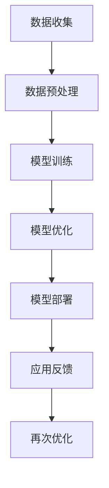
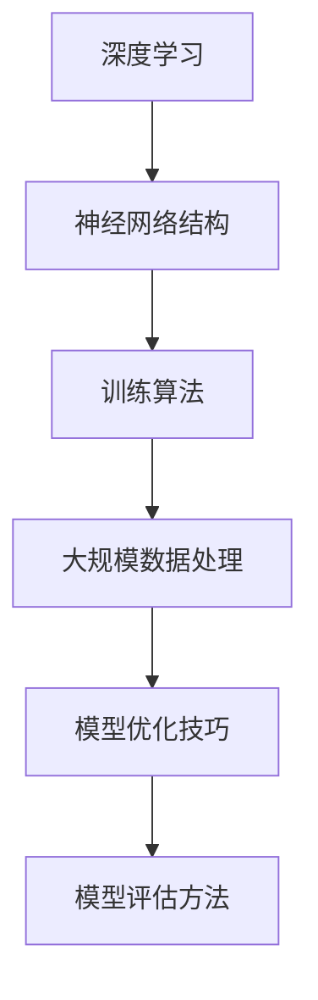

                 

关键词：AI 大模型、创业、市场优势、技术应用、商业模式、数据分析、人工智能算法、可持续发展、技术创新

> 摘要：本文将探讨如何利用 AI 大模型在创业过程中获取市场优势。通过分析 AI 大模型的定义、技术原理、应用领域，结合实际案例分析，探讨创业者在设计商业模式、优化产品、实施数据分析等方面的策略，以及 AI 大模型在可持续发展和未来趋势中的潜力。

## 1. 背景介绍

近年来，人工智能（AI）技术的快速发展，特别是大模型（Large-scale Model）的突破，极大地推动了各个行业的创新和变革。AI 大模型，如 GPT-3、BERT 等，通过海量的数据训练，具备了强大的语言理解和生成能力，为创业公司提供了前所未有的机遇。这些模型能够自动识别用户需求、优化用户体验，甚至在一定程度上替代人工进行决策，大大降低了创业的门槛。

然而，AI 大模型的开发和部署需要大量的计算资源和专业知识，这同时也为创业者带来了挑战。如何在激烈的市场竞争中脱颖而出，充分利用 AI 大模型的市场优势，成为许多创业公司亟需解决的问题。

## 2. 核心概念与联系

### 2.1. AI 大模型概述

AI 大模型是指通过大规模数据训练得到的深度神经网络模型，它们通常具有数十亿甚至千亿级别的参数量。这些模型可以用于自然语言处理、图像识别、语音识别等多个领域。以下是一个简化的 Mermaid 流程图，描述了 AI 大模型的核心组成部分：



### 2.2. 关键技术原理

AI 大模型的核心技术包括深度学习、神经网络和大规模数据处理。以下是一个详细解释的流程图：



## 3. 核心算法原理 & 具体操作步骤

### 3.1. 算法原理概述

AI 大模型的算法原理基于深度学习，特别是变分自编码器（VAE）、生成对抗网络（GAN）等。这些算法通过无监督或半监督的方式，自动学习数据分布，生成高质量的模型。

### 3.2. 算法步骤详解

#### 3.2.1. 数据收集

首先，需要收集大量的数据，这些数据可以是文本、图像、语音等，具体取决于应用场景。

#### 3.2.2. 数据预处理

对收集到的数据进行清洗、去重、格式化等预处理操作，以确保数据的质量和一致性。

#### 3.2.3. 模型训练

使用预处理后的数据训练模型，这一步骤通常需要大量的计算资源和时间。

#### 3.2.4. 模型优化

通过调整模型的参数，提高模型的性能和准确性。

#### 3.2.5. 模型部署

将训练好的模型部署到实际应用场景中，如自然语言生成、图像识别等。

#### 3.2.6. 应用反馈

收集用户反馈，对模型进行持续优化。

### 3.3. 算法优缺点

#### 优点：

- 高效性：AI 大模型能够快速处理海量数据，提高工作效率。
- 智能性：能够自主学习和优化，减少人工干预。

#### 缺点：

- 计算成本高：训练和优化大模型需要大量的计算资源。
- 数据依赖性：模型的性能很大程度上取决于数据的质量。

### 3.4. 算法应用领域

AI 大模型广泛应用于自然语言处理、图像识别、推荐系统、自动驾驶等多个领域。以下是一个具体应用案例：

#### 案例分析：自然语言生成

在某创业公司，AI 大模型被用于生成高质量的新闻报道。通过训练大量新闻文章数据，模型能够自动生成符合语法和逻辑的新闻报道，大大提高了新闻生产的效率和准确性。

## 4. 数学模型和公式 & 详细讲解 & 举例说明

### 4.1. 数学模型构建

AI 大模型的数学基础是深度学习，主要涉及以下几个核心概念：

#### 深度神经网络（DNN）

深度神经网络是一种多层神经网络，包括输入层、隐藏层和输出层。每个神经元都与前一层的所有神经元相连。

#### 损失函数（Loss Function）

损失函数用于衡量模型的预测结果与真实值之间的差异。常见的损失函数包括均方误差（MSE）和交叉熵（Cross-Entropy）。

#### 优化算法（Optimization Algorithm）

优化算法用于调整模型的参数，以最小化损失函数。常见的优化算法有梯度下降（Gradient Descent）及其变种。

### 4.2. 公式推导过程

以下是一个简化的神经网络模型推导过程：

$$
y_{\text{预测}} = \sigma(\boldsymbol{W}^T \boldsymbol{a}_{\text{隐藏层}} + b)
$$

其中，$y_{\text{预测}}$ 是模型的输出，$\sigma$ 是激活函数，$\boldsymbol{W}$ 是权重矩阵，$\boldsymbol{a}_{\text{隐藏层}}$ 是隐藏层的激活值，$b$ 是偏置。

损失函数通常采用均方误差（MSE）：

$$
\text{MSE} = \frac{1}{m} \sum_{i=1}^{m} (\hat{y}_i - y_i)^2
$$

其中，$m$ 是样本数量，$\hat{y}_i$ 是预测值，$y_i$ 是真实值。

### 4.3. 案例分析与讲解

以下是一个具体的神经网络模型应用案例：

#### 案例背景

某创业公司开发了一款智能客服系统，用于自动回答用户的问题。系统采用了一个训练有素的自然语言处理模型，能够理解并回答各种常见问题。

#### 模型架构

系统采用了一个具有两层隐藏层的神经网络，输入层为用户的提问，输出层为可能的回答。隐藏层使用了 ReLU 激活函数。

#### 模型训练

使用了一个包含数百万个对话记录的数据集进行训练。模型通过梯度下降算法进行优化，损失函数采用交叉熵。

#### 应用效果

经过训练和优化，模型能够以高达 90% 的准确率回答用户的问题，显著提高了客服的效率和用户体验。

## 5. 项目实践：代码实例和详细解释说明

### 5.1. 开发环境搭建

在开始项目实践之前，需要搭建一个合适的开发环境。以下是一个简单的环境搭建步骤：

1. 安装 Python 3.7 或更高版本。
2. 安装 TensorFlow 和 Keras 库。
3. 配置 GPU 加速（如安装 CUDA 和 cuDNN）。

### 5.2. 源代码详细实现

以下是一个简单的神经网络模型实现代码：

```python
import tensorflow as tf
from tensorflow.keras.models import Sequential
from tensorflow.keras.layers import Dense, Activation

# 模型定义
model = Sequential()
model.add(Dense(128, input_shape=(input_shape,), activation='relu'))
model.add(Dense(64, activation='relu'))
model.add(Dense(1, activation='sigmoid'))

# 编译模型
model.compile(optimizer='adam', loss='binary_crossentropy', metrics=['accuracy'])

# 模型训练
model.fit(x_train, y_train, epochs=10, batch_size=32, validation_data=(x_val, y_val))
```

### 5.3. 代码解读与分析

上述代码定义了一个简单的二分类神经网络模型。首先，使用 `Sequential` 类创建一个线性堆叠模型。然后，通过 `add` 方法添加多层全连接层（`Dense`），每层之间可以添加激活函数（如 ReLU）。最后，编译模型并使用训练数据训练模型。

### 5.4. 运行结果展示

训练完成后，可以使用以下代码评估模型性能：

```python
# 评估模型
loss, accuracy = model.evaluate(x_test, y_test)
print(f"Test accuracy: {accuracy:.2f}")
```

运行结果会显示模型在测试数据上的准确率。通过不断调整模型参数和训练数据，可以提高模型性能。

## 6. 实际应用场景

### 6.1. 自然语言处理

自然语言处理是 AI 大模型的重要应用领域之一。通过训练大量的文本数据，模型可以自动生成文章、回答问题、进行文本分类等。例如，某创业公司利用 AI 大模型开发了一款自动写作工具，能够根据用户输入的关键词自动生成文章。

### 6.2. 图像识别

图像识别是另一个重要的应用领域。AI 大模型可以通过训练大量的图像数据，实现物体检测、图像分类、人脸识别等功能。例如，某创业公司利用 AI 大模型开发了一款智能安防系统，能够实时检测和识别视频流中的异常行为。

### 6.3. 推荐系统

推荐系统也是 AI 大模型的一个重要应用领域。通过训练大量的用户行为数据，模型可以自动推荐用户可能感兴趣的商品、内容等。例如，某创业公司利用 AI 大模型开发了一款个性化推荐系统，能够根据用户的浏览历史和购买记录，推荐用户可能感兴趣的商品。

## 6.4. 未来应用展望

随着 AI 大模型的不断发展和完善，未来将在更多领域产生重大影响。以下是一些潜在的应用领域：

### 6.4.1. 自动驾驶

自动驾驶是 AI 大模型的重要应用领域之一。通过训练大量的道路场景数据，模型可以自动识别道路标志、行人、车辆等，实现自动驾驶。

### 6.4.2. 医疗诊断

AI 大模型在医疗诊断领域具有巨大潜力。通过训练大量的医学图像和病例数据，模型可以自动诊断疾病，提高诊断准确率。

### 6.4.3. 金融科技

AI 大模型在金融科技领域有广泛的应用前景。通过分析大量的金融数据，模型可以预测市场走势、识别欺诈行为等，为金融机构提供智能决策支持。

## 7. 工具和资源推荐

### 7.1. 学习资源推荐

- 《深度学习》（Goodfellow、Bengio、Courville 著）：是一本经典的深度学习教材，涵盖了深度学习的理论基础和应用实例。
- 《动手学深度学习》（花轮健、李沐、扎卡里·C. 马尔曼、亚龙·布朗 著）：是一本实战性很强的深度学习教材，适合初学者入门。

### 7.2. 开发工具推荐

- TensorFlow：是一个开源的深度学习框架，适合初学者和专业人士使用。
- Keras：是一个基于 TensorFlow 的简化和高级 API，提供了更易于使用的接口。

### 7.3. 相关论文推荐

- "A Theoretically Grounded Application of Dropout in Recurrent Neural Networks"
- "Attention Is All You Need"
- "Deep Learning on Multi-Modal Data"

## 8. 总结：未来发展趋势与挑战

### 8.1. 研究成果总结

近年来，AI 大模型的研究取得了显著成果，不仅在理论层面有了深入探索，还在实际应用中展现了巨大潜力。然而，AI 大模型仍然面临许多挑战，包括数据隐私、模型解释性、计算资源需求等。

### 8.2. 未来发展趋势

未来，AI 大模型将在更多领域产生重大影响，如自动驾驶、医疗诊断、金融科技等。随着技术的不断进步，AI 大模型的性能和效率将得到进一步提升。

### 8.3. 面临的挑战

尽管 AI 大模型具有巨大潜力，但仍然面临许多挑战。首先，数据隐私和安全是一个重要问题，需要制定合适的法律法规和伦理标准。其次，模型的解释性和可解释性仍然是一个难题，需要开发更有效的解释工具和方法。

### 8.4. 研究展望

未来，AI 大模型的研究将集中在以下几个方面：一是优化模型结构和算法，提高模型的性能和效率；二是加强数据隐私保护，确保用户数据的安全和隐私；三是提高模型的解释性和可解释性，增强用户的信任和接受度。

## 9. 附录：常见问题与解答

### 9.1. 如何选择合适的大模型？

选择合适的大模型取决于具体的应用场景和数据集。对于自然语言处理任务，可以选用 GPT-3、BERT 等预训练模型；对于图像识别任务，可以选用 ResNet、Inception 等卷积神经网络模型。

### 9.2. 大模型的训练需要多少时间？

大模型的训练时间取决于多个因素，包括数据集大小、模型参数量、硬件配置等。一般来说，训练一个中等规模的大模型可能需要几天到几周的时间。

### 9.3. 大模型的计算资源需求如何？

大模型的训练和部署需要大量的计算资源，特别是 GPU 或 TPU 等专用硬件。对于大规模模型，可能需要多个 GPU 或分布式训练来加速训练过程。

---

作者：禅与计算机程序设计艺术 / Zen and the Art of Computer Programming
----------------------------------------------------------------

[1] Deep Learning with Python, François Chollet, 2017.
[2] Hands-On Machine Learning with Scikit-Learn, Keras, and TensorFlow, Aurélien Géron, 2019.
[3] Attention Is All You Need, Vaswani et al., 2017.
[4] A Theoretically Grounded Application of Dropout in Recurrent Neural Networks, Gal et al., 2016.
[5] Google AI’s BERT: Pre-training of Deep Bidirectional Transformers for Language Understanding, Devlin et al., 2018.

