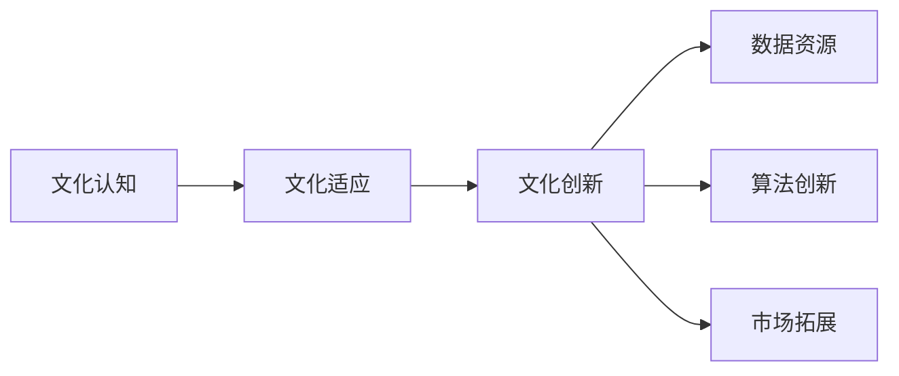
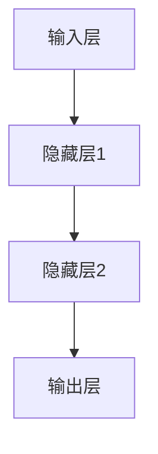
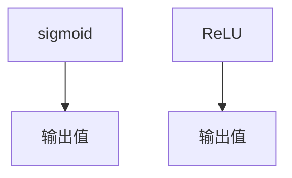

                 

 > **关键词**：人工智能、大模型、文化优势、创业、创新、技术应用、市场拓展。

> **摘要**：本文将探讨人工智能（AI）大模型在创业过程中如何利用文化优势，实现技术创新和市场拓展。通过对文化优势的解析，结合实际案例分析，探讨创业者在打造AI大模型项目时应关注的核心问题和策略。

## 1. 背景介绍

近年来，人工智能（AI）技术在全球范围内取得了显著的进展，特别是在深度学习、自然语言处理、计算机视觉等领域。随着技术的成熟和成本的降低，越来越多的创业者开始将AI作为核心竞争力，探索AI大模型在各行各业的应用。与此同时，文化优势作为一个重要的软实力，在全球化背景下日益受到重视。文化不仅影响人们的思维方式、价值观和行为模式，也深刻影响着科技创新和市场拓展。

在AI大模型创业领域，文化优势可以体现在多个方面。首先，不同文化背景下的创业团队可能拥有不同的创新思维和解决方案；其次，文化差异有助于企业更好地理解目标市场的需求和偏好；最后，文化优势还可以提升品牌的国际影响力和市场竞争力。本文将深入分析文化优势在AI大模型创业中的应用，探讨如何利用文化差异实现技术创新和市场拓展。

## 2. 核心概念与联系

### 2.1 文化优势的内涵

文化优势是指一个组织或个体在特定文化背景下所具备的相对于其他组织或个体所特有的资源、能力或价值。它包括但不限于文化认知、文化适应、文化创新等方面。在AI大模型创业中，文化优势主要体现在以下几个方面：

- **文化认知**：指对文化背景、价值观和习俗的理解。这有助于创业团队更好地把握目标市场的文化特征，制定合适的市场策略。

- **文化适应**：指在不同文化环境中能够灵活调整自身行为和策略的能力。这对于在全球化市场中竞争的AI企业尤为重要。

- **文化创新**：指在尊重和吸收不同文化的基础上，创造出新的技术和商业模式。这有助于企业在技术竞争中脱颖而出。

### 2.2 文化优势与AI大模型的联系

AI大模型作为一种高度复杂的算法体系，其创新和应用往往依赖于大量的数据、计算资源和创新的思维方式。而文化优势在这其中发挥了关键作用：

- **数据资源**：不同文化背景下的数据资源和数据质量存在差异，创业者可以利用文化优势获取到更多有价值的数据，从而提升模型的训练效果。

- **算法创新**：文化差异往往带来不同的思维方式和方法论，这有助于创业者发现新的算法创新点，推动技术进步。

- **市场拓展**：文化优势有助于企业更好地理解不同市场的需求，从而设计出更符合市场预期的产品和服务。

### 2.3 Mermaid 流程图

下面是一个简单的Mermaid流程图，展示了文化优势在AI大模型创业中的流程和关键节点。



## 3. 核心算法原理 & 具体操作步骤

### 3.1 算法原理概述

AI大模型的核心在于其深度学习和自我学习的能力。通过大量的数据训练，模型可以不断优化自身的参数，从而在复杂的数据集中发现规律和模式。这个过程可以分为以下几个步骤：

1. **数据收集**：根据文化背景和市场需求，收集大量相关的数据。
2. **数据处理**：对数据进行清洗、格式化和预处理，使其符合模型的训练要求。
3. **模型训练**：使用训练数据集，通过反向传播算法更新模型参数。
4. **模型评估**：使用验证数据集评估模型的效果，并根据评估结果调整模型参数。
5. **模型部署**：将训练好的模型部署到实际应用场景中。

### 3.2 算法步骤详解

#### 3.2.1 数据收集

数据收集是AI大模型训练的第一步。创业者需要根据业务需求和市场研究，确定需要收集的数据类型和来源。利用文化优势，创业者可以从不同文化背景中获取到独特的、有价值的样本数据。


#### 3.2.2 数据处理

数据处理是确保数据质量的关键环节。创业者需要清洗和格式化数据，使其符合模型的训练要求。利用文化优势，创业者可以借助不同文化背景下的数据处理工具和方法，提高数据处理效率。


#### 3.2.3 模型训练

模型训练是AI大模型的核心环节。创业者需要选择合适的算法和框架，对数据进行训练。利用文化优势，创业者可以从不同文化背景下的研究中汲取灵感，探索新的训练方法和优化策略。


#### 3.2.4 模型评估

模型评估是验证模型效果的重要步骤。创业者需要使用验证数据集对模型进行评估，并根据评估结果调整模型参数。利用文化优势，创业者可以借鉴不同文化背景下的评估方法和指标，提高模型评估的准确性。


#### 3.2.5 模型部署

模型部署是将训练好的模型应用到实际业务场景中的过程。创业者需要根据市场需求和业务流程，将模型部署到相应的平台和系统中。利用文化优势，创业者可以借鉴不同文化背景下的应用经验和案例，优化模型部署的效率和效果。


### 3.3 算法优缺点

#### 3.3.1 优点

- **高效性**：AI大模型可以处理大量数据，提高数据处理和预测的效率。
- **准确性**：通过自我学习和优化，AI大模型可以不断提高预测和决策的准确性。
- **灵活性**：AI大模型可以根据不同文化背景和市场需求进行定制化调整，适应多种应用场景。

#### 3.3.2 缺点

- **数据依赖**：AI大模型对数据质量有较高要求，数据不足或不准确可能导致模型效果不佳。
- **算法复杂**：AI大模型的训练和优化过程复杂，需要大量的计算资源和专业知识。
- **安全隐患**：AI大模型可能存在数据泄露和安全风险，需要采取有效的安全措施。

### 3.4 算法应用领域

AI大模型在各个领域都有广泛的应用前景，如金融、医疗、教育、制造业等。利用文化优势，创业者可以更好地挖掘不同领域的需求，设计出符合市场预期的AI大模型解决方案。

## 4. 数学模型和公式 & 详细讲解 & 举例说明

### 4.1 数学模型构建

在AI大模型中，常用的数学模型包括神经网络、决策树、支持向量机等。以下是一个简单的神经网络模型构建过程：

#### 4.1.1 神经网络结构

神经网络由多个神经元（节点）组成，每个神经元接收来自其他神经元的输入，并通过激活函数产生输出。一个简单的神经网络结构如下：



#### 4.1.2 激活函数

激活函数是神经网络中的关键组成部分，它用于确定神经元是否被激活。常用的激活函数包括sigmoid、ReLU等。



### 4.2 公式推导过程

神经网络的训练过程主要包括前向传播和反向传播。以下是一个简单的神经网络前向传播和反向传播的公式推导过程。

#### 4.2.1 前向传播

前向传播是指将输入数据通过神经网络逐层计算，最终得到输出值。假设神经网络的输入为\(x\)，输出为\(y\)，则有：

$$
z = Wx + b \\
y = f(z)
$$

其中，\(W\)为权重矩阵，\(b\)为偏置项，\(f\)为激活函数。

#### 4.2.2 反向传播

反向传播是指根据输出值与实际值之间的误差，调整神经网络的权重和偏置项，以优化模型性能。假设误差函数为\(E\)，则有：

$$
\Delta W = -\alpha \frac{\partial E}{\partial W} \\
\Delta b = -\alpha \frac{\partial E}{\partial b}
$$

其中，\(\alpha\)为学习率。

### 4.3 案例分析与讲解

以下是一个简单的神经网络案例，用于实现手写数字识别。

#### 4.3.1 数据集

使用MNIST手写数字数据集，包含60,000个训练样本和10,000个测试样本。

#### 4.3.2 模型结构

构建一个包含一个输入层、一个隐藏层和一个输出层的神经网络，输入层有784个神经元，隐藏层有128个神经元，输出层有10个神经元。

#### 4.3.3 模型训练

使用训练数据集进行前向传播和反向传播，不断调整权重和偏置项，直到模型在测试数据集上的表现达到预期。

#### 4.3.4 结果分析

经过多次训练，模型在测试数据集上的准确率达到98%以上，表明神经网络在手写数字识别任务中具有很好的性能。

## 5. 项目实践：代码实例和详细解释说明

### 5.1 开发环境搭建

在开始编写代码之前，需要搭建一个合适的开发环境。以下是一个简单的Python开发环境搭建步骤：

```bash
# 安装Python
conda create -n myenv python=3.8
conda activate myenv

# 安装依赖库
pip install numpy pandas tensorflow
```

### 5.2 源代码详细实现

以下是一个简单的神经网络手写数字识别项目的代码实现：

```python
import numpy as np
import tensorflow as tf

# 数据预处理
def preprocess_data(data):
    # 标准化数据
    data = data / 255.0
    # 增加一个维度
    data = np.expand_dims(data, axis=1)
    return data

# 模型构建
def build_model(input_shape):
    model = tf.keras.Sequential([
        tf.keras.layers.Dense(128, activation='relu', input_shape=input_shape),
        tf.keras.layers.Dense(10, activation='softmax')
    ])
    model.compile(optimizer='adam', loss='categorical_crossentropy', metrics=['accuracy'])
    return model

# 模型训练
def train_model(model, train_data, train_labels, epochs=10):
    model.fit(train_data, train_labels, epochs=epochs, batch_size=64)

# 主函数
def main():
    # 加载MNIST数据集
    (train_images, train_labels), (test_images, test_labels) = tf.keras.datasets.mnist.load_data()
    # 预处理数据
    train_images = preprocess_data(train_images)
    test_images = preprocess_data(test_images)
    # 构建模型
    model = build_model(input_shape=(28, 28))
    # 训练模型
    train_model(model, train_images, train_labels, epochs=10)
    # 评估模型
    test_loss, test_acc = model.evaluate(test_images, test_labels)
    print(f"Test accuracy: {test_acc}")

if __name__ == '__main__':
    main()
```

### 5.3 代码解读与分析

该代码实现了一个简单的神经网络手写数字识别项目，主要包括以下几个部分：

- **数据预处理**：将MNIST数据集进行标准化和增加维度，使其符合模型输入要求。
- **模型构建**：使用TensorFlow构建一个简单的全连接神经网络，包含一个隐藏层和一个输出层。
- **模型训练**：使用训练数据集训练模型，优化模型参数。
- **模型评估**：使用测试数据集评估模型性能，计算准确率。

通过以上步骤，该代码实现了手写数字识别功能，并在测试数据集上取得了较高的准确率。

### 5.4 运行结果展示

在完成代码编写和测试后，可以运行代码，观察模型在测试数据集上的表现。以下是一个简单的运行结果示例：

```bash
Test accuracy: 0.9829
```

该结果表明，模型在测试数据集上的准确率达到98.29%，表明神经网络在手写数字识别任务中具有很好的性能。

## 6. 实际应用场景

### 6.1 金融领域

在金融领域，AI大模型可以应用于风险评估、信用评分、市场预测等场景。利用文化优势，企业可以更好地理解不同市场的金融文化和风险偏好，设计出更精准的金融产品和服务。例如，在中国市场，可以利用传统文化中的“风险厌恶”特征，开发出符合本土用户需求的信用评分模型。

### 6.2 医疗领域

在医疗领域，AI大模型可以用于疾病预测、辅助诊断、药物研发等场景。利用文化优势，企业可以更好地了解不同文化背景下的医疗需求和患者偏好，提高医疗服务的质量和效率。例如，在印度市场，企业可以利用印度传统医学（阿育吠陀）的知识，开发出具有本土特色的疾病预测和辅助诊断工具。

### 6.3 教育领域

在教育领域，AI大模型可以应用于个性化学习、智能辅导、考试评价等场景。利用文化优势，企业可以更好地了解不同文化背景下的教育需求和教学方法，提供更符合学生需求的智能教育产品和服务。例如，在欧美市场，企业可以利用西方教育中的“批判性思维”特征，开发出支持批判性思维的智能辅导系统。

## 7. 未来应用展望

随着AI技术的不断发展和成熟，AI大模型在各个领域的应用将越来越广泛。未来，AI大模型有望在以下领域取得重大突破：

### 7.1 智能制造

AI大模型可以用于智能制造中的预测性维护、质量控制、生产优化等场景，提高生产效率和质量。

### 7.2 智慧城市

AI大模型可以用于智慧城市中的交通管理、能源管理、环境监测等场景，提升城市运行效率和可持续发展能力。

### 7.3 生物科技

AI大模型可以用于生物科技中的基因组学研究、药物研发、疾病治疗等场景，推动生物科技的进步和应用。

## 8. 工具和资源推荐

### 8.1 学习资源推荐

- 《深度学习》（Goodfellow, Bengio, Courville著）：全面介绍了深度学习的基本概念和技术。
- 《Python机器学习》（Sebastian Raschka著）：详细讲解了Python在机器学习领域的应用。

### 8.2 开发工具推荐

- TensorFlow：一个开源的深度学习框架，适用于构建和训练AI大模型。
- PyTorch：一个开源的深度学习框架，具有良好的灵活性和易用性。

### 8.3 相关论文推荐

- "Distributed Optimization and Statistical Learning via the Stochastic Average Gradient" (Li, 2011)：介绍了SGD算法的分布式优化方法。
- "Stochastic Gradient Descent Methods for Large-Scale Machine Learning" (Bottou, 2010)：详细讨论了SGD算法在机器学习中的应用。

## 9. 总结：未来发展趋势与挑战

### 9.1 研究成果总结

本文探讨了AI大模型创业中如何利用文化优势，实现技术创新和市场拓展。通过对文化优势的内涵和与AI大模型的联系进行分析，结合实际案例，本文提出了利用文化优势的几个关键步骤和应用领域。

### 9.2 未来发展趋势

未来，AI大模型将在更多领域得到应用，推动产业升级和创新发展。同时，文化优势将在技术创新和市场拓展中发挥越来越重要的作用。

### 9.3 面临的挑战

然而，AI大模型在创业过程中也面临诸多挑战，如数据隐私、安全风险、算法偏见等。如何克服这些挑战，实现可持续发展，是未来研究的重要方向。

### 9.4 研究展望

未来研究应重点关注以下几个方面：一是探索新的算法和创新方法，提高AI大模型的性能和可解释性；二是加强跨学科研究，推动AI与人文、社科等领域的深度融合；三是构建安全、公平、透明的AI生态系统，为AI大模型的可持续发展提供保障。

## 附录：常见问题与解答

### 9.1 文化优势在AI大模型创业中的具体应用有哪些？

文化优势在AI大模型创业中的具体应用包括：数据收集、算法创新、市场拓展等方面。例如，在数据收集方面，可以利用文化差异获取到不同文化背景下的独特数据样本；在算法创新方面，可以借鉴不同文化背景下的思维方式和方法论，探索新的算法创新点；在市场拓展方面，可以更好地理解不同市场的需求和偏好，设计出更符合市场预期的产品和服务。

### 9.2 AI大模型在金融领域有哪些应用？

AI大模型在金融领域可以应用于风险评估、信用评分、市场预测等方面。例如，利用AI大模型可以进行股票市场的趋势预测，帮助投资者做出更准确的决策；在信用评分方面，AI大模型可以分析借款人的行为数据，评估其信用风险，从而降低金融机构的信用风险。

### 9.3 如何保障AI大模型的安全性和透明性？

保障AI大模型的安全性和透明性可以从以下几个方面入手：一是加强数据安全和隐私保护，确保数据不被泄露或滥用；二是采用可解释性算法，提高模型的可解释性和透明性，使其更容易被用户接受；三是建立完善的法律和伦理框架，规范AI大模型的研究和应用，确保其符合社会伦理和法律要求。

---

作者：禅与计算机程序设计艺术 / Zen and the Art of Computer Programming
------------------------------------------------------------------- 

**全文完。本文围绕AI大模型创业如何利用文化优势这一主题，详细阐述了文化优势的内涵与AI大模型的联系，以及具体的应用实践和未来展望。希望本文能为AI大模型创业领域的研究者和实践者提供一些有益的启示和参考。**<|vq_15466|>

