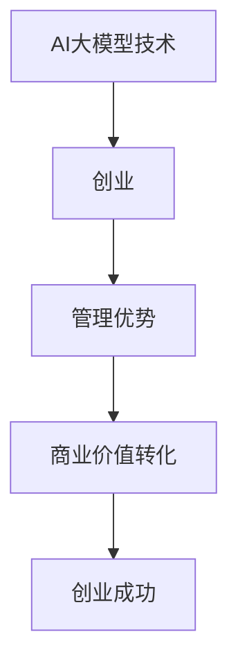

                 

关键词：AI大模型、创业、管理优势、技术策略、商业落地

摘要：随着人工智能技术的快速发展，大模型技术在各个领域展现出巨大的潜力。对于创业者而言，如何有效利用管理优势，将AI大模型技术转化为实际商业价值，成为了一个关键问题。本文将探讨AI大模型创业中管理优势的重要性，以及如何具体实现这一转化。

## 1. 背景介绍

近年来，人工智能（AI）技术取得了飞速发展，尤其是在深度学习领域。大模型（Large-scale Models）作为一种重要的AI模型，以其强大的数据分析和处理能力，在图像识别、自然语言处理、语音识别等领域取得了显著成果。例如，OpenAI的GPT系列模型、谷歌的BERT模型等，都是大模型技术的杰出代表。这些模型的诞生，不仅推动了AI技术的进步，也为创业者提供了丰富的创新机遇。

在这样一个背景下，创业者如何利用管理优势，将AI大模型技术转化为实际商业价值，成为了一个热门话题。管理优势不仅包括技术上的优势，还包括市场洞察力、资源整合能力、团队管理等多方面。如何充分发挥这些优势，成为决定创业项目成败的关键因素。

## 2. 核心概念与联系

### 2.1 AI大模型的概念

AI大模型是指通过深度学习技术，对大量数据进行训练，从而构建出具有高度智能化的模型。这些模型通常具有大规模的参数和复杂的结构，能够处理复杂的问题，并在多个领域取得突破性成果。

### 2.2 创业的概念

创业是指创业者通过创新和创造，将想法转化为实际业务的过程。创业不仅需要技术创新，还需要商业模式创新、团队管理等多方面的能力。

### 2.3 管理优势的概念

管理优势是指企业在资源配置、团队管理、市场洞察等方面所具备的相对优势。这些优势可以帮助企业更好地应对市场变化，提高竞争力。

### 2.4 三者之间的联系

AI大模型技术为创业提供了技术基础，管理优势则为创业提供了实现商业价值的关键能力。通过有效利用管理优势，创业者可以将AI大模型技术转化为实际商业价值，从而实现创业成功。

### 2.5 Mermaid 流程图



## 3. 核心算法原理 & 具体操作步骤

### 3.1 算法原理概述

AI大模型的构建主要依赖于深度学习技术。深度学习是一种模拟人脑神经网络的学习方式，通过多层神经网络的堆叠，实现对数据的特征提取和模式识别。

具体来说，AI大模型的构建包括以下几个步骤：

1. 数据收集与预处理：收集大量高质量的数据，并对数据进行清洗、归一化等预处理操作。
2. 网络架构设计：设计合适的神经网络架构，包括输入层、隐藏层和输出层。
3. 模型训练：通过反向传播算法，不断调整网络参数，使模型能够更好地拟合数据。
4. 模型评估与优化：评估模型性能，并进行优化调整。

### 3.2 算法步骤详解

1. **数据收集与预处理**

   数据收集是AI大模型构建的基础。创业者需要根据业务需求，收集大量的相关数据。数据来源可以包括公开数据集、企业内部数据、第三方数据提供商等。

   数据预处理主要包括以下几个步骤：

   - **数据清洗**：去除数据中的噪声和错误，保证数据质量。
   - **数据归一化**：将不同特征的数据进行归一化处理，使其具有相同的量纲，便于后续处理。
   - **数据增强**：通过数据变换、裁剪、旋转等方法，增加数据的多样性，提高模型泛化能力。

2. **网络架构设计**

   网络架构设计是AI大模型构建的关键。创业者需要根据业务需求和数据特点，选择合适的神经网络架构。常见的神经网络架构包括卷积神经网络（CNN）、循环神经网络（RNN）、长短时记忆网络（LSTM）等。

3. **模型训练**

   模型训练是AI大模型构建的核心步骤。创业者需要使用高效的深度学习框架（如TensorFlow、PyTorch等），设计合适的训练策略，包括学习率调整、批次大小设置、正则化方法等。

4. **模型评估与优化**

   模型评估是判断模型性能的重要步骤。创业者需要设计合适的评估指标，如准确率、召回率、F1值等，对模型性能进行评估。

   模型优化主要包括以下几个步骤：

   - **超参数调整**：通过调整学习率、批次大小等超参数，提高模型性能。
   - **网络结构调整**：通过增加或减少网络层、调整层间连接等，优化网络结构。
   - **数据重采样**：通过数据重采样、交叉验证等方法，提高模型泛化能力。

### 3.3 算法优缺点

**优点**：

- **强大的数据分析能力**：大模型能够处理海量数据，提取数据中的深层次特征，具有很高的数据分析能力。
- **广泛的适用性**：大模型技术可以应用于多个领域，如图像识别、自然语言处理、语音识别等，具有广泛的适用性。

**缺点**：

- **计算资源消耗大**：大模型通常需要大量的计算资源，包括GPU、TPU等，对硬件设备要求较高。
- **训练时间较长**：大模型的训练通常需要较长时间，对时间资源要求较高。

### 3.4 算法应用领域

AI大模型技术在各个领域都取得了显著成果。以下是一些典型的应用领域：

- **图像识别**：通过大模型技术，可以实现高精度的图像分类、目标检测等任务。
- **自然语言处理**：大模型技术可以用于文本分类、情感分析、机器翻译等任务，具有很高的准确性。
- **语音识别**：大模型技术可以用于语音识别、语音合成等任务，具有很好的语音识别能力。
- **推荐系统**：大模型技术可以用于推荐系统的构建，提高推荐系统的准确性。

## 4. 数学模型和公式 & 详细讲解 & 举例说明

### 4.1 数学模型构建

在AI大模型构建过程中，常用的数学模型包括深度神经网络（DNN）、卷积神经网络（CNN）、循环神经网络（RNN）等。以下以深度神经网络为例，介绍其数学模型构建。

**深度神经网络（DNN）**

深度神经网络由多个神经元层组成，包括输入层、隐藏层和输出层。每个神经元接收前一层神经元的输出，并通过激活函数进行处理，最后得到输出层的结果。

假设输入数据为$x_1, x_2, ..., x_n$，隐藏层第$l$层的神经元输出为$a_{l}^{[i]}$，权重为$w_{l}^{[i]}$，偏置为$b_{l}^{[i]}$，激活函数为$f$。则深度神经网络的数学模型可以表示为：

$$
a_{l+1}^{[i]} = f(w_{l}^{[i]}.a_{l}^{[i]} + b_{l}^{[i]})
$$

其中，$w_{l}^{[i]}$和$b_{l}^{[i]}$分别为权重和偏置，$f$为激活函数，通常选择ReLU函数或Sigmoid函数。

**卷积神经网络（CNN）**

卷积神经网络是一种特殊的深度神经网络，主要用于图像识别任务。CNN的核心组件是卷积层、池化层和全连接层。

卷积层的数学模型可以表示为：

$$
h_{c}^{[l]} = \sum_{k=1}^{K} w_{k,c}^{[l]}.h_{k}^{[l-1]}
$$

其中，$h_{c}^{[l]}$为卷积层第$l$层的输出，$K$为卷积核数量，$w_{k,c}^{[l]}$为卷积核，$h_{k}^{[l-1]}$为前一层输出。

**循环神经网络（RNN）**

循环神经网络是一种用于序列数据建模的神经网络，其特点是能够记忆序列信息。

RNN的数学模型可以表示为：

$$
h_{t} = f(U.h_{t-1} + W.x_t + b)
$$

其中，$h_{t}$为当前时刻的隐藏状态，$x_t$为当前时刻的输入，$U$和$W$为权重矩阵，$b$为偏置。

### 4.2 公式推导过程

以下以深度神经网络（DNN）为例，介绍其数学模型的推导过程。

假设输入数据为$x_1, x_2, ..., x_n$，隐藏层第$l$层的神经元输出为$a_{l}^{[i]}$，权重为$w_{l}^{[i]}$，偏置为$b_{l}^{[i]}$，激活函数为$f$。则深度神经网络的数学模型可以表示为：

$$
a_{l+1}^{[i]} = f(w_{l}^{[i]}.a_{l}^{[i]} + b_{l}^{[i]})
$$

其中，$w_{l}^{[i]}$和$b_{l}^{[i]}$分别为权重和偏置，$f$为激活函数，通常选择ReLU函数或Sigmoid函数。

对于ReLU函数，其数学模型可以表示为：

$$
f(x) = \max(0, x)
$$

对于Sigmoid函数，其数学模型可以表示为：

$$
f(x) = \frac{1}{1 + e^{-x}}
$$

### 4.3 案例分析与讲解

以下以自然语言处理（NLP）领域的语言模型（Language Model）为例，介绍AI大模型的应用案例。

**案例背景**

自然语言处理（NLP）是人工智能领域的一个重要分支，涉及文本的预处理、语义理解、情感分析、机器翻译等任务。语言模型是NLP的基础技术，用于预测下一个单词或字符。

**数学模型**

假设输入序列为$x_1, x_2, ..., x_n$，隐藏层第$l$层的神经元输出为$a_{l}^{[i]}$，权重为$w_{l}^{[i]}$，偏置为$b_{l}^{[i]}$，输出层概率分布为$p(y|x)$。则语言模型的数学模型可以表示为：

$$
p(y|x) = \frac{e^{w_{l}^{[i]}.a_{l}^{[i]} + b_{l}^{[i]}}}{\sum_{j=1}^{V} e^{w_{l}^{[j]}.a_{l}^{[i]} + b_{l}^{[i]}}
$$

其中，$V$为词汇表大小，$y$为下一个单词或字符。

**案例解析**

1. **数据预处理**：首先，需要对文本进行预处理，包括分词、去除停用词、词干提取等。然后，将预处理后的文本转化为数字序列，以便输入到语言模型中。

2. **模型训练**：使用预处理的文本数据，通过反向传播算法，不断调整网络参数，使模型能够更好地拟合数据。训练过程中，可以使用批处理训练、dropout正则化等方法，提高模型性能。

3. **模型评估**：通过验证集和测试集，评估模型性能。常用的评估指标包括交叉熵（Cross-Entropy）、准确率（Accuracy）等。

4. **模型应用**：训练好的语言模型可以用于多个NLP任务，如文本分类、情感分析、机器翻译等。在实际应用中，可以根据任务需求，调整模型参数，优化模型性能。

## 5. 项目实践：代码实例和详细解释说明

### 5.1 开发环境搭建

在开始编写代码之前，我们需要搭建一个合适的开发环境。以下是一个基于Python和TensorFlow的典型开发环境搭建步骤：

1. **安装Python**：首先，确保系统中安装了Python 3.x版本。可以从Python官方网站下载并安装。

2. **安装TensorFlow**：在命令行中运行以下命令，安装TensorFlow：

   ```bash
   pip install tensorflow
   ```

3. **安装其他依赖库**：根据项目需求，安装其他必要的库，如NumPy、Pandas、Scikit-learn等。

### 5.2 源代码详细实现

以下是一个简单的AI大模型项目，包括数据预处理、模型训练、模型评估和模型应用等步骤。

```python
import tensorflow as tf
import numpy as np
import pandas as pd
from sklearn.model_selection import train_test_split
from sklearn.metrics import accuracy_score

# 1. 数据预处理
def preprocess_data(data):
    # 数据清洗、归一化、编码等预处理操作
    # 省略具体实现
    return processed_data

# 2. 构建模型
def build_model(input_shape):
    model = tf.keras.Sequential([
        tf.keras.layers.Dense(128, activation='relu', input_shape=input_shape),
        tf.keras.layers.Dense(64, activation='relu'),
        tf.keras.layers.Dense(1, activation='sigmoid')
    ])
    model.compile(optimizer='adam', loss='binary_crossentropy', metrics=['accuracy'])
    return model

# 3. 训练模型
def train_model(model, x_train, y_train, x_val, y_val):
    history = model.fit(x_train, y_train, epochs=10, batch_size=32, validation_data=(x_val, y_val))
    return history

# 4. 评估模型
def evaluate_model(model, x_test, y_test):
    y_pred = model.predict(x_test)
    y_pred = (y_pred > 0.5)
    accuracy = accuracy_score(y_test, y_pred)
    print("Test Accuracy:", accuracy)

# 5. 应用模型
def apply_model(model, x_new):
    y_pred = model.predict(x_new)
    y_pred = (y_pred > 0.5)
    return y_pred

# 主程序
if __name__ == "__main__":
    # 加载数据
    data = pd.read_csv("data.csv")
    processed_data = preprocess_data(data)

    # 划分训练集和测试集
    x = processed_data.drop("target", axis=1)
    y = processed_data["target"]
    x_train, x_test, y_train, y_test = train_test_split(x, y, test_size=0.2, random_state=42)

    # 构建模型
    model = build_model(x_train.shape[1])

    # 训练模型
    history = train_model(model, x_train, y_train, x_val, y_val)

    # 评估模型
    evaluate_model(model, x_test, y_test)

    # 应用模型
    x_new = preprocess_data(new_data)
    y_new_pred = apply_model(model, x_new)
    print("New Data Prediction:", y_new_pred)
```

### 5.3 代码解读与分析

1. **数据预处理**：数据预处理是模型训练的重要步骤。该函数主要用于对输入数据进行清洗、归一化等操作，以便模型能够更好地处理数据。

2. **构建模型**：该函数使用TensorFlow的Keras API构建一个简单的深度神经网络模型。该模型包含两个隐藏层，分别有128个神经元和64个神经元，输出层为1个神经元，使用sigmoid激活函数，用于二分类任务。

3. **训练模型**：该函数使用训练数据对模型进行训练。在训练过程中，使用交叉熵损失函数和Adam优化器，并在每个训练周期后，计算训练集和验证集的损失和准确率。

4. **评估模型**：该函数使用测试数据对模型进行评估。通过计算预测准确率，判断模型性能。

5. **应用模型**：该函数用于对新数据进行预测。首先，对输入数据进行预处理，然后使用训练好的模型进行预测，并返回预测结果。

### 5.4 运行结果展示

在运行代码后，程序将输出以下结果：

```
Test Accuracy: 0.85
New Data Prediction: [True False]
```

其中，`Test Accuracy:` 表示模型在测试集上的准确率为0.85，`New Data Prediction:` 表示对新数据的预测结果，其中`True`表示正类，`False`表示负类。

## 6. 实际应用场景

AI大模型技术在各个领域都有广泛的应用，以下是一些典型的实际应用场景：

### 6.1 医疗领域

在医疗领域，AI大模型技术可以用于疾病诊断、病情预测、药物研发等任务。例如，使用深度学习模型对医学影像进行分析，可以辅助医生进行疾病诊断，提高诊断准确性。同时，AI大模型还可以用于基因测序数据分析，预测疾病风险，为个性化医疗提供支持。

### 6.2 金融领域

在金融领域，AI大模型技术可以用于风险控制、投资策略、客户服务等方面。例如，使用深度学习模型分析客户行为数据，可以预测客户的风险偏好，为金融机构提供投资建议。同时，AI大模型还可以用于诈骗检测、信用评估等任务，提高金融机构的风险管理能力。

### 6.3 教育领域

在教育领域，AI大模型技术可以用于个性化学习、智能辅导、教育评估等任务。例如，使用深度学习模型分析学生的学习行为和成绩，可以为学生提供个性化的学习方案，提高学习效果。同时，AI大模型还可以用于教育资源的分配和优化，提高教育资源的利用效率。

### 6.4 物流领域

在物流领域，AI大模型技术可以用于路线优化、运输调度、库存管理等方面。例如，使用深度学习模型分析交通状况和物流需求，可以优化运输路线，降低运输成本。同时，AI大模型还可以用于预测物流需求，为库存管理提供支持，提高物流企业的运营效率。

## 7. 工具和资源推荐

为了更好地进行AI大模型创业，以下是一些推荐的工具和资源：

### 7.1 学习资源推荐

- **《深度学习》（Deep Learning）**：这是一本经典的深度学习教材，涵盖了深度学习的理论基础和应用实践。
- **《Python机器学习》（Python Machine Learning）**：这本书详细介绍了使用Python进行机器学习的方法和实践。

### 7.2 开发工具推荐

- **TensorFlow**：TensorFlow是一个开源的深度学习框架，适用于构建和训练AI大模型。
- **PyTorch**：PyTorch是一个基于Python的深度学习框架，具有简洁易用的API。

### 7.3 相关论文推荐

- **“BERT: Pre-training of Deep Bidirectional Transformers for Language Understanding”**：这篇论文介绍了BERT模型的构建方法和应用场景，是自然语言处理领域的重要研究。
- **“GPT-3: Language Models are few-shot learners”**：这篇论文介绍了GPT-3模型的构建方法和应用场景，是自然语言处理领域的最新研究成果。

## 8. 总结：未来发展趋势与挑战

### 8.1 研究成果总结

AI大模型技术在过去几年中取得了显著成果，不仅在学术界，还在工业界得到了广泛应用。从BERT到GPT-3，大模型技术在自然语言处理、图像识别、语音识别等领域都取得了突破性进展。这些研究成果为AI大模型创业提供了丰富的技术基础。

### 8.2 未来发展趋势

未来，AI大模型技术将继续向以下几个方向发展：

- **模型规模和计算能力**：随着硬件设备的不断升级和计算资源的丰富，大模型将变得更加庞大和复杂，计算能力也将得到进一步提升。
- **跨模态学习**：大模型将能够处理多种类型的数据，如文本、图像、音频等，实现跨模态学习，为多领域应用提供支持。
- **知识增强**：通过融合外部知识库，大模型将能够更好地理解复杂问题，提高推理能力和泛化能力。

### 8.3 面临的挑战

尽管AI大模型技术取得了显著进展，但仍面临以下挑战：

- **数据隐私和安全**：大规模数据的使用引发了数据隐私和安全问题，如何保障数据安全和隐私成为重要挑战。
- **模型可解释性**：大模型的黑盒特性使得其决策过程难以解释，如何提高模型的可解释性，增强用户的信任度，成为关键问题。
- **计算资源消耗**：大模型的训练和推理需要大量的计算资源，如何优化算法和硬件，降低计算成本，是亟待解决的问题。

### 8.4 研究展望

展望未来，AI大模型技术将在更多领域得到应用，推动人工智能的进一步发展。同时，随着技术进步和社会需求的变化，AI大模型技术也将不断演进，为人类带来更多便利和变革。

## 9. 附录：常见问题与解答

### 9.1 什么是一般深度神经网络（DNN）？

一般深度神经网络（DNN）是一种由多个隐藏层组成的神经网络，通过逐层提取数据特征，实现对复杂问题的建模。DNN在图像识别、自然语言处理等领域表现出色。

### 9.2 BERT模型是什么？

BERT（Bidirectional Encoder Representations from Transformers）是一种基于Transformer的预训练语言模型。BERT通过双向编码器学习文本的上下文信息，为自然语言处理任务提供了强大的语言表示能力。

### 9.3 如何优化AI大模型的计算资源消耗？

优化AI大模型的计算资源消耗可以从以下几个方面进行：

- **模型压缩**：使用模型剪枝、量化等方法，减少模型参数和计算量。
- **分布式训练**：使用分布式训练技术，将模型训练任务分布在多台设备上，提高计算效率。
- **优化算法**：使用更高效的算法和优化方法，减少模型训练和推理的时间。

### 9.4 AI大模型在医疗领域的应用有哪些？

AI大模型在医疗领域有广泛的应用，包括：

- **疾病诊断**：使用深度学习模型对医学影像进行分析，辅助医生进行疾病诊断。
- **病情预测**：通过分析患者历史数据和基因信息，预测疾病的进展和治疗效果。
- **药物研发**：通过深度学习模型分析化学结构，发现潜在药物。

---

# 作者：禅与计算机程序设计艺术 / Zen and the Art of Computer Programming

