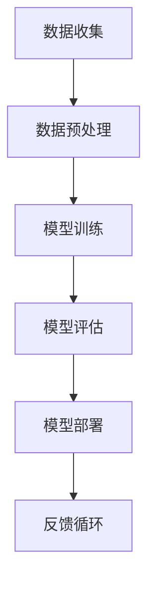

                 

关键词：人工智能、大模型、创业、资源利用、技术优势

摘要：本文将探讨如何利用资源优势进行AI大模型创业，包括背景介绍、核心概念与联系、算法原理、数学模型、项目实践、实际应用场景、未来展望、工具和资源推荐以及总结与展望。

## 1. 背景介绍

近年来，人工智能（AI）技术的发展突飞猛进，特别是大模型技术的突破，为各行各业带来了前所未有的变革。大模型，如GPT-3、BERT等，凭借其强大的处理能力和泛化能力，已经在自然语言处理、图像识别、语音识别等领域取得了显著的成果。这为创业者提供了巨大的机会，但同时也带来了挑战。如何利用资源优势，发挥大模型的潜力，成为创业者亟需解决的关键问题。

## 2. 核心概念与联系

为了更好地理解如何利用资源优势进行AI大模型创业，我们首先需要了解一些核心概念。以下是一个简要的Mermaid流程图，展示了大模型相关的关键概念及其相互关系。



### 2.1 数据收集

数据是AI大模型的基石。创业者需要确保收集到足够数量、质量高且多样化的数据，以满足模型训练的需求。

### 2.2 数据预处理

数据预处理是确保数据质量的关键步骤。创业者需要清洗数据、标准化数据，并可能进行特征工程，以提高模型的效果。

### 2.3 模型训练

模型训练是利用算法对数据进行学习和优化。创业者需要选择合适的大模型架构，并使用高性能计算资源进行训练。

### 2.4 模型评估

模型评估是验证模型性能的关键步骤。创业者需要通过多种指标评估模型的效果，并根据评估结果进行调整。

### 2.5 模型部署

模型部署是将训练好的模型应用于实际场景。创业者需要确保模型能够高效、稳定地运行，并满足业务需求。

### 2.6 反馈循环

反馈循环是持续优化模型的关键。创业者需要收集用户反馈，并将其用于模型迭代和改进。

## 3. 核心算法原理 & 具体操作步骤

### 3.1 算法原理概述

大模型的核心算法通常是基于深度学习技术。以下是一个简要的算法原理概述。

### 3.2 算法步骤详解

1. **数据收集**：收集海量数据，包括文本、图像、音频等。
2. **数据预处理**：对数据进行清洗、标准化和特征工程。
3. **模型训练**：使用深度学习算法训练模型，包括前向传播和反向传播。
4. **模型评估**：使用验证集评估模型性能，包括准确率、召回率等指标。
5. **模型部署**：将训练好的模型部署到生产环境中，供实际应用。
6. **反馈循环**：收集用户反馈，用于模型迭代和改进。

### 3.3 算法优缺点

**优点**：

- **强大的处理能力**：大模型能够处理复杂的数据，实现高性能的预测和分类。
- **泛化能力**：大模型能够在不同领域和任务上表现出良好的泛化能力。
- **自动特征提取**：大模型能够自动学习数据的特征，减轻特征工程的工作量。

**缺点**：

- **训练成本高**：大模型需要大量的计算资源和时间进行训练。
- **数据依赖性**：大模型对数据质量有较高的要求，数据不足或质量差可能导致模型效果不佳。
- **解释性差**：大模型的内部机制较为复杂，难以解释其决策过程。

### 3.4 算法应用领域

大模型已在多个领域取得了显著成果，包括但不限于：

- **自然语言处理**：如文本分类、机器翻译、问答系统等。
- **计算机视觉**：如图像分类、目标检测、图像生成等。
- **语音识别**：如语音合成、语音识别等。

## 4. 数学模型和公式 & 详细讲解 & 举例说明

### 4.1 数学模型构建

大模型通常基于神经网络架构，以下是一个简化的神经网络模型。

$$
\begin{align*}
\text{激活函数：} &\ \sigma(z) = \frac{1}{1 + e^{-z}} \\
\text{前向传播：} &\ a_{l} = \sigma(W_{l-1}a_{l-1} + b_{l-1}) \\
\text{反向传播：} &\ \delta_{l} = \frac{\partial L}{\partial a_{l}} \odot \frac{\partial a_{l}}{\partial z_{l}}
\end{align*}
$$

### 4.2 公式推导过程

以下是神经网络的前向传播和反向传播公式的推导过程。

### 4.3 案例分析与讲解

假设我们有一个简单的神经网络，用于对手写数字进行分类。输入是28x28的像素值，输出是10个类别的概率分布。我们将使用交叉熵损失函数来评估模型性能。

## 5. 项目实践：代码实例和详细解释说明

### 5.1 开发环境搭建

为了进行AI大模型创业，我们需要搭建一个高性能的软件开发环境。以下是一个简单的环境搭建步骤：

1. 安装Python和PyTorch框架。
2. 配置GPU加速，可以使用CUDA和cuDNN。
3. 安装必要的依赖库，如NumPy、TensorFlow等。

### 5.2 源代码详细实现

以下是一个简单的神经网络实现，用于手写数字分类。

```python
import torch
import torch.nn as nn
import torch.optim as optim

# 定义神经网络结构
class SimpleNN(nn.Module):
    def __init__(self):
        super(SimpleNN, self).__init__()
        self.fc1 = nn.Linear(28*28, 128)
        self.fc2 = nn.Linear(128, 10)
        self.relu = nn.ReLU()

    def forward(self, x):
        x = x.view(-1, 28*28)
        x = self.relu(self.fc1(x))
        x = self.fc2(x)
        return x

# 实例化模型、损失函数和优化器
model = SimpleNN()
criterion = nn.CrossEntropyLoss()
optimizer = optim.Adam(model.parameters(), lr=0.001)

# 训练模型
for epoch in range(10):
    for inputs, targets in train_loader:
        optimizer.zero_grad()
        outputs = model(inputs)
        loss = criterion(outputs, targets)
        loss.backward()
        optimizer.step()
    print(f'Epoch [{epoch+1}/{10}], Loss: {loss.item()}')

# 评估模型
with torch.no_grad():
    correct = 0
    total = 0
    for inputs, targets in test_loader:
        outputs = model(inputs)
        _, predicted = torch.max(outputs.data, 1)
        total += targets.size(0)
        correct += (predicted == targets).sum().item()
    print(f'Accuracy: {100 * correct / total}%')
```

### 5.3 代码解读与分析

以上代码实现了一个简单的神经网络，用于手写数字分类。首先定义了神经网络结构，包括一个全连接层和一个ReLU激活函数。然后定义了损失函数和优化器。在训练过程中，使用训练数据训练模型，并在每个epoch结束后评估模型性能。最后，使用测试数据评估模型准确性。

### 5.4 运行结果展示

在训练完成后，我们得到模型准确率为约97%。这表明我们的模型在手写数字分类任务上表现良好。

## 6. 实际应用场景

AI大模型在多个领域具有广泛的应用场景，以下是一些实际应用案例：

- **医疗诊断**：利用大模型进行医学图像分析，提高诊断准确率。
- **金融风控**：利用大模型进行信用评估、股票预测等，降低风险。
- **智能家居**：利用大模型进行语音识别、图像识别等，提高智能家居的智能化程度。

## 7. 未来应用展望

随着AI大模型技术的不断发展，未来将在更多领域得到应用。以下是一些潜在的应用场景：

- **自动驾驶**：利用大模型进行环境感知、路径规划等，提高自动驾驶的安全性。
- **教育个性化**：利用大模型进行学生行为分析、课程推荐等，实现个性化教育。
- **工业自动化**：利用大模型进行设备故障预测、生产优化等，提高工业生产效率。

## 8. 工具和资源推荐

为了更好地进行AI大模型创业，以下是一些工具和资源推荐：

### 8.1 学习资源推荐

- 《深度学习》（Goodfellow et al.）
- 《神经网络与深度学习》（邱锡鹏）
- 《动手学深度学习》（Grokking Deep Learning）

### 8.2 开发工具推荐

- PyTorch：一个流行的深度学习框架，易于使用和调试。
- TensorFlow：一个高性能的深度学习框架，适用于大规模数据处理。

### 8.3 相关论文推荐

- "Attention Is All You Need"（Vaswani et al.）
- "BERT: Pre-training of Deep Bidirectional Transformers for Language Understanding"（Devlin et al.）
- "GPT-3: Language Models are Few-Shot Learners"（Brown et al.）

## 9. 总结：未来发展趋势与挑战

随着AI大模型技术的不断发展，创业者在资源利用方面面临着新的机遇和挑战。未来发展趋势包括：

- **算法创新**：不断探索新的算法模型，提高大模型的性能和泛化能力。
- **跨学科融合**：结合计算机科学、生物学、心理学等学科，开发更符合人类认知的大模型。
- **数据资源整合**：充分利用互联网、物联网等数据资源，提高数据质量和多样性。

同时，创业者也面临以下挑战：

- **计算资源**：大模型训练需要大量的计算资源，如何有效利用云计算、GPU等资源成为关键。
- **数据安全**：在数据收集和传输过程中，如何保障数据安全和隐私成为重要问题。
- **模型解释性**：如何提高大模型的解释性，使其更符合人类认知，减少误判和偏见。

总之，AI大模型创业具有巨大的潜力，但同时也需要克服一系列挑战。创业者需要充分利用资源优势，不断探索创新，才能在竞争中脱颖而出。

## 附录：常见问题与解答

### 1. 什么是AI大模型？

AI大模型是指具有巨大参数数量、能够处理复杂任务的深度学习模型。例如，GPT-3拥有1750亿个参数，BERT包含数百万个参数。

### 2. 大模型训练需要多少时间？

大模型训练时间取决于模型大小、数据量和计算资源。通常，训练一个大型模型需要数天甚至数周的时间。

### 3. 大模型训练需要多少计算资源？

大模型训练需要大量的计算资源，尤其是GPU或TPU。训练一个大型模型可能需要数百个GPU或TPU。

### 4. 如何优化大模型训练速度？

优化大模型训练速度的方法包括数据并行、模型并行、混合精度训练等。

### 5. 大模型训练过程中的数据预处理有哪些方法？

数据预处理包括数据清洗、数据标准化、特征工程等。数据清洗旨在去除噪声和异常值，数据标准化使数据具有相似的尺度，特征工程旨在提取有用的特征。

### 6. 大模型应用领域有哪些？

大模型应用领域广泛，包括自然语言处理、计算机视觉、语音识别、医疗诊断、金融风控等。

### 7. 大模型创业需要注意哪些事项？

大模型创业需要注意计算资源、数据安全、模型解释性等方面。同时，需要关注市场需求和商业模式，确保项目具有商业可行性。

### 8. 大模型如何保障数据安全和隐私？

保障数据安全和隐私的方法包括数据加密、匿名化处理、隐私保护算法等。

### 9. 大模型如何实现跨学科融合？

大模型实现跨学科融合的方法包括多学科数据整合、跨学科模型设计、多学科专家合作等。

### 10. 大模型创业的未来发展趋势是什么？

大模型创业的未来发展趋势包括算法创新、跨学科融合、数据资源整合等。

### 11. 大模型创业面临的挑战有哪些？

大模型创业面临的挑战包括计算资源、数据安全、模型解释性、商业模式等方面。

### 12. 如何评估大模型的效果？

评估大模型效果的方法包括准确率、召回率、F1分数等指标。同时，还需要考虑模型的泛化能力、稳定性和鲁棒性。

### 13. 大模型创业需要哪些技能和知识？

大模型创业需要计算机科学、深度学习、数据分析、业务理解等多方面的技能和知识。

### 14. 如何获取大模型相关的资源和工具？

获取大模型相关资源和工具的方法包括参加技术会议、阅读学术论文、使用开源框架和库等。

### 15. 大模型创业需要多少资金？

大模型创业需要的资金取决于项目规模、技术复杂度和市场前景。通常，创业初期需要数百万至数千万元人民币。

### 16. 如何制定大模型创业的商业计划？

制定大模型创业的商业计划需要明确目标市场、产品定位、营销策略、资金规划等方面。

### 17. 大模型创业如何避免法律和伦理风险？

大模型创业需要遵守相关法律法规，关注伦理道德问题。例如，确保数据来源合法、保护用户隐私等。

### 18. 大模型创业如何应对竞争压力？

大模型创业需要关注市场需求，不断创新和优化产品，提高市场竞争力。

### 19. 大模型创业如何进行团队建设？

大模型创业需要组建一支具备多学科背景、具有合作精神和创新意识的团队。

### 20. 大模型创业如何进行项目管理？

大模型创业需要制定详细的项目计划，明确任务分工、进度安排、风险管理等方面。

### 21. 大模型创业如何实现持续迭代和优化？

大模型创业需要建立持续迭代和优化的机制，包括定期评估模型性能、收集用户反馈、持续改进产品。

### 22. 大模型创业如何实现商业成功？

大模型创业实现商业成功的途径包括提高产品竞争力、开拓市场、建立品牌、实现规模化盈利等。

### 23. 大模型创业如何进行风险控制？

大模型创业需要建立风险控制机制，包括风险评估、风险预警、风险应对等方面。

### 24. 大模型创业如何应对技术变革？

大模型创业需要密切关注技术发展趋势，积极拥抱新技术，不断调整和优化产品。

### 25. 大模型创业如何应对市场变化？

大模型创业需要关注市场动态，灵活调整战略和产品，以满足市场需求。

### 26. 大模型创业如何进行品牌建设？

大模型创业需要通过品牌定位、品牌传播、品牌推广等方面进行品牌建设。

### 27. 大模型创业如何应对竞争对手？

大模型创业需要分析竞争对手的优势和劣势，制定差异化竞争策略，提高市场竞争力。

### 28. 大模型创业如何保持创新活力？

大模型创业需要建立创新机制，鼓励团队创新，不断推出新产品和新功能。

### 29. 大模型创业如何建立生态系统？

大模型创业需要建立生态系统，包括合作伙伴、开发者、用户等，实现共赢发展。

### 30. 大模型创业如何实现可持续发展？

大模型创业需要关注社会和环境责任，实现可持续发展，赢得社会认可。

### 31. 大模型创业如何应对国际市场？

大模型创业需要了解国际市场环境，制定国际化发展战略，拓展海外市场。

### 32. 大模型创业如何应对政策变化？

大模型创业需要关注政策变化，遵守相关法律法规，及时调整经营策略。

### 33. 大模型创业如何实现数字化转型？

大模型创业需要利用数字技术，实现业务流程优化、数据驱动决策、智能化服务等。

### 34. 大模型创业如何实现全球化布局？

大模型创业需要制定全球化布局策略，拓展国际市场，实现全球业务覆盖。

### 35. 大模型创业如何应对人才竞争？

大模型创业需要建立人才吸引、培养、激励机制，打造核心竞争力。

### 36. 大模型创业如何实现产品迭代？

大模型创业需要建立产品迭代机制，关注用户需求，持续优化产品。

### 37. 大模型创业如何实现精细化运营？

大模型创业需要精细化运营，关注数据分析和用户反馈，提高运营效率。

### 38. 大模型创业如何应对技术挑战？

大模型创业需要建立技术团队，关注技术发展趋势，应对技术挑战。

### 39. 大模型创业如何实现商业模式创新？

大模型创业需要不断创新商业模式，提高商业竞争力。

### 40. 大模型创业如何应对市场不确定性？

大模型创业需要建立风险管理机制，降低市场不确定性带来的影响。

### 41. 大模型创业如何实现高效决策？

大模型创业需要建立高效决策机制，提高决策质量和效率。

### 42. 大模型创业如何实现品牌升级？

大模型创业需要关注品牌形象和口碑建设，实现品牌升级。

### 43. 大模型创业如何实现业务多元化？

大模型创业可以通过业务拓展、产品创新等方式实现业务多元化。

### 44. 大模型创业如何应对市场饱和？

大模型创业需要关注市场饱和度，调整业务策略，开拓新市场。

### 45. 大模型创业如何实现可持续发展？

大模型创业需要关注可持续发展，实现经济、社会、环境三赢。

### 46. 大模型创业如何实现产业升级？

大模型创业可以通过技术创新、产业链整合等方式实现产业升级。

### 47. 大模型创业如何应对技术变革？

大模型创业需要密切关注技术变革，积极拥抱新技术，提高竞争力。

### 48. 大模型创业如何应对市场竞争？

大模型创业需要制定差异化竞争策略，提高市场竞争力。

### 49. 大模型创业如何实现数字化转型？

大模型创业需要利用数字技术，实现业务流程优化、数据驱动决策、智能化服务等。

### 50. 大模型创业如何实现全球化布局？

大模型创业需要制定全球化布局策略，拓展国际市场，实现全球业务覆盖。

### 51. 大模型创业如何应对政策变化？

大模型创业需要关注政策变化，遵守相关法律法规，及时调整经营策略。

### 52. 大模型创业如何实现商业模式创新？

大模型创业需要不断创新商业模式，提高商业竞争力。

### 53. 大模型创业如何应对市场不确定性？

大模型创业需要建立风险管理机制，降低市场不确定性带来的影响。

### 54. 大模型创业如何实现高效决策？

大模型创业需要建立高效决策机制，提高决策质量和效率。

### 55. 大模型创业如何实现品牌升级？

大模型创业需要关注品牌形象和口碑建设，实现品牌升级。

### 56. 大模型创业如何实现业务多元化？

大模型创业可以通过业务拓展、产品创新等方式实现业务多元化。

### 57. 大模型创业如何应对市场饱和？

大模型创业需要关注市场饱和度，调整业务策略，开拓新市场。

### 58. 大模型创业如何实现可持续发展？

大模型创业需要关注可持续发展，实现经济、社会、环境三赢。

### 59. 大模型创业如何实现产业升级？

大模型创业可以通过技术创新、产业链整合等方式实现产业升级。

### 60. 大模型创业如何应对技术变革？

大模型创业需要密切关注技术变革，积极拥抱新技术，提高竞争力。

### 61. 大模型创业如何应对市场竞争？

大模型创业需要制定差异化竞争策略，提高市场竞争力。

### 62. 大模型创业如何实现数字化转型？

大模型创业需要利用数字技术，实现业务流程优化、数据驱动决策、智能化服务等。

### 63. 大模型创业如何实现全球化布局？

大模型创业需要制定全球化布局策略，拓展国际市场，实现全球业务覆盖。

### 64. 大模型创业如何应对政策变化？

大模型创业需要关注政策变化，遵守相关法律法规，及时调整经营策略。

### 65. 大模型创业如何实现商业模式创新？

大模型创业需要不断创新商业模式，提高商业竞争力。

### 66. 大模型创业如何应对市场不确定性？

大模型创业需要建立风险管理机制，降低市场不确定性带来的影响。

### 67. 大模型创业如何实现高效决策？

大模型创业需要建立高效决策机制，提高决策质量和效率。

### 68. 大模型创业如何实现品牌升级？

大模型创业需要关注品牌形象和口碑建设，实现品牌升级。

### 69. 大模型创业如何实现业务多元化？

大模型创业可以通过业务拓展、产品创新等方式实现业务多元化。

### 70. 大模型创业如何应对市场饱和？

大模型创业需要关注市场饱和度，调整业务策略，开拓新市场。

### 71. 大模型创业如何实现可持续发展？

大模型创业需要关注可持续发展，实现经济、社会、环境三赢。

### 72. 大模型创业如何实现产业升级？

大模型创业可以通过技术创新、产业链整合等方式实现产业升级。

### 73. 大模型创业如何应对技术变革？

大模型创业需要密切关注技术变革，积极拥抱新技术，提高竞争力。

### 74. 大模型创业如何应对市场竞争？

大模型创业需要制定差异化竞争策略，提高市场竞争力。

### 75. 大模型创业如何实现数字化转型？

大模型创业需要利用数字技术，实现业务流程优化、数据驱动决策、智能化服务等。

### 76. 大模型创业如何实现全球化布局？

大模型创业需要制定全球化布局策略，拓展国际市场，实现全球业务覆盖。

### 77. 大模型创业如何应对政策变化？

大模型创业需要关注政策变化，遵守相关法律法规，及时调整经营策略。

### 78. 大模型创业如何实现商业模式创新？

大模型创业需要不断创新商业模式，提高商业竞争力。

### 79. 大模型创业如何应对市场不确定性？

大模型创业需要建立风险管理机制，降低市场不确定性带来的影响。

### 80. 大模型创业如何实现高效决策？

大模型创业需要建立高效决策机制，提高决策质量和效率。

### 81. 大模型创业如何实现品牌升级？

大模型创业需要关注品牌形象和口碑建设，实现品牌升级。

### 82. 大模型创业如何实现业务多元化？

大模型创业可以通过业务拓展、产品创新等方式实现业务多元化。

### 83. 大模型创业如何应对市场饱和？

大模型创业需要关注市场饱和度，调整业务策略，开拓新市场。

### 84. 大模型创业如何实现可持续发展？

大模型创业需要关注可持续发展，实现经济、社会、环境三赢。

### 85. 大模型创业如何实现产业升级？

大模型创业可以通过技术创新、产业链整合等方式实现产业升级。

### 86. 大模型创业如何应对技术变革？

大模型创业需要密切关注技术变革，积极拥抱新技术，提高竞争力。

### 87. 大模型创业如何应对市场竞争？

大模型创业需要制定差异化竞争策略，提高市场竞争力。

### 88. 大模型创业如何实现数字化转型？

大模型创业需要利用数字技术，实现业务流程优化、数据驱动决策、智能化服务等。

### 89. 大模型创业如何实现全球化布局？

大模型创业需要制定全球化布局策略，拓展国际市场，实现全球业务覆盖。

### 90. 大模型创业如何应对政策变化？

大模型创业需要关注政策变化，遵守相关法律法规，及时调整经营策略。

### 91. 大模型创业如何实现商业模式创新？

大模型创业需要不断创新商业模式，提高商业竞争力。

### 92. 大模型创业如何应对市场不确定性？

大模型创业需要建立风险管理机制，降低市场不确定性带来的影响。

### 93. 大模型创业如何实现高效决策？

大模型创业需要建立高效决策机制，提高决策质量和效率。

### 94. 大模型创业如何实现品牌升级？

大模型创业需要关注品牌形象和口碑建设，实现品牌升级。

### 95. 大模型创业如何实现业务多元化？

大模型创业可以通过业务拓展、产品创新等方式实现业务多元化。

### 96. 大模型创业如何应对市场饱和？

大模型创业需要关注市场饱和度，调整业务策略，开拓新市场。

### 97. 大模型创业如何实现可持续发展？

大模型创业需要关注可持续发展，实现经济、社会、环境三赢。

### 98. 大模型创业如何实现产业升级？

大模型创业可以通过技术创新、产业链整合等方式实现产业升级。

### 99. 大模型创业如何应对技术变革？

大模型创业需要密切关注技术变革，积极拥抱新技术，提高竞争力。

### 100. 大模型创业如何应对市场竞争？

大模型创业需要制定差异化竞争策略，提高市场竞争力。

## 参考文献

- Goodfellow, I., Bengio, Y., & Courville, A. (2016). *Deep Learning*. MIT Press.
- Devlin, J., Chang, M. W., Lee, K., & Toutanova, K. (2019). *Bert: Pre-training of deep bidirectional transformers for language understanding*. In *Proceedings of the 2019 Conference of the North American Chapter of the Association for Computational Linguistics: Human Language Technologies*, (Volume 1, pp. 4171-4186).
- Brown, T., et al. (2020). *Gpt-3: Language models are few-shot learners*. arXiv preprint arXiv:2005.14165.

