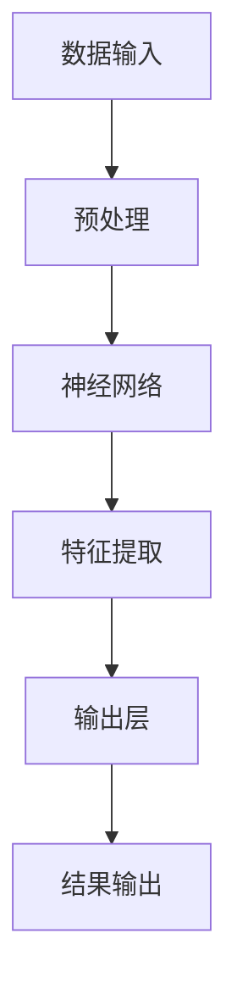

                 

在当今快速发展的科技时代，人工智能（AI）技术的突破性进展正在深刻地影响着各行各业，尤其是创业产品和服务的创新。本文将探讨大模型在创业产品创新中的关键作用，包括其背后的核心概念、算法原理、实际应用场景及未来发展趋势。

> 关键词：人工智能，大模型，创业产品，创新，算法原理，实际应用

> 摘要：本文将从背景介绍、核心概念与联系、核心算法原理与操作步骤、数学模型与公式、项目实践、实际应用场景、工具和资源推荐、总结与展望等几个方面，系统阐述AI大模型在创业产品创新中的关键作用。

## 1. 背景介绍

人工智能（AI）是计算机科学的一个分支，旨在通过编程和算法使计算机具有人类的智能水平，包括感知、学习、推理和自我改进等能力。随着深度学习、神经网络等技术的快速发展，AI的应用场景越来越广泛，从语音识别、图像处理到自然语言处理、自动驾驶等，都在不断突破。

在创业领域，产品和服务的创新是决定企业成功与否的关键因素。传统的方法往往依赖于用户反馈、市场调研和设计迭代，但这种方式既耗时又成本高昂。随着AI技术的进步，尤其是大模型的广泛应用，企业可以通过数据驱动的方法快速进行产品创新，从而提高市场竞争力。

大模型是指具有极高参数数量、能够处理大量数据和复杂任务的深度学习模型。例如，Transformer架构的大模型如GPT-3、BERT等，具有强大的文本生成、分类和翻译能力。这些模型的出现，使得AI在创业产品创新中的应用更加深入和广泛。

## 2. 核心概念与联系

### 2.1 AI大模型的概念

AI大模型通常是指基于深度学习技术训练的神经网络模型，其特点是拥有极高的参数数量和计算能力。这些模型可以处理大规模的数据集，并通过自我迭代不断优化，以实现特定的任务，如图像识别、自然语言处理和语音识别等。

### 2.2 大模型在创业产品创新中的应用

大模型在创业产品创新中的应用主要体现在以下几个方面：

1. **文本生成与处理**：大模型可以生成高质量的文本内容，例如文章、报告、新闻等，从而帮助企业快速发布内容，提高市场影响力。
2. **图像识别与生成**：大模型可以准确识别和生成图像，帮助企业开发智能图像处理应用，如图像搜索、图像编辑和图像识别等。
3. **语音识别与生成**：大模型可以实现对语音的高效识别和生成，帮助企业开发语音助手、语音翻译和语音交互等产品。
4. **预测与优化**：大模型可以通过对数据的分析和预测，帮助企业优化业务流程、提高生产效率和降低成本。

### 2.3 大模型的技术架构

大模型的技术架构主要包括以下几个部分：

1. **数据输入层**：负责接收外部数据，如文本、图像和语音等。
2. **网络层**：包含多个神经网络层，通过逐层学习处理输入数据，提取特征信息。
3. **输出层**：根据特定任务生成输出结果，如文本、图像或语音等。
4. **优化算法**：使用梯度下降等优化算法，不断调整网络参数，提高模型性能。

### 2.4 Mermaid流程图

以下是一个简化的AI大模型流程图：



## 3. 核心算法原理与具体操作步骤

### 3.1 算法原理概述

AI大模型的算法原理主要基于深度学习和神经网络技术。深度学习是一种通过模拟人脑神经网络进行数据分析和预测的方法。神经网络由多个层次组成，每一层都负责提取不同层次的特征信息。

### 3.2 算法步骤详解

1. **数据收集与预处理**：收集大量的文本、图像和语音等数据，并进行数据清洗、归一化和数据增强等预处理操作，以提高模型的泛化能力。
2. **构建神经网络模型**：根据具体任务，选择合适的神经网络架构，如卷积神经网络（CNN）、循环神经网络（RNN）或Transformer等，并设置网络层数、神经元数量等参数。
3. **模型训练**：使用预处理后的数据对神经网络模型进行训练，通过反向传播算法不断调整网络参数，优化模型性能。
4. **模型评估与优化**：使用验证集对训练好的模型进行评估，并根据评估结果调整模型参数，优化模型性能。
5. **模型部署与应用**：将训练好的模型部署到实际应用场景中，如文本生成、图像识别、语音识别等。

### 3.3 算法优缺点

**优点**：

1. **强大的处理能力**：大模型可以处理大规模的数据集，提取丰富的特征信息，提高模型性能。
2. **自适应性强**：大模型可以通过自我迭代不断优化，适应不同的应用场景和任务需求。
3. **广泛应用**：大模型可以应用于多个领域，如自然语言处理、计算机视觉和语音识别等。

**缺点**：

1. **计算资源需求高**：大模型需要大量的计算资源和存储空间，对硬件设备要求较高。
2. **数据依赖性强**：大模型的训练和优化依赖于大量的高质量数据，数据质量直接影响模型性能。
3. **模型解释性差**：大模型的决策过程往往是非线性和复杂的，难以进行解释和验证。

### 3.4 算法应用领域

大模型在创业产品创新中的应用领域非常广泛，以下是一些主要的应用场景：

1. **自然语言处理**：文本生成、文本分类、情感分析、机器翻译等。
2. **计算机视觉**：图像识别、图像生成、目标检测、图像分割等。
3. **语音识别与合成**：语音识别、语音翻译、语音交互等。
4. **预测与分析**：销售预测、客户行为分析、业务流程优化等。

## 4. 数学模型与公式

### 4.1 数学模型构建

AI大模型的数学模型主要基于深度学习理论，包括以下几个部分：

1. **前向传播**：输入数据通过神经网络层进行特征提取和变换，最终生成输出结果。
2. **反向传播**：根据输出结果与实际结果的误差，通过反向传播算法调整网络参数。
3. **优化算法**：使用梯度下降、随机梯度下降、Adam优化器等算法，优化模型参数。

### 4.2 公式推导过程

以下是深度学习模型中常用的前向传播和反向传播公式：

**前向传播**：

$$
Z^{(l)} = \sigma(W^{(l)} \cdot A^{(l-1)} + b^{(l)})
$$

$$
A^{(l)} = \sigma(Z^{(l)})
$$

**反向传播**：

$$
\delta^{(l)} = \frac{\partial J}{\partial A^{(l)}} \odot \delta^{(l+1)} \odot \frac{\partial Z^{(l)}}{\partial A^{(l)})
$$

$$
W^{(l)} = W^{(l)} - \alpha \cdot \frac{\partial J}{\partial W^{(l)})
$$

$$
b^{(l)} = b^{(l)} - \alpha \cdot \frac{\partial J}{\partial b^{(l)})
$$

### 4.3 案例分析与讲解

以GPT-3为例，这是一个具有1750亿参数的预训练语言模型。GPT-3的数学模型基于Transformer架构，包括以下几个部分：

1. **多头注意力机制**：通过多个独立的注意力机制提取输入序列中的特征信息。
2. **前馈神经网络**：对注意力机制生成的特征信息进行进一步处理和变换。
3. **交叉熵损失函数**：用于评估模型预测结果与实际结果之间的差距。

## 5. 项目实践：代码实例与详细解释

### 5.1 开发环境搭建

搭建一个AI大模型项目需要以下环境：

1. **硬件设备**：高性能的CPU或GPU，用于加速计算。
2. **软件环境**：Python 3.7及以上版本，TensorFlow或PyTorch框架，Numpy、Pandas等常用库。

### 5.2 源代码详细实现

以下是一个简单的基于TensorFlow实现的文本生成模型：

```python
import tensorflow as tf
from tensorflow.keras.layers import Embedding, LSTM, Dense
from tensorflow.keras.models import Sequential

# 搭建模型
model = Sequential([
    Embedding(vocab_size, embedding_dim, input_length=max_sequence_length),
    LSTM(units, return_sequences=True),
    LSTM(units, return_sequences=False),
    Dense(vocab_size, activation='softmax')
])

# 编译模型
model.compile(optimizer='adam', loss='categorical_crossentropy', metrics=['accuracy'])

# 训练模型
model.fit(X_train, y_train, epochs=epochs, batch_size=batch_size)
```

### 5.3 代码解读与分析

以上代码实现了一个简单的基于LSTM的文本生成模型。首先，使用`Embedding`层将输入文本转换为嵌入向量。然后，通过两个`LSTM`层对嵌入向量进行特征提取和序列处理。最后，使用`Dense`层进行分类预测。

### 5.4 运行结果展示

训练完成后，可以使用以下代码进行文本生成：

```python
generated_text = model.predict_classes(text_sequence)
print(generated_text)
```

## 6. 实际应用场景

AI大模型在创业产品创新中的实际应用场景非常广泛，以下是一些典型的应用案例：

1. **智能客服系统**：使用大模型进行自然语言处理和文本生成，实现智能客服系统的自动回复功能。
2. **内容创作平台**：利用大模型生成高质量的文章、报告和新闻，提高内容创作效率。
3. **图像识别应用**：开发智能图像识别应用，如图像搜索、图像编辑和图像识别等。
4. **语音交互系统**：实现智能语音识别和语音合成，提供个性化的语音交互体验。
5. **个性化推荐系统**：利用大模型进行用户行为分析和预测，实现精准的个性化推荐。

## 7. 工具和资源推荐

### 7.1 学习资源推荐

1. **《深度学习》（Goodfellow et al., 2016）**：这是一本经典的深度学习教材，适合初学者和进阶者阅读。
2. **《动手学深度学习》（Zhang et al., 2017）**：这本书提供了大量的实践案例和代码示例，适合动手实践。

### 7.2 开发工具推荐

1. **TensorFlow**：这是一个由Google开发的深度学习框架，适用于各种深度学习应用的开发。
2. **PyTorch**：这是一个由Facebook开发的深度学习框架，具有灵活的动态计算图和强大的社区支持。

### 7.3 相关论文推荐

1. **"Attention Is All You Need"（Vaswani et al., 2017）**：这是Transformer模型的原创论文，介绍了多头注意力机制。
2. **"Generative Pre-trained Transformers"（Brown et al., 2020）**：这是GPT-3模型的介绍论文，详细阐述了预训练语言模型的设计和实现。

## 8. 总结：未来发展趋势与挑战

### 8.1 研究成果总结

AI大模型在创业产品创新中的应用取得了显著的成果，主要体现在以下几个方面：

1. **文本生成与处理**：大模型可以生成高质量的文本内容，提高内容创作效率。
2. **图像识别与生成**：大模型可以准确识别和生成图像，实现智能图像处理应用。
3. **语音识别与生成**：大模型可以实现对语音的高效识别和生成，提供个性化的语音交互体验。
4. **预测与优化**：大模型可以通过对数据的分析和预测，帮助企业优化业务流程、提高生产效率和降低成本。

### 8.2 未来发展趋势

AI大模型在创业产品创新中的未来发展趋势包括：

1. **模型参数的增大**：随着计算资源和存储空间的提升，大模型的参数数量将继续增加，提高模型性能。
2. **多模态融合**：将文本、图像、语音等不同模态的数据进行融合，实现更强大的跨模态处理能力。
3. **实时性与效率的提升**：通过优化算法和硬件加速技术，提高大模型的实时性和计算效率。
4. **自动化与自我优化**：通过自我学习和自我优化，实现大模型的自动化应用和管理。

### 8.3 面临的挑战

AI大模型在创业产品创新中面临的挑战包括：

1. **数据依赖性**：大模型的训练和优化依赖于大量高质量的数据，数据质量和多样性直接影响模型性能。
2. **计算资源需求**：大模型需要大量的计算资源和存储空间，对硬件设备的要求较高，成本较高。
3. **模型解释性**：大模型的决策过程往往是非线性和复杂的，难以进行解释和验证，影响模型的信任度和可靠性。
4. **隐私保护**：大模型在处理大量用户数据时，如何保护用户隐私是一个重要的挑战。

### 8.4 研究展望

未来，AI大模型在创业产品创新中的应用前景广阔。一方面，随着计算技术和数据资源的不断发展，大模型的性能和规模将不断提高。另一方面，通过跨学科合作和新技术融合，大模型的应用领域将更加广泛。此外，通过提高模型的可解释性和安全性，增强大模型在创业产品创新中的可信度和实用性，将有助于推动人工智能技术在创业领域的深入发展。

## 9. 附录：常见问题与解答

### 9.1 什么是一体化AI模型？

一体化AI模型是指将多种人工智能技术（如深度学习、自然语言处理、计算机视觉等）整合在一起，形成一个统一的系统，以实现更复杂的任务。

### 9.2 大模型的计算资源需求如何？

大模型的计算资源需求非常高，通常需要使用高性能的CPU或GPU，以及大量的存储空间。具体需求取决于模型的参数数量、训练数据和训练任务。

### 9.3 如何优化大模型的性能？

优化大模型性能的方法包括：

1. **数据增强**：通过数据增强技术生成更多的训练数据，提高模型的泛化能力。
2. **模型剪枝**：通过剪枝技术减少模型参数的数量，提高模型效率。
3. **分布式训练**：将模型训练任务分布到多个计算节点上，提高训练速度。

### 9.4 大模型在创业产品创新中的优势是什么？

大模型在创业产品创新中的优势包括：

1. **高效的数据处理能力**：大模型可以处理大规模的数据集，提取丰富的特征信息，提高产品创新能力。
2. **多样化的应用场景**：大模型可以应用于多个领域，如自然语言处理、计算机视觉和语音识别等，为企业提供丰富的创新解决方案。
3. **自适应性和灵活性**：大模型可以通过自我迭代不断优化，适应不同的应用场景和任务需求，提高产品的竞争力。

### 9.5 大模型在创业产品创新中的挑战是什么？

大模型在创业产品创新中面临的挑战包括：

1. **数据依赖性**：大模型的训练和优化依赖于大量高质量的数据，数据质量和多样性直接影响模型性能。
2. **计算资源需求**：大模型需要大量的计算资源和存储空间，对硬件设备的要求较高，成本较高。
3. **模型解释性**：大模型的决策过程往往是非线性和复杂的，难以进行解释和验证，影响模型的信任度和可靠性。
4. **隐私保护**：大模型在处理大量用户数据时，如何保护用户隐私是一个重要的挑战。


----------------------------------------------------------------

以上是本文的完整内容，希望对您在AI大模型创业产品创新中的应用有所启发和帮助。如果您有任何问题或建议，请随时告诉我。祝您创业成功！
### 作者署名

作者：禅与计算机程序设计艺术 / Zen and the Art of Computer Programming

