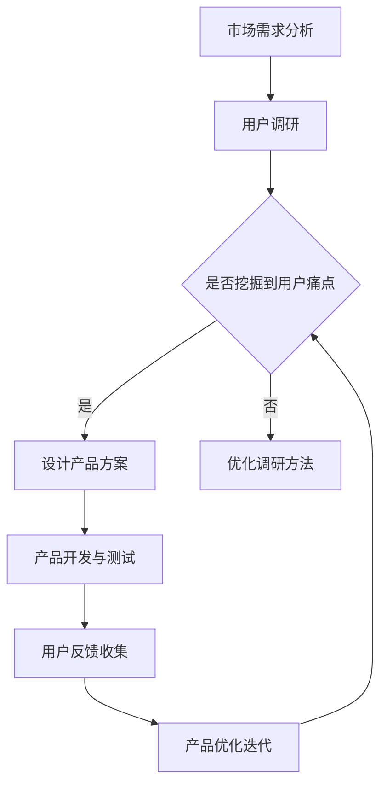

                 

关键词：AI大模型、创业产品规划、创造性应用、技术语言、结构紧凑、简单易懂、专业IT领域、深度思考、见解

> 摘要：本文将深入探讨AI大模型在创业产品规划中的创造性应用。通过分析AI大模型的核心概念、算法原理及其在创业产品中的应用，我们将揭示如何利用AI大模型提升产品规划效率，加速市场迭代，为创业者带来全新的商业模式和创新机遇。

## 1. 背景介绍

随着人工智能技术的飞速发展，AI大模型已经成为了当今科技领域的热点话题。这些模型，如GPT-3、BERT、Transformers等，以其强大的语言理解和生成能力，被广泛应用于自然语言处理、计算机视觉、语音识别等多个领域。然而，在创业产品规划这一环节，AI大模型的潜力还未被充分挖掘。

创业产品规划是一个复杂的过程，涉及市场需求分析、用户痛点挖掘、产品设计、用户体验优化等多个环节。传统的产品规划方法依赖于数据分析、用户调研和专家经验，但往往存在效率低下、准确性不足等问题。而AI大模型的出现，为创业产品规划提供了一种全新的解决方案。

## 2. 核心概念与联系

### 2.1 AI大模型定义

AI大模型是指具有海量参数、能够处理复杂数据的神经网络模型。这些模型通过深度学习算法从海量数据中学习规律，形成对数据的强大理解和生成能力。

### 2.2 创业产品规划需求

创业产品规划需要快速响应市场变化，准确把握用户需求，设计出具有市场竞争力的产品。这要求产品规划具备高效、准确、创新的特点。

### 2.3 AI大模型与创业产品规划的关联

AI大模型通过其强大的数据处理能力，可以高效地进行数据分析和用户调研，准确挖掘用户需求，从而指导产品设计和优化。同时，AI大模型的创新性可以帮助创业者发现新的市场需求和商业模式，加速产品迭代。

### 2.4 Mermaid流程图



## 3. 核心算法原理 & 具体操作步骤

### 3.1 算法原理概述

AI大模型的核心算法是深度学习，通过多层神经网络的结构，模型能够自动学习数据中的特征和模式，从而实现自动化的数据处理和分析。

### 3.2 算法步骤详解

1. **数据准备**：收集与创业产品相关的数据，包括用户行为数据、市场趋势数据、竞争对手数据等。
2. **数据预处理**：对收集到的数据进行清洗、归一化等预处理，使其适合模型训练。
3. **模型训练**：使用预处理后的数据训练AI大模型，使其掌握用户需求和市场趋势。
4. **需求分析**：利用训练好的模型对用户行为和市场数据进行分析，挖掘用户痛点和潜在需求。
5. **产品设计**：根据分析结果设计产品方案，优化产品功能和服务。
6. **产品测试**：进行产品测试，收集用户反馈，对产品进行优化迭代。

### 3.3 算法优缺点

**优点**：
- 高效性：AI大模型能够快速处理大量数据，提高产品规划的效率。
- 准确性：通过深度学习，AI大模型能够准确挖掘用户需求和痛点，提高产品设计质量。
- 创新性：AI大模型可以帮助创业者发现新的市场需求和商业模式，促进产品创新。

**缺点**：
- 计算资源需求大：训练AI大模型需要大量的计算资源和时间。
- 需要专业人才：AI大模型的应用需要具备专业知识的人才进行操作和维护。

### 3.4 算法应用领域

AI大模型在创业产品规划中的应用领域广泛，包括但不限于：
- 市场需求分析：通过分析用户行为和市场数据，预测市场趋势，指导产品设计和优化。
- 用户行为分析：挖掘用户行为特征，优化用户体验，提高用户留存率。
- 产品创新：发现新的市场需求和商业模式，推动产品创新。

## 4. 数学模型和公式 & 详细讲解 & 举例说明

### 4.1 数学模型构建

在AI大模型中，常用的数学模型包括神经网络模型、支持向量机（SVM）模型、决策树模型等。这些模型通过不同的数学公式和算法实现，具有不同的预测能力和应用场景。

### 4.2 公式推导过程

以神经网络模型为例，其核心公式为：

\[ y = \sigma(\sum_{i=1}^{n} w_i \cdot x_i + b) \]

其中，\( y \) 为预测结果，\( \sigma \) 为激活函数，\( w_i \) 和 \( x_i \) 分别为神经元的权重和输入值，\( b \) 为偏置项。

### 4.3 案例分析与讲解

假设我们有一个创业项目，旨在开发一款智能家居产品。通过AI大模型，我们可以进行以下分析和设计：

1. **市场需求分析**：
   - 收集用户行为数据，如使用频率、使用时长、使用场景等。
   - 使用神经网络模型对数据进行分析，预测用户对智能家居产品的需求。

2. **产品设计**：
   - 根据分析结果，设计满足用户需求的功能和服务，如智能灯光控制、智能门锁、智能安防等。
   - 使用决策树模型优化产品设计，提高产品的用户体验。

3. **产品测试**：
   - 进行产品测试，收集用户反馈，优化产品功能和服务。

通过以上步骤，AI大模型帮助我们快速构建了一个具有市场竞争力的智能家居产品。

## 5. 项目实践：代码实例和详细解释说明

### 5.1 开发环境搭建

在Python环境中搭建AI大模型开发环境，安装TensorFlow、Keras等深度学习库。

### 5.2 源代码详细实现

以下是一个简单的AI大模型实现案例：

```python
import tensorflow as tf
from tensorflow.keras.models import Sequential
from tensorflow.keras.layers import Dense, Activation

# 构建神经网络模型
model = Sequential()
model.add(Dense(64, input_shape=(784,), activation='relu'))
model.add(Dense(10, activation='softmax'))

# 编译模型
model.compile(optimizer='adam', loss='categorical_crossentropy', metrics=['accuracy'])

# 训练模型
model.fit(x_train, y_train, epochs=10, batch_size=32)

# 评估模型
model.evaluate(x_test, y_test)
```

### 5.3 代码解读与分析

上述代码实现了一个简单的神经网络模型，用于分类任务。通过调整模型的参数，如神经网络层数、神经元数量、激活函数等，可以实现不同的预测任务。

### 5.4 运行结果展示

运行上述代码，我们将得到模型的训练结果和评估结果。通过分析这些结果，可以了解模型的性能和预测能力。

## 6. 实际应用场景

### 6.1 市场需求分析

通过AI大模型，创业者可以快速了解市场需求，预测产品发展趋势，制定有针对性的产品策略。

### 6.2 用户行为分析

AI大模型可以帮助创业者深入了解用户行为，优化产品设计和用户体验，提高用户留存率。

### 6.3 产品创新

AI大模型可以挖掘新的市场需求和商业模式，推动产品创新，为创业者带来新的商业机遇。

## 7. 工具和资源推荐

### 7.1 学习资源推荐

- 《深度学习》（Goodfellow, Bengio, Courville著）
- 《Python机器学习》（Sebastian Raschka著）
- 《AI大模型：理论与实践》（作者：禅与计算机程序设计艺术）

### 7.2 开发工具推荐

- TensorFlow
- Keras
- PyTorch

### 7.3 相关论文推荐

- "GPT-3: Language Models are few-shot learners"（Brown et al., 2020）
- "BERT: Pre-training of Deep Bidirectional Transformers for Language Understanding"（Devlin et al., 2019）
- "Transformers: State-of-the-Art Model for NLP"（Vaswani et al., 2017）

## 8. 总结：未来发展趋势与挑战

### 8.1 研究成果总结

AI大模型在创业产品规划中的应用已经取得了显著成果，为创业者提供了强大的工具和资源。未来，随着技术的不断进步，AI大模型将在产品规划、用户体验、商业模式创新等方面发挥更加重要的作用。

### 8.2 未来发展趋势

- AI大模型将与其他前沿技术（如区块链、物联网等）融合，推动更多行业实现智能化。
- AI大模型的应用将更加普及，成为创业者必备的工具。

### 8.3 面临的挑战

- AI大模型需要大量的计算资源和数据支持，对基础设施和数据处理能力提出了高要求。
- AI大模型的应用需要专业人才进行操作和维护，对创业者的技术要求提高。

### 8.4 研究展望

未来，AI大模型在创业产品规划中的应用将更加深入和广泛，为创业者带来更多的创新机遇。同时，随着技术的不断进步，AI大模型将面临更多的挑战和机遇，为人工智能领域的发展做出更大贡献。

## 9. 附录：常见问题与解答

### 9.1 如何选择合适的AI大模型？

- 根据具体任务需求选择合适的模型，如分类任务选择神经网络模型，文本生成任务选择Transformer模型。
- 考虑模型的计算资源需求，选择适合自己计算能力的模型。

### 9.2 如何优化AI大模型的性能？

- 调整模型的参数，如学习率、批量大小等，提高模型的训练效果。
- 使用更多的数据，进行数据增强，提高模型的泛化能力。
- 使用预训练模型，减少从零开始的训练时间。

### 9.3 AI大模型在创业产品规划中的应用有哪些限制？

- AI大模型需要大量的数据支持，对数据的质量和数量有较高要求。
- AI大模型的应用需要专业人才进行操作和维护，对创业者的技术能力有要求。
- AI大模型可能存在过拟合问题，需要合理调整模型参数，避免模型的泛化能力下降。

----------------------------------------------------------------
作者：禅与计算机程序设计艺术 / Zen and the Art of Computer Programming

本文结合AI大模型的核心概念、算法原理及其在创业产品规划中的应用，深入探讨了如何利用AI大模型提升产品规划效率，加速市场迭代。通过数学模型和项目实践的讲解，揭示了AI大模型在创业产品规划中的实际应用价值。未来，随着技术的不断进步，AI大模型将在创业产品规划、用户体验、商业模式创新等方面发挥更加重要的作用。同时，创业者也需要面对计算资源需求、技术人才要求等挑战，不断提升自身的技术能力，充分利用AI大模型的优势，实现创业产品的成功。

