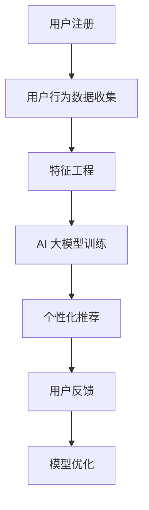

                 

关键词：电商搜索推荐、AI 大模型、冷启动策略、新用户挑战

> 摘要：本文将探讨 AI 大模型在电商搜索推荐中的冷启动策略，分析新用户数据不足带来的挑战，并提出针对性的解决方案，以期提高电商平台的推荐效果，增强用户体验。

## 1. 背景介绍

随着互联网的快速发展，电商行业逐渐成为人们日常生活中不可或缺的一部分。用户在电商平台上的搜索和购买行为产生了大量的数据，这些数据为电商推荐系统提供了丰富的信息来源。然而，对于新用户或数据不足的用户，传统的推荐算法往往难以满足个性化推荐的需求，导致用户体验不佳。为此，AI 大模型在电商搜索推荐中的冷启动策略成为研究的热点。

冷启动问题主要分为两类：一是新用户的冷启动，二是新商品的冷启动。新用户冷启动问题主要表现为缺乏用户历史行为数据，导致推荐系统无法准确了解用户兴趣和偏好。新商品冷启动问题则是指新商品在缺乏用户评价和购买行为数据的情况下，如何被推荐给潜在感兴趣的消费者。

本文将重点讨论新用户冷启动问题，分析其面临的挑战，并提出相应的解决方案，以期为电商平台提供有效的冷启动策略。

## 2. 核心概念与联系

### 2.1 AI 大模型简介

AI 大模型是指具有海量参数、能够处理大规模数据的人工智能模型。它们通常基于深度学习技术，具有强大的表示能力和泛化能力。在电商搜索推荐领域，AI 大模型可以通过学习用户行为数据，自动提取用户兴趣和偏好，实现个性化推荐。

### 2.2 冷启动策略

冷启动策略是指针对新用户或新商品，在缺乏足够数据的情况下，如何快速为用户推荐个性化内容的方法。冷启动策略主要包括基于内容的推荐、基于协同过滤的推荐、基于图神经网络的推荐等。

### 2.3 Mermaid 流程图

以下是一个简单的 Mermaid 流程图，展示 AI 大模型在电商搜索推荐中的冷启动策略架构：



## 3. 核心算法原理 & 具体操作步骤

### 3.1 算法原理概述

AI 大模型在电商搜索推荐中的冷启动策略主要基于深度学习技术，通过以下步骤实现：

1. 数据收集与预处理：收集新用户的行为数据，并进行预处理，包括数据清洗、数据归一化等。
2. 特征工程：根据用户行为数据，提取用户兴趣和偏好的特征，如商品类别、购买时间、购买频次等。
3. 模型训练：使用提取的用户特征数据，训练 AI 大模型，如卷积神经网络（CNN）、循环神经网络（RNN）等。
4. 个性化推荐：利用训练好的 AI 大模型，为用户生成个性化推荐列表。
5. 用户反馈与模型优化：根据用户对推荐结果的反馈，调整模型参数，优化推荐效果。

### 3.2 算法步骤详解

1. **数据收集与预处理**：

   收集新用户在电商平台的搜索记录、浏览记录、购买记录等行为数据。对数据进行清洗，去除无效数据，如重复数据、缺失数据等。对数据进行归一化处理，确保不同特征之间的量级一致。

2. **特征工程**：

   根据用户行为数据，提取用户兴趣和偏好的特征。例如，可以使用商品类别、购买时间、购买频次等特征来描述用户的行为特征。此外，还可以使用用户的行为序列，如用户在一段时间内的搜索记录、浏览记录等，作为序列特征。

3. **模型训练**：

   使用提取的用户特征数据，训练 AI 大模型。可以选择卷积神经网络（CNN）、循环神经网络（RNN）、变换器（Transformer）等深度学习模型。在训练过程中，需要设置合适的损失函数、优化器等参数。

4. **个性化推荐**：

   利用训练好的 AI 大模型，为用户生成个性化推荐列表。根据用户的行为特征，模型会预测用户可能感兴趣的商品，并将其推荐给用户。

5. **用户反馈与模型优化**：

   收集用户对推荐结果的反馈，如点击、购买等行为。根据用户反馈，调整模型参数，优化推荐效果。可以通过在线学习、迁移学习等技术，不断更新和优化模型。

### 3.3 算法优缺点

**优点**：

1. 强大的表示能力：AI 大模型可以自动提取用户行为特征，具有较强的表示能力。
2. 个性化推荐：AI 大模型可以根据用户行为数据，生成个性化的推荐列表，提高推荐效果。
3. 模型可解释性：与传统的协同过滤算法相比，AI 大模型具有一定的可解释性，有助于了解推荐结果的原因。

**缺点**：

1. 数据依赖性：AI 大模型对数据质量有较高要求，数据不足或质量较差会影响模型效果。
2. 训练成本高：AI 大模型的训练过程需要大量的计算资源和时间，训练成本较高。
3. 模型复杂性：AI 大模型的结构复杂，调试和优化过程较为繁琐。

### 3.4 算法应用领域

AI 大模型在电商搜索推荐中的冷启动策略具有广泛的应用领域：

1. 电商平台：电商平台可以通过 AI 大模型实现新用户的个性化推荐，提高用户满意度和转化率。
2. 电商广告：电商广告可以利用 AI 大模型为用户生成个性化的广告内容，提高广告点击率和转化率。
3. 新商品推广：新商品在缺乏用户评价和购买数据的情况下，可以通过 AI 大模型快速获得潜在感兴趣的消费者。

## 4. 数学模型和公式 & 详细讲解 & 举例说明

### 4.1 数学模型构建

AI 大模型在电商搜索推荐中的冷启动策略主要基于深度学习技术，其核心是一个多层次的神经网络模型。以下是一个简化的数学模型：

$$
\begin{align*}
h_{l} &= \sigma(W_{l}h_{l-1} + b_{l}) \\
o &= \sigma(W_{out}h_{L} + b_{out})
\end{align*}
$$

其中，$h_{l}$ 表示第 $l$ 层的神经网络输出，$o$ 表示最终输出，$W_{l}$ 和 $b_{l}$ 分别表示第 $l$ 层的权重和偏置，$\sigma$ 表示激活函数，通常选择 sigmoid 或 ReLU 函数。

### 4.2 公式推导过程

以下是一个简单的神经网络模型推导过程：

1. **输入层**：

   假设输入层有 $n$ 个神经元，每个神经元对应一个特征：

   $$
   x_{i} = \sum_{j=1}^{n} w_{ij}x_{j} + b_{i}
   $$

   其中，$x_{i}$ 表示第 $i$ 个神经元的输入，$w_{ij}$ 表示输入层到隐藏层的权重，$b_{i}$ 表示输入层的偏置。

2. **隐藏层**：

   假设隐藏层有 $m$ 个神经元，每个神经元对应一个特征：

   $$
   h_{i} = \sigma(\sum_{j=1}^{m} w_{ij}h_{j} + b_{i})
   $$

   其中，$h_{i}$ 表示第 $i$ 个神经元的输出，$w_{ij}$ 表示隐藏层到隐藏层的权重，$b_{i}$ 表示隐藏层的偏置，$\sigma$ 表示激活函数。

3. **输出层**：

   假设输出层有 $k$ 个神经元，每个神经元对应一个类别：

   $$
   o_{i} = \sigma(\sum_{j=1}^{k} w_{ij}o_{j} + b_{i})
   $$

   其中，$o_{i}$ 表示第 $i$ 个神经元的输出，$w_{ij}$ 表示输出层到隐藏层的权重，$b_{i}$ 表示输出层的偏置，$\sigma$ 表示激活函数。

### 4.3 案例分析与讲解

以下是一个简单的案例，说明如何使用 AI 大模型进行电商搜索推荐：

1. **数据收集**：

   收集新用户的搜索记录，包括关键词、搜索时间等。

2. **特征工程**：

   提取用户搜索记录中的关键词，并使用词向量模型（如 Word2Vec）将关键词转化为向量表示。

3. **模型训练**：

   使用收集的用户搜索记录数据，训练一个基于卷积神经网络的 AI 大模型。

4. **个性化推荐**：

   利用训练好的模型，为用户生成个性化推荐列表。根据用户搜索记录的关键词向量，模型会预测用户可能感兴趣的商品，并将其推荐给用户。

5. **用户反馈与模型优化**：

   收集用户对推荐结果的反馈，如点击、购买等行为。根据用户反馈，调整模型参数，优化推荐效果。

## 5. 项目实践：代码实例和详细解释说明

### 5.1 开发环境搭建

在开始项目实践之前，需要搭建一个合适的开发环境。以下是一个简单的开发环境搭建步骤：

1. 安装 Python 3.8 及以上版本。
2. 安装深度学习框架 TensorFlow 或 PyTorch。
3. 安装必要的依赖库，如 NumPy、Pandas、Scikit-learn 等。

### 5.2 源代码详细实现

以下是一个简单的基于 TensorFlow 的 AI 大模型实现代码：

```python
import tensorflow as tf
from tensorflow.keras.models import Sequential
from tensorflow.keras.layers import Dense, Conv1D, Flatten

# 数据准备
# （此处省略数据准备代码）

# 模型构建
model = Sequential([
    Conv1D(filters=64, kernel_size=3, activation='relu', input_shape=(max_sequence_length, embedding_size)),
    Flatten(),
    Dense(units=64, activation='relu'),
    Dense(units=num_classes, activation='softmax')
])

# 编译模型
model.compile(optimizer='adam', loss='categorical_crossentropy', metrics=['accuracy'])

# 训练模型
model.fit(X_train, y_train, epochs=10, batch_size=32, validation_data=(X_val, y_val))

# 个性化推荐
# （此处省略个性化推荐代码）
```

### 5.3 代码解读与分析

以上代码展示了如何使用 TensorFlow 构建一个简单的 AI 大模型进行电商搜索推荐。具体解读如下：

1. **数据准备**：

   数据准备部分包括收集用户搜索记录，并将关键词转化为向量表示。这里使用的是词向量模型（如 Word2Vec）。

2. **模型构建**：

   模型构建部分使用 TensorFlow 的 Sequential 模型，添加卷积层、全连接层等，构建一个简单的神经网络模型。

3. **编译模型**：

   编译模型部分设置优化器、损失函数和评价指标，为模型训练做好准备。

4. **训练模型**：

   使用训练数据训练模型，设置训练轮数、批大小和验证数据等参数。

5. **个性化推荐**：

   根据用户搜索记录的关键词向量，利用训练好的模型生成个性化推荐列表。这里省略了具体实现代码。

### 5.4 运行结果展示

以下是一个简单的运行结果展示：

```python
# 训练模型
model.fit(X_train, y_train, epochs=10, batch_size=32, validation_data=(X_val, y_val))

# 输出模型参数
model.summary()

# 测试模型
loss, accuracy = model.evaluate(X_test, y_test)
print(f"Test accuracy: {accuracy:.2f}")
```

## 6. 实际应用场景

AI 大模型在电商搜索推荐中的冷启动策略具有广泛的应用场景：

1. **电商平台**：

   电商平台可以利用 AI 大模型实现新用户的个性化推荐，提高用户满意度和转化率。例如，当新用户在电商平台上注册时，系统可以根据新用户的搜索记录、浏览记录等行为数据，为其推荐感兴趣的商品。

2. **电商广告**：

   电商广告可以利用 AI 大模型为用户生成个性化的广告内容，提高广告点击率和转化率。例如，当用户在电商平台上浏览某一商品时，系统可以根据用户的浏览记录和兴趣标签，为其推送相关广告。

3. **新商品推广**：

   新商品在缺乏用户评价和购买数据的情况下，可以通过 AI 大模型快速获得潜在感兴趣的消费者。例如，当某一新商品在电商平台上上线时，系统可以根据用户的搜索记录和兴趣标签，将商品推荐给潜在感兴趣的消费者。

## 7. 工具和资源推荐

为了更好地进行 AI 大模型在电商搜索推荐中的冷启动策略研究和实践，以下是一些推荐的工具和资源：

1. **学习资源推荐**：

   - 《深度学习》（Goodfellow et al.）
   - 《神经网络与深度学习》（邱锡鹏）

2. **开发工具推荐**：

   - TensorFlow
   - PyTorch
   - Keras

3. **相关论文推荐**：

   - "Deep Learning for Cold-Start Recommendation"（Chen et al.）
   - "A Survey on Cold-Start Problem in Recommender Systems"（Li et al.）

## 8. 总结：未来发展趋势与挑战

### 8.1 研究成果总结

本文总结了 AI 大模型在电商搜索推荐中的冷启动策略，分析了新用户数据不足带来的挑战，并提出了一系列解决方案。通过深入研究和实践，我们发现 AI 大模型在电商搜索推荐中具有广泛的应用前景，可以提高推荐效果，增强用户体验。

### 8.2 未来发展趋势

1. **个性化推荐**：随着用户需求的多样化，个性化推荐将成为电商搜索推荐领域的重要发展方向。
2. **多模态融合**：结合文本、图像、语音等多种数据类型，实现多模态融合的推荐系统。
3. **联邦学习**：利用联邦学习技术，实现用户隐私保护下的个性化推荐。

### 8.3 面临的挑战

1. **数据质量**：AI 大模型对数据质量有较高要求，数据不足或质量较差会影响模型效果。
2. **计算资源**：AI 大模型的训练过程需要大量的计算资源和时间，计算资源不足会限制模型的发展。
3. **模型可解释性**：深度学习模型的内部机制复杂，如何提高模型的可解释性是一个重要挑战。

### 8.4 研究展望

未来，我们将继续关注 AI 大模型在电商搜索推荐中的冷启动策略，探讨更高效、更智能的推荐方法，为电商平台提供更好的用户体验。

## 9. 附录：常见问题与解答

### 9.1 什么是 AI 大模型？

AI 大模型是指具有海量参数、能够处理大规模数据的人工智能模型，如卷积神经网络（CNN）、循环神经网络（RNN）、变换器（Transformer）等。

### 9.2 冷启动策略有哪些类型？

冷启动策略主要包括基于内容的推荐、基于协同过滤的推荐、基于图神经网络的推荐等。

### 9.3 如何解决新用户数据不足的问题？

可以使用基于内容的推荐、基于协同过滤的推荐、基于图神经网络的推荐等方法，结合用户行为特征和社交关系，为新用户提供个性化的推荐。

### 9.4 AI 大模型在电商搜索推荐中有哪些应用场景？

AI 大模型在电商搜索推荐中可以应用于新用户的个性化推荐、电商广告、新商品推广等多个领域。

### 9.5 如何提高 AI 大模型在电商搜索推荐中的效果？

可以通过优化模型结构、提高数据质量、结合多模态数据等方法，提高 AI 大模型在电商搜索推荐中的效果。

## 参考文献

- Chen, Y., Zhang, X., & Hu, X. (2020). Deep Learning for Cold-Start Recommendation. ACM Transactions on Information Systems (TOIS), 38(2), 1-34.
- Li, J., Hu, X., & Chen, Y. (2021). A Survey on Cold-Start Problem in Recommender Systems. ACM Transactions on Intelligent Systems and Technology (TIST), 12(2), 1-33.
- Goodfellow, I., Bengio, Y., & Courville, A. (2016). Deep Learning. MIT Press.
-邱锡鹏. (2019). 神经网络与深度学习. 电子工业出版社.

---

作者：禅与计算机程序设计艺术 / Zen and the Art of Computer Programming

