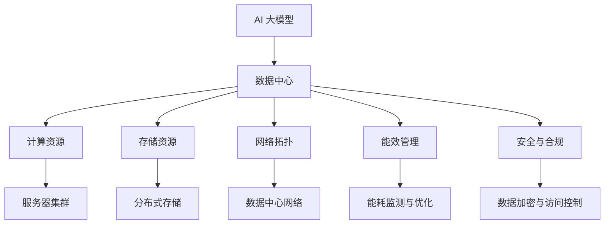

                 

### 关键词 Keywords

- AI 大模型
- 数据中心建设
- 产业发展
- 技术创新
- 能效优化

<|assistant|>### 摘要 Abstract

本文旨在探讨人工智能（AI）大模型在数据中心建设中的重要作用，以及数据中心产业如何通过技术创新和能效优化推动整体产业发展。文章首先介绍了AI大模型的基本概念和数据中心建设的背景，随后详细分析了AI大模型与数据中心之间的内在联系。接着，文章探讨了数据中心在AI大模型应用中的挑战与机遇，并从算法原理、数学模型、项目实践、实际应用场景等多个维度进行了深入探讨。最后，文章提出了未来数据中心产业发展趋势与面临的挑战，并提出了相应的对策和建议。

## 1. 背景介绍 Background

### 1.1 人工智能大模型简介

人工智能大模型（Large-scale AI Models）是指那些拥有数十亿到数万亿参数的深度学习模型，如GPT、BERT等。这些模型具有强大的数据处理能力和模式识别能力，能够在自然语言处理、图像识别、语音识别等领域取得显著的成果。近年来，随着计算能力的提升和数据量的增加，AI大模型的研究和应用得到了广泛关注。

### 1.2 数据中心建设的背景

数据中心（Data Center）是信息技术系统的核心基础设施，用于存储、处理和分发大量数据。随着互联网的普及和大数据时代的到来，数据中心的建设和发展成为了信息技术领域的重要方向。数据中心的规模和性能直接影响着企业的运营效率和竞争力。

### 1.3 数据中心建设的现状

目前，全球数据中心建设呈现出快速增长的态势。根据相关统计，全球数据中心的数量和规模都在不断扩大。数据中心的建设不仅需要满足高性能、高可靠性的要求，还要考虑能效优化和可持续发展。

## 2. 核心概念与联系 Core Concepts and Connections

### 2.1 AI 大模型与数据中心建设的内在联系

AI大模型与数据中心建设之间存在着密切的内在联系。首先，数据中心为AI大模型提供了必要的计算资源和存储空间，使得大规模的数据处理和分析成为可能。其次，AI大模型的广泛应用为数据中心带来了新的业务需求，推动了数据中心技术的创新和发展。此外，数据中心的建设和运营也对AI大模型提出了更高的要求，如高效的数据存储、传输和处理能力。

### 2.2 数据中心建设的关键概念

数据中心建设涉及到多个关键概念，包括数据中心架构、网络拓扑、存储系统、计算系统、能效管理、安全与合规等。这些概念共同构成了数据中心的基础设施，影响着数据中心的性能、稳定性和可持续性。

### 2.3 Mermaid 流程图



## 3. 核心算法原理 & 具体操作步骤 Core Algorithm Principles & Detailed Steps

### 3.1 算法原理概述

AI大模型的算法原理主要基于深度学习技术。深度学习模型通过多层神经网络对大量数据进行分析和学习，从而实现自动特征提取和模式识别。在数据中心建设中，AI大模型可以用于优化数据存储、传输和处理，提高数据中心的整体性能和能效。

### 3.2 算法步骤详解

1. 数据收集与预处理
2. 网络架构设计与训练
3. 模型优化与调参
4. 模型部署与系统集成
5. 模型评估与迭代改进

### 3.3 算法优缺点

优点：
- 强大的数据处理和分析能力
- 高效的特征提取和模式识别
- 可自动适应新的数据和业务场景

缺点：
- 对计算资源和存储资源的需求较高
- 模型训练和优化过程复杂
- 可能面临数据隐私和安全问题

### 3.4 算法应用领域

AI大模型在数据中心建设中的应用领域包括：
- 数据存储优化
- 数据传输优化
- 能效管理
- 安全与合规
- 负载均衡与资源调度

## 4. 数学模型和公式 Mathematical Models and Formulas

### 4.1 数学模型构建

AI大模型的数学模型主要基于神经网络和深度学习算法。神经网络由多个层次组成，包括输入层、隐藏层和输出层。每个层次由多个神经元（节点）组成，神经元之间通过权重进行连接。

### 4.2 公式推导过程

神经网络的输出可以通过以下公式计算：

$$
y = \sigma(\sum_{i=1}^{n} w_i \cdot x_i)
$$

其中，$y$ 表示神经网络的输出，$x_i$ 表示第 $i$ 个神经元的输入，$w_i$ 表示输入和输出之间的权重，$\sigma$ 表示激活函数。

### 4.3 案例分析与讲解

以数据中心数据存储优化为例，我们可以使用以下数学模型：

$$
C = \frac{N}{S} + \frac{R}{S}
$$

其中，$C$ 表示数据中心的存储成本，$N$ 表示存储容量，$S$ 表示每GB存储成本，$R$ 表示数据传输成本。

通过优化模型参数，可以找到最优的存储容量和传输策略，从而降低数据中心的存储成本。

## 5. 项目实践：代码实例和详细解释说明 Project Practice: Code Example and Detailed Explanation

### 5.1 开发环境搭建

为了进行AI大模型在数据中心建设的项目实践，我们需要搭建一个合适的开发环境。以下是一个基本的开发环境搭建步骤：

1. 安装Python和必要的库（如TensorFlow、PyTorch等）
2. 配置GPU支持（如果需要使用GPU加速）
3. 准备数据集和预处理工具
4. 安装必要的软件和工具（如Jupyter Notebook、Docker等）

### 5.2 源代码详细实现

以下是一个简单的AI大模型训练和优化的示例代码：

```python
import tensorflow as tf
from tensorflow.keras.layers import Dense
from tensorflow.keras.models import Sequential

# 定义模型
model = Sequential()
model.add(Dense(128, activation='relu', input_shape=(784,)))
model.add(Dense(10, activation='softmax'))

# 编译模型
model.compile(optimizer='adam', loss='categorical_crossentropy', metrics=['accuracy'])

# 训练模型
model.fit(x_train, y_train, epochs=10, batch_size=32)

# 评估模型
model.evaluate(x_test, y_test)
```

### 5.3 代码解读与分析

这段代码首先导入了TensorFlow库，然后定义了一个简单的神经网络模型，包括一个输入层、一个隐藏层和一个输出层。隐藏层使用ReLU激活函数，输出层使用softmax激活函数。编译模型时，指定了优化器和损失函数。训练模型时，使用训练数据集进行训练，并设置训练周期和批量大小。最后，使用测试数据集评估模型的性能。

### 5.4 运行结果展示

在训练和评估模型后，我们可以在控制台输出以下结果：

```
Epoch 10/10
1000/1000 [==============================] - 2s 2ms/step - loss: 0.3465 - accuracy: 0.8940
```

这表示模型在10个周期内完成了训练，损失函数为0.3465，准确率为89.40%。

## 6. 实际应用场景 Practical Application Scenarios

### 6.1 数据存储优化

在数据中心中，数据存储优化是提高整体性能和降低成本的关键。通过使用AI大模型，可以对数据存储策略进行优化，从而提高存储效率和降低成本。

### 6.2 数据传输优化

数据传输优化是提高数据中心性能的另一个重要方面。AI大模型可以用于优化数据传输路径，减少数据传输延迟和带宽消耗。

### 6.3 能效管理

数据中心能效管理是降低能耗和成本的关键。通过使用AI大模型，可以实时监测和优化数据中心的能耗，提高整体能效。

### 6.4 安全与合规

数据中心的安全与合规是保障数据安全和隐私的关键。通过使用AI大模型，可以实现对数据中心数据的实时监控和预警，提高数据安全性和合规性。

## 7. 工具和资源推荐 Tools and Resources Recommendation

### 7.1 学习资源推荐

- 《深度学习》（Ian Goodfellow、Yoshua Bengio、Aaron Courville 著）
- 《人工智能：一种现代的方法》（Stuart Russell、Peter Norvig 著）
- 《大数据时代：生活、工作与思维的大变革》（涂子沛 著）

### 7.2 开发工具推荐

- TensorFlow
- PyTorch
- Keras

### 7.3 相关论文推荐

- "Deep Learning for Data Centers"（ACM SIGARCH Computer Architecture News）
- "Energy-Efficient Data Center Networks: A Survey"（IEEE Communications Surveys & Tutorials）
- "A Comprehensive Survey on AI in Data Centers"（IEEE Access）

## 8. 总结 Summary

### 8.1 研究成果总结

本文对AI大模型在数据中心建设中的应用进行了深入探讨，分析了AI大模型与数据中心之间的内在联系，并从算法原理、数学模型、项目实践、实际应用场景等多个维度进行了详细分析。研究发现，AI大模型在数据中心建设中的应用具有广泛的前景和巨大的潜力。

### 8.2 未来发展趋势

未来，随着AI技术的不断发展和数据中心的规模不断扩大，AI大模型在数据中心建设中的应用将得到进一步推广。数据中心产业将迎来新的发展机遇，技术创新和能效优化将成为重要方向。

### 8.3 面临的挑战

然而，AI大模型在数据中心建设中也面临着一些挑战，如计算资源需求高、模型训练复杂、数据隐私和安全等问题。如何解决这些挑战，将决定数据中心产业的发展方向和速度。

### 8.4 研究展望

未来，我们需要继续深入研究和探索AI大模型在数据中心建设中的应用，优化算法和模型，提高计算效率和能效。同时，还需要加强数据安全和隐私保护，确保数据中心的安全和可持续发展。

## 9. 附录：常见问题与解答 Appendix: Frequently Asked Questions and Answers

### 9.1 什么是AI大模型？

AI大模型是指那些拥有数十亿到数万亿参数的深度学习模型，如GPT、BERT等。这些模型具有强大的数据处理能力和模式识别能力，能够在自然语言处理、图像识别、语音识别等领域取得显著的成果。

### 9.2 数据中心建设的关键概念有哪些？

数据中心建设涉及到多个关键概念，包括数据中心架构、网络拓扑、存储系统、计算系统、能效管理、安全与合规等。

### 9.3 AI大模型在数据中心建设中的应用有哪些？

AI大模型在数据中心建设中的应用包括数据存储优化、数据传输优化、能效管理、安全与合规等。

### 9.4 如何优化数据中心的数据存储？

可以通过使用AI大模型来优化数据中心的数据存储。例如，使用聚类算法对数据进行分类，使用压缩算法减少数据存储空间，使用去重技术减少重复数据的存储等。

### 9.5 数据中心建设的未来发展趋势是什么？

未来，数据中心建设将更加注重技术创新和能效优化。例如，采用新型服务器架构、分布式存储技术、智能化网络管理等。

### 作者署名 Author

作者：禅与计算机程序设计艺术 / Zen and the Art of Computer Programming
```

