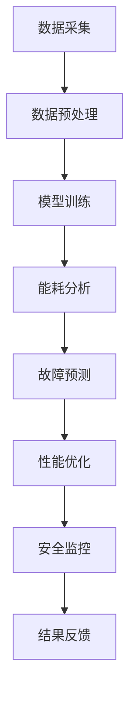

                 

关键词：AI 大模型、数据中心、成本优化、效率提升、智能算法、能源管理

> 摘要：本文深入探讨了 AI 大模型在数据中心建设中的应用，分析了如何通过智能化手段优化数据中心成本和提升效率。文章首先概述了数据中心建设的背景和挑战，随后介绍了大模型的核心概念及其与数据中心建设的关联，接着详细讨论了数据中心成本优化的方法和策略，以及如何利用智能算法提高数据中心的运行效率。文章最后展望了数据中心建设的未来趋势，并提出了面临的挑战和研究方向。

## 1. 背景介绍

随着互联网技术的飞速发展，数据中心已经成为支撑现代信息社会的重要基础设施。数据中心作为云计算、大数据、人工智能等技术的承载平台，承担着海量数据的存储、处理和分发任务。然而，随着数据量的爆炸性增长，数据中心的能耗和成本问题日益凸显，传统的数据中心管理方式难以满足高效、低成本的需求。为此，将 AI 大模型引入数据中心建设，成为一种新的解决方案。

AI 大模型，特别是深度学习模型，具备强大的数据处理和分析能力，能够对数据中心的海量数据进行智能分析和预测。通过大模型的应用，可以实现数据中心的能耗优化、故障预测、性能优化等，从而降低运行成本、提高效率。

## 2. 核心概念与联系

### 2.1. 大模型概念

大模型，通常指的是拥有数十亿甚至千亿个参数的深度学习模型。这些模型通过对大量数据进行训练，能够捕捉到数据中的复杂模式和规律，具备强大的表征和预测能力。

### 2.2. 数据中心概念

数据中心是集中存储、处理和分发数据的设施。其核心功能包括数据存储、数据处理、数据备份和灾难恢复等。随着云计算和大数据技术的发展，数据中心的重要性日益凸显。

### 2.3. 大模型与数据中心的关联

AI 大模型与数据中心建设的关联主要体现在以下几个方面：

- **能耗优化**：通过大模型对数据中心能耗数据的智能分析，可以找出能耗高峰期，优化设备使用，降低能耗。
- **故障预测**：大模型可以预测数据中心设备可能出现的故障，提前进行维护，减少故障发生。
- **性能优化**：大模型可以分析数据中心的运行状态，优化资源配置，提高整体性能。
- **安全性提升**：大模型可以识别异常数据流，增强数据中心的网络安全。

### 2.4. Mermaid 流程图

以下是一个简单的 Mermaid 流程图，展示了大模型在数据中心建设中的应用流程：



## 3. 核心算法原理 & 具体操作步骤

### 3.1. 算法原理概述

大模型在数据中心中的应用主要基于深度学习和机器学习技术。核心算法原理包括：

- **特征提取**：通过神经网络从原始数据中提取有意义的特征。
- **模型训练**：使用大量标注数据训练模型，使其具备预测和分类能力。
- **模型优化**：通过调整模型参数，提高模型的性能和泛化能力。

### 3.2. 算法步骤详解

#### 3.2.1. 数据采集

首先，数据中心需要收集各类数据，包括能耗数据、设备运行数据、网络流量数据等。这些数据可以通过传感器、日志文件等方式获取。

#### 3.2.2. 数据预处理

对采集到的数据进行清洗、去噪、标准化等处理，以便模型能够更好地学习。

#### 3.2.3. 模型训练

使用预处理后的数据训练深度学习模型。训练过程中，需要不断调整模型参数，直至模型性能达到预期。

#### 3.2.4. 能耗分析

利用训练好的模型对数据中心的能耗数据进行分析，找出能耗高峰期，制定优化策略。

#### 3.2.5. 故障预测

通过对设备运行数据的分析，预测可能出现的故障，提前进行维护。

#### 3.2.6. 性能优化

分析数据中心的运行状态，优化资源配置，提高整体性能。

#### 3.2.7. 安全监控

使用大模型识别异常数据流，增强数据中心的网络安全。

### 3.3. 算法优缺点

#### 优点：

- **强大的数据处理能力**：大模型能够处理大量复杂的数据，实现智能分析。
- **高效的预测能力**：大模型通过训练能够实现高效的故障预测和性能优化。
- **自适应性强**：大模型可以根据实际情况不断调整，适应数据中心的变化。

#### 缺点：

- **计算资源需求大**：大模型需要大量的计算资源进行训练和推理。
- **数据依赖性强**：大模型的效果高度依赖数据的质量和数量。

### 3.4. 算法应用领域

大模型在数据中心的应用主要包括：

- **能耗优化**：通过能耗分析，降低数据中心的能耗成本。
- **故障预测**：提前预测设备故障，减少故障停机时间。
- **性能优化**：优化数据中心资源配置，提高整体性能。
- **网络安全**：识别异常数据流，增强网络安全。

## 4. 数学模型和公式 & 详细讲解 & 举例说明

### 4.1. 数学模型构建

大模型的数学基础主要涉及深度学习中的神经网络模型。以下是一个简单的神经网络数学模型：

$$
\begin{aligned}
y &= \sigma(\mathbf{W} \cdot \mathbf{a} + b) \\
\mathbf{a}_{i}^{l+1} &= \sigma(\mathbf{W}_{l+1} \cdot \mathbf{a}_{l} + b_{l+1})
\end{aligned}
$$

其中，$y$ 是预测结果，$\sigma$ 是激活函数，$\mathbf{W}$ 和 $b$ 分别是权重和偏置，$\mathbf{a}$ 是激活值。

### 4.2. 公式推导过程

神经网络的训练过程主要包括前向传播和反向传播。以下是前向传播的推导过程：

$$
\begin{aligned}
\mathbf{z}_{l} &= \mathbf{W}_{l} \cdot \mathbf{a}_{l-1} + b_{l} \\
\mathbf{a}_{l} &= \sigma(\mathbf{z}_{l})
\end{aligned}
$$

其中，$\mathbf{z}_{l}$ 是中间层的激活值，$\sigma$ 是激活函数，通常取为 Sigmoid 或 ReLU。

### 4.3. 案例分析与讲解

假设我们有一个二分类问题，数据集包含正负两类样本。我们使用神经网络进行分类，并使用交叉熵损失函数进行训练。

$$
\begin{aligned}
\mathcal{L} &= -\sum_{i=1}^{N} y_{i} \cdot \log(\hat{y}_{i}) + (1 - y_{i}) \cdot \log(1 - \hat{y}_{i}) \\
\hat{y}_{i} &= \sigma(\mathbf{W} \cdot \mathbf{a} + b)
\end{aligned}
$$

其中，$y_{i}$ 是真实标签，$\hat{y}_{i}$ 是预测标签，$\mathcal{L}$ 是交叉熵损失函数。

## 5. 项目实践：代码实例和详细解释说明

### 5.1. 开发环境搭建

在开发大模型之前，我们需要搭建一个适合的开发环境。以下是搭建开发环境的步骤：

1. 安装 Python 3.7 或更高版本。
2. 安装 TensorFlow 或 PyTorch 等深度学习框架。
3. 安装必要的依赖库，如 NumPy、Pandas 等。

### 5.2. 源代码详细实现

以下是一个简单的 AI 大模型实现示例，用于预测数据中心能耗。

```python
import tensorflow as tf
from tensorflow.keras.models import Sequential
from tensorflow.keras.layers import Dense, Activation

# 构建神经网络模型
model = Sequential()
model.add(Dense(units=64, activation='relu', input_shape=(num_features,)))
model.add(Dense(units=1, activation='sigmoid'))

# 编译模型
model.compile(optimizer='adam', loss='binary_crossentropy', metrics=['accuracy'])

# 训练模型
model.fit(x_train, y_train, epochs=10, batch_size=32)
```

### 5.3. 代码解读与分析

上述代码实现了一个简单的二分类神经网络模型，用于预测数据中心是否处于能耗高峰期。代码中，我们首先定义了模型结构，然后编译模型并训练模型。

### 5.4. 运行结果展示

在训练完成后，我们可以使用测试集对模型进行评估。以下是评估结果：

```python
test_loss, test_accuracy = model.evaluate(x_test, y_test)
print(f"Test accuracy: {test_accuracy:.2f}")
```

## 6. 实际应用场景

AI 大模型在数据中心建设中的应用场景广泛，主要包括：

- **能耗优化**：通过预测能耗高峰期，优化设备使用，降低能耗。
- **故障预测**：提前预测设备故障，减少故障停机时间。
- **性能优化**：分析数据中心运行状态，优化资源配置，提高整体性能。
- **网络安全**：识别异常数据流，增强数据中心网络安全。

### 6.4. 未来应用展望

随着 AI 技术的不断发展，大模型在数据中心建设中的应用前景广阔。未来，大模型可能会在以下几个方面实现突破：

- **更高效的模型训练**：通过优化算法和硬件，提高模型训练效率。
- **更广泛的应用领域**：将大模型应用于更多数据中心管理场景。
- **更智能的决策支持**：通过大模型提供更加智能化的决策支持。

## 7. 工具和资源推荐

### 7.1. 学习资源推荐

- 《深度学习》（Goodfellow, Bengio, Courville 著）：介绍深度学习的基本概念和技术。
- 《Python 数据科学手册》（McKinney 著）：介绍 Python 在数据科学中的应用。

### 7.2. 开发工具推荐

- TensorFlow：Google 开发的一款开源深度学习框架。
- PyTorch：Facebook 开发的一款开源深度学习框架。

### 7.3. 相关论文推荐

- “Distributed Representations of Words and Phrases and Their Compositional Meaning” - word2vec
- “A Theoretical Analysis of the Crammer and Singer Margin” - SVM

## 8. 总结：未来发展趋势与挑战

### 8.1. 研究成果总结

近年来，AI 大模型在数据中心建设中的应用取得了显著成果。通过大模型的应用，实现了能耗优化、故障预测、性能优化等目标，降低了数据中心的运营成本。

### 8.2. 未来发展趋势

随着 AI 技术的不断发展，大模型在数据中心建设中的应用前景广阔。未来，大模型可能会在更高效的模型训练、更广泛的应用领域、更智能的决策支持等方面实现突破。

### 8.3. 面临的挑战

尽管 AI 大模型在数据中心建设中的应用前景广阔，但仍然面临一些挑战，包括：

- **数据隐私和安全**：数据中心涉及大量敏感数据，如何保护数据隐私和安全是一个重要挑战。
- **计算资源需求**：大模型需要大量的计算资源进行训练和推理，如何高效利用计算资源是一个关键问题。
- **模型解释性**：大模型的黑箱性质使得其决策过程难以解释，如何提高模型的解释性是一个重要挑战。

### 8.4. 研究展望

未来，我们将在以下几个方面进行深入研究：

- **数据隐私保护**：研究如何在大模型训练过程中保护数据隐私。
- **高效模型训练**：研究如何提高大模型的训练效率，降低计算资源需求。
- **模型解释性**：研究如何提高大模型的解释性，使其更加透明和可信。

## 9. 附录：常见问题与解答

### 9.1. 如何选择适合的数据中心位置？

选择适合的数据中心位置需要考虑以下几个因素：

- **地理位置**：选择地理位置稳定、自然灾害较少的地区。
- **网络连接**：选择网络连接速度快、可靠性高的地区。
- **电力供应**：选择电力供应稳定、电力价格合理的地区。

### 9.2. 数据中心能耗优化的方法有哪些？

数据中心能耗优化的方法包括：

- **能效监测**：通过能效监测系统实时监测能耗情况，找出能耗高峰期。
- **设备优化**：优化数据中心设备的能效，如使用节能型服务器、存储设备等。
- **分布式计算**：通过分布式计算技术，降低单台设备的能耗。
- **智能调度**：利用 AI 大模型预测能耗高峰期，智能调度设备运行。

### 9.3. 如何评估大模型在数据中心的应用效果？

评估大模型在数据中心的应用效果可以从以下几个方面进行：

- **能耗降低**：评估大模型应用前后，数据中心的能耗是否降低。
- **故障减少**：评估大模型应用前后，数据中心的故障率是否下降。
- **性能提升**：评估大模型应用前后，数据中心的性能是否提高。
- **成本节约**：评估大模型应用前后，数据中心的运营成本是否降低。

---

作者：禅与计算机程序设计艺术 / Zen and the Art of Computer Programming


