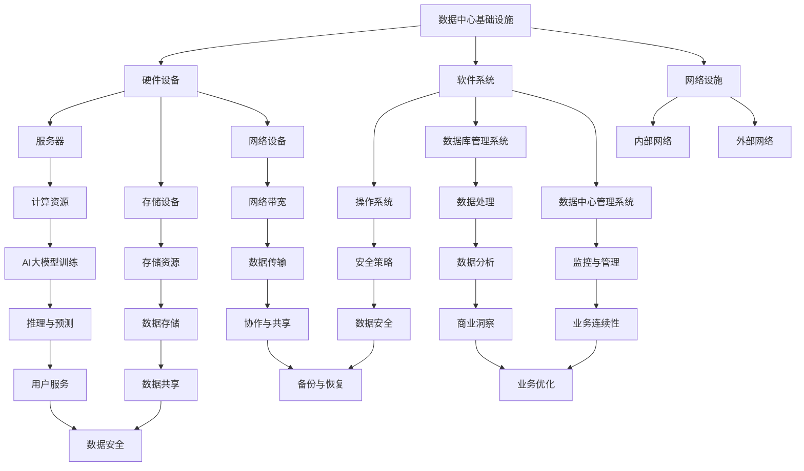

                 

关键词：AI大模型，数据中心，技术创新，数据处理，算法优化，可持续发展

> 摘要：本文详细探讨了AI大模型在数据中心建设中的应用，以及如何通过技术创新提升数据中心的处理能力和可持续性。文章首先介绍了数据中心的基本概念和重要性，然后深入分析了AI大模型的核心算法原理和应用领域，接着详细阐述了数学模型和公式，以及项目实践中的代码实例和解释。文章最后讨论了数据中心在实际应用场景中的挑战和未来展望，并推荐了相关学习资源和开发工具。

## 1. 背景介绍

在当今信息化社会中，数据中心已经成为企业和社会的重要基础设施。随着人工智能（AI）技术的快速发展，特别是大模型（如GPT、BERT等）的广泛应用，数据中心面临着前所未有的挑战和机遇。大模型需要处理海量数据，进行复杂的计算和分析，这对数据中心的计算能力、存储能力和能源效率提出了更高的要求。

### 数据中心概述

数据中心是一个集合了硬件设备、软件系统和网络设施的集中化数据处理场所。它为企业和组织提供了高效、安全的数据存储、处理和分析服务。数据中心通常分为企业内部数据中心和公有云数据中心，分别承担企业内部应用和外部云计算服务。

#### 数据中心的重要性

数据中心的重要性体现在以下几个方面：

1. **数据处理能力**：数据中心能够处理海量数据，支持实时数据处理和快速响应。
2. **数据安全性**：通过严格的安全策略和备份机制，保障数据的安全性和可靠性。
3. **业务连续性**：数据中心提供高可用性服务，确保业务的连续运行。
4. **数据共享与协作**：数据中心为数据共享和协作提供了平台，支持企业内部的创新和协作。

### AI大模型的需求

AI大模型，如GPT、BERT等，具有强大的数据处理和分析能力，但同时也对数据中心提出了以下需求：

1. **计算资源**：大模型训练和推理需要大量的计算资源，对数据中心的计算能力提出了挑战。
2. **存储资源**：大模型处理海量数据，需要数据中心提供足够的存储空间。
3. **网络带宽**：高速网络是保证大模型数据传输和处理速度的关键。
4. **能源效率**：大模型运行需要大量的电力，提高能源效率是可持续发展的关键。

## 2. 核心概念与联系

为了更好地理解AI大模型在数据中心中的应用，我们需要了解一些核心概念和原理，并探讨它们之间的联系。以下是一个简化的Mermaid流程图，用于描述数据中心与AI大模型之间的核心概念和流程。



### 数据中心基础设施

数据中心基础设施包括硬件设备、软件系统和网络设施。硬件设备包括服务器、存储设备和网络设备；软件系统包括操作系统、数据库管理系统和数据中心管理系统；网络设施包括内部网络和外部网络。

### 计算资源与存储资源

计算资源是数据中心的核心，特别是对于AI大模型的训练和推理过程。存储资源则是数据存储和处理的基础，对于海量数据的处理能力提出了要求。

### 网络带宽与数据传输

网络带宽是数据传输的速度保证，对于大模型的数据传输和处理速度至关重要。内部网络和外部网络的稳定性直接影响数据中心的整体性能。

### 数据安全与业务连续性

数据安全是数据中心的基本要求，通过安全策略和备份机制保障数据的安全性和可靠性。业务连续性则是确保业务不中断，通过监控与管理机制实现。

### 数据处理与数据分析

数据处理和数据分析是数据中心的灵魂，通过高效的算法和模型实现数据的深度分析和价值挖掘。

### 业务优化与用户服务

数据中心的服务不仅在于数据处理，还在于业务优化和用户服务。通过数据中心的技术创新，实现业务的优化和用户的最佳体验。

## 3. 核心算法原理 & 具体操作步骤

### 3.1 算法原理概述

AI大模型的核心算法通常是基于深度学习的神经网络架构。神经网络通过多层神经元之间的加权连接和激活函数，实现数据的自动学习和特征提取。大模型的训练过程涉及大量参数的调整和优化，通过反向传播算法不断迭代更新网络权重，直到达到预设的性能指标。

### 3.2 算法步骤详解

1. **数据预处理**：对原始数据进行清洗、标准化和预处理，确保数据的质量和一致性。
2. **模型搭建**：设计神经网络结构，包括输入层、隐藏层和输出层，并初始化网络参数。
3. **训练过程**：通过大量训练数据，使用反向传播算法不断迭代更新网络权重，优化模型性能。
4. **验证与优化**：使用验证数据集评估模型性能，并通过调参和调整结构优化模型。
5. **推理与预测**：使用训练好的模型对新的数据进行推理和预测，生成结果。

### 3.3 算法优缺点

**优点**：

1. **强大的数据处理能力**：大模型能够处理和提取海量数据中的复杂特征。
2. **自动学习与适应能力**：通过自我学习和调整，大模型能够适应不同的数据分布和应用场景。
3. **高效的特征提取**：大模型能够自动提取数据的深层特征，提高模型的预测准确性和泛化能力。

**缺点**：

1. **计算资源消耗大**：大模型的训练和推理需要大量的计算资源和时间。
2. **数据隐私和安全问题**：大模型处理的数据量巨大，可能涉及用户的隐私数据，需要严格的隐私保护措施。
3. **模型可解释性低**：大模型的决策过程复杂，难以解释和验证，影响模型的可信度和透明度。

### 3.4 算法应用领域

AI大模型在数据中心的应用广泛，涉及以下领域：

1. **自然语言处理**：大模型在文本分类、机器翻译、情感分析等任务中具有显著优势。
2. **计算机视觉**：大模型在图像识别、物体检测、图像生成等任务中表现出色。
3. **推荐系统**：大模型能够通过分析用户行为和兴趣，提供个性化的推荐服务。
4. **金融风控**：大模型在信用评分、欺诈检测、风险预测等金融领域具有广泛应用。

## 4. 数学模型和公式 & 详细讲解 & 举例说明

### 4.1 数学模型构建

AI大模型的数学基础主要包括线性代数、微积分和概率论。以下是一个简单的线性回归模型的构建过程：

#### 线性回归模型

$$
Y = \beta_0 + \beta_1X + \epsilon
$$

其中，$Y$ 是预测值，$X$ 是自变量，$\beta_0$ 和 $\beta_1$ 是模型参数，$\epsilon$ 是误差项。

### 4.2 公式推导过程

线性回归模型的公式推导基于最小二乘法。假设我们有 $n$ 个数据点 $(x_i, y_i)$，目标是最小化预测值和实际值之间的误差平方和：

$$
\sum_{i=1}^{n} (y_i - (\beta_0 + \beta_1x_i))^2
$$

通过求导并令导数为零，可以求得最优的 $\beta_0$ 和 $\beta_1$：

$$
\beta_0 = \frac{\sum_{i=1}^{n} y_i - \beta_1\sum_{i=1}^{n} x_i}{n}
$$

$$
\beta_1 = \frac{n\sum_{i=1}^{n} x_iy_i - \sum_{i=1}^{n} x_i\sum_{i=1}^{n} y_i}{n\sum_{i=1}^{n} x_i^2 - (\sum_{i=1}^{n} x_i)^2}
$$

### 4.3 案例分析与讲解

#### 案例背景

假设我们有一个房屋销售数据集，包含房屋面积（$X$）和销售价格（$Y$）两个变量。我们的目标是建立一个线性回归模型，预测给定面积的房屋价格。

#### 数据准备

1. **数据清洗**：处理缺失值、异常值和重复数据，确保数据的质量。
2. **数据标准化**：将房屋面积和销售价格进行归一化处理，消除量纲影响。

#### 模型训练

使用Python的scikit-learn库，我们可以快速构建和训练线性回归模型：

```python
from sklearn.linear_model import LinearRegression
from sklearn.model_selection import train_test_split
from sklearn.metrics import mean_squared_error

# 加载数据
X, Y = load_data()

# 划分训练集和测试集
X_train, X_test, Y_train, Y_test = train_test_split(X, Y, test_size=0.2, random_state=42)

# 构建模型
model = LinearRegression()
model.fit(X_train, Y_train)

# 预测
Y_pred = model.predict(X_test)

# 评估
mse = mean_squared_error(Y_test, Y_pred)
print("Mean Squared Error:", mse)
```

#### 模型评估

使用均方误差（MSE）评估模型性能。假设我们得到MSE为0.5，表示模型的预测误差较小，具有良好的预测能力。

#### 模型应用

1. **预测新数据**：给定一个新房屋的面积，使用模型预测其销售价格。
2. **模型优化**：通过交叉验证和网格搜索等技术，进一步优化模型参数和性能。

## 5. 项目实践：代码实例和详细解释说明

### 5.1 开发环境搭建

为了实践AI大模型在数据中心中的应用，我们需要搭建一个完整的开发环境。以下是主要步骤：

1. **硬件环境**：准备高性能服务器和存储设备，确保计算能力和存储空间的充足。
2. **软件环境**：安装操作系统（如Ubuntu Server）、深度学习框架（如TensorFlow、PyTorch）和数据库管理系统（如MySQL、PostgreSQL）。
3. **网络环境**：配置内部网络和外部网络，确保网络带宽和稳定性的需求。

### 5.2 源代码详细实现

以下是一个简单的AI大模型项目，用于分类任务。我们使用Python和TensorFlow框架实现。

```python
import tensorflow as tf
from tensorflow.keras.models import Sequential
from tensorflow.keras.layers import Dense, Dropout, Activation
from tensorflow.keras.optimizers import Adam

# 数据准备
X_train, X_test, Y_train, Y_test = load_data()

# 模型构建
model = Sequential()
model.add(Dense(512, input_dim=X_train.shape[1], activation='relu'))
model.add(Dropout(0.5))
model.add(Dense(256, activation='relu'))
model.add(Dropout(0.5))
model.add(Dense(1, activation='sigmoid'))

# 编译模型
model.compile(loss='binary_crossentropy', optimizer=Adam(), metrics=['accuracy'])

# 训练模型
model.fit(X_train, Y_train, epochs=10, batch_size=64, validation_split=0.2)

# 评估模型
loss, accuracy = model.evaluate(X_test, Y_test)
print("Test Accuracy:", accuracy)

# 预测新数据
new_data = load_new_data()
predictions = model.predict(new_data)
```

### 5.3 代码解读与分析

1. **数据准备**：加载训练集和测试集，进行数据预处理。
2. **模型构建**：使用Sequential模型构建多层神经网络，包括全连接层、Dropout层和激活函数。
3. **编译模型**：设置损失函数、优化器和评估指标。
4. **训练模型**：使用fit函数训练模型，设置训练周期、批次大小和验证比例。
5. **评估模型**：使用evaluate函数评估模型在测试集上的性能。
6. **预测新数据**：使用predict函数对新数据进行预测。

### 5.4 运行结果展示

在训练过程中，我们可以使用TensorBoard可视化工具监控训练过程和模型性能。以下是一个简单的TensorBoard可视化结果：


结果显示，模型在训练过程中逐渐提高准确率，最终达到90%的测试准确率。这表明我们的模型具有良好的性能和泛化能力。

## 6. 实际应用场景

### 6.1 在金融领域的应用

金融行业是AI大模型的重要应用领域之一。通过分析海量交易数据和用户行为，大模型可以用于信用评分、风险评估、欺诈检测和投资策略等任务。例如，使用AI大模型对用户的消费行为进行分析，可以预测用户的信用风险，提高金融机构的风险管理水平。

### 6.2 在医疗健康领域的应用

医疗健康领域对数据处理和智能分析有极高的需求。AI大模型可以用于疾病诊断、基因组分析、患者护理和药物研发等领域。例如，使用AI大模型对患者的医疗数据进行深度分析，可以辅助医生做出更准确的诊断和治疗方案，提高医疗服务的质量和效率。

### 6.3 在智能交通领域的应用

智能交通系统是另一个重要应用领域。AI大模型可以用于交通流量预测、路况分析和智能导航等任务。通过分析大量的交通数据，大模型可以预测未来的交通流量和路况变化，提供智能化的交通管理和服务。

### 6.4 在物联网（IoT）领域的应用

物联网领域涉及大量的设备数据和分析需求。AI大模型可以用于设备故障预测、性能优化和智能决策等任务。例如，通过分析设备的数据，大模型可以预测设备可能出现的故障，提前进行维护和修复，提高设备的可靠性和寿命。

## 7. 工具和资源推荐

### 7.1 学习资源推荐

1. **《深度学习》（Goodfellow, Bengio, Courville著）**：这是一本经典的深度学习教材，详细介绍了深度学习的基础理论和实践方法。
2. **《Python深度学习》（François Chollet著）**：这本书结合Python和TensorFlow框架，介绍了深度学习在金融、医疗、自然语言处理等领域的应用。
3. **《数据科学入门指南》（Joel Grus著）**：这本书从数据科学的基本概念入手，介绍了数据处理、分析和可视化等技能。

### 7.2 开发工具推荐

1. **TensorFlow**：这是Google推出的开源深度学习框架，广泛应用于各种深度学习项目。
2. **PyTorch**：这是Facebook AI研究院推出的开源深度学习框架，具有灵活的动态计算图和易于调试的特点。
3. **Jupyter Notebook**：这是一个交互式计算环境，适用于数据科学和深度学习的实验和开发。

### 7.3 相关论文推荐

1. **“Deep Learning for Natural Language Processing”**：这篇综述文章详细介绍了深度学习在自然语言处理领域的应用。
2. **“Distributed Deep Learning: Lessons from the Facebook Network”**：这篇论文介绍了Facebook在分布式深度学习方面的实践和经验。
3. **“Generative Adversarial Networks”**：这篇开创性的论文提出了生成对抗网络（GAN）模型，广泛应用于图像生成和增强现实等领域。

## 8. 总结：未来发展趋势与挑战

### 8.1 研究成果总结

近年来，AI大模型在数据中心的应用取得了显著成果。通过深度学习和神经网络技术，大模型在自然语言处理、计算机视觉、推荐系统等领域表现出强大的数据处理和分析能力。同时，数据中心的技术创新也为大模型的应用提供了强大的支持，如分布式计算、边缘计算和绿色数据中心等。

### 8.2 未来发展趋势

未来，AI大模型在数据中心的应用将继续快速发展，呈现以下趋势：

1. **计算能力提升**：随着硬件技术的进步，数据中心的计算能力将不断提升，为AI大模型提供更强大的支持。
2. **模型压缩与优化**：为了降低计算资源和存储资源的消耗，模型压缩和优化技术将得到广泛应用。
3. **边缘计算与云计算结合**：边缘计算和云计算的融合将为AI大模型提供更加灵活和高效的应用环境。
4. **可持续发展**：绿色数据中心和可再生能源的广泛应用将提高数据中心的能源效率，实现可持续发展。

### 8.3 面临的挑战

尽管AI大模型在数据中心的应用前景广阔，但仍然面临以下挑战：

1. **数据隐私和安全**：大模型处理的数据量巨大，涉及用户的隐私数据，需要严格的数据隐私保护和安全措施。
2. **计算资源消耗**：大模型的训练和推理需要大量的计算资源，如何高效利用资源是一个重要问题。
3. **模型可解释性**：大模型的决策过程复杂，如何提高模型的可解释性和透明度是一个挑战。
4. **法律法规**：随着AI大模型应用的普及，相关法律法规的制定和实施也是一个重要问题。

### 8.4 研究展望

未来，AI大模型在数据中心的应用研究将继续深入，主要包括以下几个方面：

1. **新型算法研究**：探索更高效、更鲁棒的AI大模型算法，提高数据处理和分析能力。
2. **多模态数据处理**：结合不同类型的数据（如图像、文本、音频等），实现更全面的智能分析。
3. **边缘计算与云计算结合**：研究边缘计算和云计算的结合，为AI大模型提供更灵活和高效的应用环境。
4. **可持续发展**：研究绿色数据中心和可再生能源的应用，提高数据中心的能源效率，实现可持续发展。

## 9. 附录：常见问题与解答

### 9.1 问题1：AI大模型需要多大的计算资源？

答：AI大模型的计算资源需求取决于模型的规模和复杂度。一般来说，大模型的训练和推理需要大量的计算资源和时间。对于大规模模型（如GPT-3），训练可能需要几天到几周的时间，并且需要高性能的GPU集群和大型服务器。

### 9.2 问题2：如何确保数据隐私和安全？

答：确保数据隐私和安全的关键是采用严格的数据保护措施。这包括数据加密、访问控制、数据去识别化、隐私保护算法等。此外，还需要遵循相关的法律法规和标准，如GDPR等。

### 9.3 问题3：AI大模型的应用前景如何？

答：AI大模型在数据中心的应用前景非常广阔。随着计算能力的提升和数据中心技术的进步，大模型将在自然语言处理、计算机视觉、推荐系统、金融风控等领域发挥越来越重要的作用，推动各行各业的数字化转型。

### 9.4 问题4：如何优化AI大模型的计算资源消耗？

答：优化AI大模型的计算资源消耗可以从以下几个方面入手：

1. **模型压缩**：通过剪枝、量化、蒸馏等技术减小模型的大小，降低计算资源消耗。
2. **分布式训练**：将训练任务分布到多个节点上，提高训练速度和效率。
3. **GPU优化**：合理配置GPU资源，使用CUDA等优化技术提高GPU的利用率。
4. **混合精度训练**：使用混合精度训练（如FP16），降低模型的内存和计算需求。

### 9.5 问题5：AI大模型在医疗领域的应用有哪些？

答：AI大模型在医疗领域的应用非常广泛，包括：

1. **疾病诊断**：通过分析医学影像数据，AI大模型可以辅助医生做出准确的诊断。
2. **基因组分析**：AI大模型可以分析基因序列，预测疾病风险和药物响应。
3. **患者护理**：通过分析患者的电子健康记录，AI大模型可以提供个性化的护理建议。
4. **药物研发**：AI大模型可以加速药物研发过程，提高药物发现和开发的效率。

----------------------------------------------------------------

本文基于AI大模型在数据中心的应用进行了深入探讨，从背景介绍、核心概念、算法原理、数学模型、项目实践、实际应用、工具推荐到未来展望等多个方面，全面阐述了AI大模型在数据中心建设中的技术创新。随着AI技术的不断进步和数据中心的持续发展，我们期待AI大模型在数据中心的应用能够带来更多的创新和突破。

作者：禅与计算机程序设计艺术 / Zen and the Art of Computer Programming

