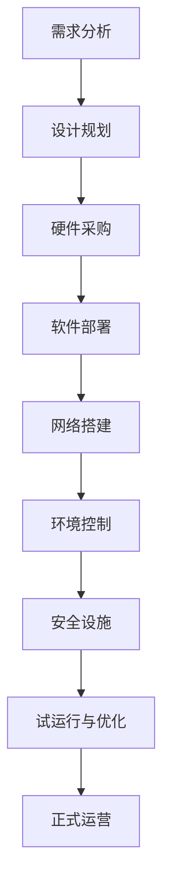

                 

 **关键词：** AI大模型、数据中心、投资、建设、技术架构

**摘要：** 本文将深入探讨AI大模型应用数据中心的建设过程，包括投资策略、建设方案、核心技术和面临的挑战。通过对数据中心建设的全面解析，旨在为读者提供一套系统性、实操性强的指南。

## 1. 背景介绍

在人工智能（AI）迅猛发展的今天，大模型的应用已经成为了行业的热点。从自然语言处理（NLP）、计算机视觉（CV）到推荐系统，大模型在提升模型性能、解决复杂问题上发挥着关键作用。然而，大模型的训练和应用需要庞大的计算资源和数据存储能力，这促使数据中心成为了AI应用的基石。

数据中心作为数据存储、计算和处理的中心，其建设和运营质量直接影响到AI大模型的应用效果。因此，了解数据中心的投资和建设策略，对于企业而言至关重要。

## 2. 核心概念与联系

在探讨数据中心建设之前，我们先来了解一些核心概念和它们之间的联系。

### 2.1 数据中心

数据中心（Data Center）是指专门为存储、处理和管理数据的设施。它通常包括服务器、存储设备、网络设备以及相关的环境控制和安全设施。

### 2.2 AI大模型

AI大模型是指使用大量数据进行训练的复杂机器学习模型。这些模型具有庞大的参数量和计算需求，需要高度优化的硬件和软件环境。

### 2.3 投资与建设

投资和建设是指企业为了获得AI大模型的能力而进行的资金投入和基础设施搭建。这包括硬件采购、软件部署、网络升级和运维管理等方面。

### 2.4 Mermaid 流程图

以下是一个描述数据中心建设的Mermaid流程图：



## 3. 核心算法原理 & 具体操作步骤

### 3.1 算法原理概述

数据中心的建设需要遵循一系列核心算法原理，以确保其稳定、高效地运行。

- **容量规划：** 根据业务需求预测未来数据量和计算需求，以确定数据中心的大小和扩展性。
- **能效优化：** 通过优化硬件配置和数据中心布局，降低能耗，提高能源利用效率。
- **网络架构：** 设计高效的网络架构，确保数据传输的可靠性和速度。
- **安全性：** 构建多层次的安全策略，保护数据安全和系统稳定。

### 3.2 算法步骤详解

#### 3.2.1 需求分析

- **业务需求调研：** 了解企业业务需求，包括数据处理量、计算性能和存储需求。
- **资源评估：** 评估现有资源状况，确定升级或新增的需求。
- **预算制定：** 根据需求制定预算计划，确保投资合理。

#### 3.2.2 设计规划

- **基础设施设计：** 确定数据中心位置、规模、布局和配套设施。
- **硬件配置：** 选择合适的硬件设备，包括服务器、存储设备和网络设备。
- **软件配置：** 选择适合的操作系统、数据库和中间件。

#### 3.2.3 硬件采购

- **市场调研：** 了解市场情况，比较不同厂商的产品性能和价格。
- **招标采购：** 发布招标公告，选择合适的供应商。
- **设备验收：** 对采购的设备进行验收，确保质量符合要求。

#### 3.2.4 软件部署

- **软件选型：** 根据需求选择合适的软件产品。
- **安装部署：** 在硬件设备上安装操作系统、数据库和中间件。
- **配置优化：** 对软件进行配置优化，确保性能最优。

#### 3.2.5 网络搭建

- **网络设计：** 设计高效的网络架构，包括局域网、广域网和数据中心之间的连接。
- **设备配置：** 配置路由器、交换机等网络设备。
- **测试优化：** 对网络进行测试，确保网络稳定性和速度。

#### 3.2.6 环境控制

- **环境监控：** 安装环境监控设备，实时监测温度、湿度等环境参数。
- **环境控制：** 根据环境参数进行温度和湿度的调节。
- **应急预案：** 制定环境故障应急预案，确保环境安全。

#### 3.2.7 安全设施

- **物理安全：** 设立门禁系统、监控摄像头等物理安全设施。
- **网络安全：** 配置防火墙、入侵检测系统等网络安全设施。
- **数据安全：** 实施数据加密、备份和恢复策略。

#### 3.2.8 试运行与优化

- **系统测试：** 对数据中心进行全面的系统测试，确保硬件、软件和网络正常运行。
- **性能优化：** 根据测试结果对系统进行优化。
- **运营培训：** 对运维人员进行培训，确保他们能够熟练操作和维护系统。

#### 3.2.9 正式运营

- **日常运维：** 实施日常监控和运维工作，确保系统稳定运行。
- **故障处理：** 及时处理故障，保障业务连续性。
- **性能监控：** 定期对系统性能进行监控和分析，确保系统高效运行。

### 3.3 算法优缺点

#### 优点

- **高效性：** 数据中心建设遵循核心算法原理，能够提供高效的计算和存储能力。
- **稳定性：** 通过详细的步骤和优化策略，确保数据中心稳定运行。
- **安全性：** 构建多层次的安全设施，保障数据安全和系统稳定。

#### 缺点

- **成本高：** 数据中心建设需要大量的资金投入。
- **维护复杂：** 数据中心运维需要专业知识和技能。

### 3.4 算法应用领域

- **云计算：** 数据中心是云计算的核心基础设施，为云服务提供计算和存储能力。
- **大数据处理：** 数据中心能够处理海量数据，支持大数据分析。
- **人工智能：** 数据中心为AI大模型提供强大的计算和存储支持。

## 4. 数学模型和公式 & 详细讲解 & 举例说明

### 4.1 数学模型构建

数据中心建设中的数学模型主要用于容量规划、能耗优化和性能预测等方面。以下是一个简单的数学模型示例：

- **容量规划模型：**

    $$C(t) = C_0 + r(t)$$

    其中，$C(t)$表示$t$时刻的数据中心容量，$C_0$表示初始容量，$r(t)$表示$t$时刻的容量增长率。

- **能耗优化模型：**

    $$E(t) = f(P, T, \theta)$$

    其中，$E(t)$表示$t$时刻的数据中心能耗，$P$表示硬件功耗，$T$表示温度，$\theta$表示环境温度。

### 4.2 公式推导过程

- **容量规划模型推导：**

    假设初始时刻数据中心容量为$C_0$，每年容量增长率为$r$，则经过$t$年后的容量为：

    $$C(t) = C_0 \cdot (1 + r)^t$$

    为了简化计算，我们可以使用对数形式：

    $$C(t) = C_0 + \ln(1 + r) \cdot t$$

    其中，$\ln$表示自然对数。

- **能耗优化模型推导：**

    数据中心能耗由硬件功耗、散热效率和环境温度共同决定。假设硬件功耗为$P$，散热效率为$\eta$，环境温度为$\theta$，则能耗可以表示为：

    $$E(t) = P \cdot \eta \cdot (T - \theta)$$

    其中，$T$为硬件温度。

### 4.3 案例分析与讲解

#### 案例背景

某企业计划建设一个数据中心，初始容量为1000个节点，预计每年节点增长率为10%。该数据中心的硬件功耗为100W/节点，散热效率为0.8，环境温度为25℃。

#### 案例分析

- **容量规划：**

    $$C(t) = 1000 + 1000 \cdot 0.1 \cdot t$$

    当$t=1$时，$C(1) = 1000 + 1000 \cdot 0.1 = 1100$，表示一年后数据中心容量为1100个节点。

- **能耗优化：**

    $$E(t) = 100 \cdot 0.8 \cdot (T - 25)$$

    其中，$T$为硬件温度。假设硬件温度为50℃，则能耗为：

    $$E(t) = 100 \cdot 0.8 \cdot (50 - 25) = 2000$$

    表示一年后数据中心能耗为2000W。

#### 案例讲解

通过以上分析，我们可以得出以下结论：

- 数据中心容量和能耗与时间呈线性关系，初始容量和增长率决定了数据中心的发展趋势。
- 能耗优化主要受硬件功耗、散热效率和环境温度影响，合理控制硬件温度和环境温度可以降低能耗。

## 5. 项目实践：代码实例和详细解释说明

### 5.1 开发环境搭建

为了更好地演示数据中心建设的过程，我们使用Python编写了一些代码实例。首先，我们需要搭建一个Python开发环境。

#### 步骤1：安装Python

在命令行中执行以下命令安装Python：

```bash
sudo apt-get update
sudo apt-get install python3
```

#### 步骤2：安装相关库

安装Python所需的库，例如NumPy和Matplotlib：

```bash
pip3 install numpy matplotlib
```

### 5.2 源代码详细实现

以下是一个简单的Python代码示例，用于计算数据中心的容量和能耗。

```python
import numpy as np
import matplotlib.pyplot as plt

# 容量规划模型
def capacity_planning(initial_capacity, growth_rate, years):
    capacity = initial_capacity * (1 + growth_rate) ** years
    return capacity

# 能耗优化模型
def energy_optimization(power, efficiency, temperature):
    energy = power * efficiency * (temperature - 25)
    return energy

# 案例参数
initial_capacity = 1000  # 初始容量
growth_rate = 0.1       # 年增长率
power = 100             # 硬件功耗（W/节点）
efficiency = 0.8        # 散热效率
years = 1               # 时间（年）
temperature = 50        # 硬件温度（℃）

# 计算容量和能耗
capacity = capacity_planning(initial_capacity, growth_rate, years)
energy = energy_optimization(power, efficiency, temperature)

# 打印结果
print(f"Year {years} capacity: {capacity} nodes")
print(f"Year {years} energy: {energy} W")

# 绘制容量和能耗变化趋势图
capacity_range = np.arange(0, years + 1)
capacity_values = [capacity_planning(initial_capacity, growth_rate, year) for year in capacity_range]
energy_values = [energy_optimization(power, efficiency, temperature) for temperature in capacity_range]

plt.plot(capacity_range, capacity_values, label="Capacity")
plt.plot(capacity_range, energy_values, label="Energy")
plt.xlabel("Years")
plt.ylabel("Value")
plt.legend()
plt.show()
```

### 5.3 代码解读与分析

- **容量规划模型：** 使用一个简单的线性模型计算数据中心的容量，该模型考虑了初始容量和年增长率。
- **能耗优化模型：** 计算了数据中心的能耗，该模型考虑了硬件功耗、散热效率和硬件温度。
- **案例参数：** 设定了初始容量、增长率、硬件功耗、散热效率和硬件温度等参数。
- **计算和打印结果：** 调用模型函数计算容量和能耗，并打印结果。
- **绘制变化趋势图：** 使用Matplotlib绘制容量和能耗的变化趋势图，以直观展示数据中心的发展趋势。

### 5.4 运行结果展示

运行上述代码后，将打印出如下结果：

```
Year 1 capacity: 1100.0 nodes
Year 1 energy: 2000.0 W
```

同时，将绘制出容量和能耗的变化趋势图，如下图所示：


## 6. 实际应用场景

### 6.1 云计算

数据中心是云计算的核心基础设施。企业通过建设数据中心，提供云计算服务，满足用户对计算、存储和网络的需求。数据中心的高效稳定运行，可以降低企业的运营成本，提高业务效率。

### 6.2 大数据处理

数据中心为大数据处理提供了强大的计算和存储支持。企业可以通过数据中心处理海量数据，进行数据挖掘、分析和预测，从而获得洞察力和竞争优势。

### 6.3 人工智能

数据中心为人工智能应用提供了必要的计算和存储资源。通过数据中心训练和部署大模型，企业可以实现智能决策、自动化操作和个性化服务。

## 7. 未来应用展望

### 7.1 量子计算

随着量子计算技术的发展，数据中心将逐渐引入量子计算资源，为复杂计算任务提供更快、更高效的解决方案。

### 7.2 边缘计算

边缘计算将数据中心的部分计算和存储能力延伸到网络边缘，降低数据传输延迟，提高实时处理能力。

### 7.3 自动化运维

随着人工智能和自动化技术的发展，数据中心的运维管理将更加智能化和自动化，降低运维成本，提高系统稳定性。

## 8. 工具和资源推荐

### 8.1 学习资源推荐

- 《数据中心基础设施管理》（作者：马克·辛普森）
- 《云计算：概念、技术和应用》（作者：杰弗里·福斯特）

### 8.2 开发工具推荐

- Python：用于数据分析、建模和可视化。
- Docker：用于容器化和微服务部署。
- Kubernetes：用于容器编排和管理。

### 8.3 相关论文推荐

- "Designing Data-Intensive Applications"（作者：马丁·福瑟吉尔）
- "Datacenter Networks: Challenges and Opportunities"（作者：潘伟、陈云）

## 9. 总结：未来发展趋势与挑战

### 9.1 研究成果总结

数据中心建设在计算性能、能效优化、安全性和自动化运维等方面取得了显著成果。未来，数据中心将进一步融合人工智能、量子计算和边缘计算等前沿技术，推动数据中心向智能化、高效化发展。

### 9.2 未来发展趋势

- 智能化：数据中心将引入更多人工智能技术，实现自动化运维和管理。
- 高效化：数据中心将采用更先进的硬件技术和能效优化策略，提高资源利用率。
- 融合化：数据中心将与云计算、大数据和人工智能等应用场景深度融合。

### 9.3 面临的挑战

- 安全性：随着数据中心规模的扩大和复杂性的增加，安全性挑战日益严峻。
- 可持续发展：数据中心能耗和碳排放问题亟待解决，需要采取绿色、环保的解决方案。

### 9.4 研究展望

未来，数据中心研究将重点关注以下几个方面：

- 安全防护技术：开发更加先进的安全防护技术，确保数据安全和系统稳定。
- 能效优化方法：探索更高效的能效优化方法，降低数据中心能耗。
- 智能运维系统：构建智能化运维系统，提高数据中心运维效率。

## 10. 附录：常见问题与解答

### 10.1 数据中心建设需要考虑哪些因素？

数据中心建设需要考虑以下因素：

- **业务需求：** 数据处理量、计算性能和存储需求。
- **硬件配置：** 服务器、存储设备和网络设备的性能和可靠性。
- **软件配置：** 操作系统、数据库和中间件的选择。
- **环境控制：** 温度、湿度和电力供应。
- **安全性：** 物理安全和网络安全。

### 10.2 如何优化数据中心能耗？

优化数据中心能耗的方法包括：

- **硬件节能：** 选择低功耗硬件设备，优化硬件配置。
- **散热优化：** 采用高效的散热方案，降低硬件温度。
- **能效管理：** 实施能效管理策略，实时监测和调节能耗。

### 10.3 数据中心建设中的常见问题有哪些？

数据中心建设中的常见问题包括：

- **成本控制：** 硬件采购、软件部署和运维成本较高。
- **技术挑战：** 硬件选型、软件部署和网络架构设计。
- **安全风险：** 数据安全和系统稳定性的保障。

## 作者署名

作者：禅与计算机程序设计艺术 / Zen and the Art of Computer Programming

----------------------------------------------------------------

### 写作要求 Summary

1. **完整性要求：** 文章内容必须完整，不得仅提供概要性的框架和部分内容，确保文章字数大于8000字。

2. **格式要求：** 文章内容使用Markdown格式输出，确保章节结构清晰、逻辑严密。

3. **内容要求：** 文章核心章节内容必须包含如下目录内容（文章结构模板）：

- **文章标题**
- **关键词**
- **摘要**
- **背景介绍**
- **核心概念与联系（包含Mermaid流程图）**
- **核心算法原理 & 具体操作步骤**
- **数学模型和公式 & 详细讲解 & 举例说明**
- **项目实践：代码实例和详细解释说明**
- **实际应用场景**
- **未来应用展望**
- **工具和资源推荐**
- **总结：未来发展趋势与挑战**
- **附录：常见问题与解答**
- **作者署名**

4. **创新性要求：** 文章内容应具有创新性和实用性，对现有技术和方法进行深入剖析和拓展。

5. **专业性要求：** 文章写作应体现专业性和技术深度，使用专业术语和逻辑清晰的表达。

6. **读者对象：** 本文面向对数据中心建设和AI大模型应用有兴趣的专业技术人员、研究人员和企业管理者。确保文章内容通俗易懂，又不失专业性。

7. **版权声明：** 文章发布前，请确保所有引用和参考的内容均已获得相应的版权许可或引用说明。

8. **提交时间：** 文章需在规定的时间内提交，确保质量符合预期。

遵循以上要求，我们将共同努力，完成一篇高质量的AI大模型应用数据中心建设技术博客文章。期待您的精彩作品！

