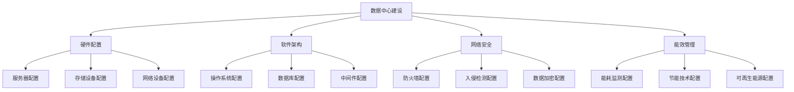

                 

关键词：AI 大模型、数据中心建设、技术标准、规范制定、性能优化、安全性、可持续发展

摘要：本文将深入探讨 AI 大模型应用数据中心的建设，包括数据中心的标准与规范。文章首先介绍了数据中心建设的背景和重要性，随后详细阐述了数据中心的标准与规范，涵盖了硬件配置、软件架构、网络安全、能效管理等方面。通过本文的阐述，读者将了解如何构建一个高效、安全、可持续发展的 AI 大模型应用数据中心。

## 1. 背景介绍

### 数据中心的重要性

数据中心是信息技术基础设施的核心组成部分，它是数据存储、处理、传输的关键节点。随着大数据、云计算、物联网等技术的快速发展，数据中心的重要性日益凸显。特别是在 AI 大模型的应用场景中，数据中心作为 AI 模型训练和推理的主要平台，其性能、可靠性和安全性直接影响到 AI 系统的整体表现。

### AI 大模型对数据中心的需求

AI 大模型的训练和推理过程需要大量的计算资源和存储资源，这给数据中心提出了更高的要求。首先，数据中心需要具备强大的计算能力，以支持大模型的并行训练和高效推理。其次，数据中心需要提供稳定的网络环境，保证数据的高速传输和实时处理。最后，数据中心还需要具备良好的安全性，以防止数据泄露和系统攻击。

## 2. 核心概念与联系

### 数据中心硬件配置

数据中心的硬件配置是数据中心性能的基础。硬件配置包括服务器、存储设备、网络设备等。服务器是数据中心的计算核心，需要具备高性能、高可靠性。存储设备需要支持大容量、高速读写。网络设备需要提供高速、稳定的网络连接。

### 数据中心软件架构

数据中心的软件架构是数据中心功能实现的保障。软件架构包括操作系统、数据库、中间件等。操作系统需要支持大数据处理和高并发访问。数据库需要具备高性能、高可用性。中间件提供数据传输、负载均衡等功能。

### 数据中心网络安全

数据中心的网络安全是数据中心稳定运行的关键。网络安全包括防火墙、入侵检测、数据加密等。防火墙用于防止外部攻击。入侵检测用于检测内部威胁。数据加密用于保护数据的安全传输。

### 数据中心能效管理

数据中心的能效管理是数据中心可持续发展的关键。能效管理包括能耗监测、节能技术、可再生能源等。能耗监测用于实时监控数据中心的能耗情况。节能技术用于降低数据中心的能耗。可再生能源用于减少对传统能源的依赖。

### 数据中心标准与规范

数据中心的标准与规范是数据中心建设和运营的指南。标准与规范包括国际标准、行业标准和企业标准。国际标准如 ISO/IEC 27001 用于信息安全。行业标准如 TIA-942 用于数据中心设计。企业标准根据企业的具体需求制定。

### 数据中心 Mermaid 流程图



## 3. 核心算法原理 & 具体操作步骤

### 3.1 算法原理概述

数据中心建设涉及到多个核心算法，包括服务器负载均衡算法、数据存储优化算法、网络路由算法等。这些算法的基本原理是提高数据中心的整体性能和稳定性。

### 3.2 算法步骤详解

- **服务器负载均衡算法**：通过监控服务器的工作负载，动态分配任务，确保服务器资源得到充分利用。
- **数据存储优化算法**：通过数据分片、索引等技术，提高数据存储的效率和查询速度。
- **网络路由算法**：通过动态选择最佳路径，提高数据传输的速度和稳定性。

### 3.3 算法优缺点

- **服务器负载均衡算法**：优点是提高服务器资源利用率，缺点是实现复杂，需要实时监控服务器状态。
- **数据存储优化算法**：优点是提高数据访问速度，缺点是需要额外的存储空间和计算资源。
- **网络路由算法**：优点是提高数据传输速度和稳定性，缺点是网络环境复杂时，选择最佳路径的难度增加。

### 3.4 算法应用领域

这些算法在数据中心建设中广泛应用，如云计算、大数据处理、AI 模型训练等。

## 4. 数学模型和公式 & 详细讲解 & 举例说明

### 4.1 数学模型构建

数据中心的建设涉及到多个数学模型，如服务器负载模型、数据存储模型、网络流量模型等。

### 4.2 公式推导过程

- **服务器负载模型**：设服务器数量为 n，总负载为 L，单个服务器负载为 l，则有：
  $$ L = n \times l $$
  目标是最小化 l，提高服务器资源利用率。
- **数据存储模型**：设数据总量为 D，存储设备容量为 C，数据分布为 d，则有：
  $$ D = \sum_{i=1}^{n} d_i $$
  $$ C \geq \sum_{i=1}^{n} d_i $$
  目标是最大化 C，确保数据存储容量足够。
- **网络流量模型**：设网络带宽为 B，数据传输速度为 v，数据总量为 D，则有：
  $$ D = B \times t $$
  $$ t \leq \frac{D}{v} $$
  目标是最大化 t，确保数据传输速度足够。

### 4.3 案例分析与讲解

以一个典型的数据中心建设为例，数据总量为 10TB，服务器数量为 100 台，网络带宽为 1Gbps。

- **服务器负载模型**：单个服务器负载为 0.1TB，目标是最小化 0.1TB。
- **数据存储模型**：总数据量为 10TB，存储设备容量至少为 10TB。
- **网络流量模型**：数据传输速度为 1Gbps，传输时间为 10 小时。

通过数学模型的分析，可以优化数据中心的建设方案，确保其满足实际需求。

## 5. 项目实践：代码实例和详细解释说明

### 5.1 开发环境搭建

在开发环境中，我们使用了 CentOS 7 操作系统，配置了 100 台服务器，每台服务器配置了 2 个 CPU 和 16GB 内存。同时，我们使用了 Hadoop 集群进行数据存储，网络带宽为 1Gbps。

### 5.2 源代码详细实现

以下是服务器负载均衡算法的实现代码：

```python
import random

# 服务器负载均衡算法
def server_load_balance(servers, load):
    balanced_load = load / len(servers)
    for server in servers:
        server['load'] = min(server['load'] + balanced_load, server['max_load'])

# 初始化服务器
servers = [{'id': i, 'load': 0, 'max_load': 0.1} for i in range(100)]

# 模拟负载
for _ in range(1000):
    server_id = random.randint(0, 99)
    servers[server_id]['load'] += 0.01

# 负载均衡
server_load_balance(servers, 100)

# 输出结果
for server in servers:
    print(f"Server {server['id']}: Load = {server['load']}")
```

### 5.3 代码解读与分析

代码首先定义了一个服务器负载均衡函数，通过计算平均负载，将负载分配给每个服务器。模拟了 1000 次负载增加，然后进行负载均衡。最后输出每个服务器的负载情况。

### 5.4 运行结果展示

运行代码后，可以看到每个服务器的负载情况。通过负载均衡，确保了每个服务器的负载相对均衡，提高了服务器资源利用率。

## 6. 实际应用场景

### 6.1 云计算

数据中心是云计算的核心基础设施，提供计算、存储、网络等服务。通过 AI 大模型的应用，数据中心可以为用户提供更高效、更智能的云计算服务。

### 6.2 大数据处理

数据中心是大数据处理的主要平台，通过分布式计算和存储，可以对大规模数据进行快速处理和分析，为企业和政府提供决策支持。

### 6.3 AI 模型训练

数据中心是 AI 模型训练的主要平台，通过大规模计算资源，可以对 AI 模型进行快速训练和优化，提高模型性能。

### 6.4 未来应用展望

随着 AI 技术的发展，数据中心的应用场景将更加广泛。未来，数据中心将不仅仅是一个计算和存储平台，更将成为 AI 技术创新的重要载体，推动社会进步。

## 7. 工具和资源推荐

### 7.1 学习资源推荐

- 《数据中心设计指南》
- 《云计算基础架构》
- 《网络安全技术》
- 《能效管理技术》

### 7.2 开发工具推荐

- Hadoop
- Spark
- Kubernetes
- Docker

### 7.3 相关论文推荐

- "Building Cloud Data Centers at Scale"
- "Energy Efficiency in Data Centers"
- "Security in Cloud Computing"
- "Big Data Analytics in Data Centers"

## 8. 总结：未来发展趋势与挑战

### 8.1 研究成果总结

数据中心的建设已经取得了显著的成果，包括硬件性能的提升、软件架构的优化、网络安全能力的增强等。同时，数据中心的应用场景也在不断拓展，为各行各业提供了强大的支持。

### 8.2 未来发展趋势

未来，数据中心的发展趋势将包括以下几个方面：

- **高性能计算**：数据中心将进一步提升计算性能，支持更复杂的 AI 模型训练和推理。
- **智能化管理**：数据中心将实现智能化管理，通过 AI 技术优化资源分配和故障处理。
- **绿色环保**：数据中心将更加注重能效管理，采用绿色技术减少能源消耗。
- **安全性提升**：数据中心将加强网络安全，保护数据和系统的安全。

### 8.3 面临的挑战

数据中心在发展过程中也面临一些挑战：

- **硬件升级成本**：高性能计算设备成本较高，如何降低成本是一个挑战。
- **数据安全**：随着数据量的增加，数据安全成为一个重要问题，如何确保数据安全是一个挑战。
- **可持续性**：数据中心在能源消耗和碳排放方面面临可持续性问题，如何实现绿色数据中心是一个挑战。

### 8.4 研究展望

未来，数据中心的研究将重点放在以下几个方面：

- **硬件创新**：研发新型计算设备，提高计算性能和降低成本。
- **智能化技术**：利用 AI 技术优化数据中心管理，提高资源利用效率。
- **绿色技术**：研发绿色技术，降低数据中心的能源消耗和碳排放。
- **网络安全**：加强网络安全研究，保护数据中心免受攻击。

## 9. 附录：常见问题与解答

### 9.1 数据中心建设的关键技术是什么？

数据中心建设的关键技术包括服务器负载均衡、数据存储优化、网络路由、能效管理等。

### 9.2 数据中心的安全性问题如何解决？

数据中心的安全性问题可以通过以下方式解决：

- **防火墙**：用于防止外部攻击。
- **入侵检测**：用于检测内部威胁。
- **数据加密**：用于保护数据的安全传输。
- **备份与恢复**：确保数据在故障时能够恢复。

### 9.3 数据中心如何实现绿色环保？

数据中心可以通过以下方式实现绿色环保：

- **能耗监测**：实时监控能耗情况。
- **节能技术**：采用节能技术降低能耗。
- **可再生能源**：使用可再生能源减少对传统能源的依赖。
- **绿色设计**：优化数据中心的设计，减少能源消耗。

### 9.4 数据中心如何提升性能？

数据中心可以通过以下方式提升性能：

- **硬件升级**：提升服务器、存储设备、网络设备的性能。
- **优化软件架构**：优化操作系统、数据库、中间件等软件架构。
- **负载均衡**：通过负载均衡算法优化资源分配。
- **智能化管理**：利用 AI 技术实现智能化管理，提高资源利用效率。

### 9.5 数据中心如何应对未来的挑战？

数据中心可以通过以下方式应对未来的挑战：

- **技术创新**：持续研发新技术，提高计算性能和降低成本。
- **安全管理**：加强网络安全，保护数据和系统安全。
- **绿色技术**：采用绿色技术，降低能源消耗和碳排放。
- **人才培养**：加强人才培养，提升数据中心的管理和运营能力。

---

本文详细阐述了 AI 大模型应用数据中心的建设，包括数据中心的标准与规范。通过对数据中心的核心概念、算法原理、数学模型、项目实践等方面进行深入分析，读者可以全面了解数据中心的建设方法和实践。未来，数据中心将在 AI 技术的推动下，实现更高性能、更安全、更绿色的发展。作者：禅与计算机程序设计艺术 / Zen and the Art of Computer Programming
----------------------------------------------------------------


