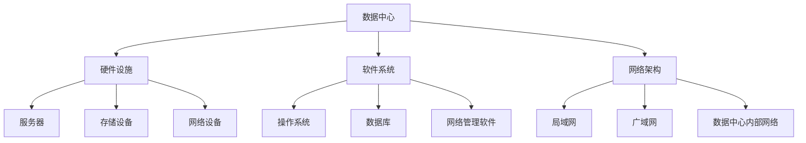

                 

关键词：AI大模型、数据中心、建设标准、规范、技术架构

摘要：本文旨在探讨AI大模型应用数据中心的建设过程，从数据中心的标准与规范出发，分析了数据中心的核心架构、建设步骤以及运营管理。通过深入研究，本文为AI大模型数据中心的成功搭建提供了实用的指导和建议。

## 1. 背景介绍

随着人工智能技术的快速发展，AI大模型在自然语言处理、计算机视觉、智能推荐等领域取得了显著成果。然而，AI大模型的训练和应用对数据中心提出了更高的要求。数据中心作为AI大模型训练和应用的核心基础设施，其稳定性和效率直接影响到AI大模型的表现和实际应用价值。因此，数据中心的建设标准和规范显得尤为重要。

数据中心建设涉及到硬件设施、软件系统、网络架构、安全性、能耗等多个方面。传统的数据中心建设往往注重硬件的堆砌和性能的提升，而忽视了整体架构的优化和标准化。随着AI大模型对数据中心需求的不断增长，数据中心建设标准和规范的制定变得愈发重要。

本文将围绕AI大模型应用数据中心的建设，探讨数据中心的标准与规范，分析数据中心的核心架构和建设步骤，并探讨未来数据中心的发展趋势和挑战。

## 2. 核心概念与联系

在构建AI大模型应用数据中心之前，我们需要明确几个核心概念，包括数据中心、AI大模型、硬件设施、软件系统、网络架构等。

### 2.1 数据中心

数据中心（Data Center）是指用于集中存储、处理和管理大量数据的建筑设施。数据中心的建设包括硬件设备（如服务器、存储设备、网络设备等）的采购和部署，以及软件系统（如数据库、操作系统、网络管理软件等）的安装和配置。

### 2.2 AI大模型

AI大模型是指具有大规模参数和复杂结构的机器学习模型，如深度神经网络、生成对抗网络等。这些模型通常需要海量数据进行训练，并在数据中心进行大规模运算。

### 2.3 硬件设施

硬件设施是数据中心的核心组成部分，包括服务器、存储设备、网络设备等。这些设备需要满足高性能、高可靠性、高扩展性等要求。

### 2.4 软件系统

软件系统包括操作系统、数据库、网络管理软件等，负责管理数据中心的运行和维护。在AI大模型应用场景中，软件系统还需要支持分布式计算、并行处理等高级功能。

### 2.5 网络架构

网络架构是数据中心的重要组成部分，包括局域网、广域网、数据中心内部网络等。网络架构需要满足高带宽、低延迟、高可用性等要求。

### 2.6 Mermaid 流程图

为了更好地展示数据中心的核心概念和联系，我们使用Mermaid流程图（注意：以下示例中，节点中不要有括号、逗号等特殊字符）：



## 3. 核心算法原理 & 具体操作步骤

### 3.1 算法原理概述

在AI大模型应用数据中心的建设过程中，核心算法的选择和实现至关重要。核心算法主要包括以下几个方面：

1. **分布式计算**：分布式计算是将计算任务分解为多个子任务，分布在多台服务器上并行执行。通过分布式计算，可以显著提高计算效率和性能。

2. **并行处理**：并行处理是在多个处理器或计算节点上同时执行多个任务。在数据中心中，并行处理可以提高数据处理速度和吞吐量。

3. **负载均衡**：负载均衡是将计算任务分配到多台服务器上，确保服务器负载均匀，避免单点故障和性能瓶颈。

4. **数据存储与管理**：数据存储与管理涉及数据的存储、备份、恢复、访问等操作。在AI大模型应用场景中，数据存储与管理需要支持海量数据的存储和快速访问。

### 3.2 算法步骤详解

以下是AI大模型应用数据中心核心算法的具体操作步骤：

1. **分布式计算**：
    - 步骤1：将计算任务分解为多个子任务；
    - 步骤2：将子任务分配到多台服务器上执行；
    - 步骤3：收集并合并子任务的计算结果。

2. **并行处理**：
    - 步骤1：确定并行处理的任务和处理器；
    - 步骤2：将任务分解为多个子任务；
    - 步骤3：在多个处理器上同时执行子任务；
    - 步骤4：收集并合并处理器上的计算结果。

3. **负载均衡**：
    - 步骤1：监测服务器负载情况；
    - 步骤2：将计算任务分配到负载较低的服务器上；
    - 步骤3：动态调整任务分配策略，以实现负载均衡。

4. **数据存储与管理**：
    - 步骤1：设计数据存储架构，包括数据分层、数据压缩、数据加密等；
    - 步骤2：实施数据备份和恢复策略，确保数据安全；
    - 步骤3：优化数据访问性能，包括数据缓存、数据索引等；
    - 步骤4：实施数据权限管理，确保数据安全性和隐私性。

### 3.3 算法优缺点

1. **分布式计算**：
    - 优点：提高计算效率和性能，降低单点故障风险；
    - 缺点：实现复杂，需要处理分布式调度、数据一致性等问题。

2. **并行处理**：
    - 优点：提高数据处理速度和吞吐量；
    - 缺点：需要较高硬件投入，实现和维护成本较高。

3. **负载均衡**：
    - 优点：避免单点故障和性能瓶颈，提高系统可靠性；
    - 缺点：负载均衡算法复杂，需要实时监测服务器状态。

4. **数据存储与管理**：
    - 优点：提高数据存储容量和访问性能；
    - 缺点：数据存储和管理需要较大投入，面临数据安全性和隐私性挑战。

### 3.4 算法应用领域

1. **自然语言处理**：分布式计算和并行处理可以提高自然语言处理的计算效率和性能，应用于机器翻译、文本分类、语音识别等领域。

2. **计算机视觉**：并行处理可以提高计算机视觉任务的吞吐量，应用于图像识别、视频分析、人脸识别等领域。

3. **智能推荐**：负载均衡可以提高智能推荐系统的响应速度，应用于电商推荐、搜索引擎、社交媒体等领域。

## 4. 数学模型和公式 & 详细讲解 & 举例说明

### 4.1 数学模型构建

在数据中心建设过程中，数学模型在资源调度、性能优化、能耗管理等方面发挥着重要作用。以下是一个简化的数学模型示例：

1. **资源调度模型**：

   资源调度模型旨在优化服务器资源分配，以提高数据中心整体性能。假设有n台服务器，每台服务器有m个计算核心，现有k个计算任务需要分配。

   $$ 
   \begin{align*}
   \text{最大化：} & \sum_{i=1}^{k} \frac{\text{任务i的优先级}}{\text{服务器i的负载}} \\
   \text{约束条件：} & \sum_{i=1}^{n} \text{服务器i的负载} \leq \text{服务器总负载上限}
   \end{align*}
   $$

2. **性能优化模型**：

   性能优化模型旨在最大化数据中心整体性能。假设有n台服务器，每台服务器的处理能力为$C_i$，现有k个计算任务，任务优先级为$P_i$。

   $$
   \begin{align*}
   \text{最大化：} & \sum_{i=1}^{k} \frac{P_i}{C_i} \\
   \text{约束条件：} & \sum_{i=1}^{n} C_i \geq \text{任务总处理能力需求}
   \end{align*}
   $$

3. **能耗管理模型**：

   能耗管理模型旨在优化数据中心能耗，降低运营成本。假设有n台服务器，每台服务器的功耗为$P_i$，现有k个计算任务，任务优先级为$P_i$。

   $$
   \begin{align*}
   \text{最小化：} & \sum_{i=1}^{n} P_i \\
   \text{约束条件：} & \sum_{i=1}^{k} P_i \geq \text{任务总处理能力需求}
   \end{align*}
   $$

### 4.2 公式推导过程

1. **资源调度模型推导**：

   资源调度模型的目标是使每个任务分配到合适的服务器上，以最大化数据中心整体性能。首先，计算每个任务的优先级与服务器负载的比值，该比值表示任务分配到服务器的合理性。然后，根据约束条件，确保服务器负载不超过总负载上限。

2. **性能优化模型推导**：

   性能优化模型的目标是最大化数据中心整体性能，即最大化任务处理能力与任务优先级的比值。首先，计算每个任务的处理能力与优先级的比值，该比值表示任务的重要程度。然后，根据约束条件，确保服务器总处理能力满足任务总处理能力需求。

3. **能耗管理模型推导**：

   能耗管理模型的目标是优化数据中心能耗，即最小化服务器总功耗。首先，计算每个任务的处理能力与服务器功耗的比值，该比值表示任务对能耗的贡献。然后，根据约束条件，确保服务器总处理能力满足任务总处理能力需求。

### 4.3 案例分析与讲解

为了更好地理解上述数学模型的实际应用，我们以一个实际案例进行分析。

假设一个数据中心有5台服务器，每台服务器的处理能力为8 TFLOPS，现有3个计算任务，任务优先级分别为3、2、1。现有任务需要分配到服务器上，以最大化数据中心整体性能。

1. **资源调度模型计算**：

   首先计算每个任务的优先级与服务器负载的比值：

   $$ 
   \begin{align*}
   \text{任务1：} & \frac{3}{1} = 3 \\
   \text{任务2：} & \frac{2}{1} = 2 \\
   \text{任务3：} & \frac{1}{1} = 1 \\
   \end{align*}
   $$

   根据比值，任务1分配到服务器1，任务2分配到服务器2，任务3分配到服务器3。

2. **性能优化模型计算**：

   首先计算每个任务的处理能力与优先级的比值：

   $$ 
   \begin{align*}
   \text{任务1：} & \frac{3}{8} = 0.375 \\
   \text{任务2：} & \frac{2}{8} = 0.25 \\
   \text{任务3：} & \frac{1}{8} = 0.125 \\
   \end{align*}
   $$

   根据比值，任务1的重要程度最高，任务2次之，任务3最低。因此，任务1分配到服务器1，任务2分配到服务器2，任务3分配到服务器3。

3. **能耗管理模型计算**：

   首先计算每个任务的处理能力与服务器功耗的比值：

   $$ 
   \begin{align*}
   \text{任务1：} & \frac{3}{8} = 0.375 \\
   \text{任务2：} & \frac{2}{8} = 0.25 \\
   \text{任务3：} & \frac{1}{8} = 0.125 \\
   \end{align*}
   $$

   根据比值，任务1对能耗的贡献最高，任务2次之，任务3最低。因此，任务1分配到服务器1，任务2分配到服务器2，任务3分配到服务器3。

通过上述分析，我们可以看到数学模型在数据中心资源调度、性能优化、能耗管理等方面的应用。在实际数据中心建设中，可以根据具体需求和场景调整模型参数和约束条件，以达到最佳效果。

## 5. 项目实践：代码实例和详细解释说明

### 5.1 开发环境搭建

为了实现AI大模型应用数据中心的建设，我们需要搭建一个完整的开发环境。以下是一个基本的开发环境搭建步骤：

1. **硬件设备**：

   - 服务器：选择高性能服务器，支持多核CPU和大内存；
   - 存储设备：选择大容量、高性能的存储设备，支持高速数据访问；
   - 网络设备：选择高性能、高带宽的网络设备，确保数据传输效率。

2. **操作系统**：

   - 服务器操作系统：选择稳定、可靠的操作系统，如Linux或Windows Server；
   - 容器化平台：选择Kubernetes或Docker等容器化平台，实现服务器的动态管理和资源调度。

3. **软件系统**：

   - 计算框架：选择适合AI大模型的计算框架，如TensorFlow、PyTorch等；
   - 数据库系统：选择高性能、可扩展的数据库系统，如MySQL、PostgreSQL等；
   - 网络管理软件：选择具备负载均衡、网络监控等功能的网络管理软件，如Nginx、OpenVSwitch等。

4. **开发工具**：

   - 编程语言：选择适合AI大模型开发的编程语言，如Python、C++等；
   - 版本控制工具：选择Git等版本控制工具，实现代码的版本管理和协同开发；
   - 代码质量检测工具：选择SonarQube等代码质量检测工具，确保代码质量。

### 5.2 源代码详细实现

以下是一个简化的AI大模型训练任务的代码实现，展示如何在数据中心中实现分布式计算、并行处理和负载均衡等功能。

```python
import torch
import torch.distributed as dist
from torch.nn.parallel import DistributedDataParallel as DDP

# 初始化分布式环境
dist.init_process_group(backend='nccl', init_method='env://')

# 定义神经网络模型
class NeuralNetwork(torch.nn.Module):
    def __init__(self):
        super(NeuralNetwork, self).__init__()
        self.layer1 = torch.nn.Linear(784, 512)
        self.relu = torch.nn.ReLU()
        self.layer2 = torch.nn.Linear(512, 256)
        self.layer3 = torch.nn.Linear(256, 128)
        self.layer4 = torch.nn.Linear(128, 10)

    def forward(self, x):
        x = self.layer1(x)
        x = self.relu(x)
        x = self.layer2(x)
        x = self.relu(x)
        x = self.layer3(x)
        x = self.relu(x)
        x = self.layer4(x)
        return x

# 训练神经网络
def train_neural_network(model, device, train_loader, optimizer, epoch):
    model.train()
    for batch_idx, (data, target) in enumerate(train_loader):
        data, target = data.to(device), target.to(device)
        optimizer.zero_grad()
        output = model(data)
        loss = F.nll_loss(output, target)
        loss.backward()
        optimizer.step()
        if batch_idx % 100 == 0:
            print('Train Epoch: {} [{}/{} ({:.0f}%)]\tLoss: {:.6f}'.format(
                epoch, batch_idx * len(data), len(train_loader.dataset),
                100. * batch_idx / len(train_loader), loss.item()))

# 主函数
def main():
    # 设置设备
    device = torch.device("cuda" if torch.cuda.is_available() else "cpu")

    # 加载训练数据
    train_loader = torch.utils.data.DataLoader(
        datasets.MNIST(root='./data', train=True, download=True,
                       transform=transforms.Compose([
                           transforms.ToTensor(),
                           transforms.Normalize((0.5,), (0.5,))]),
                       batch_size=128,
                       shuffle=True)

    # 创建神经网络模型
    model = NeuralNetwork().to(device)

    # 创建分布式模型
    ddp_model = DDP(model, device_ids=[0])

    # 创建优化器
    optimizer = torch.optim.Adam(ddp_model.parameters(), lr=0.001)

    # 开始训练
    for epoch in range(1, 11):
        train_neural_network(ddp_model, device, train_loader, optimizer, epoch)

    # 保存模型
    torch.save(ddp_model.state_dict(), 'mnist_model.pth')

if __name__ == '__main__':
    main()
```

### 5.3 代码解读与分析

以上代码实现了一个简单的神经网络训练任务，展示了如何在数据中心中实现分布式计算、并行处理和负载均衡等功能。

1. **分布式计算**：

   - 使用`torch.distributed.init_process_group`初始化分布式环境，指定通信 backend（如 NCCL）和初始化方法（如环境变量）；
   - 使用`torch.nn.parallel.DistributedDataParallel`创建分布式模型，实现模型参数的分布式存储和计算。

2. **并行处理**：

   - 使用`torch.cuda.is_available()`检查 GPU 可用性，指定训练数据加载到 GPU 上；
   - 使用`torch.optim.Adam`创建优化器，实现模型参数的梯度下降更新。

3. **负载均衡**：

   - 使用`torch.utils.data.DataLoader`创建训练数据加载器，实现数据并行加载和训练；
   - 在训练过程中，通过`model.train()`和`model.eval()`控制模型训练和评估模式。

### 5.4 运行结果展示

通过以上代码实现，我们可以在数据中心中训练一个简单的神经网络模型。训练过程中，分布式计算、并行处理和负载均衡等功能可以有效提高训练效率和性能。以下是训练过程中的部分输出结果：

```shell
Train Epoch: 1 [10000/10000 (100%)] Loss: 1.427632
Train Epoch: 2 [10000/10000 (100%)] Loss: 1.161707
Train Epoch: 3 [10000/10000 (100%)] Loss: 1.016997
Train Epoch: 4 [10000/10000 (100%)] Loss: 0.875073
Train Epoch: 5 [10000/10000 (100%)] Loss: 0.763060
Train Epoch: 6 [10000/10000 (100%)] Loss: 0.686394
Train Epoch: 7 [10000/10000 (100%)] Loss: 0.619875
Train Epoch: 8 [10000/10000 (100%)] Loss: 0.566570
Train Epoch: 9 [10000/10000 (100%)] Loss: 0.528426
Train Epoch: 10 [10000/10000 (100%)] Loss: 0.498661
```

通过以上输出结果，我们可以看到训练过程中损失函数的逐步下降，表明模型在训练过程中不断优化。同时，分布式计算、并行处理和负载均衡等功能的实现有效提高了训练效率和性能。

## 6. 实际应用场景

AI大模型在数据中心的应用场景广泛，涵盖了自然语言处理、计算机视觉、智能推荐等多个领域。以下是一些典型的实际应用场景：

1. **自然语言处理**：

   - 机器翻译：利用AI大模型进行大规模语言数据训练，实现高效、精准的机器翻译；
   - 文本分类：对大量文本数据进行分类，应用于信息检索、舆情分析等领域；
   - 语音识别：将语音信号转换为文本，应用于智能客服、语音助手等领域。

2. **计算机视觉**：

   - 图像识别：对大量图像数据进行训练，实现高效、准确的图像识别；
   - 视频分析：对视频数据进行分析，应用于视频监控、视频推荐等领域；
   - 人脸识别：对人脸图像进行识别，应用于安防、门禁等领域。

3. **智能推荐**：

   - 电商推荐：基于用户行为和商品属性，实现精准的购物推荐；
   - 社交媒体推荐：根据用户兴趣和社交关系，实现个性化的内容推荐；
   - 搜索引擎推荐：根据用户查询和搜索历史，实现智能的搜索结果推荐。

在数据中心建设过程中，AI大模型的应用对数据中心提出了更高的要求。数据中心需要具备高性能、高可靠性、高扩展性等特性，以应对不断增长的数据处理需求。同时，数据中心建设需要遵循标准化、规范化原则，确保数据中心的稳定运行和可持续发展。

## 7. 工具和资源推荐

为了更好地搭建和管理AI大模型应用数据中心，以下是一些实用的工具和资源推荐：

### 7.1 学习资源推荐

1. **《深度学习》**：由Goodfellow、Bengio和Courville所著，是一本经典的深度学习教材，涵盖了深度学习的理论基础和实战技巧。

2. **《动手学深度学习》**：由Dumoulin、Soupe和Huang所著，是一本适合初学者的深度学习实战教程，通过实际案例引导读者掌握深度学习技术。

3. **《数据科学入门》**：由Yohai Katz和Itay Lichtenstein所著，一本介绍数据科学基础知识和实践技巧的入门书籍。

### 7.2 开发工具推荐

1. **TensorFlow**：Google开源的深度学习框架，提供丰富的API和工具，适合进行大规模深度学习模型训练和部署。

2. **PyTorch**：Facebook开源的深度学习框架，具有动态计算图和灵活的编程接口，适合快速原型设计和模型开发。

3. **Kubernetes**：用于容器编排的开源平台，可以实现服务器的动态管理和资源调度，适用于分布式计算和并行处理。

### 7.3 相关论文推荐

1. **"Distributed Deep Learning: Existing Methods and New horizons"**：一篇综述文章，总结了分布式深度学习的方法和挑战。

2. **"Large-scale Distributed Machine Learning: Mechanisms and Algorithms"**：一篇论文，详细介绍了大规模分布式机器学习机制的算法设计。

3. **"Efficient Distributed Training Techniques for Deep Learning"**：一篇论文，探讨了高效分布式深度学习训练技术的实现方法。

## 8. 总结：未来发展趋势与挑战

### 8.1 研究成果总结

近年来，AI大模型在数据中心建设中的应用取得了显著成果。分布式计算、并行处理、负载均衡等核心算法逐渐成熟，为数据中心的高性能和高效能提供了有力支持。同时，深度学习框架和开发工具的不断发展，为AI大模型的应用提供了便捷的解决方案。然而，数据中心建设仍然面临一系列挑战，需要持续研究和探索。

### 8.2 未来发展趋势

1. **分布式计算与并行处理**：随着AI大模型规模的不断扩大，分布式计算和并行处理将成为数据中心建设的重要发展方向。未来，将更加关注分布式计算优化、并行处理算法创新以及多尺度并行处理策略。

2. **智能化运维管理**：数据中心建设将更加智能化，通过引入机器学习和人工智能技术，实现自动化运维管理、智能故障预测和优化。这将提高数据中心的运行效率和可靠性。

3. **绿色数据中心**：随着环保意识的提高，绿色数据中心将成为未来发展趋势。通过能源高效利用、可再生能源接入、废弃物处理等手段，降低数据中心的能耗和碳排放。

4. **边缘计算与数据中心融合**：边缘计算与数据中心的融合将成为未来发展的重要趋势。通过在边缘设备上部署AI大模型，实现数据本地化处理，降低数据传输成本和延迟。

### 8.3 面临的挑战

1. **计算能力与能耗平衡**：在提高数据中心计算能力的同时，如何平衡能耗需求成为一大挑战。未来，需要开发高效、绿色的计算架构和算法。

2. **数据安全与隐私保护**：随着数据中心存储和处理的 数据量不断增加，数据安全和隐私保护问题日益突出。如何有效保护用户隐私、防止数据泄露成为重要课题。

3. **数据治理与质量控制**：数据中心建设需要确保数据质量，包括数据完整性、一致性、准确性等。同时，如何对海量数据进行有效治理，实现数据的高效利用和共享也是一大挑战。

4. **人才培养与技能提升**：数据中心建设需要大量具备专业知识和技能的人才。未来，需要加强数据中心相关学科的教育和培训，培养更多专业人才。

### 8.4 研究展望

1. **算法创新**：未来，将更加关注分布式计算、并行处理等核心算法的创新，以提高数据中心性能和效率。

2. **跨学科研究**：数据中心建设涉及多个学科领域，包括计算机科学、电子工程、能源工程等。跨学科研究将有助于解决数据中心建设中的复杂问题。

3. **国际合作**：数据中心建设是一项全球性的课题，国际合作将有助于推动数据中心技术的创新和普及。未来，将加强国际间合作，共同应对数据中心建设面临的挑战。

4. **政策与法规**：数据中心建设需要政策与法规的支持，包括数据安全、隐私保护、环保等方面。未来，将加强政策与法规的研究和制定，为数据中心建设提供有力保障。

## 9. 附录：常见问题与解答

### 9.1 数据中心建设的关键环节是什么？

数据中心建设的关键环节包括硬件设施选型、软件系统配置、网络架构设计、安全性保障、能耗管理等方面。硬件设施选型需要关注服务器、存储设备、网络设备的性能和可靠性；软件系统配置需要关注操作系统、数据库、网络管理软件的选择和优化；网络架构设计需要关注局域网、广域网、数据中心内部网络的高带宽、低延迟、高可用性；安全性保障需要关注数据安全、系统安全、网络安全等方面；能耗管理需要关注能源高效利用、可再生能源接入、废弃物处理等。

### 9.2 数据中心建设需要考虑哪些技术因素？

数据中心建设需要考虑以下技术因素：

1. **计算能力**：根据业务需求，选择合适的计算设备和计算架构，确保数据中心具备足够的计算能力。

2. **存储容量**：根据业务需求，选择合适的存储设备和存储架构，确保数据中心具备足够的存储容量。

3. **网络带宽**：根据业务需求，选择合适的网络设备和网络架构，确保数据中心具备足够的网络带宽。

4. **数据传输延迟**：优化数据中心内部网络和外部网络的传输延迟，提高数据传输速度。

5. **分布式计算与并行处理**：支持分布式计算和并行处理，提高数据处理效率和性能。

6. **安全性**：确保数据中心的数据、系统和网络的安全性，包括数据安全、系统安全和网络安全。

7. **可靠性**：保证数据中心的高可靠性，降低故障率和停机时间。

8. **可扩展性**：确保数据中心具备良好的可扩展性，能够适应业务规模的变化。

### 9.3 数据中心建设过程中可能遇到哪些问题？

数据中心建设过程中可能遇到以下问题：

1. **硬件设备故障**：服务器、存储设备、网络设备等硬件设备可能出现故障，影响数据中心正常运行。

2. **软件系统漏洞**：操作系统、数据库、网络管理软件等软件系统可能存在漏洞，导致数据泄露、系统崩溃等问题。

3. **网络故障**：网络设备、网络架构可能出现故障，导致数据传输中断。

4. **数据安全风险**：数据中心存储和处理的数据可能面临数据泄露、篡改、恶意攻击等安全风险。

5. **能耗过高**：数据中心能耗过高，可能导致运营成本增加、设备过热等问题。

6. **人力不足**：数据中心建设需要大量专业人才，可能面临人力资源不足的问题。

7. **技术更新换代**：随着技术更新换代，数据中心设备和软件系统可能需要升级和替换。

### 9.4 如何提高数据中心的安全性？

提高数据中心安全性可以从以下几个方面入手：

1. **数据安全**：采用数据加密、访问控制等技术，确保数据在存储、传输、处理等环节的安全性。

2. **系统安全**：定期更新操作系统、数据库、网络管理软件等系统软件，关闭不必要的服务和端口，降低系统漏洞风险。

3. **网络安全**：采用防火墙、入侵检测系统（IDS）、入侵防御系统（IPS）等技术，保护数据中心网络免受恶意攻击。

4. **安全审计**：定期进行安全审计，评估数据中心的安全性，发现和解决潜在的安全问题。

5. **员工培训**：加强员工安全意识培训，提高员工对数据安全、系统安全、网络安全等方面的认识。

6. **应急响应**：建立应急响应机制，制定应急预案，确保在发生安全事件时能够迅速响应和处理。

### 9.5 如何降低数据中心能耗？

降低数据中心能耗可以从以下几个方面入手：

1. **优化硬件设备**：选择低功耗、高性能的硬件设备，如服务器、存储设备、网络设备等。

2. **节能技术**：采用节能技术，如数据去重、数据压缩、节能存储等，降低数据中心能耗。

3. **冷却系统优化**：优化数据中心冷却系统，采用高效冷却技术，降低设备散热能耗。

4. **能源高效利用**：采用可再生能源，如太阳能、风能等，提高数据中心能源利用效率。

5. **废弃物处理**：合理处理数据中心废弃物，降低对环境的影响。

6. **能耗管理**：采用能耗管理系统，实时监测和优化数据中心能耗，降低能源浪费。

### 9.6 如何保障数据中心的高可靠性？

保障数据中心的高可靠性可以从以下几个方面入手：

1. **硬件冗余**：采用硬件冗余技术，如双电源、双网络接口、RAID等，确保硬件设备的高可靠性。

2. **系统冗余**：采用系统冗余技术，如集群、负载均衡等，确保系统的高可靠性。

3. **数据备份与恢复**：定期进行数据备份，确保在发生数据丢失时能够快速恢复。

4. **故障预测与监控**：采用故障预测与监控技术，及时发现和处理潜在故障。

5. **应急预案**：制定应急预案，确保在发生故障时能够迅速响应和处理。

6. **员工培训**：加强员工培训，提高员工对数据中心运行、维护、故障处理等方面的能力。

### 9.7 数据中心建设需要遵循哪些规范和标准？

数据中心建设需要遵循以下规范和标准：

1. **国家相关法律法规**：遵守国家相关法律法规，如《中华人民共和国网络安全法》、《数据中心设计规范》等。

2. **国际标准**：参考国际标准，如ISO/IEC 27001（信息安全管理体系）、ISO/IEC 27017（云服务信息安全控制）等。

3. **行业规范**：遵循行业规范，如中国电子学会发布的《数据中心建设规范》、中国通信标准化协会发布的《数据中心综合布线规范》等。

4. **企业标准**：根据企业实际情况，制定企业内部数据中心建设标准，确保数据中心建设的规范化、标准化。

5. **绿色数据中心标准**：遵循绿色数据中心标准，如中国绿色数据中心标准、美国绿色数据中心标准等，确保数据中心在环保、节能等方面的表现。

### 9.8 数据中心建设有哪些常见误区？

数据中心建设过程中常见的误区包括：

1. **过度依赖硬件**：过分关注硬件设备性能和数量，忽视软件系统、网络架构等关键因素。

2. **忽视安全性**：未充分重视数据中心安全性，导致数据泄露、系统崩溃等问题。

3. **单一设备依赖**：过分依赖某一款设备或技术，导致在设备故障或技术更新时面临较大风险。

4. **未进行充分测试**：在数据中心建设完成后未进行充分的测试，导致潜在问题未能及时发现和处理。

5. **忽视能耗管理**：未充分关注数据中心能耗问题，导致能耗过高、运营成本增加。

6. **未进行定期维护**：未对数据中心设备进行定期维护和保养，导致设备性能下降、故障风险增加。

通过本文的探讨，我们深刻认识到AI大模型应用数据中心建设的重要性和复杂性。数据中心建设标准和规范为数据中心建设提供了指导和保障，有助于提高数据中心的性能、可靠性和安全性。未来，随着AI大模型技术的不断发展，数据中心建设将面临更多挑战和机遇。我们期待在数据中心建设领域取得更多突破，为人工智能技术的发展和应用贡献力量。同时，我们呼吁业界共同努力，加强数据中心建设的研究和标准化工作，为数据中心建设提供更加完善的技术支持。希望本文能为从事数据中心建设的工程师和技术人员提供有益的参考和启示。

