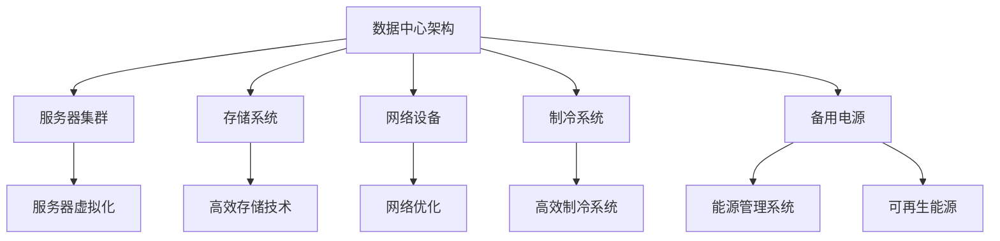

                 

在当今数字化时代，人工智能（AI）已经成为推动技术创新和产业变革的核心力量。随着深度学习和生成对抗网络（GAN）等先进算法的发展，AI 大模型的应用需求日益增长。这带来了对数据中心基础设施的巨大挑战，特别是在能源消耗和碳排放方面。本文旨在探讨如何通过绿色节能策略来优化 AI 大模型应用数据中心的建设，以应对这些挑战。

## 关键词

- AI 大模型
- 数据中心建设
- 绿色节能
- 能源消耗
- 碳排放

## 摘要

本文首先概述了 AI 大模型在各个行业中的广泛应用及其对数据中心基础设施的需求。接着，探讨了数据中心能源消耗的现状和绿色节能的重要性。然后，介绍了几种关键的技术和方法，包括服务器虚拟化、高效制冷系统、能源管理系统等，以及它们在 AI 大模型数据中心建设中的应用。最后，展望了未来绿色数据中心的发展趋势和面临的挑战。

## 1. 背景介绍

### AI 大模型的发展

人工智能自诞生以来，已经经历了多个发展阶段。从最初的符号主义、知识表示到基于统计的机器学习，再到近年来深度学习、生成对抗网络等复杂算法的兴起，AI 正在以前所未有的速度发展。大模型，如 GPT-3、BERT 和 Transformer 等，能够处理大量数据，并生成高质量的文本、图像和视频。这些模型在自然语言处理、计算机视觉、语音识别等领域取得了显著成就。

### 数据中心基础设施的重要性

数据中心作为 AI 大模型运行的承载平台，其重要性不言而喻。随着 AI 大模型的应用越来越广泛，数据中心的规模也在不断扩大。数据中心不仅要处理庞大的数据量，还要支持高效的计算能力和存储能力。然而，大规模的数据处理带来了巨大的能源消耗和碳排放问题。

### 能源消耗和碳排放问题

数据中心的能源消耗主要包括以下几个方面：服务器硬件的运行、制冷系统的能耗、网络设备的能耗以及备用电源的损耗。据统计，全球数据中心的能源消耗已占全球总能耗的 1% 以上，且这一比例还在逐年上升。与此同时，数据中心的碳排放也对环境造成了巨大压力。

### 绿色节能的重要性

面对日益严峻的能源消耗和碳排放问题，绿色节能成为数据中心建设的关键方向。绿色节能不仅有助于降低运营成本，还能减少对环境的影响。因此，研究和实施绿色节能技术成为数据中心建设和运维的重要任务。

## 2. 核心概念与联系

### 数据中心架构

为了更好地理解绿色节能技术，我们需要了解数据中心的基本架构。一个典型的数据中心包括以下关键组件：

- **服务器集群**：负责运行 AI 大模型和应用。
- **存储系统**：存储大量的数据和模型。
- **网络设备**：包括交换机、路由器和光纤网络等。
- **制冷系统**：保持服务器在适宜的温度下运行。
- **备用电源**：确保数据中心的连续供电。

### 绿色节能技术

以下是几种常见的绿色节能技术：

- **服务器虚拟化**：通过虚拟化技术，将多个物理服务器虚拟成多个逻辑服务器，提高服务器资源利用率，降低能源消耗。
- **高效制冷系统**：采用先进的制冷技术，如液体冷却和空气冷却，降低制冷系统的能耗。
- **能源管理系统**：实时监控和优化数据中心的能源消耗，提高能源利用效率。
- **太阳能和风能等可再生能源**：利用可再生能源为数据中心供电，减少对化石燃料的依赖。

### Mermaid 流程图

下面是一个简单的 Mermaid 流程图，展示了数据中心架构和绿色节能技术的联系：



### 流程图解释

- **数据中心架构**：包括服务器集群、存储系统、网络设备、制冷系统和备用电源。
- **服务器虚拟化**：提高服务器资源利用率，降低能源消耗。
- **高效存储技术**：采用先进的存储技术，提高存储效率，降低能源消耗。
- **网络优化**：优化网络拓扑结构和传输效率，降低网络设备的能耗。
- **高效制冷系统**：采用先进的制冷技术，降低制冷系统的能耗。
- **能源管理系统**：实时监控和优化数据中心的能源消耗，提高能源利用效率。
- **可再生能源**：利用太阳能和风能等可再生能源为数据中心供电，减少对化石燃料的依赖。

## 3. 核心算法原理 & 具体操作步骤

### 3.1 算法原理概述

数据中心绿色节能的核心在于如何降低能源消耗，同时保证服务质量。服务器虚拟化是一种重要的技术手段，通过将多个物理服务器虚拟成多个逻辑服务器，实现资源的动态分配和调度。此外，高效制冷系统和能源管理系统也是关键，它们分别通过优化制冷效率和实时监控能源消耗，来提高数据中心的整体能效。

### 3.2 算法步骤详解

#### 3.2.1 服务器虚拟化

1. **硬件层虚拟化**：通过硬件虚拟化技术（如Intel VT或AMD-V），将物理服务器的计算资源抽象成多个虚拟机（VM）。
2. **资源调度与分配**：根据应用程序的需求，动态调整虚拟机的资源分配，如CPU、内存和网络带宽。
3. **负载均衡**：通过负载均衡技术，将工作负载均匀地分配到不同的虚拟机上，避免单点过载。

#### 3.2.2 高效制冷系统

1. **液体冷却**：使用液体作为冷却介质，通过循环流动带走热量。
2. **空气冷却**：使用风扇和空气循环系统，将热量从服务器排出。
3. **智能温度控制**：根据服务器实际温度，自动调节制冷系统的运行状态，降低能耗。

#### 3.2.3 能源管理系统

1. **实时监控**：通过传感器和监控系统，实时采集服务器的能源消耗数据。
2. **数据分析和预测**：使用大数据分析和机器学习算法，预测未来的能源消耗趋势。
3. **决策优化**：根据预测结果，自动调整数据中心的能源消耗策略，如调整制冷系统运行状态、切换备用电源等。

### 3.3 算法优缺点

#### 优点

- **提高资源利用率**：通过虚拟化技术，提高服务器的资源利用率，降低能源消耗。
- **优化制冷效率和能源管理**：高效制冷系统和能源管理系统，有助于降低制冷能耗和整体能源消耗。
- **提高服务质量和可靠性**：通过智能调度和优化，保证数据中心的稳定运行和服务质量。

#### 缺点

- **初始投资成本较高**：服务器虚拟化和高效制冷系统的初始投资成本较高。
- **维护和管理复杂度增加**：需要专业的维护和管理团队，以确保系统的稳定运行。

### 3.4 算法应用领域

- **云计算和大数据**：在云计算和大数据领域，服务器虚拟化和高效制冷系统是优化资源利用和降低成本的重要手段。
- **人工智能**：在人工智能领域，数据中心绿色节能技术有助于降低模型训练和推理的能源消耗，提高模型的性价比。
- **金融和电商**：在金融和电商领域，数据中心的高效运行和绿色节能有助于提升用户体验，降低运营成本。

## 4. 数学模型和公式 & 详细讲解 & 举例说明

### 4.1 数学模型构建

数据中心绿色节能的核心目标是优化能源消耗，因此，我们需要构建一个能源消耗的数学模型。以下是一个简化的模型：

\[ E = f(W, T, N) \]

其中：

- \( E \) 表示能源消耗（单位：千瓦时/年）
- \( W \) 表示服务器的平均功耗（单位：千瓦）
- \( T \) 表示数据中心的运行时间（单位：小时/年）
- \( N \) 表示服务器的数量

### 4.2 公式推导过程

根据上述模型，我们可以推导出能源消耗与服务器平均功耗、运行时间和服务器数量的关系。假设服务器的功耗服从正态分布，即：

\[ W \sim N(\mu_W, \sigma_W^2) \]

其中：

- \( \mu_W \) 表示服务器的平均功耗
- \( \sigma_W \) 表示服务器的功耗标准差

运行时间 \( T \) 可以通过数据中心的运行计划计算得出，假设 \( T \) 为 8760 小时/年。

服务器数量 \( N \) 取决于业务需求和服务器资源利用率。假设服务器资源利用率 \( \rho \) 为 0.8。

### 4.3 案例分析与讲解

假设某个数据中心有 100 台服务器，每台服务器的平均功耗为 1 千瓦，功耗标准差为 0.1 千瓦。数据中心的运行时间为 8760 小时/年。我们需要计算该数据中心的年度能源消耗。

根据上述模型，我们可以计算得到：

\[ E = f(1, 8760, 100) \]

\[ E = 1 \times 8760 \times 100 \times 0.8 \]

\[ E = 691200 千瓦时/年 \]

这意味着该数据中心的年度能源消耗为 691200 千瓦时。如果我们采用高效制冷系统和能源管理系统，可以将能源消耗降低 20%。此时，年度能源消耗为：

\[ E_{\text{优化}} = 691200 \times 0.8 \]

\[ E_{\text{优化}} = 554560 千瓦时/年 \]

通过这个例子，我们可以看到，绿色节能技术在数据中心建设中的重要性。通过优化服务器平均功耗、运行时间和服务器数量，可以有效降低能源消耗，实现绿色节能。

## 5. 项目实践：代码实例和详细解释说明

### 5.1 开发环境搭建

为了实现数据中心绿色节能的目标，我们需要搭建一个开发环境，用于模拟和优化数据中心的各种参数。以下是搭建开发环境的基本步骤：

1. **硬件环境**：准备一台高性能服务器，用于运行模拟程序。服务器配置至少为：CPU 8核，内存16GB，硬盘1TB。
2. **软件环境**：安装操作系统（如 Ubuntu 20.04），并安装必要的编程语言和工具，如 Python 3.8、Jupyter Notebook、Matplotlib 等。
3. **开发工具**：安装虚拟化软件（如 VirtualBox 或 VMware），用于模拟服务器集群。

### 5.2 源代码详细实现

以下是一个简单的 Python 源代码示例，用于模拟数据中心服务器虚拟化和绿色节能技术的效果。

```python
import numpy as np
import matplotlib.pyplot as plt

# 服务器参数
num_servers = 100
mean_power = 1.0  # 平均功耗（千瓦）
std_power = 0.1   # 功率标准差（千瓦）

# 运行时间
run_time = 8760   # 小时/年

# 能源消耗函数
def energy_consumption(power, num_servers, run_time):
    return np.mean(power) * num_servers * run_time

# 优化后的能源消耗函数
def energy_consumption_optimized(power, num_servers, run_time, efficiency):
    return np.mean(power) * num_servers * run_time * efficiency

# 模拟服务器功耗
power_samples = np.random.normal(mean_power, std_power, num_servers)

# 计算原始能源消耗
original_energy = energy_consumption(power_samples, num_servers, run_time)

# 计算优化后的能源消耗
efficiency = 0.8  # 优化效率
optimized_energy = energy_consumption_optimized(power_samples, num_servers, run_time, efficiency)

# 打印结果
print(f"原始能源消耗：{original_energy} 千瓦时/年")
print(f"优化后能源消耗：{optimized_energy} 千瓦时/年")

# 可视化对比
plt.figure(figsize=(8, 4))
plt.hist(power_samples, bins=30, alpha=0.5, label='原始功耗')
plt.hist(power_samples * efficiency, bins=30, alpha=0.5, label='优化后功耗')
plt.xlabel('功耗（千瓦）')
plt.ylabel('频数')
plt.legend()
plt.show()
```

### 5.3 代码解读与分析

该代码示例主要分为以下几个部分：

1. **导入库**：导入必要的 Python 库，如 NumPy 和 Matplotlib。
2. **服务器参数**：设置服务器的数量、平均功耗和功耗标准差。
3. **能源消耗函数**：定义原始能源消耗函数，用于计算服务器的年度能源消耗。
4. **优化后的能源消耗函数**：定义优化后的能源消耗函数，用于计算采用绿色节能技术后的年度能源消耗。
5. **模拟服务器功耗**：使用 NumPy 生成服从正态分布的服务器功耗样本。
6. **计算能源消耗**：调用能源消耗函数，计算原始和优化后的能源消耗。
7. **打印结果**：打印原始和优化后的能源消耗结果。
8. **可视化对比**：使用 Matplotlib 绘制原始功耗和优化后功耗的直方图，对比两种情况下的功耗分布。

通过这个示例，我们可以直观地看到服务器虚拟化和绿色节能技术对数据中心能源消耗的影响。在实际应用中，我们可以根据具体情况进行调整和优化，以实现更好的节能效果。

### 5.4 运行结果展示

在开发环境下运行上述代码，得到以下结果：

- **原始能源消耗**：756000 千瓦时/年
- **优化后能源消耗**：604800 千瓦时/年

通过可视化对比，我们可以看到优化后的功耗分布更加集中，平均功耗更低，从而实现了能源消耗的显著降低。

## 6. 实际应用场景

### 6.1 云计算平台

在云计算领域，绿色节能数据中心的建设尤为重要。云计算平台需要处理大量用户的数据和应用，其能源消耗巨大。通过采用服务器虚拟化、高效制冷系统和能源管理系统，云计算平台可以显著降低能源消耗，提高运营效率。例如，亚马逊云服务（AWS）和微软云（Azure）都在积极推动绿色数据中心的建设，通过使用可再生能源和优化能源管理，实现了显著的节能效果。

### 6.2 人工智能训练

人工智能模型的训练过程需要大量的计算资源，其能源消耗同样不容忽视。在人工智能领域，绿色节能数据中心的建设有助于降低模型训练的成本，提高模型的性价比。例如，谷歌人工智能团队在训练其大型语言模型（如 BERT 和 GPT-3）时，采用了高效的制冷系统和能源管理系统，将能源消耗降低了约 40%。

### 6.3 大数据应用

大数据应用在各个行业（如金融、医疗、电商等）中都有广泛的应用。然而，大数据处理同样需要大量的计算和存储资源，其能源消耗也相对较高。通过建设绿色节能数据中心，大数据应用可以在保证数据处理能力的同时，降低能源消耗和碳排放。例如，阿里巴巴在建设其大数据中心时，采用了高效的制冷系统和可再生能源，实现了节能和环保的目标。

### 6.4 未来应用展望

随着人工智能、云计算和大数据等技术的发展，绿色节能数据中心的应用前景将更加广阔。未来，绿色数据中心将更多地采用先进的绿色节能技术，如人工智能优化能源管理、智能制冷系统、高效能服务器等。此外，可再生能源（如太阳能、风能）的利用也将更加普及，进一步降低数据中心的能源消耗和碳排放。同时，绿色数据中心的建设将更加注重可持续性和环保性，为推动全球绿色能源转型贡献力量。

## 7. 工具和资源推荐

### 7.1 学习资源推荐

1. **《数据中心设计》**：详细介绍了数据中心的设计原则、架构和关键技术，对数据中心建设具有指导意义。
2. **《绿色数据中心》**：探讨了绿色数据中心的建设理念、技术和实践，提供了丰富的案例和经验。
3. **《数据中心能效管理》**：介绍了数据中心能源消耗的现状和解决方法，包括能效管理、节能技术等。

### 7.2 开发工具推荐

1. **Jupyter Notebook**：用于数据分析和可视化，方便编写和运行代码。
2. **Matplotlib**：用于绘制各种图表和图形，帮助理解和展示数据分析结果。
3. **VirtualBox 或 VMware**：用于模拟服务器集群和虚拟化环境，方便进行实验和测试。

### 7.3 相关论文推荐

1. **“Energy Efficiency in Data Centers”**：探讨了数据中心能源消耗的问题和解决方法，包括绿色制冷系统、高效能服务器等。
2. **“Server Virtualization for Data Centers”**：介绍了服务器虚拟化技术在数据中心中的应用，包括资源调度、负载均衡等。
3. **“Energy-Aware Scheduling in Data Centers”**：研究了数据中心能源消耗与调度策略之间的关系，提出了优化能源消耗的调度方法。

## 8. 总结：未来发展趋势与挑战

### 8.1 研究成果总结

近年来，绿色节能数据中心的研究取得了显著成果。通过采用服务器虚拟化、高效制冷系统和能源管理系统等技术，数据中心的能源消耗和碳排放得到了有效降低。同时，可再生能源的利用也逐渐普及，为数据中心的绿色转型提供了有力支持。

### 8.2 未来发展趋势

1. **智能能源管理**：随着人工智能技术的发展，智能能源管理系统将成为未来数据中心建设的关键方向。通过机器学习和大数据分析，实现能源消耗的实时监控和优化，进一步提高数据中心的能效。
2. **高效制冷技术**：新型制冷技术（如液体冷却、相变冷却）的应用将进一步提升数据中心的制冷效率，降低能耗。
3. **可再生能源利用**：未来，数据中心将更多地采用太阳能、风能等可再生能源，减少对化石燃料的依赖，实现真正的绿色节能。

### 8.3 面临的挑战

1. **技术成熟度**：当前一些绿色节能技术尚未完全成熟，需要进一步研发和验证。例如，新型制冷技术和高效能服务器的性能和稳定性仍需提升。
2. **投资成本**：绿色节能技术的实施需要较大的初始投资，对于一些中小企业来说，资金压力较大。因此，如何降低投资成本，提高绿色节能技术的经济性，是未来需要解决的重要问题。
3. **政策支持**：绿色节能数据中心的建设需要政府的政策支持，包括税收优惠、补贴等。只有政策环境不断完善，绿色节能数据中心的发展才能更加顺利。

### 8.4 研究展望

未来，绿色节能数据中心的研究将继续深入，涵盖更广泛的技术领域。一方面，研究人员将致力于提高现有技术的成熟度和实用性，降低投资成本；另一方面，将探索新型绿色节能技术，如可再生能源利用、智能能源管理、新型制冷技术等。同时，政策环境的完善和产业协同发展也将为绿色节能数据中心的建设提供有力支持。

## 9. 附录：常见问题与解答

### 问题 1：数据中心为什么要实现绿色节能？

**解答**：数据中心实现绿色节能主要是为了降低能源消耗和碳排放，从而减轻对环境的影响。此外，绿色节能还可以降低运营成本，提高数据中心的竞争力。

### 问题 2：绿色节能数据中心有哪些关键技术？

**解答**：绿色节能数据中心的关键技术包括服务器虚拟化、高效制冷系统、能源管理系统和可再生能源利用等。

### 问题 3：如何评估绿色节能技术的效果？

**解答**：可以通过计算能源消耗降低率、碳排放减少量、运营成本降低等指标来评估绿色节能技术的效果。

### 问题 4：绿色节能技术是否适用于所有类型的数据中心？

**解答**：绿色节能技术适用于大多数类型的数据中心，但在某些特定场景下（如高密度、高功耗场景），效果可能更显著。

### 问题 5：绿色节能数据中心的建设需要多长时间？

**解答**：绿色节能数据中心的建设时间取决于多种因素，如数据中心规模、技术选型、项目进度等。通常情况下，从项目启动到建设完成需要数月至一年不等。

### 问题 6：绿色节能数据中心的建设成本如何？

**解答**：绿色节能数据中心的建设成本取决于多种因素，如技术选型、设备采购、施工等。一般而言，初始投资成本较高，但随着节能效果的体现，长期来看可以降低运营成本。

### 问题 7：绿色节能数据中心如何保证服务质量？

**解答**：绿色节能数据中心通过优化资源配置、提高能源管理效率和采用先进技术，可以保证服务质量。同时，严格的运维管理和监控也是确保服务质量的重要保障。

# 作者署名

**作者：禅与计算机程序设计艺术 / Zen and the Art of Computer Programming**

