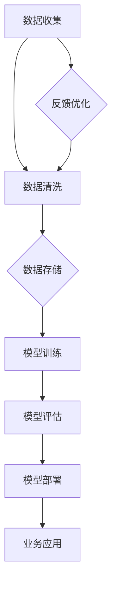

                 

关键词：人工智能，大数据模型，数据中心，智能时代，核心基础，技术架构，算法优化，应用领域。

> 摘要：本文将深入探讨人工智能（AI）大模型应用数据中心的建设，分析其在智能时代的核心地位，详细阐述技术架构、算法优化、应用领域等方面的内容，旨在为构建智能化时代的核心基础设施提供参考。

## 1. 背景介绍

在当前全球信息化和数字化进程加速的背景下，人工智能（AI）技术正迅速崛起，成为推动社会变革的重要力量。AI 大模型作为人工智能领域的重要技术，已经在图像识别、自然语言处理、推荐系统、智能决策等领域展现出强大的应用价值。然而，AI 大模型的研发和应用离不开高效、稳定、安全的数据中心支持。因此，建设一个功能强大、性能优越的 AI 大模型应用数据中心，成为了智能化时代的一项重要任务。

## 2. 核心概念与联系

### 2.1 数据中心的基本概念

数据中心（Data Center）是集中存储、处理和管理大量数据的服务设施。它通常由服务器、存储设备、网络设备、安全系统等多个组成部分构成。数据中心的建设和管理对于企业的业务运营、数据安全和系统稳定性具有至关重要的作用。

### 2.2 AI 大模型的概念及特点

AI 大模型是指具有海量参数和复杂结构的深度学习模型，如 Transformer、BERT、GPT 等。这些模型通过学习大量数据，可以自动提取知识、生成文本、进行图像识别等，具有强大的表达能力和泛化能力。

### 2.3 数据中心与 AI 大模型的联系

数据中心为 AI 大模型的训练和部署提供了计算资源和存储空间。一个高效的 AI 大模型应用数据中心需要满足以下要求：

- 高性能计算资源：为模型训练提供强大的计算能力。
- 大容量存储空间：存储海量训练数据和模型参数。
- 稳定的网络环境：保证数据传输的速度和可靠性。
- 安全防护措施：保护数据和系统的安全。

### 2.4 Mermaid 流程图

下面是一个描述数据中心与 AI 大模型联系的基本流程图。



## 3. 核心算法原理 & 具体操作步骤

### 3.1 算法原理概述

AI 大模型的训练过程主要包括数据预处理、模型训练和模型评估等步骤。其中，模型训练是核心环节，涉及到损失函数、优化算法、正则化技术等多个方面。

### 3.2 算法步骤详解

- 数据预处理：对原始数据进行清洗、归一化、编码等处理，以适应模型训练的需求。
- 模型训练：通过迭代优化模型参数，使得模型在训练数据上达到较高的准确性。
- 模型评估：使用验证集和测试集评估模型的性能，调整模型参数，以优化模型效果。
- 模型部署：将训练好的模型部署到生产环境中，为实际业务应用提供服务。

### 3.3 算法优缺点

- 优点：AI 大模型具有强大的表达能力和泛化能力，可以处理复杂的任务。
- 缺点：模型训练需要大量计算资源和时间，对数据质量和标注要求较高。

### 3.4 算法应用领域

AI 大模型在计算机视觉、自然语言处理、推荐系统、智能决策等领域具有广泛的应用。例如，在计算机视觉领域，AI 大模型可以用于图像分类、目标检测、人脸识别等；在自然语言处理领域，AI 大模型可以用于文本分类、机器翻译、情感分析等。

## 4. 数学模型和公式 & 详细讲解 & 举例说明

### 4.1 数学模型构建

AI 大模型的数学模型主要基于深度学习理论。深度学习模型通常由多层神经网络构成，每一层都包含大量神经元。神经元的激活函数通常采用 sigmoid、ReLU 等函数。

### 4.2 公式推导过程

以多层感知机（MLP）为例，其输出公式为：

$$
y = \sigma(\boldsymbol{W}_L \cdot \boldsymbol{a}_{L-1} + b_L)
$$

其中，$\sigma$ 表示激活函数，$\boldsymbol{W}_L$ 和 $b_L$ 分别为第 $L$ 层的权重和偏置。

### 4.3 案例分析与讲解

以图像分类任务为例，我们使用卷积神经网络（CNN）进行模型训练。CNN 的主要优势在于其能够自动提取图像的特征，提高模型的表达能力。

## 5. 项目实践：代码实例和详细解释说明

### 5.1 开发环境搭建

- 操作系统：Ubuntu 18.04
- 编程语言：Python 3.8
- 深度学习框架：TensorFlow 2.6

### 5.2 源代码详细实现

```python
import tensorflow as tf
from tensorflow.keras.layers import Dense, Flatten, Conv2D, MaxPooling2D
from tensorflow.keras.models import Sequential

# 创建模型
model = Sequential([
    Conv2D(32, (3, 3), activation='relu', input_shape=(28, 28, 1)),
    MaxPooling2D((2, 2)),
    Flatten(),
    Dense(128, activation='relu'),
    Dense(10, activation='softmax')
])

# 编译模型
model.compile(optimizer='adam',
              loss='sparse_categorical_crossentropy',
              metrics=['accuracy'])

# 训练模型
model.fit(x_train, y_train, epochs=5, validation_split=0.2)
```

### 5.3 代码解读与分析

以上代码实现了使用 TensorFlow 框架构建一个简单的 CNN 模型，用于对 MNIST 数据集进行图像分类。

### 5.4 运行结果展示

在训练过程中，我们可以观察到模型在训练集和验证集上的准确率逐渐提高。训练完成后，我们可以使用测试集评估模型的性能。

## 6. 实际应用场景

AI 大模型应用数据中心在实际应用场景中发挥着重要作用，如：

- 智能医疗：利用 AI 大模型进行疾病诊断、药物研发等。
- 智能金融：利用 AI 大模型进行风险控制、投资决策等。
- 智能交通：利用 AI 大模型进行交通流量预测、自动驾驶等。

## 7. 未来应用展望

随着 AI 技术的不断发展，AI 大模型应用数据中心在未来将呈现出以下发展趋势：

- 模型规模不断扩大，计算需求进一步提升。
- 数据中心架构将更加灵活、高效、可扩展。
- 安全性、隐私保护成为重要关注点。
- AI 大模型与云计算、物联网等技术的融合应用。

## 8. 工具和资源推荐

### 8.1 学习资源推荐

- 《深度学习》（Goodfellow, Bengio, Courville 著）
- 《动手学深度学习》（阿斯顿·张等著）
- 《机器学习实战》（Peter Harrington 著）

### 8.2 开发工具推荐

- TensorFlow
- PyTorch
- Keras

### 8.3 相关论文推荐

- “Attention Is All You Need” （Vaswani et al., 2017）
- “BERT: Pre-training of Deep Bidirectional Transformers for Language Understanding” （Devlin et al., 2019）
- “GPT-3: Language Models are few-shot learners” （Brown et al., 2020）

## 9. 总结：未来发展趋势与挑战

AI 大模型应用数据中心在智能时代具有巨大的发展潜力。然而，面对不断增长的计算需求、数据隐私保护、安全挑战等问题，数据中心建设需要不断创新和优化。未来，数据中心将朝着更高效、更智能、更安全的方向发展，为人工智能技术的广泛应用提供坚实保障。

## 附录：常见问题与解答

### 问题1：如何保证 AI 大模型训练的稳定性？

解答：为了保证 AI 大模型训练的稳定性，可以从以下几个方面入手：

- 优化超参数设置，如学习率、批量大小等。
- 使用正则化技术，如 L1、L2 正则化等。
- 采用随机化技术，如随机初始化权重、随机打乱训练数据等。

### 问题2：如何处理大规模数据集的存储和传输？

解答：对于大规模数据集的存储和传输，可以采取以下措施：

- 使用分布式存储系统，如 HDFS、Cassandra 等。
- 采用数据压缩技术，减少数据存储和传输的开销。
- 使用高速网络，如 10G 以太网、Infiniband 等，提高数据传输速度。

### 问题3：如何确保 AI 大模型训练过程中的数据安全和隐私？

解答：在 AI 大模型训练过程中，确保数据安全和隐私是至关重要的。可以采取以下措施：

- 使用加密技术，对敏感数据进行加密存储和传输。
- 实施访问控制策略，限制对敏感数据的访问权限。
- 采用数据脱敏技术，将敏感数据转换为不可识别的形式。

### 问题4：如何优化 AI 大模型训练的效率？

解答：为了优化 AI 大模型训练的效率，可以从以下几个方面入手：

- 使用 GPU、TPU 等高性能计算设备进行训练。
- 采用分布式训练技术，将模型训练任务分布到多个计算节点上。
- 优化网络结构，减少模型参数的数量和计算量。
- 采用迁移学习技术，利用预训练模型进行微调，减少训练时间。

## 作者署名

作者：禅与计算机程序设计艺术 / Zen and the Art of Computer Programming

----------------------------------------------------------------

以上就是本文的完整内容，希望对您在 AI 大模型应用数据中心建设方面有所启发和帮助。在后续的研究中，我们将继续深入探讨相关技术和应用，为构建智能时代的核心基础设施贡献力量。感谢您的阅读！

