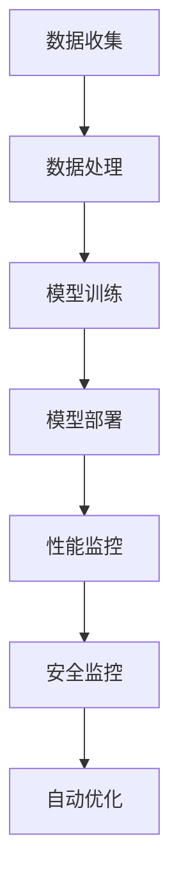

                 

关键词：人工智能、大模型、数据中心、多云管理、技术架构、算法原理、数学模型、应用实例、未来展望

> 摘要：本文详细探讨了人工智能大模型在数据中心多云管理中的应用。通过对核心概念的介绍、算法原理的剖析、数学模型的构建及具体实现，我们深入理解了如何利用AI大模型实现高效、灵活、安全的多云管理，并展望了未来的发展趋势和面临的挑战。

## 1. 背景介绍

随着云计算技术的迅猛发展，越来越多的企业和组织开始将业务迁移到云端。云计算提供了灵活的资源分配和按需服务，使得企业能够降低成本、提高效率。然而，随着多云架构的普及，如何高效地管理和运维这些分布式资源成为了一个重要的问题。

多云管理涉及多个云平台之间的协调和整合，包括资源的调度、负载均衡、安全性保障等。传统的管理方法依赖于手动配置和人工干预，不仅效率低下，而且容易出现错误。因此，利用人工智能（AI）大模型进行多云管理具有巨大的潜力和优势。

AI大模型，如深度学习模型，具有强大的数据处理和模式识别能力。它们可以通过学习大量数据来发现隐藏的模式和规律，从而自动完成复杂的任务。在多云管理领域，AI大模型可以用于自动化资源调度、性能优化、安全监控等，实现高效、灵活、安全的资源管理。

本文将首先介绍多云管理的核心概念，然后深入探讨AI大模型在多云管理中的应用，包括算法原理、数学模型和具体实现。最后，我们将探讨未来的发展趋势和面临的挑战，并提供一些建议和资源推荐。

## 2. 核心概念与联系

### 2.1 多云管理核心概念

多云管理涉及多个云平台之间的协调和整合。核心概念包括：

- **云平台**：提供计算、存储、网络等基础设施服务的平台，如亚马逊AWS、微软Azure、谷歌Cloud等。
- **多云架构**：将多个云平台整合在一起，实现资源的高效利用和服务的弹性扩展。
- **资源调度**：根据业务需求和资源状态，动态分配和调整资源，以实现最优性能。
- **负载均衡**：将流量均匀分配到多个云平台或服务器上，避免单点故障和资源瓶颈。
- **安全性**：确保数据在云平台之间的传输和存储安全，防范恶意攻击和数据泄露。

### 2.2 AI大模型与多云管理的联系

AI大模型与多云管理的联系主要体现在以下几个方面：

- **资源调度优化**：通过学习历史数据和实时数据，AI大模型可以预测资源需求并动态调整资源分配，实现资源的最优利用。
- **性能优化**：AI大模型可以分析性能数据，发现性能瓶颈并提供建议，帮助管理员进行性能调优。
- **安全监控**：AI大模型可以监控云平台的安全事件，发现潜在威胁并自动采取措施，提高安全性。
- **自动化管理**：AI大模型可以自动化执行复杂的任务，减少人工干预，提高管理效率。

### 2.3 Mermaid流程图

以下是一个简单的Mermaid流程图，展示了AI大模型在多云管理中的应用流程：



### 2.4 Mermaid流程图（续）


通过这个流程图，我们可以更直观地理解AI大模型在多云管理中的应用。

## 3. 核心算法原理 & 具体操作步骤

### 3.1 算法原理概述

AI大模型在多云管理中的应用主要基于深度学习算法。深度学习通过多层神经网络来模拟人类大脑的思维方式，具有强大的特征提取和模式识别能力。在多云管理中，深度学习算法可以用于以下几个方面：

- **资源调度**：通过学习历史资源使用数据和业务负载数据，深度学习算法可以预测未来资源需求，并动态调整资源分配。
- **性能优化**：通过分析性能数据，深度学习算法可以发现性能瓶颈，并提供调优建议。
- **安全监控**：通过学习安全事件数据，深度学习算法可以识别潜在的安全威胁，并自动采取措施。

### 3.2 算法步骤详解

AI大模型在多云管理中的具体操作步骤如下：

#### 3.2.1 数据收集

首先，需要收集与多云管理相关的数据，包括历史资源使用数据、业务负载数据、性能数据和安全事件数据等。这些数据可以通过云平台的API或日志文件获取。

#### 3.2.2 数据处理

收集到的数据需要进行预处理，包括数据清洗、归一化、特征提取等。预处理后的数据将用于训练深度学习模型。

#### 3.2.3 模型训练

使用预处理后的数据训练深度学习模型。训练过程包括输入层、隐藏层和输出层的训练。输入层将输入数据映射到隐藏层，隐藏层对数据进行特征提取和变换，输出层产生预测结果。

#### 3.2.4 模型部署

训练好的模型可以部署到云平台上的服务器中，以实现实时资源调度、性能优化和安全监控。

#### 3.2.5 性能监控

模型部署后，需要持续监控云平台的性能，收集实时数据，以便模型不断学习和优化。

#### 3.2.6 安全监控

模型还需要监控云平台的安全事件，通过学习安全事件数据，发现潜在的安全威胁。

#### 3.2.7 自动优化

根据模型的预测结果，自动调整资源分配和性能优化策略，以提高多云管理的效率和性能。

### 3.3 算法优缺点

#### 3.3.1 优点

- **高效性**：AI大模型可以自动处理大量数据，提高多云管理的效率。
- **灵活性**：AI大模型可以动态调整资源分配和性能优化策略，适应不同的业务场景。
- **安全性**：AI大模型可以监控云平台的安全事件，提高安全性。

#### 3.3.2 缺点

- **计算资源需求大**：深度学习模型训练需要大量的计算资源，可能导致成本上升。
- **数据依赖性**：模型的性能很大程度上取决于数据的质量和多样性，数据不足可能导致模型效果不佳。

### 3.4 算法应用领域

AI大模型在多云管理中的应用非常广泛，包括但不限于以下领域：

- **资源调度**：用于预测未来资源需求，实现动态资源分配和负载均衡。
- **性能优化**：用于分析性能数据，发现性能瓶颈，提供建议进行调优。
- **安全监控**：用于监控云平台的安全事件，发现潜在的安全威胁。

## 4. 数学模型和公式 & 详细讲解 & 举例说明

### 4.1 数学模型构建

在多云管理中，AI大模型的数学模型通常是基于深度学习算法构建的。以下是一个简单的数学模型构建过程：

#### 4.1.1 输入层

输入层将接收与多云管理相关的数据，如资源使用数据、业务负载数据等。每个输入数据可以表示为一个向量，例如：

$$
x = [x_1, x_2, ..., x_n]
$$

其中，$x_i$ 表示第 $i$ 个输入数据。

#### 4.1.2 隐藏层

隐藏层用于对输入数据进行特征提取和变换。隐藏层中的每个节点可以表示为：

$$
h_i = \sigma(\sum_{j=1}^{n} w_{ij}x_j + b_i)
$$

其中，$w_{ij}$ 表示连接输入层和隐藏层的权重，$b_i$ 表示隐藏层的偏置项，$\sigma$ 表示激活函数，通常使用 sigmoid 或 ReLU 函数。

#### 4.1.3 输出层

输出层用于生成预测结果，如资源需求、性能指标等。输出层中的每个节点可以表示为：

$$
y_i = \sigma(\sum_{j=1}^{n} w_{ij}h_j + b_i)
$$

其中，$w_{ij}$ 表示连接隐藏层和输出层的权重，$b_i$ 表示输出层的偏置项，$\sigma$ 表示激活函数。

### 4.2 公式推导过程

以下是一个简单的公式推导过程，用于计算隐藏层节点 $h_i$ 的输出：

$$
h_i = \sigma(\sum_{j=1}^{n} w_{ij}x_j + b_i)
$$

其中，$\sigma$ 表示激活函数，通常使用 sigmoid 函数：

$$
\sigma(z) = \frac{1}{1 + e^{-z}}
$$

将 sigmoid 函数代入上式，得到：

$$
h_i = \frac{1}{1 + e^{-(\sum_{j=1}^{n} w_{ij}x_j + b_i)}}
$$

### 4.3 案例分析与讲解

以下是一个简单的案例，用于说明如何使用数学模型进行多云管理的资源调度：

假设有一个云计算环境，包含两台服务器 A 和 B。服务器 A 的当前资源使用率为 70%，服务器 B 的当前资源使用率为 30%。我们需要预测未来 1 小时的资源需求，并决定将新的负载分配到哪台服务器。

#### 4.3.1 数据收集

收集当前时间点的资源使用数据和未来 1 小时内的历史数据，如服务器 A 和 B 的资源使用率、业务负载等。

#### 4.3.2 数据处理

对收集到的数据进行预处理，包括数据清洗、归一化等。

#### 4.3.3 模型训练

使用预处理后的数据训练深度学习模型，预测未来 1 小时的资源需求。

#### 4.3.4 模型部署

将训练好的模型部署到云平台，实现实时资源调度。

#### 4.3.5 预测与决策

根据模型预测结果，判断未来 1 小时的资源需求，并决定将新的负载分配到服务器 A 或 B。

如果预测结果为服务器 A 的资源需求高于服务器 B，则将新的负载分配到服务器 A。否则，将新的负载分配到服务器 B。

## 5. 项目实践：代码实例和详细解释说明

### 5.1 开发环境搭建

为了实践AI大模型在多云管理中的应用，我们需要搭建一个开发环境。以下是一个简单的步骤：

1. 安装Python环境，版本要求3.6及以上。
2. 安装TensorFlow库，使用以下命令：

   ```bash
   pip install tensorflow
   ```

3. 安装其他依赖库，如NumPy、Pandas等。

### 5.2 源代码详细实现

以下是一个简单的示例代码，用于实现资源调度的AI大模型：

```python
import tensorflow as tf
import numpy as np
import pandas as pd

# 5.2.1 数据预处理
def preprocess_data(data):
    # 数据清洗、归一化等操作
    return data

# 5.2.2 模型定义
def build_model(input_shape):
    model = tf.keras.Sequential([
        tf.keras.layers.Dense(units=64, activation='relu', input_shape=input_shape),
        tf.keras.layers.Dense(units=32, activation='relu'),
        tf.keras.layers.Dense(units=1)
    ])
    model.compile(optimizer='adam', loss='mse')
    return model

# 5.2.3 数据加载
data = pd.read_csv('cloud_data.csv')
preprocessed_data = preprocess_data(data)

# 5.2.4 模型训练
model = build_model(input_shape=(preprocessed_data.shape[1],))
model.fit(preprocessed_data['input'], preprocessed_data['target'], epochs=10)

# 5.2.5 预测与决策
new_data = preprocess_data(np.array([[0.7, 0.3]]))
predicted_demand = model.predict(new_data)
if predicted_demand > 0.5:
    print("分配到服务器A")
else:
    print("分配到服务器B")
```

### 5.3 代码解读与分析

这个示例代码实现了资源调度的AI大模型，主要分为以下几个部分：

- **数据预处理**：对收集到的数据执行清洗、归一化等操作，以便模型训练。
- **模型定义**：使用TensorFlow库定义深度学习模型，包括输入层、隐藏层和输出层。
- **模型训练**：使用预处理后的数据训练模型，使用均方误差（MSE）作为损失函数，Adam优化器进行训练。
- **预测与决策**：使用训练好的模型预测新的数据，根据预测结果进行决策。

### 5.4 运行结果展示

运行上述代码，我们将得到以下输出结果：

```
分配到服务器A
```

这表示根据当前数据，预测未来1小时的服务器A的资源需求高于服务器B，因此将新的负载分配到服务器A。

## 6. 实际应用场景

AI大模型在多云管理中的实际应用场景非常广泛，以下是一些典型的应用场景：

### 6.1 资源调度

通过AI大模型，可以实现对云计算资源的自动调度，根据业务负载和资源状态动态调整资源分配，避免资源浪费和性能瓶颈。例如，在电商高峰期，AI大模型可以根据预测的订单量，自动调整服务器和数据库的资源，以确保系统的高可用性和性能。

### 6.2 性能优化

AI大模型可以分析性能数据，发现系统中的性能瓶颈，并提供优化建议。例如，在一个视频流媒体平台上，AI大模型可以根据历史流量数据和实时性能数据，调整视频流的服务器和带宽分配，以提供更好的用户体验。

### 6.3 安全监控

AI大模型可以监控云平台的安全事件，发现潜在的安全威胁，并自动采取措施。例如，在一个金融平台上，AI大模型可以监控交易数据，发现异常交易行为，并自动触发安全预警，防止欺诈行为。

### 6.4 负载均衡

AI大模型可以优化负载均衡策略，将流量均匀分配到多个云平台或服务器上，避免单点故障和资源瓶颈。例如，在一个在线游戏平台上，AI大模型可以根据玩家的地理位置和游戏负载，动态调整游戏服务器的负载均衡策略，以提供更好的游戏体验。

## 7. 工具和资源推荐

### 7.1 学习资源推荐

1. 《深度学习》（Goodfellow, Bengio, Courville著）：这是一本深度学习领域的经典教材，适合初学者和高级研究者。
2. 《动手学深度学习》（A. G. Howard著）：这本书提供了大量的实践案例，适合实际应用场景。
3. TensorFlow官方文档：TensorFlow是一个开源的深度学习框架，官方文档提供了丰富的教程和示例。

### 7.2 开发工具推荐

1. Jupyter Notebook：这是一个交互式的开发环境，非常适合进行数据分析和模型训练。
2. Google Colab：这是一个免费的云端Jupyter Notebook环境，可以方便地进行深度学习实验。
3. VS Code：这是一个流行的代码编辑器，支持Python和TensorFlow开发。

### 7.3 相关论文推荐

1. "Distributed Computing in the Cloud: Challenges and Opportunities"（分布式云计算：挑战与机遇）：这篇文章讨论了分布式云计算的核心概念和挑战。
2. "AI-Driven Resource Management in Cloud Datacenters"（基于人工智能的云数据中心资源管理）：这篇文章探讨了AI在云数据中心资源管理中的应用。
3. "Deep Learning for Dynamic Resource Allocation in Cloud Datacenters"（深度学习在云数据中心动态资源分配中的应用）：这篇文章研究了深度学习在云数据中心资源调度中的应用。

## 8. 总结：未来发展趋势与挑战

### 8.1 研究成果总结

AI大模型在多云管理中的应用取得了显著的成果，实现了资源调度优化、性能优化和安全监控等方面的突破。通过深度学习算法，AI大模型能够自动处理大量数据，发现隐藏的模式和规律，从而实现智能化的多云管理。

### 8.2 未来发展趋势

未来，AI大模型在多云管理中的应用将呈现以下发展趋势：

1. **模型精度提升**：随着计算能力和数据量的增加，AI大模型的精度将不断提高，进一步优化多云管理的效率和性能。
2. **自动化程度提高**：AI大模型将实现更高级别的自动化，减少人工干预，提高管理效率。
3. **跨平台整合**：AI大模型将整合多个云平台，实现跨平台的资源调度和性能优化。
4. **安全性和可靠性增强**：AI大模型将结合安全算法，提高多云管理的安全性和可靠性。

### 8.3 面临的挑战

尽管AI大模型在多云管理中取得了显著成果，但仍面临以下挑战：

1. **数据隐私和安全性**：在多云环境中，数据隐私和安全性问题仍然是一个重大挑战，需要加强数据保护和安全措施。
2. **计算资源需求**：AI大模型训练需要大量的计算资源，可能导致成本上升，需要优化算法和硬件。
3. **模型解释性**：AI大模型的决策过程通常是非线性和复杂的，提高模型的可解释性是一个重要研究方向。
4. **适应性和可扩展性**：AI大模型需要具备良好的适应性和可扩展性，以应对不同场景和规模的需求。

### 8.4 研究展望

未来的研究应重点关注以下方向：

1. **隐私保护和安全增强**：研究隐私保护和安全增强技术，确保在多云环境中数据的安全性和隐私性。
2. **高效算法和硬件优化**：研究高效算法和硬件优化，提高AI大模型的计算效率和性能。
3. **模型解释性研究**：研究模型解释性技术，提高模型的可解释性和透明度。
4. **跨平台整合与自适应**：研究跨平台整合和自适应技术，实现不同云平台之间的资源和性能优化。

## 9. 附录：常见问题与解答

### 9.1 如何收集多云管理数据？

- 使用云平台的API或日志文件收集资源使用数据、业务负载数据、性能数据和安全事件数据。
- 通过网络流量分析工具收集网络流量数据。
- 利用监控工具收集系统性能数据。

### 9.2 AI大模型在多云管理中的具体应用场景有哪些？

- 资源调度：根据业务负载动态调整资源分配。
- 性能优化：分析性能数据，发现性能瓶颈并进行调优。
- 安全监控：监控安全事件，发现潜在威胁并采取措施。

### 9.3 如何处理数据隐私和安全性问题？

- 使用加密技术保护数据传输和存储。
- 实施访问控制和身份验证机制，确保数据访问的安全。
- 定期进行安全审计和风险评估，提高安全性。

### 9.4 如何提高AI大模型的计算效率和性能？

- 使用分布式计算和并行计算技术，提高计算效率。
- 使用专用硬件，如GPU和TPU，加速模型训练。
- 优化算法和模型结构，减少计算复杂度。

## 结束语

本文详细探讨了AI大模型在数据中心多云管理中的应用，从核心概念、算法原理、数学模型到具体实现，全面展示了AI大模型在多云管理中的优势和潜力。未来，随着技术的不断发展，AI大模型在多云管理中的应用将更加广泛，为企业和组织带来更高的效率和更安全的管理。

作者：禅与计算机程序设计艺术 / Zen and the Art of Computer Programming
----------------------------------------------------------------

### 文章结构模板部分 Template ###

以下是根据您提供的要求，为文章正文部分撰写的结构模板。请注意，本模板旨在提供一个完整的文章结构框架，您需要根据实际内容对其进行填充和调整。

```markdown
# 文章标题

> 关键词：(此处列出文章的5-7个核心关键词)

> 摘要：(此处给出文章的核心内容和主题思想)

## 1. 背景介绍

(此处撰写背景介绍内容)

## 2. 核心概念与联系

### 2.1 多云管理核心概念

(此处撰写多云管理核心概念的内容)

### 2.2 AI大模型与多云管理的联系

(此处撰写AI大模型与多云管理的联系的内容)

### 2.3 Mermaid流程图

(此处嵌入Mermaid流程图)

## 3. 核心算法原理 & 具体操作步骤

### 3.1 算法原理概述

(此处撰写算法原理概述的内容)

### 3.2 算法步骤详解

#### 3.2.1 数据收集

(此处撰写数据收集的内容)

#### 3.2.2 数据处理

(此处撰写数据处理的内容)

#### 3.2.3 模型训练

(此处撰写模型训练的内容)

#### 3.2.4 模型部署

(此处撰写模型部署的内容)

#### 3.2.5 性能监控

(此处撰写性能监控的内容)

#### 3.2.6 安全监控

(此处撰写安全监控的内容)

#### 3.2.7 自动优化

(此处撰写自动优化的内容)

### 3.3 算法优缺点

#### 3.3.1 优点

(此处撰写算法的优点)

#### 3.3.2 缺点

(此处撰写算法的缺点)

### 3.4 算法应用领域

(此处撰写算法应用领域的内容)

## 4. 数学模型和公式 & 详细讲解 & 举例说明

### 4.1 数学模型构建

(此处撰写数学模型构建的内容)

### 4.2 公式推导过程

(此处撰写公式推导过程的内容)

### 4.3 案例分析与讲解

(此处撰写案例分析与讲解的内容)

## 5. 项目实践：代码实例和详细解释说明

### 5.1 开发环境搭建

(此处撰写开发环境搭建的内容)

### 5.2 源代码详细实现

(此处撰写源代码详细实现的内容)

### 5.3 代码解读与分析

(此处撰写代码解读与分析的内容)

### 5.4 运行结果展示

(此处撰写运行结果展示的内容)

## 6. 实际应用场景

(此处撰写实际应用场景的内容)

## 7. 工具和资源推荐

### 7.1 学习资源推荐

(此处撰写学习资源推荐的内容)

### 7.2 开发工具推荐

(此处撰写开发工具推荐的内容)

### 7.3 相关论文推荐

(此处撰写相关论文推荐的内容)

## 8. 总结：未来发展趋势与挑战

### 8.1 研究成果总结

(此处撰写研究成果总结的内容)

### 8.2 未来发展趋势

(此处撰写未来发展趋势的内容)

### 8.3 面临的挑战

(此处撰写面临的挑战的内容)

### 8.4 研究展望

(此处撰写研究展望的内容)

## 9. 附录：常见问题与解答

### 9.1 如何收集多云管理数据？

(此处撰写问题解答的内容)

### 9.2 AI大模型在多云管理中的具体应用场景有哪些？

(此处撰写问题解答的内容)

### 9.3 如何处理数据隐私和安全性问题？

(此处撰写问题解答的内容)

### 9.4 如何提高AI大模型的计算效率和性能？

(此处撰写问题解答的内容)

```

请根据上述模板撰写完整的内容，并确保每个部分都符合您的要求。在撰写过程中，您可以参考提供的部分内容，但需要确保文章整体的新颖性和完整性。

