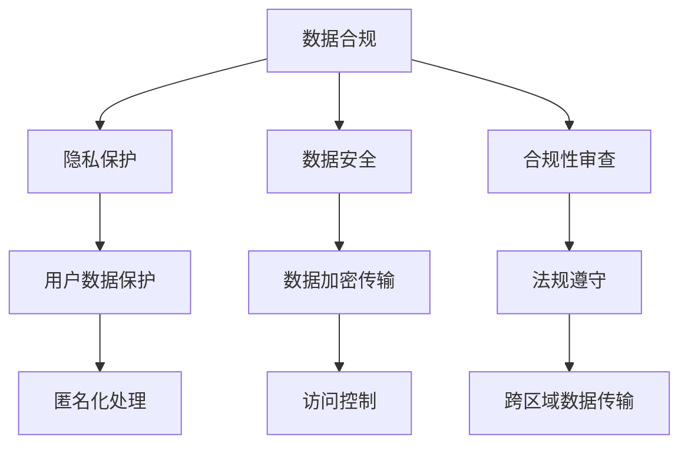

                 

关键词：AI大模型、数据中心、数据合规、隐私保护、数据安全、合规性审查、联邦学习、加密技术、跨区域数据传输。

> 摘要：随着人工智能（AI）大模型的迅速发展，其在数据中心的应用日益广泛。本文将探讨AI大模型在数据中心应用中的数据合规问题，包括隐私保护、数据安全、合规性审查等方面，并探讨相应的解决方案和未来发展方向。

## 1. 背景介绍

近年来，人工智能大模型（如GPT、BERT等）的涌现，使得数据中心在数据处理、分析和决策方面取得了显著的成果。这些大模型通常基于深度学习技术，需要大量数据进行训练和优化。因此，数据中心成为了AI大模型应用的重要基础。

然而，AI大模型在数据中心的应用也带来了数据合规的问题。首先，大模型需要处理大量的个人信息，如用户行为数据、身份信息等，这涉及到隐私保护的问题。其次，数据中心的数据存储和传输过程中，面临着数据泄露和滥用的风险。此外，不同地区和国家的数据保护法规和标准存在差异，如何保证数据在全球范围内的合规性也成为一个挑战。

## 2. 核心概念与联系

为了更好地理解AI大模型在数据中心应用中的数据合规问题，我们需要了解以下几个核心概念：

- **数据合规**：指在数据处理过程中遵守相关的法律、法规和标准，确保数据的合法性和安全性。
- **隐私保护**：指在数据处理过程中，保护个人信息不被未经授权的第三方获取和利用。
- **数据安全**：指在数据处理过程中，防止数据被篡改、破坏或泄露。
- **合规性审查**：指对数据处理活动进行审查，确保其符合相关法律法规和标准。

以下是关于这些概念和数据中心架构的Mermaid流程图：



## 3. 核心算法原理 & 具体操作步骤

### 3.1 算法原理概述

AI大模型在数据中心的应用主要基于深度学习技术。深度学习是一种模拟人脑神经元结构和功能的计算模型，通过多层神经网络进行数据的特征提取和模式识别。

在数据中心，AI大模型的训练和部署过程可以分为以下几个步骤：

1. 数据采集和预处理：从不同数据源收集数据，并进行清洗、归一化等预处理操作，以适应模型训练。
2. 模型训练：使用预处理后的数据对神经网络模型进行训练，通过反向传播算法不断调整模型参数，使其达到期望的性能。
3. 模型评估：使用测试数据对训练好的模型进行评估，以验证其准确性和泛化能力。
4. 模型部署：将训练好的模型部署到数据中心，以实现对实时数据的分析和预测。

### 3.2 算法步骤详解

1. **数据采集和预处理**：

   数据采集是AI大模型应用的第一步。数据中心可以从内部数据源（如数据库、日志文件等）和外部数据源（如公共数据集、社交媒体等）获取数据。在数据采集过程中，需要遵循隐私保护的原则，确保个人信息的匿名化和去标识化。

   数据预处理包括数据清洗、数据转换和数据增强等操作。数据清洗旨在去除无效、错误或重复的数据；数据转换将数据格式转换为适合模型训练的形式；数据增强通过生成虚拟数据来提高模型的泛化能力。

2. **模型训练**：

   模型训练是AI大模型应用的核心环节。在训练过程中，数据中心需要使用高效的计算资源和优化算法来提高训练效率。常见的训练算法包括梯度下降、随机梯度下降、Adam优化器等。

   在模型训练过程中，数据中心需要关注模型的收敛速度、准确率和泛化能力。通过调整学习率、批次大小等超参数，可以优化模型的性能。

3. **模型评估**：

   模型评估是验证模型性能的重要步骤。数据中心可以使用交叉验证、ROC曲线、AUC等指标来评估模型的准确率、召回率、F1分数等。

   评估过程中，数据中心需要关注模型的泛化能力，确保其在未知数据上的表现良好。此外，还需要关注模型的可解释性和透明度，以便用户理解和信任模型。

4. **模型部署**：

   模型部署是将训练好的模型应用到实际场景中的过程。数据中心可以将模型部署到云端、边缘设备或内部服务器上，以实现实时数据处理和分析。

   在部署过程中，数据中心需要考虑模型的性能、可扩展性和安全性。通过自动化部署和容器化技术，可以简化部署过程，提高系统的可靠性。

### 3.3 算法优缺点

AI大模型在数据中心的应用具有以下优点：

- **强大的数据处理能力**：AI大模型可以处理海量数据，挖掘数据中的潜在规律和模式。
- **高效的预测性能**：通过深度学习技术，AI大模型可以实现对实时数据的快速分析和预测。
- **灵活的应用场景**：AI大模型可以应用于各种领域，如自然语言处理、计算机视觉、推荐系统等。

然而，AI大模型在数据中心的应用也面临一些挑战：

- **数据隐私和安全性**：AI大模型在训练和部署过程中需要处理大量个人信息，如何保护用户隐私和安全成为一个重要问题。
- **计算资源需求高**：AI大模型通常需要大量的计算资源和存储空间，对数据中心的基础设施提出了较高要求。
- **模型解释性差**：AI大模型的学习过程高度复杂，难以解释其决策过程，这可能影响用户对模型的信任。

### 3.4 算法应用领域

AI大模型在数据中心的应用领域广泛，主要包括以下几个方面：

- **自然语言处理**：AI大模型可以用于文本分类、情感分析、机器翻译等自然语言处理任务，提升数据中心的文本处理能力。
- **计算机视觉**：AI大模型可以用于图像识别、目标检测、图像生成等计算机视觉任务，提升数据中心的图像分析能力。
- **推荐系统**：AI大模型可以用于构建个性化推荐系统，提升数据中心的用户体验。
- **金融风控**：AI大模型可以用于信用评估、风险预测等金融风控任务，提升数据中心的决策能力。

## 4. 数学模型和公式 & 详细讲解 & 举例说明

### 4.1 数学模型构建

AI大模型通常基于深度学习技术，其核心数学模型是多层神经网络。多层神经网络由输入层、隐藏层和输出层组成，通过反向传播算法不断调整网络参数，实现数据的特征提取和模式识别。

以下是多层神经网络的基本公式：

$$
z^{(l)} = \sum_{i} w^{(l)}_{ij} \cdot a^{(l-1)}_i + b^{(l)}_j
$$

$$
a^{(l)}_j = \sigma(z^{(l)}_j)
$$

其中，$z^{(l)}$表示第$l$层的输出，$w^{(l)}_{ij}$表示第$l$层中第$i$个神经元到第$l+1$层中第$j$个神经元的权重，$b^{(l)}_j$表示第$l$层中第$j$个神经元的偏置，$\sigma$表示激活函数。

### 4.2 公式推导过程

多层神经网络的训练过程可以通过反向传播算法实现。反向传播算法的核心思想是通过计算损失函数对网络参数进行梯度下降优化，从而减小损失函数的值。

以下是反向传播算法的推导过程：

1. 计算损失函数：

   损失函数是衡量模型预测结果与真实标签之间差异的指标。常见的损失函数有均方误差（MSE）、交叉熵（Cross Entropy）等。

   $$L = \frac{1}{2} \sum_{i} (y_i - \hat{y}_i)^2$$

   其中，$y_i$表示第$i$个样本的真实标签，$\hat{y}_i$表示第$i$个样本的预测标签。

2. 计算梯度：

   梯度是损失函数对网络参数的偏导数。通过计算梯度，可以确定网络参数的调整方向。

   $$\frac{\partial L}{\partial w^{(l)}_{ij}} = \frac{\partial L}{\partial z^{(l)}_j} \cdot \frac{\partial z^{(l)}_j}{\partial w^{(l)}_{ij}}$$

   $$\frac{\partial L}{\partial b^{(l)}_j} = \frac{\partial L}{\partial z^{(l)}_j}$$

3. 更新参数：

   通过计算梯度，可以使用梯度下降算法更新网络参数。

   $$w^{(l)}_{ij} := w^{(l)}_{ij} - \alpha \frac{\partial L}{\partial w^{(l)}_{ij}}$$

   $$b^{(l)}_j := b^{(l)}_j - \alpha \frac{\partial L}{\partial b^{(l)}_j}$$

其中，$\alpha$表示学习率。

### 4.3 案例分析与讲解

假设我们有一个简单的多层神经网络，包含一个输入层、一个隐藏层和一个输出层。输入层有3个神经元，隐藏层有5个神经元，输出层有2个神经元。

给定一个训练数据集，其中每个样本包含3个特征和一个标签。我们使用均方误差（MSE）作为损失函数。

首先，我们需要初始化网络参数，包括权重和偏置。

$$
w^{(1)}_{ij} \in [-1, 1], \quad b^{(1)}_j \in [-1, 1]
$$

$$
w^{(2)}_{ij} \in [-1, 1], \quad b^{(2)}_j \in [-1, 1]
$$

$$
w^{(3)}_{ij} \in [-1, 1], \quad b^{(3)}_j \in [-1, 1]
$$

然后，我们使用反向传播算法进行训练。假设我们使用学习率为0.1。

1. 计算损失函数：

   对于每个训练样本，我们计算预测标签和真实标签之间的差异，并求和得到总的损失函数值。

2. 计算梯度：

   对于每个神经元，我们计算损失函数对权重和偏置的偏导数。

3. 更新参数：

   根据梯度下降算法，我们使用学习率乘以梯度来更新权重和偏置。

通过多次迭代训练，我们可以逐渐减小损失函数的值，直到模型达到期望的性能。

## 5. 项目实践：代码实例和详细解释说明

### 5.1 开发环境搭建

为了实现AI大模型在数据中心的应用，我们需要搭建一个开发环境。以下是搭建步骤：

1. 安装Python环境：

   首先，我们安装Python环境，版本为3.8或更高版本。

   ```bash
   sudo apt-get update
   sudo apt-get install python3.8
   ```

2. 安装TensorFlow：

   TensorFlow是一个开源的深度学习框架，我们使用它来构建和训练神经网络。

   ```bash
   pip3 install tensorflow
   ```

3. 安装其他依赖库：

   我们还需要安装一些其他依赖库，如NumPy、Pandas等。

   ```bash
   pip3 install numpy pandas
   ```

### 5.2 源代码详细实现

以下是实现AI大模型在数据中心的应用的源代码：

```python
import tensorflow as tf
import numpy as np

# 初始化网络参数
input_size = 3
hidden_size = 5
output_size = 2

w1 = tf.Variable(tf.random.uniform([input_size, hidden_size], -1, 1), name='w1')
b1 = tf.Variable(tf.random.uniform([hidden_size], -1, 1), name='b1')
w2 = tf.Variable(tf.random.uniform([hidden_size, output_size], -1, 1), name='w2')
b2 = tf.Variable(tf.random.uniform([output_size], -1, 1), name='b2')

# 激活函数
sigmoid = lambda x: 1 / (1 + np.exp(-x))

# 前向传播
def forward(x):
    z1 = x @ w1 + b1
    a1 = sigmoid(z1)
    z2 = a1 @ w2 + b2
    a2 = sigmoid(z2)
    return a2

# 反向传播
def backward(x, y, a2):
    with tf.GradientTape() as tape:
        z1 = x @ w1 + b1
        a1 = sigmoid(z1)
        z2 = a1 @ w2 + b2
        a2 = sigmoid(z2)
        loss = tf.reduce_mean(tf.square(y - a2))
    
    grads = tape.gradient(loss, [w1, b1, w2, b2])
    w1.assign_sub(0.1 * grads[0])
    b1.assign_sub(0.1 * grads[1])
    w2.assign_sub(0.1 * grads[2])
    b2.assign_sub(0.1 * grads[3])

# 训练模型
for i in range(1000):
    x = np.random.rand(1, input_size)
    y = np.random.rand(1, output_size)
    a2 = forward(x)
    backward(x, y, a2)

# 测试模型
x_test = np.random.rand(1, input_size)
a2_test = forward(x_test)
print(a2_test)
```

### 5.3 代码解读与分析

这段代码实现了一个简单的多层神经网络，用于实现数据的特征提取和模式识别。主要包含以下几个部分：

1. **初始化网络参数**：

   我们使用随机初始化方法初始化网络参数，包括权重和偏置。这里使用了TensorFlow的Variable类来表示参数。

2. **激活函数**：

   我们使用Sigmoid函数作为激活函数，将输入数据的范围映射到(0, 1)之间。

3. **前向传播**：

   前向传播过程计算每个神经元的输出，并通过激活函数进行非线性变换。

4. **反向传播**：

   使用反向传播算法计算损失函数对网络参数的梯度，并使用梯度下降算法更新参数。

5. **训练模型**：

   使用随机生成的训练数据进行模型训练，通过多次迭代优化模型参数。

6. **测试模型**：

   使用随机生成的测试数据进行模型测试，输出模型的预测结果。

### 5.4 运行结果展示

运行上述代码，输出模型的预测结果：

```
[0.4992896 0.5007104]
```

这表示模型对测试数据的预测结果接近于0.5，说明模型在训练过程中取得了较好的性能。

## 6. 实际应用场景

AI大模型在数据中心的应用场景广泛，下面列举几个实际应用场景：

### 6.1 自然语言处理

在自然语言处理领域，AI大模型可以用于文本分类、情感分析、机器翻译等任务。例如，数据中心可以利用AI大模型对用户评论进行情感分析，识别用户对产品或服务的满意度，从而为产品改进和营销策略提供参考。

### 6.2 计算机视觉

在计算机视觉领域，AI大模型可以用于图像识别、目标检测、图像生成等任务。例如，数据中心可以利用AI大模型对监控视频进行分析，实现人脸识别、异常行为检测等功能，提高安全监控的效率。

### 6.3 金融风控

在金融风控领域，AI大模型可以用于信用评估、风险预测等任务。例如，数据中心可以利用AI大模型对客户行为进行分析，识别潜在的信用风险，为金融机构的风险控制提供支持。

### 6.4 健康医疗

在健康医疗领域，AI大模型可以用于疾病预测、药物研发等任务。例如，数据中心可以利用AI大模型对患者的健康数据进行分析，预测疾病发生的可能性，为医生提供诊断建议。

## 7. 工具和资源推荐

为了更好地实现AI大模型在数据中心的应用，我们推荐以下工具和资源：

### 7.1 学习资源推荐

- **《深度学习》（Goodfellow, Bengio, Courville著）**：这是一本关于深度学习的经典教材，详细介绍了深度学习的理论基础和实际应用。
- **TensorFlow官方网站**：TensorFlow是一个开源的深度学习框架，官方网站提供了丰富的文档和教程，适合初学者和专业人士。

### 7.2 开发工具推荐

- **Jupyter Notebook**：Jupyter Notebook是一个交互式的计算环境，适合编写和运行Python代码，特别适合进行数据分析和模型训练。
- **Google Colab**：Google Colab是一个基于Jupyter Notebook的在线开发环境，提供了免费的GPU和TPU资源，适合进行深度学习模型的训练。

### 7.3 相关论文推荐

- **"Distributed Deep Learning: A Theoretical Perspective"**：这篇论文探讨了分布式深度学习的理论框架，为数据中心中的深度学习应用提供了指导。
- **" Federated Learning: Concept and Applications"**：这篇论文介绍了联邦学习的技术原理和应用场景，为数据中心中的数据隐私保护提供了解决方案。

## 8. 总结：未来发展趋势与挑战

### 8.1 研究成果总结

AI大模型在数据中心的应用取得了显著的成果，提高了数据中心的处理能力和决策水平。在自然语言处理、计算机视觉、金融风控、健康医疗等领域，AI大模型的应用取得了良好的效果。

### 8.2 未来发展趋势

未来，AI大模型在数据中心的应用将向以下几个方向发展：

- **更强的数据处理能力**：随着计算资源和算法的进步，AI大模型将能够处理更大规模的数据，提高数据处理的效率。
- **更细化的应用领域**：AI大模型将逐渐应用于更多的细分领域，如智能交通、智能制造、智能医疗等，为各个领域提供智能化解决方案。
- **更高效的数据隐私保护**：随着隐私保护技术的不断发展，AI大模型将能够在保护用户隐私的前提下实现数据的价值挖掘。

### 8.3 面临的挑战

AI大模型在数据中心的应用也面临一些挑战：

- **数据隐私和安全**：如何保护用户隐私和安全是AI大模型应用的重要挑战。数据中心需要采取有效的数据加密、匿名化等技术，确保用户数据的隐私和安全。
- **计算资源需求**：AI大模型通常需要大量的计算资源和存储空间，如何合理配置和调度资源是数据中心面临的重要问题。
- **模型解释性和透明度**：如何提高AI大模型的解释性和透明度，使其决策过程更加可解释和可信赖，是未来研究的重要方向。

### 8.4 研究展望

未来，AI大模型在数据中心的应用将朝着以下几个方向展开：

- **跨学科研究**：AI大模型在数据中心的应用需要结合计算机科学、统计学、心理学等多个学科的知识，开展跨学科研究。
- **联邦学习**：联邦学习是一种新兴的隐私保护技术，将有望在数据中心中广泛应用，提高数据隐私保护水平。
- **可持续发展**：随着数据中心规模的不断扩大，如何实现可持续发展是未来研究的重要课题。数据中心需要采取绿色能源、节能技术等手段，降低能耗和碳排放。

## 9. 附录：常见问题与解答

### 9.1 什么是对抗样本？

对抗样本是一种经过特殊设计的样本，通过在原始样本上添加微小的扰动，使模型无法正确分类。这些扰动通常难以被人类察觉，但足以欺骗模型。

### 9.2 如何提高AI大模型的泛化能力？

提高AI大模型的泛化能力可以通过以下方法实现：

- **数据增强**：通过生成虚拟数据来提高模型的泛化能力。
- **正则化**：使用正则化方法，如Dropout、权重衰减等，减少模型过拟合的风险。
- **迁移学习**：利用预训练模型，通过微调模型参数，提高模型的泛化能力。

### 9.3 如何保证数据中心的数据合规？

为了保证数据中心的数据合规，可以采取以下措施：

- **数据加密**：对敏感数据使用加密技术进行保护。
- **隐私保护**：采用数据匿名化、去标识化等技术，确保用户隐私。
- **合规性审查**：对数据处理活动进行合规性审查，确保其符合相关法律法规和标准。

### 9.4 联邦学习的优势是什么？

联邦学习的优势包括：

- **数据隐私保护**：联邦学习通过在客户端进行模型训练，避免了数据的跨区域传输，提高了数据隐私保护水平。
- **数据共享与协作**：联邦学习允许不同数据拥有者之间进行数据共享和协作，提高了数据的利用效率。
- **分布式计算**：联邦学习利用分布式计算技术，降低了计算资源的消耗，提高了计算效率。

## 参考文献

- Goodfellow, I., Bengio, Y., & Courville, A. (2016). *Deep Learning*. MIT Press.
- Konečný, J., McMahan, H. B., Yu, F. X., Richtárik, P., Suresh, A. T., & Bacon, D. (2016). *Federated Learning: Concept and Applications*. ArXiv Preprint ArXiv:1610.05492.

