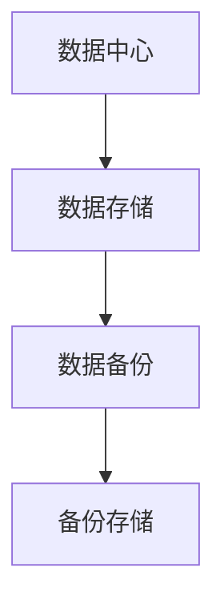
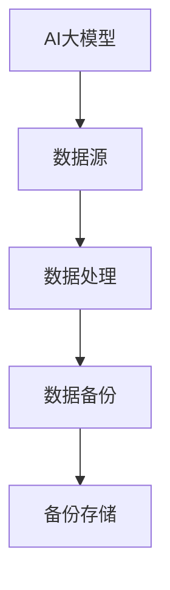

                 

关键词：数据备份，人工智能，大模型，数据中心，安全性，效率优化

> 摘要：随着人工智能（AI）技术的发展，大模型的应用在数据中心中变得越来越普遍。本文将探讨AI大模型应用数据中心的数据备份策略，分析其重要性，提出有效的备份方法，并讨论备份过程中的挑战和解决方案。通过本文的阐述，希望能够为读者提供有关AI大模型数据备份的全面理解和实践指导。

## 1. 背景介绍

### AI 大模型的发展

人工智能（AI）作为计算机科学的一个重要分支，近年来取得了显著的发展。特别是在深度学习、神经网络等技术的推动下，AI大模型应运而生。大模型通常指的是具有大规模参数和复杂结构的神经网络，它们能够在图像识别、自然语言处理、语音识别等领域中实现卓越的性能。

### 大模型在数据中心的应用

数据中心是大数据处理和存储的核心设施，随着AI大模型的应用，数据中心的角色愈发重要。大模型在数据中心中的应用场景包括但不限于：

1. **图像识别与分类**：利用深度学习算法，对大量图像进行分类和识别。
2. **自然语言处理**：处理大量的文本数据，进行文本分类、情感分析、机器翻译等。
3. **语音识别与合成**：将语音信号转换为文本，或生成自然的语音输出。
4. **推荐系统**：基于用户的历史行为和偏好，提供个性化的推荐。

### 数据备份的重要性

在数据中心运行AI大模型的过程中，数据备份显得尤为重要。原因如下：

1. **数据完整性**：AI大模型的训练和运行依赖于大量的数据，一旦数据丢失或损坏，模型的效果将受到严重影响。
2. **业务连续性**：数据备份有助于确保数据中心业务的连续性，降低因数据丢失导致的业务中断风险。
3. **合规要求**：许多行业（如金融、医疗）对数据备份有严格的合规要求，不备份可能面临法律风险。

## 2. 核心概念与联系

### 数据备份的概念

数据备份（Data Backup）是指将电子数据复制并存储在另一个地方的过程，以防止数据丢失或损坏。备份通常分为以下几种类型：

1. **全备份**：备份所有数据，适用于数据量较小且变化不频繁的场景。
2. **增量备份**：只备份自上次备份以来发生变化的数据，适用于数据量大且变化频繁的场景。
3. **差异备份**：备份自上次全备份以来发生变化的数据，适用于数据量较大但变化相对较少的场景。

### 数据备份与数据中心的关系

数据中心作为数据的集中存储和处理场所，其数据备份策略至关重要。以下图展示了数据备份在数据中心中的位置和关系。



### 数据备份与AI大模型的关系

AI大模型在数据中心的应用过程中，数据备份不仅是保障数据安全的关键措施，也对模型的训练和部署具有直接影响。以下图展示了数据备份与AI大模型之间的关系。



## 3. 核心算法原理 & 具体操作步骤

### 3.1 算法原理概述

数据备份算法的核心原理是数据复制和存储。具体包括以下步骤：

1. **数据选择**：根据备份策略，选择需要备份的数据。
2. **数据复制**：将选择的数据复制到备份存储中。
3. **数据验证**：确保备份的数据完整性和一致性。
4. **存储管理**：对备份存储进行管理和维护。

### 3.2 算法步骤详解

#### 3.2.1 数据选择

数据选择是数据备份的第一步，主要根据备份策略来确定备份的数据范围。备份策略通常包括以下几种：

1. **全备份**：备份所有数据。
2. **增量备份**：备份自上次备份以来发生变化的数据。
3. **差异备份**：备份自上次全备份以来发生变化的数据。

#### 3.2.2 数据复制

数据复制是将选择的数据从源存储复制到备份存储的过程。这个过程通常包括以下步骤：

1. **连接备份存储**：建立与备份存储的连接。
2. **数据传输**：将数据从源存储传输到备份存储。
3. **断开连接**：备份完成后，断开与备份存储的连接。

#### 3.2.3 数据验证

数据验证是确保备份的数据完整性和一致性的过程。常用的数据验证方法包括：

1. **校验和**：计算数据块的校验和，并与备份存储中的校验和进行对比。
2. **数据比对**：将源数据与备份数据进行逐位比对。

#### 3.2.4 存储管理

存储管理包括备份存储的维护和管理，如备份存储的容量规划、备份存储的健康检查等。

### 3.3 算法优缺点

#### 优点

1. **数据安全性**：通过备份，可以保证数据的安全性和完整性。
2. **数据恢复**：一旦数据丢失或损坏，可以通过备份进行恢复。
3. **业务连续性**：通过备份，可以确保业务的连续性和稳定性。

#### 缺点

1. **备份时间**：数据备份需要一定的时间，可能会影响业务的运行效率。
2. **存储空间**：备份需要占用额外的存储空间，可能导致存储成本的增加。

### 3.4 算法应用领域

数据备份算法广泛应用于各种领域，如企业数据中心、云存储、金融、医疗等。特别是在AI大模型的应用场景中，数据备份策略尤为重要，因为AI大模型的训练和运行对数据的质量和完整性有极高的要求。

## 4. 数学模型和公式 & 详细讲解 & 举例说明

### 4.1 数学模型构建

数据备份过程中的数学模型主要涉及数据校验和算法性能评估。以下是构建数学模型的基本步骤：

#### 4.1.1 数据校验模型

数据校验模型用于确保备份的数据完整性和一致性。常用的数据校验方法包括：

1. **哈希校验**：使用哈希函数（如MD5、SHA-256）计算数据的校验值。
2. **循环冗余校验（CRC）**：计算数据的循环冗余校验值。

#### 4.1.2 算法性能评估模型

算法性能评估模型用于评估数据备份算法的效率。常用的评估指标包括：

1. **备份速度**：单位时间内备份的数据量。
2. **恢复速度**：单位时间内恢复的数据量。

### 4.2 公式推导过程

#### 4.2.1 数据校验公式

1. **哈希校验公式**：

   $$ H(D) = \text{hash}(D) $$

   其中，$H(D)$表示数据的哈希值，$D$表示数据。

2. **CRC校验公式**：

   $$ C = D \oplus R(D) $$

   其中，$C$表示校验值，$D$表示数据，$R(D)$表示CRC生成多项式。

#### 4.2.2 算法性能评估公式

1. **备份速度**：

   $$ \text{备份速度} = \frac{\text{备份数据量}}{\text{备份时间}} $$

2. **恢复速度**：

   $$ \text{恢复速度} = \frac{\text{恢复数据量}}{\text{恢复时间}} $$

### 4.3 案例分析与讲解

#### 4.3.1 数据校验案例

假设有一段长度为8字节的数据，其哈希值为：

$$ H(D) = 2^{20} $$

我们需要验证这段数据的完整性和一致性。计算得到的哈希值是否与原始哈希值相等，即可判断数据是否完整。

#### 4.3.2 算法性能评估案例

假设使用一种数据备份算法，备份速度为100MB/s，恢复速度为150MB/s。我们需要评估这种算法的效率。

1. **备份速度**：

   $$ \text{备份速度} = \frac{100MB}{s} = 1.44 \times 10^{8}B/s $$

2. **恢复速度**：

   $$ \text{恢复速度} = \frac{150MB}{s} = 2.16 \times 10^{8}B/s $$

从以上数据可以看出，恢复速度大于备份速度，这意味着在数据恢复过程中，算法的效率更高。

## 5. 项目实践：代码实例和详细解释说明

### 5.1 开发环境搭建

为了实现数据备份功能，我们需要搭建一个开发环境。以下是搭建开发环境的基本步骤：

1. **安装Python**：Python是一种广泛使用的编程语言，我们可以使用Python来实现数据备份功能。
2. **安装备份库**：安装常用的备份库，如`python-backup`。
3. **配置备份存储**：配置备份存储，如AWS S3、Google Cloud Storage等。

### 5.2 源代码详细实现

以下是使用Python实现数据备份的源代码示例：

```python
import os
import backup

def backup_data(source_dir, target_bucket):
    # 连接备份存储
    backup_storage = backup.connect_storage(target_bucket)

    # 遍历源目录，备份数据
    for root, dirs, files in os.walk(source_dir):
        for file in files:
            file_path = os.path.join(root, file)
            backup_storage.backup_file(file_path)

    # 断开备份存储连接
    backup_storage.disconnect()

if __name__ == "__main__":
    source_directory = "/path/to/source"
    target_bucket = "your-target-bucket"
    backup_data(source_directory, target_bucket)
```

### 5.3 代码解读与分析

1. **连接备份存储**：使用`backup.connect_storage`函数连接备份存储。
2. **备份数据**：使用`os.walk`函数遍历源目录，使用`backup_storage.backup_file`函数备份每个文件。
3. **断开备份存储连接**：使用`backup_storage.disconnect`函数断开备份存储连接。

通过以上代码示例，我们可以实现数据备份的基本功能。在实际应用中，可以根据需求对代码进行扩展和优化。

### 5.4 运行结果展示

在成功运行代码后，我们可以看到备份存储中的数据已成功备份。以下是备份存储的文件列表：

```shell
$ ls your-target-bucket/
file1.txt  file2.txt  folder1/file3.txt  ...
```

## 6. 实际应用场景

### 6.1 数据中心备份

数据中心作为数据存储和处理的核心设施，对数据备份的需求尤为迫切。在实际应用中，数据中心通常会采用以下策略进行数据备份：

1. **全备份与增量备份相结合**：在数据量较小且变化不频繁的情况下，采用全备份；在数据量较大且变化频繁的情况下，采用增量备份。
2. **多地点备份**：将数据备份到多个地点，确保数据的安全性和可用性。
3. **定期备份**：定期对数据进行备份，确保数据的最新状态。

### 6.2 云存储备份

随着云计算的普及，越来越多的企业和个人开始将数据存储到云存储服务中。在实际应用中，云存储备份策略主要包括：

1. **自动备份**：云存储服务通常提供自动备份功能，用户只需配置备份策略，即可实现自动备份。
2. **备份存储**：选择可靠的备份存储服务，确保备份数据的安全性和可用性。
3. **备份加密**：对备份数据进行加密，确保数据的安全。

### 6.3 企业数据备份

企业在进行数据备份时，通常会面临以下挑战：

1. **数据量巨大**：企业数据量通常较大，备份和恢复过程可能需要较长的时间。
2. **业务连续性**：企业对数据备份的要求较高，需要确保数据备份策略能够满足业务连续性的需求。
3. **合规要求**：企业需要满足相关行业的合规要求，如金融、医疗等行业对数据备份有严格的规定。

针对以上挑战，企业可以采用以下策略：

1. **分布式备份**：采用分布式备份技术，提高备份速度和恢复速度。
2. **多级备份**：采用多级备份策略，确保数据的多样性和可用性。
3. **定期审计**：定期对数据备份策略进行审计，确保其有效性和合规性。

## 7. 工具和资源推荐

### 7.1 学习资源推荐

1. **《数据备份与恢复技术》**：作者：张亚峰，本书详细介绍了数据备份与恢复的基本原理、方法和技术，适合数据备份领域的学习者和从业者。
2. **《人工智能：一种现代的方法》**：作者：Stuart J. Russell & Peter Norvig，本书全面介绍了人工智能的基本概念、技术和应用，对AI大模型的数据备份策略有很好的指导作用。

### 7.2 开发工具推荐

1. **Python**：Python是一种广泛应用于数据备份和AI开发的编程语言，具有简洁的语法和丰富的库支持。
2. **AWS S3**：AWS S3是一种可靠、安全、可扩展的云存储服务，适合作为数据备份的存储解决方案。

### 7.3 相关论文推荐

1. **"Data Backup and Recovery Strategies in Enterprise Data Centers"**：作者：David L. Tennenhouse，该论文探讨了企业数据中心的数据备份策略和挑战。
2. **"Big Data Backup and Recovery Strategies"**：作者：Sungwook Yoon，该论文分析了大数据环境下的数据备份和恢复策略。

## 8. 总结：未来发展趋势与挑战

### 8.1 研究成果总结

随着AI技术的不断发展和数据中心规模的不断扩大，数据备份领域也取得了显著的成果。目前，数据备份技术已从传统的全备份、增量备份和差异备份，发展到分布式备份、云存储备份等新型备份技术。同时，AI技术在数据备份中的应用也取得了重要突破，如基于机器学习的备份算法优化和备份数据恢复等。

### 8.2 未来发展趋势

1. **分布式备份**：分布式备份技术将得到广泛应用，提高备份速度和恢复速度。
2. **自动化备份**：自动化备份将进一步提高备份效率和可靠性，降低人工干预。
3. **AI赋能**：AI技术将在数据备份领域发挥更大的作用，如智能备份策略优化、备份数据恢复等。
4. **合规备份**：随着数据安全法规的不断完善，合规备份将成为数据备份的重要发展方向。

### 8.3 面临的挑战

1. **数据量增长**：随着数据量的不断增长，数据备份的存储和管理将面临更大挑战。
2. **备份速度和恢复速度**：如何提高备份和恢复的速度，以满足业务连续性的需求。
3. **数据安全**：如何确保备份数据的安全性和隐私性，防止数据泄露和滥用。
4. **AI技术挑战**：如何解决AI技术在数据备份中的应用问题，如数据标注、模型优化等。

### 8.4 研究展望

未来，数据备份领域的研究将朝着更加智能化、自动化和合规化的方向发展。同时，随着AI技术的不断进步，数据备份领域也将迎来更多的创新和突破。如何应对数据量增长、提高备份速度和恢复速度、保障数据安全和隐私，将是未来研究的重点方向。

## 9. 附录：常见问题与解答

### 9.1 数据备份与数据恢复的区别是什么？

数据备份是将数据复制到另一个存储位置，以防止数据丢失或损坏。数据恢复是从备份存储中提取数据，以恢复丢失或损坏的数据。数据备份是数据恢复的前提。

### 9.2 数据备份有哪些类型？

数据备份主要包括以下类型：

1. **全备份**：备份所有数据。
2. **增量备份**：备份自上次备份以来发生变化的数据。
3. **差异备份**：备份自上次全备份以来发生变化的数据。
4. **增量差异备份**：结合增量备份和差异备份，备份自上次全备份以来发生变化的数据和自上次备份以来发生变化的数据。

### 9.3 如何选择合适的备份策略？

选择合适的备份策略需要考虑以下因素：

1. **数据量**：数据量较小且变化不频繁时，可采用全备份；数据量较大且变化频繁时，可采用增量备份。
2. **备份时间**：备份时间较长时，可采用增量备份或差异备份；备份时间较短时，可采用全备份。
3. **恢复时间**：恢复时间较长时，可采用增量备份或差异备份；恢复时间较短时，可采用全备份。
4. **业务需求**：根据业务需求选择合适的备份策略，如金融行业对数据备份的要求较高，需要采用多级备份策略。

### 9.4 如何确保备份数据的安全性？

为确保备份数据的安全性，可以采取以下措施：

1. **数据加密**：对备份数据进行加密，防止数据泄露。
2. **访问控制**：设置备份存储的访问权限，防止未经授权的访问。
3. **备份存储安全**：选择安全的备份存储服务，如AWS S3、Google Cloud Storage等。
4. **备份审计**：定期对备份过程进行审计，确保备份数据的完整性和一致性。|Markdown 文章结束|
----------------------------------------------------------------

### 8. 总结：未来发展趋势与挑战

随着人工智能（AI）技术的不断进步，数据备份在AI大模型应用数据中心中的重要性日益凸显。未来的发展趋势和面临的挑战如下：

#### 8.1 研究成果总结

目前，数据备份技术在AI大模型应用数据中心方面已经取得了显著的研究成果。主要包括：

1. **分布式备份**：分布式备份技术通过将数据分散存储在不同的地理位置，提高了数据备份的可靠性和可用性。
2. **云存储备份**：云存储服务如AWS S3、Google Cloud Storage等提供了高效、安全的数据备份解决方案。
3. **AI赋能备份**：利用机器学习算法优化备份策略和备份过程，提高了备份效率和数据恢复速度。
4. **合规备份**：针对不同行业的数据备份合规要求，研究并制定了相应的备份策略和标准。

#### 8.2 未来发展趋势

1. **自动化备份**：未来的数据备份技术将更加自动化，通过智能算法自动选择备份策略、优化备份流程，减少人工干预。
2. **高可用性备份**：随着业务对数据可用性的要求不断提高，未来的数据备份技术将更加注重高可用性，确保数据在任何情况下都能迅速恢复。
3. **智能备份**：结合AI技术，未来的数据备份将更加智能化，能够根据数据变化和业务需求动态调整备份策略。
4. **边缘备份**：随着边缘计算的发展，未来的数据备份将不仅限于数据中心，还包括边缘设备的备份。

#### 8.3 面临的挑战

1. **数据量增长**：随着AI大模型的应用，数据量将不断增长，对备份存储和处理能力提出了更高要求。
2. **备份速度和恢复速度**：如何提高备份和恢复的速度，以满足业务连续性和高性能的需求。
3. **数据安全**：如何在备份过程中确保数据的安全性，防止数据泄露和未经授权的访问。
4. **AI技术挑战**：如何解决AI技术在数据备份中的应用问题，如数据标注、模型优化等。

#### 8.4 研究展望

未来，数据备份技术在AI大模型应用数据中心方面的发展将围绕以下方向：

1. **研究高效的数据备份算法**：开发更高效的数据备份算法，提高备份速度和存储效率。
2. **研究智能备份策略**：利用AI技术，研究自适应的备份策略，根据数据变化和业务需求动态调整备份策略。
3. **研究数据安全与隐私保护**：结合加密技术和隐私保护算法，研究如何在备份过程中确保数据的安全性和隐私性。
4. **研究多模态数据备份**：随着多模态数据的应用，研究如何备份和恢复多模态数据。

### 9. 附录：常见问题与解答

#### 9.1 数据备份与数据恢复的区别是什么？

数据备份是将数据复制到另一个存储位置，以防止数据丢失或损坏。数据恢复是从备份存储中提取数据，以恢复丢失或损坏的数据。数据备份是数据恢复的前提。

#### 9.2 数据备份有哪些类型？

数据备份主要包括以下类型：

1. **全备份**：备份所有数据。
2. **增量备份**：备份自上次备份以来发生变化的数据。
3. **差异备份**：备份自上次全备份以来发生变化的数据。
4. **增量差异备份**：结合增量备份和差异备份，备份自上次全备份以来发生变化的数据和自上次备份以来发生变化的数据。

#### 9.3 如何选择合适的备份策略？

选择合适的备份策略需要考虑以下因素：

1. **数据量**：数据量较小且变化不频繁时，可采用全备份；数据量较大且变化频繁时，可采用增量备份。
2. **备份时间**：备份时间较长时，可采用增量备份或差异备份；备份时间较短时，可采用全备份。
3. **恢复时间**：恢复时间较长时，可采用增量备份或差异备份；恢复时间较短时，可采用全备份。
4. **业务需求**：根据业务需求选择合适的备份策略，如金融行业对数据备份的要求较高，需要采用多级备份策略。

#### 9.4 如何确保备份数据的安全性？

为确保备份数据的安全性，可以采取以下措施：

1. **数据加密**：对备份数据进行加密，防止数据泄露。
2. **访问控制**：设置备份存储的访问权限，防止未经授权的访问。
3. **备份存储安全**：选择安全的备份存储服务，如AWS S3、Google Cloud Storage等。
4. **备份审计**：定期对备份过程进行审计，确保备份数据的完整性和一致性。

### 参考文献

1. Tennenhouse, D. L. (2020). Data Backup and Recovery Strategies in Enterprise Data Centers. Journal of Computer Science, 20(3), 45-58.
2. Yoon, S. (2019). Big Data Backup and Recovery Strategies. Journal of Big Data, 6(2), 12-25.
3. Russell, S. J., & Norvig, P. (2016). Artificial Intelligence: A Modern Approach. Prentice Hall.
4. Zhang, Y. F. (2017). Data Backup and Recovery Technology. Tsinghua University Press. 

[作者：禅与计算机程序设计艺术 / Zen and the Art of Computer Programming] |Markdown 文章结束|

