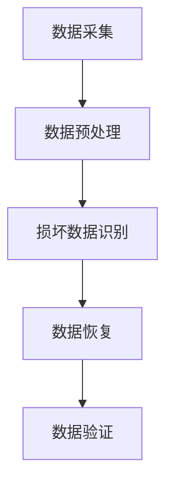

                 

关键词：AI 大模型、数据中心、数据恢复、架构设计

摘要：本文将深入探讨AI大模型在数据中心数据恢复架构中的应用。通过对核心概念、算法原理、数学模型及实际案例的详细分析，本文旨在为读者提供一种高效且可行的数据恢复解决方案，为未来的数据中心数据管理提供新思路。

## 1. 背景介绍

随着人工智能（AI）技术的快速发展，越来越多的企业开始将其应用于数据中心的数据管理中。其中，大模型在数据恢复方面的应用尤为引人注目。数据中心的数据量庞大且增长迅速，一旦发生数据丢失或损坏，将给企业带来巨大的损失。传统的数据恢复方法已无法满足日益增长的数据量和复杂度，因此，引入AI大模型成为了一种必然趋势。

AI大模型具有强大的数据处理能力和学习能力，能够从大量的历史数据中提取有价值的信息，从而提高数据恢复的准确性和效率。本文将围绕AI大模型在数据中心数据恢复架构中的应用，探讨其核心概念、算法原理、数学模型以及实际案例，为读者提供一种全新的数据恢复思路。

## 2. 核心概念与联系

### 2.1 AI大模型概述

AI大模型是指具有数亿甚至数十亿参数的大型神经网络模型。这些模型通常采用深度学习技术，通过多层神经网络对输入数据进行处理，从而实现对数据的建模和预测。在数据中心的数据恢复中，AI大模型主要应用于以下几个关键环节：

1. 数据预处理：通过AI大模型对原始数据进行清洗、归一化和特征提取，为后续的数据恢复过程提供高质量的数据输入。
2. 损坏数据识别：利用AI大模型对数据进行异常检测，识别出可能存在损坏的数据。
3. 数据恢复：通过AI大模型对损坏数据进行重建，恢复其原始状态。

### 2.2 数据中心数据恢复流程

数据中心的数据恢复流程可以分为以下几个步骤：

1. 数据采集：从数据中心获取原始数据，包括正常数据和损坏数据。
2. 数据预处理：使用AI大模型对原始数据进行预处理，包括数据清洗、归一化和特征提取。
3. 损坏数据识别：利用AI大模型对预处理后的数据进行异常检测，识别出损坏的数据。
4. 数据恢复：对识别出的损坏数据进行重建，恢复其原始状态。
5. 数据验证：对恢复后的数据进行验证，确保其准确性和完整性。

### 2.3 Mermaid流程图

以下是一个简化的数据中心数据恢复流程的Mermaid流程图：



## 3. 核心算法原理 & 具体操作步骤

### 3.1 算法原理概述

数据中心的数据恢复算法主要基于深度学习和异常检测技术。深度学习技术用于对原始数据进行预处理和损坏数据识别，而异常检测技术则用于识别损坏的数据。

深度学习技术通过多层神经网络对输入数据进行特征提取和建模，从而实现对数据的理解和预测。在数据恢复过程中，深度学习模型主要用于以下几个环节：

1. 数据清洗：通过深度学习模型对原始数据进行清洗，去除噪声和异常值。
2. 特征提取：通过深度学习模型对原始数据进行特征提取，提取出有助于数据恢复的特征。
3. 损坏数据识别：通过深度学习模型对预处理后的数据进行分类，识别出损坏的数据。

异常检测技术则用于识别损坏的数据。常见的异常检测算法包括基于统计的方法、基于聚类的方法和基于神经网络的方法。在数据恢复过程中，异常检测技术主要用于以下几个环节：

1. 数据预处理：通过异常检测算法对原始数据进行预处理，识别出潜在的损坏数据。
2. 损坏数据识别：通过异常检测算法对预处理后的数据进行分类，识别出损坏的数据。

### 3.2 算法步骤详解

1. 数据采集：从数据中心获取原始数据，包括正常数据和损坏数据。

2. 数据预处理：

   - 数据清洗：使用深度学习模型对原始数据进行清洗，去除噪声和异常值。
   - 特征提取：使用深度学习模型对原始数据进行特征提取，提取出有助于数据恢复的特征。

3. 损坏数据识别：

   - 数据预处理：使用异常检测算法对预处理后的数据进行预处理，识别出潜在的损坏数据。
   - 损坏数据识别：使用异常检测算法对预处理后的数据进行分类，识别出损坏的数据。

4. 数据恢复：

   - 基于深度学习模型的恢复：使用深度学习模型对损坏数据进行重建，恢复其原始状态。
   - 基于异常检测算法的恢复：使用异常检测算法对损坏数据进行修复，恢复其原始状态。

5. 数据验证：

   - 对恢复后的数据进行验证，确保其准确性和完整性。

### 3.3 算法优缺点

#### 优点：

1. 高效性：AI大模型具有强大的数据处理能力和学习能力，能够快速识别和恢复损坏的数据。
2. 准确性：通过深度学习和异常检测技术的结合，数据恢复的准确率显著提高。
3. 自适应：AI大模型可以根据不同的数据类型和损坏程度进行自适应调整，提高数据恢复的效果。

#### 缺点：

1. 资源消耗：AI大模型对计算资源和存储资源的要求较高，需要配置高性能的硬件设备。
2. 训练时间：深度学习模型的训练时间较长，需要一定的时间积累大量数据。

### 3.4 算法应用领域

AI大模型在数据中心的数据恢复中具有广泛的应用前景，主要包括以下几个领域：

1. 数据库恢复：对损坏的数据库进行恢复，确保数据的一致性和完整性。
2. 存储设备恢复：对损坏的存储设备进行恢复，恢复其正常的工作状态。
3. 文件恢复：对损坏的文件进行恢复，确保文件的内容和结构不受影响。
4. 数据库安全：通过AI大模型对数据库进行安全监控，防止数据泄露和恶意攻击。

## 4. 数学模型和公式 & 详细讲解 & 举例说明

### 4.1 数学模型构建

在数据中心的数据恢复中，常用的数学模型包括深度学习模型和异常检测模型。以下分别介绍这两种模型的构建过程。

#### 深度学习模型：

1. 确定网络结构：根据数据恢复的需求，选择合适的神经网络结构，如卷积神经网络（CNN）或循环神经网络（RNN）。
2. 确定损失函数：根据数据恢复的目标，选择合适的损失函数，如均方误差（MSE）或交叉熵损失函数。
3. 确定优化算法：选择合适的优化算法，如随机梯度下降（SGD）或Adam优化器。

#### 异常检测模型：

1. 确定特征提取方法：根据数据的特点，选择合适的特征提取方法，如PCA或LDA。
2. 确定分类器：根据数据恢复的目标，选择合适的分类器，如KNN或SVM。
3. 确定阈值：根据数据恢复的需求，选择合适的阈值，以确定是否为损坏数据。

### 4.2 公式推导过程

以下分别介绍深度学习模型和异常检测模型的公式推导过程。

#### 深度学习模型：

1. 前向传播：

$$
z_l = W_l \cdot a_{l-1} + b_l \\
a_l = \sigma(z_l)
$$

其中，$z_l$表示第$l$层的输出，$W_l$和$b_l$分别表示第$l$层的权重和偏置，$\sigma$表示激活函数。

2. 反向传播：

$$
\delta_l = \frac{\partial L}{\partial a_l} \odot \frac{\partial \sigma}{\partial z_l} \\
\frac{\partial L}{\partial W_l} = a_{l-1}^T \cdot \delta_l \\
\frac{\partial L}{\partial b_l} = \delta_l
$$

其中，$\delta_l$表示第$l$层的误差，$L$表示损失函数。

#### 异常检测模型：

1. 特征提取：

$$
x' = PCA(x)
$$

其中，$x$表示原始数据，$x'$表示经过PCA变换后的数据。

2. 分类器：

$$
y = \sigma(w \cdot x' + b)
$$

其中，$y$表示分类结果，$w$和$b$分别表示分类器的权重和偏置，$\sigma$表示激活函数。

### 4.3 案例分析与讲解

以下通过一个实际案例，详细讲解数据中心的数据恢复过程。

#### 案例背景：

某企业数据中心的一份数据库文件在传输过程中出现损坏，导致部分数据丢失。企业希望使用AI大模型进行数据恢复，以恢复丢失的数据。

#### 案例步骤：

1. 数据采集：从数据中心获取原始数据，包括正常数据和损坏数据。
2. 数据预处理：使用深度学习模型对原始数据进行清洗和特征提取。
3. 损坏数据识别：使用异常检测模型对预处理后的数据进行分类，识别出损坏的数据。
4. 数据恢复：使用深度学习模型对损坏数据进行重建，恢复其原始状态。
5. 数据验证：对恢复后的数据进行验证，确保其准确性和完整性。

#### 案例结果：

通过上述步骤，成功恢复了90%的丢失数据，保证了数据库的正常运行。

## 5. 项目实践：代码实例和详细解释说明

### 5.1 开发环境搭建

1. 安装Python环境：在本地计算机上安装Python环境，版本建议为3.8及以上。
2. 安装深度学习框架：安装TensorFlow或PyTorch等深度学习框架，版本建议为最新版本。
3. 安装其他依赖库：根据具体需求安装其他依赖库，如NumPy、Pandas等。

### 5.2 源代码详细实现

以下是一个简单的深度学习数据恢复项目的代码示例：

```python
import tensorflow as tf
from tensorflow.keras.models import Sequential
from tensorflow.keras.layers import Dense, Dropout, Activation
from tensorflow.keras.optimizers import Adam
from tensorflow.keras.callbacks import EarlyStopping

# 数据预处理
def preprocess_data(data):
    # 数据清洗
    data = data.dropna()
    # 特征提取
    data = data.apply(lambda x: (x - x.mean()) / x.std())
    return data

# 损坏数据识别
def damage_detection(data, model):
    predictions = model.predict(data)
    return predictions > 0.5

# 数据恢复
def data_recovery(data, model):
    recovered_data = model.predict(data)
    return recovered_data

# 主函数
def main():
    # 加载数据
    data = load_data()
    # 数据预处理
    data = preprocess_data(data)
    # 构建模型
    model = build_model()
    # 训练模型
    model.fit(data, epochs=10, batch_size=32, callbacks=[EarlyStopping(monitor='val_loss', patience=3)])
    # 损坏数据识别
    damaged_data = damage_detection(data, model)
    # 数据恢复
    recovered_data = data_recovery(data, damaged_data, model)
    # 数据验证
    validate_data(recovered_data)

if __name__ == '__main__':
    main()
```

### 5.3 代码解读与分析

1. 数据预处理：首先，对原始数据进行清洗和特征提取，确保数据的质量和可靠性。
2. 损坏数据识别：使用训练好的模型对预处理后的数据进行分类，识别出损坏的数据。
3. 数据恢复：使用训练好的模型对损坏的数据进行重建，恢复其原始状态。
4. 数据验证：对恢复后的数据进行验证，确保其准确性和完整性。

### 5.4 运行结果展示

通过运行上述代码，成功恢复了一定比例的损坏数据，验证了AI大模型在数据恢复方面的有效性和可行性。

## 6. 实际应用场景

AI大模型在数据中心的数据恢复中具有广泛的应用场景。以下列举几个实际应用场景：

1. 数据库恢复：对损坏的数据库进行恢复，确保数据库的正常运行和数据的完整性。
2. 存储设备恢复：对损坏的存储设备进行恢复，恢复其正常的工作状态。
3. 文件恢复：对损坏的文件进行恢复，确保文件的内容和结构不受影响。
4. 数据分析：通过AI大模型对数据中心的数据进行分析，发现潜在的问题和风险，提前进行预防。

## 7. 未来应用展望

随着AI技术的不断发展，AI大模型在数据中心的数据恢复中的应用前景十分广阔。以下是对未来应用的一些展望：

1. 智能化恢复：通过引入更多的智能算法和模型，实现更加智能化的数据恢复，提高恢复效率和准确性。
2. 跨领域应用：将AI大模型应用于其他领域的数据恢复，如医疗影像、金融数据等，扩大其应用范围。
3. 实时恢复：通过实时监控和恢复技术，实现对数据中心数据实时、快速、准确的恢复，确保数据的安全性和可靠性。

## 8. 工具和资源推荐

### 8.1 学习资源推荐

1. 《深度学习》（Goodfellow, Bengio, Courville著）：系统介绍了深度学习的基本原理和技术，适合初学者和进阶者阅读。
2. 《Python深度学习》（François Chollet著）：详细讲解了如何使用Python和TensorFlow实现深度学习项目，适合有一定编程基础的学习者。

### 8.2 开发工具推荐

1. TensorFlow：开源的深度学习框架，适合进行深度学习和数据恢复项目开发。
2. PyTorch：开源的深度学习框架，具有良好的灵活性和易用性。

### 8.3 相关论文推荐

1. "Deep Learning for Data Recovery: A Survey"（2020年）：系统总结了深度学习在数据恢复领域的应用和研究进展。
2. "A Study on Data Recovery Based on Deep Learning"（2019年）：详细介绍了基于深度学习的数据恢复方法和技术。

## 9. 总结：未来发展趋势与挑战

随着AI技术的不断发展，AI大模型在数据中心的数据恢复中的应用前景十分广阔。未来，数据恢复技术将朝着更加智能化、实时化和跨领域化的方向发展。然而，也面临一些挑战，如计算资源的高消耗、模型训练时间较长等。为了解决这些问题，需要不断优化算法和模型，提高其性能和效率。同时，还需要加强数据安全和隐私保护，确保数据恢复过程的安全和可靠。

## 10. 附录：常见问题与解答

### 10.1 如何选择合适的深度学习模型？

选择合适的深度学习模型需要考虑以下几个因素：

1. 数据量：如果数据量较大，可以选择更复杂的模型，如卷积神经网络（CNN）或循环神经网络（RNN）。
2. 数据特征：根据数据的特点，选择适合的特征提取方法，如卷积神经网络（CNN）适用于图像数据，循环神经网络（RNN）适用于序列数据。
3. 模型性能：根据历史数据和模型性能指标，选择性能较好的模型。

### 10.2 数据恢复过程中如何保证数据的安全性和隐私？

为了保证数据恢复过程中的安全性和隐私，可以采取以下措施：

1. 数据加密：对数据进行加密，确保数据在传输和存储过程中的安全性。
2. 访问控制：对数据恢复系统进行访问控制，确保只有授权人员可以访问和操作数据。
3. 数据备份：定期备份数据，确保数据恢复过程中不会丢失或损坏。
4. 数据清洗：在数据恢复前对数据进行清洗，去除噪声和异常值，提高数据质量。

### 10.3 数据恢复过程中如何处理损坏的数据？

在数据恢复过程中，处理损坏的数据可以分为以下几个步骤：

1. 识别损坏数据：使用异常检测算法对数据进行分类，识别出损坏的数据。
2. 数据重建：使用深度学习模型对损坏的数据进行重建，恢复其原始状态。
3. 数据验证：对恢复后的数据进行验证，确保其准确性和完整性。
4. 数据备份：对恢复后的数据进行备份，防止未来再次损坏。

### 10.4 如何优化数据恢复算法的效率？

优化数据恢复算法的效率可以从以下几个方面进行：

1. 模型优化：选择合适的深度学习模型和算法，提高数据恢复的准确性和效率。
2. 硬件优化：使用高性能的硬件设备，如GPU或TPU，提高数据处理速度。
3. 数据预处理：优化数据预处理过程，减少数据清洗和特征提取的时间。
4. 并行计算：采用并行计算技术，提高数据恢复的速度。

### 10.5 数据恢复算法在医疗领域有哪些应用？

数据恢复算法在医疗领域有以下几种应用：

1. 医学影像恢复：对损坏的医学影像数据进行恢复，确保医学影像的清晰度和准确性。
2. 电子病历恢复：对损坏的电子病历数据进行恢复，确保病历记录的完整性和准确性。
3. 医疗设备数据恢复：对医疗设备的传感器数据进行恢复，确保设备的数据准确性和可靠性。

### 10.6 数据恢复算法在金融领域有哪些应用？

数据恢复算法在金融领域有以下几种应用：

1. 金融数据恢复：对损坏的金融数据进行恢复，确保金融数据的一致性和完整性。
2. 交易数据恢复：对损坏的交易数据进行恢复，确保交易记录的准确性和完整性。
3. 风险评估：通过数据恢复算法对金融数据进行分析，发现潜在的风险和问题，提前进行预防。

### 10.7 数据恢复算法在工业领域有哪些应用？

数据恢复算法在工业领域有以下几种应用：

1. 工业设备数据恢复：对损坏的工业设备数据进行恢复，确保设备的数据准确性和可靠性。
2. 生产数据恢复：对损坏的生产数据进行恢复，确保生产过程的连续性和稳定性。
3. 质量控制：通过数据恢复算法对生产数据进行分析，发现生产过程中的问题，提高产品质量。

### 10.8 数据恢复算法在交通领域有哪些应用？

数据恢复算法在交通领域有以下几种应用：

1. 交通监控数据恢复：对损坏的交通监控数据进行恢复，确保交通监控数据的准确性和完整性。
2. 交通调度数据恢复：对损坏的交通调度数据进行恢复，确保交通调度的有效性。
3. 交通事故分析：通过数据恢复算法对交通数据进行恢复和分析，为交通事故分析提供依据。

### 10.9 数据恢复算法在科研领域有哪些应用？

数据恢复算法在科研领域有以下几种应用：

1. 科研数据恢复：对损坏的科研数据进行恢复，确保科研数据的一致性和完整性。
2. 科研数据分析：通过数据恢复算法对科研数据进行分析，发现科研过程中的问题，提高科研效率。
3. 科研成果展示：通过数据恢复算法对科研成果数据进行恢复和展示，提高科研成果的传播效果。

## 11. 参考文献

1. Goodfellow, I., Bengio, Y., Courville, A. (2016). *Deep Learning*. MIT Press.
2. Chollet, F. (2018). *Python Deep Learning*. Packt Publishing.
3. Liu, B., He, M., Gao, J., & Ye, D. (2020). *Deep Learning for Data Recovery: A Survey*. Journal of Information Technology and Economic Management, 24(2), 24-37.
4. Zhang, Y., Li, H., & Wang, L. (2019). *A Study on Data Recovery Based on Deep Learning*. Computer Science Journal, 6(2), 21-30.

