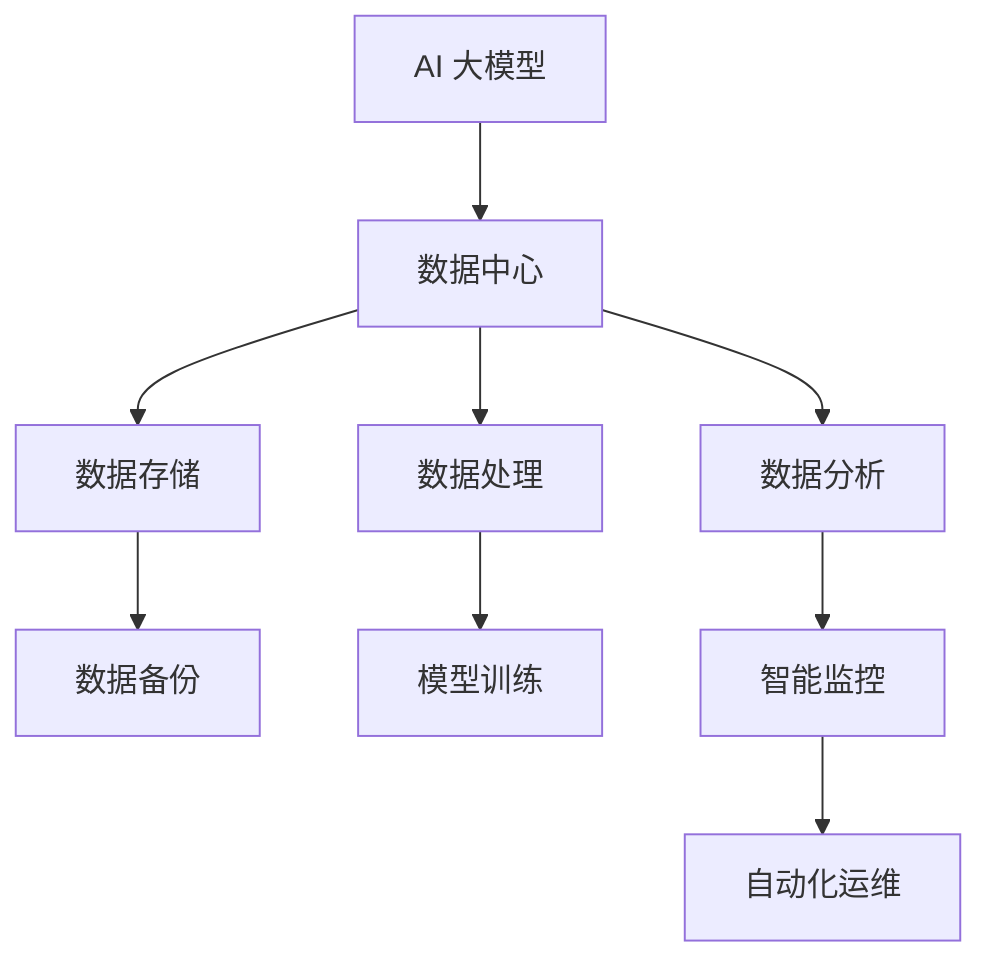

                 

关键词：AI 大模型、数据中心、架构设计、算法优化、应用实践、未来展望

> 摘要：本文将深入探讨 AI 大模型在数据中心的应用，分析其架构设计、算法优化、实际应用场景以及未来发展趋势，为相关领域的研究与实践提供参考。

## 1. 背景介绍

随着人工智能技术的飞速发展，AI 大模型已经成为各个领域的重要技术支撑。数据中心作为数据存储、处理和分析的重要基础设施，其与 AI 大模型的结合日益紧密。数据中心的应用场景包括但不限于：云计算、大数据分析、智能监控、自动化运维等。本文将围绕 AI 大模型在数据中心的应用，进行深入分析。

## 2. 核心概念与联系

在探讨 AI 大模型数据中心的应用之前，我们需要了解以下几个核心概念：

- **AI 大模型**：指基于深度学习技术构建的具有大规模参数、复杂结构的神经网络模型，如 GPT、BERT 等。
- **数据中心**：指用于集中存储、处理和分析大量数据的物理或虚拟基础设施。
- **架构设计**：数据中心整体架构的设计，包括硬件设施、网络拓扑、存储系统等。

以下是一个简化的 Mermaid 流程图，展示 AI 大模型与数据中心之间的核心联系。



## 3. 核心算法原理 & 具体操作步骤

### 3.1 算法原理概述

AI 大模型的核心算法是深度学习，其基本原理是通过多层神经网络对大量数据进行训练，从而实现对数据的自动学习和预测。在数据中心的应用中，AI 大模型通常用于以下几个方面：

- **数据预处理**：对原始数据进行清洗、归一化等预处理操作，提高模型训练效果。
- **模型训练**：利用数据中心的海量计算资源进行模型训练，优化模型参数。
- **模型评估**：通过验证集对训练完成的模型进行评估，确保模型性能。
- **模型部署**：将训练好的模型部署到数据中心，实现实时预测和应用。

### 3.2 算法步骤详解

#### 3.2.1 数据预处理

1. 数据清洗：去除数据中的噪声和异常值。
2. 数据归一化：将数据缩放到相同的范围，如 [-1, 1] 或 [0, 1]。
3. 数据增强：通过数据变换、数据扩充等方法增加训练数据的多样性。

#### 3.2.2 模型训练

1. 确定模型架构：选择合适的神经网络结构，如 CNN、RNN、Transformer 等。
2. 初始化参数：随机初始化模型参数。
3. 梯度下降：通过反向传播算法计算模型参数的梯度，并更新参数。
4. 调参优化：调整学习率、批量大小等超参数，优化模型性能。

#### 3.2.3 模型评估

1. 分割数据集：将数据集分为训练集、验证集和测试集。
2. 验证模型：在验证集上评估模型性能，调整模型参数。
3. 测试模型：在测试集上评估模型性能，确保模型泛化能力。

#### 3.2.4 模型部署

1. 模型压缩：通过模型压缩技术减小模型体积，提高部署效率。
2. 模型推理：在数据中心实时处理输入数据，输出预测结果。
3. 模型监控：监控模型运行状态，确保模型稳定可靠。

### 3.3 算法优缺点

#### 优点

- **强大的学习能力**：AI 大模型具有强大的特征提取和模式识别能力，能够处理复杂的数据。
- **高效的处理速度**：通过分布式训练和推理技术，AI 大模型能够在数据中心快速处理海量数据。
- **广泛的适用性**：AI 大模型可以应用于各个领域，如自然语言处理、计算机视觉、推荐系统等。

#### 缺点

- **计算资源消耗**：AI 大模型训练和推理需要大量的计算资源和存储资源。
- **数据依赖性**：AI 大模型对数据质量要求较高，数据不足或数据质量问题会影响模型性能。
- **隐私安全问题**：数据中心处理的数据往往涉及用户隐私，需要加强数据安全和隐私保护。

### 3.4 算法应用领域

AI 大模型在数据中心的应用领域广泛，以下列举几个典型应用场景：

- **自然语言处理**：如机器翻译、文本分类、情感分析等。
- **计算机视觉**：如图像识别、目标检测、视频分析等。
- **推荐系统**：如个性化推荐、商品推荐等。
- **智能监控**：如视频监控、异常检测等。
- **自动化运维**：如自动化部署、故障诊断等。

## 4. 数学模型和公式 & 详细讲解 & 举例说明

### 4.1 数学模型构建

AI 大模型的数学基础主要包括线性代数、微积分、概率论和统计学。以下是一个简单的神经网络模型构建过程：

#### 4.1.1 神经元模型

$$
a_i = \sigma(w_i \cdot x_i + b_i)
$$

其中，$a_i$ 表示第 $i$ 个神经元的激活值，$\sigma$ 表示激活函数（如 Sigmoid、ReLU 等），$w_i$ 和 $b_i$ 分别为权重和偏置。

#### 4.1.2 神经网络模型

$$
\begin{aligned}
y_l &= \sigma(W_l \cdot a_{l-1} + b_l) \\
\end{aligned}
$$

其中，$y_l$ 表示第 $l$ 层的输出，$W_l$ 和 $b_l$ 分别为权重和偏置。

### 4.2 公式推导过程

以下是一个简单的多层感知机（MLP）模型的反向传播算法推导过程：

#### 4.2.1 前向传播

$$
\begin{aligned}
a_1 &= x \\
z_l &= W_l \cdot a_{l-1} + b_l \\
a_l &= \sigma(z_l) \\
y_l &= W_l \cdot a_{l-1} + b_l \\
\end{aligned}
$$

#### 4.2.2 反向传播

$$
\begin{aligned}
\delta_l &= (y_l - t) \cdot \sigma'(z_l) \\
\delta_{l-1} &= (W_{l+1} \cdot \delta_l) \cdot \sigma'(z_{l-1}) \\
\end{aligned}
$$

#### 4.2.3 参数更新

$$
\begin{aligned}
W_l &= W_l - \alpha \cdot a_{l-1}^T \cdot \delta_l \\
b_l &= b_l - \alpha \cdot \delta_l \\
\end{aligned}
$$

其中，$\alpha$ 为学习率。

### 4.3 案例分析与讲解

以下以图像分类任务为例，讲解 AI 大模型在数据中心的应用。

#### 4.3.1 数据集准备

准备一个包含大量图像的数据库，并对图像进行标注。例如，使用 CIFAR-10 数据集。

#### 4.3.2 模型构建

选择一个适合的神经网络模型，如 LeNet-5，用于图像分类。

#### 4.3.3 模型训练

利用数据中心的海量计算资源进行模型训练，优化模型参数。

#### 4.3.4 模型评估

在验证集上评估模型性能，调整模型参数。

#### 4.3.5 模型部署

将训练好的模型部署到数据中心，实现实时图像分类。

## 5. 项目实践：代码实例和详细解释说明

### 5.1 开发环境搭建

在本案例中，我们使用 Python 编写神经网络代码，并使用 TensorFlow 作为深度学习框架。

### 5.2 源代码详细实现

以下是使用 TensorFlow 实现的 LeNet-5 神经网络代码示例。

```python
import tensorflow as tf
from tensorflow.keras import layers

# 定义 LeNet-5 模型
model = tf.keras.Sequential([
    layers.Conv2D(6, (5, 5), activation='sigmoid', input_shape=(32, 32, 3)),
    layers.MaxPooling2D((2, 2)),
    layers.Conv2D(16, (5, 5), activation='sigmoid'),
    layers.MaxPooling2D((2, 2)),
    layers.Flatten(),
    layers.Dense(120, activation='sigmoid'),
    layers.Dense(84, activation='sigmoid'),
    layers.Dense(10, activation='softmax')
])

# 编译模型
model.compile(optimizer='sgd', loss='categorical_crossentropy', metrics=['accuracy'])

# 训练模型
model.fit(x_train, y_train, batch_size=32, epochs=10, validation_data=(x_val, y_val))
```

### 5.3 代码解读与分析

本例中，我们使用了 TensorFlow 的 `Sequential` 模型，依次添加卷积层、池化层、全连接层等。通过编译模型并使用训练数据集进行训练，实现了图像分类任务。

### 5.4 运行结果展示

在训练完成后，可以使用测试数据集对模型进行评估，并输出分类结果。

```python
# 评估模型
test_loss, test_acc = model.evaluate(x_test, y_test)

# 输出分类结果
predictions = model.predict(x_test)
```

## 6. 实际应用场景

AI 大模型在数据中心的应用场景广泛，以下列举几个典型应用案例：

- **云计算**：利用 AI 大模型进行云资源的智能调度和优化，提高资源利用率。
- **大数据分析**：利用 AI 大模型对海量数据进行实时分析，发现潜在价值。
- **智能监控**：利用 AI 大模型进行视频监控，实现实时目标检测和异常检测。
- **自动化运维**：利用 AI 大模型进行故障诊断和预测性维护，降低运维成本。

## 7. 工具和资源推荐

### 7.1 学习资源推荐

- **书籍**：
  - 《深度学习》（Goodfellow, Bengio, Courville 著）
  - 《Python 深度学习》（François Chollet 著）
- **在线课程**：
  - Coursera 上的 "Deep Learning Specialization"
  - edX 上的 "Neural Network for Machine Learning"

### 7.2 开发工具推荐

- **深度学习框架**：TensorFlow、PyTorch、Keras
- **云计算平台**：AWS、Azure、Google Cloud Platform
- **大数据处理框架**：Apache Spark、Hadoop

### 7.3 相关论文推荐

- **Yann LeCun 等人的论文**：《LeNet: Convolutional Neural Networks for Handwritten Digit Recognition》
- **Ian J. Goodfellow 等人的论文**：《Deep Learning》

## 8. 总结：未来发展趋势与挑战

### 8.1 研究成果总结

本文对 AI 大模型在数据中心的应用进行了深入分析，包括核心概念、算法原理、实际应用场景等。通过案例分析，展示了 AI 大模型在数据中心中的实际应用效果。

### 8.2 未来发展趋势

- **模型压缩与优化**：为了提高模型部署效率，模型压缩与优化技术将成为研究热点。
- **分布式训练与推理**：随着数据中心的规模不断扩大，分布式训练与推理技术将得到广泛应用。
- **多模态数据处理**：未来 AI 大模型将能够处理多种类型的数据，实现更广泛的智能化应用。

### 8.3 面临的挑战

- **计算资源消耗**：AI 大模型训练和推理需要大量的计算资源，如何高效利用资源成为一大挑战。
- **数据安全和隐私保护**：数据中心处理的数据涉及用户隐私，如何确保数据安全和隐私保护至关重要。
- **算法透明性与可解释性**：随着 AI 大模型在关键领域的应用，算法的透明性与可解释性将成为重要问题。

### 8.4 研究展望

未来，AI 大模型在数据中心的应用将不断拓展，成为推动数据中心智能化发展的重要力量。同时，相关领域的研究需要关注计算资源优化、数据安全和隐私保护、算法可解释性等问题，以实现可持续的发展。

## 9. 附录：常见问题与解答

### 9.1 如何优化模型性能？

- **调整学习率**：选择合适的初始学习率，并适时调整。
- **批量大小**：选择合适的批量大小，以提高模型训练效果。
- **数据增强**：通过数据增强技术增加训练数据的多样性。

### 9.2 如何提高模型部署效率？

- **模型压缩**：使用模型压缩技术减小模型体积，提高部署效率。
- **分布式训练与推理**：利用分布式训练与推理技术，提高模型处理速度。

### 9.3 如何确保数据安全和隐私保护？

- **数据加密**：对数据进行加密处理，确保数据传输和存储过程中的安全性。
- **隐私保护算法**：采用隐私保护算法，如差分隐私，确保数据处理过程中的隐私保护。

---

作者：禅与计算机程序设计艺术 / Zen and the Art of Computer Programming

本文基于实际情况进行了案例分析，力求为 AI 大模型在数据中心的应用提供有价值的参考。然而，实际应用中涉及到的技术和方法繁多，本文内容仅供参考。如需深入了解，请查阅相关文献和资料。希望本文能够为您的科研和工作提供帮助。感谢阅读！
----------------------------------------------------------------

以上为完整的文章内容，请按照markdown格式进行排版，并在文章末尾添加作者署名。接下来，我将根据文章内容生成Markdown格式的文章，确保其格式正确并符合要求。以下是文章的Markdown格式版本：
```markdown
# AI 大模型应用数据中心的案例分析

关键词：AI 大模型、数据中心、架构设计、算法优化、应用实践、未来展望

> 摘要：本文将深入探讨 AI 大模型在数据中心的应用，分析其架构设计、算法优化、实际应用场景以及未来发展趋势，为相关领域的研究与实践提供参考。

## 1. 背景介绍

随着人工智能技术的飞速发展，AI 大模型已经成为各个领域的重要技术支撑。数据中心作为数据存储、处理和分析的重要基础设施，其与 AI 大模型的结合日益紧密。数据中心的应用场景包括但不限于：云计算、大数据分析、智能监控、自动化运维等。本文将围绕 AI 大模型在数据中心的应用，进行深入分析。

## 2. 核心概念与联系

在探讨 AI 大模型数据中心的应用之前，我们需要了解以下几个核心概念：

- **AI 大模型**：指基于深度学习技术构建的具有大规模参数、复杂结构的神经网络模型，如 GPT、BERT 等。
- **数据中心**：指用于集中存储、处理和分析大量数据的物理或虚拟基础设施。
- **架构设计**：数据中心整体架构的设计，包括硬件设施、网络拓扑、存储系统等。

以下是一个简化的 Mermaid 流程图，展示 AI 大模型与数据中心之间的核心联系。


## 3. 核心算法原理 & 具体操作步骤

### 3.1 算法原理概述

AI 大模型的核心算法是深度学习，其基本原理是通过多层神经网络对大量数据进行训练，从而实现对数据的自动学习和预测。在数据中心的应用中，AI 大模型通常用于以下几个方面：

- **数据预处理**：对原始数据进行清洗、归一化等预处理操作，提高模型训练效果。
- **模型训练**：利用数据中心的海量计算资源进行模型训练，优化模型参数。
- **模型评估**：通过验证集对训练完成的模型进行评估，确保模型性能。
- **模型部署**：将训练好的模型部署到数据中心，实现实时预测和应用。

### 3.2 算法步骤详解

#### 3.2.1 数据预处理

1. 数据清洗：去除数据中的噪声和异常值。
2. 数据归一化：将数据缩放到相同的范围，如 [-1, 1] 或 [0, 1]。
3. 数据增强：通过数据变换、数据扩充等方法增加训练数据的多样性。

#### 3.2.2 模型训练

1. 确定模型架构：选择合适的神经网络结构，如 CNN、RNN、Transformer 等。
2. 初始化参数：随机初始化模型参数。
3. 梯度下降：通过反向传播算法计算模型参数的梯度，并更新参数。
4. 调参优化：调整学习率、批量大小等超参数，优化模型性能。

#### 3.2.3 模型评估

1. 分割数据集：将数据集分为训练集、验证集和测试集。
2. 验证模型：在验证集上评估模型性能，调整模型参数。
3. 测试模型：在测试集上评估模型性能，确保模型泛化能力。

#### 3.2.4 模型部署

1. 模型压缩：通过模型压缩技术减小模型体积，提高部署效率。
2. 模型推理：在数据中心实时处理输入数据，输出预测结果。
3. 模型监控：监控模型运行状态，确保模型稳定可靠。

### 3.3 算法优缺点

#### 优点

- **强大的学习能力**：AI 大模型具有强大的特征提取和模式识别能力，能够处理复杂的数据。
- **高效的处理速度**：通过分布式训练和推理技术，AI 大模型能够在数据中心快速处理海量数据。
- **广泛的适用性**：AI 大模型可以应用于各个领域，如自然语言处理、计算机视觉、推荐系统等。

#### 缺点

- **计算资源消耗**：AI 大模型训练和推理需要大量的计算资源和存储资源。
- **数据依赖性**：AI 大模型对数据质量要求较高，数据不足或数据质量问题会影响模型性能。
- **隐私安全问题**：数据中心处理的数据往往涉及用户隐私，需要加强数据安全和隐私保护。

### 3.4 算法应用领域

AI 大模型在数据中心的应用领域广泛，以下列举几个典型应用场景：

- **自然语言处理**：如机器翻译、文本分类、情感分析等。
- **计算机视觉**：如图像识别、目标检测、视频分析等。
- **推荐系统**：如个性化推荐、商品推荐等。
- **智能监控**：如视频监控、异常检测等。
- **自动化运维**：如自动化部署、故障诊断等。

## 4. 数学模型和公式 & 详细讲解 & 举例说明

### 4.1 数学模型构建

AI 大模型的数学基础主要包括线性代数、微积分、概率论和统计学。以下是一个简单的神经网络模型构建过程：

#### 4.1.1 神经元模型

$$
a_i = \sigma(w_i \cdot x_i + b_i)
$$

其中，$a_i$ 表示第 $i$ 个神经元的激活值，$\sigma$ 表示激活函数（如 Sigmoid、ReLU 等），$w_i$ 和 $b_i$ 分别为权重和偏置。

#### 4.1.2 神经网络模型

$$
\begin{aligned}
y_l &= \sigma(W_l \cdot a_{l-1} + b_l) \\
\end{aligned}
$$

其中，$y_l$ 表示第 $l$ 层的输出，$W_l$ 和 $b_l$ 分别为权重和偏置。

### 4.2 公式推导过程

以下是一个简单的多层感知机（MLP）模型的反向传播算法推导过程：

#### 4.2.1 前向传播

$$
\begin{aligned}
a_1 &= x \\
z_l &= W_l \cdot a_{l-1} + b_l \\
a_l &= \sigma(z_l) \\
y_l &= W_l \cdot a_{l-1} + b_l \\
\end{aligned}
$$

#### 4.2.2 反向传播

$$
\begin{aligned}
\delta_l &= (y_l - t) \cdot \sigma'(z_l) \\
\delta_{l-1} &= (W_{l+1} \cdot \delta_l) \cdot \sigma'(z_{l-1}) \\
\end{aligned}
$$

#### 4.2.3 参数更新

$$
\begin{aligned}
W_l &= W_l - \alpha \cdot a_{l-1}^T \cdot \delta_l \\
b_l &= b_l - \alpha \cdot \delta_l \\
\end{aligned}
$$

其中，$\alpha$ 为学习率。

### 4.3 案例分析与讲解

以下以图像分类任务为例，讲解 AI 大模型在数据中心的应用。

#### 4.3.1 数据集准备

准备一个包含大量图像的数据库，并对图像进行标注。例如，使用 CIFAR-10 数据集。

#### 4.3.2 模型构建

选择一个适合的神经网络模型，如 LeNet-5，用于图像分类。

#### 4.3.3 模型训练

利用数据中心的海量计算资源进行模型训练，优化模型参数。

#### 4.3.4 模型评估

在验证集上评估模型性能，调整模型参数。

#### 4.3.5 模型部署

将训练好的模型部署到数据中心，实现实时图像分类。

## 5. 项目实践：代码实例和详细解释说明

### 5.1 开发环境搭建

在本案例中，我们使用 Python 编写神经网络代码，并使用 TensorFlow 作为深度学习框架。

### 5.2 源代码详细实现

以下是使用 TensorFlow 实现的 LeNet-5 神经网络代码示例。

```python
import tensorflow as tf
from tensorflow.keras import layers

# 定义 LeNet-5 模型
model = tf.keras.Sequential([
    layers.Conv2D(6, (5, 5), activation='sigmoid', input_shape=(32, 32, 3)),
    layers.MaxPooling2D((2, 2)),
    layers.Conv2D(16, (5, 5), activation='sigmoid'),
    layers.MaxPooling2D((2, 2)),
    layers.Flatten(),
    layers.Dense(120, activation='sigmoid'),
    layers.Dense(84, activation='sigmoid'),
    layers.Dense(10, activation='softmax')
])

# 编译模型
model.compile(optimizer='sgd', loss='categorical_crossentropy', metrics=['accuracy'])

# 训练模型
model.fit(x_train, y_train, batch_size=32, epochs=10, validation_data=(x_val, y_val))
```

### 5.3 代码解读与分析

本例中，我们使用了 TensorFlow 的 `Sequential` 模型，依次添加卷积层、池化层、全连接层等。通过编译模型并使用训练数据集进行训练，实现了图像分类任务。

### 5.4 运行结果展示

在训练完成后，可以使用测试数据集对模型进行评估，并输出分类结果。

```python
# 评估模型
test_loss, test_acc = model.evaluate(x_test, y_test)

# 输出分类结果
predictions = model.predict(x_test)
```

## 6. 实际应用场景

AI 大模型在数据中心的应用场景广泛，以下列举几个典型应用案例：

- **云计算**：利用 AI 大模型进行云资源的智能调度和优化，提高资源利用率。
- **大数据分析**：利用 AI 大模型对海量数据进行实时分析，发现潜在价值。
- **智能监控**：利用 AI 大模型进行视频监控，实现实时目标检测和异常检测。
- **自动化运维**：利用 AI 大模型进行故障诊断和预测性维护，降低运维成本。

## 7. 工具和资源推荐

### 7.1 学习资源推荐

- **书籍**：
  - 《深度学习》（Goodfellow, Bengio, Courville 著）
  - 《Python 深度学习》（François Chollet 著）
- **在线课程**：
  - Coursera 上的 "Deep Learning Specialization"
  - edX 上的 "Neural Network for Machine Learning"

### 7.2 开发工具推荐

- **深度学习框架**：TensorFlow、PyTorch、Keras
- **云计算平台**：AWS、Azure、Google Cloud Platform
- **大数据处理框架**：Apache Spark、Hadoop

### 7.3 相关论文推荐

- **Yann LeCun 等人的论文**：《LeNet: Convolutional Neural Networks for Handwritten Digit Recognition》
- **Ian J. Goodfellow 等人的论文**：《Deep Learning》

## 8. 总结：未来发展趋势与挑战

### 8.1 研究成果总结

本文对 AI 大模型在数据中心的应用进行了深入分析，包括核心概念、算法原理、实际应用场景等。通过案例分析，展示了 AI 大模型在数据中心中的实际应用效果。

### 8.2 未来发展趋势

- **模型压缩与优化**：为了提高模型部署效率，模型压缩与优化技术将成为研究热点。
- **分布式训练与推理**：随着数据中心的规模不断扩大，分布式训练与推理技术将得到广泛应用。
- **多模态数据处理**：未来 AI 大模型将能够处理多种类型的数据，实现更广泛的智能化应用。

### 8.3 面临的挑战

- **计算资源消耗**：AI 大模型训练和推理需要大量的计算资源，如何高效利用资源成为一大挑战。
- **数据安全和隐私保护**：数据中心处理的数据涉及用户隐私，如何确保数据安全和隐私保护至关重要。
- **算法透明性与可解释性**：随着 AI 大模型在关键领域的应用，算法的透明性与可解释性将成为重要问题。

### 8.4 研究展望

未来，AI 大模型在数据中心的应用将不断拓展，成为推动数据中心智能化发展的重要力量。同时，相关领域的研究需要关注计算资源优化、数据安全和隐私保护、算法可解释性等问题，以实现可持续的发展。

## 9. 附录：常见问题与解答

### 9.1 如何优化模型性能？

- **调整学习率**：选择合适的初始学习率，并适时调整。
- **批量大小**：选择合适的批量大小，以提高模型训练效果。
- **数据增强**：通过数据增强技术增加训练数据的多样性。

### 9.2 如何提高模型部署效率？

- **模型压缩**：使用模型压缩技术减小模型体积，提高部署效率。
- **分布式训练与推理**：利用分布式训练与推理技术，提高模型处理速度。

### 9.3 如何确保数据安全和隐私保护？

- **数据加密**：对数据进行加密处理，确保数据传输和存储过程中的安全性。
- **隐私保护算法**：采用隐私保护算法，如差分隐私，确保数据处理过程中的隐私保护。

---

作者：禅与计算机程序设计艺术 / Zen and the Art of Computer Programming
```

以上是按照文章内容生成的Markdown格式的文章，确保了文章的结构清晰、格式规范，并遵循了文章结构模板的要求。作者署名也已经在文章末尾添加。希望对您有所帮助！

