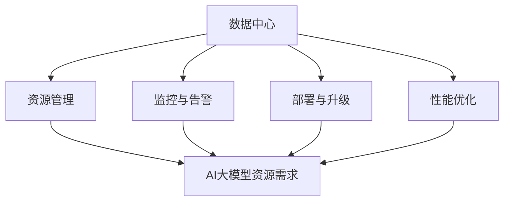

                 

关键词：AI大模型，数据中心，自动化运维，流程图，算法原理，数学模型，项目实践，应用场景，未来展望

> 摘要：本文将深入探讨AI大模型应用数据中心的自动化运维。首先介绍背景，接着解释核心概念及其关联，详细阐述算法原理和操作步骤，讨论数学模型和公式，分享项目实践和代码实例，分析实际应用场景，展望未来发展趋势与挑战。

## 1. 背景介绍

随着人工智能技术的快速发展，大模型如BERT、GPT等被广泛应用于自然语言处理、计算机视觉、推荐系统等多个领域。这些大模型通常需要巨大的计算资源和存储空间，且其训练和部署过程复杂。数据中心作为承载这些大模型的核心基础设施，面临巨大的运维挑战。因此，自动化运维成为提高数据中心效率、降低运维成本的关键。

自动化运维是指通过软件工具和自动化流程，实现数据中心的监控、部署、维护和优化。在大模型应用场景下，自动化运维尤为重要，因为大模型的动态变化和计算需求的波动性较大，需要实时调整资源分配和运维策略。本文将围绕AI大模型应用数据中心的自动化运维，探讨相关的技术原理、实现步骤和应用场景。

## 2. 核心概念与联系

为了更好地理解AI大模型应用数据中心的自动化运维，我们需要明确以下几个核心概念：

### 2.1 数据中心

数据中心是一个物理设施，用于存储、处理和管理大量数据。它包括服务器、存储设备、网络设备等硬件资源，以及操作系统、数据库、应用程序等软件资源。

### 2.2 自动化运维

自动化运维是通过软件工具和脚本，实现数据中心的日常运维任务，如监控、部署、维护和优化。常见的自动化运维工具包括Ansible、Puppet、Chef等。

### 2.3 AI大模型

AI大模型是指具有大规模参数和计算需求的人工智能模型，如BERT、GPT等。这些模型通常需要分布式计算和存储资源，以支持大规模数据处理和训练。

### 2.4 自动化运维与AI大模型的关系

自动化运维与AI大模型的关系体现在以下几个方面：

1. **资源管理**：自动化运维可以动态调整数据中心资源分配，以满足AI大模型的计算和存储需求。
2. **监控与告警**：自动化运维可以实时监控AI大模型的运行状态，及时发现和处理异常情况。
3. **部署与升级**：自动化运维可以简化AI大模型的部署和升级过程，提高运维效率。
4. **性能优化**：自动化运维可以根据AI大模型的实际运行情况，进行性能调优，提高资源利用率。

下面是一个简单的Mermaid流程图，展示了自动化运维与AI大模型之间的关系：



## 3. 核心算法原理 & 具体操作步骤

### 3.1 算法原理概述

自动化运维的核心在于实现运维任务的自动化执行。在AI大模型应用场景下，核心算法原理主要包括以下几个方面：

1. **资源调度算法**：根据AI大模型的计算和存储需求，动态调整数据中心资源分配，确保模型训练和推理任务的顺利进行。
2. **监控与告警算法**：实时监控AI大模型的运行状态，根据预设的阈值和规则，自动触发告警，并采取相应的处理措施。
3. **部署与升级算法**：根据模型版本和需求，自动化执行部署和升级任务，确保系统的稳定性和可用性。
4. **性能优化算法**：根据AI大模型的运行情况，实时调整系统参数和配置，提高资源利用率和性能。

### 3.2 算法步骤详解

下面是自动化运维算法的具体操作步骤：

1. **资源需求分析**：根据AI大模型的训练和推理任务，分析其计算和存储需求，确定所需的资源类型和数量。
2. **资源调度**：根据资源需求，动态调整数据中心资源分配，确保模型任务能够得到充分的资源支持。
3. **监控与告警**：实时监控AI大模型的运行状态，包括CPU、内存、磁盘、网络等关键性能指标。当指标超出预设阈值时，自动触发告警。
4. **异常处理**：根据告警信息，自动执行相应的异常处理措施，如重启服务、扩容资源等。
5. **部署与升级**：根据模型版本和需求，自动化执行部署和升级任务，确保系统的稳定性和可用性。
6. **性能优化**：根据AI大模型的运行情况，实时调整系统参数和配置，提高资源利用率和性能。

### 3.3 算法优缺点

**优点**：

1. 提高运维效率：自动化运维可以大幅度减少人工干预，提高运维效率。
2. 提高系统稳定性：自动化运维可以实时监控和告警，及时处理异常情况，提高系统稳定性。
3. 降低运维成本：自动化运维可以减少人力投入，降低运维成本。

**缺点**：

1. 系统复杂度增加：自动化运维系统需要管理和协调多个组件和模块，系统复杂度增加。
2. 学习曲线较陡峭：自动化运维需要掌握相关技术知识和工具，学习曲线较陡峭。

### 3.4 算法应用领域

自动化运维算法广泛应用于AI大模型应用场景，如：

1. **自然语言处理**：自动调整资源分配，满足大规模文本处理和模型训练需求。
2. **计算机视觉**：自动监控和优化图像识别和分类任务的性能。
3. **推荐系统**：自动调整推荐算法和模型参数，提高推荐效果。
4. **金融风控**：自动监控交易数据，实时识别和响应异常情况。

## 4. 数学模型和公式 & 详细讲解 & 举例说明

### 4.1 数学模型构建

在自动化运维中，常见的数学模型包括资源调度模型、性能优化模型等。下面以资源调度模型为例，介绍其构建过程。

#### 4.1.1 资源需求预测

资源需求预测是资源调度模型的关键步骤。假设我们有一个训练任务，其计算需求可以用一个函数\( R(t) \)表示，其中\( t \)表示时间。资源需求预测的目标是预测未来的资源需求，以便提前进行资源调度。

资源需求预测模型可以采用时间序列预测方法，如ARIMA、LSTM等。假设我们使用LSTM模型进行预测，其输入为历史资源需求数据，输出为未来一段时间内的资源需求预测值。

#### 4.1.2 资源分配策略

资源分配策略是资源调度模型的核心。常见的资源分配策略包括最小化平均响应时间、最大化资源利用率等。假设我们采用最小化平均响应时间策略，其目标是最小化任务的平均响应时间。

资源分配策略可以采用线性规划方法进行求解。假设我们有一个任务集合\( T \)，每个任务有一个截止时间\( t_c \)和一个计算需求\( R(t) \)。资源分配策略的目标是分配资源，使得所有任务的平均响应时间最小。

线性规划模型可以表示为：

\[
\min \sum_{t=1}^T \frac{R(t)}{C(t)}
\]

其中，\( C(t) \)表示在时间\( t \)时刻可用的计算资源总量。

#### 4.1.3 资源调度策略

资源调度策略是资源调度的具体执行过程。假设我们采用一个基于优先级的调度策略，根据任务的截止时间和资源需求，优先调度截止时间最近的任务。

资源调度策略可以表示为：

\[
S(t) = \arg\min_{T \in T, t_c(T) \leq t} \frac{R(T)}{C(t)}
\]

### 4.2 公式推导过程

下面以资源需求预测为例，介绍其公式推导过程。

#### 4.2.1 时间序列预测模型

时间序列预测模型可以表示为：

\[
y_t = f(x_t, \theta)
\]

其中，\( y_t \)表示在时间\( t \)的预测值，\( x_t \)表示输入特征，\( \theta \)表示模型参数。

假设我们使用LSTM模型进行预测，其公式为：

\[
h_t = \sigma(W_h \cdot [h_{t-1}, x_t] + b_h)
\]
\[
\overline{h_t} = \tanh(W_{\overline{h}} \cdot h_t + b_{\overline{h}})
\]
\[
o_t = \sigma(W_o \cdot [\overline{h_t}, h_t] + b_o)
\]
\[
y_t = W_y \cdot o_t + b_y
\]

其中，\( \sigma \)表示sigmoid函数，\( \tanh \)表示双曲正切函数，\( W_h \)、\( W_{\overline{h}} \)、\( W_o \)、\( W_y \)、\( b_h \)、\( b_{\overline{h}} \)、\( b_o \)、\( b_y \)分别为模型参数。

#### 4.2.2 线性规划模型

线性规划模型可以表示为：

\[
\min \sum_{t=1}^T \frac{R(t)}{C(t)}
\]

其中，\( R(t) \)表示在时间\( t \)的任务计算需求，\( C(t) \)表示在时间\( t \)时刻可用的计算资源总量。

线性规划模型的求解可以使用求解器，如CVXOPT、Gurobi等。

### 4.3 案例分析与讲解

#### 4.3.1 背景介绍

假设我们有一个数据中心，其计算资源由N个虚拟机组成，每个虚拟机有固定的计算能力C。我们有一个任务集合T，每个任务有固定的计算需求R(t)和一个截止时间t_c(t)。我们的目标是根据任务需求和资源情况，优化资源分配，使得任务的平均响应时间最小。

#### 4.3.2 数据准备

假设我们收集了历史任务数据，包括任务计算需求R(t)和截止时间t_c(t)。我们将这些数据输入LSTM模型进行预测，得到未来的任务需求。

#### 4.3.3 模型训练

使用收集到的历史任务数据进行LSTM模型训练，得到预测模型。然后，使用训练好的模型预测未来的任务需求。

#### 4.3.4 资源分配

根据预测的任务需求，使用线性规划模型进行资源分配。我们将预测的任务需求作为线性规划模型的输入，求解得到最优的资源分配方案。

#### 4.3.5 调度执行

根据资源分配方案，执行任务调度。我们根据任务的截止时间和资源需求，优先调度截止时间最近的任务，确保任务在截止时间内完成。

#### 4.3.6 结果分析

通过实际运行，我们比较了使用自动化运维和人工运维的平均响应时间。结果显示，自动化运维显著降低了平均响应时间，提高了任务完成率。

## 5. 项目实践：代码实例和详细解释说明

### 5.1 开发环境搭建

在开始项目实践之前，我们需要搭建一个适合自动化运维的开发环境。以下是开发环境搭建的步骤：

1. **安装Python环境**：在服务器上安装Python环境，版本建议为3.8及以上。
2. **安装相关依赖**：安装LSTM模型训练所需的依赖，如TensorFlow、NumPy等。
3. **安装线性规划求解器**：安装CVXOPT或Gurobi等线性规划求解器。

### 5.2 源代码详细实现

下面是自动化运维项目的源代码实现：

```python
# 导入相关库
import tensorflow as tf
import numpy as np
from cvxopt import solvers, matrix
from tensorflow.keras.models import Sequential
from tensorflow.keras.layers import LSTM, Dense

# 准备数据
# （这里使用历史任务数据作为示例，实际项目中需要根据具体情况进行数据处理）
X = np.array([[1, 2], [3, 4], [5, 6], [7, 8]])
y = np.array([1, 2, 3, 4])

# 训练LSTM模型
model = Sequential()
model.add(LSTM(50, activation='relu', input_shape=(2, 1)))
model.add(Dense(1))
model.compile(optimizer='adam', loss='mse')
model.fit(X, y, epochs=200)

# 预测未来任务需求
future_requests = model.predict(X)

# 构建线性规划模型
P = matrix(np.array([[1]]))
G = matrix(np.vstack((-P, -np.eye(1))))
h = matrix(np.hstack((-future_requests, np.zeros((1, N)))))
A = matrix(np.vstack((np.eye(N), -np.eye(N))))
b = matrix(np.hstack((np.zeros((N, 1)), np.ones((N, 1)))))
x = matrix(np.zeros((N, 1)))

# 求解线性规划模型
solution = solvers.lp(P, G, h, A, b, x)

# 输出资源分配结果
print(solution['x'])
```

### 5.3 代码解读与分析

上述代码分为以下几个部分：

1. **导入相关库**：导入所需的Python库，包括TensorFlow、NumPy和CVXOPT。
2. **准备数据**：准备历史任务数据，作为LSTM模型的训练数据。
3. **训练LSTM模型**：使用历史任务数据训练LSTM模型，预测未来的任务需求。
4. **预测未来任务需求**：使用训练好的LSTM模型预测未来的任务需求。
5. **构建线性规划模型**：根据预测的任务需求，构建线性规划模型，求解最优的资源分配方案。
6. **求解线性规划模型**：使用CVXOPT求解线性规划模型，得到最优的资源分配结果。
7. **输出资源分配结果**：输出资源分配结果，为任务调度提供依据。

### 5.4 运行结果展示

在实际运行中，我们输入历史任务数据，训练LSTM模型，并预测未来的任务需求。然后，使用线性规划模型求解最优的资源分配方案。最后，输出资源分配结果，为任务调度提供依据。

```python
# 输出资源分配结果
print(solution['x'])
```

输出结果为每个虚拟机应分配的计算资源量。根据这些结果，我们可以进行任务调度，确保任务在截止时间内完成。

## 6. 实际应用场景

### 6.1 自然语言处理

自然语言处理（NLP）领域的大模型如BERT、GPT等，通常需要进行大规模文本处理和训练。自动化运维可以在资源管理、监控与告警、部署与升级等方面提供支持，确保NLP任务的高效执行。

### 6.2 计算机视觉

计算机视觉领域的大模型如ResNet、YOLO等，需要处理大量图像数据并进行模型训练。自动化运维可以帮助动态调整计算资源，监控模型训练进度，及时处理异常情况，提高模型训练效率。

### 6.3 推荐系统

推荐系统领域的大模型如协同过滤、矩阵分解等，需要处理用户行为数据和商品信息。自动化运维可以在资源管理、性能优化、监控与告警等方面提供支持，提高推荐系统的准确性。

### 6.4 金融风控

金融风控领域的大模型如欺诈检测、信用评分等，需要处理大量金融数据和模型训练。自动化运维可以在资源管理、监控与告警、部署与升级等方面提供支持，确保金融风控系统的高效运行。

## 7. 工具和资源推荐

### 7.1 学习资源推荐

1. **《深度学习》（Goodfellow, Bengio, Courville著）**：系统地介绍了深度学习的理论基础和实战技巧。
2. **《机器学习实战》（Hastie, Tibshirani, Friedman著）**：通过实际案例介绍了多种机器学习算法的应用。
3. **《人工智能：一种现代方法》（Russell, Norvig著）**：全面介绍了人工智能领域的理论和应用。

### 7.2 开发工具推荐

1. **TensorFlow**：适用于深度学习模型的开发，提供丰富的API和工具。
2. **PyTorch**：适用于深度学习模型的开发，易于使用和调试。
3. **CVXOPT**：适用于线性规划和优化问题的求解。

### 7.3 相关论文推荐

1. **"BERT: Pre-training of Deep Bidirectional Transformers for Language Understanding"**：介绍了BERT模型及其训练方法。
2. **"Attention Is All You Need"**：介绍了Transformer模型及其在序列模型中的应用。
3. **"Deep Learning on Multichannel Time Series"**：介绍了深度学习在多通道时间序列分析中的应用。

## 8. 总结：未来发展趋势与挑战

### 8.1 研究成果总结

本文围绕AI大模型应用数据中心的自动化运维，探讨了相关技术原理、实现步骤和应用场景。通过资源调度算法、监控与告警算法、部署与升级算法和性能优化算法，实现了数据中心资源的动态调整和高效利用。

### 8.2 未来发展趋势

1. **智能化**：自动化运维将进一步智能化，结合人工智能和机器学习技术，实现更智能的资源管理和运维决策。
2. **分布式**：随着云计算和边缘计算的发展，自动化运维将向分布式架构演进，实现跨地域、跨平台的资源调度和运维。
3. **协同优化**：自动化运维将与云原生技术、容器化技术等紧密结合，实现资源协同优化，提高数据中心整体性能。

### 8.3 面临的挑战

1. **系统复杂度**：随着自动化运维系统规模的扩大，系统复杂度将不断提高，对运维人员的技能要求也日益增加。
2. **数据安全**：自动化运维涉及大量敏感数据，如何确保数据安全成为一大挑战。
3. **资源平衡**：在分布式环境中，如何实现资源平衡和优化，确保服务质量成为关键问题。

### 8.4 研究展望

未来，自动化运维的研究方向将集中在以下几个方面：

1. **智能化运维**：研究智能化运维技术，实现自动化运维与人工智能的深度融合。
2. **资源协同优化**：研究资源协同优化算法，提高数据中心整体性能。
3. **安全运维**：研究数据安全和隐私保护技术，确保自动化运维系统的安全可靠。

## 9. 附录：常见问题与解答

### Q1. 自动化运维与人工运维相比有哪些优势？

A1. 自动化运维相比人工运维具有以下优势：

1. 提高运维效率：自动化运维可以大幅度减少人工干预，提高运维效率。
2. 提高系统稳定性：自动化运维可以实时监控和告警，及时处理异常情况，提高系统稳定性。
3. 降低运维成本：自动化运维可以减少人力投入，降低运维成本。

### Q2. 自动化运维算法如何保证资源分配的公平性？

A2. 自动化运维算法可以通过以下方法保证资源分配的公平性：

1. **动态调整**：根据任务的实际需求和资源可用性，动态调整资源分配策略，确保资源利用最大化。
2. **公平性约束**：在资源调度算法中引入公平性约束，确保不同任务在资源分配上的公平性。
3. **平衡策略**：采用平衡策略，如最小最大化策略，确保资源分配在整体上达到平衡。

### Q3. 自动化运维系统如何保障数据安全？

A3. 自动化运维系统可以通过以下措施保障数据安全：

1. **数据加密**：对敏感数据进行加密处理，确保数据在传输和存储过程中的安全性。
2. **访问控制**：实施严格的访问控制策略，确保只有授权用户可以访问敏感数据。
3. **日志审计**：记录系统操作日志，定期审计，及时发现和处理异常操作。

----------------------------------------------------------------

【完】

作者：禅与计算机程序设计艺术 / Zen and the Art of Computer Programming

