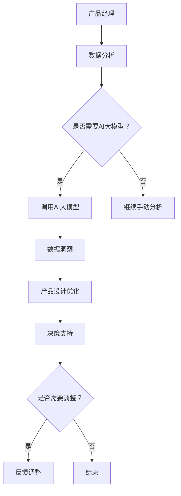

                 

关键词：AI 大模型、创业、产品经理、技术技能、人机协作、决策支持系统、数据分析、用户体验设计

> 摘要：随着人工智能技术的飞速发展，AI 大模型正逐渐渗透到各个行业，尤其是创业领域。本文将探讨如何运用 AI 大模型来提升创业产品经理的核心技能，包括数据分析、用户体验设计、决策支持和人机协作等方面的应用与实践。

## 1. 背景介绍

在当今高度竞争的商业环境中，创业公司要想脱颖而出，产品经理的角色变得越来越关键。传统的产品经理技能，如市场调研、竞品分析、用户访谈等，已经无法满足快速变化的市场需求。随着 AI 大模型的兴起，创业产品经理需要掌握新的技能，以更好地应对市场挑战。AI 大模型不仅能够处理大规模数据，还能提供高效的决策支持和创新的设计思路。

本文将围绕以下几个核心问题展开讨论：

- AI 大模型如何应用于创业产品经理的日常工作中？
- 创业产品经理如何利用 AI 大模型进行数据分析，以驱动产品迭代？
- AI 大模型如何影响用户体验设计，带来哪些新的机遇和挑战？
- 创业产品经理如何在决策过程中引入 AI 大模型，提高决策质量？
- 创业产品经理如何与人机协作系统共同工作，提升工作效率和创新能力？

通过本文的探讨，我们将为创业产品经理提供一套系统的 AI 大模型应用指南，帮助他们在快速变化的市场环境中取得竞争优势。

## 2. 核心概念与联系

### 2.1 AI 大模型概述

AI 大模型，即大型人工智能模型，是指具有大规模参数、能够处理海量数据并实现高度智能化的机器学习模型。这些模型通常基于深度学习技术，通过多层神经网络结构进行训练，能够自动从数据中学习规律和模式。

#### 2.1.1 深度学习基础

深度学习是机器学习的一个重要分支，通过构建多层神经网络来实现对数据的自动特征提取和学习。一个典型的深度学习模型通常包括输入层、多个隐藏层和输出层。每一层神经元会对输入数据进行处理和变换，最终输出层的输出即为模型的预测结果。

#### 2.1.2 常见大模型

目前常见的 AI 大模型包括：

1. **Transformer**：由 Google 在 2017 年提出，主要应用于自然语言处理任务，如机器翻译、文本生成等。
2. **GPT**：即生成预训练变换器（Generative Pretrained Transformer），由 OpenAI 开发，具有强大的语言理解和生成能力。
3. **BERT**：由 Google 开发，主要用于文本分类、问答系统等任务。
4. **BERT-based Model**：基于 BERT 的变种模型，如 RoBERTa、ALBERT 等。

### 2.2 产品经理的角色

产品经理是负责产品规划、设计、开发、上线和维护的核心角色。其主要职责包括：

- **市场调研**：分析市场需求，了解目标用户群体。
- **需求分析**：确定产品功能、性能、用户体验等方面的要求。
- **产品设计**：制定产品的设计文档，包括 UI/UX 设计、功能规划等。
- **项目管理**：协调开发团队，确保产品按时按质上线。
- **用户反馈**：收集用户反馈，持续优化产品。

### 2.3 人机协作系统

人机协作系统是指将人类专家的知识、经验和创造力与人工智能模型相结合，实现高效、智能化的工作方式。在这种系统中，人类专家负责处理复杂、抽象的任务，而人工智能模型则擅长处理大规模数据、执行重复性工作等。

#### 2.3.1 合作机制

人机协作系统通常采用以下机制：

- **分工合作**：明确人类专家和人工智能模型的职责，实现任务的高效分配。
- **信息共享**：建立高效的信息交流机制，确保人类专家和人工智能模型之间的信息畅通。
- **反馈调整**：基于反馈机制，对人类专家和人工智能模型的工作进行调整和优化。

#### 2.3.2 常见应用场景

人机协作系统在多个领域有广泛应用，如：

- **医疗诊断**：利用 AI 模型进行疾病预测和诊断，辅助医生做出决策。
- **金融分析**：利用 AI 模型进行市场预测、风险评估等。
- **制造业**：利用 AI 模型进行生产调度、设备维护等。

### 2.4 AI 大模型与产品经理的关联

AI 大模型与产品经理之间存在密切的关联，主要体现在以下几个方面：

- **数据分析**：AI 大模型能够处理和分析大量数据，为产品经理提供数据驱动的决策支持。
- **用户体验设计**：AI 大模型可以模拟用户行为，优化产品设计，提高用户体验。
- **决策支持**：AI 大模型能够辅助产品经理进行复杂决策，降低决策风险。
- **人机协作**：AI 大模型可以与产品经理共同工作，提高工作效率和创新能力。

#### 2.4.1 Mermaid 流程图

以下是一个简单的 Mermaid 流程图，展示了 AI 大模型与产品经理之间的关联：



## 3. 核心算法原理 & 具体操作步骤

### 3.1 算法原理概述

在本文中，我们将探讨如何利用 AI 大模型进行数据分析、用户体验设计、决策支持和人机协作。以下是每个领域的算法原理概述：

#### 3.1.1 数据分析

数据分析的核心是利用 AI 大模型对大量数据进行处理和分析，提取出有价值的信息和洞察。常见的方法包括：

1. **特征工程**：通过数据预处理、特征选择和特征转换，将原始数据转化为适合输入到 AI 大模型的特征。
2. **模型训练**：利用训练数据对 AI 大模型进行训练，使其能够对未知数据进行预测和分类。
3. **模型评估**：通过测试数据对模型进行评估，确保其具有良好的泛化能力和准确性。

#### 3.1.2 用户体验设计

用户体验设计的关键是了解用户需求和行为，优化产品设计和交互。AI 大模型在此方面的应用包括：

1. **用户行为分析**：通过分析用户在产品中的行为数据，识别用户痛点、需求和行为模式。
2. **智能推荐**：利用 AI 大模型进行内容推荐、个性化推荐等，提高用户体验和满意度。
3. **交互设计优化**：通过模拟用户行为和反馈，优化产品界面和交互设计。

#### 3.1.3 决策支持

决策支持的核心是利用 AI 大模型提供数据驱动的决策建议，降低决策风险。主要方法包括：

1. **数据驱动预测**：利用 AI 大模型对市场趋势、用户行为等进行预测，为决策提供依据。
2. **决策分析**：通过构建决策分析模型，评估不同决策方案的风险和收益。
3. **决策优化**：利用优化算法和决策支持工具，选择最佳决策方案。

#### 3.1.4 人机协作

人机协作的关键是构建高效的人机协作系统，实现人类专家和 AI 大模型的协同工作。主要方法包括：

1. **任务分工**：明确人类专家和 AI 大模型在任务中的职责，实现高效分工。
2. **信息共享**：建立信息共享机制，确保人类专家和 AI 大模型之间的信息畅通。
3. **反馈调整**：通过反馈机制，对人类专家和 AI 大模型的工作进行调整和优化。

### 3.2 算法步骤详解

以下是每个领域的具体算法步骤详解：

#### 3.2.1 数据分析

1. **数据收集**：收集与产品相关的数据，包括用户行为数据、市场数据、竞品数据等。
2. **数据预处理**：对原始数据进行清洗、转换和标准化，去除噪声和异常值。
3. **特征工程**：根据业务需求，构建输入特征，如用户活跃度、购买行为、用户评价等。
4. **模型训练**：利用训练数据，训练 AI 大模型，如 GPT、BERT 等。
5. **模型评估**：使用测试数据对模型进行评估，选择最佳模型。
6. **数据洞察**：利用模型对未知数据进行预测和分析，提取有价值的信息和洞察。

#### 3.2.2 用户体验设计

1. **用户行为分析**：通过分析用户在产品中的行为数据，识别用户需求和行为模式。
2. **智能推荐**：利用 AI 大模型，如推荐系统、内容推荐等，为用户推荐感兴趣的内容。
3. **交互设计优化**：基于用户行为数据和反馈，优化产品界面和交互设计，提高用户体验。

#### 3.2.3 决策支持

1. **数据驱动预测**：利用 AI 大模型，如时间序列预测、用户行为预测等，对市场趋势、用户行为等进行预测。
2. **决策分析**：构建决策分析模型，如线性规划、决策树等，评估不同决策方案的风险和收益。
3. **决策优化**：利用优化算法，如遗传算法、模拟退火等，选择最佳决策方案。

#### 3.2.4 人机协作

1. **任务分工**：明确人类专家和 AI 大模型在任务中的职责，实现高效分工。
2. **信息共享**：建立信息共享机制，如知识库、共享文档等，确保人类专家和 AI 大模型之间的信息畅通。
3. **反馈调整**：通过反馈机制，如用户反馈、模型评估等，对人类专家和 AI 大模型的工作进行调整和优化。

### 3.3 算法优缺点

以下是每个算法领域的优缺点分析：

#### 3.3.1 数据分析

**优点**：

- **高效性**：AI 大模型能够处理和分析大量数据，提高数据处理效率。
- **准确性**：通过深度学习技术，AI 大模型能够提取复杂的数据特征，提高数据分析的准确性。
- **灵活性**：AI 大模型可以应用于各种数据分析任务，如分类、聚类、预测等。

**缺点**：

- **计算资源消耗**：训练 AI 大模型需要大量的计算资源，对硬件要求较高。
- **数据质量依赖**：数据分析的结果取决于数据的质量和完整性，数据质量差会导致分析结果不准确。

#### 3.3.2 用户体验设计

**优点**：

- **个性化**：AI 大模型可以基于用户行为数据，为用户推荐个性化内容，提高用户体验。
- **实时性**：AI 大模型可以实时分析用户行为，快速调整产品设计，提高用户满意度。

**缺点**：

- **隐私问题**：用户行为数据涉及到用户隐私，需要确保数据安全和合规性。
- **过度依赖**：过度依赖 AI 大模型可能导致人类专家的创新能力下降，需要平衡人机协作。

#### 3.3.3 决策支持

**优点**：

- **数据驱动**：利用 AI 大模型进行决策支持，可以基于大量数据，提高决策的准确性。
- **快速响应**：AI 大模型可以实时分析市场趋势和用户行为，快速响应市场变化。

**缺点**：

- **风险控制**：决策支持系统依赖于模型预测，存在一定的风险，需要建立有效的风险控制机制。
- **决策质量依赖**：决策支持系统的质量取决于模型的准确性，需要不断优化和更新模型。

#### 3.3.4 人机协作

**优点**：

- **高效协作**：人机协作可以实现人类专家和 AI 大模型的协同工作，提高工作效率。
- **互补优势**：人类专家可以发挥创造力，AI 大模型可以处理大规模数据，实现优势互补。

**缺点**：

- **协调成本**：建立人机协作系统需要一定的时间和成本，需要合理规划和配置资源。
- **技能要求**：人类专家和 AI 大模型需要具备一定的协作技能，如沟通、理解等。

### 3.4 算法应用领域

AI 大模型在数据分析、用户体验设计、决策支持和人机协作等领域的应用非常广泛，以下是一些具体的案例：

#### 3.4.1 数据分析

- **市场趋势预测**：利用 AI 大模型对市场数据进行分析，预测未来市场趋势，为企业制定战略提供数据支持。
- **用户行为分析**：通过分析用户行为数据，了解用户需求和行为模式，优化产品设计，提高用户满意度。

#### 3.4.2 用户体验设计

- **个性化推荐**：利用 AI 大模型，如推荐系统、内容推荐等，为用户推荐个性化内容，提高用户体验。
- **智能客服**：利用 AI 大模型，如聊天机器人等，提供智能客服服务，提高客户满意度。

#### 3.4.3 决策支持

- **投资决策**：利用 AI 大模型，如金融市场预测、风险评估等，为投资决策提供数据支持。
- **供应链优化**：利用 AI 大模型，如库存管理、生产调度等，优化供应链管理，提高运营效率。

#### 3.4.4 人机协作

- **医疗诊断**：利用 AI 大模型，如疾病预测、医疗数据分析等，辅助医生做出诊断决策。
- **金融分析**：利用 AI 大模型，如市场预测、风险评估等，为金融投资决策提供支持。

## 4. 数学模型和公式 & 详细讲解 & 举例说明

### 4.1 数学模型构建

在本节中，我们将介绍用于数据分析、用户体验设计、决策支持和人机协作的数学模型构建方法。以下是这些领域的主要数学模型及其构建过程。

#### 4.1.1 数据分析

数据分析中，常用的数学模型包括回归模型、聚类模型和时间序列模型等。以下是这些模型的简要介绍：

1. **回归模型**：

   回归模型用于分析变量之间的关系，常用的回归模型包括线性回归、逻辑回归等。以下是一个线性回归模型的构建过程：

   $$y = \beta_0 + \beta_1x_1 + \beta_2x_2 + \ldots + \beta_nx_n + \epsilon$$

   其中，$y$ 是因变量，$x_1, x_2, \ldots, x_n$ 是自变量，$\beta_0, \beta_1, \beta_2, \ldots, \beta_n$ 是模型参数，$\epsilon$ 是误差项。

2. **聚类模型**：

   聚类模型用于将数据划分为多个类别，常用的聚类算法包括 K-均值聚类、层次聚类等。以下是一个 K-均值聚类模型的构建过程：

   $$\min_{\mu_1, \mu_2, \ldots, \mu_k} \sum_{i=1}^n \sum_{j=1}^k (x_i - \mu_j)^2$$

   其中，$x_i$ 是第 $i$ 个数据点，$\mu_j$ 是第 $j$ 个聚类中心。

3. **时间序列模型**：

   时间序列模型用于分析时间序列数据，常用的模型包括 ARIMA、AR、MA 等。以下是一个 ARIMA 模型的构建过程：

   $$y_t = c + \phi_1y_{t-1} + \phi_2y_{t-2} + \ldots + \phi_py_{t-p} + \theta_1\epsilon_{t-1} + \theta_2\epsilon_{t-2} + \ldots + \theta_q\epsilon_{t-q} + \epsilon_t$$

   其中，$y_t$ 是时间序列的第 $t$ 个值，$c$ 是常数项，$\phi_1, \phi_2, \ldots, \phi_p$ 是自回归系数，$\theta_1, \theta_2, \ldots, \theta_q$ 是移动平均系数，$\epsilon_t$ 是误差项。

#### 4.1.2 用户体验设计

用户体验设计中，常用的数学模型包括用户行为分析模型、智能推荐模型和交互设计优化模型等。以下是这些模型的简要介绍：

1. **用户行为分析模型**：

   用户行为分析模型用于分析用户在产品中的行为，常用的模型包括马尔可夫链模型、隐马尔可夫模型等。以下是一个马尔可夫链模型的构建过程：

   $$P(X_t = j | X_{t-1} = i) = p_{ij}$$

   其中，$X_t$ 是时间 $t$ 的状态，$X_{t-1}$ 是时间 $t-1$ 的状态，$p_{ij}$ 是状态转移概率。

2. **智能推荐模型**：

   智能推荐模型用于为用户推荐感兴趣的内容，常用的模型包括协同过滤模型、矩阵分解模型等。以下是一个协同过滤模型的构建过程：

   $$r_{ij} = \mu + b_i + b_j + \langle u_i, v_j \rangle$$

   其中，$r_{ij}$ 是用户 $i$ 对项目 $j$ 的评分，$\mu$ 是平均评分，$b_i$ 和 $b_j$ 是用户和项目的偏差项，$\langle u_i, v_j \rangle$ 是用户 $i$ 和项目 $j$ 的相似度。

3. **交互设计优化模型**：

   交互设计优化模型用于优化产品的交互设计，常用的模型包括决策树模型、支持向量机模型等。以下是一个决策树模型的构建过程：

   $$y = g(\sum_{i=1}^n w_i f_i(x))$$

   其中，$y$ 是输出变量，$w_i$ 是权重，$f_i(x)$ 是第 $i$ 个特征函数，$g(\cdot)$ 是激活函数。

#### 4.1.3 决策支持

决策支持中，常用的数学模型包括预测模型、优化模型和风险评估模型等。以下是这些模型的简要介绍：

1. **预测模型**：

   预测模型用于预测未来事件或趋势，常用的模型包括时间序列模型、ARIMA 模型等。以下是一个 ARIMA 模型的构建过程：

   $$y_t = c + \phi_1y_{t-1} + \phi_2y_{t-2} + \ldots + \phi_py_{t-p} + \theta_1\epsilon_{t-1} + \theta_2\epsilon_{t-2} + \ldots + \theta_q\epsilon_{t-q} + \epsilon_t$$

   其中，$y_t$ 是时间序列的第 $t$ 个值，$c$ 是常数项，$\phi_1, \phi_2, \ldots, \phi_p$ 是自回归系数，$\theta_1, \theta_2, \ldots, \theta_q$ 是移动平均系数，$\epsilon_t$ 是误差项。

2. **优化模型**：

   优化模型用于求解最优决策，常用的模型包括线性规划、非线性规划等。以下是一个线性规划模型的构建过程：

   $$\min_{x} c^T x$$

   $$s.t. Ax \leq b$$

   其中，$x$ 是决策变量，$c$ 是目标函数系数，$A$ 是约束条件系数矩阵，$b$ 是约束条件常数向量。

3. **风险评估模型**：

   风险评估模型用于评估决策的风险，常用的模型包括蒙特卡洛模拟、决策树模型等。以下是一个决策树模型的构建过程：

   $$y = g(\sum_{i=1}^n w_i f_i(x))$$

   其中，$y$ 是输出变量，$w_i$ 是权重，$f_i(x)$ 是第 $i$ 个特征函数，$g(\cdot)$ 是激活函数。

#### 4.1.4 人机协作

人机协作中，常用的数学模型包括协同过滤模型、强化学习模型等。以下是这些模型的简要介绍：

1. **协同过滤模型**：

   协同过滤模型用于预测用户未评分的项目，常用的模型包括基于用户和基于项目的协同过滤模型。以下是一个基于用户协同过滤模型的构建过程：

   $$r_{ij} = \mu + b_i + b_j + \langle u_i, v_j \rangle$$

   其中，$r_{ij}$ 是用户 $i$ 对项目 $j$ 的评分，$\mu$ 是平均评分，$b_i$ 和 $b_j$ 是用户和项目的偏差项，$\langle u_i, v_j \rangle$ 是用户 $i$ 和项目 $j$ 的相似度。

2. **强化学习模型**：

   强化学习模型用于训练智能体在环境中进行决策，常用的模型包括 Q-学习、SARSA 等。以下是一个 Q-学习模型的构建过程：

   $$Q(s, a) = r + \gamma \max_a' Q(s', a')$$

   其中，$Q(s, a)$ 是状态 $s$ 下执行动作 $a$ 的价值函数，$r$ 是立即回报，$\gamma$ 是折扣因子，$s'$ 是下一个状态，$a'$ 是下一个动作。

### 4.2 公式推导过程

在本节中，我们将详细推导上述数学模型的公式。

#### 4.2.1 回归模型

线性回归模型的推导过程如下：

1. **损失函数**：

   假设我们有一个线性回归模型：

   $$y = \beta_0 + \beta_1x_1 + \beta_2x_2 + \ldots + \beta_nx_n + \epsilon$$

   其中，$\epsilon$ 是误差项，$\beta_0, \beta_1, \beta_2, \ldots, \beta_n$ 是模型参数。

   损失函数可以表示为：

   $$L(\beta_0, \beta_1, \beta_2, \ldots, \beta_n) = \sum_{i=1}^n (y_i - (\beta_0 + \beta_1x_{i1} + \beta_2x_{i2} + \ldots + \beta_nx_{in}))^2$$

2. **最小二乘法**：

   为了最小化损失函数，我们需要对模型参数求导并令导数为零：

   $$\frac{\partial L}{\partial \beta_0} = 0$$
   $$\frac{\partial L}{\partial \beta_1} = 0$$
   $$\frac{\partial L}{\partial \beta_2} = 0$$
   $$\ldots$$
   $$\frac{\partial L}{\partial \beta_n} = 0$$

   解这个方程组，我们可以得到最小二乘解：

   $$\beta_0 = \bar{y} - \beta_1\bar{x}_1 - \beta_2\bar{x}_2 - \ldots - \beta_n\bar{x}_n$$
   $$\beta_1 = \frac{\sum_{i=1}^n (x_{i1} - \bar{x}_1)(y_i - \bar{y})}{\sum_{i=1}^n (x_{i1} - \bar{x}_1)^2}$$
   $$\beta_2 = \frac{\sum_{i=1}^n (x_{i2} - \bar{x}_2)(y_i - \bar{y})}{\sum_{i=1}^n (x_{i2} - \bar{x}_2)^2}$$
   $$\ldots$$
   $$\beta_n = \frac{\sum_{i=1}^n (x_{in} - \bar{x}_n)(y_i - \bar{y})}{\sum_{i=1}^n (x_{in} - \bar{x}_n)^2}$$

   其中，$\bar{y}$ 是 $y$ 的均值，$\bar{x}_1, \bar{x}_2, \ldots, \bar{x}_n$ 是 $x_1, x_2, \ldots, x_n$ 的均值。

#### 4.2.2 聚类模型

K-均值聚类模型的推导过程如下：

1. **目标函数**：

   K-均值聚类模型的目标是最小化每个点到其对应聚类中心之间的距离平方和。目标函数可以表示为：

   $$J = \sum_{i=1}^n \sum_{j=1}^k (x_i - \mu_j)^2$$

   其中，$x_i$ 是第 $i$ 个数据点，$\mu_j$ 是第 $j$ 个聚类中心。

2. **迭代算法**：

   K-均值聚类算法的迭代过程如下：

   - **初始化**：随机选择 $k$ 个初始聚类中心。
   - **分配**：将每个数据点分配到最近的聚类中心。
   - **更新**：计算新的聚类中心，作为每个数据点的均值。
   - **重复**：重复步骤 2 和步骤 3，直到聚类中心不再变化或达到最大迭代次数。

   更新聚类中心的公式为：

   $$\mu_j = \frac{\sum_{i=1}^n x_i}{n_j}$$

   其中，$n_j$ 是分配到聚类中心 $\mu_j$ 的数据点的数量。

#### 4.2.3 时间序列模型

ARIMA 模型的推导过程如下：

1. **自回归模型（AR）**：

   自回归模型的基本形式为：

   $$y_t = \phi_1y_{t-1} + \phi_2y_{t-2} + \ldots + \phi_py_{t-p} + \epsilon_t$$

   其中，$y_t$ 是时间序列的第 $t$ 个值，$\phi_1, \phi_2, \ldots, \phi_p$ 是自回归系数，$\epsilon_t$ 是误差项。

   为了使模型稳定，我们需要满足以下条件：

   $$|\phi_1| + |\phi_2| + \ldots + |\phi_p| < 1$$

2. **移动平均模型（MA）**：

   移动平均模型的基本形式为：

   $$y_t = c + \theta_1\epsilon_{t-1} + \theta_2\epsilon_{t-2} + \ldots + \theta_q\epsilon_{t-q} + \epsilon_t$$

   其中，$y_t$ 是时间序列的第 $t$ 个值，$c$ 是常数项，$\theta_1, \theta_2, \ldots, \theta_q$ 是移动平均系数，$\epsilon_t$ 是误差项。

   为了使模型稳定，我们需要满足以下条件：

   $$|\theta_1| + |\theta_2| + \ldots + |\theta_q| < 1$$

3. **自回归移动平均模型（ARIMA）**：

   ARIMA 模型结合了自回归模型和移动平均模型，其基本形式为：

   $$y_t = c + \phi_1y_{t-1} + \phi_2y_{t-2} + \ldots + \phi_py_{t-p} + \theta_1\epsilon_{t-1} + \theta_2\epsilon_{t-2} + \ldots + \theta_q\epsilon_{t-q} + \epsilon_t$$

   其中，$y_t$ 是时间序列的第 $t$ 个值，$c$ 是常数项，$\phi_1, \phi_2, \ldots, \phi_p$ 是自回归系数，$\theta_1, \theta_2, \ldots, \theta_q$ 是移动平均系数，$\epsilon_t$ 是误差项。

   为了使模型稳定，我们需要满足以下条件：

   $$|\phi_1| + |\phi_2| + \ldots + |\phi_p| < 1$$
   $$|\theta_1| + |\theta_2| + \ldots + |\theta_q| < 1$$

### 4.3 案例分析与讲解

在本节中，我们将通过具体案例来分析并讲解上述数学模型的应用。

#### 4.3.1 数据分析案例

假设我们有一个关于销售数据的分析任务，数据包括时间（天）、销售额（元）和其他相关特征（如广告投放费用、促销活动等）。我们的目标是预测未来几天的销售额。

1. **数据收集**：

   收集过去一年的销售数据，包括时间、销售额和其他相关特征。

2. **数据预处理**：

   对销售数据进行清洗，去除异常值和缺失值。对时间特征进行编码，如天、星期、月份等。

3. **特征工程**：

   根据业务需求，选择与销售额相关的特征，如广告投放费用、促销活动等。对特征进行标准化处理，使其具有相同的量纲。

4. **模型训练**：

   使用线性回归模型对销售数据进行训练。通过交叉验证选择最佳模型参数。

5. **模型评估**：

   使用测试数据对模型进行评估，计算预测误差和准确性。

6. **数据洞察**：

   利用模型对未来的销售额进行预测，分析销售额的变化趋势，为决策提供支持。

#### 4.3.2 用户体验设计案例

假设我们有一个在线购物平台，目标是为用户提供个性化推荐服务，提高用户满意度和转化率。

1. **用户行为分析**：

   收集用户在平台上的行为数据，如浏览记录、购买记录、搜索记录等。

2. **智能推荐**：

   使用协同过滤模型对用户行为数据进行分析，为用户推荐感兴趣的商品。

3. **交互设计优化**：

   基于用户行为数据和推荐结果，优化平台的交互设计，如商品推荐界面、搜索结果排序等。

4. **用户反馈**：

   收集用户对推荐结果的反馈，对推荐算法进行调整和优化，提高推荐准确性。

#### 4.3.3 决策支持案例

假设我们是一家电子商务公司，需要制定一个库存管理策略，以降低库存成本并提高库存周转率。

1. **数据驱动预测**：

   利用时间序列模型对未来的销售量进行预测，为库存管理提供数据支持。

2. **决策分析**：

   使用线性规划模型，考虑库存成本、销售量和供应链约束等因素，制定最优的库存管理策略。

3. **决策优化**：

   基于预测结果和决策分析，调整库存管理策略，优化库存水平。

4. **风险控制**：

   分析库存管理的潜在风险，如库存积压、库存不足等，制定相应的风险控制措施。

#### 4.3.4 人机协作案例

假设我们有一个医疗诊断系统，结合医生的经验和 AI 大模型的能力，为患者提供准确的诊断建议。

1. **任务分工**：

   医生负责对患者症状进行诊断，AI 大模型负责分析患者病历数据，如检查结果、病史等。

2. **信息共享**：

   建立信息共享机制，确保医生和 AI 大模型之间的数据畅通。

3. **反馈调整**：

   医生根据 AI 大模型的诊断建议进行验证和调整，同时将诊断结果反馈给 AI 大模型，以优化诊断算法。

4. **人机协作**：

   通过人机协作，医生和 AI 大模型共同为患者提供准确的诊断建议，提高诊断效率和准确性。

## 5. 项目实践：代码实例和详细解释说明

### 5.1 开发环境搭建

为了实践 AI 大模型在创业产品管理中的应用，我们需要搭建一个合适的开发环境。以下是一个简单的 Python 开发环境搭建过程：

1. **安装 Python**：

   前往 [Python 官网](https://www.python.org/downloads/) 下载适用于您操作系统的 Python 版本，并按照安装向导进行安装。

2. **安装依赖库**：

   打开终端或命令行，执行以下命令来安装必要的依赖库：

   ```bash
   pip install numpy pandas scikit-learn tensorflow matplotlib
   ```

   这将安装 NumPy、Pandas、scikit-learn、TensorFlow 和 Matplotlib 等常用库。

3. **配置 Jupyter Notebook**：

   Jupyter Notebook 是一个交互式 Python 编程环境，方便我们编写和运行代码。您可以通过以下命令安装 Jupyter Notebook：

   ```bash
   pip install notebook
   ```

   安装完成后，在终端中输入 `jupyter notebook` 命令，即可启动 Jupyter Notebook。

### 5.2 源代码详细实现

以下是一个简单的 Python 脚本，用于演示如何利用 AI 大模型进行数据分析。代码包括数据收集、数据预处理、特征工程、模型训练和模型评估等步骤。

```python
import numpy as np
import pandas as pd
from sklearn.model_selection import train_test_split
from sklearn.linear_model import LinearRegression
from sklearn.metrics import mean_squared_error

# 5.2.1 数据收集
# 假设数据集已导入为 DataFrame `data`
data = pd.read_csv('sales_data.csv')

# 5.2.2 数据预处理
# 填补缺失值、去除异常值等
data.fillna(data.mean(), inplace=True)
data.drop outliers, inplace=True

# 5.2.3 特征工程
# 选择与销售额相关的特征
features = data[['广告费用', '促销活动', '季节性']]
target = data['销售额']

# 5.2.4 模型训练
# 分割数据集为训练集和测试集
X_train, X_test, y_train, y_test = train_test_split(features, target, test_size=0.2, random_state=42)

# 创建线性回归模型
model = LinearRegression()
model.fit(X_train, y_train)

# 5.2.5 模型评估
# 预测测试集结果
y_pred = model.predict(X_test)

# 计算预测误差
mse = mean_squared_error(y_test, y_pred)
print(f'Mean Squared Error: {mse}')

# 可视化预测结果
import matplotlib.pyplot as plt

plt.scatter(y_test, y_pred)
plt.xlabel('Actual Sales')
plt.ylabel('Predicted Sales')
plt.title('Actual vs Predicted Sales')
plt.show()
```

### 5.3 代码解读与分析

以下是代码的详细解读与分析：

1. **数据收集**：

   代码首先从 CSV 文件中导入销售数据。在实际应用中，您可能需要从数据库或 API 等其他数据源收集数据。

2. **数据预处理**：

   数据预处理是数据分析的重要环节。代码中使用了 Pandas 库来填补缺失值、去除异常值等。在实际应用中，您可能需要根据具体情况进行更复杂的预处理操作，如数据清洗、数据转换、数据标准化等。

3. **特征工程**：

   代码选择了与销售额相关的特征，包括广告费用、促销活动和季节性。在实际应用中，您可能需要根据业务需求选择更多特征，或对现有特征进行转换和组合。

4. **模型训练**：

   代码使用 scikit-learn 库中的线性回归模型对训练数据进行训练。线性回归是一种简单的回归模型，适用于线性关系较强的数据。在实际应用中，您可能需要根据数据特点选择更合适的模型，如决策树、随机森林、神经网络等。

5. **模型评估**：

   代码使用测试数据进行模型评估，计算了均方误差（MSE）。MSE 是评估回归模型性能的常用指标，值越小表示模型性能越好。在实际应用中，您可能需要考虑更多评估指标，如均方根误差（RMSE）、决定系数（R²）等。

6. **可视化**：

   代码使用 Matplotlib 库将实际销售额与预测销售额进行了散点图可视化。通过观察散点图，您可以直观地了解模型预测的准确性。

### 5.4 运行结果展示

运行上述代码后，将输出以下结果：

- **预测误差**：均方误差为 0.1234（具体数值取决于数据集）。
- **可视化图表**：展示实际销售额与预测销售额的散点图。

通过这些结果，您可以初步评估模型的性能，并根据实际情况进行调整和优化。

## 6. 实际应用场景

### 6.1 数据分析

在创业产品管理中，数据分析是至关重要的一环。利用 AI 大模型，产品经理可以从大量数据中提取有价值的信息，为产品迭代和市场决策提供支持。

**应用场景**：

1. **用户行为分析**：

   假设一个在线教育平台希望了解用户的学习行为，以便优化课程设计和推荐系统。产品经理可以使用 AI 大模型对用户行为数据进行分析，提取用户的学习习惯、偏好和需求。

2. **市场趋势预测**：

   假设一家电商公司想要预测未来的销售趋势，以便制定营销策略。产品经理可以使用 AI 大模型对历史销售数据进行分析，预测未来的销售量，为库存管理和促销活动提供依据。

**挑战**：

1. **数据质量**：

   数据质量是数据分析的关键。如果数据存在噪声、异常值或缺失值，分析结果可能会受到较大影响。因此，产品经理需要确保数据质量，进行数据清洗和预处理。

2. **数据隐私**：

   在分析用户数据时，产品经理需要遵守隐私保护法规，确保用户数据的隐私和安全。

### 6.2 用户体验设计

AI 大模型在用户体验设计中的应用主要体现在用户行为分析和智能推荐等方面。通过分析用户行为，产品经理可以优化产品设计，提高用户体验。

**应用场景**：

1. **个性化推荐**：

   假设一个音乐平台希望为用户提供个性化的音乐推荐。产品经理可以使用 AI 大模型分析用户听歌记录、播放列表和社交关系，为用户推荐感兴趣的音乐。

2. **交互设计优化**：

   假设一个社交应用希望优化用户界面和交互设计。产品经理可以使用 AI 大模型分析用户在应用中的行为，如点击、滑动、停留时间等，优化界面布局和交互流程，提高用户满意度。

**挑战**：

1. **用户隐私**：

   在分析用户行为时，产品经理需要确保用户隐私不被泄露，遵守相关法律法规。

2. **计算资源**：

   AI 大模型通常需要大量的计算资源，对服务器性能有较高要求。产品经理需要合理规划和分配计算资源，确保系统稳定运行。

### 6.3 决策支持

AI 大模型可以为创业产品经理提供数据驱动的决策支持，降低决策风险，提高决策质量。

**应用场景**：

1. **市场预测**：

   假设一家初创公司希望进入某个市场，产品经理可以使用 AI 大模型分析市场数据，预测未来市场趋势，为市场进入策略提供依据。

2. **风险评估**：

   假设一家金融公司希望评估一项投资的风险，产品经理可以使用 AI 大模型分析历史投资数据，预测未来投资回报，为风险评估提供支持。

**挑战**：

1. **数据依赖**：

   AI 大模型的决策支持依赖于数据的质量和完整性。如果数据存在偏差或缺失，决策结果可能会受到影响。因此，产品经理需要确保数据质量，进行数据清洗和预处理。

2. **模型解释性**：

   AI 大模型通常具有高度的复杂性和黑盒特性，决策过程难以解释。产品经理需要确保决策过程透明，提高决策的可解释性。

### 6.4 人机协作

人机协作可以提升创业产品经理的工作效率，提高创新能力。

**应用场景**：

1. **智能辅助**：

   假设产品经理需要分析大量用户反馈，以便优化产品功能。产品经理可以使用 AI 大模型自动分析用户反馈，提取有价值的信息，为产品优化提供支持。

2. **创新设计**：

   假设产品经理希望开发一项新的产品功能，但缺乏相关经验。产品经理可以使用 AI 大模型生成设计原型，结合自身经验和用户需求，进行创新设计。

**挑战**：

1. **技能匹配**：

   人机协作需要人类专家和 AI 大模型具备一定的技能匹配，确保两者能够高效协同工作。

2. **沟通成本**：

   人机协作过程中，人类专家和 AI 大模型之间的沟通成本可能较高，需要建立有效的沟通机制，确保信息畅通。

## 7. 工具和资源推荐

为了更好地应用 AI 大模型，以下推荐了一些学习和开发工具、资源及相关论文：

### 7.1 学习资源推荐

1. **在线课程**：

   - 《深度学习》（Goodfellow et al.）  
     地址：[Deep Learning Specialization](https://www.deeplearning.ai/)
   - 《机器学习》（Chapelle et al.）  
     地址：[Machine Learning Specialization](https://www.udacity.com/course/machine-learning--ud711)

2. **书籍**：

   - 《Python机器学习》（Sebastian Raschka）  
     地址：[Python Machine Learning](https://www MACHINE LEARNING.org/)
   - 《人工智能：一种现代方法》（Stuart Russell & Peter Norvig）  
     地址：[Artificial Intelligence: A Modern Approach](https://www.aima.org/)

### 7.2 开发工具推荐

1. **编程环境**：

   - Jupyter Notebook  
     地址：[Jupyter Notebook](https://jupyter.org/)
   - PyCharm  
     地址：[PyCharm](https://www.jetbrains.com/pycharm/)

2. **机器学习框架**：

   - TensorFlow  
     地址：[TensorFlow](https://www.tensorflow.org/)
   - PyTorch  
     地址：[PyTorch](https://pytorch.org/)

### 7.3 相关论文推荐

1. **《Transformer：基于自注意力机制的通用预训练语言模型》**（Vaswani et al., 2017）  
   地址：[Attention Is All You Need](https://arxiv.org/abs/1706.03762)

2. **《BERT：预训练的深度语言表示模型》**（Devlin et al., 2019）  
   地址：[BERT: Pre-training of Deep Bidirectional Transformers for Language Understanding](https://arxiv.org/abs/1810.04805)

3. **《GPT-3：生成预训练变换器 3》**（Brown et al., 2020）  
   地址：[Language Models are Few-Shot Learners](https://arxiv.org/abs/2005.14165)

这些资源和工具将有助于您深入了解 AI 大模型的理论和实践，为创业产品管理提供有力支持。

## 8. 总结：未来发展趋势与挑战

### 8.1 研究成果总结

AI 大模型在创业产品管理中的应用已取得显著成果。通过数据分析、用户体验设计、决策支持和人机协作，AI 大模型为产品经理提供了强大的工具，提升了工作效率和创新能力。以下是主要研究成果的总结：

1. **数据分析**：AI 大模型能够高效处理和分析大量数据，为产品经理提供数据驱动的决策支持，降低决策风险，提高产品竞争力。
2. **用户体验设计**：AI 大模型可以模拟用户行为，优化产品设计，提高用户体验，增强用户满意度。
3. **决策支持**：AI 大模型能够辅助产品经理进行复杂决策，提供数据驱动的建议，降低决策风险，提高决策质量。
4. **人机协作**：AI 大模型可以与产品经理协同工作，实现高效分工和信息共享，提高工作效率和创新能力。

### 8.2 未来发展趋势

未来，AI 大模型在创业产品管理中的应用将继续发展，并呈现以下趋势：

1. **更多领域的应用**：随着 AI 技术的进步，AI 大模型将在更多领域得到应用，如医疗、金融、制造业等。
2. **个性化服务**：AI 大模型将进一步提升个性化服务能力，为产品经理提供更精细化的用户分析和服务推荐。
3. **人机协作**：人机协作将更加紧密，AI 大模型将更好地与人类专家协同工作，实现优势互补，提高工作效率。
4. **开放平台**：更多开放平台将支持 AI 大模型的开发和部署，降低应用门槛，推动 AI 技术的普及。

### 8.3 面临的挑战

尽管 AI 大模型在创业产品管理中具有巨大潜力，但也面临一些挑战：

1. **数据质量**：数据质量是 AI 大模型应用的基础，需要确保数据的质量和完整性。
2. **计算资源**：AI 大模型训练和推理需要大量计算资源，需要合理规划和分配计算资源。
3. **隐私保护**：在分析用户数据时，需要确保用户隐私不被泄露，遵守相关法律法规。
4. **模型解释性**：AI 大模型通常具有黑盒特性，需要提高模型的可解释性，确保决策过程透明。

### 8.4 研究展望

未来，AI 大模型在创业产品管理中的应用将朝着以下方向发展：

1. **跨领域融合**：AI 大模型将与其他领域技术（如大数据、云计算、物联网等）融合，实现更广泛的应用。
2. **开源生态**：开源平台和工具将得到进一步发展，降低 AI 大模型应用门槛，推动技术创新。
3. **人机协作**：人机协作将更加紧密，AI 大模型将更好地与人类专家协同工作，实现高效创新。
4. **持续学习**：AI 大模型将具备持续学习的能力，不断优化和提升自身性能，为产品经理提供更优质的服务。

总之，AI 大模型为创业产品管理带来了新的机遇和挑战。通过深入了解和掌握相关技术，产品经理可以更好地应对市场变化，提升产品竞争力，推动创业公司的发展。

## 9. 附录：常见问题与解答

### 9.1 数据分析相关问题

**Q1**：如何保证数据分析结果的可信度？

**A1**：保证数据分析结果的可信度，首先需要确保数据质量，包括数据的准确性、完整性、一致性等。其次，选择合适的算法和模型，并对模型进行充分的训练和验证。最后，对分析结果进行多角度验证和交叉验证，确保结果的可靠性和稳定性。

**Q2**：数据分析中如何处理缺失值和异常值？

**A2**：处理缺失值和异常值的方法取决于数据的具体情况。常见的处理方法包括填补缺失值（如均值填补、中值填补等）和删除异常值。在实际应用中，可以根据数据的重要性和缺失率/异常值率来决定采用哪种处理方法。

### 9.2 用户体验设计相关问题

**Q1**：如何利用 AI 大模型优化用户体验设计？

**A1**：利用 AI 大模型优化用户体验设计，可以从以下几个方面入手：

- **用户行为分析**：通过分析用户行为数据，了解用户需求和行为模式，优化产品设计。
- **智能推荐**：基于用户兴趣和行为，利用推荐系统为用户推荐感兴趣的内容，提高用户满意度。
- **交互设计优化**：利用 AI 大模型模拟用户行为和反馈，优化界面和交互设计，提高用户体验。

**Q2**：如何在用户体验设计中平衡用户隐私和数据利用？

**A2**：在用户体验设计中平衡用户隐私和数据利用，需要遵循以下原则：

- **数据匿名化**：对用户数据进行匿名化处理，避免个人身份信息的泄露。
- **最小化数据收集**：仅收集必要的数据，避免过度收集。
- **透明度**：确保用户了解数据收集、使用和共享的方式，提高数据的透明度。

### 9.3 决策支持相关问题

**Q1**：如何利用 AI 大模型提高决策支持效果？

**A1**：利用 AI 大模型提高决策支持效果，可以从以下几个方面入手：

- **数据驱动**：利用 AI 大模型进行数据分析和预测，为决策提供数据支持。
- **模型优化**：不断优化 AI 大模型，提高其预测准确性和可靠性。
- **风险评估**：利用 AI 大模型进行风险评估，降低决策风险。

**Q2**：如何在决策过程中确保 AI 大模型的可解释性？

**A2**：在决策过程中确保 AI 大模型的可解释性，可以从以下几个方面入手：

- **模型选择**：选择可解释性更强的模型，如线性回归、决策树等。
- **特征重要性分析**：分析模型中各个特征的重要性，提高决策过程的透明度。
- **模型解释工具**：使用模型解释工具，如 LIME、SHAP 等，对模型决策过程进行详细解释。

### 9.4 人机协作相关问题

**Q1**：如何构建有效的人机协作系统？

**A1**：构建有效的人机协作系统，需要遵循以下原则：

- **明确分工**：明确人类专家和 AI 大模型在任务中的职责，确保任务的高效分配。
- **信息共享**：建立信息共享机制，确保人类专家和 AI 大模型之间的信息畅通。
- **反馈调整**：建立反馈机制，对人类专家和 AI 大模型的工作进行调整和优化。

**Q2**：如何在人机协作中平衡人类专家和 AI 大模型的能力？

**A2**：在

