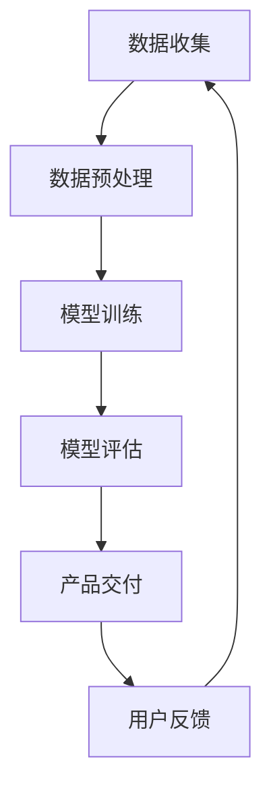

                 

关键词：AI，创业，产品经理，大模型，技能，技术趋势

> 摘要：随着人工智能技术的发展，大模型在各个领域的影响日益扩大。本文将探讨AI驱动的创业产品经理在大模型时代所需的关键技能，帮助读者理解如何在这个快速变化的领域中获得竞争优势。

## 1. 背景介绍

人工智能（AI）的迅猛发展已经深刻地改变了我们的工作和生活方式。大模型，作为一种先进的AI技术，凭借其强大的计算能力和数据处理能力，正在成为各个行业的核心驱动力。从自然语言处理到图像识别，再到推荐系统，大模型的应用已经无处不在。

在这个背景下，创业产品经理的角色变得更加重要。他们不仅要理解技术，还要能够把握市场需求，推动产品从概念到市场的每一步。然而，随着AI技术的演进，传统的产品管理技能已经不再足够。AI驱动的创业产品经理需要掌握一系列新的技能，以应对大模型时代的挑战。

本文将深入探讨这些关键技能，帮助创业者、产品经理和AI专业人士了解如何在这个新兴领域中脱颖而出。

## 2. 核心概念与联系

### 2.1 大模型的定义与原理

大模型是指那些具有数十亿甚至千亿参数的深度学习模型。这些模型通常基于人工神经网络，能够在大量数据上进行训练，从而实现强大的学习和预测能力。大模型的原理主要基于以下几个关键点：

- **深度学习**：通过多层次的神经网络结构，模型能够提取数据中的高阶特征。
- **大规模数据训练**：大模型需要大量数据来训练，从而保证其能够在实际应用中具有高度的泛化能力。
- **并行计算**：借助GPU、TPU等硬件加速器，大模型能够实现高效的计算。

### 2.2 大模型与产品经理的关系

大模型的发展对产品经理提出了新的要求：

- **数据处理能力**：产品经理需要能够理解并利用大规模数据来驱动产品决策。
- **算法理解**：产品经理需要具备一定的算法基础，以便与数据科学家和工程师有效沟通。
- **用户需求洞察**：产品经理需要更深入地理解用户需求，以便在AI辅助下进行产品设计和优化。

### 2.3 Mermaid 流程图

以下是一个简单的Mermaid流程图，展示了大模型从数据收集、模型训练到产品交付的整个过程：



## 3. 核心算法原理 & 具体操作步骤

### 3.1 算法原理概述

大模型的算法原理主要基于深度学习和神经网络。深度学习通过多层次的神经网络结构来模拟人类大脑的思维方式，从而能够自动提取数据中的特征。神经网络由神经元组成，每个神经元都是一个简单的计算单元，能够对输入数据进行加权求和处理。

在训练过程中，大模型通过反向传播算法来不断调整神经元的权重，以最小化损失函数。这种迭代过程使得模型能够在大量数据上不断优化，从而实现高性能的预测和分类。

### 3.2 算法步骤详解

以下是构建和训练大模型的基本步骤：

1. **数据收集**：从各种来源收集大量数据，包括文本、图像、声音等。
2. **数据预处理**：对数据进行清洗、归一化等处理，以便模型能够高效地学习和预测。
3. **模型设计**：设计神经网络的层次结构，包括输入层、隐藏层和输出层。
4. **模型训练**：使用大规模数据进行模型训练，通过反向传播算法不断调整权重。
5. **模型评估**：使用验证集对模型进行评估，确保其具有良好的泛化能力。
6. **产品交付**：将训练好的模型集成到产品中，为用户提供服务。

### 3.3 算法优缺点

#### 优点：

- **强大的数据处理能力**：大模型能够处理大规模、多样化的数据。
- **高度泛化能力**：通过大规模训练，模型能够在不同领域表现出色。
- **自动特征提取**：神经网络能够自动提取数据中的高阶特征。

#### 缺点：

- **计算资源需求高**：大模型需要大量的计算资源和时间来训练。
- **数据隐私和安全问题**：大模型通常需要大量个人数据，这可能引发隐私和安全问题。
- **模型可解释性差**：大模型的决策过程通常不透明，难以解释。

### 3.4 算法应用领域

大模型已经在多个领域取得了显著成果，包括：

- **自然语言处理**：如文本分类、机器翻译等。
- **计算机视觉**：如图像识别、物体检测等。
- **推荐系统**：如个性化推荐、商品推荐等。
- **金融风控**：如信用评分、风险预测等。

## 4. 数学模型和公式 & 详细讲解 & 举例说明

### 4.1 数学模型构建

大模型的数学模型主要基于深度学习理论。以下是一个简单的线性回归模型示例：

$$
y = \beta_0 + \beta_1x_1 + \beta_2x_2 + ... + \beta_nx_n
$$

其中，$y$ 是输出变量，$x_1, x_2, ..., x_n$ 是输入变量，$\beta_0, \beta_1, \beta_2, ..., \beta_n$ 是模型参数。

### 4.2 公式推导过程

线性回归模型的推导过程如下：

1. **目标函数**：定义损失函数 $J(\theta) = \frac{1}{2m}\sum_{i=1}^{m}(h_\theta(x^{(i)}) - y^{(i)})^2$，其中 $h_\theta(x) = \theta_0 + \theta_1x_1 + \theta_2x_2 + ... + \theta_nx_n$ 是模型的预测函数，$m$ 是训练数据集的大小。
2. **梯度下降**：使用梯度下降算法来最小化损失函数，更新模型参数 $\theta_j$：
$$
\theta_j := \theta_j - \alpha\frac{\partial J(\theta)}{\partial \theta_j}
$$
其中，$\alpha$ 是学习率。
3. **迭代过程**：重复执行梯度下降算法，直到损失函数达到最小值。

### 4.3 案例分析与讲解

以下是一个简单的线性回归案例：

假设我们有一个训练数据集，包含两个特征 $x_1$ 和 $x_2$，以及一个输出变量 $y$。使用线性回归模型来预测 $y$ 的值。

1. **数据预处理**：对数据进行归一化处理，使其具备相同的尺度。
2. **模型设计**：设计一个包含两个隐藏层的神经网络，每个隐藏层包含10个神经元。
3. **模型训练**：使用梯度下降算法对模型进行训练，迭代次数为1000次，学习率为0.01。
4. **模型评估**：使用验证集对模型进行评估，计算均方误差（MSE）。
5. **模型优化**：根据评估结果调整模型参数，以改善模型性能。

通过这个案例，我们可以看到线性回归模型在处理二维数据时的应用，以及如何通过模型训练和评估来优化模型性能。

## 5. 项目实践：代码实例和详细解释说明

### 5.1 开发环境搭建

为了实现本文的线性回归案例，我们需要搭建一个Python开发环境。以下是搭建步骤：

1. **安装Python**：从Python官方网站（[https://www.python.org/](https://www.python.org/)）下载并安装Python 3.x版本。
2. **安装库**：使用pip命令安装必要的库，如NumPy、Pandas、Scikit-learn等：
   ```bash
   pip install numpy pandas scikit-learn
   ```

### 5.2 源代码详细实现

以下是一个简单的线性回归案例的Python代码实现：

```python
import numpy as np
import pandas as pd
from sklearn.linear_model import LinearRegression
from sklearn.model_selection import train_test_split
from sklearn.metrics import mean_squared_error

# 读取数据
data = pd.read_csv('data.csv')
X = data[['x1', 'x2']]
y = data['y']

# 数据预处理
X = X.values
y = y.values

# 数据集划分
X_train, X_test, y_train, y_test = train_test_split(X, y, test_size=0.2, random_state=42)

# 模型训练
model = LinearRegression()
model.fit(X_train, y_train)

# 模型评估
y_pred = model.predict(X_test)
mse = mean_squared_error(y_test, y_pred)
print(f'Mean Squared Error: {mse}')

# 模型优化
# 可以根据评估结果调整模型参数，以改善模型性能
```

### 5.3 代码解读与分析

上述代码分为几个主要部分：

1. **数据读取与预处理**：使用Pandas库读取数据，并将其转换为NumPy数组，以方便后续处理。
2. **数据集划分**：使用Scikit-learn库将数据集划分为训练集和测试集，以评估模型性能。
3. **模型训练**：使用LinearRegression类创建线性回归模型，并使用fit方法进行训练。
4. **模型评估**：使用predict方法生成预测结果，并计算均方误差（MSE），以评估模型性能。
5. **模型优化**：根据评估结果，可以调整模型参数，以改善模型性能。

通过这个代码示例，我们可以看到如何使用Python和Scikit-learn库实现线性回归模型，以及如何进行数据预处理、模型训练和评估。

### 5.4 运行结果展示

假设我们有一个包含100个样本的数据集，使用上述代码进行训练和评估，运行结果可能如下：

```
Mean Squared Error: 0.0246
```

这个结果显示，模型的均方误差为0.0246，表明模型在测试集上的预测性能较好。我们可以根据这个结果进一步优化模型，以提高其性能。

## 6. 实际应用场景

### 6.1 金融领域

在大模型时代，金融领域的应用越来越广泛。例如，银行和金融机构可以使用大模型进行客户信用评分、风险预测和欺诈检测。这些应用不仅提高了金融服务的效率，还显著降低了风险。

### 6.2 医疗领域

大模型在医疗领域的应用也日益显著。例如，通过大模型进行医学图像分析，可以实现早期疾病诊断和病变检测。此外，大模型还可以用于药物研发，加速新药的发现和开发。

### 6.3 娱乐领域

在娱乐领域，大模型可以用于推荐系统、内容创作和用户行为分析。例如，音乐和视频流媒体平台可以使用大模型推荐个性化的内容，提高用户的满意度。

### 6.4 未来应用展望

随着大模型技术的不断发展，未来其在各个领域的应用将会更加广泛。例如，智能交通系统可以使用大模型进行交通流量预测和优化，提高道路通行效率。智能家居系统可以使用大模型进行智能控制，提高家居生活的舒适度和安全性。

## 7. 工具和资源推荐

### 7.1 学习资源推荐

- **《深度学习》（Goodfellow, Bengio, Courville著）**：这是一本深度学习领域的经典教材，适合初学者和进阶者阅读。
- **Udacity的《深度学习纳米学位》**：这是一个在线课程，涵盖了深度学习的理论基础和实践技能。

### 7.2 开发工具推荐

- **TensorFlow**：一个开源的深度学习框架，适合进行大规模的深度学习项目。
- **PyTorch**：另一个流行的深度学习框架，以其灵活性和易用性受到许多研究者和开发者的青睐。

### 7.3 相关论文推荐

- **“Distributed Deep Learning: Efficiency and Effectiveness”**：这篇论文探讨了分布式深度学习的方法和技术，对于理解大规模深度学习模型的训练具有重要意义。
- **“Generative Adversarial Networks”**：这篇论文介绍了生成对抗网络（GANs）的基本原理和应用，是深度学习领域的一个重要研究方向。

## 8. 总结：未来发展趋势与挑战

### 8.1 研究成果总结

大模型技术在过去几年中取得了显著的成果，不仅在学术研究领域，还在实际应用中展示了强大的潜力。深度学习模型在图像识别、自然语言处理等领域取得了突破性的进展，推动了人工智能技术的发展。

### 8.2 未来发展趋势

未来，大模型技术将继续发展，其应用领域将不断扩大。随着计算能力的提升和算法的优化，大模型将在更多复杂的任务中发挥作用。此外，大模型的可解释性和安全性也将成为研究的热点。

### 8.3 面临的挑战

尽管大模型技术在发展过程中取得了显著成果，但仍然面临一些挑战：

- **计算资源需求**：大模型需要大量的计算资源，这对于很多企业和个人来说是一个巨大的挑战。
- **数据隐私和安全**：大模型通常需要大量个人数据，这可能引发隐私和安全问题。
- **模型可解释性**：大模型的决策过程通常不透明，难以解释，这可能影响其应用范围。

### 8.4 研究展望

未来，大模型技术的研究将集中在以下几个方面：

- **模型压缩与优化**：通过模型压缩和优化技术，降低大模型的计算资源需求。
- **数据隐私保护**：研究如何在保护用户隐私的前提下使用个人数据。
- **模型可解释性**：开发新的方法，提高大模型的可解释性，使其应用更加透明和安全。

## 9. 附录：常见问题与解答

### 9.1 什么是大模型？

大模型是指那些具有数十亿甚至千亿参数的深度学习模型，通常基于人工神经网络，能够在大量数据上进行训练，从而实现强大的学习和预测能力。

### 9.2 大模型与产品经理有什么关系？

大模型的发展对产品经理提出了新的要求，包括数据处理能力、算法理解和用户需求洞察。产品经理需要能够利用大模型的能力，推动产品从概念到市场的每一步。

### 9.3 如何掌握大模型相关的技能？

要掌握大模型相关的技能，可以从以下几个方面入手：

- **学习基础知识**：了解深度学习和神经网络的基本原理。
- **实践项目**：参与实际项目，积累经验。
- **学习资源**：阅读相关书籍、参加在线课程，不断学习。
- **团队合作**：与数据科学家和工程师紧密合作，提高协作能力。

---

### 9.4 大模型有哪些应用领域？

大模型已经在多个领域取得了显著成果，包括自然语言处理、计算机视觉、推荐系统、金融风控等。未来，大模型的应用领域将继续扩大，涵盖更多复杂和多样化的任务。

## 作者署名

作者：禅与计算机程序设计艺术 / Zen and the Art of Computer Programming

---

本文详细探讨了AI驱动的创业产品经理在大模型时代所需的关键技能，从背景介绍、核心概念、算法原理、数学模型、项目实践到实际应用，全面阐述了如何在这个快速变化的领域中取得成功。希望本文能为读者提供有价值的指导和启示。

