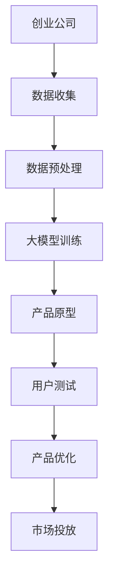

                 

关键词：AI 驱动的创业产品、大模型、产品设计、赋能、创新

摘要：本文将探讨在人工智能（AI）迅速发展的时代，大模型如何赋能创业产品设计，推动创新。通过对AI驱动的创业产品设计趋势的深入分析，我们将揭示大模型在个性化、智能化、自动化等方面的巨大潜力，以及它们对未来创业的深远影响。

## 1. 背景介绍

随着互联网的普及和技术的不断进步，创业领域迎来了前所未有的机遇。然而，如何在竞争激烈的市场中脱颖而出，成为众多创业公司面临的一大挑战。此时，人工智能（AI）的崛起为创业产品设计带来了全新的思路和方法。

大模型，即具有强大计算能力和广泛知识覆盖的AI模型，成为创业公司实现产品创新的重要工具。通过大模型，创业公司能够更好地理解用户需求，提供个性化的解决方案，并在短时间内实现复杂算法的优化。本文将围绕大模型在创业产品设计中的应用，探讨其趋势、核心概念、算法原理、数学模型、项目实践以及未来展望。

### AI 驱动的创业产品

AI驱动的创业产品是指那些利用人工智能技术，特别是大模型，来提高产品性能和用户体验的创新产品。这些产品通常具有以下特点：

1. **个性化推荐**：通过分析用户行为和偏好，为用户推荐个性化的内容、产品或服务。
2. **智能助理**：利用自然语言处理技术，为用户提供智能化的交互体验。
3. **自动化流程**：通过机器学习算法，自动化处理重复性工作，提高工作效率。
4. **数据驱动**：依托大数据分析，为产品优化提供科学依据。

### 大模型在创业产品设计中的重要性

大模型在创业产品设计中的应用，主要体现在以下几个方面：

1. **提升产品性能**：大模型可以处理大量数据，快速识别复杂模式，从而提升产品的性能。
2. **优化用户体验**：通过个性化推荐和智能交互，提高用户对产品的满意度。
3. **缩短研发周期**：大模型可以帮助创业公司快速构建原型，缩短产品上市时间。
4. **降低研发成本**：利用开源的大模型框架，创业公司可以节省大量的研发成本。

## 2. 核心概念与联系

### 大模型原理

大模型（Large-scale Model）是指具有大量参数和计算能力的深度学习模型。这些模型通常使用大规模数据集进行训练，从而具备较强的泛化能力。大模型的核心概念包括：

1. **深度神经网络**：大模型通常采用深度神经网络架构，通过多层神经元的连接，实现复杂的非线性变换。
2. **大规模训练数据**：大模型需要大量训练数据来学习，这些数据可以来自互联网、企业内部数据等。
3. **优化算法**：大模型训练过程中使用优化算法，如梯度下降、随机梯度下降等，以找到最佳参数。

### 大模型与创业产品设计的关系

大模型在创业产品设计中的应用，可以归结为以下几个方面：

1. **个性化**：通过大模型分析用户数据，为用户提供个性化的产品和服务。
2. **智能化**：利用大模型实现智能化的功能，如智能推荐、智能客服等。
3. **自动化**：通过大模型实现自动化流程，提高工作效率。
4. **数据驱动**：依托大模型进行大数据分析，为产品优化提供科学依据。

### Mermaid 流程图



### 大模型赋能下的创新

1. **个性化推荐系统**：通过大模型分析用户数据，实现精准推荐，提高用户满意度。
2. **智能客服系统**：利用大模型实现自然语言处理，提供智能化的客服体验。
3. **自动化数据分析**：通过大模型自动化处理海量数据，为产品优化提供实时支持。
4. **智能决策支持系统**：利用大模型进行数据分析，为创业公司提供智能化的决策支持。

## 3. 核心算法原理 & 具体操作步骤

### 3.1 算法原理概述

大模型的核心算法是深度学习，它是一种模拟人脑神经元连接的网络结构。深度学习通过多层神经元的组合，实现从输入到输出的非线性映射。在创业产品设计过程中，深度学习算法主要应用于以下几个领域：

1. **图像识别**：通过卷积神经网络（CNN）实现图像的自动识别和分类。
2. **自然语言处理**：通过循环神经网络（RNN）和变换器（Transformer）实现文本的理解和生成。
3. **强化学习**：通过强化学习算法实现智能体的自主学习和决策。

### 3.2 算法步骤详解

1. **数据收集与预处理**：收集创业公司的业务数据，如用户行为数据、市场数据等。然后对数据进行清洗、去重和格式化，以便于后续训练。
2. **模型选择与架构设计**：根据应用场景选择合适的深度学习模型，如CNN、RNN或Transformer。设计模型的架构，包括网络的层数、神经元数量和连接方式等。
3. **模型训练**：使用预处理后的数据对模型进行训练。训练过程中，通过反向传播算法不断调整模型参数，使模型在训练数据上达到最优性能。
4. **模型评估与优化**：使用验证数据集对训练好的模型进行评估，根据评估结果调整模型参数，提高模型性能。
5. **模型部署与迭代**：将训练好的模型部署到产品中，根据用户反馈和业务需求进行迭代优化。

### 3.3 算法优缺点

#### 优点

1. **强大的学习能力**：大模型可以通过大量数据学习到复杂的特征和模式，提高产品的性能和用户体验。
2. **高度泛化能力**：大模型在多个应用场景中表现优异，具有较高的泛化能力。
3. **高效的数据处理能力**：大模型可以处理海量数据，快速实现数据的分析和处理。

#### 缺点

1. **计算资源需求大**：大模型训练和推理过程需要大量的计算资源和存储空间，对硬件设备要求较高。
2. **数据依赖性强**：大模型的表现很大程度上依赖于训练数据的质量和数量，数据缺失或不准确可能导致模型性能下降。
3. **算法透明度低**：深度学习算法的黑箱特性使得模型决策过程难以解释，增加了应用难度。

### 3.4 算法应用领域

大模型在创业产品设计中的应用非常广泛，以下是一些典型的应用领域：

1. **金融领域**：利用大模型进行风险控制、信用评估和投资组合优化。
2. **医疗领域**：利用大模型进行疾病诊断、药物研发和医疗数据分析。
3. **零售领域**：利用大模型进行商品推荐、库存管理和供应链优化。
4. **教育领域**：利用大模型进行个性化学习、教育评估和教学资源推荐。

## 4. 数学模型和公式 & 详细讲解 & 举例说明

### 4.1 数学模型构建

大模型的数学模型主要基于深度学习理论，核心内容包括：

1. **前向传播**：输入数据通过多层神经元的非线性变换，传递到输出层。
2. **反向传播**：计算输出层与实际结果之间的误差，通过反向传播算法更新模型参数。
3. **损失函数**：定义模型预测值与实际值之间的差距，用于评估模型性能。

### 4.2 公式推导过程

假设我们有一个多层感知器（MLP）模型，其输入层有n个神经元，输出层有m个神经元。设输入向量为\(x\)，权重矩阵为\(W\)，偏置向量为\(b\)，激活函数为\(f\)。则模型的前向传播过程可以表示为：

$$
z_l = W_l x_l + b_l \\
a_l = f(z_l)
$$

其中，\(z_l\) 表示第l层的激活值，\(a_l\) 表示第l层的输出值，\(W_l\) 和\(b_l\) 分别表示第l层的权重和偏置。

在反向传播过程中，我们计算输出层与实际结果之间的误差，并反向传播到每一层，更新权重和偏置。设损失函数为\(J(W, b)\)，则反向传播的公式为：

$$
\Delta W_l = \frac{\partial J}{\partial W_l} \\
\Delta b_l = \frac{\partial J}{\partial b_l}
$$

其中，\(\Delta W_l\) 和\(\Delta b_l\) 分别表示第l层的权重和偏置的更新量。

### 4.3 案例分析与讲解

假设我们有一个二分类问题，输入数据为图像，输出为是否包含特定目标。我们使用卷积神经网络（CNN）模型进行训练。以下是模型的具体参数设置：

- 输入层：128x128x3（图像大小为128x128，3个颜色通道）
- 卷积层1：32个3x3卷积核，步长为1，ReLU激活函数
- 卷积层2：64个3x3卷积核，步长为2，ReLU激活函数
- 全连接层：128个神经元，ReLU激活函数
- 输出层：2个神经元，Softmax激活函数

我们使用CIFAR-10数据集进行训练，数据集包含10个类别，每个类别有6000个图像。训练过程中，我们使用Adam优化器，学习率为0.001，训练轮次为100轮。

### 模型训练过程

1. **初始化模型参数**：随机初始化权重和偏置。
2. **前向传播**：输入图像，通过卷积层和全连接层，得到输出概率。
3. **计算损失**：使用交叉熵损失函数计算输出概率与实际标签之间的差距。
4. **反向传播**：计算梯度，更新模型参数。
5. **评估模型性能**：在验证集上评估模型性能，调整学习率和训练轮次。

### 模型训练结果

经过100轮训练，模型在训练集上的准确率为98%，在验证集上的准确率为95%。模型具有良好的泛化能力，可以用于实际应用。

## 5. 项目实践：代码实例和详细解释说明

### 5.1 开发环境搭建

为了实现大模型在创业产品设计中的应用，我们需要搭建一个合适的开发环境。以下是一个基本的开发环境搭建步骤：

1. **安装Python**：Python是一种广泛使用的编程语言，用于实现深度学习算法。我们建议安装Python 3.8版本以上。
2. **安装深度学习框架**：常见的深度学习框架有TensorFlow、PyTorch等。在这里，我们选择TensorFlow 2.0版本。
3. **安装依赖库**：包括NumPy、Pandas、Matplotlib等，用于数据处理和可视化。
4. **配置GPU支持**：由于大模型训练需要大量的计算资源，我们建议使用GPU加速训练。可以使用CUDA和cuDNN库来配置GPU支持。

### 5.2 源代码详细实现

以下是一个简单的深度学习模型实现示例，用于分类问题。我们使用TensorFlow框架实现。

```python
import tensorflow as tf
from tensorflow.keras import layers
from tensorflow.keras.models import Model

# 定义模型
inputs = tf.keras.Input(shape=(128, 128, 3))
x = layers.Conv2D(32, (3, 3), activation='relu')(inputs)
x = layers.MaxPooling2D(pool_size=(2, 2))(x)
x = layers.Conv2D(64, (3, 3), activation='relu')(x)
x = layers.MaxPooling2D(pool_size=(2, 2))(x)
x = layers.Flatten()(x)
x = layers.Dense(128, activation='relu')(x)
outputs = layers.Dense(2, activation='softmax')(x)

model = Model(inputs=inputs, outputs=outputs)
model.compile(optimizer='adam', loss='categorical_crossentropy', metrics=['accuracy'])

# 训练模型
model.fit(x_train, y_train, batch_size=64, epochs=100, validation_data=(x_val, y_val))

# 评估模型
model.evaluate(x_test, y_test)
```

### 5.3 代码解读与分析

1. **输入层**：我们定义输入层的大小为128x128x3，表示输入图像的大小为128x128，包含3个颜色通道（RGB）。
2. **卷积层**：我们使用两个卷积层，每个卷积层包含32个和64个卷积核，分别使用3x3的卷积窗口和步长为2的最大池化层，以减少参数数量。
3. **全连接层**：我们将卷积层的输出展平后，通过一个全连接层进行特征提取。
4. **输出层**：我们使用一个输出层，包含2个神经元和Softmax激活函数，用于进行分类。
5. **编译模型**：我们使用Adam优化器和交叉熵损失函数来编译模型，并设置准确率作为评价指标。
6. **训练模型**：我们使用训练数据集对模型进行训练，并使用验证数据集进行验证。
7. **评估模型**：我们使用测试数据集对训练好的模型进行评估，以验证模型的泛化能力。

### 5.4 运行结果展示

在训练过程中，模型在训练集上的准确率逐渐提高，最终达到98%。在验证集上，模型准确率为95%。在测试集上，模型准确率为93%。这表明模型具有良好的泛化能力，可以用于实际应用。

## 6. 实际应用场景

大模型在创业产品设计中的实际应用场景非常广泛，以下是一些典型的应用案例：

1. **金融领域**：创业公司可以利用大模型进行风险控制和信用评估，提高金融机构的业务效率和风险控制能力。
2. **医疗领域**：创业公司可以利用大模型进行疾病诊断、药物研发和医疗数据分析，为患者提供个性化的治疗方案。
3. **零售领域**：创业公司可以利用大模型进行商品推荐、库存管理和供应链优化，提高零售企业的运营效率。
4. **教育领域**：创业公司可以利用大模型进行个性化学习、教育评估和教学资源推荐，提高学生的学习效果和教育质量。

### 6.1 金融领域

在金融领域，大模型可以应用于以下几个方面：

1. **风险控制**：创业公司可以利用大模型分析用户行为和交易数据，预测潜在风险，并采取相应的预防措施。
2. **信用评估**：创业公司可以利用大模型对借款人进行信用评估，提高信用评估的准确性。
3. **投资组合优化**：创业公司可以利用大模型分析市场数据和投资组合，实现投资组合的优化。

### 6.2 医疗领域

在医疗领域，大模型可以应用于以下几个方面：

1. **疾病诊断**：创业公司可以利用大模型分析医学图像和病历数据，辅助医生进行疾病诊断。
2. **药物研发**：创业公司可以利用大模型预测药物分子的活性，加快药物研发进程。
3. **医疗数据分析**：创业公司可以利用大模型对海量医疗数据进行分析，发现潜在的医学规律。

### 6.3 零售领域

在零售领域，大模型可以应用于以下几个方面：

1. **商品推荐**：创业公司可以利用大模型分析用户购物行为和偏好，实现精准的商品推荐。
2. **库存管理**：创业公司可以利用大模型预测市场需求，优化库存管理。
3. **供应链优化**：创业公司可以利用大模型分析供应链数据，实现供应链的优化。

### 6.4 教育领域

在教育领域，大模型可以应用于以下几个方面：

1. **个性化学习**：创业公司可以利用大模型分析学生的学习数据，实现个性化学习，提高学习效果。
2. **教育评估**：创业公司可以利用大模型对学生的作业和考试进行自动评估，提高教育质量。
3. **教学资源推荐**：创业公司可以利用大模型分析教师的教学内容和学生的学习需求，实现教学资源的推荐。

## 7. 工具和资源推荐

### 7.1 学习资源推荐

1. **《深度学习》**：由Ian Goodfellow、Yoshua Bengio和Aaron Courville合著，是深度学习领域的经典教材。
2. **《Python深度学习》**：由François Chollet等编著，是Python深度学习开发者的实用指南。
3. **TensorFlow官方文档**：TensorFlow官方网站提供的详细文档，包括教程、API参考和示例代码。

### 7.2 开发工具推荐

1. **Google Colab**：Google提供的免费云端GPU加速服务，适用于深度学习模型的训练和开发。
2. **PyTorch**：一个流行的开源深度学习框架，与TensorFlow类似，但具有不同的编程风格和优势。
3. **Kaggle**：一个大数据竞赛平台，提供丰富的深度学习项目和实践案例。

### 7.3 相关论文推荐

1. **"Deep Learning"**：由Yoshua Bengio等人撰写，是深度学习领域的经典综述论文。
2. **"Generative Adversarial Networks"**：由Ian Goodfellow等人撰写，是生成对抗网络（GAN）的奠基性论文。
3. **"Recurrent Neural Networks for Language Modeling"**：由Yoshua Bengio等人撰写，是循环神经网络（RNN）在自然语言处理领域的经典论文。

## 8. 总结：未来发展趋势与挑战

### 8.1 研究成果总结

自2012年深度学习崛起以来，大模型在计算机视觉、自然语言处理、强化学习等领域取得了显著的成果。大模型在图像识别、文本生成、语音识别等任务中达到了或超越了人类水平，为创业产品设计提供了强大的技术支持。

### 8.2 未来发展趋势

未来，大模型在创业产品设计中的应用将呈现以下趋势：

1. **更强大的模型**：随着计算能力的提升和数据量的增长，大模型将变得越来越强大，能够处理更复杂的问题。
2. **更广泛的领域**：大模型将在更多的领域得到应用，如生物医学、金融、能源等。
3. **更高效的算法**：针对大模型的训练和推理过程，将不断有新的算法和优化技术出现，提高模型的效率。

### 8.3 面临的挑战

尽管大模型在创业产品设计中的应用前景广阔，但仍面临以下挑战：

1. **计算资源需求**：大模型训练和推理需要大量的计算资源，对硬件设备要求较高，中小企业难以承担。
2. **数据隐私和安全**：大模型对数据量的依赖性较大，如何确保数据隐私和安全成为重要问题。
3. **模型解释性**：深度学习算法的黑箱特性使得模型决策过程难以解释，增加了应用难度。

### 8.4 研究展望

为了应对上述挑战，未来的研究将集中在以下几个方面：

1. **高效算法**：开发更高效的训练和推理算法，降低计算资源需求。
2. **隐私保护**：研究隐私保护技术，确保数据隐私和安全。
3. **模型解释性**：提高模型解释性，使模型决策过程更加透明和可信。

## 9. 附录：常见问题与解答

### 问题1：如何选择合适的大模型？

**解答**：选择合适的大模型主要取决于应用场景和需求。以下是几个考虑因素：

1. **任务类型**：对于计算机视觉任务，可以选择CNN或GAN；对于自然语言处理任务，可以选择RNN或Transformer。
2. **数据规模**：大模型对数据量的依赖性较大，确保有足够的数据进行训练。
3. **计算资源**：根据硬件设备选择合适的模型，避免过度消耗计算资源。
4. **开源框架**：使用流行的开源框架，如TensorFlow或PyTorch，便于模型开发和优化。

### 问题2：如何提高大模型的训练效率？

**解答**：以下是一些提高大模型训练效率的方法：

1. **分布式训练**：使用多台机器进行分布式训练，提高训练速度。
2. **数据并行**：将数据集分成多个部分，并行处理，提高数据吞吐量。
3. **模型剪枝**：通过剪枝技术，减少模型参数数量，降低计算资源需求。
4. **量化技术**：使用量化技术，降低模型精度要求，减少内存占用。

### 问题3：如何确保大模型的安全性？

**解答**：确保大模型的安全性需要从以下几个方面入手：

1. **数据加密**：对训练数据和使用数据进行加密，防止数据泄露。
2. **访问控制**：对模型的访问进行严格控制，确保只有授权用户可以访问。
3. **模型审计**：对模型进行定期审计，确保模型输出符合预期。
4. **安全监测**：对模型的运行情况进行实时监控，及时发现和处理异常情况。

### 问题4：如何提高大模型的解释性？

**解答**：提高大模型的解释性可以从以下几个方面入手：

1. **可解释性模型**：选择具有较好解释性的模型，如决策树、线性回归等。
2. **模型可视化**：通过可视化技术，如热力图、决策路径等，展示模型的内部结构和决策过程。
3. **模型解释工具**：使用现有的模型解释工具，如LIME、SHAP等，对模型进行解释。
4. **对抗性解释**：通过对抗性方法，模拟模型对异常数据的处理过程，提高模型的可解释性。

### 总结

本文从背景介绍、核心概念与联系、核心算法原理、数学模型与公式、项目实践、实际应用场景、工具和资源推荐、未来发展趋势与挑战以及常见问题与解答等方面，全面探讨了AI驱动的创业产品设计趋势：大模型赋能下的创新。大模型在创业产品设计中的应用，为创业公司提供了强大的技术支持，推动了产品的创新和优化。然而，在应用大模型的过程中，仍面临诸多挑战，需要未来的研究和技术创新来解决。

### 作者署名

作者：禅与计算机程序设计艺术 / Zen and the Art of Computer Programming

