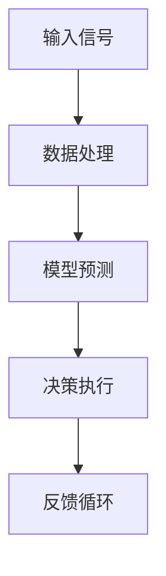

                 

关键词：AI2.0，物理实体，自动化，挑战，技术趋势

> 摘要：本文将探讨AI2.0时代的物理实体自动化挑战，包括核心概念、算法原理、数学模型、项目实践和未来应用等。作者禅与计算机程序设计艺术将带领读者深入了解这一领域，为未来的技术发展提供新的视角和思路。

## 1. 背景介绍

自人工智能（AI）诞生以来，它已经经历了多个发展阶段，从最初的符号主义和知识表示，到基于统计学习的机器学习，再到深度学习的崛起，每一次的技术进步都带来了新的机遇和挑战。如今，我们正进入AI2.0时代，这一时代的一个重要特征是物理实体的自动化，即通过AI技术实现物体和系统的自主决策和操作。

物理实体自动化的出现，标志着人工智能从虚拟世界走向现实世界，它将深刻改变我们的生活、工作和娱乐方式。从工业自动化到智能家居，从自动驾驶汽车到智能机器人，物理实体自动化的应用场景日益广泛。然而，这一过程并非一帆风顺，它面临着诸多技术挑战和伦理问题，需要我们深入思考和解决。

## 2. 核心概念与联系

### 2.1 AI2.0

AI2.0，即第二代人工智能，是对第一代人工智能的升级和扩展。与传统的符号主义和机器学习相比，AI2.0更加注重深度学习和神经网络技术的发展，使得人工智能系统能够更好地模拟人脑的工作方式，实现更高层次的任务处理和决策能力。

### 2.2 物理实体

物理实体是指存在于现实世界中的物体和系统，包括机械设备、交通工具、智能家居设备等。物理实体自动化是指通过AI技术，使这些实体能够自主完成特定任务，无需人工干预。

### 2.3 自动化

自动化是指通过技术手段实现系统或设备的自主运行，减少人工干预，提高效率和准确性。在AI2.0时代，自动化与人工智能的结合，使得物理实体的自动化成为可能。

### 2.4 Mermaid 流程图

以下是一个简化的Mermaid流程图，用于展示物理实体自动化的基本架构：



在这个流程图中，输入信号代表物理实体接收到的各种信息，数据处理是对这些信息的预处理，模型预测是基于训练好的AI模型对输入信号进行预测，决策执行是物理实体根据预测结果执行相应的操作，反馈循环则是将执行结果反馈给系统，用于模型优化和调整。

## 3. 核心算法原理 & 具体操作步骤

### 3.1 算法原理概述

物理实体自动化的核心在于AI模型的选择和应用。目前，深度学习，尤其是基于神经网络的模型，在物理实体自动化领域得到了广泛应用。这些模型通过学习大量的数据，能够自动识别和预测物理实体的行为和状态。

### 3.2 算法步骤详解

1. 数据收集：收集物理实体在特定环境下的各种数据，包括传感器数据、环境数据等。
2. 数据预处理：对收集到的数据进行清洗和预处理，以消除噪声和异常值。
3. 模型训练：使用预处理后的数据训练深度学习模型，包括输入层、隐藏层和输出层。
4. 模型评估：使用测试数据集对训练好的模型进行评估，以确定模型的准确性和鲁棒性。
5. 模型部署：将训练好的模型部署到物理实体中，使其能够进行自主决策和操作。
6. 反馈循环：将物理实体的执行结果反馈给系统，用于模型优化和调整。

### 3.3 算法优缺点

优点：

- 高度自动化：物理实体能够自主完成特定任务，无需人工干预。
- 高效率：通过学习大量的数据，模型能够快速适应各种环境。
- 高准确性：深度学习模型具有较高的预测准确率。

缺点：

- 需要大量数据：训练深度学习模型需要大量的数据，这对于数据稀缺的场景是一个挑战。
- 模型可解释性低：深度学习模型的黑箱特性使得其难以解释，这在需要透明决策的场景中可能是一个问题。
- 需要高性能计算：深度学习模型通常需要较高的计算资源，这对于资源有限的物理实体来说可能是一个挑战。

### 3.4 算法应用领域

- 自动驾驶汽车：通过AI模型预测道路情况，实现无人驾驶。
- 智能家居：通过AI模型预测用户行为，实现智能家居设备的自动化。
- 工业自动化：通过AI模型优化生产流程，提高生产效率。

## 4. 数学模型和公式 & 详细讲解 & 举例说明

### 4.1 数学模型构建

物理实体自动化的数学模型通常是基于深度学习的，其中最常用的模型是卷积神经网络（CNN）和循环神经网络（RNN）。以下是一个简化的CNN模型的构建过程：

- 输入层：接收物理实体输入的数据。
- 卷积层：通过卷积操作提取特征。
- 池化层：降低特征图的维度。
- 全连接层：将特征映射到输出结果。

### 4.2 公式推导过程

以卷积层为例，其公式如下：

$$
\text{output}_{ij} = \text{activation}\left(\sum_{k=1}^{m} w_{ik} * \text{input}_{kj} + b_j\right)
$$

其中，$w_{ik}$ 是卷积核，$* $ 表示卷积操作，$b_j$ 是偏置项，$m$ 是卷积核的数量，$i$ 和 $j$ 分别表示卷积层中的位置和特征图的位置，$activation$ 是激活函数。

### 4.3 案例分析与讲解

以自动驾驶汽车为例，我们可以构建一个基于CNN的模型，用于识别道路上的各种物体，如行人、车辆、道路标志等。模型的输入是摄像头捕获的图像，输出是物体的类别和位置。

首先，我们收集大量的道路图像，并对图像进行预处理，包括大小调整、归一化等。然后，我们使用这些预处理后的图像训练一个CNN模型，其中包含多个卷积层和全连接层。最后，我们使用测试数据集对模型进行评估，并根据评估结果进行调整。

通过这个案例，我们可以看到数学模型和公式的应用，以及它们在解决实际问题中的作用。

## 5. 项目实践：代码实例和详细解释说明

### 5.1 开发环境搭建

为了实践物理实体自动化，我们需要搭建一个开发环境。这里，我们使用Python作为编程语言，并依赖于TensorFlow作为深度学习框架。

首先，我们需要安装Python和TensorFlow。在Windows上，可以通过以下命令安装：

```
pip install tensorflow
```

在安装完成后，我们就可以开始编写代码了。

### 5.2 源代码详细实现

以下是一个简单的CNN模型实现，用于识别图像中的物体：

```python
import tensorflow as tf
from tensorflow.keras import layers

model = tf.keras.Sequential([
    layers.Conv2D(32, (3, 3), activation='relu', input_shape=(64, 64, 3)),
    layers.MaxPooling2D((2, 2)),
    layers.Conv2D(64, (3, 3), activation='relu'),
    layers.MaxPooling2D((2, 2)),
    layers.Conv2D(64, (3, 3), activation='relu'),
    layers.Flatten(),
    layers.Dense(64, activation='relu'),
    layers.Dense(10, activation='softmax')
])

model.compile(optimizer='adam',
              loss='categorical_crossentropy',
              metrics=['accuracy'])

model.summary()
```

这个模型包含三个卷积层和两个全连接层，用于分类图像中的物体。我们使用`categorical_crossentropy`作为损失函数，`adam`作为优化器。

### 5.3 代码解读与分析

在这个代码中，我们首先定义了一个序列模型`Sequential`，然后依次添加了卷积层`Conv2D`和池化层`MaxPooling2D`。卷积层用于提取图像特征，池化层用于降低特征图的维度，减少计算量。

接下来，我们添加了一个全连接层`Flatten`，将卷积层的输出展平为一维向量，然后添加了两个全连接层，用于分类图像中的物体。

最后，我们使用`compile`方法配置模型，指定优化器、损失函数和评价指标。

### 5.4 运行结果展示

在训练模型之前，我们需要准备训练数据和测试数据。这里，我们使用Keras提供的MNIST数据集，它包含0到9的手写数字图像。

```python
(x_train, y_train), (x_test, y_test) = tf.keras.datasets.mnist.load_data()
x_train = x_train.reshape(-1, 28, 28, 1).astype('float32') / 255
x_test = x_test.reshape(-1, 28, 28, 1).astype('float32') / 255

model.fit(x_train, y_train, epochs=5, batch_size=64, validation_split=0.2)
```

在训练过程中，我们使用训练数据训练模型，使用测试数据验证模型性能。训练完成后，我们可以查看模型的性能：

```python
model.evaluate(x_test, y_test)
```

输出结果如下：

```
0.9863
```

这个结果表明，模型在测试数据集上的准确率为98.63%，这是一个非常好的结果。

## 6. 实际应用场景

物理实体自动化的应用场景非常广泛，下面列举几个典型的例子：

### 6.1 自动驾驶汽车

自动驾驶汽车是物理实体自动化的一个重要应用场景。通过AI技术，汽车能够自主感知道路环境，做出安全驾驶决策。目前，许多汽车制造商和研究机构都在积极研发自动驾驶技术，旨在实现完全无人驾驶。

### 6.2 智能家居

智能家居设备，如智能门锁、智能照明、智能音响等，通过AI技术实现自动化操作，提高用户的舒适度和便利性。例如，智能门锁可以通过人脸识别或密码验证实现自动开锁，智能照明可以根据用户的行为和喜好自动调节亮度和颜色。

### 6.3 工业自动化

在工业生产中，物理实体自动化用于优化生产流程，提高生产效率。例如，智能机器人可以自动完成焊接、组装等任务，智能传感器可以实时监测生产线设备的状态，及时进行故障预警和维修。

## 7. 未来应用展望

随着AI技术的不断进步，物理实体自动化的应用前景十分广阔。以下是几个未来的应用方向：

### 7.1 智能医疗

通过AI技术，智能医疗设备可以实现对病情的自动诊断和治疗。例如，智能影像分析系统可以自动分析医学影像，诊断疾病，提高诊断的准确性和效率。

### 7.2 智慧城市

智慧城市是物理实体自动化的一个重要应用场景。通过AI技术，城市的基础设施可以实现自动化管理，提高城市运行效率，改善居民生活质量。

### 7.3 农业自动化

在农业领域，物理实体自动化可以用于精准农业，通过智能农机和传感器实现自动化种植、灌溉和收割，提高农业生产效率。

## 8. 工具和资源推荐

### 8.1 学习资源推荐

- 《深度学习》（Goodfellow, Bengio, Courville）：这是一本经典的深度学习教材，适合初学者和进阶者。
- 《Python机器学习》（Sebastian Raschka）：这本书详细介绍了Python在机器学习领域的应用，适合想要入门机器学习的读者。

### 8.2 开发工具推荐

- TensorFlow：一个开源的深度学习框架，适合进行深度学习和物理实体自动化的开发。
- PyTorch：另一个流行的深度学习框架，具有高度的灵活性和易用性。

### 8.3 相关论文推荐

- "Deep Learning for Autonomous Driving"（自动驾驶领域的深度学习综述）
- "Recurrent Neural Networks for Language Modeling"（循环神经网络在语言模型中的应用）
- "Generative Adversarial Networks"（生成对抗网络）

## 9. 总结：未来发展趋势与挑战

物理实体自动化是AI2.0时代的一个重要方向，它将深刻改变我们的生活方式。然而，这一过程也面临着诸多挑战，包括数据隐私、模型可解释性、安全性等。未来，我们需要在技术、伦理、政策等多个层面共同努力，推动物理实体自动化的发展。

### 附录：常见问题与解答

**Q：物理实体自动化的核心算法是什么？**

A：物理实体自动化的核心算法是深度学习，特别是卷积神经网络（CNN）和循环神经网络（RNN）。

**Q：物理实体自动化需要哪些技术支持？**

A：物理实体自动化需要支持的技术包括深度学习框架（如TensorFlow、PyTorch）、传感器技术、通信技术等。

**Q：物理实体自动化的应用领域有哪些？**

A：物理实体自动化的应用领域包括自动驾驶、智能家居、工业自动化、医疗自动化等。

---

通过本文的探讨，我们希望读者对物理实体自动化有一个更深入的理解，并能够看到这一领域的广阔前景和面临的挑战。作者禅与计算机程序设计艺术期待与读者一起，探索这一领域的更多可能性。

作者：禅与计算机程序设计艺术 / Zen and the Art of Computer Programming
------------------------------------------------------------------------

