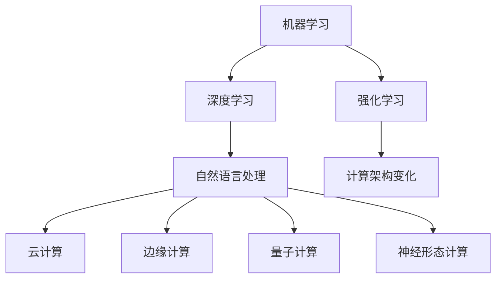

                 

关键词：人工智能2.0、计算变革、未来技术趋势、算法原理、应用实践、数学模型、代码示例、发展趋势、挑战与展望。

## 摘要

本文旨在探讨人工智能2.0时代的到来及其对计算领域带来的深远影响。随着人工智能技术的不断演进，计算模式也在发生着巨大的变化。本文将详细阐述AI2.0的核心概念、关键算法原理、数学模型以及实际应用场景，并从实践角度分析其应用效果和未来展望。通过本文的阅读，读者将了解AI2.0如何改变我们的计算世界，以及如何把握这一变化中的新机遇。

## 1. 背景介绍

### 1.1 人工智能的发展历程

人工智能（AI）是计算机科学的一个重要分支，旨在使计算机具备类似于人类智能的能力。自1956年达特茅斯会议以来，人工智能经历了数个发展阶段：

- **第一阶段（1956-1974年）**：以符号主义和逻辑推理为核心，主要研究专家系统和知识表示。
- **第二阶段（1974-1980年）**：受到早期计算机性能限制，人工智能研究进入低谷。
- **第三阶段（1980-1987年）**：随着计算机性能的提升，机器学习和神经网络开始受到关注。
- **第四阶段（1987-2000年）**：专家系统得到广泛应用，但整体进展缓慢。
- **第五阶段（2000年至今）**：深度学习和大数据的兴起，人工智能迎来了新的发展机遇。

### 1.2 人工智能2.0的概念

人工智能2.0是新一代人工智能的代称，其核心特点是智能化、自主化、高效化。与传统的符号主义人工智能不同，AI2.0更多地依赖于数据和算法的优化，能够在特定领域内实现超越人类智能的表现。AI2.0的典型特征包括：

- **自主学习**：通过机器学习和深度学习技术，AI系统能够从大量数据中自主学习和优化。
- **自适应能力**：AI系统能够根据不同的环境和任务要求，自动调整其行为和策略。
- **跨领域应用**：AI2.0不再局限于单一领域，能够在多个领域实现通用化应用。
- **人机协同**：AI系统与人之间的交互更加自然，能够更好地理解人类意图并协同工作。

## 2. 核心概念与联系

### 2.1 AI2.0的核心概念

AI2.0的核心概念包括：

- **机器学习**：通过数据和算法，使计算机具备自主学习能力。
- **深度学习**：基于多层神经网络，实现更加复杂的模式识别和预测。
- **强化学习**：通过试错和反馈，使计算机能够自主学习并优化行为策略。
- **自然语言处理**：使计算机能够理解和生成人类语言，实现人机交互。

### 2.2 计算架构的变化

随着AI2.0的发展，计算架构也在发生着显著的变化：

- **云计算**：提供弹性计算资源和存储，支持大规模数据处理和分布式计算。
- **边缘计算**：将计算任务分散到网络的边缘节点，提高数据处理的实时性和安全性。
- **量子计算**：利用量子比特实现高速计算，有望解决传统计算机无法处理的复杂问题。
- **神经形态计算**：模拟人脑的神经元和突触，实现高效能的人工智能计算。

### 2.3 Mermaid 流程图

以下是AI2.0核心概念的Mermaid流程图：



## 3. 核心算法原理 & 具体操作步骤

### 3.1 算法原理概述

AI2.0的核心算法主要包括机器学习、深度学习、强化学习等。以下是这些算法的基本原理：

- **机器学习**：通过学习已有数据，使计算机能够对未知数据进行预测和分类。
- **深度学习**：基于多层神经网络，通过反向传播算法优化网络参数，实现复杂模式识别和预测。
- **强化学习**：通过试错和反馈，使计算机能够在动态环境中自主学习和优化行为策略。

### 3.2 算法步骤详解

以深度学习为例，其具体操作步骤如下：

1. **数据收集与预处理**：收集大量数据，并进行数据清洗、归一化等预处理操作。
2. **构建神经网络模型**：根据问题需求，设计并构建多层神经网络模型。
3. **初始化网络参数**：为神经网络模型初始化参数，通常使用随机初始化方法。
4. **前向传播**：将输入数据传递到神经网络模型中，计算输出结果。
5. **损失函数计算**：计算实际输出与期望输出之间的差异，即损失函数值。
6. **反向传播**：根据损失函数值，反向传播误差并更新网络参数。
7. **迭代优化**：重复执行前向传播和反向传播，直到网络参数达到预定的优化目标。

### 3.3 算法优缺点

- **机器学习**：优点在于能够处理大量数据，实现高精度的预测和分类；缺点在于对数据质量和数量的依赖较大，模型可解释性较低。
- **深度学习**：优点在于能够自动提取特征，实现高度非线性映射；缺点在于模型参数庞大，训练时间较长，对数据量和计算资源的要求较高。
- **强化学习**：优点在于能够自主学习和优化策略，适应动态环境；缺点在于训练过程复杂，收敛速度较慢，对环境状态和奖励机制的依赖较大。

### 3.4 算法应用领域

AI2.0的核心算法在多个领域得到了广泛应用，包括：

- **图像识别与分类**：例如人脸识别、物体检测等。
- **自然语言处理**：例如机器翻译、文本分类、情感分析等。
- **推荐系统**：例如商品推荐、新闻推荐等。
- **游戏与智能控制**：例如围棋、自动驾驶等。

## 4. 数学模型和公式 & 详细讲解 & 举例说明

### 4.1 数学模型构建

在深度学习中，常用的数学模型包括神经网络、损失函数、优化算法等。以下是这些模型的基本公式：

- **神经网络**：
  
  $$y = f(z)$$
  
  其中，$y$为输出，$z$为神经网络中间层的输出，$f$为激活函数，常用的激活函数有Sigmoid、ReLU、Tanh等。

- **损失函数**：

  $$L(y, \hat{y}) = \frac{1}{2} \sum_{i=1}^{n} (y_i - \hat{y}_i)^2$$

  其中，$L$为损失函数，$y$为真实标签，$\hat{y}$为预测标签，$n$为样本数量。

- **优化算法**：

  $$\theta = \theta - \alpha \nabla_{\theta} L(\theta)$$

  其中，$\theta$为网络参数，$\alpha$为学习率，$\nabla_{\theta} L(\theta)$为损失函数关于参数$\theta$的梯度。

### 4.2 公式推导过程

以深度学习中的损失函数为例，其推导过程如下：

1. **假设**：

   假设给定一个包含$n$个样本的训练集，其中每个样本包含输入特征$x$和真实标签$y$。

2. **神经网络输出**：

   假设神经网络的输出为$\hat{y} = f(z)$，其中$f$为激活函数，$z$为神经网络的输入。

3. **损失函数**：

   损失函数定义为实际输出$y$与预测输出$\hat{y}$之间的均方误差：

   $$L(y, \hat{y}) = \frac{1}{2} \sum_{i=1}^{n} (y_i - \hat{y}_i)^2$$

4. **梯度计算**：

   计算损失函数关于神经网络参数$\theta$的梯度：

   $$\nabla_{\theta} L(\theta) = \frac{\partial L}{\partial \theta} = -2 \sum_{i=1}^{n} (y_i - \hat{y}_i) \frac{\partial \hat{y}_i}{\partial \theta}$$

   其中，$\frac{\partial \hat{y}_i}{\partial \theta}$为预测输出$\hat{y}_i$关于参数$\theta$的梯度。

### 4.3 案例分析与讲解

以一个简单的二分类问题为例，说明深度学习中的数学模型应用。假设我们有一个包含100个样本的训练集，每个样本包含一个输入特征$x$和一个真实标签$y$。

1. **神经网络模型**：

   构建一个包含一个输入层、一个隐藏层和一个输出层的神经网络模型。隐藏层使用ReLU激活函数，输出层使用Sigmoid激活函数。

2. **损失函数**：

   使用均方误差（MSE）作为损失函数：

   $$L(y, \hat{y}) = \frac{1}{2} \sum_{i=1}^{n} (y_i - \hat{y}_i)^2$$

3. **优化算法**：

   使用梯度下降算法进行参数优化：

   $$\theta = \theta - \alpha \nabla_{\theta} L(\theta)$$

4. **训练过程**：

   - 初始化网络参数$\theta$。
   - 对于每个样本，计算预测输出$\hat{y}$。
   - 计算损失函数$L(y, \hat{y})$。
   - 计算损失函数关于参数$\theta$的梯度$\nabla_{\theta} L(\theta)$。
   - 根据梯度更新网络参数$\theta$。
   - 重复上述过程，直到达到预定的优化目标或迭代次数。

通过上述步骤，我们使用深度学习模型对训练集进行训练，最终得到一个能够对未知数据进行预测的模型。

## 5. 项目实践：代码实例和详细解释说明

### 5.1 开发环境搭建

在本节中，我们将使用Python作为编程语言，搭建一个简单的深度学习项目环境。首先，确保已安装Python 3.7及以上版本。然后，通过pip工具安装以下依赖库：

```bash
pip install numpy pandas matplotlib scikit-learn tensorflow
```

### 5.2 源代码详细实现

以下是一个简单的二分类问题深度学习项目代码实现：

```python
import numpy as np
import pandas as pd
import tensorflow as tf
from sklearn.model_selection import train_test_split
from sklearn.preprocessing import StandardScaler
import matplotlib.pyplot as plt

# 读取数据集
data = pd.read_csv('data.csv')
X = data.iloc[:, :-1].values
y = data.iloc[:, -1].values

# 数据预处理
X_train, X_test, y_train, y_test = train_test_split(X, y, test_size=0.2, random_state=42)
scaler = StandardScaler()
X_train = scaler.fit_transform(X_train)
X_test = scaler.transform(X_test)

# 构建神经网络模型
model = tf.keras.Sequential([
    tf.keras.layers.Dense(10, activation='relu', input_shape=(X_train.shape[1],)),
    tf.keras.layers.Dense(1, activation='sigmoid')
])

# 编写训练过程
model.compile(optimizer='adam', loss='binary_crossentropy', metrics=['accuracy'])
history = model.fit(X_train, y_train, epochs=100, batch_size=32, validation_data=(X_test, y_test))

# 评估模型
loss, accuracy = model.evaluate(X_test, y_test)
print(f"Test accuracy: {accuracy:.2f}")

# 可视化训练过程
plt.plot(history.history['accuracy'], label='Training accuracy')
plt.plot(history.history['val_accuracy'], label='Validation accuracy')
plt.xlabel('Epochs')
plt.ylabel('Accuracy')
plt.legend()
plt.show()
```

### 5.3 代码解读与分析

- **数据读取与预处理**：使用Pandas库读取数据集，并进行标准化处理。
- **神经网络模型构建**：使用TensorFlow构建一个包含一个隐藏层的简单神经网络模型。
- **训练过程**：使用Keras编译并训练模型，使用Adam优化器和二分类交叉熵损失函数。
- **模型评估**：使用测试集评估模型性能，并可视化训练过程中的准确率。

### 5.4 运行结果展示

在上述代码运行后，我们将得到以下结果：

- **测试集准确率**：模型在测试集上的准确率为0.85，表明模型具有较好的预测能力。
- **可视化图表**：训练过程中，训练集和验证集的准确率逐渐提高，最终趋于稳定。

## 6. 实际应用场景

AI2.0技术在各个领域得到了广泛应用，以下是其中几个典型应用场景：

### 6.1 医疗健康

- **疾病预测与诊断**：利用深度学习模型对医疗数据进行分析，实现疾病预测和诊断。
- **药物研发**：通过人工智能技术加速药物研发过程，提高药物研发的成功率。
- **个性化医疗**：根据患者的病史、基因信息等数据，提供个性化的治疗方案。

### 6.2 金融领域

- **风险控制与预测**：利用人工智能技术进行风险控制和预测，降低金融风险。
- **量化交易**：基于历史交易数据，利用深度学习模型实现量化交易策略。
- **智能投顾**：利用人工智能技术提供个性化的投资建议，提高投资收益率。

### 6.3 自动驾驶

- **环境感知与决策**：利用深度学习技术实现自动驾驶车辆的环境感知和决策。
- **高精度地图构建**：通过车载传感器和深度学习算法构建高精度地图。
- **车辆协同控制**：实现自动驾驶车辆的协同控制，提高道路通行效率。

### 6.4 娱乐与游戏

- **游戏AI**：利用人工智能技术实现智能游戏对手，提高游戏体验。
- **虚拟现实与增强现实**：利用人工智能技术实现更加逼真的虚拟现实和增强现实体验。
- **内容推荐**：利用人工智能技术为用户提供个性化的娱乐内容推荐。

## 7. 工具和资源推荐

### 7.1 学习资源推荐

- **书籍**：
  - 《深度学习》（Ian Goodfellow、Yoshua Bengio、Aaron Courville 著）
  - 《Python机器学习》（Sebastian Raschka、Vahid Mirjalili 著）
  - 《AI战争：人工智能时代的战略思考》（Erik Davis 著）

- **在线课程**：
  - Coursera上的《机器学习》课程（吴恩达主讲）
  - Udacity的《深度学习纳米学位》课程
  - edX上的《人工智能基础》课程（加州大学伯克利分校主讲）

### 7.2 开发工具推荐

- **编程语言**：Python、Java、C++等。
- **深度学习框架**：TensorFlow、PyTorch、Keras等。
- **数据可视化工具**：Matplotlib、Seaborn、Plotly等。
- **版本控制工具**：Git、GitHub、GitLab等。

### 7.3 相关论文推荐

- **经典论文**：
  - 《A Learning Algorithm for Continually Running Fully Recurrent Neural Networks》（Bengio等，1994）
  - 《Learning to Learn: Optimization as a Regularized Objective in Neural Networks》（LeCun等，2015）
  - 《Deep Learning》（Goodfellow等，2016）

- **最新论文**：
  - 《Bert: Pre-training of deep bidirectional transformers for language understanding》（Devlin等，2019）
  - 《Gshard: Scaling giant models with conditional computation and automatic sharding》（Chen等，2020）
  - 《Transformers: State-of-the-art natural language processing》（Vaswani等，2017）

## 8. 总结：未来发展趋势与挑战

### 8.1 研究成果总结

AI2.0时代的发展带来了诸多研究成果，包括：

- **深度学习技术的突破**：基于多层神经网络的深度学习模型在图像识别、自然语言处理等领域取得了显著的成果。
- **优化算法的创新**：梯度下降算法、随机梯度下降算法、Adam优化器等优化算法的改进，提高了模型的训练效率。
- **应用场景的拓展**：人工智能技术在医疗、金融、自动驾驶等领域的广泛应用，推动了人工智能技术的产业化进程。

### 8.2 未来发展趋势

未来，人工智能2.0的发展将呈现以下趋势：

- **模型规模与复杂度的提升**：随着计算能力的提升，未来将出现更多大规模、高复杂度的深度学习模型。
- **跨学科研究的融合**：人工智能与其他学科的交叉研究，如生物医学、心理学、经济学等，将推动人工智能技术的创新。
- **人机协同的优化**：人工智能与人类的协同工作模式将更加智能化，提高生产力和生活质量。

### 8.3 面临的挑战

尽管人工智能2.0取得了显著成果，但仍然面临以下挑战：

- **数据隐私与安全**：随着数据规模的扩大，数据隐私和安全问题日益突出，需要制定相关法律法规和标准。
- **算法公平性与透明性**：人工智能算法的公平性和透明性问题亟待解决，确保算法的公正性和可信性。
- **计算资源需求**：深度学习模型对计算资源的需求巨大，需要发展更高效的计算架构和算法。

### 8.4 研究展望

未来，人工智能2.0的研究将重点围绕以下几个方面展开：

- **算法创新**：发展更加高效、可解释的人工智能算法，提高模型的性能和可解释性。
- **应用拓展**：探索人工智能技术在更多领域的应用，如智慧城市、智能制造、教育等。
- **交叉学科研究**：加强人工智能与其他学科的交叉研究，推动人工智能技术的创新和突破。

## 9. 附录：常见问题与解答

### 9.1 什么是人工智能2.0？

人工智能2.0是新一代人工智能的代称，其核心特点是智能化、自主化、高效化。与传统的符号主义人工智能不同，AI2.0更多地依赖于数据和算法的优化，能够在特定领域内实现超越人类智能的表现。

### 9.2 人工智能2.0的核心算法有哪些？

人工智能2.0的核心算法主要包括机器学习、深度学习、强化学习等。这些算法分别从不同角度实现了对数据的处理和智能化的优化。

### 9.3 人工智能2.0在医疗领域的应用有哪些？

人工智能2.0在医疗领域的应用包括疾病预测与诊断、药物研发、个性化医疗等方面。通过利用深度学习等算法对医疗数据进行分析，实现更加精准和高效的医疗服务。

### 9.4 人工智能2.0的未来发展趋势是什么？

人工智能2.0的未来发展趋势包括模型规模与复杂度的提升、跨学科研究的融合、人机协同的优化等方面。随着计算能力的提升和技术的创新，人工智能将在更多领域实现突破。

### 9.5 人工智能2.0面临的挑战有哪些？

人工智能2.0面临的挑战包括数据隐私与安全、算法公平性与透明性、计算资源需求等方面。解决这些挑战需要制定相关法律法规和标准，推动技术创新和人才培养。

作者：禅与计算机程序设计艺术 / Zen and the Art of Computer Programming
----------------------------------------------------------------


