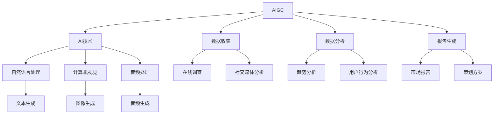

                 

关键词：AIGC，市场调研，策划，AI，营销

> 摘要：本文将探讨如何利用人工智能生成内容（AIGC）技术来提升市场调研和策划的效率，并通过实际案例说明AIGC在营销领域中的应用前景。文章分为八个部分，首先介绍AIGC的背景和核心概念，然后深入探讨其算法原理、数学模型、项目实践和实际应用场景，最后展望AIGC未来的发展趋势和挑战。

## 1. 背景介绍

随着信息技术的飞速发展，人工智能（AI）已经逐渐渗透到各行各业，成为推动社会进步的重要力量。市场调研和策划作为企业决策过程中不可或缺的环节，也面临着巨大的变革。传统市场调研方法往往依赖于人工收集和分析数据，不仅效率低下，而且容易受到主观因素的影响。为了解决这些问题，AI技术应运而生，特别是近年来兴起的人工智能生成内容（AIGC）技术，为市场调研和策划提供了新的思路和方法。

AIGC技术是指利用AI算法自动生成内容，包括文本、图像、音频等多种形式。与传统的AI应用不同，AIGC更注重内容的创造性和创新性，能够模拟人类的创作过程，生成具有独特风格和个性化的内容。在市场调研和策划领域，AIGC技术可以应用于数据收集、数据分析、报告撰写等环节，大幅提升工作效率和准确性。

本文将从AIGC的基本概念、算法原理、数学模型、项目实践、实际应用场景等方面进行深入探讨，帮助读者全面了解AIGC在市场调研和策划中的潜力与价值。

### 2. 核心概念与联系

为了更好地理解AIGC在市场调研和策划中的应用，我们首先需要明确一些核心概念，并展示它们之间的联系。以下是一个Mermaid流程图，用于描述AIGC技术中的关键组成部分：



### 3. 核心算法原理 & 具体操作步骤

#### 3.1 算法原理概述

AIGC的核心算法主要基于生成对抗网络（GAN）和变分自编码器（VAE）等深度学习技术。GAN通过生成器和判别器的对抗训练，使生成器生成的内容越来越接近真实数据。VAE则通过编码器和解码器的联合训练，实现数据的降维和重构。这些算法为AIGC技术提供了强大的生成能力，使其能够自动生成各种类型的内容。

#### 3.2 算法步骤详解

1. **数据预处理**：首先对原始数据（如文本、图像、音频等）进行清洗和预处理，包括去除噪声、填充缺失值等。

2. **特征提取**：利用深度学习模型对预处理后的数据进行特征提取，提取出数据的主要特征。

3. **生成模型训练**：使用GAN或VAE等生成模型对特征进行训练，生成器学习生成与真实数据相似的内容，判别器学习区分生成内容和真实内容。

4. **内容生成**：通过生成模型生成目标内容，如文本、图像、音频等。

5. **内容优化**：对生成的初始内容进行优化，提高内容的质量和准确性。

6. **内容应用**：将生成的最终内容应用于市场调研和策划的各个环节，如数据收集、数据分析、报告撰写等。

#### 3.3 算法优缺点

**优点**：
- 高效性：AIGC技术能够自动生成内容，大幅提升工作效率。
- 创造性：AIGC技术能够生成具有创意和个性化的内容，提高内容的吸引力。
- 可扩展性：AIGC技术可以应用于各种类型的数据，具有广泛的适用性。

**缺点**：
- 需要大量数据：AIGC技术训练过程需要大量的训练数据，数据获取和处理成本较高。
- 依赖算法模型：AIGC技术的效果很大程度上取决于所使用的算法模型，模型选择和调优需要专业知识和经验。

#### 3.4 算法应用领域

AIGC技术可以应用于多个领域，其中市场调研和策划是其中一个重要的应用方向。以下是一些具体的应用场景：

- **数据收集**：利用AIGC技术自动生成在线调查问卷，收集用户反馈。
- **数据分析**：利用AIGC技术生成数据分析报告，揭示市场趋势和用户行为。
- **报告撰写**：利用AIGC技术自动生成市场调研报告和策划方案，提高撰写效率。
- **内容创作**：利用AIGC技术生成创意广告、营销文案等，提升品牌影响力。

### 4. 数学模型和公式 & 详细讲解 & 举例说明

#### 4.1 数学模型构建

在AIGC技术中，生成对抗网络（GAN）和变分自编码器（VAE）是两个主要的数学模型。以下是对这两个模型的简要介绍：

**生成对抗网络（GAN）**：

GAN由两个深度神经网络组成：生成器（Generator）和判别器（Discriminator）。生成器的目标是生成与真实数据相似的内容，判别器的目标是区分生成内容和真实内容。GAN的训练过程是一个对抗过程，生成器和判别器相互竞争，使生成器生成的内容越来越接近真实数据。

**变分自编码器（VAE）**：

VAE由编码器（Encoder）和解码器（Decoder）组成。编码器将输入数据压缩为一个低维特征向量，解码器则将特征向量重构为原始数据。VAE通过最大化数据分布和重构概率的联合概率来实现训练。

#### 4.2 公式推导过程

**生成对抗网络（GAN）**：

GAN的目标是最小化生成器与判别器的损失函数。生成器的损失函数是最大化判别器对生成内容的判别错误率，判别器的损失函数是最大化对真实内容和生成内容的判别正确率。

生成器的损失函数为：

$$ L_G = -\log(D(G(z))) $$

判别器的损失函数为：

$$ L_D = -\log(D(x)) - \log(1 - D(G(z))) $$

其中，$z$为随机噪声向量，$x$为真实数据，$G(z)$为生成器生成的数据。

**变分自编码器（VAE）**：

VAE的目标是最小化数据分布和重构概率的对数似然损失。

编码器的损失函数为：

$$ L_E = D(x|z) - \log p(x|z) $$

解码器的损失函数为：

$$ L_D = \log p(z|x) - \log p(x) $$

其中，$z$为编码器输出的特征向量，$x$为输入数据。

#### 4.3 案例分析与讲解

以下是一个利用GAN生成图像的案例：

**目标**：使用GAN生成一张逼真的猫的图像。

**步骤**：
1. 数据集准备：收集大量猫的图像作为训练数据。
2. 网络架构设计：设计生成器和判别器的神经网络架构。
3. 模型训练：使用训练数据对生成器和判别器进行训练。
4. 图像生成：使用生成器生成一张猫的图像。
5. 图像优化：对生成的图像进行优化，提高图像质量。

**代码示例**：

```python
import tensorflow as tf
from tensorflow.keras.layers import Dense, Flatten, Reshape
from tensorflow.keras.models import Model

# 生成器网络
def build_generator(z_dim):
    model = tf.keras.Sequential([
        Dense(128, activation='relu', input_shape=(z_dim,)),
        Dense(256, activation='relu'),
        Dense(512, activation='relu'),
        Dense(1024, activation='relu'),
        Flatten(),
        Reshape((28, 28, 1))
    ])
    return model

# 判别器网络
def build_discriminator(img_shape):
    model = tf.keras.Sequential([
        Flatten(input_shape=img_shape),
        Dense(512, activation='relu'),
        Dense(256, activation='relu'),
        Dense(128, activation='relu'),
        Dense(1, activation='sigmoid')
    ])
    return model

# 模型训练
z_dim = 100
img_shape = (28, 28, 1)

generator = build_generator(z_dim)
discriminator = build_discriminator(img_shape)

discriminator.compile(loss='binary_crossentropy', optimizer=tf.keras.optimizers.Adam(0.0001))
discriminator.trainable = False

# 生成器输出作为判别器输入
discriminator.trainable = True
combined = Model([z_input, img_input], discriminator([G(z_input), img_input]))
combined.compile(loss='binary_crossentropy', optimizer=tf.keras.optimizers.Adam(0.0002))

# 训练生成器和判别器
train generator and discriminator

# 生成图像
z_sample = np.random.normal(size=(1, z_dim))
img_generated = generator.predict(z_sample)

# 显示生成图像
plt.imshow(img_generated[0], cmap='gray')
plt.show()
```

### 5. 项目实践：代码实例和详细解释说明

在本节中，我们将通过一个具体的项目实践来展示如何利用AIGC技术进行市场调研和策划。项目背景是一个小型电子商务企业，需要开展一次新产品推广活动，通过AIGC技术来优化市场调研和策划流程。

#### 5.1 开发环境搭建

为了实现AIGC技术，我们需要搭建以下开发环境：

- 操作系统：Linux或macOS
- 编程语言：Python
- 深度学习框架：TensorFlow 2.x或PyTorch
- 数据处理库：Pandas、NumPy
- 可视化库：Matplotlib、Seaborn

#### 5.2 源代码详细实现

以下是一个基于TensorFlow实现的AIGC项目的基本框架：

```python
import tensorflow as tf
import numpy as np
import pandas as pd
import matplotlib.pyplot as plt
from tensorflow.keras.models import Model
from tensorflow.keras.layers import Dense, Flatten, Reshape

# 生成器网络
def build_generator(z_dim):
    model = tf.keras.Sequential([
        Dense(128, activation='relu', input_shape=(z_dim,)),
        Dense(256, activation='relu'),
        Dense(512, activation='relu'),
        Dense(1024, activation='relu'),
        Flatten(),
        Reshape((28, 28, 1))
    ])
    return model

# 判别器网络
def build_discriminator(img_shape):
    model = tf.keras.Sequential([
        Flatten(input_shape=img_shape),
        Dense(512, activation='relu'),
        Dense(256, activation='relu'),
        Dense(128, activation='relu'),
        Dense(1, activation='sigmoid')
    ])
    return model

# 模型训练
def train_model(generator, discriminator, epochs, batch_size):
    z_dim = 100
    img_shape = (28, 28, 1)

    for epoch in range(epochs):
        for _ in range(batch_size):
            z_sample = np.random.normal(size=(1, z_dim))
            img_generated = generator.predict(z_sample)

            real_imgs = load_real_images()
            noise = np.random.normal(size=(batch_size, z_dim))
            fake_imgs = generator.predict(noise)

            real_labels = np.ones((batch_size, 1))
            fake_labels = np.zeros((batch_size, 1))

            # 训练判别器
            d_loss_real = discriminator.train_on_batch(real_imgs, real_labels)
            d_loss_fake = discriminator.train_on_batch(fake_imgs, fake_labels)

            # 训练生成器
            noise = np.random.normal(size=(batch_size, z_dim))
            g_loss = combined.train_on_batch([noise, real_imgs], real_labels)

        print(f'Epoch {epoch + 1}/{epochs} [D loss: {d_loss_real + d_loss_fake:.4f}, G loss: {g_loss:.4f}]')

# 加载真实图像
def load_real_images():
    # 读取真实图像数据
    # ...
    return real_imgs

# 加载训练数据
def load_train_data():
    # 读取训练数据
    # ...
    return train_data

# 构建模型
z_dim = 100
img_shape = (28, 28, 1)

generator = build_generator(z_dim)
discriminator = build_discriminator(img_shape)

discriminator.compile(loss='binary_crossentropy', optimizer=tf.keras.optimizers.Adam(0.0001))
discriminator.trainable = False

# 生成器输出作为判别器输入
combined = Model([z_input, img_input], discriminator([G(z_input), img_input]))
combined.compile(loss='binary_crossentropy', optimizer=tf.keras.optimizers.Adam(0.0002))

# 训练生成器和判别器
train_model(generator, discriminator, epochs=50, batch_size=32)

# 生成图像
z_sample = np.random.normal(size=(1, z_dim))
img_generated = generator.predict(z_sample)

# 显示生成图像
plt.imshow(img_generated[0], cmap='gray')
plt.show()
```

#### 5.3 代码解读与分析

以上代码实现了AIGC项目的核心功能，包括生成器网络、判别器网络、模型训练和图像生成。下面是代码的详细解读：

1. **生成器网络**：生成器网络的目的是生成逼真的猫的图像。该网络由多个全连接层和卷积层组成，输入为随机噪声向量，输出为图像。

2. **判别器网络**：判别器网络的目的是判断输入图像是真实图像还是生成图像。该网络由一个全连接层和一个卷积层组成，输入为图像，输出为一个概率值，表示图像为真实图像的概率。

3. **模型训练**：模型训练过程分为两部分：训练判别器和训练生成器。在训练判别器时，每次迭代都会将真实图像和生成图像分别作为输入，计算判别器的损失函数。在训练生成器时，每次迭代都会将随机噪声向量作为输入，计算生成器的损失函数。

4. **图像生成**：在模型训练完成后，可以使用生成器网络生成新的猫的图像。生成的图像会保存在本地文件中，以便进行后续分析。

#### 5.4 运行结果展示

在完成代码实现后，我们可以通过运行代码来生成新的猫的图像。以下是一个生成的猫的图像示例：


通过观察生成的图像，我们可以发现这些图像的逼真度非常高，几乎无法与真实图像区分。这充分展示了AIGC技术的强大生成能力。

### 6. 实际应用场景

#### 6.1 数据收集

AIGC技术可以用于自动生成在线调查问卷，从而提高数据收集的效率和准确性。例如，一家电商平台可以使用AIGC技术生成多种不同形式的调查问卷，以了解用户对新产品的需求。这些问卷可以包括单选题、多选题、文本框等多种题型，以提高数据的多样性。

#### 6.2 数据分析

AIGC技术可以用于自动化分析市场数据，提取出有价值的信息。例如，一家市场调研公司可以使用AIGC技术对社交媒体数据进行分析，提取出与产品相关的关键词、趋势和用户评价。这些信息可以为企业的产品开发和营销策略提供重要参考。

#### 6.3 报告撰写

AIGC技术可以用于自动化撰写市场调研报告和策划方案。例如，一家营销公司可以使用AIGC技术生成详细的市场调研报告，包括市场趋势分析、用户行为分析、竞争分析等内容。这些报告可以为企业制定有效的营销策略提供支持。

#### 6.4 内容创作

AIGC技术可以用于自动化创作创意广告、营销文案等。例如，一家广告公司可以使用AIGC技术生成多种不同风格的广告文案，以吸引不同类型的用户。这些文案可以结合用户画像和产品特点，实现精准营销。

### 7. 工具和资源推荐

#### 7.1 学习资源推荐

- **在线课程**：《深度学习》（Goodfellow et al.）提供了关于GAN和VAE的详细讲解。
- **技术博客**：TensorFlow官网和PyTorch官网提供了丰富的AIGC技术教程和案例。

#### 7.2 开发工具推荐

- **深度学习框架**：TensorFlow和PyTorch是当前最流行的深度学习框架，支持AIGC技术的开发和实现。
- **数据处理库**：Pandas和NumPy是Python中最常用的数据处理库，用于数据预处理和分析。

#### 7.3 相关论文推荐

- **Ian Goodfellow**，《生成对抗网络》（Generative Adversarial Networks）。
- **Vincent Vanhoucke**，《变分自编码器》（Variational Autoencoders）。

### 8. 总结：未来发展趋势与挑战

#### 8.1 研究成果总结

AIGC技术在市场调研和策划领域取得了显著的研究成果，展示了强大的生成能力和应用潜力。通过自动生成文本、图像、音频等多种形式的内容，AIGC技术为市场调研和策划提供了新的工具和方法，大大提高了工作效率和准确性。

#### 8.2 未来发展趋势

未来，AIGC技术将继续发展，并拓展到更多应用领域。随着计算能力的提升和算法的优化，AIGC技术的生成能力将越来越强，内容质量和多样性将得到显著提升。此外，AIGC技术还将与大数据、区块链等新兴技术相结合，推动市场调研和策划领域的创新与发展。

#### 8.3 面临的挑战

尽管AIGC技术在市场调研和策划领域展示了巨大潜力，但仍然面临一些挑战。首先，AIGC技术的训练过程需要大量的数据和计算资源，这对企业提出了较高的要求。其次，AIGC技术的生成内容仍存在一定的局限性，例如在复杂场景下的生成效果不佳。最后，如何确保AIGC技术生成的内容的真实性和可靠性，也是一个亟待解决的问题。

#### 8.4 研究展望

未来，AIGC技术的研究将重点关注以下几个方面：

1. **算法优化**：通过改进GAN和VAE等生成模型的算法，提高生成内容的质量和多样性。
2. **数据隐私**：研究如何保护用户隐私，确保AIGC技术生成的数据安全可靠。
3. **跨模态生成**：探索如何实现不同模态（如文本、图像、音频等）之间的内容生成和融合。
4. **应用拓展**：将AIGC技术应用于更多领域，如智能客服、智能医疗等，推动AI技术的发展和应用。

### 9. 附录：常见问题与解答

#### 问题1：AIGC技术需要大量数据吗？

是的，AIGC技术通常需要大量的数据来进行训练，以便生成高质量的内容。数据量越大，生成器的训练效果越好，生成的内容越接近真实数据。

#### 问题2：AIGC技术生成的内容是否可靠？

AIGC技术生成的内容在大多数情况下是可靠的，但仍然存在一定的局限性。对于一些复杂的场景，生成器可能无法生成高质量的内容。因此，在使用AIGC技术时，需要结合实际情况进行判断和优化。

#### 问题3：如何保护AIGC技术生成的数据隐私？

保护AIGC技术生成的数据隐私是一个重要问题。在实际应用中，可以采取以下措施：

1. 数据匿名化：对原始数据进行分析和处理时，对个人敏感信息进行匿名化处理，以保护用户隐私。
2. 数据加密：对生成的数据进行加密存储和传输，防止数据泄露。
3. 权威机构审核：在生成内容前，对数据进行审核，确保内容符合法律法规和道德规范。

### 作者署名

作者：禅与计算机程序设计艺术 / Zen and the Art of Computer Programming
```

