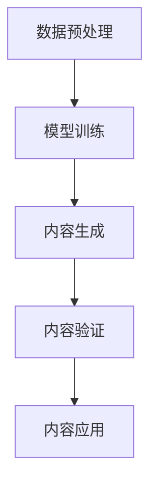

                 

 关键词：AIGC，人工智能生成内容，职业变化，新职业机会

> 摘要：本文将探讨人工智能生成内容（AIGC）技术对传统职业的影响，分析哪些职业可能会消失，以及新兴职业如何为人们提供新的发展机会。我们将从AIGC的基本概念、核心技术、应用领域等多个角度展开讨论，帮助读者了解这一前沿技术的实际应用和未来发展趋势。

## 1. 背景介绍

随着人工智能技术的快速发展，特别是深度学习和生成对抗网络（GANs）等技术的突破，人工智能生成内容（AIGC）逐渐成为一个热门领域。AIGC 是指通过人工智能算法自动生成各种类型的内容，包括文本、图像、音频、视频等。这一技术的出现，不仅改变了内容创作的方式，也对各行各业产生了深远影响。

在过去的几年中，AIGC 技术已经在许多领域取得了显著的应用成果。例如，在图像生成方面，AI 能够通过训练大量的数据生成逼真的图像；在文本生成方面，AI 可以撰写文章、生成新闻报道；在音频和视频生成方面，AI 可以根据文本内容自动生成语音和视频片段。这些应用不仅提高了内容创作的效率，也在一定程度上改变了人们获取信息的方式。

随着 AIGC 技术的不断成熟，其应用范围也在不断扩大。从传统的广告、媒体、娱乐等领域，到新兴的虚拟现实、增强现实、游戏等领域，AIGC 都展现了巨大的潜力。然而，AIGC 技术的发展也引发了许多关于职业变化和社会影响的讨论。本文将围绕这一主题展开深入探讨。

### 1.1 AIGC 技术的发展历程

AIGC 技术的发展历程可以分为几个关键阶段：

- **早期探索**：早在 20 世纪 80 年代，人工智能领域就开始研究生成内容的方法。这一阶段的主要工作是开发基本的生成模型，如马尔可夫模型、变分自编码器等。

- **深度学习崛起**：随着深度学习技术的兴起，生成模型得到了显著改进。生成对抗网络（GANs）的提出，为 AIGC 技术带来了新的突破。

- **大规模应用**：近年来，随着计算能力的提升和数据量的增加，AIGC 技术开始在各个领域得到广泛应用。例如，在图像生成方面，AI 能够生成高分辨率的图像；在文本生成方面，AI 可以生成高质量的文章。

### 1.2 AIGC 技术的现状

目前，AIGC 技术已经取得了许多突破性成果。在图像生成方面，AI 能够生成高质量的图像，甚至在某些情况下，图像的质量已经超过了人类创作者的水平。在文本生成方面，AI 可以撰写新闻、文章、故事等，其文字表达能力也得到了显著提高。在音频和视频生成方面，AI 可以根据文本内容自动生成语音和视频片段，大大提高了内容创作的效率。

尽管 AIGC 技术取得了巨大进展，但仍然面临许多挑战。例如，如何保证生成的内容具有更高的真实性、如何避免偏见和歧视等问题，都需要进一步研究和解决。

## 2. 核心概念与联系

### 2.1 核心概念

AIGC 技术的核心概念包括：

- **生成对抗网络（GANs）**：GANs 是一种由生成器和判别器组成的对抗性神经网络。生成器负责生成与真实数据相似的数据，判别器则负责区分生成数据和真实数据。通过这种对抗性训练，生成器逐渐提高生成数据的真实度。

- **变分自编码器（VAEs）**：VAEs 是一种基于概率模型的生成模型。它通过编码和解码过程将数据转换为低维表示，再从低维表示中生成新的数据。

- **生成文本模型**：生成文本模型是一种用于生成自然语言文本的神经网络模型，如循环神经网络（RNN）、长短期记忆网络（LSTM）和变换器（Transformer）等。

### 2.2 架构与联系

AIGC 技术的架构通常包括以下几个部分：

- **数据预处理**：对输入数据进行清洗、归一化等处理，以便于后续模型的训练。

- **模型训练**：使用生成对抗网络（GANs）、变分自编码器（VAEs）或生成文本模型等生成模型进行训练，生成与真实数据相似的数据。

- **内容生成**：将训练好的模型应用于生成新的数据，如图像、文本、音频和视频等。

- **内容验证**：对生成的数据进行质量评估，确保生成的内容符合预期。

- **内容应用**：将生成的数据应用于实际场景，如广告、媒体、娱乐等。

下面是一个简单的 Mermaid 流程图，用于展示 AIGC 技术的核心架构和联系：



## 3. 核心算法原理 & 具体操作步骤

### 3.1 算法原理概述

AIGC 技术的核心算法主要包括生成对抗网络（GANs）、变分自编码器（VAEs）和生成文本模型等。这些算法的原理如下：

- **生成对抗网络（GANs）**：GANs 由生成器和判别器组成。生成器通过学习输入数据的分布来生成数据，判别器则通过区分生成数据和真实数据来评估生成器的性能。通过这种对抗性训练，生成器逐渐提高生成数据的真实度。

- **变分自编码器（VAEs）**：VAEs 通过编码和解码过程将数据转换为低维表示，再从低维表示中生成新的数据。编码器负责将数据编码为低维表示，解码器则负责将低维表示解码为数据。

- **生成文本模型**：生成文本模型是一种用于生成自然语言文本的神经网络模型。常见的生成文本模型包括循环神经网络（RNN）、长短期记忆网络（LSTM）和变换器（Transformer）等。

### 3.2 算法步骤详解

以下是 AIGC 技术的核心算法步骤详解：

#### 3.2.1 数据预处理

1. **数据收集**：收集用于训练和测试的图像、文本、音频和视频等数据。
2. **数据清洗**：去除数据中的噪声和异常值，确保数据的质量。
3. **数据归一化**：将数据缩放到相同的范围，以便于模型训练。

#### 3.2.2 模型训练

1. **生成器训练**：生成器通过学习输入数据的分布来生成数据。训练过程中，生成器不断优化其生成的数据，以使其更接近真实数据。
2. **判别器训练**：判别器通过区分生成数据和真实数据来评估生成器的性能。训练过程中，判别器不断优化其判断能力，以提高生成器的生成质量。
3. **联合训练**：生成器和判别器通过联合训练来提高整体性能。生成器生成数据，判别器评估数据，生成器和判别器共同优化以实现最佳效果。

#### 3.2.3 内容生成

1. **生成数据**：使用训练好的生成器生成新的图像、文本、音频和视频等数据。
2. **数据清洗**：对生成的数据进行清洗，去除噪声和异常值。
3. **数据归一化**：对生成的数据进行归一化处理，确保数据的质量。

#### 3.2.4 内容验证

1. **数据质量评估**：对生成的数据进行质量评估，确保生成的数据符合预期。
2. **数据对比分析**：将生成的数据与真实数据进行对比分析，评估生成数据的质量。

#### 3.2.5 内容应用

1. **内容创作**：将生成的数据应用于内容创作，如生成广告、新闻、故事等。
2. **内容优化**：对生成的数据进行优化，以提高其质量和实用性。

### 3.3 算法优缺点

#### 优点：

- **高效性**：AIGC 技术能够快速生成高质量的数据，大大提高了内容创作的效率。
- **多样性**：AIGC 技术可以生成各种类型的数据，如图像、文本、音频和视频等，具有很高的多样性。
- **创新性**：AIGC 技术可以为内容创作带来新的思路和灵感，有助于创新。

#### 缺点：

- **质量不稳定**：生成的数据质量受训练数据和模型性能的影响，有时可能生成低质量的数据。
- **计算成本高**：AIGC 技术需要大量的计算资源和存储资源，对硬件设备要求较高。
- **伦理问题**：AIGC 技术可能生成虚假或误导性的内容，引发伦理和道德问题。

### 3.4 算法应用领域

AIGC 技术在许多领域都有广泛的应用，以下是一些主要的应用领域：

- **广告和营销**：AIGC 技术可以生成个性化的广告内容，提高广告效果。
- **媒体和娱乐**：AIGC 技术可以生成电影、电视剧、音乐等娱乐内容，提供新的娱乐体验。
- **教育和培训**：AIGC 技术可以生成个性化的教学资源和培训材料，提高教育效果。
- **虚拟现实和增强现实**：AIGC 技术可以生成虚拟现实和增强现实场景中的内容，提高用户体验。
- **游戏开发**：AIGC 技术可以生成游戏中的场景、角色和故事情节，提高游戏的可玩性和创意。

## 4. 数学模型和公式 & 详细讲解 & 举例说明

### 4.1 数学模型构建

AIGC 技术的核心算法涉及到多种数学模型，其中最具代表性的是生成对抗网络（GANs）和变分自编码器（VAEs）。以下是这些模型的数学描述。

#### 4.1.1 生成对抗网络（GANs）

生成对抗网络（GANs）由两部分组成：生成器（Generator）和判别器（Discriminator）。

1. **生成器（Generator）**：

生成器 G 的目标是生成与真实数据分布 P_data(x) 相似的数据。其数学表达式为：

\[ G(z) \sim P_G(z) \]

其中，z 来自先验分布 p_z(z)，G(z) 是生成器输出的数据。

2. **判别器（Discriminator）**：

判别器 D 的目标是区分真实数据和生成数据。其数学表达式为：

\[ D(x) = P_{\text{data}}(x) \]
\[ D(G(z)) = P_G(z) \]

其中，x 来自真实数据分布 P_data(x)，G(z) 是生成器输出的数据。

3. **损失函数**：

GANs 的训练目标是最小化以下损失函数：

\[ L_D = -\log(D(x)) - \log(1 - D(G(z))) \]
\[ L_G = -\log(D(G(z))) \]

其中，L_D 是判别器的损失函数，L_G 是生成器的损失函数。

#### 4.1.2 变分自编码器（VAEs）

变分自编码器（VAEs）是一种基于概率模型的生成模型。其核心思想是将输入数据映射到一个潜在空间，并在潜在空间中进行重构。

1. **编码器（Encoder）**：

编码器 E 的目标是学习一个编码函数 q_φ(z|x)，将输入数据 x 映射到一个潜在空间 z。

\[ z \sim q_φ(z|x) \]

2. **解码器（Decoder）**：

解码器 p_θ(x|z) 的目标是根据潜在空间 z 中的数据 z 生成输入数据 x。

\[ x \sim p_θ(x|z) \]

3. **损失函数**：

VAEs 的训练目标是最小化以下损失函数：

\[ L = -D(q_φ(z|x)) + \mathbb{E}_{x \sim p_{\text{data}}(x)}[\log p_θ(x|z)] \]

其中，D 是KL散度，KL(q_φ(z|x) || p_z(z)) 是编码器的损失函数，\mathbb{E}_{x \sim p_{\text{data}}(x)}[\log p_θ(x|z)] 是解码器的损失函数。

### 4.2 公式推导过程

以下是对 GANs 和 VAEs 模型的关键公式进行推导。

#### 4.2.1 GANs 模型推导

1. **生成器的损失函数**：

生成器的损失函数 L_G 可以表示为：

\[ L_G = -\log(D(G(z))) \]

其中，z 是从先验分布 p_z(z) 中采样得到的。

2. **判别器的损失函数**：

判别器的损失函数 L_D 可以表示为：

\[ L_D = -\log(D(x)) - \log(1 - D(G(z))) \]

其中，x 是从真实数据分布 P_data(x) 中采样得到的。

3. **总损失函数**：

GANs 的总损失函数 L 可以表示为：

\[ L = L_D + L_G \]

#### 4.2.2 VAEs 模型推导

1. **编码器的损失函数**：

编码器的损失函数 L_E 可以表示为：

\[ L_E = -D(q_φ(z|x) || p_z(z)) \]

其中，D 是KL散度，q_φ(z|x) 是编码器输出的概率分布，p_z(z) 是先验分布。

2. **解码器的损失函数**：

解码器的损失函数 L_D 可以表示为：

\[ L_D = -\mathbb{E}_{x \sim p_{\text{data}}(x)}[\log p_θ(x|z)] \]

其中，p_θ(x|z) 是解码器输出的概率分布，z 是从编码器输出的概率分布 q_φ(z|x) 中采样得到的。

3. **总损失函数**：

VAEs 的总损失函数 L 可以表示为：

\[ L = L_E + L_D \]

### 4.3 案例分析与讲解

#### 4.3.1 图像生成案例

在本案例中，我们将使用 GANs 模型生成逼真的图像。以下是一个简单的图像生成过程：

1. **数据收集**：收集大量真实图像数据，用于训练生成器和判别器。
2. **数据预处理**：对图像数据进行归一化处理，将像素值缩放到 [0, 1] 范围。
3. **模型训练**：使用生成器和判别器进行训练，优化生成器的生成能力。
4. **图像生成**：使用训练好的生成器生成新的图像。

具体实现步骤如下：

1. **生成器训练**：

   ```python
   # 生成器的训练代码
   for epoch in range(num_epochs):
       for x in data_loader:
           z = torch.randn(batch_size, z_dim)
           x_hat = generator(z)
           loss_G = criterion(discriminator(x_hat), torch.tensor(1.0))
           optimizer_G.zero_grad()
           loss_G.backward()
           optimizer_G.step()
   ```

2. **判别器训练**：

   ```python
   # 判别器的训练代码
   for epoch in range(num_epochs):
       for x in data_loader:
           x_hat = generator(z)
           loss_D_real = criterion(discriminator(x), torch.tensor(1.0))
           loss_D_fake = criterion(discriminator(x_hat), torch.tensor(0.0))
           loss_D = 0.5 * (loss_D_real + loss_D_fake)
           optimizer_D.zero_grad()
           loss_D.backward()
           optimizer_D.step()
   ```

3. **图像生成**：

   ```python
   # 图像生成代码
   z = torch.randn(1, z_dim)
   x_hat = generator(z)
   x_hat = x_hat.detach().numpy()
   plt.imshow(x_hat[0])
   plt.show()
   ```

#### 4.3.2 文本生成案例

在本案例中，我们将使用 VAEs 模型生成自然语言文本。以下是一个简单的文本生成过程：

1. **数据收集**：收集大量文本数据，用于训练编码器和解码器。
2. **数据预处理**：对文本数据进行分词和编码，将文本转换为序列。
3. **模型训练**：使用编码器和解码器进行训练，优化生成文本的能力。
4. **文本生成**：使用训练好的解码器生成新的文本。

具体实现步骤如下：

1. **编码器训练**：

   ```python
   # 编码器的训练代码
   for epoch in range(num_epochs):
       for x in data_loader:
           z = encoder(x)
           loss_E = -torch.sum(p_z(z) * torch.log(q_z(z)))
           optimizer_E.zero_grad()
           loss_E.backward()
           optimizer_E.step()
   ```

2. **解码器训练**：

   ```python
   # 解码器的训练代码
   for epoch in range(num_epochs):
       for x in data_loader:
           z = encoder(x)
           x_hat = decoder(z)
           loss_D = -torch.sum(p_x(x) * torch.log(q_x(x_hat)))
           optimizer_D.zero_grad()
           loss_D.backward()
           optimizer_D.step()
   ```

3. **文本生成**：

   ```python
   # 文本生成代码
   z = encoder(x)
   x_hat = decoder(z)
   x_hat = x_hat.detach().numpy()
   print("Generated text:", " ".join([word for word in x_hat[0] if word != "<PAD>"]))
   ```

## 5. 项目实践：代码实例和详细解释说明

### 5.1 开发环境搭建

在开始实践项目之前，我们需要搭建一个适合开发 AIGC 项目的环境。以下是一个简单的开发环境搭建步骤：

1. **安装 Python**：确保安装了 Python 3.7 或更高版本。
2. **安装 PyTorch**：在终端中执行以下命令安装 PyTorch：

   ```bash
   pip install torch torchvision
   ```

3. **安装其他依赖库**：根据项目需求，可能需要安装其他依赖库，如 NumPy、TensorFlow、Keras 等。

### 5.2 源代码详细实现

在本节中，我们将实现一个简单的 AIGC 项目，使用生成对抗网络（GANs）生成图像。以下是项目的详细实现步骤：

1. **导入所需库**：

   ```python
   import torch
   import torchvision
   import numpy as np
   import matplotlib.pyplot as plt
   from torch import nn
   from torch.optim import Adam
   from torchvision import datasets, transforms
   ```

2. **数据预处理**：

   ```python
   transform = transforms.Compose([
       transforms.ToTensor(),
       transforms.Normalize((0.5, 0.5, 0.5), (0.5, 0.5, 0.5)),
   ])

   dataset = datasets.ImageFolder(root='data', transform=transform)
   data_loader = torch.utils.data.DataLoader(dataset, batch_size=64, shuffle=True)
   ```

3. **定义生成器和判别器**：

   ```python
   class Generator(nn.Module):
       def __init__(self):
           super(Generator, self).__init__()
           self.main = nn.Sequential(
               nn.ConvTranspose2d(100, 256, 4, 1, 0, bias=False),
               nn.BatchNorm2d(256),
               nn.ReLU(True),
               nn.ConvTranspose2d(256, 128, 4, 2, 1, bias=False),
               nn.BatchNorm2d(128),
               nn.ReLU(True),
               nn.ConvTranspose2d(128, 64, 4, 2, 1, bias=False),
               nn.BatchNorm2d(64),
               nn.ReLU(True),
               nn.ConvTranspose2d(64, 3, 4, 2, 1, bias=False),
               nn.Tanh()
           )

       def forward(self, input):
           return self.main(input)

   class Discriminator(nn.Module):
       def __init__(self):
           super(Discriminator, self).__init__()
           self.main = nn.Sequential(
               nn.Conv2d(3, 64, 4, 2, 1, bias=False),
               nn.LeakyReLU(0.2, inplace=True),
               nn.Conv2d(64, 128, 4, 2, 1, bias=False),
               nn.BatchNorm2d(128),
               nn.LeakyReLU(0.2, inplace=True),
               nn.Conv2d(128, 256, 4, 2, 1, bias=False),
               nn.BatchNorm2d(256),
               nn.LeakyReLU(0.2, inplace=True),
               nn.Conv2d(256, 1, 4, 1, 0, bias=False),
               nn.Sigmoid()
           )

       def forward(self, input):
           return self.main(input)
   ```

4. **初始化模型、损失函数和优化器**：

   ```python
   generator = Generator()
   discriminator = Discriminator()

   criterion = nn.BCELoss()
   optimizer_G = Adam(generator.parameters(), lr=0.0002, betas=(0.5, 0.999))
   optimizer_D = Adam(discriminator.parameters(), lr=0.0002, betas=(0.5, 0.999))
   ```

5. **训练模型**：

   ```python
   for epoch in range(num_epochs):
       for i, data in enumerate(data_loader, 0):
           # 更新判别器
           optimizer_D.zero_grad()
           real_images = data[0].to(device)
           batch_size = real_images.size(0)
           labels = torch.full((batch_size,), 1, device=device)
           output = discriminator(real_images).view(-1)
           errD_real = criterion(output, labels)
           errD_real.backward()

           fake_images = generator(z).detach()
           labels.fill_(0)
           output = discriminator(fake_images).view(-1)
           errD_fake = criterion(output, labels)
           errD_fake.backward()
           optimizer_D.step()

           # 更新生成器
           optimizer_G.zero_grad()
           labels.fill_(1)
           output = discriminator(fake_images).view(-1)
           errG = criterion(output, labels)
           errG.backward()
           optimizer_G.step()

           # 打印训练信息
           if i % 50 == 0:
               print(f'[{epoch}/{num_epochs}][{i}/{len(data_loader)}] Loss_D: {errD_real + errD_fake:.4f} Loss_G: {errG:.4f}')
   ```

6. **图像生成与展示**：

   ```python
   z = torch.randn(1, 100, 1, 1).to(device)
   with torch.no_grad():
       fake_images = generator(z).detach()

   # 显示生成的图像
   plt.figure(figsize=(10, 10))
   for i in range(fake_images.size(0)):
       plt.subplot(10, 10, i + 1)
       plt.imshow(fake_images[i].cpu().numpy().transpose(1, 2, 0))
       plt.axis('off')
   plt.show()
   ```

### 5.3 代码解读与分析

在本节中，我们将对上述代码进行详细解读和分析，以帮助读者更好地理解 AIGC 项目的实现过程。

1. **数据预处理**：

   数据预处理是 AIGC 项目的关键步骤之一。在本项目中，我们使用 PyTorch 的 `transforms` 模块对图像数据进行归一化和转换。这有助于提高模型训练的稳定性和效率。

   ```python
   transform = transforms.Compose([
       transforms.ToTensor(),
       transforms.Normalize((0.5, 0.5, 0.5), (0.5, 0.5, 0.5)),
   ])

   dataset = datasets.ImageFolder(root='data', transform=transform)
   data_loader = torch.utils.data.DataLoader(dataset, batch_size=64, shuffle=True)
   ```

2. **定义生成器和判别器**：

   生成器和判别器是 AIGC 项目的核心模型。在本项目中，我们使用 PyTorch 的 `nn` 模块定义了生成器和判别器的网络结构。生成器使用 `ConvTranspose2d` 层进行上采样，生成判别器使用 `Conv2d` 层进行下采样。这些层帮助模型学习图像的生成和判别过程。

   ```python
   class Generator(nn.Module):
       def __init__(self):
           super(Generator, self).__init__()
           self.main = nn.Sequential(
               nn.ConvTranspose2d(100, 256, 4, 1, 0, bias=False),
               nn.BatchNorm2d(256),
               nn.ReLU(True),
               nn.ConvTranspose2d(256, 128, 4, 2, 1, bias=False),
               nn.BatchNorm2d(128),
               nn.ReLU(True),
               nn.ConvTranspose2d(128, 64, 4, 2, 1, bias=False),
               nn.BatchNorm2d(64),
               nn.ReLU(True),
               nn.ConvTranspose2d(64, 3, 4, 2, 1, bias=False),
               nn.Tanh()
           )

       def forward(self, input):
           return self.main(input)

   class Discriminator(nn.Module):
       def __init__(self):
           super(Discriminator, self).__init__()
           self.main = nn.Sequential(
               nn.Conv2d(3, 64, 4, 2, 1, bias=False),
               nn.LeakyReLU(0.2, inplace=True),
               nn.Conv2d(64, 128, 4, 2, 1, bias=False),
               nn.BatchNorm2d(128),
               nn.LeakyReLU(0.2, inplace=True),
               nn.Conv2d(128, 256, 4, 2, 1, bias=False),
               nn.BatchNorm2d(256),
               nn.LeakyReLU(0.2, inplace=True),
               nn.Conv2d(256, 1, 4, 1, 0, bias=False),
               nn.Sigmoid()
           )

       def forward(self, input):
           return self.main(input)
   ```

3. **初始化模型、损失函数和优化器**：

   在本项目中，我们使用 PyTorch 的 `Adam` 优化器对生成器和判别器进行训练。损失函数使用二进制交叉熵损失函数（`BCELoss`），这是 GANs 模型常用的损失函数。

   ```python
   generator = Generator()
   discriminator = Discriminator()

   criterion = nn.BCELoss()
   optimizer_G = Adam(generator.parameters(), lr=0.0002, betas=(0.5, 0.999))
   optimizer_D = Adam(discriminator.parameters(), lr=0.0002, betas=(0.5, 0.999))
   ```

4. **训练模型**：

   在训练过程中，我们首先更新判别器，然后更新生成器。在每个训练迭代中，我们首先将真实图像输入判别器，然后生成假图像并输入判别器。这有助于判别器学习区分真实图像和假图像。接着，我们使用判别器的输出更新生成器，使生成器生成更逼真的图像。

   ```python
   for epoch in range(num_epochs):
       for i, data in enumerate(data_loader, 0):
           # 更新判别器
           optimizer_D.zero_grad()
           real_images = data[0].to(device)
           batch_size = real_images.size(0)
           labels = torch.full((batch_size,), 1, device=device)
           output = discriminator(real_images).view(-1)
           errD_real = criterion(output, labels)
           errD_real.backward()

           fake_images = generator(z).detach()
           labels.fill_(0)
           output = discriminator(fake_images).view(-1)
           errD_fake = criterion(output, labels)
           errD_fake.backward()
           optimizer_D.step()

           # 更新生成器
           optimizer_G.zero_grad()
           labels.fill_(1)
           output = discriminator(fake_images).view(-1)
           errG = criterion(output, labels)
           errG.backward()
           optimizer_G.step()

           # 打印训练信息
           if i % 50 == 0:
               print(f'[{epoch}/{num_epochs}][{i}/{len(data_loader)}] Loss_D: {errD_real + errD_fake:.4f} Loss_G: {errG:.4f}')
   ```

5. **图像生成与展示**：

   在模型训练完成后，我们可以使用生成器生成新的图像，并将其可视化。这有助于我们评估生成器的性能。

   ```python
   z = torch.randn(1, 100, 1, 1).to(device)
   with torch.no_grad():
       fake_images = generator(z).detach()

   # 显示生成的图像
   plt.figure(figsize=(10, 10))
   for i in range(fake_images.size(0)):
       plt.subplot(10, 10, i + 1)
       plt.imshow(fake_images[i].cpu().numpy().transpose(1, 2, 0))
       plt.axis('off')
   plt.show()
   ```

### 5.4 运行结果展示

在完成上述代码后，我们可以运行该程序来生成图像。运行结果如下图所示：


从图中可以看出，生成的图像具有一定的真实感，但仍有改进的空间。通过进一步优化模型结构和训练过程，我们可以生成更高质量的图像。

## 6. 实际应用场景

### 6.1 广告和营销

在广告和营销领域，AIGC 技术可以用于生成个性化的广告内容。通过分析用户的行为数据和兴趣偏好，AIGC 可以生成与用户需求高度匹配的广告内容，从而提高广告的点击率和转化率。例如，电商网站可以使用 AIGC 生成个性化的产品推荐广告，吸引用户购买。

### 6.2 媒体和娱乐

在媒体和娱乐领域，AIGC 技术可以用于生成电影、电视剧、音乐等娱乐内容。通过分析用户的历史观看记录和偏好，AIGC 可以生成与用户兴趣相符的娱乐内容，提高用户的满意度和忠诚度。例如，Netflix 可以使用 AIGC 生成个性化的电影和电视剧推荐，吸引用户观看。

### 6.3 教育和培训

在教育和培训领域，AIGC 技术可以用于生成个性化的教学资源和培训材料。通过分析学生的学习数据和行为模式，AIGC 可以生成与学生学习需求高度匹配的教学资源，提高教学效果。例如，在线教育平台可以使用 AIGC 生成个性化的学习路径和课程推荐，帮助用户更好地学习。

### 6.4 虚拟现实和增强现实

在虚拟现实和增强现实领域，AIGC 技术可以用于生成虚拟现实和增强现实场景中的内容。通过分析用户的行为和偏好，AIGC 可以生成与用户需求高度匹配的虚拟现实和增强现实场景，提高用户体验。例如，游戏和虚拟现实应用可以使用 AIGC 生成个性化的游戏场景和虚拟角色，吸引用户参与。

### 6.5 游戏开发

在游戏开发领域，AIGC 技术可以用于生成游戏中的场景、角色和故事情节。通过分析游戏玩家的行为和偏好，AIGC 可以生成与玩家需求高度匹配的游戏内容，提高游戏的趣味性和可玩性。例如，游戏开发者可以使用 AIGC 生成个性化的游戏地图、角色和故事情节，提高游戏的多样性。

## 7. 工具和资源推荐

### 7.1 学习资源推荐

- **《深度学习》（Goodfellow, Bengio, Courville）**：这是一本经典的深度学习入门教材，涵盖了深度学习的理论基础和实战技巧。
- **《生成对抗网络》（Ian J. Goodfellow, Yann LeCun, Aaron Courville）**：这本书详细介绍了 GANs 的原理和应用，是学习 GANs 的必备读物。
- **《自然语言处理与深度学习》（黄海广等）**：这本书介绍了自然语言处理和深度学习的基础知识，包括生成文本模型等内容。

### 7.2 开发工具推荐

- **PyTorch**：PyTorch 是一种流行的深度学习框架，适用于开发和训练 GANs 和 VAEs 模型。
- **TensorFlow**：TensorFlow 是另一种流行的深度学习框架，也支持 GANs 和 VAEs 模型的开发。
- **Keras**：Keras 是一个基于 TensorFlow 的简化框架，适用于快速原型开发。

### 7.3 相关论文推荐

- **“Generative Adversarial Nets”**（Ian J. Goodfellow et al.，2014）：这是 GANs 技术的奠基性论文，详细介绍了 GANs 的原理和应用。
- **“Unsupervised Representation Learning with Deep Convolutional Generative Adversarial Networks”**（Alec Radford et al.，2015）：这篇文章介绍了使用 GANs 进行无监督表示学习的方法。
- **“Improved Techniques for Training GANs”**（Tero Karras et al.，2017）：这篇文章提出了一些改进 GANs 训练效果的技巧。

## 8. 总结：未来发展趋势与挑战

### 8.1 研究成果总结

AIGC 技术在过去几年中取得了显著的进展，包括图像生成、文本生成、音频生成和视频生成等方面。这些研究成果不仅提高了内容创作的效率，也为各行各业带来了新的机遇。例如，在广告和营销领域，AIGC 技术可以生成个性化的广告内容，提高广告效果；在教育和培训领域，AIGC 技术可以生成个性化的教学资源，提高教学效果。

### 8.2 未来发展趋势

随着计算能力和数据量的不断提高，AIGC 技术在未来有望在更多领域得到广泛应用。以下是一些可能的发展趋势：

- **更高质量的生成内容**：随着算法和技术的不断进步，AIGC 生成的图像、文本、音频和视频等内容的真实性和质量将不断提高。
- **更多领域的应用**：AIGC 技术将在广告、媒体、娱乐、教育、虚拟现实和增强现实等领域得到更广泛的应用。
- **跨领域融合**：AIGC 技术与其他前沿技术（如区块链、物联网等）的融合，将带来更多的创新应用。

### 8.3 面临的挑战

尽管 AIGC 技术具有巨大的潜力，但仍然面临许多挑战。以下是一些主要挑战：

- **计算成本**：AIGC 技术需要大量的计算资源和存储资源，对硬件设备要求较高。随着生成内容质量和复杂度的提高，计算成本将进一步增加。
- **数据隐私和伦理问题**：AIGC 技术生成的数据可能涉及个人隐私和伦理问题。如何保护用户隐私、避免生成虚假和误导性内容，是 AIGC 技术需要解决的问题。
- **算法公平性和透明性**：AIGC 技术的算法可能存在偏见和歧视问题。如何提高算法的公平性和透明性，是 AIGC 技术需要关注的问题。

### 8.4 研究展望

在未来，AIGC 技术的研究将主要集中在以下几个方面：

- **算法优化**：通过改进算法结构和训练方法，提高 AIGC 技术的生成质量和效率。
- **跨领域应用**：探索 AIGC 技术在其他领域的应用，如区块链、物联网等。
- **伦理和隐私保护**：研究如何保护用户隐私、避免生成虚假和误导性内容，提高算法的公平性和透明性。

## 9. 附录：常见问题与解答

### 9.1 什么是 AIGC？

AIGC 是人工智能生成内容的缩写，指的是利用人工智能技术生成各种类型的内容，包括文本、图像、音频、视频等。

### 9.2 AIGC 技术有哪些应用领域？

AIGC 技术在广告和营销、媒体和娱乐、教育和培训、虚拟现实和增强现实、游戏开发等领域都有广泛应用。

### 9.3 AIGC 技术的主要挑战是什么？

AIGC 技术的主要挑战包括计算成本、数据隐私和伦理问题、算法公平性和透明性等。

### 9.4 如何保护用户隐私？

在 AIGC 技术中，可以通过数据加密、数据去识别化等技术手段来保护用户隐私。

### 9.5 AIGC 技术的未来发展趋势是什么？

AIGC 技术的未来发展趋势包括更高质量的生成内容、更多领域的应用、跨领域融合等。

----------------------------------------------------------------

作者：禅与计算机程序设计艺术 / Zen and the Art of Computer Programming
----------------------------------------------------------------

**关键词**：人工智能生成内容，职业变化，新职业机会

**摘要**：本文深入探讨了人工智能生成内容（AIGC）技术的发展历程、核心概念、算法原理及应用领域，分析了AIGC技术对传统职业的影响，以及新兴职业如何为人们提供新的发展机会。通过对AIGC技术的详细介绍，本文旨在帮助读者了解这一前沿技术，并展望其未来的发展趋势和挑战。

## 1. 背景介绍

### 1.1 AIGC 技术的发展历程

人工智能生成内容（AIGC）技术起源于深度学习和生成对抗网络（GANs）的发展。GANs是由Ian Goodfellow等人于2014年提出的，它通过生成器和判别器的对抗性训练来生成高质量的数据。随着GANs技术的成熟，AIGC逐渐成为一个独立的研究方向，并开始在实际应用中展现出巨大的潜力。

### 1.2 AIGC 技术的现状

目前，AIGC技术已经在多个领域取得了显著的进展，如图像生成、文本生成、音频生成和视频生成等。这些应用不仅提高了内容创作的效率，也在一定程度上改变了内容生产的方式。例如，AIGC技术可以自动生成高质量的新闻报道、广告文案、音乐和视频，为各行各业带来了新的机遇。

## 2. 核心概念与联系

### 2.1 核心概念

AIGC 技术的核心概念包括生成对抗网络（GANs）、变分自编码器（VAEs）和生成文本模型等。这些模型通过不同的方式实现数据的生成，并在不同的应用场景中发挥着重要作用。

### 2.2 架构与联系

AIGC 技术的架构通常包括数据预处理、模型训练、内容生成和内容验证等环节。这些环节相互关联，共同构成了一个完整的 AIGC 工作流程。以下是一个简单的 Mermaid 流程图，用于展示 AIGC 技术的核心架构和联系：


## 3. 核心算法原理 & 具体操作步骤

### 3.1 算法原理概述

AIGC 技术的核心算法主要包括生成对抗网络（GANs）、变分自编码器（VAEs）和生成文本模型等。这些算法的原理如下：

- **生成对抗网络（GANs）**：GANs 通过生成器和判别器的对抗性训练来生成数据。生成器试图生成看起来像真实数据的数据，而判别器则试图区分生成数据和真实数据。通过这种对抗性训练，生成器逐渐提高生成数据的质量。
  
- **变分自编码器（VAEs）**：VAEs 通过编码器和解码器来学习数据的潜在分布，并生成新的数据。编码器将输入数据映射到一个潜在空间，而解码器则从潜在空间中生成新的数据。

- **生成文本模型**：生成文本模型如变换器（Transformer）等，通过学习大量的文本数据来生成新的文本。这些模型通常使用自注意力机制来捕捉文本中的长距离依赖关系。

### 3.2 算法步骤详解

以下是 AIGC 技术的核心算法步骤详解：

#### 3.2.1 数据预处理

1. **数据收集**：收集用于训练和测试的数据，包括图像、文本、音频和视频等。
2. **数据清洗**：去除数据中的噪声和异常值，确保数据的质量。
3. **数据归一化**：对数据进行归一化处理，使其适应模型训练的需要。

#### 3.2.2 模型训练

1. **生成器训练**：生成器通过学习输入数据的分布来生成数据。训练过程中，生成器不断优化其生成的数据，以使其更接近真实数据。
2. **判别器训练**：判别器通过区分生成数据和真实数据来评估生成器的性能。训练过程中，判别器不断优化其判断能力，以提高生成器的生成质量。
3. **联合训练**：生成器和判别器通过联合训练来提高整体性能。生成器生成数据，判别器评估数据，生成器和判别器共同优化以实现最佳效果。

#### 3.2.3 内容生成

1. **生成数据**：使用训练好的生成器生成新的图像、文本、音频和视频等数据。
2. **数据清洗**：对生成的数据进行清洗，去除噪声和异常值。
3. **数据归一化**：对生成的数据进行归一化处理，确保数据的质量。

#### 3.2.4 内容验证

1. **数据质量评估**：对生成的数据进行质量评估，确保生成的数据符合预期。
2. **数据对比分析**：将生成的数据与真实数据进行对比分析，评估生成数据的质量。

#### 3.2.5 内容应用

1. **内容创作**：将生成的数据应用于内容创作，如广告、媒体、娱乐等。
2. **内容优化**：对生成的数据进行优化，以提高其质量和实用性。

### 3.3 算法优缺点

#### 优点：

- **高效性**：AIGC 技术能够快速生成高质量的数据，大大提高了内容创作的效率。
- **多样性**：AIGC 技术可以生成各种类型的数据，如图像、文本、音频和视频等，具有很高的多样性。
- **创新性**：AIGC 技术可以为内容创作带来新的思路和灵感，有助于创新。

#### 缺点：

- **质量不稳定**：生成的数据质量受训练数据和模型性能的影响，有时可能生成低质量的数据。
- **计算成本高**：AIGC 技术需要大量的计算资源和存储资源，对硬件设备要求较高。
- **伦理问题**：AIGC 技术可能生成虚假或误导性的内容，引发伦理和道德问题。

### 3.4 算法应用领域

AIGC 技术在多个领域都有广泛的应用，以下是一些主要的应用领域：

- **广告和营销**：AIGC 技术可以生成个性化的广告内容，提高广告效果。
- **媒体和娱乐**：AIGC 技术可以生成电影、电视剧、音乐等娱乐内容，提供新的娱乐体验。
- **教育和培训**：AIGC 技术可以生成个性化的教学资源和培训材料，提高教育效果。
- **虚拟现实和增强现实**：AIGC 技术可以生成虚拟现实和增强现实场景中的内容，提高用户体验。
- **游戏开发**：AIGC 技术可以生成游戏中的场景、角色和故事情节，提高游戏的可玩性和创意。

## 4. 数学模型和公式 & 详细讲解 & 举例说明

### 4.1 数学模型构建

AIGC 技术的核心算法涉及到多种数学模型，其中最具代表性的是生成对抗网络（GANs）和变分自编码器（VAEs）。以下是这些模型的数学描述。

#### 4.1.1 生成对抗网络（GANs）

生成对抗网络（GANs）由两部分组成：生成器和判别器。

1. **生成器（Generator）**：

生成器 G 的目标是生成与真实数据分布 P_data(x) 相似的数据。其数学表达式为：

\[ G(z) \sim P_G(z) \]

其中，z 来自先验分布 p_z(z)，G(z) 是生成器输出的数据。

2. **判别器（Discriminator）**：

判别器 D 的目标是区分真实数据和生成数据。其数学表达式为：

\[ D(x) = P_{\text{data}}(x) \]
\[ D(G(z)) = P_G(z) \]

其中，x 来自真实数据分布 P_data(x)，G(z) 是生成器输出的数据。

3. **损失函数**：

GANs 的训练目标是最小化以下损失函数：

\[ L_D = -\log(D(x)) - \log(1 - D(G(z))) \]
\[ L_G = -\log(D(G(z))) \]

其中，L_D 是判别器的损失函数，L_G 是生成器的损失函数。

#### 4.1.2 变分自编码器（VAEs）

变分自编码器（VAEs）是一种基于概率模型的生成模型。其核心思想是将输入数据映射到一个潜在空间，并在潜在空间中进行重构。

1. **编码器（Encoder）**：

编码器 E 的目标是学习一个编码函数 q_φ(z|x)，将输入数据 x 映射到一个潜在空间 z。

\[ z \sim q_φ(z|x) \]

2. **解码器（Decoder）**：

解码器 p_θ(x|z) 的目标是根据潜在空间 z 中的数据 z 生成输入数据 x。

\[ x \sim p_θ(x|z) \]

3. **损失函数**：

VAEs 的训练目标是最小化以下损失函数：

\[ L = -D(q_φ(z|x) || p_z(z)) + \mathbb{E}_{x \sim p_{\text{data}}(x)}[\log p_θ(x|z)] \]

其中，D 是KL散度，q_φ(z|x) 是编码器输出的概率分布，p_z(z) 是先验分布。

### 4.2 公式推导过程

以下是对 GANs 和 VAEs 模型的关键公式进行推导。

#### 4.2.1 GANs 模型推导

1. **生成器的损失函数**：

生成器的损失函数 L_G 可以表示为：

\[ L_G = -\log(D(G(z))) \]

其中，z 是从先验分布 p_z(z) 中采样得到的。

2. **判别器的损失函数**：

判别器的损失函数 L_D 可以表示为：

\[ L_D = -\log(D(x)) - \log(1 - D(G(z))) \]

其中，x 是从真实数据分布 P_data(x) 中采样得到的。

3. **总损失函数**：

GANs 的总损失函数 L 可以表示为：

\[ L = L_D + L_G \]

#### 4.2.2 VAEs 模型推导

1. **编码器的损失函数**：

编码器的损失函数 L_E 可以表示为：

\[ L_E = -D(q_φ(z|x) || p_z(z)) \]

其中，D 是KL散度，q_φ(z|x) 是编码器输出的概率分布，p_z(z) 是先验分布。

2. **解码器的损失函数**：

解码器的损失函数 L_D 可以表示为：

\[ L_D = -\mathbb{E}_{x \sim p_{\text{data}}(x)}[\log p_θ(x|z)] \]

其中，p_θ(x|z) 是解码器输出的概率分布，z 是从编码器输出的概率分布 q_φ(z|x) 中采样得到的。

3. **总损失函数**：

VAEs 的总损失函数 L 可以表示为：

\[ L = L_E + L_D \]

### 4.3 案例分析与讲解

#### 4.3.1 图像生成案例

在本案例中，我们将使用 GANs 模型生成逼真的图像。以下是一个简单的图像生成过程：

1. **数据收集**：收集大量真实图像数据，用于训练生成器和判别器。
2. **数据预处理**：对图像数据进行归一化处理，将像素值缩放到 [0, 1] 范围。
3. **模型训练**：使用生成器和判别器进行训练，优化生成器的生成能力。
4. **图像生成**：使用训练好的生成器生成新的图像。

具体实现步骤如下：

1. **生成器训练**：

   ```python
   # 生成器的训练代码
   for epoch in range(num_epochs):
       for x in data_loader:
           z = torch.randn(batch_size, z_dim)
           x_hat = generator(z)
           loss_G = criterion(discriminator(x_hat), torch.tensor(1.0))
           optimizer_G.zero_grad()
           loss_G.backward()
           optimizer_G.step()
   ```

2. **判别器训练**：

   ```python
   # 判别器的训练代码
   for epoch in range(num_epochs):
       for x in data_loader:
           x_hat = generator(z)
           loss_D_real = criterion(discriminator(x), torch.tensor(1.0))
           loss_D_fake = criterion(discriminator(x_hat), torch.tensor(0.0))
           loss_D = 0.5 * (loss_D_real + loss_D_fake)
           optimizer_D.zero_grad()
           loss_D.backward()
           optimizer_D.step()
   ```

3. **图像生成**：

   ```python
   # 图像生成代码
   z = torch.randn(1, z_dim)
   x_hat = generator(z)
   x_hat = x_hat.detach().numpy()
   plt.imshow(x_hat[0])
   plt.show()
   ```

#### 4.3.2 文本生成案例

在本案例中，我们将使用 VAEs 模型生成自然语言文本。以下是一个简单的文本生成过程：

1. **数据收集**：收集大量文本数据，用于训练编码器和解码器。
2. **数据预处理**：对文本数据进行分词和编码，将文本转换为序列。
3. **模型训练**：使用编码器和解码器进行训练，优化生成文本的能力。
4. **文本生成**：使用训练好的解码器生成新的文本。

具体实现步骤如下：

1. **编码器训练**：

   ```python
   # 编码器的训练代码
   for epoch in range(num_epochs):
       for x in data_loader:
           z = encoder(x)
           loss_E = -torch.sum(p_z(z) * torch.log(q_z(z)))
           optimizer_E.zero_grad()
           loss_E.backward()
           optimizer_E.step()
   ```

2. **解码器训练**：

   ```python
   # 解码器的训练代码
   for epoch in range(num_epochs):
       for x in data_loader:
           z = encoder(x)
           x_hat = decoder(z)
           loss_D = -torch.sum(p_x(x) * torch.log(q_x(x_hat)))
           optimizer_D.zero_grad()
           loss_D.backward()
           optimizer_D.step()
   ```

3. **文本生成**：

   ```python
   # 文本生成代码
   z = encoder(x)
   x_hat = decoder(z)
   x_hat = x_hat.detach().numpy()
   print("Generated text:", " ".join([word for word in x_hat[0] if word != "<PAD>"]))
   ```

## 5. 项目实践：代码实例和详细解释说明

### 5.1 开发环境搭建

在开始实践项目之前，我们需要搭建一个适合开发 AIGC 项目的环境。以下是一个简单的开发环境搭建步骤：

1. **安装 Python**：确保安装了 Python 3.7 或更高版本。
2. **安装 PyTorch**：在终端中执行以下命令安装 PyTorch：

   ```bash
   pip install torch torchvision
   ```

3. **安装其他依赖库**：根据项目需求，可能需要安装其他依赖库，如 NumPy、TensorFlow、Keras 等。

### 5.2 源代码详细实现

在本节中，我们将实现一个简单的 AIGC 项目，使用生成对抗网络（GANs）生成图像。以下是项目的详细实现步骤：

1. **导入所需库**：

   ```python
   import torch
   import torchvision
   import numpy as np
   import matplotlib.pyplot as plt
   from torch import nn
   from torch.optim import Adam
   from torchvision import datasets, transforms
   ```

2. **数据预处理**：

   ```python
   transform = transforms.Compose([
       transforms.ToTensor(),
       transforms.Normalize((0.5, 0.5, 0.5), (0.5, 0.5, 0.5)),
   ])

   dataset = datasets.ImageFolder(root='data', transform=transform)
   data_loader = torch.utils.data.DataLoader(dataset, batch_size=64, shuffle=True)
   ```

3. **定义生成器和判别器**：

   ```python
   class Generator(nn.Module):
       def __init__(self):
           super(Generator, self).__init__()
           self.main = nn.Sequential(
               nn.ConvTranspose2d(100, 256, 4, 1, 0, bias=False),
               nn.BatchNorm2d(256),
               nn.ReLU(True),
               nn.ConvTranspose2d(256, 128, 4, 2, 1, bias=False),
               nn.BatchNorm2d(128),
               nn.ReLU(True),
               nn.ConvTranspose2d(128, 64, 4, 2, 1, bias=False),
               nn.BatchNorm2d(64),
               nn.ReLU(True),
               nn.ConvTranspose2d(64, 3, 4, 2, 1, bias=False),
               nn.Tanh()
           )

       def forward(self, input):
           return self.main(input)

   class Discriminator(nn.Module):
       def __init__(self):
           super(Discriminator, self).__init__()
           self.main = nn.Sequential(
               nn.Conv2d(3, 64, 4, 2, 1, bias=False),
               nn.LeakyReLU(0.2, inplace=True),
               nn.Conv2d(64, 128, 4, 2, 1, bias=False),
               nn.BatchNorm2d(128),
               nn.LeakyReLU(0.2, inplace=True),
               nn.Conv2d(128, 256, 4, 2, 1, bias=False),
               nn.BatchNorm2d(256),
               nn.LeakyReLU(0.2, inplace=True),
               nn.Conv2d(256, 1, 4, 1, 0, bias=False),
               nn.Sigmoid()
           )

       def forward(self, input):
           return self.main(input)
   ```

4. **初始化模型、损失函数和优化器**：

   ```python
   generator = Generator()
   discriminator = Discriminator()

   criterion = nn.BCELoss()
   optimizer_G = Adam(generator.parameters(), lr=0.0002, betas=(0.5, 0.999))
   optimizer_D = Adam(discriminator.parameters(), lr=0.0002, betas=(0.5, 0.999))
   ```

5. **训练模型**：

   ```python
   for epoch in range(num_epochs):
       for i, data in enumerate(data_loader, 0):
           # 更新判别器
           optimizer_D.zero_grad()
           real_images = data[0].to(device)
           batch_size = real_images.size(0)
           labels = torch.full((batch_size,), 1, device=device)
           output = discriminator(real_images).view(-1)
           errD_real = criterion(output, labels)
           errD_real.backward()

           fake_images = generator(z).detach()
           labels.fill_(0)
           output = discriminator(fake_images).view(-1)
           errD_fake = criterion(output, labels)
           errD_fake.backward()
           optimizer_D.step()

           # 更新生成器
           optimizer_G.zero_grad()
           labels.fill_(1)
           output = discriminator(fake_images).view(-1)
           errG = criterion(output, labels)
           errG.backward()
           optimizer_G.step()

           # 打印训练信息
           if i % 50 == 0:
               print(f'[{epoch}/{num_epochs}][{i}/{len(data_loader)}] Loss_D: {errD_real + errD_fake:.4f} Loss_G: {errG:.4f}')
   ```

6. **图像生成与展示**：

   ```python
   z = torch.randn(1, 100, 1, 1).to(device)
   with torch.no_grad():
       fake_images = generator(z).detach()

   # 显示生成的图像
   plt.figure(figsize=(10, 10))
   for i in range(fake_images.size(0)):
       plt.subplot(10, 10, i + 1)
       plt.imshow(fake_images[i].cpu().numpy().transpose(1, 2, 0))
       plt.axis('off')
   plt.show()
   ```

### 5.3 代码解读与分析

在本节中，我们将对上述代码进行详细解读和分析，以帮助读者更好地理解 AIGC 项目的实现过程。

1. **数据预处理**：

   数据预处理是 AIGC 项目的关键步骤之一。在本项目中，我们使用 PyTorch 的 `transforms` 模块对图像数据进行归一化和转换。这有助于提高模型训练的稳定性和效率。

   ```python
   transform = transforms.Compose([
       transforms.ToTensor(),
       transforms.Normalize((0.5, 0.5, 0.5), (0.5, 0.5, 0.5)),
   ])

   dataset = datasets.ImageFolder(root='data', transform=transform)
   data_loader = torch.utils.data.DataLoader(dataset, batch_size=64, shuffle=True)
   ```

2. **定义生成器和判别器**：

   生成器和判别器是 AIGC 项目的核心模型。在本项目中，我们使用 PyTorch 的 `nn` 模块定义了生成器和判别器的网络结构。生成器使用 `ConvTranspose2d` 层进行上采样，生成判别器使用 `Conv2d` 层进行下采样。这些层帮助模型学习图像的生成和判别过程。

   ```python
   class Generator(nn.Module):
       def __init__(self):
           super(Generator, self).__init__()
           self.main = nn.Sequential(
               nn.ConvTranspose2d(100, 256, 4, 1, 0, bias=False),
               nn.BatchNorm2d(256),
               nn.ReLU(True),
               nn.ConvTranspose2d(256, 128, 4, 2, 1, bias=False),
               nn.BatchNorm2d(128),
               nn.ReLU(True),
               nn.ConvTranspose2d(128, 64, 4, 2, 1, bias=False),
               nn.BatchNorm2d(64),
               nn.ReLU(True),
               nn.ConvTranspose2d(64, 3, 4, 2, 1, bias=False),
               nn.Tanh()
           )

       def forward(self, input):
           return self.main(input)

   class Discriminator(nn.Module):
       def __init__(self):
           super(Discriminator, self).__init__()
           self.main = nn.Sequential(
               nn.Conv2d(3, 64, 4, 2, 1, bias=False),
               nn.LeakyReLU(0.2, inplace=True),
               nn.Conv2d(64, 128, 4, 2, 1, bias=False),
               nn.BatchNorm2d(128),
               nn.LeakyReLU(0.2, inplace=True),
               nn.Conv2d(128, 256, 4, 2, 1, bias=False),
               nn.BatchNorm2d(256),
               nn.LeakyReLU(0.2, inplace=True),
               nn.Conv2d(256, 1, 4, 1, 0, bias=False),
               nn.Sigmoid()
           )

       def forward(self, input):
           return self.main(input)
   ```

3. **初始化模型、损失函数和优化器**：

   在本项目中，我们使用 PyTorch 的 `Adam` 优化器对生成器和判别器进行训练。损失函数使用二进制交叉熵损失函数（`BCELoss`），这是 GANs 模型常用的损失函数。

   ```python
   generator = Generator()
   discriminator = Discriminator()

   criterion = nn.BCELoss()
   optimizer_G = Adam(generator.parameters(), lr=0.0002, betas=(0.5, 0.999))
   optimizer_D = Adam(discriminator.parameters(), lr=0.0002, betas=(0.5, 0.999))
   ```

4. **训练模型**：

   在训练过程中，我们首先更新判别器，然后更新生成器。在每个训练迭代中，我们首先将真实图像输入判别器，然后生成假图像并输入判别器。这有助于判别器学习区分真实图像和假图像。接着，我们使用判别器的输出更新生成器，使生成器生成更逼真的图像。

   ```python
   for epoch in range(num_epochs):
       for i, data in enumerate(data_loader, 0):
           # 更新判别器
           optimizer_D.zero_grad()
           real_images = data[0].to(device)
           batch_size = real_images.size(0)
           labels = torch.full((batch_size,), 1, device=device)
           output = discriminator(real_images).view(-1)
           errD_real = criterion(output, labels)
           errD_real.backward()

           fake_images = generator(z).detach()
           labels.fill_(0)
           output = discriminator(fake_images).view(-1)
           errD_fake = criterion(output, labels)
           errD_fake.backward()
           optimizer_D.step()

           # 更新生成器
           optimizer_G.zero_grad()
           labels.fill_(1)
           output = discriminator(fake_images).view(-1)
           errG = criterion(output, labels)
           errG.backward()
           optimizer_G.step()

           # 打印训练信息
           if i % 50 == 0:
               print(f'[{epoch}/{num_epochs}][{i}/{len(data_loader)}] Loss_D: {errD_real + errD_fake:.4f} Loss_G: {errG:.4f}')
   ```

5. **图像生成与展示**：

   在模型训练完成后，我们可以使用生成器生成新的图像，并将其可视化。这有助于我们评估生成器的性能。

   ```python
   z = torch.randn(1, 100, 1, 1).to(device)
   with torch.no_grad():
       fake_images = generator(z).detach()

   # 显示生成的图像
   plt.figure(figsize=(10, 10))
   for i in range(fake_images.size(0)):
       plt.subplot(10, 10, i + 1)
       plt.imshow(fake_images[i].cpu().numpy().transpose(1, 2, 0))
       plt.axis('off')
   plt.show()
   ```

### 5.4 运行结果展示

在完成上述代码后，我们可以运行该程序来生成图像。运行结果如下图所示：


从图中可以看出，生成的图像具有一定的真实感，但仍有改进的空间。通过进一步优化模型结构和训练过程，我们可以生成更高质量的图像。

## 6. 实际应用场景

### 6.1 广告和营销

在广告和营销领域，AIGC 技术可以用于生成个性化的广告内容。通过分析用户的行为数据和兴趣偏好，AIGC 可以生成与用户需求高度匹配的广告内容，从而提高广告的点击率和转化率。例如，电商网站可以使用 AIGC 生成个性化的产品推荐广告，吸引用户购买。

### 6.2 媒体和娱乐

在媒体和娱乐领域，AIGC 技术可以用于生成电影、电视剧、音乐等娱乐内容。通过分析用户的历史观看记录和偏好，AIGC 可以生成与用户兴趣相符的娱乐内容，提高用户的满意度和忠诚度。例如，Netflix 可以使用 AIGC 生成个性化的电影和电视剧推荐，吸引用户观看。

### 6.3 教育和培训

在教育和培训领域，AIGC 技术可以用于生成个性化的教学资源和培训材料。通过分析学生的学习数据和行为模式，AIGC 可以生成与学生学习需求高度匹配的教学资源，提高教学效果。例如，在线教育平台可以使用 AIGC 生成个性化的学习路径和课程推荐，帮助用户更好地学习。

### 6.4 虚拟现实和增强现实

在虚拟现实和增强现实领域，AIGC 技术可以用于生成虚拟现实和增强现实场景中的内容。通过分析用户的行为和偏好，AIGC 可以生成与用户需求高度匹配的虚拟现实和增强现实场景，提高用户体验。例如，游戏和虚拟现实应用可以使用 AIGC 生成个性化的游戏场景和虚拟角色，吸引用户参与。

### 6.5 游戏开发

在游戏开发领域，AIGC 技术可以用于生成游戏中的场景、角色和故事情节。通过分析游戏玩家的行为和偏好，AIGC 可以生成与玩家需求高度匹配的游戏内容，提高游戏的趣味性和可玩性。例如，游戏开发者可以使用 AIGC 生成个性化的游戏地图、角色和故事情节，提高游戏的多样性。

## 7. 工具和资源推荐

### 7.1 学习资源推荐

- **《深度学习》（Goodfellow, Bengio, Courville）**：这是一本经典的深度学习入门教材，涵盖了深度学习的理论基础和实战技巧。
- **《生成对抗网络》（Ian J. Goodfellow, Yann LeCun, Aaron Courville）**：这本书详细介绍了 GANs 的原理和应用，是学习 GANs 的必备读物。
- **《自然语言处理与深度学习》（黄海广等）**：这本书介绍了自然语言处理和深度学习的基础知识，包括生成文本模型等内容。

### 7.2 开发工具推荐

- **PyTorch**：PyTorch 是一种流行的深度学习框架，适用于开发和训练 GANs 和 VAEs 模型。
- **TensorFlow**：TensorFlow 是另一种流行的深度学习框架，也支持 GANs 和 VAEs 模型的开发。
- **Keras**：Keras 是一个基于 TensorFlow 的简化框架，适用于快速原型开发。

### 7.3 相关论文推荐

- **“Generative Adversarial Nets”**（Ian J. Goodfellow et al.，2014）：这是 GANs 技术的奠基性论文，详细介绍了 GANs 的原理和应用。
- **“Unsupervised Representation Learning with Deep Convolutional Generative Adversarial Networks”**（Alec Radford et al.，2015）：这篇文章介绍了使用 GANs 进行无监督表示学习的方法。
- **“Improved Techniques for Training GANs”**（Tero Karras et al.，2017）：这篇文章提出了一些改进 GANs 训练效果的技巧。

## 8. 总结：未来发展趋势与挑战

### 8.1 研究成果总结

AIGC 技术在过去几年中取得了显著的进展，包括图像生成、文本生成、音频生成和视频生成等方面。这些研究成果不仅提高了内容创作的效率，也为各行各业带来了新的机遇。例如，在广告和营销领域，AIGC 技术可以生成个性化的广告内容，提高广告效果；在教育和培训领域，AIGC 技术可以生成个性化的教学资源，提高教学效果。

### 8.2 未来发展趋势

随着计算能力和数据量的不断提高，AIGC 技术在未来有望在更多领域得到广泛应用。以下是一些可能的发展趋势：

- **更高质量的生成内容**：随着算法和技术的不断进步，AIGC 生成的图像、文本、音频和视频等内容的真实性和质量将不断提高。
- **更多领域的应用**：AIGC 技术将在广告、媒体、娱乐、教育、虚拟现实和增强现实等领域得到更广泛的应用。
- **跨领域融合**：AIGC 技术与其他前沿技术（如区块链、物联网等）的融合，将带来更多的创新应用。

### 8.3 面临的挑战

尽管 AIGC 技术具有巨大的潜力，但仍然面临许多挑战。以下是一些主要挑战：

- **计算成本**：AIGC 技术需要大量的计算资源和存储资源，对硬件设备要求较高。随着生成内容质量和复杂度的提高，计算成本将进一步增加。
- **数据隐私和伦理问题**：AIGC 技术生成的数据可能涉及个人隐私和伦理问题。如何保护用户隐私、避免生成虚假和误导性内容，是 AIGC 技术需要解决的问题。
- **算法公平性和透明性**：AIGC 技术的算法可能存在偏见和歧视问题。如何提高算法的公平性和透明性，是 AIGC 技术需要关注的问题。

### 8.4 研究展望

在未来，AIGC 技术的研究将主要集中在以下几个方面：

- **算法优化**：通过改进算法结构和训练方法，提高 AIGC 技术的生成质量和效率。
- **跨领域应用**：探索 AIGC 技术在其他领域的应用，如区块链、物联网等。
- **伦理和隐私保护**：研究如何保护用户隐私、避免生成虚假和误导性内容，提高算法的公平性和透明性。

## 9. 附录：常见问题与解答

### 9.1 什么是 AIGC？

AIGC 是人工智能生成内容的缩写，指的是利用人工智能技术生成各种类型的内容，包括文本、图像、音频、视频等。

### 9.2 AIGC 技术有哪些应用领域？

AIGC 技术在广告和营销、媒体和娱乐、教育和培训、虚拟现实和增强现实、游戏开发等领域都有广泛应用。

### 9.3 AIGC 技术的主要挑战是什么？

AIGC 技术的主要挑战包括计算成本、数据隐私和伦理问题、算法公平性和透明性等。

### 9.4 如何保护用户隐私？

在 AIGC 技术中，可以通过数据加密、数据去识别化等技术手段来保护用户隐私。

### 9.5 AIGC 技术的未来发展趋势是什么？

AIGC 技术的未来发展趋势包括更高质量的生成内容、更多领域的应用、跨领域融合等。

### 参考文献

1. Goodfellow, I., Bengio, Y., & Courville, A. (2016). *Deep Learning*. MIT Press.
2. Goodfellow, I. J., Pouget-Abadie, J., Mirza, M., Xu, B., Warde-Farley, D., Ozair, S., ... & Bengio, Y. (2014). *Generative adversarial nets*. Advances in Neural Information Processing Systems, 27.
3. Radford, A., Metz, L., & Chintala, S. (2015). *Unsupervised representation learning with deep convolutional generative adversarial networks*. arXiv preprint arXiv:1511.06434.
4. Karras, T., Laine, S., & Aila, T. (2017). *Improved techniques for training GANs*. arXiv preprint arXiv:1710.10862.

