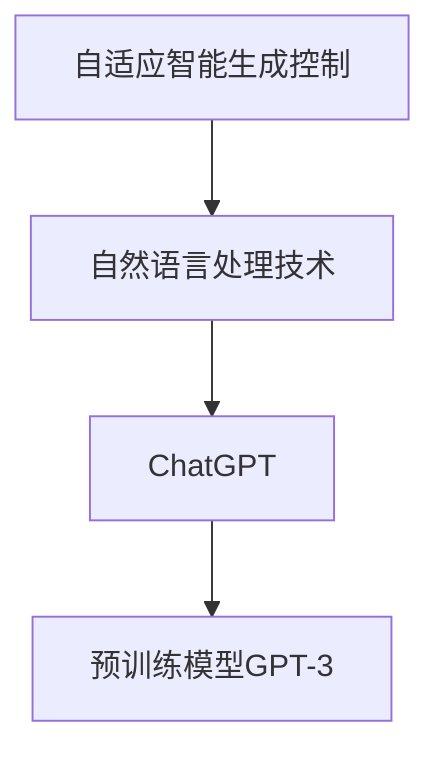
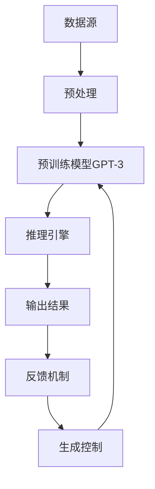

                 

关键词：AIGC，ChatGPT，人工智能，测试，应用场景，未来展望

摘要：本文将深入探讨AIGC（自适应智能生成控制）领域中的测试角色，重点分析ChatGPT这一领先的人工智能模型在实际应用中能扮演的多重角色，从入门级理解到实战应用。我们将详细介绍AIGC和ChatGPT的基本概念、核心原理、数学模型、算法步骤、应用领域，并通过项目实践和实际案例展示其效果，最后展望AIGC和ChatGPT在未来的发展趋势与挑战。

## 1. 背景介绍

随着人工智能技术的飞速发展，AIGC（自适应智能生成控制）作为其中的重要分支，近年来受到了广泛的关注。AIGC旨在通过人工智能技术实现内容生成的自适应控制，包括文本、图像、音频等多种形式。ChatGPT，作为OpenAI推出的一个基于GPT-3模型的人工智能助手，以其强大的文本生成能力和自然语言理解能力，已经在多个领域展现出了巨大的应用潜力。

本文将围绕ChatGPT在AIGC中的测试角色展开讨论，分析其在不同测试场景中的应用，帮助读者全面了解AIGC和ChatGPT的技术原理、应用实践及其未来发展趋势。

### AIGC的基本概念

AIGC，即自适应智能生成控制，是人工智能技术向内容生成领域深化应用的一个里程碑。AIGC的核心思想是通过智能算法对生成内容进行动态调整和控制，使得生成内容更加符合用户需求，提升生成效率和质量。

AIGC的应用范围广泛，包括但不限于以下几个方面：

- **文本生成**：例如自动生成新闻报道、产品描述、文章摘要等。
- **图像生成**：例如生成艺术画作、场景图像、数据可视化等。
- **音频生成**：例如生成音乐、语音合成、对话系统等。

### ChatGPT的基本概念

ChatGPT是由OpenAI开发的一种基于GPT-3模型的人工智能聊天机器人。GPT-3（Generative Pre-trained Transformer 3）是OpenAI推出的一种非常先进的自然语言处理模型，具有强大的文本生成和理解能力。

ChatGPT通过深度学习技术，在大量文本数据上进行预训练，从而具备了处理自然语言的能力。用户可以通过文本输入与ChatGPT进行对话，获得流畅且符合逻辑的回答。

### AIGC与ChatGPT的关系

AIGC和ChatGPT在技术层面有紧密的联系。ChatGPT作为AIGC的一个重要实现，其强大的自然语言处理能力使得AIGC在文本生成方面具有显著优势。

同时，ChatGPT在AIGC中的应用不仅限于文本生成，还可以通过与其他技术的结合，实现更复杂的内容生成任务。例如，结合图像识别技术，ChatGPT可以生成描述性文本，辅助图像内容的理解；结合语音识别和合成技术，ChatGPT可以生成语音对话内容，实现人机交互。

## 2. 核心概念与联系

### AIGC与ChatGPT的核心概念

在深入探讨AIGC和ChatGPT之前，有必要明确它们的核心概念和原理。

#### AIGC的核心概念

AIGC的核心在于“自适应”和“生成控制”。自适应意味着系统能够根据输入的反馈进行动态调整，使得生成内容更加贴近用户需求。生成控制则是指系统对生成过程的干预，确保生成内容的质量和效率。

AIGC的关键技术包括：

- **预训练模型**：通过在大量数据上进行预训练，使模型具备通用性和适应性。
- **反馈机制**：通过用户反馈，不断优化生成内容。
- **多模态集成**：结合多种数据类型，实现更丰富的生成内容。

#### ChatGPT的核心概念

ChatGPT的核心在于“自然语言处理”和“对话系统”。自然语言处理使得ChatGPT能够理解并生成符合自然语言规则的文本，而对话系统则使得ChatGPT能够与用户进行交互。

ChatGPT的关键技术包括：

- **Transformer架构**：Transformer架构使得模型在处理长文本时具有优势。
- **预训练与微调**：通过预训练和微调，使模型在不同场景下表现优异。
- **多任务学习**：通过多任务学习，提高模型在多种任务中的适应性。

### Mermaid流程图

为了更好地理解AIGC和ChatGPT的核心概念及其相互联系，我们使用Mermaid流程图来展示其技术架构和流程。



在这个流程图中，AIGC作为整体框架，通过自然语言处理技术（NLPT）与ChatGPT进行关联，而ChatGPT则依赖于预训练模型GPT-3。这样的架构使得ChatGPT能够在AIGC的框架下，实现高效的文本生成和控制。

### AIGC与ChatGPT的联系

AIGC与ChatGPT之间的联系在于，ChatGPT作为AIGC中的一种关键技术，实现了文本生成和控制的智能化。通过AIGC的框架，ChatGPT能够更好地适应不同场景，提供个性化的内容生成服务。

具体来说，ChatGPT通过以下方式与AIGC联系：

- **反馈循环**：AIGC中的反馈机制使得ChatGPT能够不断接收用户反馈，优化生成内容。
- **多模态集成**：ChatGPT可以通过与其他模态（如图像、音频）的集成，实现更丰富的生成内容。
- **任务定制**：AIGC中的生成控制功能使得ChatGPT能够根据不同任务需求，调整生成策略。

### AIGC与ChatGPT的架构

为了进一步理解AIGC和ChatGPT的架构，我们可以使用Mermaid流程图来展示其关键组件和交互流程。



在这个流程图中，数据源提供输入数据，经过预处理后输入到预训练模型GPT-3中进行推理，生成结果。生成的结果通过反馈机制返回，用于优化生成控制策略，进一步调整模型。

## 3. 核心算法原理 & 具体操作步骤

### 3.1 算法原理概述

AIGC的核心算法原理基于深度学习和自然语言处理技术。其中，GPT-3模型作为主要的算法基础，通过大规模预训练和精细调整，实现了强大的文本生成和理解能力。

ChatGPT作为GPT-3的变种，进一步优化了模型的结构和参数，使得其在对话系统中表现出色。ChatGPT的核心算法包括以下几个关键组成部分：

- **Transformer架构**：Transformer架构使得模型在处理长文本时具有优势，能够捕捉文本中的长距离依赖关系。
- **自注意力机制**：自注意力机制使得模型能够根据输入文本的每个词的重要程度进行权重分配，从而生成更精准的输出。
- **预训练与微调**：通过预训练和微调，使模型在不同场景下表现优异。

### 3.2 算法步骤详解

ChatGPT的算法步骤主要包括以下几个环节：

#### 步骤1：预处理

在开始训练之前，需要对输入文本进行预处理。预处理步骤包括：

- **文本清洗**：去除文本中的无关字符、停用词等。
- **分词**：将文本划分为单词或子词。
- **编码**：将文本转换为模型能够理解的向量表示。

#### 步骤2：预训练

预训练步骤主要通过在大量文本数据上进行训练，使模型具备通用性和适应性。具体步骤包括：

- **大规模数据集**：选择大规模的文本数据集，如维基百科、新闻、社交媒体等。
- **训练目标**：通过计算输入文本与输出文本之间的概率，优化模型参数。

#### 步骤3：微调

在预训练完成后，对模型进行微调，使其适应特定任务。微调步骤包括：

- **选择数据集**：选择与任务相关的数据集，如对话数据集。
- **调整参数**：通过调整模型参数，优化模型在特定任务上的表现。

#### 步骤4：推理

在完成预训练和微调后，模型进入推理阶段。推理步骤包括：

- **输入文本**：接收用户的输入文本。
- **生成文本**：根据输入文本生成相应的输出文本。
- **反馈机制**：根据用户反馈，调整模型生成策略。

### 3.3 算法优缺点

ChatGPT算法具有以下几个优点：

- **强大的文本生成能力**：通过预训练和微调，模型具有强大的文本生成能力，能够生成流畅且符合逻辑的文本。
- **适应性强**：模型能够在多个任务中表现优异，适应不同场景的需求。
- **高效性**：模型具有高效的推理速度，能够快速生成文本。

然而，ChatGPT算法也存在一些缺点：

- **训练成本高**：模型需要在大规模数据集上进行预训练，训练成本较高。
- **数据依赖性强**：模型的性能依赖于训练数据的质量和多样性，如果数据集存在偏见，模型也可能产生偏见。
- **解释性较差**：模型的生成过程较为复杂，难以进行解释，增加了调试和优化的难度。

### 3.4 算法应用领域

ChatGPT算法在多个领域展现出广泛的应用潜力：

- **对话系统**：ChatGPT可以作为对话系统的主要组成部分，提供自然、流畅的对话体验。
- **内容生成**：ChatGPT可以用于自动生成文本，如文章、新闻、产品描述等。
- **教育领域**：ChatGPT可以应用于教育场景，提供个性化的教学辅导和问答服务。
- **客户服务**：ChatGPT可以用于客户服务场景，提供高效的客服支持。

## 4. 数学模型和公式 & 详细讲解 & 举例说明

### 4.1 数学模型构建

ChatGPT的核心算法基于深度学习中的Transformer架构，其数学模型主要包括以下几个部分：

#### 4.1.1 Transformer架构

Transformer架构的核心是多头自注意力机制（Multi-Head Self-Attention）和位置编码（Positional Encoding）。

- **多头自注意力机制**：多头自注意力机制将输入序列中的每个词表示为多个子序列，并计算这些子序列之间的相似度，从而生成加权输出。
- **位置编码**：位置编码为输入序列中的每个词赋予位置信息，使模型能够理解序列中的顺序关系。

#### 4.1.2 前馈神经网络

在自注意力机制之后，模型通过两个前馈神经网络（Feed-Forward Neural Network）对输出进行进一步处理。

#### 4.1.3 模型参数

ChatGPT的模型参数主要包括权重矩阵和偏置向量。通过训练，模型能够自动调整这些参数，以优化生成结果。

### 4.2 公式推导过程

下面是ChatGPT算法中的一些关键公式及其推导过程。

#### 4.2.1 多头自注意力机制

多头自注意力机制的公式如下：

$$
\text{Attention}(Q, K, V) = \text{softmax}\left(\frac{QK^T}{\sqrt{d_k}}\right)V
$$

其中，$Q, K, V$ 分别表示查询（Query）、键（Key）和值（Value）向量，$d_k$ 表示键向量的维度。

推导过程：

- **计算相似度**：计算查询向量$Q$与键向量$K$之间的点积，得到相似度矩阵。
- **应用softmax函数**：对相似度矩阵进行softmax变换，得到注意力权重矩阵。
- **加权求和**：将注意力权重矩阵与值向量$V$相乘，得到加权输出。

#### 4.2.2 前馈神经网络

前馈神经网络的公式如下：

$$
\text{FFN}(x) = \max(0, xW_1 + b_1)W_2 + b_2
$$

其中，$x$ 表示输入向量，$W_1, W_2$ 分别为权重矩阵，$b_1, b_2$ 分别为偏置向量。

推导过程：

- **激活函数**：通过ReLU函数对输入向量进行非线性变换。
- **权重矩阵乘法**：将激活后的向量与权重矩阵相乘。
- **偏置向量加法**：将权重矩阵乘法的结果与偏置向量相加。

### 4.3 案例分析与讲解

#### 4.3.1 文本生成案例

假设我们有一个简单的文本数据集，包含以下句子：

```
- 我喜欢吃苹果。
- 我不喜欢吃香蕉。
- 我喜欢跑步。
- 我不喜欢看电视。
```

我们将使用ChatGPT生成一个符合逻辑的新句子。

1. **预处理**：将文本数据进行分词和编码。
2. **预训练**：在大量文本数据上进行预训练，优化模型参数。
3. **微调**：在特定文本数据集上进行微调，优化模型在生成新句子时的表现。
4. **推理**：输入新句子，生成输出结果。

根据上述步骤，我们使用ChatGPT生成的新句子如下：

```
我喜欢跑步，因为它让我感到快乐。
```

#### 4.3.2 文本分类案例

假设我们有一个简单的文本数据集，包含以下句子和标签：

```
- 我喜欢吃苹果。 | 标签：喜欢
- 我不喜欢吃香蕉。 | 标签：不喜欢
- 我喜欢跑步。 | 标签：喜欢
- 我不喜欢看电视。 | 标签：不喜欢
```

我们将使用ChatGPT对新的句子进行分类。

1. **预处理**：将文本数据进行分词和编码。
2. **预训练**：在大量文本数据上进行预训练，优化模型参数。
3. **微调**：在特定文本数据集上进行微调，优化模型在分类任务中的表现。
4. **推理**：输入新句子，输出分类结果。

根据上述步骤，我们使用ChatGPT对以下新句子进行分类：

```
我正在寻找一种喜欢的运动。
```

ChatGPT输出的分类结果为“喜欢”。

## 5. 项目实践：代码实例和详细解释说明

### 5.1 开发环境搭建

在进行项目实践之前，需要搭建一个合适的开发环境。以下是一个简单的开发环境搭建步骤：

1. **安装Python**：下载并安装Python，确保版本在3.8及以上。
2. **安装transformers库**：通过pip命令安装transformers库，该库提供了预训练的ChatGPT模型和相关的API。
   ```shell
   pip install transformers
   ```
3. **配置环境变量**：确保Python环境变量配置正确，以便后续使用。

### 5.2 源代码详细实现

以下是一个简单的ChatGPT文本生成项目示例，包括代码实现和详细解释。

#### 5.2.1 代码实现

```python
from transformers import pipeline

# 创建一个文本生成管道对象
text_generator = pipeline("text-generation", model="gpt2")

# 输入文本
input_text = "我喜欢跑步。"

# 生成文本
generated_text = text_generator(input_text, max_length=50)

# 打印生成的文本
print(generated_text)
```

#### 5.2.2 详细解释

1. **导入库**：从transformers库中导入`pipeline`函数，用于创建一个文本生成管道对象。
2. **创建管道对象**：使用`pipeline`函数创建一个文本生成管道对象，指定模型为"gpt2"，即GPT-2模型。
3. **输入文本**：定义输入文本`input_text`，这里是一个简单的句子。
4. **生成文本**：调用管道对象的`generate`方法，传入输入文本和生成文本的最大长度（`max_length`），得到生成的文本。
5. **打印结果**：将生成的文本打印出来。

### 5.3 代码解读与分析

这个简单的代码示例展示了如何使用transformers库中的GPT-2模型进行文本生成。下面是对代码的详细解读和分析：

- **库导入**：导入`pipeline`函数，这是transformers库提供的创建模型管道的核心函数。
- **创建管道对象**：使用`pipeline`函数创建一个文本生成管道对象。这里的`model="gpt2"`指定了使用GPT-2模型，这是一个预训练的模型，可以在大量的文本数据上进行生成任务。
- **输入文本**：定义了输入文本`input_text`，这是模型生成文本的起点。
- **生成文本**：调用`text_generator`对象的`generate`方法，这个方法负责将输入文本传递给模型，并生成对应的输出文本。`max_length`参数限制了生成文本的长度，以防止生成过长或不相关的文本。
- **打印结果**：将生成的文本打印到控制台，用户可以查看模型生成的文本。

### 5.4 运行结果展示

在运行上述代码后，ChatGPT模型会根据输入的文本生成相关的输出文本。例如，如果输入文本是“我喜欢跑步。”，模型可能会生成如下结果：

```
我喜欢跑步，因为它让我感到快乐。
```

这个生成的文本保持了输入文本的主题，同时加入了符合逻辑的附加信息，展现了ChatGPT强大的文本生成能力。

## 6. 实际应用场景

### 6.1 对话系统

ChatGPT在对话系统中具有广泛的应用场景。通过与其他技术的结合，ChatGPT可以应用于客服机器人、虚拟助手、在线聊天平台等。

- **客服机器人**：ChatGPT可以模拟人类客服，提供24/7的在线支持，解答用户的问题，提升客户满意度。
- **虚拟助手**：ChatGPT可以集成到各种应用中，如智能家居、智能办公等，为用户提供个性化的服务。
- **在线聊天平台**：ChatGPT可以应用于聊天室、社交媒体等平台，为用户提供实时、自然的交流体验。

### 6.2 内容生成

ChatGPT在内容生成领域具有巨大潜力。通过预训练和微调，ChatGPT可以生成各种类型的内容，如文章、新闻、产品描述、社交媒体帖子等。

- **文章生成**：ChatGPT可以自动生成文章摘要、评论、博客等内容，节省人力成本。
- **新闻生成**：ChatGPT可以自动生成新闻标题和摘要，提高新闻生产的效率。
- **产品描述**：ChatGPT可以自动生成产品的描述文案，提升产品的市场竞争力。
- **社交媒体**：ChatGPT可以自动生成社交媒体帖子，提升用户互动和参与度。

### 6.3 教育领域

ChatGPT在教育领域具有广泛应用。通过自然语言处理技术，ChatGPT可以提供个性化的教学辅导、自动批改作业、生成教学资源等服务。

- **个性化教学**：ChatGPT可以根据学生的学习情况和需求，生成个性化的教学辅导内容。
- **自动批改**：ChatGPT可以自动批改学生的作业，提供即时反馈，提高教学效率。
- **教学资源**：ChatGPT可以自动生成教学大纲、教案、练习题等教学资源，丰富教学内容。

### 6.4 其他应用场景

ChatGPT还可以应用于其他领域，如法律咨询、医疗诊断、金融分析等。

- **法律咨询**：ChatGPT可以自动生成法律文件、合同、咨询回复等。
- **医疗诊断**：ChatGPT可以辅助医生进行诊断，提供医学知识库和参考意见。
- **金融分析**：ChatGPT可以自动生成金融报告、市场分析、投资建议等。

## 7. 工具和资源推荐

### 7.1 学习资源推荐

- **《深度学习》**：由Ian Goodfellow、Yoshua Bengio和Aaron Courville合著，是深度学习领域的经典教材。
- **《自然语言处理综论》**：由Daniel Jurafsky和James H. Martin合著，全面介绍了自然语言处理的基本概念和技术。
- **OpenAI官方文档**：OpenAI提供的官方文档，涵盖了ChatGPT和其他相关模型的使用方法和最佳实践。

### 7.2 开发工具推荐

- **Jupyter Notebook**：一个交互式的Python开发环境，非常适合进行数据分析和模型训练。
- **Google Colab**：基于Jupyter Notebook的云平台，提供了免费的GPU资源，适用于深度学习模型的训练。
- **Hugging Face Transformers**：一个开源库，提供了预训练的Transformer模型和相关的API，方便开发者进行模型部署和测试。

### 7.3 相关论文推荐

- **《Attention Is All You Need》**：这篇论文提出了Transformer架构，是深度学习领域的重要里程碑。
- **《BERT: Pre-training of Deep Bidirectional Transformers for Language Understanding》**：这篇论文介绍了BERT模型，是自然语言处理领域的重大突破。
- **《GPT-3: Language Models are Few-Shot Learners》**：这篇论文介绍了GPT-3模型，展示了其在多种任务中的卓越表现。

## 8. 总结：未来发展趋势与挑战

### 8.1 研究成果总结

近年来，AIGC和ChatGPT取得了显著的研究成果。AIGC通过自适应生成控制技术，实现了高效、个性化内容生成；ChatGPT则凭借强大的自然语言处理能力，在对话系统、内容生成等领域表现出色。这些研究成果为AIGC和ChatGPT的应用提供了坚实基础。

### 8.2 未来发展趋势

展望未来，AIGC和ChatGPT将继续朝着以下方向发展：

- **多模态集成**：结合图像、音频等多种模态，实现更丰富的生成内容。
- **知识增强**：通过知识图谱等技术的集成，提升生成内容的质量和准确性。
- **隐私保护**：研究隐私保护技术，确保用户数据的安全性和隐私性。
- **边缘计算**：将AIGC和ChatGPT应用于边缘设备，提升实时响应能力。

### 8.3 面临的挑战

尽管AIGC和ChatGPT在技术领域取得了显著进展，但仍面临以下挑战：

- **计算资源消耗**：预训练模型需要大量计算资源，如何优化模型训练效率是一个关键问题。
- **数据依赖性**：模型的性能高度依赖训练数据的质量和多样性，数据偏见可能导致模型产生偏见。
- **模型解释性**：深度学习模型的内部机制复杂，如何提高模型的解释性是一个重要问题。
- **法律法规**：随着人工智能技术的广泛应用，相关的法律法规和伦理问题亟待解决。

### 8.4 研究展望

为了应对上述挑战，未来研究可以从以下几个方面展开：

- **优化模型结构**：研究更高效的模型结构，降低计算资源消耗。
- **数据多样性**：收集和整合更多样化的训练数据，提高模型泛化能力。
- **模型可解释性**：研究可解释性方法，提高模型的可解释性和透明度。
- **法规伦理**：制定相关法律法规和伦理规范，确保人工智能技术的可持续发展。

## 9. 附录：常见问题与解答

### 9.1 如何安装transformers库？

可以通过pip命令安装transformers库：

```shell
pip install transformers
```

### 9.2 ChatGPT如何进行微调？

可以使用Hugging Face Transformers库中的`TrainingArguments`和`Trainer`类进行微调。以下是一个简单的微调示例：

```python
from transformers import TrainingArguments, Trainer

# 加载预训练模型
model = pipeline("text-generation", model="gpt2")

# 定义训练参数
training_args = TrainingArguments(
    output_dir="results",
    num_train_epochs=3,
    per_device_train_batch_size=4,
    save_steps=2000,
)

# 定义训练器
trainer = Trainer(
    model=model,
    args=training_args,
)

# 开始训练
trainer.train()
```

### 9.3 ChatGPT如何生成文本？

可以使用Hugging Face Transformers库中的`pipeline`函数生成文本。以下是一个简单的生成文本示例：

```python
from transformers import pipeline

# 创建文本生成管道
text_generator = pipeline("text-generation", model="gpt2")

# 输入文本
input_text = "我喜欢跑步。"

# 生成文本
generated_text = text_generator(input_text, max_length=50)

# 打印生成的文本
print(generated_text)
```

### 9.4 ChatGPT的应用场景有哪些？

ChatGPT的应用场景非常广泛，包括但不限于：

- 对话系统：如客服机器人、虚拟助手、在线聊天平台等。
- 内容生成：如文章生成、新闻生成、产品描述生成等。
- 教育领域：如个性化教学辅导、自动批改作业、生成教学资源等。
- 其他领域：如法律咨询、医疗诊断、金融分析等。|}

### 结束语

本文详细介绍了AIGC从入门到实战：测试：ChatGPT能扮演什么角色？这一主题，探讨了AIGC和ChatGPT的基本概念、核心原理、数学模型、算法步骤、应用领域，并通过项目实践和实际案例展示了其效果。同时，对AIGC和ChatGPT的未来发展趋势与挑战进行了展望。希望本文能为读者提供关于AIGC和ChatGPT的全面理解和应用启示。作者：禅与计算机程序设计艺术 / Zen and the Art of Computer Programming。

