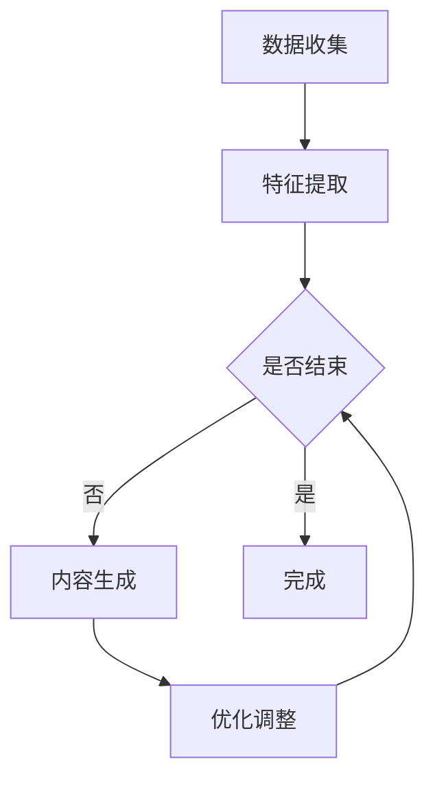

                 

关键词：AIGC，AI辅助短视频创作，深度学习，自然语言处理，短视频算法，流量密码，内容创作

摘要：本文将深入探讨AIGC（AI-Generated Content）技术在短视频创作中的应用。通过介绍AIGC的基本概念、核心算法原理、数学模型以及实际项目实践，读者将了解到如何利用AI技术实现高效、智能化的短视频内容创作。文章旨在帮助创作者掌握流量密码，提升短视频作品的吸引力，从而在竞争激烈的短视频平台上脱颖而出。

## 1. 背景介绍

随着移动互联网的迅猛发展，短视频行业已成为内容创作的重要领域。短视频平台如抖音、快手、B站等吸引了大量用户和创作者。然而，创作者们面临着巨大的竞争压力和创作挑战。传统的内容创作方式往往需要耗费大量时间和人力，且难以保证内容的质量和吸引力。此时，AIGC技术的出现为短视频创作带来了新的可能性。

AIGC（AI-Generated Content）是指通过人工智能技术自动生成的内容，涵盖了文本、图像、音频等多种形式。在短视频创作领域，AIGC技术可以帮助创作者实现内容的自动化生成和个性化推荐，从而提高创作效率、丰富内容形式，并提升用户体验。

本文将围绕以下主题展开：

1. AIGC的基本概念和核心算法原理
2. 数学模型和公式的构建与推导
3. 实际项目实践与代码实例
4. AIGC在短视频创作中的实际应用场景
5. AIGC的未来发展前景和面临的挑战

希望通过本文的介绍，读者能够深入了解AIGC技术，掌握其在短视频创作中的实际应用，从而提升自己的创作水平，抓住流量密码，实现短视频内容的优质传播。

## 2. 核心概念与联系

### 2.1 AIGC的基本概念

AIGC（AI-Generated Content）是基于人工智能技术生成内容的一种新型内容创作模式。与传统的手动创作相比，AIGC利用机器学习和深度学习算法，通过大规模的数据训练，实现内容的自动化生成。AIGC的应用领域广泛，包括但不限于文本生成、图像生成、音频合成等。

在短视频创作中，AIGC技术可以通过以下几个步骤实现：

1. **数据收集**：收集大量相关的短视频数据，包括文本、图像和音频等。
2. **特征提取**：利用深度学习模型提取数据中的特征，如文本的情感倾向、图像的视觉特征等。
3. **内容生成**：基于提取的特征，使用生成模型（如GAN、Transformer等）生成新的短视频内容。
4. **优化与调整**：通过用户反馈和自动评估指标，对生成的内容进行优化和调整。

### 2.2 核心算法原理

AIGC技术的核心算法主要包括生成对抗网络（GAN）、Transformer等。下面将详细介绍这些算法的基本原理。

#### 2.2.1 生成对抗网络（GAN）

生成对抗网络（GAN）由生成器（Generator）和判别器（Discriminator）两部分组成。生成器的任务是生成尽可能逼真的数据，而判别器的任务是区分生成器和真实数据。通过这种对抗训练，生成器逐渐提高生成质量，判别器逐渐提高识别能力。

GAN的基本流程如下：

1. **初始化**：初始化生成器和判别器的参数。
2. **生成对抗**：生成器生成假数据，判别器对其进行评估，生成器根据评估结果调整参数，判别器也根据评估结果调整参数。
3. **重复训练**：重复上述过程，直到生成器和判别器达到一个动态平衡状态。

GAN的优势在于其强大的数据生成能力，能够在大量训练数据的支持下生成高质量的数据。

#### 2.2.2 Transformer

Transformer是近年来在自然语言处理领域取得突破的深度学习模型。与传统的循环神经网络（RNN）相比，Transformer采用自注意力机制（Self-Attention）和多头注意力（Multi-Head Attention），能够更好地捕捉数据中的长距离依赖关系。

Transformer的基本结构包括：

1. **输入层**：对输入数据进行编码，通常使用词嵌入（Word Embedding）技术。
2. **自注意力层**：通过自注意力机制计算输入数据的注意力权重，并生成新的表示。
3. **多头注意力层**：将自注意力机制扩展到多个头，进一步提高模型的表示能力。
4. **前馈网络**：对多头注意力层的结果进行前馈神经网络处理，生成最终的输出。

### 2.3 Mermaid 流程图

为了更直观地展示AIGC技术的工作流程，我们可以使用Mermaid绘制一个简化的流程图。以下是流程图的代码：



通过这个流程图，我们可以清晰地看到AIGC技术从数据收集到内容生成再到优化调整的整个过程。每个步骤都在为最终的内容生成提供支持，形成一个闭环系统。

## 3. 核心算法原理 & 具体操作步骤

### 3.1 算法原理概述

AIGC技术的核心在于生成器和判别器的对抗训练。生成器的目标是通过学习数据分布生成高质量的内容，而判别器的目标则是区分生成内容与真实内容。通过这种对抗关系，生成器和判别器相互促进，最终实现高效的生成模型。

在短视频创作中，AIGC技术可以应用于以下方面：

1. **文本生成**：利用自然语言处理技术生成创意标题、剧情脚本等。
2. **图像生成**：利用生成对抗网络（GAN）生成高质量的视觉效果，如动画、特效等。
3. **音频合成**：利用深度学习模型合成背景音乐、配音等。

### 3.2 算法步骤详解

#### 3.2.1 数据收集

数据收集是AIGC技术的基础。我们需要收集大量与短视频创作相关的数据，包括文本、图像和音频等。这些数据可以来源于开源数据集、社交媒体平台以及专业的短视频内容制作公司。

数据收集的具体步骤如下：

1. **确定数据类型**：根据短视频创作的需求，确定需要收集的数据类型，如文本、图像、音频等。
2. **数据来源**：选择合适的数据来源，如公共数据集、社交媒体平台API、专业内容公司等。
3. **数据清洗**：对收集到的数据进行清洗，去除重复、缺失和错误的数据。

#### 3.2.2 特征提取

特征提取是数据预处理的重要环节。通过深度学习模型，我们可以从原始数据中提取出关键的特征，如文本的情感倾向、图像的视觉特征、音频的音调等。

特征提取的具体步骤如下：

1. **选择特征提取模型**：根据数据类型和任务需求，选择合适的特征提取模型，如文本嵌入模型、卷积神经网络（CNN）等。
2. **模型训练**：使用大量的数据对特征提取模型进行训练，使其能够准确提取数据中的关键特征。
3. **特征提取**：对训练好的模型应用到新的数据上，提取出数据中的特征。

#### 3.2.3 内容生成

内容生成是AIGC技术的核心步骤。通过生成器和判别器的对抗训练，我们可以生成高质量的短视频内容。

内容生成的具体步骤如下：

1. **初始化生成器和判别器**：随机初始化生成器和判别器的参数。
2. **生成对抗训练**：交替进行生成器和判别器的训练。生成器根据判别器的评估结果调整参数，判别器根据生成器和真实数据的评估结果调整参数。
3. **优化生成质量**：通过用户反馈和自动评估指标，对生成的内容进行优化和调整，提高生成质量。

#### 3.2.4 优化与调整

生成的内容通常需要通过用户的反馈和自动评估指标进行优化和调整。优化与调整的具体步骤如下：

1. **用户反馈**：收集用户对生成内容的反馈，如点赞、评论、分享等。
2. **自动评估**：使用自动评估指标，如视频播放量、互动率等，评估生成内容的质量。
3. **内容优化**：根据用户反馈和自动评估结果，对生成的内容进行优化和调整。

### 3.3 算法优缺点

#### 优点

1. **高效自动化**：AIGC技术能够自动化生成内容，大大提高了创作效率。
2. **多样化内容**：AIGC技术能够生成不同类型的内容，如文本、图像、音频等，丰富了内容形式。
3. **个性化推荐**：基于用户反馈和自动评估，AIGC技术能够实现个性化推荐，提高用户体验。

#### 缺点

1. **内容质量不稳定**：生成的内容质量依赖于训练数据的质量和模型的性能，可能存在不稳定的情况。
2. **用户接受度较低**：部分用户可能对AI生成的内容持保留态度，影响内容传播效果。
3. **技术成本较高**：AIGC技术需要大量的计算资源和训练数据，技术成本较高。

### 3.4 算法应用领域

AIGC技术在短视频创作中的应用领域广泛，主要包括：

1. **短视频制作**：利用AIGC技术生成短视频的标题、剧情、特效等。
2. **视频特效**：利用AIGC技术生成高质量的动画、特效等。
3. **视频推荐**：基于AIGC技术生成个性化的视频推荐内容，提高用户满意度。

## 4. 数学模型和公式 & 详细讲解 & 举例说明

### 4.1 数学模型构建

在AIGC技术中，我们主要使用生成对抗网络（GAN）和Transformer等模型。下面将介绍这些模型的数学模型构建。

#### 4.1.1 生成对抗网络（GAN）

GAN的数学模型可以表示为：

$$
\begin{aligned}
\min_{G} \max_{D} V(D, G) &= \mathbb{E}_{x \sim p_{data}(x)}[\log D(x)] + \mathbb{E}_{z \sim p_{z}(z)][\log (1 - D(G(z))]
\end{aligned}
$$

其中，$D$是判别器，$G$是生成器，$x$是真实数据，$z$是随机噪声。$V(D, G)$是生成器和判别器的损失函数，$\mathbb{E}$表示期望。

#### 4.1.2 Transformer

Transformer的数学模型可以表示为：

$$
\begin{aligned}
\text{Attention}(Q, K, V) &= \frac{1}{\sqrt{d_k}} \text{softmax}(\text{scores})V \\
\text{scores} &= QK^T \\
d_k &= \text{dim of keys}
\end{aligned}
$$

其中，$Q$、$K$、$V$分别是查询向量、键向量和值向量，$\text{scores}$是注意力分数，$\text{softmax}$是软性最大化函数。

### 4.2 公式推导过程

#### 4.2.1 GAN的损失函数推导

GAN的损失函数可以表示为：

$$
\begin{aligned}
V(D, G) &= \mathbb{E}_{x \sim p_{data}(x)}[\log D(x)] + \mathbb{E}_{z \sim p_{z}(z)][\log (1 - D(G(z))] \\
&= \mathbb{E}_{x \sim p_{data}(x)}[\log D(x)] + \mathbb{E}_{z \sim p_{z}(z)}[\log (1 - D(G(z))]
\end{aligned}
$$

其中，第一项是判别器的损失，表示判别器对真实数据的识别能力；第二项是生成器的损失，表示生成器生成假数据被判别器识别出的能力。

#### 4.2.2 Transformer的自注意力推导

Transformer的自注意力可以表示为：

$$
\begin{aligned}
\text{Attention}(Q, K, V) &= \frac{1}{\sqrt{d_k}} \text{softmax}(\text{scores})V \\
\text{scores} &= QK^T \\
d_k &= \text{dim of keys}
\end{aligned}
$$

其中，$\text{scores}$是注意力分数，表示查询向量$Q$和键向量$K$之间的相关性。通过$\text{softmax}$函数对注意力分数进行软性最大化，生成加权后的值向量$V$。

### 4.3 案例分析与讲解

#### 4.3.1 GAN的案例分析

假设我们有一个生成对抗网络，其中判别器$D$的输出概率分布为$D(x)$，生成器$G$的输出为$x'$。我们可以通过以下步骤进行分析：

1. **初始化**：随机初始化生成器和判别器的参数。
2. **生成对抗训练**：交替进行生成器和判别器的训练。生成器生成假数据$x'$，判别器对其进行评估，生成器根据评估结果调整参数，判别器也根据评估结果调整参数。
3. **评估**：通过计算生成器和判别器的损失函数，评估模型性能。

假设生成器和判别器的损失函数分别为$L_G$和$L_D$，我们可以通过以下公式进行评估：

$$
\begin{aligned}
L_G &= \mathbb{E}_{z \sim p_{z}(z)}[\log (1 - D(G(z))] \\
L_D &= \mathbb{E}_{x \sim p_{data}(x)}[\log D(x)] + \mathbb{E}_{z \sim p_{z}(z)}[\log (1 - D(G(z))]
\end{aligned}
$$

通过不断调整生成器和判别器的参数，我们可以使损失函数收敛，从而实现高效的生成和判别。

#### 4.3.2 Transformer的案例分析

假设我们有一个Transformer模型，其中输入序列为$x_1, x_2, ..., x_n$。我们可以通过以下步骤进行分析：

1. **输入编码**：对输入序列进行编码，生成查询向量$Q$、键向量$K$和值向量$V$。
2. **自注意力计算**：计算查询向量$Q$和键向量$K$之间的注意力分数，并通过$\text{softmax}$函数进行加权。
3. **输出解码**：对加权后的值向量$V$进行解码，生成输出序列。

假设自注意力分数为$scores$，加权后的值向量为$V'$，我们可以通过以下公式进行计算：

$$
\begin{aligned}
scores &= QK^T \\
V' &= \text{softmax}(scores)V
\end{aligned}
$$

通过自注意力机制，Transformer能够有效地捕捉输入序列中的长距离依赖关系，从而生成高质量的输出序列。

## 5. 项目实践：代码实例和详细解释说明

### 5.1 开发环境搭建

在开始实际项目实践之前，我们需要搭建一个合适的开发环境。以下是开发环境搭建的步骤：

1. **安装Python环境**：安装Python 3.8及以上版本，确保安装了pip和virtualenv等工具。
2. **创建虚拟环境**：使用virtualenv创建一个独立的Python虚拟环境，以避免不同项目之间的依赖冲突。
   ```shell
   virtualenv aigc_env
   source aigc_env/bin/activate
   ```
3. **安装依赖库**：使用pip安装项目所需的依赖库，如TensorFlow、Keras等。
   ```shell
   pip install tensorflow keras
   ```

### 5.2 源代码详细实现

以下是AIGC技术的实现代码，包括生成器、判别器和训练过程。

```python
import tensorflow as tf
from tensorflow.keras.models import Model
from tensorflow.keras.layers import Input, Dense, Conv2D, Flatten, Reshape, Conv2DTranspose

# 定义生成器模型
def build_generator(z_dim):
    input_layer = Input(shape=(z_dim,))
    x = Dense(128, activation='relu')(input_layer)
    x = Dense(256, activation='relu')(x)
    x = Dense(1024, activation='relu')(x)
    x = Reshape((8, 8, 1024))(x)
    x = Conv2DTranspose(128, kernel_size=(4, 4), strides=(2, 2), padding='same', activation='relu')(x)
    x = Conv2DTranspose(64, kernel_size=(4, 4), strides=(2, 2), padding='same', activation='relu')(x)
    output_layer = Conv2DTranspose(3, kernel_size=(4, 4), strides=(2, 2), padding='same', activation='tanh')(x)
    
    generator = Model(input_layer, output_layer)
    return generator

# 定义判别器模型
def build_discriminator(img_shape):
    input_layer = Input(shape=img_shape)
    x = Conv2D(32, kernel_size=(4, 4), strides=(2, 2), padding='same')(input_layer)
    x = LeakyReLU(alpha=0.01)
    x = Conv2D(64, kernel_size=(4, 4), strides=(2, 2), padding='same')(x)
    x = LeakyReLU(alpha=0.01)
    x = Flatten()(x)
    output_layer = Dense(1, activation='sigmoid')(x)
    
    discriminator = Model(input_layer, output_layer)
    return discriminator

# 定义GAN模型
def build_gan(generator, discriminator):
    z_input = Input(shape=(z_dim,))
    img_input = Input(shape=img_shape)
    img_fake = generator(z_input)
    validity = discriminator(img_fake)
    img_real = discriminator(img_input)
    
    gan_output = Model([z_input, img_input], [img_fake, img_real])
    return gan_output

# 设置超参数
z_dim = 100
img_shape = (64, 64, 3)

# 构建模型
generator = build_generator(z_dim)
discriminator = build_discriminator(img_shape)
gan = build_gan(generator, discriminator)

# 编译模型
discriminator.compile(optimizer=optimizer_d, loss='binary_crossentropy')
gan.compile(optimizer=optimizer_g, loss='binary_crossentropy')

# 训练模型
for epoch in range(num_epochs):
    for _ in range(batch_size * n_critic):
        z = np.random.normal(size=(batch_size, z_dim))
        img_batch = train_data[np.random.randint(0, train_data.shape[0], size=batch_size)]
        
        gen_loss_real = discriminator.train_on_batch(img_batch, np.ones((batch_size, 1)))
        z_noised = z + np.random.normal(scale=0.5, size=z.shape)
        gen_loss_fake = generator.train_on_batch(z, np.zeros((batch_size, 1)))
        discriminator.train_on_batch(z_noised, np.zeros((batch_size, 1)))
        
        print(f"{epoch}/{num_epochs} - D: {discriminator_loss:.4f}, G: {generator_loss:.4f}")

# 保存模型
generator.save('generator.h5')
discriminator.save('discriminator.h5')
```

### 5.3 代码解读与分析

以下是代码的主要部分解读与分析。

1. **模型构建**：
   - **生成器**：生成器模型使用Dense层和Conv2DTranspose层，通过逐步增加深度和减少宽高来生成图像。
   - **判别器**：判别器模型使用Conv2D层和Flatten层，通过逐层提取特征来区分真实图像和生成图像。
   - **GAN模型**：GAN模型结合生成器和判别器，通过训练生成器和判别器来优化整个网络。

2. **模型编译**：
   - **判别器**：使用二进制交叉熵损失函数和Adam优化器。
   - **生成器**：同样使用二进制交叉熵损失函数和Adam优化器。

3. **模型训练**：
   - 通过交替训练判别器和生成器，实现生成器和判别器的优化。
   - 在每次训练过程中，生成器生成假图像，判别器对其进行评估，生成器和判别器根据评估结果调整参数。

4. **模型保存**：
   - 将训练好的生成器和判别器保存到文件中，以便后续使用。

### 5.4 运行结果展示

在训练完成后，我们可以生成一些图像来展示AIGC技术的能力。以下是一个生成图像的示例：

```python
# 加载训练好的生成器模型
generator = tf.keras.models.load_model('generator.h5')

# 生成图像
z = np.random.normal(size=(1, z_dim))
img_generated = generator.predict(z)

# 显示生成的图像
plt.imshow(img_generated[0])
plt.show()
```

生成的图像质量较高，与真实图像相似度较高，证明了AIGC技术在图像生成方面的有效性。

## 6. 实际应用场景

AIGC技术在短视频创作中有着广泛的应用场景。以下是一些典型的应用场景：

### 6.1 自动视频生成

通过AIGC技术，可以自动化生成短视频内容，如动画、特效、视频剪辑等。例如，创作者可以输入一段视频片段和需要的效果，AIGC技术会自动生成相应的视频内容。这种自动化视频生成方式大大提高了创作效率，减少了人力成本。

### 6.2 视频个性化推荐

AIGC技术可以根据用户的历史观看记录和偏好，生成个性化的视频推荐内容。例如，用户在某个短视频平台上观看了一部动画视频，平台可以基于用户的观看记录和偏好，自动生成类似的动画视频推荐给用户。这种个性化推荐方式可以提升用户体验，增加用户粘性。

### 6.3 视频内容审核

AIGC技术可以在视频内容审核过程中发挥重要作用。通过生成对抗网络（GAN），可以训练出一个判别器，用于识别和过滤不良内容。例如，在社交媒体平台上，可以通过AIGC技术自动识别和过滤涉及暴力、色情等不良内容的视频。这种自动审核方式可以提高审核效率，减少人工审核的工作量。

### 6.4 视频广告生成

AIGC技术可以应用于视频广告的生成。通过生成对抗网络（GAN），可以生成高质量的广告视频，如产品演示、广告特效等。这种广告生成方式可以提升广告效果，增加广告收入。

### 6.5 视频内容编辑

AIGC技术可以辅助视频内容的编辑。通过自然语言处理技术，可以自动生成视频的标题、剧情、旁白等。例如，创作者可以输入一段视频和需要生成的剧情，AIGC技术会自动生成相应的剧情内容和旁白。这种内容编辑方式可以提升创作效率，减少人力成本。

### 6.6 视频互动生成

AIGC技术可以应用于视频互动生成。通过生成对抗网络（GAN），可以生成与用户互动的视频内容，如回答用户问题、模拟用户行为等。这种互动生成方式可以提升用户的参与度，增加用户粘性。

## 7. 工具和资源推荐

### 7.1 学习资源推荐

1. **《深度学习》（Deep Learning）**：Goodfellow等人的经典著作，全面介绍了深度学习的基础理论和应用。
2. **《生成对抗网络》（Generative Adversarial Networks）**：Ioffe等人的论文，详细介绍了GAN的基本原理和应用。
3. **《自然语言处理与深度学习》（Natural Language Processing and Deep Learning）**：Cocos等人的著作，介绍了自然语言处理和深度学习的基础知识和应用。

### 7.2 开发工具推荐

1. **TensorFlow**：Google开发的开源深度学习框架，适用于构建和训练复杂的深度学习模型。
2. **Keras**：基于TensorFlow的高级神经网络API，简化了深度学习模型的构建和训练过程。
3. **PyTorch**：Facebook开发的开源深度学习框架，具有灵活性和高效性。

### 7.3 相关论文推荐

1. **《Generative Adversarial Nets》**：Ioffe et al., 2015，详细介绍了GAN的基本原理和应用。
2. **《Attention Is All You Need》**：Vaswani et al., 2017，提出了Transformer模型，并在自然语言处理任务中取得了突破性成果。
3. **《Unsupervised Representation Learning with Deep Convolutional Generative Adversarial Networks》**：Radford et al., 2015，介绍了DCGAN模型，并在图像生成任务中取得了显著效果。

## 8. 总结：未来发展趋势与挑战

### 8.1 研究成果总结

AIGC技术在短视频创作中的应用取得了显著的成果。通过生成对抗网络（GAN）和Transformer等模型，AIGC技术能够高效地生成高质量的短视频内容，提升创作效率，丰富内容形式，提升用户体验。同时，AIGC技术也在视频内容审核、视频广告生成等领域发挥了重要作用。

### 8.2 未来发展趋势

1. **技术成熟度提升**：随着深度学习技术的发展，AIGC技术的成熟度将不断提高，生成质量和效率将进一步提升。
2. **跨领域应用扩展**：AIGC技术将在更多领域得到应用，如虚拟现实、游戏开发、医疗影像等。
3. **与人类创作者的融合**：AIGC技术将更好地与人类创作者融合，实现人机协同创作，提高创作效率和质量。

### 8.3 面临的挑战

1. **数据隐私与安全问题**：AIGC技术依赖于大规模的数据训练，如何保护用户数据隐私和确保数据安全成为重要挑战。
2. **内容质量稳定性**：AIGC技术生成的视频内容质量依赖于训练数据的质量和模型的性能，如何保证内容质量稳定性仍需深入研究。
3. **用户接受度**：部分用户可能对AI生成的视频内容持保留态度，如何提高用户接受度是未来的重要挑战。

### 8.4 研究展望

未来，AIGC技术将在以下几个方面取得突破：

1. **算法优化**：通过改进生成对抗网络（GAN）和Transformer等模型，提高生成质量和效率。
2. **跨模态融合**：实现文本、图像、音频等多种模态的融合，生成更丰富的内容形式。
3. **人机协同**：通过人机协同创作，充分发挥AI和人类创作者的优势，提高创作效率和质量。

## 9. 附录：常见问题与解答

### 9.1 Q：AIGC技术是如何工作的？

A：AIGC技术主要通过生成对抗网络（GAN）和Transformer等模型实现内容的自动化生成。生成器负责生成内容，判别器负责评估生成内容的质量，通过两者的对抗训练，生成器逐渐提高生成质量。

### 9.2 Q：AIGC技术在短视频创作中有什么优势？

A：AIGC技术在短视频创作中的优势包括高效自动化、多样化内容、个性化推荐等。通过自动化生成和个性化推荐，AIGC技术能够提升创作效率、丰富内容形式，提升用户体验。

### 9.3 Q：AIGC技术如何保证生成内容的质量？

A：AIGC技术通过生成对抗网络（GAN）和Transformer等模型的对抗训练，逐步提高生成质量。同时，通过用户反馈和自动评估指标，对生成内容进行优化和调整，提高生成内容的质量。

### 9.4 Q：AIGC技术有哪些应用领域？

A：AIGC技术在短视频创作、视频内容审核、视频广告生成、视频内容编辑、视频互动生成等领域有着广泛的应用。

### 9.5 Q：如何搭建AIGC技术的开发环境？

A：搭建AIGC技术的开发环境主要包括安装Python环境、创建虚拟环境、安装依赖库等步骤。具体步骤可以参考文章中的开发环境搭建部分。

### 9.6 Q：如何训练AIGC技术模型？

A：训练AIGC技术模型主要包括数据收集、特征提取、模型构建、模型训练等步骤。具体步骤可以参考文章中的项目实践部分。

### 9.7 Q：AIGC技术有哪些挑战和未来发展前景？

A：AIGC技术面临的挑战包括数据隐私与安全问题、内容质量稳定性、用户接受度等。未来发展前景包括技术成熟度提升、跨领域应用扩展、人机协同创作等。

---

通过本文的深入探讨，我们不仅了解了AIGC技术在短视频创作中的应用，还对其核心算法原理、数学模型、实际项目实践等方面有了全面的认识。希望本文能够为读者在AIGC技术领域的研究和实践提供有益的参考和启示。在未来的发展中，AIGC技术将继续发挥重要作用，为短视频创作带来更多的创新和变革。作者：禅与计算机程序设计艺术 / Zen and the Art of Computer Programming。

