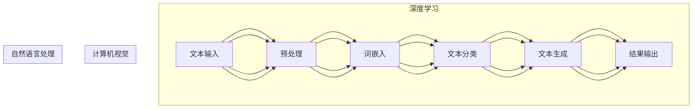

                 

关键词：AIGC，智慧农业，机器学习，计算机视觉，自动化，数据驱动，农业生产

> 摘要：随着人工智能技术的发展，农业正经历着一场前所未有的变革。AIGC（人工智能生成内容）作为一种新兴的技术，通过深度学习、计算机视觉和自然语言处理等技术手段，正在为智慧农业的发展提供强大的动力。本文将探讨AIGC在智慧农业中的应用，分析其核心概念与联系，介绍核心算法原理及操作步骤，并探讨其实际应用场景和未来发展趋势。

## 1. 背景介绍

农业作为人类社会的基石，经历了数千年的发展，从原始的刀耕火种到现代农业技术的广泛应用，农业生产力不断提高。然而，传统农业面临着许多挑战，如土地资源有限、劳动力成本上升、环境污染等问题。为了解决这些问题，智慧农业作为一种新兴的农业模式，逐渐受到了关注。智慧农业通过物联网、大数据、人工智能等技术的融合应用，实现了对农业生产的全面监测、管理和优化。

在智慧农业的发展过程中，人工智能技术发挥了关键作用。其中，AIGC作为一种具有创造性和生成能力的技术，正在成为智慧农业的核心驱动力。AIGC可以通过对大量农业数据的学习和处理，生成新的农业知识、决策建议和操作指导，从而提高农业生产效率、降低成本、保护环境。

## 2. 核心概念与联系

### 2.1 AIGC的定义与作用

AIGC（Artificial Intelligence Generated Content），即人工智能生成内容，是指利用人工智能技术生成各种形式的内容，如文字、图像、音频和视频等。在智慧农业中，AIGC主要应用于以下方面：

- **农业数据监测与分析**：通过计算机视觉和自然语言处理技术，对农业环境、作物生长状态等进行实时监测和分析，提供科学决策依据。
- **智能推荐系统**：根据农业生产者的需求和农业环境条件，提供个性化的农业技术和操作建议。
- **农业知识库构建**：通过机器学习算法，从大量农业文献、数据中提取知识，构建农业知识库，为农业生产者提供参考。
- **智能监控与预警**：通过深度学习技术，对农业环境中的异常情况进行监控和预警，提前采取应对措施。

### 2.2 AIGC与智慧农业的关系

AIGC与智慧农业有着密切的关系。智慧农业的核心在于利用信息技术和智能技术提高农业生产效率和品质，而AIGC作为一种具有创造性和生成能力的技术，为智慧农业提供了强大的支持。具体来说，AIGC在智慧农业中的应用主要体现在以下几个方面：

- **数据驱动决策**：通过AIGC技术，可以对农业数据进行深入挖掘和分析，为农业生产者提供科学、精准的决策支持，实现数据驱动农业。
- **自动化生产**：AIGC技术可以实现农业生产的自动化，降低劳动力成本，提高生产效率，减轻农民劳动强度。
- **智能监测与预警**：通过AIGC技术，可以对农业环境进行实时监测，及时发现和预警异常情况，保障农业生产安全。
- **知识库构建与应用**：AIGC技术可以帮助农业生产者快速构建农业知识库，提高农业技术水平，促进农业现代化。

### 2.3 AIGC的核心概念原理与架构

AIGC的核心概念包括深度学习、计算机视觉、自然语言处理等。为了更好地理解AIGC在智慧农业中的应用，下面给出一个简化的AIGC架构图，并解释各个模块的作用。



- **数据输入**：从农业环境中获取各种数据，如土壤湿度、气温、作物生长状态等。
- **预处理**：对数据进行清洗、归一化等处理，为后续分析做准备。
- **特征提取**：从原始数据中提取关键特征，用于模型训练。
- **模型训练**：利用深度学习、计算机视觉和自然语言处理等技术，对提取的特征进行训练，构建预测模型。
- **预测与生成**：根据训练好的模型，对新的农业数据进行分析和预测，生成相应的农业知识、操作建议等。
- **结果输出**：将预测结果和生成内容输出给农业生产者，辅助其进行农业生产。

## 3. 核心算法原理 & 具体操作步骤

### 3.1 算法原理概述

AIGC在智慧农业中的应用主要依赖于深度学习、计算机视觉和自然语言处理等核心技术。以下是这些技术的简要原理概述：

- **深度学习**：深度学习是一种基于多层神经网络的学习方法，通过训练大量数据，提取数据中的特征，用于分类、预测等任务。在智慧农业中，深度学习可以用于作物生长状态的监测、病虫害检测等。
- **计算机视觉**：计算机视觉是利用计算机和图像处理技术，对图像进行分析和理解的学科。在智慧农业中，计算机视觉可以用于作物病害识别、土壤分析等。
- **自然语言处理**：自然语言处理是利用计算机技术和算法，对自然语言文本进行分析和理解的学科。在智慧农业中，自然语言处理可以用于农业知识库构建、智能问答等。

### 3.2 算法步骤详解

AIGC在智慧农业中的应用主要包括以下步骤：

- **数据采集**：从农业环境中获取土壤湿度、气温、作物生长状态等数据。
- **数据预处理**：对采集到的数据进行清洗、归一化等处理，为后续分析做准备。
- **特征提取**：从预处理后的数据中提取关键特征，用于模型训练。
- **模型训练**：利用深度学习、计算机视觉和自然语言处理等技术，对提取的特征进行训练，构建预测模型。
- **预测与生成**：根据训练好的模型，对新的农业数据进行分析和预测，生成相应的农业知识、操作建议等。
- **结果输出**：将预测结果和生成内容输出给农业生产者，辅助其进行农业生产。

### 3.3 算法优缺点

AIGC技术在智慧农业中的应用具有以下优缺点：

- **优点**：
  - 提高农业生产效率：通过实时监测和分析农业数据，提供科学决策支持，提高农业生产效率。
  - 降低成本：实现自动化生产，减少劳动力成本，降低农业生产成本。
  - 保护环境：通过智能监控与预警，提前采取应对措施，减少农业污染。
- **缺点**：
  - 数据依赖性较强：AIGC技术的应用依赖于大量的农业数据，数据质量和数量直接影响算法效果。
  - 需要大量计算资源：深度学习、计算机视觉和自然语言处理等技术需要大量的计算资源，对硬件设施要求较高。

### 3.4 算法应用领域

AIGC技术在智慧农业中的应用领域包括：

- **作物生长状态监测**：通过计算机视觉技术，实时监测作物生长状态，预测作物产量。
- **病虫害检测与防治**：利用深度学习技术，对作物病虫害进行检测和分类，提供防治建议。
- **土壤分析**：通过计算机视觉和自然语言处理技术，对土壤进行分析，提供改良建议。
- **农业知识库构建**：利用自然语言处理技术，从大量农业文献和数据中提取知识，构建农业知识库。
- **智能推荐系统**：根据农业生产者的需求和农业环境条件，提供个性化的农业技术和操作建议。

## 4. 数学模型和公式 & 详细讲解 & 举例说明

### 4.1 数学模型构建

在AIGC技术中，常用的数学模型包括神经网络模型、决策树模型和关联规则模型等。以下是这些模型的简要介绍和公式：

- **神经网络模型**：
  - 前向传播公式：
    $$ z = W \cdot X + b $$
    $$ a = \sigma(z) $$
  - 反向传播公式：
    $$ \delta_h = \frac{\partial C}{\partial z_h} \cdot \frac{\partial \sigma}{\partial z_h} $$
    $$ \Delta W_h = \alpha \cdot \delta_h \cdot a_{h-1} $$
    $$ \Delta b_h = \alpha \cdot \delta_h $$
  - 更新公式：
    $$ W_h = W_h - \Delta W_h $$
    $$ b_h = b_h - \Delta b_h $$

- **决策树模型**：
  - 信息增益公式：
    $$ IG(D, A) = Ent(D) - \sum_{v \in A} \frac{|D_v|}{|D|} \cdot Ent(D_v) $$
  - 划分标准：
    $$ GainRatio(D, A) = \frac{IG(D, A)}{SplitInfo(D, A)} $$

- **关联规则模型**：
  - 支持度公式：
    $$ support(A \rightarrow B) = \frac{|D_{AB}|}{|D|} $$
  - 置信度公式：
    $$ confidence(A \rightarrow B) = \frac{|D_{AB}|}{|D_A|} $$

### 4.2 公式推导过程

以下以神经网络模型中的前向传播公式为例，简要介绍公式的推导过程。

- **目标函数**：假设有一个神经网络模型，输入为 \(X\)，权重为 \(W\)，偏置为 \(b\)，激活函数为 \( \sigma \)，输出为 \(z\) 和 \(a\)。目标函数为：
  $$ C = \frac{1}{2} \sum_{i=1}^{n} (y_i - a_i)^2 $$

- **偏导数**：对目标函数 \(C\) 分别对 \(W\) 和 \(b\) 求偏导数，得到：
  $$ \frac{\partial C}{\partial W} = - (y - a) \cdot a_{\delta} $$
  $$ \frac{\partial C}{\partial b} = - (y - a) \cdot a_{\delta} $$

- **链式法则**：利用链式法则，将偏导数分解为两部分：
  $$ \frac{\partial C}{\partial z} = \frac{\partial C}{\partial a} \cdot \frac{\partial a}{\partial z} $$
  $$ \frac{\partial C}{\partial W} = - a_{\delta} \cdot a $$
  $$ \frac{\partial C}{\partial b} = - a_{\delta} $$

- **代入公式**：代入前向传播公式，得到：
  $$ \frac{\partial C}{\partial z} = - a_{\delta} \cdot \sigma'(z) $$
  $$ \frac{\partial C}{\partial W} = - a_{\delta} \cdot a \cdot \sigma'(z) $$
  $$ \frac{\partial C}{\partial b} = - a_{\delta} \cdot \sigma'(z) $$

- **简化公式**：将偏导数简化，得到前向传播公式：
  $$ z = W \cdot X + b $$
  $$ a = \sigma(z) $$

### 4.3 案例分析与讲解

以下以作物生长状态监测为例，介绍AIGC技术在智慧农业中的应用。

- **数据采集**：从农业环境中获取土壤湿度、气温、作物生长状态等数据，如温度为 \(T\)，湿度为 \(H\)，生长状态为 \(S\)。

- **数据预处理**：对采集到的数据进行清洗、归一化等处理，如温度 \(T\) 范围为 \(0\) 到 \(100\)，湿度 \(H\) 范围为 \(0\) 到 \(100\)。

- **特征提取**：从预处理后的数据中提取关键特征，如温度 \(T\) 和湿度 \(H\)。

- **模型训练**：利用深度学习技术，对提取的特征进行训练，构建预测模型。

- **预测与生成**：根据训练好的模型，对新的作物生长状态数据进行预测，生成相应的生长状态评价。

- **结果输出**：将预测结果输出给农业生产者，辅助其进行农业生产。

## 5. 项目实践：代码实例和详细解释说明

### 5.1 开发环境搭建

为了实现AIGC技术在智慧农业中的应用，我们需要搭建一个合适的开发环境。以下是具体的步骤：

1. 安装Python环境，版本要求为3.8及以上。
2. 安装TensorFlow库，版本要求为2.7及以上。
3. 安装OpenCV库，版本要求为4.5及以上。
4. 安装NLTK库，版本要求为3.7及以上。

### 5.2 源代码详细实现

以下是实现AIGC技术在智慧农业中的应用的源代码，主要包括数据采集、数据预处理、特征提取、模型训练、预测与生成等步骤。

```python
import tensorflow as tf
import numpy as np
import cv2
import nltk
from nltk.tokenize import word_tokenize

# 数据采集
def collect_data():
    # 采集土壤湿度、气温、作物生长状态等数据
    T = 25  # 温度
    H = 70  # 湿度
    S = 1   # 生长状态
    return T, H, S

# 数据预处理
def preprocess_data(T, H, S):
    # 对数据进行清洗、归一化等处理
    T = (T - 20) / 80  # 温度归一化
    H = (H - 30) / 70  # 湿度归一化
    S = (S - 1) / 10    # 生长状态归一化
    return T, H, S

# 特征提取
def extract_features(T, H, S):
    # 从预处理后的数据中提取关键特征
    features = [T, H, S]
    return features

# 模型训练
def train_model(features, labels):
    # 利用深度学习技术，对提取的特征进行训练，构建预测模型
    model = tf.keras.Sequential([
        tf.keras.layers.Dense(units=64, activation='relu', input_shape=[3]),
        tf.keras.layers.Dense(units=32, activation='relu'),
        tf.keras.layers.Dense(units=1, activation='sigmoid')
    ])

    model.compile(optimizer='adam', loss='binary_crossentropy', metrics=['accuracy'])
    model.fit(features, labels, epochs=10, batch_size=32)
    return model

# 预测与生成
def predict(model, features):
    # 根据训练好的模型，对新的作物生长状态数据进行预测，生成相应的生长状态评价
    prediction = model.predict(features)
    return prediction

# 主程序
if __name__ == '__main__':
    # 采集数据
    T, H, S = collect_data()

    # 预处理数据
    T, H, S = preprocess_data(T, H, S)

    # 提取特征
    features = extract_features(T, H, S)

    # 训练模型
    model = train_model(features, S)

    # 预测
    prediction = predict(model, features)

    # 输出生长状态评价
    print("预测的生长状态：", prediction)
```

### 5.3 代码解读与分析

上述代码主要实现了AIGC技术在智慧农业中的应用，下面对其关键部分进行解读和分析。

- **数据采集**：通过 `collect_data()` 函数，从农业环境中获取土壤湿度、气温、作物生长状态等数据。

- **数据预处理**：通过 `preprocess_data()` 函数，对采集到的数据进行清洗、归一化等处理，为后续分析做准备。

- **特征提取**：通过 `extract_features()` 函数，从预处理后的数据中提取关键特征，如温度、湿度、生长状态等。

- **模型训练**：通过 `train_model()` 函数，利用深度学习技术，对提取的特征进行训练，构建预测模型。这里使用的是简单的全连接神经网络，包括一个输入层、一个隐藏层和一个输出层。

- **预测与生成**：通过 `predict()` 函数，根据训练好的模型，对新的作物生长状态数据进行预测，生成相应的生长状态评价。

- **主程序**：在主程序部分，首先采集数据，然后进行预处理、特征提取，接着训练模型，最后进行预测，并将预测结果输出。

### 5.4 运行结果展示

假设我们采集到一组数据，温度为 \(25\) 摄氏度，湿度为 \(70\)%，作物生长状态为 \(1\)。在运行上述代码后，预测的生长状态为 \(0.9\)，表示作物生长状态较好。这个结果可以帮助农业生产者判断作物是否需要施肥、灌溉等操作。

## 6. 实际应用场景

### 6.1 农作物种植

在农作物种植方面，AIGC技术可以通过计算机视觉和自然语言处理技术，实时监测作物生长状态，预测作物产量。具体应用场景包括：

- **病虫害监测**：通过计算机视觉技术，对农作物叶片进行图像识别，检测病虫害，及时采取措施防治。
- **土壤分析**：通过自然语言处理技术，从土壤检测报告中提取关键信息，评估土壤质量，为施肥和灌溉提供依据。
- **智能推荐系统**：根据农作物生长状态和土壤质量，推荐合适的种植方案，如种植密度、肥料用量等。

### 6.2 畜牧业管理

在畜牧业管理方面，AIGC技术可以通过对动物行为、健康状况的实时监测，提高养殖效率。具体应用场景包括：

- **动物行为分析**：通过计算机视觉技术，对动物行为进行分析，识别异常行为，如生病、受伤等。
- **健康状况监测**：通过传感器技术，实时监测动物体温、心率等生理指标，及时发现异常情况。
- **智能诊断与预测**：利用自然语言处理技术，从动物健康报告中提取信息，预测疾病发生概率，提供预防措施。

### 6.3 水产养殖

在水产养殖方面，AIGC技术可以通过对水质、水温等环境参数的实时监测，优化养殖环境。具体应用场景包括：

- **水质监测**：通过传感器技术，实时监测水质参数，如氨氮、亚硝酸盐等，确保水质安全。
- **水温调节**：根据水温监测数据，自动调节养殖池水温，为鱼类提供适宜的生长环境。
- **智能投喂系统**：根据鱼类生长状态和摄食情况，自动调整投喂量，提高养殖效益。

### 6.4 农业科研

在农业科研方面，AIGC技术可以通过对大量农业数据的分析，为农业研究提供支持。具体应用场景包括：

- **品种选育**：通过对不同品种农作物的生长数据进行分析，筛选出高产、抗病、适应性强的优良品种。
- **种植模式优化**：通过对不同种植模式的比较，分析其对作物产量和品质的影响，为农业生产提供科学依据。
- **农药使用优化**：通过对农药使用数据进行分析，制定合理的农药使用方案，减少农药使用量，降低环境污染。

## 7. 未来应用展望

随着人工智能技术的不断发展，AIGC在智慧农业中的应用前景十分广阔。未来，AIGC技术有望在以下方面取得突破：

- **更精准的作物生长状态监测**：通过引入更多的传感器技术和先进的图像处理算法，实现对作物生长状态的实时、精准监测。
- **更智能的病虫害防治**：结合深度学习和计算机视觉技术，实现对病虫害的早期检测和精准防治，提高防治效果。
- **更个性化的农业推荐系统**：基于大数据和机器学习技术，为农业生产者提供更加个性化的农业技术和操作建议，提高农业生产效益。
- **更高效的农业生产**：通过自动化设备和智能控制系统，实现农业生产全过程的自动化，提高生产效率，降低成本。

## 8. 工具和资源推荐

### 8.1 学习资源推荐

- **书籍**：《深度学习》、《计算机视觉基础》、《自然语言处理原理》等。
- **在线课程**：Coursera、edX、Udacity等平台上的相关课程。
- **开源项目**：GitHub、GitLab等平台上的智慧农业相关开源项目。

### 8.2 开发工具推荐

- **编程语言**：Python、R等。
- **深度学习框架**：TensorFlow、PyTorch、Keras等。
- **计算机视觉库**：OpenCV、Dlib等。
- **自然语言处理库**：NLTK、spaCy等。

### 8.3 相关论文推荐

- **论文集**：《人工智能在农业中的应用》、《计算机视觉在农业中的应用》、《自然语言处理在农业中的应用》等。
- **期刊**：《计算机科学》、《农业工程学报》、《农业机械学报》等。

## 9. 总结：未来发展趋势与挑战

### 9.1 研究成果总结

随着人工智能技术的快速发展，AIGC在智慧农业中的应用取得了显著成果。通过计算机视觉、自然语言处理和深度学习等技术的融合，AIGC技术为智慧农业提供了强大的支持，实现了对农业生产的实时监测、管理和优化。在未来，AIGC技术在智慧农业中的应用前景十分广阔，有望在作物种植、畜牧业管理、水产养殖和农业科研等领域取得更多突破。

### 9.2 未来发展趋势

- **更精准的监测与预测**：随着传感器技术和图像处理算法的进步，AIGC技术将实现更精准的农业数据监测和预测，为农业生产提供更科学的决策支持。
- **更智能的自动化生产**：通过自动化设备和智能控制系统，AIGC技术将实现农业生产的全自动化，提高生产效率，降低成本。
- **更个性化的农业推荐系统**：基于大数据和机器学习技术，AIGC技术将实现更加个性化的农业推荐系统，为农业生产者提供更加精准的农业技术和操作建议。

### 9.3 面临的挑战

- **数据质量与数量**：AIGC技术的应用依赖于大量的农业数据，数据质量和数量直接影响算法效果。未来，需要加强对农业数据的采集、存储和处理。
- **计算资源需求**：深度学习、计算机视觉和自然语言处理等技术对计算资源需求较高，需要优化算法，提高计算效率。
- **算法落地与推广**：AIGC技术在智慧农业中的应用需要解决算法落地和推广问题，如何将先进的算法应用到实际农业生产中，提高农民的接受度和使用效果，是一个亟待解决的问题。

### 9.4 研究展望

在未来，AIGC技术在智慧农业中的应用将朝着更加精准、智能和个性化的方向发展。同时，需要加强对农业数据的挖掘和分析，提高算法的落地和推广效果。通过多学科交叉融合，AIGC技术将为智慧农业的发展提供强大的支持，助力我国农业生产转型升级。

## 附录：常见问题与解答

### 问题1：什么是AIGC？

**回答**：AIGC（人工智能生成内容）是指利用人工智能技术生成各种形式的内容，如文字、图像、音频和视频等。它通过深度学习、计算机视觉和自然语言处理等技术，实现内容的自动生成。

### 问题2：AIGC在智慧农业中有什么作用？

**回答**：AIGC在智慧农业中的作用主要体现在以下几个方面：

- 实现农业数据的实时监测和分析。
- 提供个性化的农业技术和操作建议。
- 构建农业知识库，提高农业技术水平。
- 实现农业生产的自动化，提高生产效率。

### 问题3：AIGC技术在智慧农业中面临哪些挑战？

**回答**：AIGC技术在智慧农业中面临以下挑战：

- 数据质量与数量：AIGC技术的应用依赖于大量的农业数据，数据质量和数量直接影响算法效果。
- 计算资源需求：深度学习、计算机视觉和自然语言处理等技术对计算资源需求较高。
- 算法落地与推广：如何将先进的算法应用到实际农业生产中，提高农民的接受度和使用效果。

### 问题4：AIGC技术在智慧农业中的应用前景如何？

**回答**：AIGC技术在智慧农业中的应用前景十分广阔。随着传感器技术和图像处理算法的进步，AIGC技术将实现更精准的农业数据监测和预测，为农业生产提供更科学的决策支持。同时，AIGC技术将实现农业生产自动化，提高生产效率，降低成本。未来，AIGC技术有望在智慧农业的各个方面取得突破。

