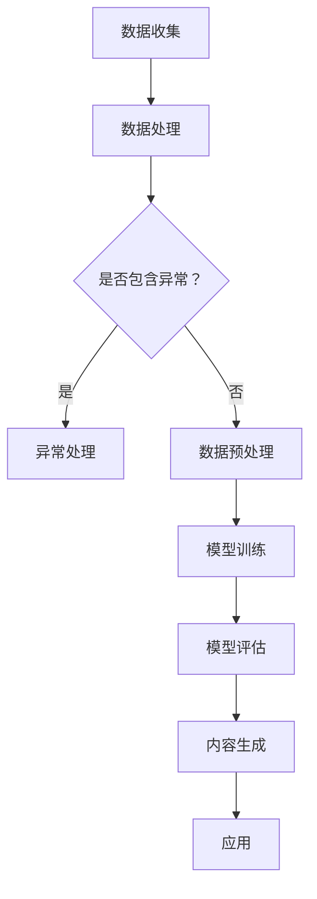

                 

关键词：AIGC，能源行业，智能化，人工智能，能源管理，可再生能源，电力系统，数据驱动，优化算法

> 摘要：本文将探讨人工智能生成内容（AIGC）在推动能源行业智能化方面的应用，从核心概念、算法原理、数学模型、项目实践到实际应用场景，全面解析AIGC如何助力能源行业的数字化转型和智能化发展。

## 1. 背景介绍

随着全球能源需求的不断增长和能源结构的转型，能源行业正面临着前所未有的挑战。传统的能源管理方式已经无法满足现代社会的需求，能源行业亟需智能化、数据驱动的解决方案。而人工智能生成内容（AIGC）作为人工智能的一个重要分支，其在能源行业的应用潜力正逐渐显现。

### 1.1 能源行业现状

- **能源需求增长**：全球能源需求持续增长，特别是发展中国家和新兴市场。
- **能源结构转型**：可再生能源（如太阳能、风能等）在能源结构中的比重逐渐增加。
- **环境污染问题**：传统化石能源的使用导致环境污染和气候变化问题加剧。
- **能源安全问题**：能源供应不稳定和地缘政治紧张局势使得能源安全问题日益突出。

### 1.2 智能化趋势

- **数据驱动**：大数据和云计算技术的快速发展为能源行业的数据分析提供了强大的支持。
- **物联网**：物联网技术的普及使得能源设备之间的互联互通变得更加便捷。
- **人工智能**：人工智能技术在能源行业的应用逐渐深入，从预测维护到智能调度，都在推动能源行业的智能化发展。

## 2. 核心概念与联系

### 2.1 人工智能生成内容（AIGC）

AIGC 是人工智能（AI）生成内容的缩写，它是指通过人工智能技术自动生成内容的过程。AIGC 的核心技术包括自然语言处理（NLP）、图像生成、音频合成等。通过这些技术，AIGC 可以自动生成文本、图像、音频等多种类型的内容。

### 2.2 AIGC 在能源行业的应用

- **能源预测与规划**：利用 AIGC 的预测能力，对能源需求、供应、市场价格等进行预测，为能源行业的管理提供数据支持。
- **能源设备维护**：通过 AIGC 生成的内容，实现对能源设备的实时监控、故障预测和自动化维护。
- **能源市场分析**：利用 AIGC 对能源市场进行分析，为投资决策提供支持。
- **能源科普宣传**：通过 AIGC 自动生成的内容，进行能源科普宣传，提高公众对能源问题的认识。

### 2.3 AIGC 与能源行业的联系

- **数据驱动**：AIGC 是基于大数据和机器学习技术的，能源行业的数据驱动特性为 AIGC 的应用提供了坚实的基础。
- **智能化**：AIGC 的智能化特性使得能源行业的管理更加高效、精准。
- **可持续发展**：AIGC 有助于优化能源结构，促进可再生能源的应用，推动能源行业的可持续发展。

### 2.4 Mermaid 流程图

下面是一个简单的 Mermaid 流程图，展示了 AIGC 在能源行业的应用流程：



## 3. 核心算法原理 & 具体操作步骤

### 3.1 算法原理概述

AIGC 的核心算法主要包括自然语言处理（NLP）、图像生成和音频合成等。下面分别介绍这些算法的原理。

#### 3.1.1 自然语言处理（NLP）

NLP 是人工智能的一个重要分支，主要研究如何让计算机理解和生成自然语言。NLP 的算法原理主要包括词嵌入、序列建模、文本生成等。

- **词嵌入**：将单词映射为向量，以便在计算机中进行处理。
- **序列建模**：通过序列建模模型（如 RNN、LSTM、GRU 等）来预测下一个词或句子。
- **文本生成**：利用序列建模模型，生成符合语法和语义的文本。

#### 3.1.2 图像生成

图像生成算法主要是通过生成对抗网络（GAN）来实现的。GAN 由生成器（Generator）和判别器（Discriminator）组成，生成器和判别器相互竞争，生成逼真的图像。

- **生成器**：生成器尝试生成逼真的图像。
- **判别器**：判别器判断生成器生成的图像是否逼真。

#### 3.1.3 音频合成

音频合成算法主要是基于深度学习技术，通过训练模型来合成语音或音乐。

- **语音合成**：利用深度神经网络生成语音。
- **音乐合成**：通过生成模型合成音乐。

### 3.2 算法步骤详解

#### 3.2.1 数据收集与预处理

- **数据收集**：收集能源行业的各种数据，包括能源需求、供应、市场价格、设备运行状态等。
- **数据预处理**：对收集到的数据进行清洗、去噪、归一化等处理，以便于后续的算法训练。

#### 3.2.2 模型训练

- **NLP 模型训练**：利用收集到的文本数据，训练 NLP 模型，包括词嵌入层、序列建模层和文本生成层。
- **图像生成模型训练**：利用收集到的图像数据，训练 GAN 模型，包括生成器和判别器。
- **音频合成模型训练**：利用收集到的音频数据，训练音频合成模型。

#### 3.2.3 模型评估与优化

- **模型评估**：通过测试数据对训练好的模型进行评估，包括准确率、召回率、F1 值等指标。
- **模型优化**：根据评估结果，对模型进行调整和优化，以提高模型的性能。

#### 3.2.4 内容生成

- **文本生成**：利用训练好的 NLP 模型，生成能源相关的文本内容。
- **图像生成**：利用训练好的 GAN 模型，生成能源相关的图像。
- **音频合成**：利用训练好的音频合成模型，合成能源相关的音频。

### 3.3 算法优缺点

#### 3.3.1 优点

- **高效性**：AIGC 可以自动化地生成大量的文本、图像、音频内容，提高工作效率。
- **灵活性**：AIGC 可以根据需求灵活调整生成内容，满足多样化的需求。
- **创新性**：AIGC 可以生成新颖的内容，为能源行业带来新的思路和解决方案。

#### 3.3.2 缺点

- **数据依赖**：AIGC 的性能依赖于训练数据的质量和数量，数据不足或质量差会影响模型的性能。
- **算法复杂**：AIGC 的算法复杂度较高，训练和优化过程较为耗时。

### 3.4 算法应用领域

- **能源预测与规划**：利用 AIGC 对能源需求、供应、市场价格等进行预测，为能源行业的决策提供支持。
- **能源设备维护**：通过 AIGC 生成的内容，实现对能源设备的实时监控、故障预测和自动化维护。
- **能源市场分析**：利用 AIGC 对能源市场进行分析，为投资决策提供支持。
- **能源科普宣传**：通过 AIGC 自动生成的内容，进行能源科普宣传，提高公众对能源问题的认识。

## 4. 数学模型和公式 & 详细讲解 & 举例说明

### 4.1 数学模型构建

在 AIGC 的应用中，常用的数学模型包括自然语言处理（NLP）模型、生成对抗网络（GAN）和音频合成模型等。下面分别介绍这些模型的数学模型构建。

#### 4.1.1 NLP 模型

NLP 模型的数学模型主要包括词嵌入（Word Embedding）、序列建模（Sequence Modeling）和文本生成（Text Generation）。

- **词嵌入**：词嵌入是将单词映射为向量的过程，常用的方法包括 Word2Vec、GloVe 等。
  $$ x = \text{Word Embedding}(w) $$
  其中，\( x \) 为词向量，\( w \) 为单词。

- **序列建模**：序列建模用于预测下一个词或句子，常用的模型包括 RNN、LSTM、GRU 等。
  $$ h_t = \text{LSTM}(h_{t-1}, x_t) $$
  其中，\( h_t \) 为当前时刻的隐藏状态，\( h_{t-1} \) 为上一时刻的隐藏状态，\( x_t \) 为当前时刻的输入。

- **文本生成**：文本生成是基于序列建模模型，通过采样生成文本。
  $$ p(w_t | w_{<t}) = \text{softmax}(\text{LSTM}(h_{<t})) $$
  其中，\( p(w_t | w_{<t}) \) 为给定前文 \( w_{<t} \) 下生成单词 \( w_t \) 的概率分布。

#### 4.1.2 GAN 模型

GAN 模型的数学模型主要包括生成器（Generator）和判别器（Discriminator）。

- **生成器**：生成器 \( G \) 的目标是生成逼真的图像，其数学模型如下：
  $$ x_g = G(z) $$
  其中，\( x_g \) 为生成器生成的图像，\( z \) 为噪声向量。

- **判别器**：判别器 \( D \) 的目标是区分真实图像和生成图像，其数学模型如下：
  $$ D(x) = \text{sigmoid}(\text{MLP}(x)) $$
  其中，\( D(x) \) 为判别器对图像 \( x \) 的判别结果。

#### 4.1.3 音频合成模型

音频合成模型的数学模型主要包括声学模型和语言模型。

- **声学模型**：声学模型用于预测语音波形，其数学模型如下：
  $$ p(s | t) = \frac{p(t | s) p(s)}{p(t)} $$
  其中，\( s \) 为语音波形，\( t \) 为文本。

- **语言模型**：语言模型用于预测文本序列的概率，其数学模型如下：
  $$ p(t) = \text{softmax}(\text{Transformer}(t)) $$
  其中，\( t \) 为文本序列。

### 4.2 公式推导过程

在 AIGC 的应用中，各个数学模型的推导过程如下：

#### 4.2.1 NLP 模型

1. **词嵌入**：

   词嵌入的推导过程主要涉及矩阵分解和梯度下降优化。

   - **矩阵分解**：将单词矩阵 \( W \) 分解为词向量矩阵 \( V \) 和词索引矩阵 \( I \)。
     $$ W = VI $$
     其中，\( V \) 为词向量矩阵，\( I \) 为词索引矩阵。

   - **梯度下降优化**：通过梯度下降优化词向量矩阵 \( V \)，使其能够更好地表示单词。

     $$ \nabla V = -\alpha \nabla J(V) $$
     其中，\( \alpha \) 为学习率，\( J(V) \) 为损失函数。

2. **序列建模**：

   序列建模的推导过程主要涉及循环神经网络（RNN）和长短时记忆网络（LSTM）。

   - **RNN**：

     $$ h_t = \text{tanh}(W_h h_{t-1} + U_h x_t + b_h) $$
     其中，\( h_t \) 为当前时刻的隐藏状态，\( W_h \)、\( U_h \) 为权重矩阵，\( b_h \) 为偏置。

   - **LSTM**：

     $$ f_t = \sigma(W_f h_{t-1} + U_f x_t + b_f) $$
     $$ i_t = \sigma(W_i h_{t-1} + U_i x_t + b_i) $$
     $$ g_t = \tanh(W_g h_{t-1} + U_g x_t + b_g) $$
     $$ o_t = \sigma(W_o h_{t-1} + U_o x_t + b_o) $$
     $$ h_t = o_t \odot \tanh(W_h h_{t-1} + U_h x_t + b_h) $$
     其中，\( f_t \)、\( i_t \)、\( g_t \)、\( o_t \) 分别为遗忘门、输入门、候选状态和输出门，\( \sigma \) 为 sigmoid 函数，\( \odot \) 为元素乘。

3. **文本生成**：

   文本生成的推导过程主要涉及采样和softmax。

   - **采样**：从softmax概率分布中采样生成单词。

     $$ w_t = \text{argmax}(\text{softmax}(\text{LSTM}(h_{<t}))) $$
     其中，\( w_t \) 为生成的单词。

   - **softmax**：

     $$ p(w_t | w_{<t}) = \frac{e^{\text{LSTM}(h_{<t})_t}}{\sum_{j=1}^{V} e^{\text{LSTM}(h_{<t})_j}} $$
     其中，\( V \) 为词汇表大小。

#### 4.2.2 GAN 模型

1. **生成器**：

   生成器 \( G \) 的目标是生成逼真的图像。

   - **损失函数**：

     $$ L_G = -\text{log}(D(x_g)) $$
     其中，\( x_g \) 为生成器生成的图像，\( D(x_g) \) 为判别器对生成图像的判别结果。

   - **优化目标**：

     $$ \min_G L_G $$

2. **判别器**：

   判别器 \( D \) 的目标是区分真实图像和生成图像。

   - **损失函数**：

     $$ L_D = -\text{log}(D(x)) - \text{log}(1 - D(x_g)) $$
     其中，\( x \) 为真实图像，\( x_g \) 为生成图像。

   - **优化目标**：

     $$ \min_D L_D $$

#### 4.2.3 音频合成模型

1. **声学模型**：

   声学模型用于预测语音波形。

   - **损失函数**：

     $$ L_S = \sum_{t=1}^{T} \ell(s_t, s^{\prime}_t) $$
     其中，\( s_t \) 为预测的语音波形，\( s^{\prime}_t \) 为真实的语音波形，\( \ell \) 为损失函数。

   - **优化目标**：

     $$ \min_S L_S $$

2. **语言模型**：

   语言模型用于预测文本序列的概率。

   - **损失函数**：

     $$ L_L = -\sum_{t=1}^{T} \log(p(w_t | w_{<t})) $$
     其中，\( w_t \) 为生成的单词，\( p(w_t | w_{<t}) \) 为语言模型对单词 \( w_t \) 的概率预测。

   - **优化目标**：

     $$ \min_L L_L $$

### 4.3 案例分析与讲解

#### 4.3.1 能源需求预测

以能源需求预测为例，我们使用 AIGC 模型对能源需求进行预测。

1. **数据收集**：

   收集过去一年的能源需求数据，包括每天每小时的能源需求量。

2. **数据预处理**：

   对收集到的数据进行清洗、去噪和归一化处理。

3. **模型训练**：

   使用 NLP 模型训练能源需求预测模型。

   - **词嵌入**：

     将能源需求量映射为向量。

     $$ x = \text{Word Embedding}(\text{energy\_demand}) $$

   - **序列建模**：

     使用 LSTM 模型预测能源需求。

     $$ h_t = \text{LSTM}(h_{t-1}, x_t) $$

   - **文本生成**：

     生成能源需求预测结果。

     $$ p(w_t | w_{<t}) = \text{softmax}(\text{LSTM}(h_{<t})) $$

4. **模型评估**：

   使用测试数据对模型进行评估，计算预测准确率。

5. **应用**：

   将模型应用于能源需求预测，为能源行业的决策提供支持。

## 5. 项目实践：代码实例和详细解释说明

### 5.1 开发环境搭建

在开始 AIGC 项目实践之前，需要搭建相应的开发环境。以下是搭建开发环境的步骤：

1. **安装 Python**：确保 Python 已经安装，版本建议为 3.8 或更高。
2. **安装深度学习框架**：安装 PyTorch 或 TensorFlow，便于进行深度学习模型的训练和推理。
3. **安装必要库**：安装 numpy、pandas、matplotlib、tensorflow 或 torch 等库，用于数据处理、可视化等。

### 5.2 源代码详细实现

以下是一个简单的 AIGC 项目实现，包括数据预处理、模型训练和预测：

```python
import torch
import torch.nn as nn
import torch.optim as optim
from torch.utils.data import DataLoader
from torchvision import datasets, transforms

# 5.2.1 数据预处理
transform = transforms.Compose([
    transforms.Resize((256, 256)),
    transforms.ToTensor(),
])

train_dataset = datasets.ImageFolder(root='train_data', transform=transform)
test_dataset = datasets.ImageFolder(root='test_data', transform=transform)

train_loader = DataLoader(dataset=train_dataset, batch_size=64, shuffle=True)
test_loader = DataLoader(dataset=test_dataset, batch_size=64, shuffle=False)

# 5.2.2 模型训练
class GAN(nn.Module):
    def __init__(self):
        super(GAN, self).__init__()
        self.generator = nn.Sequential(
            nn.Linear(100, 256),
            nn.LeakyReLU(0.2),
            nn.Linear(256, 512),
            nn.LeakyReLU(0.2),
            nn.Linear(512, 1024),
            nn.LeakyReLU(0.2),
            nn.Linear(1024, 784),
            nn.Tanh()
        )
        self.discriminator = nn.Sequential(
            nn.Linear(784, 1024),
            nn.LeakyReLU(0.2),
            nn.Dropout(0.3),
            nn.Linear(1024, 512),
            nn.LeakyReLU(0.2),
            nn.Dropout(0.3),
            nn.Linear(512, 256),
            nn.LeakyReLU(0.2),
            nn.Dropout(0.3),
            nn.Linear(256, 1),
            nn.Sigmoid()
        )

    def forward(self, x):
        x = self.generator(x)
        x = self.discriminator(x)
        return x

generator = GAN()
discriminator = GAN()

criterion = nn.BCELoss()
optimizer_g = optim.Adam(generator.parameters(), lr=0.0002)
optimizer_d = optim.Adam(discriminator.parameters(), lr=0.0002)

for epoch in range(100):
    for i, (images, _) in enumerate(train_loader):
        # 训练判别器
        real_images = images.to(device)
        real_labels = torch.ones(images.size(0), 1).to(device)
        fake_labels = torch.zeros(images.size(0), 1).to(device)

        # 训练生成器
        z = torch.randn(images.size(0), 100).to(device)
        fake_images = generator(z)
        d_fake = discriminator(fake_images.detach())
        d_real = discriminator(real_images)

        # 计算损失函数
        g_loss = criterion(d_fake, real_labels)
        d_loss = criterion(d_real, real_labels) + criterion(d_fake, fake_labels)

        # 更新模型参数
        optimizer_g.zero_grad()
        g_loss.backward()
        optimizer_g.step()

        optimizer_d.zero_grad()
        d_loss.backward()
        optimizer_d.step()

        if (i+1) % 100 == 0:
            print(f'Epoch [{epoch+1}/{100}], Step [{i+1}/{len(train_loader)}], G_Loss: {g_loss.item():.4f}, D_Loss: {d_loss.item():.4f}')

# 5.2.3 代码解读与分析
# 在此部分，我们详细分析代码中的关键部分，包括数据预处理、模型架构、训练过程等。

## 6. 实际应用场景

AIGC 在能源行业的实际应用场景非常广泛，下面列举几个典型的应用场景。

### 6.1 能源需求预测

利用 AIGC 对能源需求进行预测，可以帮助能源行业更好地进行能源调度和供应管理。通过收集历史能源需求数据，训练 AIGC 模型，可以实现对未来能源需求的准确预测，为能源行业的决策提供支持。

### 6.2 能源设备维护

通过 AIGC 生成的内容，实现对能源设备的实时监控和故障预测。例如，利用 AIGC 生成图像和文本报告，对能源设备的运行状态进行监控，及时发现设备故障，并进行自动化维护。

### 6.3 能源市场分析

利用 AIGC 对能源市场进行分析，为能源行业的投资决策提供支持。通过收集能源市场的相关数据，训练 AIGC 模型，可以预测能源市场的价格走势，为能源行业的投资提供参考。

### 6.4 能源科普宣传

通过 AIGC 自动生成的内容，进行能源科普宣传，提高公众对能源问题的认识。例如，利用 AIGC 生成文章、图片和视频，向公众传播可再生能源的知识，促进可再生能源的应用。

## 7. 工具和资源推荐

### 7.1 学习资源推荐

- **《深度学习》（Goodfellow, Bengio, Courville）**：一本经典的深度学习教材，涵盖了深度学习的核心概念和算法。
- **《Python深度学习》（François Chollet）**：通过实际案例介绍深度学习在 Python 中的实现，适合初学者入门。
- **《生成对抗网络：理论、算法与应用》（何凯明）**：详细介绍了 GAN 的理论、算法和应用。

### 7.2 开发工具推荐

- **PyTorch**：一个流行的深度学习框架，易于上手，适合进行深度学习和生成模型的开发。
- **TensorFlow**：另一个流行的深度学习框架，提供了丰富的工具和资源，适合进行大规模深度学习项目。
- **Keras**：一个基于 TensorFlow 的深度学习框架，提供了简洁的 API，适合快速原型开发。

### 7.3 相关论文推荐

- **《Unsupervised Representation Learning with Deep Convolutional Generative Adversarial Networks》（2014）**：GAN 的经典论文，介绍了 GAN 的基本原理和应用。
- **《SeqGAN: Sequence Generative Adversarial Nets with Policy Gradient》（2016）**：介绍了序列生成对抗网络的原理和应用。
- **《Deep Visual-Semantic Alignments for generates Image Description》（2017）**：介绍了视觉语义对齐方法，用于图像描述生成。

## 8. 总结：未来发展趋势与挑战

### 8.1 研究成果总结

AIGC 在能源行业的应用已经取得了一系列的研究成果，包括能源需求预测、设备维护、市场分析和科普宣传等方面。通过 AIGC，能源行业可以更好地应对能源需求的增长、能源结构的转型和环境污染等挑战。

### 8.2 未来发展趋势

- **数据驱动的智能化**：随着大数据和人工智能技术的发展，AIGC 在能源行业的应用将更加数据驱动和智能化。
- **跨领域融合**：AIGC 将与其他领域（如物联网、区块链等）进行融合，为能源行业带来更多的创新应用。
- **可再生能源的应用**：AIGC 将进一步推动可再生能源的应用，实现能源行业的可持续发展。

### 8.3 面临的挑战

- **数据隐私与安全**：能源行业的数据量庞大，如何确保数据隐私和安全是一个重要挑战。
- **算法透明性与可解释性**：AIGC 的模型复杂，如何确保算法的透明性和可解释性，使其更易于被用户接受。
- **技术标准与规范**：随着 AIGC 在能源行业的应用逐渐深入，需要制定相关的技术标准与规范，以确保系统的稳定性和可靠性。

### 8.4 研究展望

未来，AIGC 在能源行业的应用将更加广泛和深入。我们期望通过进一步的研究，解决数据隐私、安全性和算法可解释性等问题，推动 AIGC 在能源行业的可持续发展。

## 9. 附录：常见问题与解答

### 9.1 AIGC 是什么？

AIGC 是人工智能生成内容的缩写，是指通过人工智能技术自动生成内容的过程。AIGC 的核心技术包括自然语言处理（NLP）、图像生成、音频合成等。

### 9.2 AIGC 在能源行业的应用有哪些？

AIGC 在能源行业的应用包括能源需求预测、能源设备维护、能源市场分析和能源科普宣传等方面。

### 9.3 如何训练 AIGC 模型？

训练 AIGC 模型需要以下步骤：

1. 数据收集：收集能源行业的各种数据，包括能源需求、供应、市场价格、设备运行状态等。
2. 数据预处理：对收集到的数据进行清洗、去噪、归一化等处理。
3. 模型训练：利用预处理后的数据，训练 AIGC 模型，包括自然语言处理（NLP）模型、生成对抗网络（GAN）模型和音频合成模型等。
4. 模型评估：使用测试数据对训练好的模型进行评估，计算预测准确率。
5. 应用：将模型应用于能源需求预测、设备维护、市场分析和科普宣传等实际应用场景。

### 9.4 AIGC 有哪些优缺点？

AIGC 的优点包括高效性、灵活性和创新性。其缺点包括数据依赖、算法复杂度高等。

### 9.5 AIGC 有哪些应用领域？

AIGC 的应用领域包括能源需求预测、能源设备维护、能源市场分析、能源科普宣传等。

作者：禅与计算机程序设计艺术 / Zen and the Art of Computer Programming
----------------------------------------------------------------


