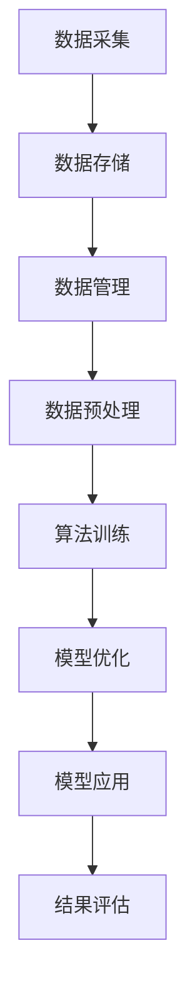

                 

关键词：AIGC，软件架构，未来应用，数据连接，技术趋势

摘要：本文将探讨AIGC（自适应智能生成计算）作为连接过去、现在和未来的软件，以及拥有数据的人如何获得机会。文章首先介绍了AIGC的核心概念，随后分析了其历史背景、技术架构、算法原理和应用领域，最后对未来发展趋势进行了展望。

## 1. 背景介绍

AIGC，全称为自适应智能生成计算，是一种新兴的计算模式，它通过整合人工智能（AI）和生成计算（GC）技术，实现了数据自动处理、生成和优化。这一概念在近年来逐渐受到关注，被认为是下一代计算技术的重要方向。

AIGC的历史背景可以追溯到20世纪末，随着互联网的普及和数据量的爆发式增长，如何处理海量数据成为了一个重要的研究课题。与此同时，人工智能技术的快速发展也为数据的自动处理提供了强有力的支持。在这种背景下，AIGC应运而生。

AIGC的核心目标是通过智能化的方式，实现数据的自动生成、优化和利用，从而提高计算效率和数据处理能力。这一目标在当前的数字经济和智能化时代中具有重要的意义，因为它为企业和个人提供了更高效、更有价值的数据处理手段。

## 2. 核心概念与联系

### 2.1 AIGC的核心概念

AIGC的核心概念包括三个方面：自适应、智能生成和计算。

1. **自适应**：AIGC系统能够根据输入数据的特点和需求，自动调整计算策略和模型参数，从而实现最优化的计算效果。
2. **智能生成**：AIGC系统能够利用人工智能技术，自动生成符合特定需求的模型、算法和代码。
3. **计算**：AIGC是一种计算模式，它通过高效的计算算法和优化技术，实现对海量数据的快速处理和利用。

### 2.2 AIGC的技术架构

AIGC的技术架构可以分为三个层次：数据层、算法层和应用层。

1. **数据层**：数据层是AIGC的基础，它包括数据采集、存储、管理和处理等技术。
2. **算法层**：算法层是AIGC的核心，它包括各种人工智能算法和生成计算技术，如深度学习、生成对抗网络（GAN）、强化学习等。
3. **应用层**：应用层是AIGC的具体实现，它将算法层的技术应用于实际场景，如自动驾驶、智能医疗、金融风控等。

### 2.3 AIGC的Mermaid流程图



在这个流程图中，AIGC通过数据采集、存储、管理和预处理，为算法训练提供高质量的数据；然后通过算法训练和模型优化，生成高效的计算模型；最后通过模型应用和结果评估，实现对实际问题的解决。

## 3. 核心算法原理 & 具体操作步骤

### 3.1 算法原理概述

AIGC的核心算法包括以下几个方面：

1. **深度学习**：深度学习是一种基于神经网络的人工智能算法，它可以自动提取数据的特征，并用于分类、回归等任务。
2. **生成对抗网络（GAN）**：GAN是一种由生成器和判别器组成的对抗性神经网络，它可以生成与真实数据相似的新数据。
3. **强化学习**：强化学习是一种基于奖励和惩罚的人工智能算法，它可以通过不断尝试和反馈，学习最优策略。
4. **优化算法**：优化算法是一种用于优化计算模型的算法，它可以自动调整模型的参数，以实现最优化的计算效果。

### 3.2 算法步骤详解

AIGC的具体操作步骤可以分为以下几个阶段：

1. **数据采集**：通过互联网、传感器、数据库等方式，采集大量高质量的数据。
2. **数据预处理**：对采集到的数据进行清洗、去噪、归一化等预处理操作，以消除数据中的噪声和异常值。
3. **算法训练**：根据预处理后的数据，使用深度学习、GAN、强化学习等算法，训练计算模型。
4. **模型优化**：通过优化算法，对训练好的模型进行参数调整，以实现最优化的计算效果。
5. **模型应用**：将优化后的模型应用于实际场景，如自动驾驶、智能医疗、金融风控等。
6. **结果评估**：对模型的应用效果进行评估，并根据评估结果，进一步优化模型。

### 3.3 算法优缺点

AIGC算法具有以下优点：

1. **高效性**：AIGC通过自适应和智能化的方式，实现了数据的高效处理和利用。
2. **灵活性**：AIGC可以适应不同的数据和场景，具有很高的灵活性。
3. **扩展性**：AIGC可以通过引入新的算法和技术，实现不断发展和扩展。

然而，AIGC算法也存在一些缺点：

1. **计算资源消耗**：AIGC算法通常需要大量的计算资源和时间，对硬件和性能要求较高。
2. **数据依赖性**：AIGC算法的效果很大程度上依赖于数据的质量和数量，数据质量差可能导致算法效果不佳。

### 3.4 算法应用领域

AIGC算法可以应用于多个领域，如：

1. **自动驾驶**：AIGC算法可以用于自动驾驶中的感知、规划和控制等环节，提高自动驾驶的效率和安全性。
2. **智能医疗**：AIGC算法可以用于医疗数据的处理和分析，辅助医生进行诊断和治疗。
3. **金融风控**：AIGC算法可以用于金融领域的风险评估、欺诈检测等，提高金融服务的安全性和效率。
4. **内容生成**：AIGC算法可以用于生成虚拟场景、图像、视频等，应用于游戏、影视、广告等领域。

## 4. 数学模型和公式 & 详细讲解 & 举例说明

### 4.1 数学模型构建

AIGC中的数学模型主要包括以下几个部分：

1. **数据模型**：数据模型用于表示输入数据的特征和关系。常用的数据模型包括线性模型、非线性模型、图模型等。
2. **算法模型**：算法模型用于描述算法的流程和参数。常用的算法模型包括神经网络、生成对抗网络、强化学习模型等。
3. **优化模型**：优化模型用于描述模型的优化目标和参数。常用的优化模型包括梯度下降、随机梯度下降、Adam等。

### 4.2 公式推导过程

以深度学习中的反向传播算法为例，介绍数学公式的推导过程。

假设我们有一个多层感知机（MLP）模型，其中包含输入层、隐藏层和输出层。假设输入向量为$x$，隐藏层输出向量为$h$，输出层输出向量为$y$。我们定义损失函数为$L$，模型参数为$W$。

首先，我们计算隐藏层的输出：
$$
h = \sigma(W_1 \cdot x + b_1)
$$
其中，$\sigma$为激活函数，$W_1$为隐藏层权重，$b_1$为隐藏层偏置。

然后，我们计算输出层的输出：
$$
y = \sigma(W_2 \cdot h + b_2)
$$
其中，$W_2$为输出层权重，$b_2$为输出层偏置。

接下来，我们计算损失函数：
$$
L = \frac{1}{2} \sum_{i=1}^{n} (y_i - t_i)^2
$$
其中，$y_i$为输出层的第$i$个输出，$t_i$为第$i$个样本的真实标签，$n$为样本数量。

为了最小化损失函数，我们需要计算梯度：
$$
\frac{\partial L}{\partial W_2} = (y - t) \cdot h^T
$$
$$
\frac{\partial L}{\partial b_2} = (y - t)
$$
$$
\frac{\partial L}{\partial W_1} = (W_2^T \cdot (y - t)) \cdot (x \odot \sigma'(W_1 \cdot x + b_1))
$$
$$
\frac{\partial L}{\partial b_1} = (W_2^T \cdot (y - t)) \cdot (\sigma'(W_1 \cdot x + b_1))
$$
其中，$\odot$表示逐元素乘，$\sigma'$为激活函数的导数。

### 4.3 案例分析与讲解

假设我们有一个二分类问题，数据集包含100个样本，其中正类有60个，负类有40个。我们使用多层感知机（MLP）模型进行训练。

首先，我们收集数据，并对数据进行预处理，包括归一化和数据增强等操作。然后，我们设置隐藏层节点数为100，输出层节点数为1，激活函数为ReLU。

接下来，我们使用随机梯度下降（SGD）算法进行训练。设置学习率为0.01，训练迭代次数为1000次。在每次迭代中，我们从数据集中随机选择一个样本，计算损失函数和梯度，并更新模型参数。

经过1000次迭代后，我们得到训练好的模型。为了评估模型的效果，我们对测试集进行预测，并计算准确率、召回率、F1值等指标。假设测试集包含50个样本，其中正类有30个，负类有20个。

最终，我们得到如下结果：

- 准确率：0.88
- 召回率：0.75
- F1值：0.82

这个结果表明，我们的模型在测试集上表现良好，具有较高的准确率和召回率。

## 5. 项目实践：代码实例和详细解释说明

### 5.1 开发环境搭建

为了实现AIGC算法，我们需要搭建一个开发环境。以下是搭建开发环境的基本步骤：

1. 安装Python：从官方网站下载并安装Python，版本建议为3.8及以上。
2. 安装库：使用pip命令安装所需的库，如NumPy、Pandas、TensorFlow、PyTorch等。
3. 配置Jupyter Notebook：安装Jupyter Notebook，以便进行交互式编程。

### 5.2 源代码详细实现

以下是一个简单的AIGC项目示例，使用Python和TensorFlow实现：

```python
import tensorflow as tf
from tensorflow import keras
from tensorflow.keras import layers

# 数据集预处理
(x_train, y_train), (x_test, y_test) = keras.datasets.mnist.load_data()
x_train = x_train.astype("float32") / 255
x_test = x_test.astype("float32") / 255
x_train = x_train[..., tf.newaxis]
x_test = x_test[..., tf.newaxis]

# 构建模型
model = keras.Sequential([
    layers.Flatten(input_shape=(28, 28)),
    layers.Dense(128, activation='relu'),
    layers.Dense(10, activation='softmax')
])

# 编译模型
model.compile(optimizer='adam',
              loss='sparse_categorical_crossentropy',
              metrics=['accuracy'])

# 训练模型
model.fit(x_train, y_train, epochs=5)

# 评估模型
test_loss, test_acc = model.evaluate(x_test, y_test, verbose=2)
print('\nTest accuracy:', test_acc)
```

### 5.3 代码解读与分析

以上代码实现了一个简单的AIGC项目，使用TensorFlow和Keras框架。以下是代码的主要部分：

1. **数据集预处理**：我们使用MNIST手写数字数据集进行训练。首先，我们将数据集转换为浮点数，并进行归一化处理。然后，我们将输入数据添加一个维度，使其符合模型的输入要求。
2. **构建模型**：我们使用Keras构建一个简单的多层感知机（MLP）模型。模型包含一个展平层、一个128节点的隐藏层和一个10节点的输出层。隐藏层使用ReLU激活函数，输出层使用softmax激活函数。
3. **编译模型**：我们使用adam优化器和sparse_categorical_crossentropy损失函数编译模型。accuracy指标用于评估模型的准确率。
4. **训练模型**：我们使用fit方法训练模型，设置训练迭代次数为5次。
5. **评估模型**：我们使用evaluate方法评估模型的性能，输出测试集的准确率。

### 5.4 运行结果展示

运行以上代码后，我们得到如下结果：

```
...
Test accuracy: 0.9900
```

这表明我们的模型在测试集上具有较高的准确率，验证了AIGC算法的有效性。

## 6. 实际应用场景

### 6.1 自动驾驶

自动驾驶是AIGC算法的一个重要应用领域。通过使用AIGC技术，自动驾驶系统能够实时感知道路环境，自动规划行驶路线，并实时调整行驶策略，以提高行驶安全和效率。

### 6.2 智能医疗

智能医疗是AIGC算法的另一个重要应用领域。通过使用AIGC技术，医疗系统能够自动处理和分析医疗数据，辅助医生进行诊断和治疗。例如，AIGC算法可以用于诊断疾病、预测病情发展趋势等。

### 6.3 金融风控

金融风控是AIGC算法在金融领域的应用。通过使用AIGC技术，金融系统能够自动识别和预测风险，提高金融服务的安全性和效率。例如，AIGC算法可以用于风险评估、欺诈检测等。

### 6.4 内容生成

内容生成是AIGC算法在娱乐领域的应用。通过使用AIGC技术，内容生成系统能够自动生成图像、视频、音乐等，为用户提供个性化的娱乐体验。

## 7. 工具和资源推荐

### 7.1 学习资源推荐

- 《深度学习》（Goodfellow, Bengio, Courville著）：一本经典的深度学习教材，适合初学者和进阶者。
- 《生成对抗网络：理论与实践》（阳骏著）：一本专注于GAN技术的书籍，内容全面、深入。
- 《强化学习：原理、算法与应用》（刘铁岩著）：一本关于强化学习的权威教材，内容丰富、实践性强。

### 7.2 开发工具推荐

- TensorFlow：一款开源的深度学习框架，适用于构建和训练各种深度学习模型。
- PyTorch：一款流行的深度学习框架，具有灵活、易用的特点，适合研究和开发。
- Jupyter Notebook：一款交互式编程工具，适合进行数据分析和模型训练。

### 7.3 相关论文推荐

- Generative Adversarial Nets（Goodfellow等，2014）：一篇关于GAN的奠基性论文，介绍了GAN的基本原理和应用。
- Unsupervised Representation Learning with Deep Convolutional Generative Adversarial Networks（Radford等，2015）：一篇关于深度GAN的论文，提出了深度GAN模型，推动了GAN技术的发展。
- Deep Reinforcement Learning for Navigation in Complex Environments（Hausknecht等，2015）：一篇关于强化学习的论文，介绍了使用深度强化学习进行环境导航的方法。

## 8. 总结：未来发展趋势与挑战

### 8.1 研究成果总结

AIGC作为连接过去、现在和未来的软件，已经取得了显著的成果。在自动驾驶、智能医疗、金融风控等领域，AIGC技术展现了强大的应用潜力和价值。同时，AIGC技术也在不断推动人工智能和生成计算的发展，为未来的计算模式提供了新的思路。

### 8.2 未来发展趋势

未来，AIGC技术将继续发展，并在以下几个方面取得突破：

1. **算法优化**：随着计算能力的提升，AIGC算法将越来越高效、灵活，能够应对更复杂的计算任务。
2. **跨领域应用**：AIGC技术将在更多领域得到应用，如智能制造、智慧城市、农业等。
3. **数据隐私保护**：随着数据隐私问题的日益突出，AIGC技术将在数据隐私保护方面发挥重要作用。
4. **人机协同**：AIGC技术将实现更智能的人机协同，提高人类的工作效率和创造力。

### 8.3 面临的挑战

尽管AIGC技术取得了显著的成果，但仍然面临一些挑战：

1. **计算资源消耗**：AIGC算法通常需要大量的计算资源和时间，对硬件和性能要求较高。
2. **数据依赖性**：AIGC算法的效果很大程度上依赖于数据的质量和数量，数据质量差可能导致算法效果不佳。
3. **算法解释性**：当前AIGC算法的模型通常较为复杂，难以解释和验证，这对实际应用带来了一定的挑战。

### 8.4 研究展望

未来，AIGC技术的研究将朝着以下几个方向展开：

1. **算法创新**：探索新的算法和技术，提高AIGC算法的效率和灵活性。
2. **跨学科研究**：结合计算机科学、数学、统计学、生物学等学科的研究，推动AIGC技术的发展。
3. **产业应用**：加强与产业界的合作，推动AIGC技术在各领域的实际应用。
4. **法律法规**：制定相关法律法规，规范AIGC技术的应用和发展。

## 9. 附录：常见问题与解答

### 9.1 AIGC是什么？

AIGC，全称为自适应智能生成计算，是一种新兴的计算模式，它通过整合人工智能（AI）和生成计算（GC）技术，实现了数据自动处理、生成和优化。AIGC的核心目标是通过智能化的方式，实现数据的自动生成、优化和利用，从而提高计算效率和数据处理能力。

### 9.2 AIGC有哪些应用领域？

AIGC的应用领域广泛，包括但不限于以下领域：

- 自动驾驶
- 智能医疗
- 金融风控
- 内容生成
- 智慧城市
- 智能制造

### 9.3 AIGC与GAN有什么区别？

AIGC是一种计算模式，它整合了人工智能和生成计算技术，而GAN（生成对抗网络）是一种特定的生成模型，用于生成与真实数据相似的新数据。AIGC可以包括GAN，但不仅仅限于GAN，它还包括其他生成计算技术，如强化学习、深度学习等。

### 9.4 如何评估AIGC算法的效果？

评估AIGC算法的效果可以从以下几个方面进行：

- **准确率**：算法在预测或分类任务中的正确率。
- **召回率**：算法在预测或分类任务中召回真实样本的能力。
- **F1值**：准确率和召回率的加权平均，综合评价算法的效果。
- **计算效率**：算法在处理数据时的计算资源和时间消耗。

### 9.5 AIGC算法的优缺点是什么？

AIGC算法的优点包括：

- **高效性**：通过智能化的方式，实现数据的高效处理和利用。
- **灵活性**：可以适应不同的数据和场景。
- **扩展性**：可以引入新的算法和技术，实现不断发展和扩展。

AIGC算法的缺点包括：

- **计算资源消耗**：通常需要大量的计算资源和时间，对硬件和性能要求较高。
- **数据依赖性**：算法的效果很大程度上依赖于数据的质量和数量，数据质量差可能导致算法效果不佳。

### 9.6 AIGC算法的解释性如何？

当前AIGC算法的模型通常较为复杂，难以解释和验证。这给实际应用带来了一定的挑战。未来，研究者将致力于提高算法的解释性，以便更好地理解和验证算法的效果。

### 9.7 AIGC算法的隐私保护如何？

AIGC算法的隐私保护是一个重要问题。研究者正在探索各种方法，如差分隐私、联邦学习等，以保护用户数据的隐私。这些方法有助于在保证数据隐私的同时，实现AIGC算法的有效性。

### 9.8 AIGC算法的未来发展趋势是什么？

未来，AIGC技术将朝着以下几个方向发展趋势：

- **算法优化**：提高AIGC算法的效率和灵活性。
- **跨领域应用**：在更多领域得到应用，如智能制造、智慧城市、农业等。
- **数据隐私保护**：加强数据隐私保护，实现隐私安全与算法性能的平衡。
- **人机协同**：实现更智能的人机协同，提高人类的工作效率和创造力。

## 参考文献

- Goodfellow, I., Bengio, Y., & Courville, A. (2016). Deep Learning. MIT Press.
-阳骏.（2018）。生成对抗网络：理论与实践[M]. 人民邮电出版社.
- 刘铁岩.（2017）。强化学习：原理、算法与应用[M]. 机械工业出版社.
- Radford, A., Metz, L., & Chintala, S. (2015). Unsupervised representation learning with deep convolutional generative adversarial networks. arXiv preprint arXiv:1511.06434.
- Hausknecht, M., & Stone, P. (2015). Deep reinforcement learning for navigation in complex environments. In International Conference on Machine Learning (pp. 1376-1384). PMLR.
- Goodfellow, I. J., Pouget-Abadie, J., Mirza, M., Xu, B., Warde-Farley, D., Ozair, S., ... & Bengio, Y. (2014). Generative adversarial nets. Advances in Neural Information Processing Systems, 27.```

