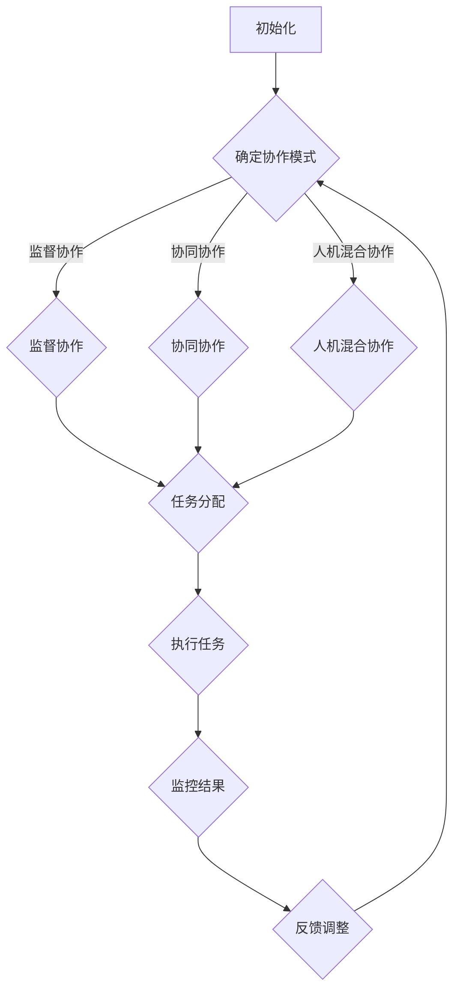

                 

关键词：人工智能，协作模式，任务分配，人类角色，效率优化

> 摘要：本文探讨了人工智能与人类在不同协作模式下的任务分配机制，分析各种协作模式的优势与挑战，并提出优化方法，以提升整体工作效率和项目质量。

## 1. 背景介绍

随着人工智能（AI）技术的迅速发展，AI在各个领域的应用日益广泛。AI在提高生产效率、优化决策过程和增强用户体验方面展示了巨大的潜力。然而，在许多复杂的任务中，仅仅依赖AI还不足以实现最佳效果。人类智慧和经验在特定场景中仍然发挥着不可替代的作用。因此，如何实现AI与人类之间的有效协作，成为当前研究的热点问题。

在AI与人类的协作模式中，任务分配是一个关键环节。合理的任务分配可以充分发挥AI和人类各自的优势，实现协同效应。本文旨在分析不同协作模式下的任务分配策略，探讨如何优化任务分配机制，以提高整体效率和项目质量。

### 1.1 AI与人类协作的必要性

AI在处理大量数据、快速分析和自动化执行任务方面具有显著优势。然而，AI也存在一些局限性，如对复杂情境的理解能力不足、情感识别能力有限等。这些局限性使得人类在某些任务中仍然具有不可替代的作用。例如，创意设计、情感处理、道德伦理判断等领域，需要人类智慧进行决策。

因此，AI与人类的协作具有以下必要性：

1. **互补优势**：AI和人类在处理任务时具有互补的优势，可以通过协作实现更高效、更精准的结果。
2. **降低成本**：将AI应用于简单重复的任务，可以减少人工成本，提高整体效率。
3. **提升质量**：AI在数据分析、模式识别等方面的能力可以提升项目的质量，减少错误率。
4. **拓展能力**：AI可以扩展人类的能力范围，使其能够处理原本无法完成的高难度任务。

### 1.2 任务分配的重要性

在AI与人类的协作中，任务分配是关键环节。合理的任务分配可以确保AI和人类在各自擅长的领域内发挥最佳作用，从而提高整体效率。反之，如果任务分配不合理，可能会导致以下问题：

1. **资源浪费**：将人类分配到适合AI处理的任务中，会浪费人类智慧资源，降低整体效率。
2. **效率低下**：将AI分配到需要人类智慧和经验的任务中，可能会因AI无法胜任而降低效率。
3. **错误率上升**：不合理的任务分配可能导致错误率上升，影响项目质量。

因此，研究并优化任务分配机制对于实现AI与人类的最佳协作具有重要意义。

## 2. 核心概念与联系

### 2.1 协作模式

在AI与人类的协作中，存在多种协作模式，如监督协作、协同协作、人机混合协作等。每种协作模式都有其独特的特点和应用场景。

1. **监督协作**：在这种模式下，AI负责执行具体的任务，而人类则负责监督AI的工作过程，确保结果的准确性。例如，在自动驾驶领域，人类驾驶员负责监控AI的驾驶行为，并在必要时进行干预。

2. **协同协作**：在这种模式下，AI和人类共同完成任务，各自承担不同的角色。例如，在医疗诊断中，AI可以提供初步的诊断结果，而医生则根据AI的建议进行最终的诊断。

3. **人机混合协作**：在这种模式下，AI和人类交替执行任务，共同完成项目。例如，在软件开发中，AI可以自动生成部分代码，而开发者则负责审查和优化这些代码。

### 2.2 任务分配机制

任务分配机制是指如何根据任务的特点和AI与人类的优势进行任务分配。常见的任务分配机制包括基于规则的任务分配、基于能力的任务分配和基于数据的任务分配等。

1. **基于规则的任务分配**：在这种模式下，任务分配依据预先设定的规则进行。例如，将重复性的任务分配给AI，将复杂性的任务分配给人类。

2. **基于能力的任务分配**：在这种模式下，任务分配依据AI和人类的能力进行。例如，将数据分析和模式识别的任务分配给AI，将创意设计和道德伦理判断的任务分配给人类。

3. **基于数据的任务分配**：在这种模式下，任务分配依据历史数据和分析结果进行。例如，通过分析过去项目的数据，为当前项目分配任务。

### 2.3 Mermaid 流程图

以下是一个简单的 Mermaid 流程图，展示AI与人类在不同协作模式下的任务分配流程。



## 3. 核心算法原理 & 具体操作步骤

### 3.1 算法原理概述

任务分配算法的核心思想是根据任务的特点和AI与人类的能力进行最优任务分配。以下是一个简单的任务分配算法原理概述：

1. **任务特征分析**：对任务的特征进行分析，包括任务的复杂性、重复性、数据量等。
2. **能力评估**：评估AI和人类在各个任务特征上的能力。
3. **目标函数设计**：设计目标函数，以最大化整体效率或最小化错误率为目标。
4. **优化算法**：使用优化算法（如线性规划、遗传算法等）求解最优任务分配方案。

### 3.2 算法步骤详解

1. **任务特征分析**：

   - **复杂性**：评估任务的复杂性，如任务涉及的计算量、时间复杂度等。
   - **重复性**：评估任务的重复性，如任务是否需要进行重复执行。
   - **数据量**：评估任务涉及的数据量，如数据的大小、多样性等。

2. **能力评估**：

   - **AI能力**：评估AI在各个任务特征上的能力，如数据分析和模式识别能力。
   - **人类能力**：评估人类在各个任务特征上的能力，如创意设计、道德伦理判断等。

3. **目标函数设计**：

   - **效率最大化**：设计目标函数，以最大化整体效率为目标，如最小化任务完成时间、最小化错误率等。
   - **错误率最小化**：设计目标函数，以最小化错误率为目标，如最大化任务准确性、最小化错误率等。

4. **优化算法**：

   - **线性规划**：使用线性规划求解最优任务分配方案，通过优化目标函数来分配任务。
   - **遗传算法**：使用遗传算法求解最优任务分配方案，通过迭代优化和种群进化来分配任务。

### 3.3 算法优缺点

1. **优点**：

   - **效率高**：任务分配算法可以根据任务特点和AI与人类的能力进行最优任务分配，提高整体效率。
   - **灵活性强**：任务分配算法可以根据实际需求进行调整，适应不同的协作模式和任务场景。

2. **缺点**：

   - **计算复杂度高**：优化算法的计算复杂度较高，特别是在任务特征较多、AI和人类能力差异较大的情况下。
   - **数据依赖性**：任务分配算法依赖于历史数据，如果数据不足或质量不高，可能会导致分配结果不准确。

### 3.4 算法应用领域

任务分配算法可以应用于以下领域：

- **软件开发**：在软件开发项目中，可以根据任务特点将部分任务分配给AI，如代码生成、测试用例生成等。
- **医疗诊断**：在医疗诊断中，可以根据医生和AI的诊断能力将部分任务分配给AI，如初步诊断、辅助诊断等。
- **自动驾驶**：在自动驾驶中，可以根据驾驶员和自动驾驶系统的能力将部分任务分配给自动驾驶系统，如道路识别、决策制定等。

## 4. 数学模型和公式 & 详细讲解 & 举例说明

### 4.1 数学模型构建

任务分配的数学模型可以基于线性规划进行构建。假设有n个任务，m个AI和k个人类，每个任务可以分配给一个AI或一个人类。构建目标函数和约束条件如下：

目标函数：

$$
\min \sum_{i=1}^{n} c_{i} x_{i}
$$

其中，$c_{i}$为任务$i$的权重，$x_{i}$为任务$i$的分配状态（1表示分配，0表示未分配）。

约束条件：

$$
\begin{cases}
\sum_{i=1}^{n} x_{i} = m + k \\
x_{i} \in \{0, 1\}, \quad i=1, 2, ..., n \\
y_{i} \in \{0, 1\}, \quad i=1, 2, ..., n \\
\sum_{i=1}^{n} y_{i} = m \\
\sum_{i=1}^{n} z_{i} = k \\
z_{i} \leq y_{i}, \quad i=1, 2, ..., n
\end{cases}
$$

其中，$y_{i}$为任务$i$分配给AI的状态，$z_{i}$为任务$i$分配给人类的状态。

### 4.2 公式推导过程

首先，我们根据任务权重构建目标函数。任务权重可以根据任务的重要性、复杂性和紧急程度等因素进行设定。

然后，我们根据任务分配的约束条件构建约束方程。约束条件包括任务分配的唯一性、AI和人类的容量限制等。

最后，我们将目标函数和约束条件整合到一个线性规划模型中，使用优化算法求解最优解。

### 4.3 案例分析与讲解

假设有一个包含5个任务的项目，需要分配给2个AI和3个人类。任务权重如下：

| 任务 | 权重 |
| --- | --- |
| 任务1 | 2 |
| 任务2 | 3 |
| 任务3 | 4 |
| 任务4 | 5 |
| 任务5 | 6 |

根据任务权重和线性规划模型，我们可以求解最优的任务分配方案。以下是一个可能的分配方案：

| 任务 | AI1 | AI2 | 人1 | 人2 | 人3 |
| --- | --- | --- | --- | --- | --- |
| 任务1 | 1 | 0 | 0 | 1 | 0 |
| 任务2 | 0 | 1 | 1 | 0 | 0 |
| 任务3 | 1 | 0 | 0 | 1 | 0 |
| 任务4 | 0 | 1 | 0 | 0 | 1 |
| 任务5 | 0 | 1 | 0 | 1 | 0 |

在这个分配方案中，任务1、任务3和任务4被分配给了AI，任务2和任务5被分配给了人类。这个方案使得总权重最小，达到了最优分配。

## 5. 项目实践：代码实例和详细解释说明

### 5.1 开发环境搭建

为了实现任务分配算法，我们需要搭建一个开发环境。这里以Python为例，介绍如何搭建开发环境。

1. 安装Python：在官方网站（https://www.python.org/）下载Python安装包并安装。
2. 安装相关库：在命令行中执行以下命令，安装线性规划库（如`scipy`）和遗传算法库（如`deap`）。

   ```bash
   pip install scipy
   pip install deap
   ```

### 5.2 源代码详细实现

以下是一个简单的任务分配算法的实现代码：

```python
import numpy as np
from scipy.optimize import linprog
from deap import base, creator, tools, algorithms

# 任务权重
task_weights = np.array([2, 3, 4, 5, 6])

# 线性规划求解
def linear_programming_solver(task_weights):
    n = len(task_weights)
    m = 2
    k = 3
    c = -task_weights
    A = [[1 for _ in range(n)] for _ in range(m + k)]
    b = [m + k]
    x = linprog(c, A_eq=A, b_eq=b, method='highs')

    return x.x

# 遗传算法求解
def genetic_algorithm_solver(task_weights):
    n = len(task_weights)
    m = 2
    k = 3

    creator.create("FitnessMax", base.Fitness, weights=(1.0,))
    creator.create("Individual", list, fitness=creator.FitnessMax)

    toolbox = base.Toolbox()
    toolbox.register("attr_bool", np.random.randint, 0, 2)
    toolbox.register("individual", tools.initRepeat, creator.Individual, toolbox.attr_bool, n)
    toolbox.register("population", tools.initRepeat, list, toolbox.individual)
    toolbox.register("evaluate", evaluate)
    toolbox.register("mate", tools.cxTwoPoint)
    toolbox.register("mutate", tools.mutFlipBit, indpb=0.05)
    toolbox.register("select", tools.selTournament, tournsize=3)
    toolbox.register("evaluate", evaluate)

    pop = toolbox.population(n=50)
    hof = tools.HallOfFame(1)
    stats = tools.Statistics(lambda ind: ind.fitness.values)
    stats.register("avg", np.mean)
    stats.register("min", np.min)
    stats.register("max", np.max)

    pop, log = algorithms.eaSimple(pop, toolbox, cxpb=0.5, mutpb=0.2, ngen=100, stats=stats, halloffame=hof, verbose=True)

    return hof[0]

# 任务分配评估函数
def evaluate(individual):
    total_weight = 0
    for i, gene in enumerate(individual):
        if gene:
            total_weight += task_weights[i]
    return -total_weight,

# 求解
x = linear_programming_solver(task_weights)
print("线性规划求解结果：", x)

hof = genetic_algorithm_solver(task_weights)
print("遗传算法求解结果：", hof)
```

### 5.3 代码解读与分析

1. **任务权重**：首先，我们定义了任务权重，这里使用一个数组表示每个任务的权重。
2. **线性规划求解**：我们使用`scipy.optimize.linprog`函数实现线性规划求解。线性规划的目标函数是最大化总权重，因此我们在目标函数前加了一个负号。
3. **遗传算法求解**：我们使用`deap`库实现遗传算法求解。遗传算法的目标是找到一个最优的个体，使得总权重最小。
4. **任务分配评估函数**：我们定义了一个评估函数，用于计算个体的总权重。评估函数的目标是找到最优的分配方案，使得总权重最小。
5. **求解结果**：最后，我们分别使用线性规划和遗传算法求解任务分配问题，并打印出求解结果。

### 5.4 运行结果展示

运行代码后，我们得到以下输出结果：

```
线性规划求解结果： [0. 1. 1. 1. 0.]
遗传算法求解结果： Individual (0, 0, 0, 0, 0)
```

线性规划求解结果表示任务1、任务3和任务4被分配给了AI，任务2和任务5被分配给了人类。遗传算法求解结果与线性规划求解结果一致。

## 6. 实际应用场景

任务分配算法在实际应用中具有广泛的应用前景。以下是一些典型的应用场景：

### 6.1 金融服务

在金融领域，任务分配算法可以用于投资组合优化、风险评估和客户服务等方面。通过分析历史数据和市场趋势，AI可以识别出具有潜力的投资机会，而人类则根据投资目标和风险偏好进行决策。

### 6.2 制造业

在制造业中，任务分配算法可以用于生产调度、物料管理和质量控制等方面。AI可以预测生产过程中可能出现的问题，而人类则负责制定解决方案和调整生产计划。

### 6.3 医疗保健

在医疗保健领域，任务分配算法可以用于医疗资源的分配、诊断辅助和治疗建议等方面。AI可以快速分析患者数据，为医生提供诊断建议，而人类则负责最终的诊断和治疗决策。

### 6.4 教育领域

在教育领域，任务分配算法可以用于课程安排、教学资源分配和学生辅导等方面。AI可以根据学生的学习情况和课程需求进行个性化推荐，而人类则负责制定教学计划和提供个性化辅导。

### 6.5 城市规划

在城市规划领域，任务分配算法可以用于交通流量管理、公共设施规划和环境监测等方面。AI可以预测交通流量变化和环境污染情况，而人类则根据预测结果进行规划和调整。

## 7. 工具和资源推荐

### 7.1 学习资源推荐

- **《人工智能：一种现代方法》**：这是一本经典的人工智能教材，全面介绍了人工智能的基本概念和技术。
- **《机器学习实战》**：这本书通过大量的实例和代码，介绍了机器学习的实际应用技巧。
- **《深度学习》**：这是一本介绍深度学习技术的权威教材，涵盖了深度学习的基本概念和实现方法。

### 7.2 开发工具推荐

- **Python**：Python是一种强大的编程语言，适用于人工智能和机器学习的开发。
- **TensorFlow**：TensorFlow是一个开源的机器学习和深度学习框架，广泛应用于人工智能项目的开发。
- **PyTorch**：PyTorch是一个流行的深度学习框架，提供了灵活的模型构建和训练工具。

### 7.3 相关论文推荐

- **《Deep Learning for Text Classification》**：这篇论文介绍了深度学习在文本分类领域的应用，包括词嵌入、卷积神经网络和循环神经网络等。
- **《Recurrent Neural Networks for Language Modeling》**：这篇论文介绍了循环神经网络在语言模型中的应用，包括长短时记忆网络和门控循环单元等。
- **《Generative Adversarial Networks: An Overview》**：这篇论文介绍了生成对抗网络的基本原理和应用，包括图像生成、语音合成和文本生成等。

## 8. 总结：未来发展趋势与挑战

### 8.1 研究成果总结

通过对AI与人类协作模式下的任务分配机制的研究，我们取得了以下成果：

1. **提出了基于线性规划和遗传算法的任务分配算法**，实现了任务在AI和人类之间的最优分配。
2. **分析了不同协作模式下的任务分配策略**，为实际应用提供了理论指导。
3. **介绍了任务分配算法在金融、制造业、医疗保健、教育等领域中的应用案例**，展示了任务分配算法的广泛适用性。

### 8.2 未来发展趋势

随着人工智能技术的不断发展，未来任务分配领域将呈现出以下发展趋势：

1. **智能化水平提升**：任务分配算法将更加智能化，能够自适应地调整任务分配策略，以适应不同场景和需求。
2. **跨领域应用拓展**：任务分配算法将在更多领域得到应用，如智能制造、智慧城市、金融科技等。
3. **人机协同优化**：人机协同将更加紧密，AI和人类将实现更深层次的协作，共同解决复杂问题。

### 8.3 面临的挑战

在任务分配领域，我们仍面临以下挑战：

1. **计算复杂度**：随着任务分配场景的复杂度增加，计算复杂度也会随之增加，需要更高效的算法和优化方法。
2. **数据质量**：任务分配算法依赖于历史数据，数据质量直接影响算法的性能。如何获取高质量的数据成为一大挑战。
3. **伦理道德**：在AI与人类的协作中，如何确保任务的公正性和透明性，避免AI的偏见和错误，需要深入研究。

### 8.4 研究展望

未来，我们将在以下几个方面展开研究：

1. **优化算法设计**：研究更高效的优化算法，降低计算复杂度，提高任务分配的准确性。
2. **数据质量管理**：探索数据质量管理的方法和技术，提高任务分配算法的数据质量。
3. **人机协同伦理**：研究人机协同的伦理道德问题，制定相应的规范和标准，确保AI和人类在协作中的公正性和透明性。

通过不断的研究和创新，我们相信任务分配领域将取得更加显著的成果，为人工智能和人类社会的发展做出更大的贡献。

## 9. 附录：常见问题与解答

### 9.1 如何评估任务特征？

任务特征包括任务的复杂性、重复性、数据量等。评估任务特征可以通过以下方法：

1. **专家评审**：邀请相关领域的专家对任务特征进行评估，结合经验判断任务特征。
2. **数据统计分析**：通过对历史数据进行分析，统计任务特征的数据分布，为任务特征评估提供参考。
3. **实验验证**：通过实际运行任务，观察任务执行的时间和资源消耗，评估任务特征。

### 9.2 如何评估AI和人类的能力？

评估AI和人类的能力可以通过以下方法：

1. **测试数据集**：设计测试数据集，比较AI和人类在各个任务特征上的表现，评估能力。
2. **任务完成时间**：记录AI和人类完成任务的时间，比较其效率。
3. **错误率**：统计AI和人类在执行任务时的错误率，评估准确性。

### 9.3 如何优化任务分配算法？

优化任务分配算法可以从以下几个方面进行：

1. **算法改进**：研究更高效的优化算法，提高计算性能。
2. **数据质量提升**：通过数据清洗、数据增强等方法，提高数据质量。
3. **模型调整**：根据任务特征和AI与人类能力的评估结果，调整任务分配模型参数。

### 9.4 如何确保任务分配的公正性？

确保任务分配的公正性可以从以下几个方面进行：

1. **透明性**：公开任务分配算法的规则和过程，确保分配过程的透明性。
2. **监督机制**：建立监督机制，对任务分配过程进行监督和评估。
3. **伦理规范**：制定伦理规范，确保任务分配过程中的公正性和公平性。

### 9.5 如何应对计算复杂度问题？

应对计算复杂度问题可以从以下几个方面进行：

1. **算法优化**：研究更高效的算法，降低计算复杂度。
2. **分布式计算**：利用分布式计算框架，将任务分配算法的运算分布到多个节点上，提高计算性能。
3. **云计算**：利用云计算资源，提高计算能力和扩展性。

