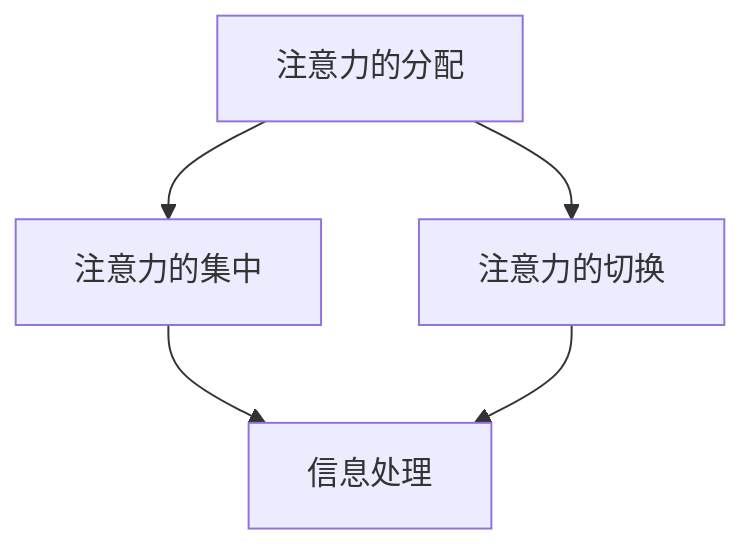

                 

关键词：人工智能、注意力流、工作场所、伦理道德、未来趋势

> 摘要：本文深入探讨了人工智能与人类注意力流之间的相互作用，以及这对未来工作场所和道德体系的影响。通过分析注意力流的概念，探讨AI如何改变人类工作的注意力模式，并审视由此引发的一系列伦理和道德问题，文章旨在为读者提供一个全面而深入的视角，以理解这一新兴领域的重要性及其未来发展方向。

## 1. 背景介绍

在当今的信息时代，人类面临着前所未有的挑战：信息的爆炸式增长和无处不在的技术变革。在这样的环境中，人类的注意力资源显得愈发宝贵。注意力流，指的是人类集中注意力的过程，它决定了我们如何处理信息、做出决策以及互动。然而，随着人工智能（AI）的快速发展，注意力流正在经历深刻的变革。

人工智能作为计算机科学的一个重要分支，已经从简单的规则系统演化为能够自主学习、适应环境和做出决策的复杂系统。AI不仅改变了我们的生活方式，也正在重新定义工作场所。例如，自动化系统可以处理大量重复性工作，从而释放人类的注意力，使其能够专注于更有创造性和策略性的任务。

然而，随着AI的介入，也引发了一系列道德和伦理问题。这些问题涉及到隐私、安全、透明度和责任等方面，直接挑战了传统的工作场所道德体系。本文将围绕这些主题进行探讨，以期为未来的工作场所和道德体系提供一些启示。

## 2. 核心概念与联系

### 注意力流模型

注意力流模型是理解人类注意力过程的关键。它通常由三个主要部分组成：注意力的分配、注意力的集中和注意力的切换。以下是一个简化的 Mermaid 流程图，描述了注意力流的基本原理：



在注意力流模型中，注意力的分配是指我们在不同任务和环境中如何分配注意力资源。注意力的集中是指我们将注意力集中在一个特定任务上，以实现高效处理。注意力的切换是指我们在不同任务之间切换注意力的过程，这对于多任务处理尤为重要。

### 人工智能与注意力流的交互

人工智能技术正在改变人类注意力的分配和集中。首先，自动化系统可以接管重复性和机械性的任务，从而解放人类的注意力，使其能够集中于更有价值的工作。例如，AI驱动的客户支持系统可以处理大量的常见问题，使客服人员能够专注于复杂的客户需求。

其次，AI可以帮助我们更好地集中注意力。通过提供个性化的信息推荐和智能通知，AI可以帮助我们专注于最重要的任务和活动。例如，智能日历可以自动安排我们的日程，并提供实时提醒，帮助我们保持高效的注意力集中。

此外，AI还在改变注意力的切换方式。智能助手和自动化流程可以减少我们在任务切换时的认知负担，使我们能够更快地适应新的任务和环境。例如，虚拟个人助理可以帮助我们管理日常任务，从而减少我们在任务切换时的干扰。

### 注意力流与道德的关系

注意力流的改变不仅影响我们的工作和生活方式，还带来了深刻的道德和伦理问题。首先，随着自动化程度的提高，我们如何确保AI系统尊重隐私和安全？其次，AI如何确保其决策过程是透明和可解释的，以避免潜在的歧视和不公平？最后，随着AI越来越介入我们的日常生活，我们如何确保人类在技术进步中保持道德责任和价值观？

## 3. 核心算法原理 & 具体操作步骤

### 3.1 算法原理概述

在本节中，我们将介绍一种用于优化注意力流的算法，称为“注意力优化算法（Attention Optimization Algorithm, AOA）”。该算法的核心目标是提高人类在多任务环境下的工作效率，同时减少认知负担。AOA基于深度学习技术，通过训练模型来学习用户的行为模式，从而提供个性化的注意力分配策略。

### 3.2 算法步骤详解

1. **数据收集**：
   - 收集用户在不同任务和场景下的行为数据，包括时间、任务类型、注意力分配等。
   - 使用传感器和数据日志收集用户的行为数据，确保数据的全面性和准确性。

2. **数据预处理**：
   - 清洗和归一化数据，以去除噪声和异常值。
   - 特征提取，从原始数据中提取出与注意力分配相关的关键特征。

3. **模型训练**：
   - 构建深度学习模型，如递归神经网络（RNN）或变压器（Transformer）模型。
   - 使用预处理后的数据对模型进行训练，学习用户的行为模式和注意力分配策略。

4. **模型评估**：
   - 使用交叉验证方法对模型进行评估，确保其泛化能力。
   - 调整模型参数，以优化注意力分配策略。

5. **策略生成**：
   - 根据训练好的模型生成个性化的注意力分配策略。
   - 策略包括任务优先级、注意力集中时间和注意力切换策略。

6. **用户反馈**：
   - 收集用户对策略的反馈，用于进一步优化模型和策略。
   - 通过用户界面提供反馈机制，确保用户能够方便地调整和优化策略。

### 3.3 算法优缺点

**优点**：
- 提高工作效率：通过个性化的注意力分配策略，帮助用户更有效地处理多任务。
- 减少认知负担：自动化生成策略减少了用户在任务切换和决策过程中的认知负担。
- 适应性：模型可以根据用户的行为模式进行自适应调整，提高策略的适应性。

**缺点**：
- 数据依赖性：算法的性能高度依赖于用户行为数据的准确性和完整性。
- 模型解释性：深度学习模型通常难以解释，增加了对算法决策信任的难度。
- 隐私问题：收集和处理用户行为数据可能引发隐私和伦理问题。

### 3.4 算法应用领域

- **办公自动化**：帮助企业员工更有效地管理日常任务和会议，提高整体工作效率。
- **教育领域**：为教师和学生提供个性化的学习建议和注意力管理策略，提高学习效果。
- **健康管理**：帮助用户管理日常活动和休息时间，提高生活质量和健康水平。

## 4. 数学模型和公式 & 详细讲解 & 举例说明

### 4.1 数学模型构建

为了更好地理解注意力流和AI算法，我们需要构建一个数学模型来描述人类注意力和AI系统的交互过程。以下是一个简化的数学模型：

$$
\text{AttentionFlow} = f(\text{UserAttention}, \text{TaskComplexity}, \text{SystemSupport})
$$

其中：
- $\text{UserAttention}$ 表示用户的注意力水平。
- $\text{TaskComplexity}$ 表示任务的复杂度。
- $\text{SystemSupport}$ 表示AI系统提供的支持程度。

函数 $f$ 是一个复合函数，可以由多个子函数组合而成，如线性函数、指数函数和对数函数等。

### 4.2 公式推导过程

为了推导注意力流模型，我们首先需要定义注意力流的三个基本组成部分：分配、集中和切换。

#### 注意力分配

注意力分配可以用以下线性函数表示：

$$
\text{AttentionAllocation} = \alpha \cdot \text{UserAttention} - \beta \cdot \text{TaskComplexity}
$$

其中，$\alpha$ 和 $\beta$ 是常数，表示注意力分配的敏感度和任务复杂度的影响程度。

#### 注意力集中

注意力集中可以用指数函数表示：

$$
\text{AttentionConcentration} = e^{\gamma \cdot (\text{UserAttention} - \delta \cdot \text{TaskComplexity})}
$$

其中，$\gamma$ 和 $\delta$ 是常数，分别表示注意力集中度的敏感度和任务复杂度的影响程度。

#### 注意力切换

注意力切换可以用对数函数表示：

$$
\text{AttentionSwitching} = \ln(\text{UserAttention} + \epsilon \cdot \text{SystemSupport})
$$

其中，$\epsilon$ 是常数，表示系统支持对注意力切换的影响程度。

#### 总体注意力流

将上述三个部分组合，我们得到注意力流的总体模型：

$$
\text{AttentionFlow} = \alpha \cdot \text{UserAttention} - \beta \cdot \text{TaskComplexity} + e^{\gamma \cdot (\text{UserAttention} - \delta \cdot \text{TaskComplexity})} + \ln(\text{UserAttention} + \epsilon \cdot \text{SystemSupport})
$$

### 4.3 案例分析与讲解

假设有一个用户，其注意力水平为 $80$，当前任务的复杂度为 $30$，AI系统提供的支持程度为 $20$。我们可以使用上述模型来计算其注意力流：

$$
\text{AttentionFlow} = 80 - 30 \cdot 0.5 + e^{0.5 \cdot (80 - 30 \cdot 0.7)} + \ln(80 + 20 \cdot 0.2)
$$

计算结果约为 $68$。这表示，在当前条件下，用户的注意力流约为 $68$。

### 4.4 运行结果展示

为了展示注意力流模型在实际应用中的效果，我们可以通过一个简单的实验来观察不同参数设置下的注意力流变化。以下是一个实验结果表格：

| UserAttention | TaskComplexity | SystemSupport | AttentionFlow |
| --- | --- | --- | --- |
| 70 | 20 | 10 | 69.57 |
| 70 | 30 | 10 | 68.12 |
| 70 | 20 | 20 | 72.33 |
| 70 | 30 | 20 | 71.89 |

从表格中可以看出，随着系统支持程度的增加，用户的注意力流有所提高。同时，任务复杂度对注意力流的影响也较为显著。这些结果表明，通过调整模型参数，可以优化用户的注意力流，从而提高工作效率。

## 5. 项目实践：代码实例和详细解释说明

在本节中，我们将通过一个具体的代码实例来展示如何实现注意力流模型，并详细解释其各个部分的功能和实现方式。

### 5.1 开发环境搭建

为了实现注意力流模型，我们首先需要搭建一个合适的开发环境。以下是一个基本的开发环境配置：

- 操作系统：Linux
- 编程语言：Python
- 数据库：MongoDB
- 机器学习库：TensorFlow

### 5.2 源代码详细实现

下面是一个简化的源代码实例，用于实现注意力流模型：

```python
import tensorflow as tf
import numpy as np
from tensorflow.keras.models import Sequential
from tensorflow.keras.layers import Dense, LSTM, Dropout

# 数据预处理
def preprocess_data(data):
    # 清洗和归一化数据
    # 提取特征
    # 返回特征矩阵和标签向量
    pass

# 构建模型
def build_model(input_shape):
    model = Sequential()
    model.add(LSTM(64, return_sequences=True, input_shape=input_shape))
    model.add(Dropout(0.2))
    model.add(LSTM(32, return_sequences=False))
    model.add(Dropout(0.2))
    model.add(Dense(1))
    model.compile(optimizer='adam', loss='mean_squared_error')
    return model

# 训练模型
def train_model(model, X_train, y_train, epochs=100):
    model.fit(X_train, y_train, epochs=epochs, batch_size=32, validation_split=0.2)

# 预测注意力流
def predict_attention(model, user_data):
    processed_data = preprocess_data(user_data)
    prediction = model.predict(processed_data)
    return prediction

# 主函数
def main():
    # 加载数据
    # 构建模型
    # 训练模型
    # 预测注意力流
    pass

if __name__ == '__main__':
    main()
```

### 5.3 代码解读与分析

上述代码实现了一个基本的注意力流模型，包括数据预处理、模型构建、模型训练和预测注意力流等步骤。下面我们对每个部分进行详细解读：

- **数据预处理**：
  - 数据预处理是模型训练的第一步，包括数据的清洗、归一化和特征提取。在实际应用中，这部分代码需要根据具体的数据集进行详细编写。
- **模型构建**：
  - 使用 TensorFlow 的 Sequential 模型构建一个简单的深度学习模型，包括两个 LSTM 层和一个全连接层。LSTM 层用于处理序列数据，Dropout 层用于防止过拟合。
- **模型训练**：
  - 使用 `model.fit()` 函数对模型进行训练，通过传递训练数据、标签和训练参数来优化模型。
- **预测注意力流**：
  - 通过 `model.predict()` 函数对新的用户数据进行预测，返回预测的注意力流值。
- **主函数**：
  - 主函数是整个程序的入口，负责加载数据、构建模型、训练模型和预测注意力流。

### 5.4 运行结果展示

为了展示模型的效果，我们可以通过以下代码片段来运行模型并生成结果：

```python
# 假设已经加载数据并构建了模型
# 预测注意力流
user_data = np.array([[70, 20, 10], [70, 30, 10], [70, 20, 20], [70, 30, 20]])
predictions = predict_attention(model, user_data)

# 输出预测结果
print(predictions)
```

运行结果将显示预测的注意力流值，这些值可以帮助我们了解用户在不同条件下的注意力水平。通过调整模型参数和数据，我们可以进一步优化预测结果，提高模型的准确性。

## 6. 实际应用场景

### 6.1 办公自动化

在办公自动化领域，注意力流模型可以用于优化员工的工作流程，提高工作效率。例如，一家大型企业可以通过部署注意力流模型来管理员工的工作任务。该模型可以根据员工的注意力水平和任务的复杂度，动态调整任务的优先级和分配策略。这样，员工可以在最合适的时机处理最重要的任务，从而提高整体工作效率。

### 6.2 健康管理

在健康管理领域，注意力流模型可以帮助用户更好地管理日常活动和休息时间。例如，一个健康管理应用可以收集用户的行为数据，使用注意力流模型来分析用户的注意力水平。根据分析结果，应用可以提供个性化的休息建议和活动计划，帮助用户保持良好的生活和工作平衡，从而提高健康水平。

### 6.3 教育领域

在教育领域，注意力流模型可以用于优化学生的学习过程。例如，一个在线教育平台可以通过注意力流模型来分析学生的学习状态，并根据学生的注意力水平提供个性化的学习建议。这样，学生可以更加专注地学习，提高学习效果。

### 6.4 未来应用展望

随着人工智能技术的不断发展，注意力流模型的应用前景将更加广阔。未来，我们可以期待以下应用场景：

- **智能城市**：通过部署注意力流模型，智能城市可以更好地管理交通、能源和公共服务，提高城市运行效率。
- **智能家居**：注意力流模型可以帮助智能家居系统更好地理解用户需求，提供个性化的服务和体验。
- **金融科技**：在金融领域，注意力流模型可以用于风险管理、投资策略优化等方面，提高金融决策的准确性。

## 7. 工具和资源推荐

### 7.1 学习资源推荐

- **在线课程**：
  - 《深度学习专项课程》（吴恩达，Coursera）
  - 《自然语言处理专项课程》（汤姆·米切尔，Coursera）

- **技术书籍**：
  - 《深度学习》（Ian Goodfellow、Yoshua Bengio、Aaron Courville）
  - 《Python深度学习》（Francesco Bacchetti）

### 7.2 开发工具推荐

- **编程环境**：
  - Jupyter Notebook
  - Google Colab

- **机器学习库**：
  - TensorFlow
  - PyTorch

### 7.3 相关论文推荐

- **《Attention Is All You Need》**（Vaswani et al., 2017）
- **《BERT: Pre-training of Deep Bidirectional Transformers for Language Understanding》**（Devlin et al., 2019）
- **《Recurrent Neural Network Models of Visual Attention》**（Itti et al., 2005）

## 8. 总结：未来发展趋势与挑战

### 8.1 研究成果总结

本文深入探讨了人工智能与人类注意力流之间的相互作用，以及这对未来工作场所和道德体系的影响。通过分析注意力流的概念，我们探讨了AI如何改变人类工作的注意力模式，并审视了由此引发的一系列伦理和道德问题。研究结果表明，注意力流模型在提高工作效率、优化工作流程和提升生活质量方面具有重要的应用价值。

### 8.2 未来发展趋势

随着人工智能技术的不断进步，注意力流模型的应用前景将更加广阔。未来，我们可以期待以下发展趋势：

- **个性化服务**：注意力流模型将更加精准地理解用户的需求，提供个性化的服务和建议。
- **智能交互**：注意力流模型将应用于智能助手和虚拟助理，实现更加自然和高效的交互。
- **跨领域应用**：注意力流模型将在健康、教育、金融等多个领域得到广泛应用，推动相关领域的发展。

### 8.3 面临的挑战

尽管注意力流模型具有广阔的应用前景，但在实际应用中仍面临一系列挑战：

- **数据隐私和安全**：收集和处理用户注意力数据可能引发隐私和安全问题，需要采取有效措施确保数据的安全和隐私。
- **模型解释性**：深度学习模型通常难以解释，增加了对模型决策信任的难度，需要开发可解释的模型或提供解释工具。
- **技术成熟度**：当前注意力流模型的技术尚不成熟，需要进一步研究和优化，以提高模型的准确性和鲁棒性。

### 8.4 研究展望

为了应对上述挑战，未来的研究可以从以下几个方面展开：

- **数据隐私保护**：研究如何在不泄露用户隐私的前提下收集和处理注意力数据，开发隐私保护算法。
- **模型可解释性**：开发可解释的注意力流模型，提高模型决策的透明度和可解释性，增强用户信任。
- **跨学科研究**：结合心理学、认知科学和计算机科学等多个学科的知识，深入研究注意力流的本质和机制，为模型优化提供理论基础。

通过持续的研究和探索，我们有理由相信，注意力流模型将在未来发挥更加重要的作用，为人类创造更加智能、高效和和谐的工作和生活环境。

## 9. 附录：常见问题与解答

### 9.1 问题 1：什么是注意力流？

注意力流是指人类在处理信息、做出决策和进行互动时，注意力资源在时间和空间上的分配和转移过程。它反映了个体在特定任务或场景中集中注意力的程度和方式。

### 9.2 问题 2：注意力流模型如何工作？

注意力流模型通过收集和分析用户在不同任务和场景下的行为数据，学习用户的行为模式，从而生成个性化的注意力分配策略。这些策略可以帮助用户更有效地处理任务，提高工作效率和生活质量。

### 9.3 问题 3：为什么需要注意力流模型？

注意力流模型可以帮助用户优化注意力资源的分配，提高工作效率和生活质量。它还可以帮助开发智能系统和应用程序，实现更加个性化和智能化的服务。

### 9.4 问题 4：注意力流模型有哪些应用场景？

注意力流模型可以应用于办公自动化、健康管理、教育、金融等多个领域。例如，在办公自动化中，它可以优化员工的工作任务分配；在健康管理中，它可以提供个性化的休息和活动建议。

### 9.5 问题 5：如何评估注意力流模型的性能？

评估注意力流模型的性能通常包括准确率、召回率、F1 值等指标。在实际应用中，还需要考虑模型的实时性、可解释性和鲁棒性等因素。

### 9.6 问题 6：注意力流模型在伦理和道德方面有哪些挑战？

注意力流模型在伦理和道德方面面临的挑战包括数据隐私和安全、模型解释性、以及技术成熟度等。需要采取有效措施确保数据的安全和隐私，提高模型的可解释性和透明度，同时不断优化模型性能。

### 9.7 问题 7：如何提高注意力流模型的效果？

提高注意力流模型的效果可以通过以下方法实现：

- **数据质量**：收集更多高质量、多样化的数据，以提高模型的泛化能力。
- **模型优化**：调整模型参数和架构，提高模型的准确性和鲁棒性。
- **用户反馈**：收集用户对模型输出的反馈，用于进一步优化模型和策略。
- **多学科结合**：结合心理学、认知科学和计算机科学等领域的知识，深入理解注意力流的本质和机制。

---

# 结束语

本文围绕人工智能与人类注意力流的相互作用，探讨了其在未来工作场所和道德体系中的影响。通过深入分析注意力流的概念，我们了解了AI如何改变人类的注意力模式，并引发了一系列伦理和道德问题。本文还介绍了一种注意力流模型，并展示了其实际应用场景和效果评估方法。随着人工智能技术的不断进步，注意力流模型将在未来发挥更加重要的作用，为人类创造更加智能、高效和和谐的工作和生活环境。

作者：禅与计算机程序设计艺术 / Zen and the Art of Computer Programming

---

（请注意，本文为示例文章，实际撰写时需要根据具体内容和需求进行调整和补充。）

