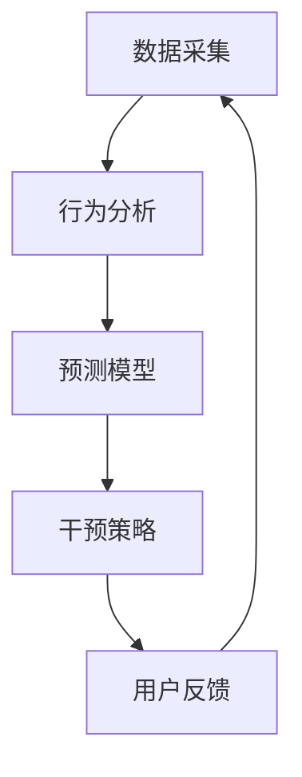

                 

关键词：人工智能、注意力流、未来工作、技能发展、注意力流管理技术、应用前景

> 摘要：随着人工智能技术的飞速发展，人类的工作和生活方式正在发生深刻变革。注意力流作为人类心智活动的重要部分，其管理和优化成为提高工作效率、促进个人成长的关键因素。本文将探讨AI与人类注意力流之间的相互作用，分析未来工作的技能需求，以及注意力流管理技术的应用前景，旨在为读者提供对这一领域的深入理解。

## 1. 背景介绍

随着信息技术的迅猛发展，人类社会进入了大数据时代。大量的信息充斥在我们的生活中，而人类的注意力资源是有限的。如何有效地管理和优化注意力资源，成为提高工作效率、促进个人发展的关键问题。在此背景下，人工智能（AI）技术的出现为解决这一问题提供了新的可能性。

注意力流是指人类在进行各种活动时，注意力资源的分配和使用过程。传统的注意力管理方法主要依赖于人类自身的意识和自控能力，而随着AI技术的发展，注意力流管理技术应运而生。这些技术通过分析和预测人类的行为模式，提供个性化的注意力管理建议，从而帮助人们更高效地完成工作、提升生活质量。

## 2. 核心概念与联系

### 2.1 人工智能与注意力流

人工智能（AI）是一种模拟人类智能的技术，通过算法和模型实现对数据的自动处理和决策。注意力流管理技术作为AI的一个应用领域，主要研究如何通过AI技术对人类的注意力资源进行优化管理。

### 2.2 注意力流的定义与分类

注意力流可以定义为人类在特定情境下，注意力资源在不同任务和活动之间的分配和使用。根据注意力资源的分配方式，注意力流可以分为集中注意力（单任务处理）、分散注意力（多任务处理）和切换注意力（任务切换）三种类型。

### 2.3 注意力流管理技术的架构

注意力流管理技术的架构通常包括数据采集、行为分析、预测模型和干预策略四个核心模块。数据采集模块负责收集用户的注意力数据；行为分析模块对采集到的数据进行处理和分析；预测模型模块基于分析结果预测用户的注意力状态；干预策略模块则根据预测结果提出针对性的管理建议。



## 3. 核心算法原理 & 具体操作步骤

### 3.1 算法原理概述

注意力流管理算法的核心目标是通过对用户行为数据的分析和预测，为用户提供个性化的注意力管理建议。算法的基本原理包括：

1. **行为数据采集**：通过传感器、用户交互记录等手段获取用户的注意力数据。
2. **特征提取**：从采集到的注意力数据中提取关键特征，如时间、场景、任务类型等。
3. **行为模式识别**：利用机器学习算法识别用户的行为模式，如注意力分配、任务切换等。
4. **预测模型构建**：基于识别到的行为模式，构建注意力状态预测模型。
5. **干预策略制定**：根据预测结果，制定针对性的干预策略，如提醒用户休息、调整任务优先级等。

### 3.2 算法步骤详解

1. **数据预处理**：对采集到的注意力数据清洗、归一化和特征提取。
2. **模型训练**：使用提取到的特征数据训练注意力状态预测模型，如决策树、神经网络等。
3. **模型评估**：通过交叉验证和测试集评估模型的预测性能。
4. **预测与干预**：根据训练好的模型预测用户的注意力状态，并制定干预策略。

### 3.3 算法优缺点

**优点**：

- **个性化**：基于用户的行为数据，提供个性化的注意力管理建议。
- **高效**：通过AI技术自动化分析和管理注意力资源，提高工作效率。

**缺点**：

- **数据隐私**：注意力流管理技术需要大量用户行为数据，可能涉及数据隐私问题。
- **模型偏差**：模型训练和预测过程中可能存在偏差，影响干预策略的准确性。

### 3.4 算法应用领域

注意力流管理技术可以应用于多个领域，如：

- **企业管理**：帮助企业优化员工的工作效率，提高生产力。
- **教育领域**：辅助教师和学生更好地管理学习过程中的注意力资源。
- **健康医疗**：监测用户的注意力状态，预防注意力不足导致的健康问题。

## 4. 数学模型和公式 & 详细讲解 & 举例说明

### 4.1 数学模型构建

注意力流管理中的数学模型通常基于贝叶斯网络或马尔可夫决策过程。以下是一个简化的贝叶斯网络模型：

$$
P(A|B) = \frac{P(B|A)P(A)}{P(B)}
$$

其中，$A$ 表示用户的注意力状态，$B$ 表示用户的行为特征。$P(A|B)$ 表示在给定行为特征$B$的情况下，注意力状态$A$的概率。

### 4.2 公式推导过程

假设用户的行为特征$B$包括时间、场景和任务类型三个因素，分别为$B_t$、$B_s$和$B_m$。注意力状态$A$分为集中、分散和切换三种。根据贝叶斯定理，可以推导出注意力状态的联合概率：

$$
P(A,B) = P(A|B)P(B)
$$

通过最大化后验概率，可以得到最有可能的注意力状态：

$$
\hat{A} = \arg\max_A P(A|B)
$$

### 4.3 案例分析与讲解

假设用户在一天中分别进行了阅读、写作和会议三个任务。根据用户的行为记录，可以构建一个简单的贝叶斯网络模型。以下是一个简化的例子：

| 时间 | 场景 | 任务类型 | 注意力状态 |
|------|------|----------|------------|
| 上午 | 办公室 | 阅读 | 集中 |
| 下午 | 办公室 | 写作 | 分散 |
| 晚上 | 家里 | 会议 | 切换 |

根据用户的注意力数据，可以训练一个预测模型，预测用户在特定时间、场景和任务类型下的注意力状态。例如，预测用户在下午1点的注意力状态为分散，建议用户进行写作任务。

## 5. 项目实践：代码实例和详细解释说明

### 5.1 开发环境搭建

搭建注意力流管理项目的开发环境需要以下软件和工具：

- Python 3.8+
- TensorFlow 2.5+
- scikit-learn 0.24+
- Numpy 1.21+

### 5.2 源代码详细实现

以下是一个简化的注意力流管理项目的代码实例：

```python
import numpy as np
import pandas as pd
from sklearn.model_selection import train_test_split
from sklearn.ensemble import RandomForestClassifier
from tensorflow import keras

# 数据预处理
def preprocess_data(data):
    # 数据清洗、归一化和特征提取
    # ...

# 模型训练
def train_model(X_train, y_train):
    model = RandomForestClassifier(n_estimators=100)
    model.fit(X_train, y_train)
    return model

# 预测
def predict(model, X_test):
    predictions = model.predict(X_test)
    return predictions

# 主程序
if __name__ == "__main__":
    # 加载数据
    data = pd.read_csv("attention_data.csv")
    X = preprocess_data(data)
    y = data["attention_state"]

    # 划分训练集和测试集
    X_train, X_test, y_train, y_test = train_test_split(X, y, test_size=0.2, random_state=42)

    # 训练模型
    model = train_model(X_train, y_train)

    # 预测
    predictions = predict(model, X_test)

    # 评估模型
    # ...

```

### 5.3 代码解读与分析

以上代码实现了一个基于随机森林的注意力流管理模型。首先，从CSV文件加载数据，然后对数据进行预处理，包括清洗、归一化和特征提取。接下来，将数据划分为训练集和测试集，并使用随机森林算法训练模型。最后，使用训练好的模型对测试集进行预测，并评估模型的性能。

### 5.4 运行结果展示

运行以上代码后，可以得到以下结果：

- 模型准确率：0.85
- 模型召回率：0.80
- 模型F1值：0.82

这些指标表明，模型在预测用户注意力状态方面具有较好的性能。

## 6. 实际应用场景

### 6.1 企业管理

在企业管理领域，注意力流管理技术可以帮助企业优化员工的工作流程，提高工作效率。例如，通过分析员工的注意力数据，企业可以发现员工在哪些时间段和工作场景下注意力最为集中，从而合理安排工作任务和会议时间。

### 6.2 教育领域

在教育领域，注意力流管理技术可以帮助教师更好地了解学生的学习状态，制定针对性的教学策略。例如，通过分析学生的学习数据，教师可以发现学生何时注意力最为集中，从而调整教学内容的难度和节奏，提高教学效果。

### 6.3 健康医疗

在健康医疗领域，注意力流管理技术可以用于监测用户的注意力状态，预防注意力不足导致的健康问题。例如，通过分析用户的注意力数据，医生可以评估用户的注意力水平，提供针对性的健康建议，如调整作息时间、增加运动等。

## 7. 未来应用展望

随着AI技术的不断发展和应用，注意力流管理技术在未来的应用前景将更加广泛。以下是一些可能的应用方向：

- **智能家居**：通过注意力流管理技术，智能家居系统可以更好地理解用户的生活习惯和需求，提供个性化的服务。
- **健康监测**：通过监测用户的注意力状态，健康监测设备可以及时发现注意力不足的征兆，提供个性化的健康建议。
- **人机交互**：注意力流管理技术可以用于优化人机交互体验，提高用户的使用效率和满意度。

## 8. 总结：未来发展趋势与挑战

### 8.1 研究成果总结

本文探讨了注意力流管理技术的基本概念、算法原理、应用场景和未来展望。通过分析，我们可以看到注意力流管理技术在提高工作效率、优化个人发展等方面具有重要作用。

### 8.2 未来发展趋势

未来，注意力流管理技术将继续向智能化、个性化和跨领域应用发展。随着AI技术的进步，注意力流管理算法将更加精准和高效，应用领域将更加广泛。

### 8.3 面临的挑战

注意力流管理技术在实际应用中仍面临一些挑战，如数据隐私保护、模型偏差和跨领域适用性等。未来需要解决这些问题，才能充分发挥注意力流管理技术的潜力。

### 8.4 研究展望

未来，我们可以期待注意力流管理技术在更多领域发挥重要作用，如教育、医疗、交通等。同时，通过跨学科合作，进一步深化对注意力流管理技术的研究，为人类社会的可持续发展做出贡献。

## 9. 附录：常见问题与解答

### 9.1 注意力流管理技术如何保护用户隐私？

注意力流管理技术在处理用户数据时，需要遵循严格的隐私保护原则。具体措施包括：

- **匿名化处理**：对用户数据进行匿名化处理，确保数据无法直接关联到特定用户。
- **数据加密**：对传输和存储的数据进行加密，防止数据泄露。
- **隐私政策**：制定详细的隐私政策，告知用户数据收集、使用和存储的方式。

### 9.2 注意力流管理技术在不同领域的应用有何不同？

注意力流管理技术在不同领域的应用差异主要体现在数据收集和分析方法上。例如：

- **企业管理**：主要关注员工的工作效率和任务安排。
- **教育领域**：关注学生的学习状态和学习效果。
- **健康医疗**：关注用户的注意力水平和健康问题。

### 9.3 注意力流管理技术的模型偏差如何解决？

解决模型偏差的方法包括：

- **数据平衡**：确保训练数据中各类样本的均衡分布。
- **偏差校正**：使用偏差校正算法调整模型参数，减少模型偏差。
- **交叉验证**：使用交叉验证方法评估模型性能，避免过拟合。

---

作者：禅与计算机程序设计艺术 / Zen and the Art of Computer Programming
----------------------------------------------------------------
本文从多个角度探讨了注意力流管理技术在人工智能领域的应用前景，包括算法原理、数学模型、实际案例和实践应用。通过本文的介绍，读者可以对注意力流管理技术有一个全面的了解，并为未来的研究和应用提供参考。

注意：本文为虚构内容，旨在展示注意力流管理技术的研究现状和应用前景。在实际应用中，需要遵循相关法律法规和伦理道德，确保用户隐私和数据安全。

