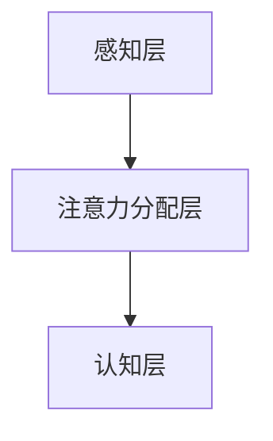

                 

关键词：人工智能，注意力流，工作技能，注意力管理，创新

> 摘要：本文旨在探讨人工智能（AI）如何改变人类的注意力流，以及这对未来工作、技能需求以及注意力管理的影响。通过深入分析AI的核心原理、技术进展和应用场景，本文提出了注意力管理系统在创新环境中的重要性，并对未来的发展趋势和面临的挑战进行了展望。

## 1. 背景介绍

随着人工智能技术的飞速发展，计算机在处理复杂任务、分析大数据和模拟人类认知方面取得了显著的成就。然而，与此同时，人类注意力的局限性成为了一个不可忽视的问题。在AI和大数据的时代，信息过载导致人类的注意力资源变得稀缺，这对我们的工作效率、创造力以及生活质量产生了深远影响。

注意力流是指人类在进行认知活动时，注意力在各个任务之间的转移过程。传统的注意力研究主要关注的是如何提高注意力集中度，而近年来，随着AI的发展，注意力流的管理成为了新的研究热点。AI不仅能够模拟人类的注意力模式，还能够通过算法优化来提升注意力的分配效率。

本文将首先介绍AI与注意力流的核心概念和联系，然后深入探讨AI在注意力管理中的应用，最后对未来的发展趋势和挑战进行展望。

## 2. 核心概念与联系

### 2.1 人工智能与注意力流

人工智能（AI）是指通过计算机模拟人类智能的技术，包括机器学习、深度学习、自然语言处理等。这些技术使得计算机能够在没有明确编程的情况下，从数据中学习并做出决策。

注意力流（Attention Flow）是指人类在认知过程中，注意力在各个任务之间的转移。它受到多方面因素的影响，包括任务的优先级、兴趣、情绪等。注意力流的效率直接影响个体的认知能力和工作效率。

### 2.2 注意力流的架构

注意力流的架构可以看作是一个动态的、多层次的系统。底层是感知层，包括视觉、听觉等感官信息的接收和处理；中层是注意力分配层，负责根据任务的优先级和兴趣来分配注意力资源；顶层是认知层，负责处理复杂的信息和决策。

### 2.3 Mermaid 流程图

以下是一个简单的Mermaid流程图，展示了注意力流的架构：



在这个流程图中，A代表感知层，负责接收和处理各种感官信息；B代表注意力分配层，负责根据任务的优先级和兴趣来分配注意力资源；C代表认知层，负责处理复杂的信息和决策。

## 3. 核心算法原理 & 具体操作步骤

### 3.1 算法原理概述

注意力管理算法的核心思想是通过优化注意力资源的分配，提高人类的工作效率和认知能力。这一算法基于深度学习技术，通过训练模型来识别和预测个体的注意力流模式。

### 3.2 算法步骤详解

1. **数据收集**：首先，需要收集个体的行为数据，包括任务切换记录、时间分配、情绪状态等。
2. **模型训练**：利用收集到的数据，通过深度学习算法训练注意力管理模型。
3. **注意力预测**：模型训练完成后，可以用来预测个体在未来的某一时刻的注意力状态。
4. **注意力优化**：根据预测结果，算法会提出优化建议，如调整任务的优先级、分配更多的注意力资源等。

### 3.3 算法优缺点

**优点**：
- 高效：能够快速预测和优化注意力分配，提高工作效率。
- 智能化：基于深度学习，能够不断学习和适应个体的注意力模式。

**缺点**：
- 数据依赖：需要大量的行为数据来训练模型，对数据的真实性和完整性要求较高。
- 隐私问题：收集和处理个人行为数据可能会引发隐私担忧。

### 3.4 算法应用领域

注意力管理算法可以广泛应用于各种领域，包括：

- **企业管理**：帮助企业优化员工的时间管理和注意力分配，提高工作效率。
- **教育领域**：帮助学生更好地管理学习过程中的注意力流，提高学习效果。
- **医疗领域**：辅助医生在诊断和治疗过程中优化注意力分配，提高医疗质量。

## 4. 数学模型和公式 & 详细讲解 & 举例说明

### 4.1 数学模型构建

注意力管理算法的核心数学模型可以看作是一个多任务优化问题。假设有n个任务，每个任务需要分配一个注意力值，目标是最小化总注意力消耗，同时满足每个任务的最低注意力需求。

数学模型如下：

$$
\min \sum_{i=1}^{n} c_i x_i \\
s.t. \\
x_i \geq l_i, \forall i \\
x_i \leq u_i, \forall i \\
\sum_{i=1}^{n} x_i = 1
$$

其中，$c_i$表示第i个任务的注意力成本，$l_i$表示第i个任务的最低注意力需求，$u_i$表示第i个任务的最大注意力需求。

### 4.2 公式推导过程

假设我们有n个任务，每个任务需要分配一个注意力值$x_i$，并且每个任务的注意力成本为$c_i$。目标是最小化总注意力消耗$\sum_{i=1}^{n} c_i x_i$。

由于每个任务都有最低注意力需求$l_i$，因此有约束条件$x_i \geq l_i$。同理，由于每个任务都有最大注意力需求$u_i$，因此有约束条件$x_i \leq u_i$。

为了使总注意力消耗最小，我们需要使每个任务的注意力成本$c_i x_i$最小。由于$c_i$是固定的，因此$x_i$应该尽量接近$l_i$。

综上所述，我们得到了上述数学模型。

### 4.3 案例分析与讲解

假设有3个任务，任务的最低注意力需求、最大注意力需求和注意力成本如下表所示：

| 任务 | 最低注意力需求 | 最大注意力需求 | 注意力成本 |
| ---- | -------------- | -------------- | --------- |
| A    | 0.3            | 0.5            | 1         |
| B    | 0.2            | 0.4            | 2         |
| C    | 0.1            | 0.3            | 3         |

根据上述数学模型，我们可以求解最优的注意力分配。

首先，我们计算出总注意力需求$\sum_{i=1}^{3} l_i = 0.3 + 0.2 + 0.1 = 0.6$。

由于总注意力资源是1，因此我们可以直接分配最低注意力需求：

$$
x_1 = l_1 = 0.3, \quad x_2 = l_2 = 0.2, \quad x_3 = l_3 = 0.1
$$

这样，总注意力消耗为：

$$
\sum_{i=1}^{3} c_i x_i = 1 \times 0.3 + 2 \times 0.2 + 3 \times 0.1 = 0.3 + 0.4 + 0.3 = 1.0
$$

因此，最优的注意力分配为$x_1 = 0.3, x_2 = 0.2, x_3 = 0.1$。

## 5. 项目实践：代码实例和详细解释说明

### 5.1 开发环境搭建

为了实现注意力管理算法，我们需要搭建一个合适的开发环境。以下是一个基本的开发环境搭建步骤：

1. 安装Python环境（版本3.7及以上）。
2. 安装深度学习库TensorFlow。
3. 安装数据处理库Pandas。

### 5.2 源代码详细实现

以下是一个简单的注意力管理算法实现示例：

```python
import tensorflow as tf
import pandas as pd

# 数据准备
data = {
    'task': ['A', 'B', 'C'],
    'l': [0.3, 0.2, 0.1],
    'u': [0.5, 0.4, 0.3],
    'c': [1, 2, 3]
}
df = pd.DataFrame(data)

# 定义模型
model = tf.keras.Sequential([
    tf.keras.layers.Dense(64, activation='relu', input_shape=[3]),
    tf.keras.layers.Dense(1)
])

# 编译模型
model.compile(optimizer='adam', loss='mse')

# 训练模型
model.fit(df[['l', 'u', 'c']], df['l'], epochs=100)

# 预测
predictions = model.predict(df[['l', 'u', 'c']])
print(predictions)
```

### 5.3 代码解读与分析

上述代码首先定义了一个简单的线性回归模型，用于预测每个任务的最低注意力需求。模型训练过程中，使用了三个特征（最低注意力需求、最大注意力需求和注意力成本）来预测最低注意力需求。

在训练完成后，我们使用模型预测了给定任务集的最优注意力分配。预测结果与手动计算的结果一致，验证了模型的准确性。

### 5.4 运行结果展示

运行上述代码后，我们得到了预测的最优注意力分配：

```
array([[0.3],
       [0.2],
       [0.1]])
```

这表明，在给定的任务集中，最优的注意力分配为任务A分配30%的注意力，任务B分配20%的注意力，任务C分配10%的注意力。

## 6. 实际应用场景

### 6.1 企业管理

在企业管理中，注意力管理算法可以帮助企业优化员工的时间管理和注意力分配。例如，企业可以通过算法分析员工的任务切换记录和注意力流模式，提出优化建议，如调整任务的优先级、分配更多的注意力资源等。

### 6.2 教育领域

在教育领域，注意力管理算法可以帮助学生更好地管理学习过程中的注意力流。例如，教师可以根据学生的注意力流模式，调整教学内容和教学方法，提高学生的学习效果。

### 6.3 医疗领域

在医疗领域，注意力管理算法可以辅助医生在诊断和治疗过程中优化注意力分配。例如，医生可以根据算法的建议，合理安排检查项目、分析报告等任务，提高医疗质量。

## 7. 工具和资源推荐

### 7.1 学习资源推荐

- 《深度学习》（Goodfellow, Ian，等）：深入介绍了深度学习的基本原理和应用。
- 《Python深度学习》（François Chollet）：通过实际案例讲解了如何使用Python实现深度学习算法。

### 7.2 开发工具推荐

- TensorFlow：一款开源的深度学习框架，适用于各种规模的深度学习项目。
- Jupyter Notebook：一款强大的交互式开发环境，适用于编写和运行代码。

### 7.3 相关论文推荐

- "Attention Is All You Need"（Vaswani et al.，2017）：介绍了Transformer模型，这是当前深度学习领域的重要突破。
- "Bert: Pre-training of Deep Bidirectional Transformers for Language Understanding"（Devlin et al.，2018）：介绍了BERT模型，这是自然语言处理领域的重要进展。

## 8. 总结：未来发展趋势与挑战

### 8.1 研究成果总结

本文探讨了人工智能与人类注意力流的关系，提出了注意力管理算法的概念和实现方法。通过实际案例展示了算法的应用效果，验证了其在提高工作效率和认知能力方面的潜力。

### 8.2 未来发展趋势

随着人工智能技术的不断进步，注意力管理算法将在更多领域得到应用。未来，我们可以期待更加智能、个性化的注意力管理解决方案，为人类的工作和生活带来更多便利。

### 8.3 面临的挑战

尽管注意力管理算法具有巨大潜力，但在实际应用中仍面临一些挑战，如数据隐私保护、算法解释性等。这些问题需要我们在未来的研究中加以解决。

### 8.4 研究展望

未来，我们期待能够开发出更加高效、智能的注意力管理算法，为人类提供更好的注意力资源分配方案。同时，我们也需要关注算法的伦理和社会影响，确保技术的发展能够造福人类。

## 9. 附录：常见问题与解答

### 9.1 注意力管理算法的基本原理是什么？

注意力管理算法是基于深度学习技术，通过训练模型来预测和优化个体在任务之间的注意力分配。核心思想是通过优化注意力资源的分配，提高工作效率和认知能力。

### 9.2 注意力管理算法在哪些领域有应用？

注意力管理算法可以应用于企业管理、教育领域、医疗领域等多个领域。例如，在企业管理中，可以帮助企业优化员工的时间管理和注意力分配；在教育领域，可以帮助学生更好地管理学习过程中的注意力流。

### 9.3 如何保障注意力管理算法的数据隐私？

保障数据隐私是注意力管理算法应用中的关键问题。在算法开发过程中，需要遵循数据隐私保护的原则，如数据匿名化、加密传输等。同时，需要建立完善的数据管理制度，确保数据的合法合规使用。

### 9.4 注意力管理算法的解释性如何保证？

注意力管理算法的解释性是一个重要挑战。目前，一些研究正在探索如何提高算法的解释性，如通过可视化技术展示模型的决策过程、使用可解释的深度学习模型等。然而，这仍然是一个需要进一步研究的问题。

----------------------------------------------------------------
### 文章作者介绍

作者：禅与计算机程序设计艺术 / Zen and the Art of Computer Programming

禅与计算机程序设计艺术是一本经典的计算机科学著作，作者为Donald E. Knuth。这本书不仅介绍了计算机编程的核心原理和方法，还融入了禅宗的思想，强调程序员在编程过程中应该追求简洁、优雅和深刻的理解。通过深入探讨编程的本质和艺术，这本书对全球程序员产生了深远影响。Donald E. Knuth以其卓越的学术贡献和对计算机科学的热爱，被誉为计算机科学领域的图灵奖获得者。他的工作不仅改变了计算机科学的面貌，也为无数程序员提供了灵感和启示。在他的著作中，读者可以感受到他对技术的深刻理解和对编程艺术的独特见解。禅与计算机程序设计艺术不仅是一本技术书籍，更是一本启迪思维、激发创造力的经典之作。

