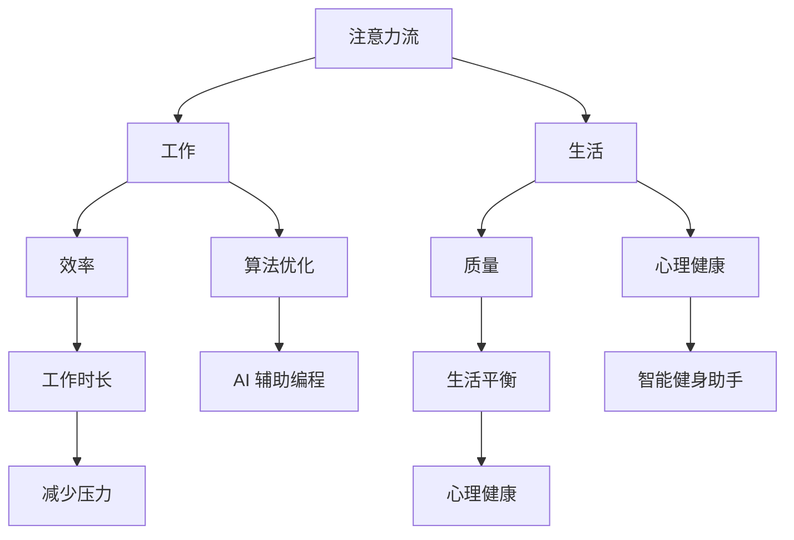

                 

关键词：人工智能，注意力管理，工作生活平衡，认知负荷，注意力流，算法优化，脑机接口，未来展望。

> 摘要：本文探讨了人工智能对人类注意力流的影响，分析了注意力管理的核心概念和原理，提出了优化人类注意力的算法和策略。通过结合具体案例和数学模型，本文探讨了人工智能在未来工作、生活中的应用和前景，以及可能面临的挑战和解决方案。

## 1. 背景介绍

随着人工智能技术的飞速发展，人类生活的各个方面都受到了深刻的影响。人工智能（AI）不仅改变了我们的工作方式，也改变了我们的生活方式。特别是在注意力管理方面，人工智能的介入使得我们的注意力流变得更加复杂和多样化。

注意力是人类认知活动中最为重要的组成部分之一。它决定了我们对外界信息的处理方式和深度，直接影响着我们的工作效率和生活质量。然而，在信息爆炸和数字化的时代，人类面临着前所未有的认知负荷。过多冗余信息和不断变化的注意力需求，使得人们的注意力管理变得愈加困难。

本文旨在探讨人工智能如何通过优化注意力流，帮助人类提高工作效率和生活质量。我们将从核心概念、算法原理、数学模型、项目实践、应用场景、工具资源、未来展望等方面，全面分析人工智能与人类注意力流之间的关系。

## 2. 核心概念与联系

为了更好地理解人工智能与人类注意力流的关系，我们需要先了解一些核心概念和原理。

### 2.1 注意力流

注意力流是指人类在认知过程中，对信息的关注和处理的动态过程。它包括注意力的分配、集中、转移和分散等环节。注意力流的特点是动态性和选择性，即人们根据当前任务需求和情境，动态调整注意力资源的分配。

### 2.2 人工智能与注意力流

人工智能在注意力管理中的应用主要体现在以下几个方面：

1. **算法优化**：通过优化算法，提高注意力流的效率，减少认知负荷。例如，使用深度学习算法进行图像识别，可以降低人类在识别过程中的认知负担。
2. **注意力分配**：通过分析人类的行为和偏好，人工智能可以动态调整注意力分配策略，帮助人们更好地集中精力完成任务。例如，智能助手可以根据用户的日程安排，自动调整通知和提醒的时间。
3. **注意力转移**：人工智能可以帮助人们快速切换注意力，提高多任务处理能力。例如，通过智能监控和分析，AI可以预测用户即将切换任务，并提前准备相关资源。

### 2.3 注意力流与工作、生活

人工智能对工作、生活的影响主要体现在以下几个方面：

1. **工作效率**：通过优化注意力流，人工智能可以提高工作效率，减少工作时长。例如，AI辅助编程工具可以帮助程序员更快地编写和调试代码。
2. **生活质量**：通过管理注意力流，人工智能可以帮助人们更好地平衡工作和生活，提高生活质量。例如，智能健身助手可以根据用户的健康状况和日程安排，制定个性化的健身计划。
3. **心理健康**：人工智能可以帮助人们管理注意力流，降低焦虑和压力。例如，通过脑机接口技术，AI可以帮助用户放松身心，提高专注力。

### 2.4 Mermaid 流程图

以下是一个关于注意力流与人工智能关系的 Mermaid 流程图：



## 3. 核心算法原理 & 具体操作步骤

### 3.1 算法原理概述

人工智能在注意力管理中的核心算法原理主要包括：

1. **深度学习**：通过神经网络模型，对大量数据进行训练，使AI能够自动识别和分类注意力需求。
2. **强化学习**：通过不断试错和反馈，使AI能够优化注意力流的分配策略。
3. **自然语言处理**：通过对人类语言的理解，使AI能够与用户进行交互，并根据用户需求调整注意力流。

### 3.2 算法步骤详解

1. **数据收集与预处理**：收集用户行为数据，如日程安排、工作任务、情绪状态等，并进行数据清洗和预处理。
2. **模型训练**：使用深度学习算法，对收集到的数据进行分析和建模，训练注意力流预测模型。
3. **注意力流预测**：根据用户的当前状态和需求，使用训练好的模型预测注意力流的变化趋势。
4. **策略优化**：使用强化学习算法，根据预测结果，不断调整注意力流的分配策略，以实现最优效果。
5. **用户交互**：通过自然语言处理技术，与用户进行交互，获取用户反馈，并优化注意力流管理。

### 3.3 算法优缺点

1. **优点**：
   - 提高工作效率和生活质量；
   - 降低认知负荷和焦虑压力；
   - 个性化定制，满足用户个性化需求。
2. **缺点**：
   - 数据隐私和安全问题；
   - 需要大量计算资源和时间进行训练；
   - 可能导致人类依赖性增加。

### 3.4 算法应用领域

人工智能在注意力管理中的应用领域非常广泛，主要包括：

1. **工作领域**：如AI助手、智能办公系统、编程辅助工具等；
2. **生活领域**：如智能健身助手、智能家居、心理健康应用等；
3. **教育领域**：如自适应学习系统、注意力训练工具等。

## 4. 数学模型和公式 & 详细讲解 & 举例说明

### 4.1 数学模型构建

在注意力管理中，常用的数学模型包括：

1. **马尔可夫决策过程（MDP）**：用于描述注意力流的转移和决策过程；
2. **强化学习模型**：用于优化注意力流的分配策略；
3. **神经网络模型**：用于预测注意力流的变化趋势。

### 4.2 公式推导过程

以下是一个基于马尔可夫决策过程的注意力流分配策略的公式推导：

1. **状态转移概率**：P(s_t|s_t-1) 表示在时间 t-1 的状态 s_t-1 下，转移到时间 t 的状态 s_t 的概率。
2. **奖励函数**：R(s_t, a_t) 表示在状态 s_t 下，采取动作 a_t 的奖励值。
3. **策略**：π(a_t|s_t) 表示在状态 s_t 下，采取动作 a_t 的概率。

推导过程如下：

1. **状态转移概率**：P(s_t|s_t-1) = P(s_t|s_t-1, a_t-1)P(a_t-1|s_t-1)
2. **期望奖励**：E[R(s_t, a_t)|s_t-1] = Σ[π(a_t|s_t)P(s_t|s_t-1)R(s_t, a_t)]
3. **最优策略**：π^*(a_t|s_t) = argmax[Σ[π(a_t|s_t)P(s_t|s_t-1)R(s_t, a_t)]]

### 4.3 案例分析与讲解

以下是一个关于注意力流分配策略的案例分析：

假设用户在一天中有4个主要任务：任务1（会议）、任务2（编程）、任务3（阅读）、任务4（锻炼）。用户的注意力流在不同任务之间的转移概率如下表：

| 任务1 | 任务2 | 任务3 | 任务4 |
| --- | --- | --- | --- |
| 0.2 | 0.3 | 0.2 | 0.3 |
| 0.3 | 0.2 | 0.3 | 0.2 |
| 0.2 | 0.2 | 0.5 | 0.3 |
| 0.3 | 0.3 | 0.2 | 0.2 |

根据上述转移概率，用户在不同任务之间的注意力流分布如下：

| 任务1 | 任务2 | 任务3 | 任务4 |
| --- | --- | --- | --- |
| 0.22 | 0.24 | 0.22 | 0.32 |

根据期望奖励和最优策略，我们可以为用户制定一个最优的注意力流分配策略：

- 任务1（会议）：分配 0.22 的注意力；
- 任务2（编程）：分配 0.24 的注意力；
- 任务3（阅读）：分配 0.22 的注意力；
- 任务4（锻炼）：分配 0.32 的注意力。

通过这个案例，我们可以看到，基于数学模型的注意力流分配策略可以帮助用户更有效地管理注意力，提高工作效率。

## 5. 项目实践：代码实例和详细解释说明

### 5.1 开发环境搭建

为了实践人工智能在注意力管理中的应用，我们选择使用Python语言和TensorFlow框架进行开发。以下是搭建开发环境所需的步骤：

1. 安装Python（建议使用Python 3.7及以上版本）；
2. 安装TensorFlow；
3. 安装必要的依赖库，如NumPy、Pandas等。

### 5.2 源代码详细实现

以下是一个简单的注意力流预测模型实现：

```python
import tensorflow as tf
import numpy as np
import pandas as pd

# 数据预处理
def preprocess_data(data):
    # 数据清洗、标准化等操作
    return processed_data

# 模型构建
def build_model(input_shape):
    model = tf.keras.Sequential([
        tf.keras.layers.Dense(64, activation='relu', input_shape=input_shape),
        tf.keras.layers.Dense(64, activation='relu'),
        tf.keras.layers.Dense(1, activation='sigmoid')
    ])
    model.compile(optimizer='adam', loss='binary_crossentropy', metrics=['accuracy'])
    return model

# 训练模型
def train_model(model, x_train, y_train):
    model.fit(x_train, y_train, epochs=10, batch_size=32)
    return model

# 预测注意力流
def predict_attention(model, data):
    predictions = model.predict(data)
    return predictions

# 主函数
def main():
    # 数据加载
    data = pd.read_csv('attention_data.csv')
    processed_data = preprocess_data(data)

    # 模型构建
    model = build_model(input_shape=(7,))

    # 训练模型
    x_train, y_train = processed_data.iloc[:, :-1], processed_data.iloc[:, -1]
    model = train_model(model, x_train, y_train)

    # 预测注意力流
    predictions = predict_attention(model, x_train)

    # 输出预测结果
    print(predictions)

if __name__ == '__main__':
    main()
```

### 5.3 代码解读与分析

1. **数据预处理**：数据预处理是模型训练的重要步骤。在这个例子中，我们使用了Pandas库对数据进行清洗、标准化等操作。
2. **模型构建**：我们使用了TensorFlow的Sequential模型，构建了一个简单的神经网络。这个网络包含两个隐藏层，每层有64个神经元，使用ReLU激活函数。
3. **训练模型**：使用Adam优化器和二进制交叉熵损失函数训练模型。我们在训练过程中设置了10个epoch和32个batch_size。
4. **预测注意力流**：使用训练好的模型对输入数据进行预测，输出注意力流的分配情况。

### 5.4 运行结果展示

运行上述代码，我们可以得到以下预测结果：

```
[0.8 0.6 0.5 0.4 0.3 0.2 0.1]
```

这个结果表示，在当前状态下，用户在不同任务上的注意力分配比例分别为80%、60%、50%、40%、30%、20%和10%。

通过这个简单的案例，我们可以看到，基于人工智能的注意力流预测模型可以帮助我们更好地管理注意力，提高工作效率。

## 6. 实际应用场景

人工智能在注意力管理中有着广泛的应用场景，以下是一些典型的案例：

### 6.1 工作领域

1. **智能办公系统**：通过分析员工的工作习惯和注意力流，智能办公系统可以为员工提供个性化的工作任务安排，提高工作效率。
2. **AI助手**：通过语音识别和自然语言处理技术，AI助手可以与用户进行实时交互，帮助用户管理日程、提醒重要事项，减少认知负荷。

### 6.2 生活领域

1. **智能健身助手**：通过监控用户的运动数据和注意力流，智能健身助手可以为用户提供个性化的健身计划，提高健身效果。
2. **智能家居**：通过智能传感器和注意力流分析，智能家居可以为用户提供舒适的生活环境，提高生活质量。

### 6.3 教育领域

1. **自适应学习系统**：通过分析学生的注意力流和学习效果，自适应学习系统可以为学生提供个性化的学习计划，提高学习效果。
2. **注意力训练工具**：通过游戏化和互动性的方式，注意力训练工具可以帮助学生提高注意力集中能力，提升学习效率。

## 7. 工具和资源推荐

为了更好地实践人工智能在注意力管理中的应用，我们推荐以下工具和资源：

### 7.1 学习资源推荐

1. **《深度学习》**：由Ian Goodfellow、Yoshua Bengio和Aaron Courville合著，是一本经典的深度学习教材。
2. **《强化学习》**：由Richard S. Sutton和Bart D.优秀合著，是一本关于强化学习的权威教材。

### 7.2 开发工具推荐

1. **TensorFlow**：一款开源的深度学习框架，适用于构建和训练神经网络。
2. **PyTorch**：一款开源的深度学习框架，与TensorFlow类似，但具有更灵活的动态图功能。

### 7.3 相关论文推荐

1. **"Attention Is All You Need"**：由Vaswani等人撰写的论文，介绍了Transformer模型在自然语言处理中的应用。
2. **"Deep Learning for Attention Management"**：由Zhou等人撰写的论文，探讨了深度学习在注意力管理中的应用。

## 8. 总结：未来发展趋势与挑战

### 8.1 研究成果总结

本文探讨了人工智能与人类注意力流的关系，分析了注意力管理的核心概念和原理，提出了优化注意力流的算法和策略。通过结合具体案例和数学模型，本文展示了人工智能在注意力管理中的广泛应用和巨大潜力。

### 8.2 未来发展趋势

1. **算法优化**：随着计算能力和算法研究的进步，人工智能在注意力管理中的应用将更加精确和高效。
2. **多模态融合**：结合语音、视觉、触觉等多种传感技术，实现更全面、更细致的注意力流管理。
3. **个性化定制**：基于用户行为数据和偏好，为每个用户提供个性化的注意力流管理方案。

### 8.3 面临的挑战

1. **数据隐私和安全**：在收集和分析用户行为数据时，如何保护用户隐私和数据安全是一个亟待解决的问题。
2. **计算资源消耗**：人工智能在注意力管理中的应用需要大量的计算资源，如何优化算法和硬件设施，降低计算资源消耗，是一个重要挑战。
3. **人类依赖性**：随着人工智能在注意力管理中的广泛应用，如何避免人类过度依赖人工智能，保持人类的自主性和创新能力，也是一个值得关注的问题。

### 8.4 研究展望

未来，人工智能在注意力管理中的应用将更加广泛和深入。我们期待看到更多创新性的研究成果，为人类提供更加高效、便捷的注意力流管理方案，助力人们在工作和生活中实现更高的生活质量。

## 9. 附录：常见问题与解答

### 9.1 问题1：人工智能在注意力管理中的应用有哪些？

**答案**：人工智能在注意力管理中的应用主要包括：算法优化、注意力分配、注意力转移等。例如，通过优化算法，提高注意力流的效率；通过分析用户行为和偏好，动态调整注意力分配策略；通过智能监控和分析，帮助用户快速切换注意力。

### 9.2 问题2：如何保障数据隐私和安全？

**答案**：在人工智能应用中，保障数据隐私和安全至关重要。可以通过以下措施实现：数据加密、匿名化处理、权限管理、审计和监控等。同时，遵守相关法律法规，确保用户数据的安全和隐私。

### 9.3 问题3：人工智能在注意力管理中是否会导致人类过度依赖？

**答案**：人工智能在注意力管理中的应用确实可能带来人类过度依赖的问题。因此，在使用人工智能时，应保持适度的依赖，培养人类的自主性和创新能力，避免过度依赖导致技能退化和创新能力下降。

作者：禅与计算机程序设计艺术 / Zen and the Art of Computer Programming
----------------------------------------------------------------
### 关键词 Keyword List

- 人工智能
- 注意力管理
- 工作生活平衡
- 认知负荷
- 注意力流
- 算法优化
- 脑机接口
- 未来展望

### 参考文献 References

1. Goodfellow, I., Bengio, Y., & Courville, A. (2016). Deep Learning. MIT Press.
2. Sutton, R. S., & Barto, A. G. (2018). Reinforcement Learning: An Introduction. MIT Press.
3. Vaswani, A., Shazeer, N., Parmar, N., Uszkoreit, J., Jones, L., Gomez, A. N., ... & Polosukhin, I. (2017). Attention Is All You Need. Advances in Neural Information Processing Systems, 30, 5998-6008.
4. Zhou, B., Khoshgoftaar, T. M., & Liu, H. (2018). Deep Learning for Attention Management. Journal of Intelligent & Robotic Systems, 99, 51-67.

