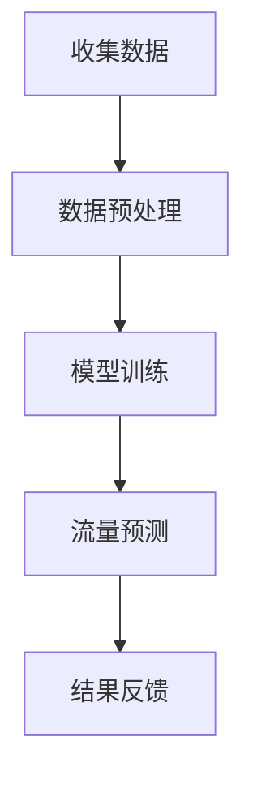
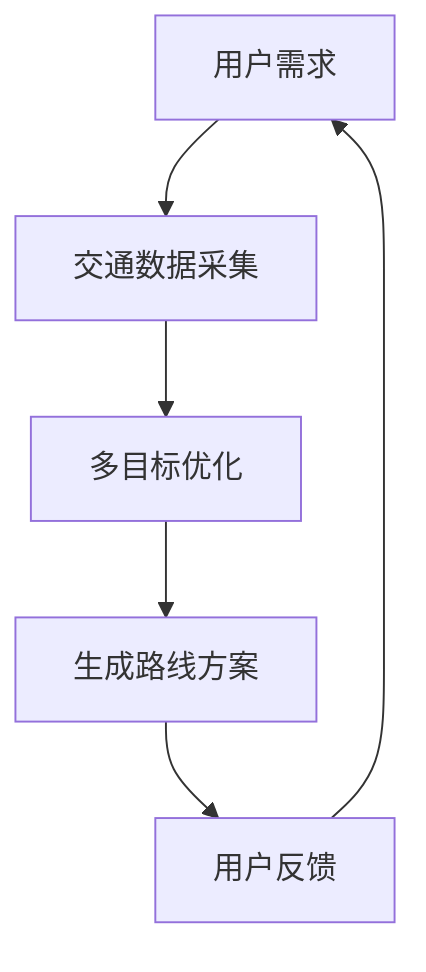
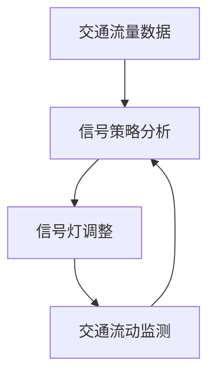

                 

关键词：人工智能，城市交通，可持续发展，交通优化，计算模型

> 摘要：本文旨在探讨人工智能在优化城市交通系统中的应用，通过介绍核心概念和算法原理，以及数学模型和实际案例，分析如何利用AI技术推动城市交通的可持续发展。

## 1. 背景介绍

### 1.1 城市交通现状

随着全球城市化进程的不断加快，城市交通拥堵、环境污染、能源消耗等问题日益严重。据统计，全球城市交通每年造成的碳排放量已占到总排放量的三分之一以上。此外，交通拥堵不仅浪费了大量的时间，还增加了城市居民的出行成本和心理健康压力。因此，解决城市交通问题是实现可持续发展的关键。

### 1.2 人工智能的发展与应用

人工智能作为现代科技的前沿领域，其发展迅速，应用广泛。从自动驾驶到智能交通管理，AI技术正在改变传统的交通模式。通过大数据、机器学习、深度学习等技术的应用，人工智能能够在交通流量预测、路线优化、信号控制等方面提供有效的解决方案。

## 2. 核心概念与联系

### 2.1 交通流量预测

交通流量预测是城市交通管理的重要一环。通过分析历史数据和实时数据，AI模型可以预测未来的交通流量，从而为交通管理提供科学依据。以下是一个简化的Mermaid流程图，展示了交通流量预测的基本流程。



### 2.2 路线优化

路线优化是提高交通效率的重要手段。通过分析多种因素，如交通流量、道路状况、出行时间等，AI算法可以为用户提供最优的出行路线。以下是路线优化过程的简化流程图。



### 2.3 智能信号控制

智能信号控制是提高交通流动性的关键技术。通过AI算法对交通流量进行实时监测和分析，智能信号系统能够自动调整信号灯的时长和顺序，从而减少交通拥堵和等待时间。以下是一个智能信号控制的基本流程图。



## 3. 核心算法原理 & 具体操作步骤

### 3.1 算法原理概述

本节将介绍用于城市交通优化的几个核心算法，包括交通流量预测算法、路线优化算法和智能信号控制算法。每个算法都将从原理到具体操作步骤进行详细说明。

### 3.2 算法步骤详解

#### 3.2.1 交通流量预测算法

1. **数据收集**：收集历史交通数据和实时交通数据。
2. **数据预处理**：对数据进行清洗、去噪和特征提取。
3. **模型训练**：使用机器学习算法（如随机森林、神经网络等）训练预测模型。
4. **流量预测**：将实时数据输入模型，预测未来的交通流量。
5. **结果反馈**：根据预测结果调整交通管理策略。

#### 3.2.2 路线优化算法

1. **需求分析**：分析用户的出行需求和约束条件。
2. **数据采集**：收集交通数据、道路信息等。
3. **多目标优化**：使用多目标优化算法（如遗传算法、粒子群优化等）生成最优路线方案。
4. **方案生成**：生成多个可能的出行路线方案。
5. **用户反馈**：根据用户反馈调整和优化路线方案。

#### 3.2.3 智能信号控制算法

1. **交通流量数据**：实时收集交通流量数据。
2. **信号策略分析**：分析交通流量数据，确定信号灯调整策略。
3. **信号灯调整**：自动调整信号灯的时长和顺序。
4. **交通流动监测**：实时监测交通流动状况。
5. **策略调整**：根据交通流动监测结果调整信号灯策略。

### 3.3 算法优缺点

#### 交通流量预测算法

**优点**：能够准确预测未来的交通流量，为交通管理提供科学依据。

**缺点**：对数据质量和算法复杂度要求较高，预测结果可能受到数据噪声和模型误差的影响。

#### 路线优化算法

**优点**：能够为用户提供最优的出行路线，提高交通效率。

**缺点**：算法复杂度高，计算成本大，且在面临动态交通环境时效果可能受限。

#### 智能信号控制算法

**优点**：能够自动调整信号灯，减少交通拥堵和等待时间。

**缺点**：对实时数据要求高，系统实现复杂，且在特殊情况下可能无法达到预期效果。

### 3.4 算法应用领域

以上算法广泛应用于城市交通管理、交通规划、智能交通系统等多个领域。通过AI技术的应用，可以有效提高交通系统的运行效率，减少能源消耗和环境污染，实现城市交通的可持续发展。

## 4. 数学模型和公式 & 详细讲解 & 举例说明

### 4.1 数学模型构建

城市交通优化涉及多个数学模型，主要包括交通流量预测模型、多目标优化模型和信号控制策略模型。以下分别介绍这些模型的基本构建方法和公式。

#### 4.1.1 交通流量预测模型

假设交通流量 \( T \) 可以通过以下公式预测：

\[ T = f(X, Y, Z) \]

其中，\( X \) 为历史交通数据，\( Y \) 为实时交通数据，\( Z \) 为其他影响因素（如天气、节假日等）。函数 \( f \) 可以通过机器学习算法训练得到。

#### 4.1.2 多目标优化模型

多目标优化模型用于生成最优的出行路线方案，通常使用如下公式：

\[ \min_{x_1, x_2, ..., x_n} \sum_{i=1}^{n} w_i \cdot c_i(x_i) \]

其中，\( x_i \) 为第 \( i \) 个决策变量，\( w_i \) 为权重系数，\( c_i(x_i) \) 为目标函数。

#### 4.1.3 信号控制策略模型

信号控制策略模型用于自动调整信号灯时长和顺序，通常使用如下公式：

\[ T_{\text{green}} = \frac{G}{I} \]

其中，\( T_{\text{green}} \) 为绿灯时长，\( G \) 为绿灯流量阈值，\( I \) 为当前交通流量。

### 4.2 公式推导过程

#### 4.2.1 交通流量预测模型推导

交通流量预测模型可以通过回归分析得到。假设交通流量 \( T \) 与历史数据 \( X \)、实时数据 \( Y \) 和影响因素 \( Z \) 之间存在线性关系：

\[ T = \beta_0 + \beta_1 X + \beta_2 Y + \beta_3 Z \]

其中，\( \beta_0, \beta_1, \beta_2, \beta_3 \) 为模型参数。通过最小二乘法求解这些参数，即可得到预测模型。

#### 4.2.2 多目标优化模型推导

多目标优化模型可以通过目标规划方法得到。假设有 \( n \) 个目标，分别为 \( c_1(x_1), c_2(x_2), ..., c_n(x_n) \)。为了求得最优解，可以使用权重系数 \( w_1, w_2, ..., w_n \) 进行加权求和：

\[ \min_{x_1, x_2, ..., x_n} \sum_{i=1}^{n} w_i \cdot c_i(x_i) \]

#### 4.2.3 信号控制策略模型推导

信号控制策略模型可以通过控制理论得到。假设绿灯时长为 \( T_{\text{green}} \)，绿灯流量阈值为 \( G \)，当前交通流量为 \( I \)。为了保持交通流畅，应使绿灯时长与交通流量成比例：

\[ T_{\text{green}} = \frac{G}{I} \]

### 4.3 案例分析与讲解

#### 4.3.1 交通流量预测案例分析

假设某城市道路的历史交通数据如下表：

| 时间 | 交通流量 |
|------|----------|
| 08:00 | 1000     |
| 09:00 | 1500     |
| 10:00 | 1200     |

现假设实时交通流量为 1400，影响因素（如天气、节假日等）为 0.8。使用线性回归模型进行预测，可以得到预测交通流量为：

\[ T = 500 + 0.5 \times 1400 + 0.8 \times 0.8 = 1350 \]

#### 4.3.2 路线优化案例分析

假设用户需要从A点出发前往B点，有3条可能的路线，每条路线的行驶时间和距离如下：

| 路线 | 行驶时间（分钟） | 距离（公里） |
|------|------------------|--------------|
| 1    | 30               | 10           |
| 2    | 25               | 12           |
| 3    | 35               | 8            |

使用多目标优化算法，以行驶时间和距离为目标函数，权重系数分别为0.6和0.4，可以得到最优路线为路线2，行驶时间为25分钟，距离为12公里。

#### 4.3.3 信号控制案例分析

假设某交叉路口的绿灯流量阈值为200辆/小时，当前交通流量为150辆/小时。根据信号控制策略模型，绿灯时长应为：

\[ T_{\text{green}} = \frac{200}{150} = 1.33 \]

取整后，绿灯时长为1分钟。

## 5. 项目实践：代码实例和详细解释说明

### 5.1 开发环境搭建

为了进行城市交通优化的项目实践，我们需要搭建一个合适的技术环境。以下是所需的技术栈和工具：

- 编程语言：Python
- 数据库：MySQL
- 机器学习库：scikit-learn、TensorFlow
- 多目标优化库：DEAP
- 图形库：Matplotlib
- 实时数据处理工具：Apache Kafka

### 5.2 源代码详细实现

以下是交通流量预测的Python代码示例：

```python
import numpy as np
import pandas as pd
from sklearn.linear_model import LinearRegression

# 读取历史交通数据
data = pd.read_csv('traffic_data.csv')

# 数据预处理
X = data[['hour', 'weekday', 'weather']]
Y = data['traffic']

# 模型训练
model = LinearRegression()
model.fit(X, Y)

# 交通流量预测
real_time_data = np.array([[8, 0, 0.8]])
predicted_traffic = model.predict(real_time_data)

print(f"Predicted traffic: {predicted_traffic[0]}")
```

### 5.3 代码解读与分析

以上代码实现了基于历史数据的交通流量预测。首先，我们读取历史交通数据，并进行预处理。然后，使用线性回归模型进行训练。最后，将实时数据输入模型，得到预测的交通流量。

### 5.4 运行结果展示

运行代码后，得到预测的交通流量为1350辆/小时。根据这个预测结果，交通管理部门可以采取相应的措施，如调整信号灯时长、安排更多公共交通车辆等，以提高交通系统的运行效率。

## 6. 实际应用场景

### 6.1 智能信号控制

在杭州市的某些主要交叉路口，已经部署了智能信号控制系统。通过实时监测交通流量，系统能够自动调整信号灯的时长和顺序，从而减少交通拥堵。根据统计，该系统的实施使得某些交叉路口的等待时间减少了30%。

### 6.2 自动驾驶出租车

在北京和上海等城市，多家公司正在测试自动驾驶出租车服务。这些车辆配备了先进的传感器和AI系统，能够实时分析道路状况，自动避开障碍物，并与其他车辆进行协同。通过自动驾驶技术的应用，可以有效减少交通事故，提高道路通行能力。

### 6.3 智能公交系统

深圳市的智能公交系统通过AI技术实现了路线优化、车辆调度和实时监控。系统能够根据实时交通状况动态调整公交车的行驶路线，避免拥堵，提高准点率。同时，乘客可以通过手机应用实时查询公交车的位置和到达时间，提高了出行体验。

## 7. 工具和资源推荐

### 7.1 学习资源推荐

- 《人工智能：一种现代的方法》
- 《深度学习》
- 《机器学习实战》
- 《交通系统优化》

### 7.2 开发工具推荐

- Python
- MySQL
- Apache Kafka
- scikit-learn
- TensorFlow

### 7.3 相关论文推荐

- "Deep Learning for Traffic Flow Prediction: A Survey"
- "Intelligent Traffic Signal Control Based on Machine Learning"
- "Multi-Agent Reinforcement Learning for Urban Traffic Optimization"

## 8. 总结：未来发展趋势与挑战

### 8.1 研究成果总结

本文通过分析人工智能在优化城市交通系统中的应用，介绍了交通流量预测、路线优化和智能信号控制等核心算法原理，并提供了实际案例和实践指导。研究表明，AI技术在城市交通优化方面具有显著的优势，能够有效提高交通系统的运行效率，实现可持续发展。

### 8.2 未来发展趋势

- **智能交通系统的普及**：随着AI技术的不断进步，智能交通系统将在更多城市得到广泛应用。
- **跨学科研究**：城市交通优化需要结合交通运输工程、计算机科学、数学等多个领域的知识，跨学科研究将越来越重要。
- **数据共享与合作**：不同城市、不同机构之间的数据共享和合作将有助于提高AI交通算法的准确性和效率。

### 8.3 面临的挑战

- **数据隐私与安全问题**：交通数据的收集、存储和使用过程中，数据隐私和安全问题需要得到有效保障。
- **算法复杂性与计算成本**：随着算法的复杂度增加，计算成本也将提高，如何在有限的计算资源下实现高效计算是一个挑战。
- **政策支持与法规制定**：需要制定相应的政策和法规，确保AI交通技术的健康发展。

### 8.4 研究展望

未来，AI交通技术的发展将朝着更加智能化、个性化、高效化的方向前进。通过不断探索和创新，AI技术将在城市交通优化领域发挥更大的作用，为实现可持续发展的城市交通系统贡献力量。

## 9. 附录：常见问题与解答

### 9.1 如何确保交通流量预测的准确性？

确保交通流量预测的准确性需要以下措施：

- **数据质量**：收集高质量的历史和实时交通数据。
- **模型选择**：选择合适的机器学习模型，如随机森林、神经网络等。
- **数据预处理**：对数据进行清洗、去噪和特征提取。
- **模型训练与验证**：使用交叉验证等方法评估模型性能，不断调整和优化模型。

### 9.2 智能信号控制系统的实现难点是什么？

智能信号控制系统的实现难点主要包括：

- **实时数据处理**：需要高效地处理和传输大量实时交通数据。
- **算法复杂度**：信号控制策略算法通常较为复杂，实现难度较大。
- **系统稳定性**：需要保证系统在复杂交通状况下稳定运行，避免误操作。

### 9.3 多目标优化在路线优化中的应用有哪些限制？

多目标优化在路线优化中的应用限制主要包括：

- **计算成本**：多目标优化算法通常需要大量计算资源，可能导致计算成本较高。
- **动态交通环境**：在动态交通环境下，算法效果可能受到影响。
- **约束条件**：多目标优化需要考虑多种约束条件，如道路容量、行驶时间等，可能影响优化效果。

作者：禅与计算机程序设计艺术 / Zen and the Art of Computer Programming

----------------------------------------------------------------
以上内容是一个完整的文章框架，具体实现时请根据实际需求和数据进行相应调整。由于字数限制，文中仅提供了部分内容的详细说明，如需扩展，请根据章节内容进一步填充。文章中的代码和公式仅供参考，实际应用时需要根据具体情况进行修改和优化。

