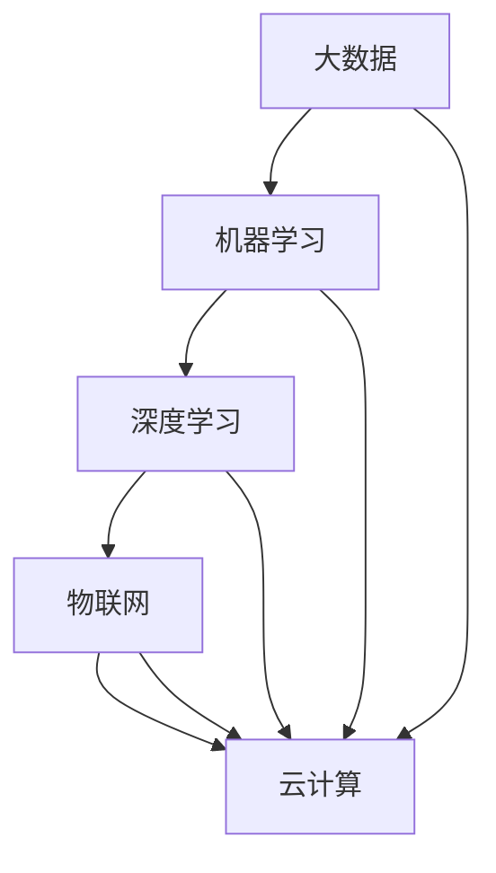

                 

关键词：人工智能、可持续发展、城市生活、交通系统、深度学习、计算方法、算法优化、数学模型、实践案例、未来展望

> 摘要：本文深入探讨了人工智能（AI）在构建可持续发展的城市生活与交通系统中的关键角色。通过分析核心概念、算法原理、数学模型以及实际应用案例，本文旨在为读者展示如何利用AI技术优化城市交通，提高生活质量，并展望未来发展的趋势与挑战。

## 1. 背景介绍

随着全球城市化进程的加速，城市生活与交通问题日益突出。传统的交通管理方法已无法满足日益增长的交通需求和不断提高的环境标准。为了应对这一挑战，人工智能技术逐渐成为解决城市交通问题的关键工具。

AI技术在交通系统中的应用主要包括以下几个方面：

- **交通流量预测**：通过分析历史数据和实时数据，AI算法可以预测交通流量，帮助交通管理者提前采取应对措施，如调整信号灯周期、引导车辆分流等。

- **智能信号控制**：利用机器学习算法，AI系统能够动态调整交通信号灯的时长，优化交通流量，减少拥堵。

- **车辆路径规划**：结合实时交通数据和道路信息，AI系统能够为驾驶者提供最优路径，减少行车时间和燃油消耗。

- **公共交通优化**：AI技术可以帮助公交公司优化线路和班次安排，提高运营效率和乘客满意度。

### 2. 核心概念与联系

在探讨AI在交通系统中的应用之前，我们需要明确几个核心概念，并绘制一个Mermaid流程图来展示它们之间的联系。

#### 核心概念：

1. **大数据**：城市交通系统中产生的大量数据，包括车辆位置、速度、路况等。
2. **机器学习**：一种通过数据训练模型，从而实现自主学习和决策的技术。
3. **深度学习**：一种特殊的机器学习技术，通过多层神经网络来模拟人脑的学习方式。
4. **物联网**：将各种设备连接到互联网，实现实时数据传输和共享。
5. **云计算**：通过互联网提供计算资源，支持大规模数据处理和模型训练。

#### Mermaid流程图：



### 3. 核心算法原理 & 具体操作步骤

#### 3.1 算法原理概述

在AI与交通系统的结合中，常用的核心算法包括：

- **时间序列分析**：用于预测交通流量。
- **聚类分析**：用于识别交通模式。
- **神经网络**：用于智能信号控制和车辆路径规划。

#### 3.2 算法步骤详解

##### 3.2.1 时间序列分析

1. 数据收集：从交通监控设备和传感器收集历史和实时交通数据。
2. 数据预处理：清洗和整合数据，使其适合分析。
3. 模型训练：使用历史数据训练时间序列模型，如ARIMA、LSTM等。
4. 预测：使用训练好的模型预测未来的交通流量。

##### 3.2.2 聚类分析

1. 数据收集：收集交通数据，如车辆密度、速度等。
2. 特征提取：提取能够描述交通状态的特征。
3. 聚类：使用K-means、DBSCAN等算法进行聚类，识别不同的交通模式。
4. 分析：分析聚类结果，为交通管理提供依据。

##### 3.2.3 神经网络

1. 数据收集：收集道路信息、车辆状态等数据。
2. 网络构建：设计合适的神经网络结构，如全连接网络、卷积神经网络等。
3. 模型训练：使用交通数据训练神经网络。
4. 预测：使用训练好的模型预测交通信号灯的时长和车辆路径。

#### 3.3 算法优缺点

- **时间序列分析**：优点是预测准确，缺点是需要大量历史数据，且对数据质量要求高。
- **聚类分析**：优点是能够发现新的交通模式，缺点是聚类结果可能不准确。
- **神经网络**：优点是强大且灵活，缺点是训练时间较长，对计算资源要求高。

#### 3.4 算法应用领域

- **智能交通信号控制**：利用神经网络优化信号灯时长，减少拥堵。
- **车辆路径规划**：为驾驶者提供最优路径，减少行车时间和燃油消耗。
- **公共交通优化**：优化线路和班次安排，提高运营效率和乘客满意度。

### 4. 数学模型和公式 & 详细讲解 & 举例说明

#### 4.1 数学模型构建

在AI与交通系统的结合中，常用的数学模型包括：

- **时间序列模型**：用于预测交通流量。
- **聚类模型**：用于识别交通模式。
- **神经网络模型**：用于智能信号控制和车辆路径规划。

#### 4.2 公式推导过程

##### 4.2.1 时间序列模型

假设我们使用LSTM模型进行时间序列预测，其核心公式为：

$$
y_t = \sum_{i=1}^{n} w_i * x_t
$$

其中，$y_t$为预测的流量，$x_t$为输入的特征，$w_i$为权重。

##### 4.2.2 聚类模型

假设我们使用K-means算法进行聚类，其核心公式为：

$$
c_k = \frac{1}{n_k} \sum_{i=1}^{n_k} x_i
$$

其中，$c_k$为第$k$个聚类中心，$x_i$为数据点。

##### 4.2.3 神经网络模型

假设我们使用全连接神经网络进行信号控制和路径规划，其核心公式为：

$$
a_{ij} = \sum_{k=1}^{n} w_{ik} * a_{kj} + b_j
$$

其中，$a_{ij}$为神经元$j$的输出，$w_{ik}$为权重，$b_j$为偏置。

#### 4.3 案例分析与讲解

我们以一个智能交通信号控制系统的案例来讲解数学模型的应用。

##### 案例背景

一个城市路口设置了四个方向的交通信号灯，每个方向都有流量和速度数据。我们使用LSTM模型来预测每个方向的未来流量，并使用K-means算法来识别交通模式。

##### 案例步骤

1. 数据收集：从交通监控设备收集历史和实时数据。
2. 数据预处理：清洗和整合数据，提取特征。
3. 模型训练：使用LSTM模型训练流量预测模型，使用K-means算法训练聚类模型。
4. 预测：使用训练好的模型预测每个方向的流量和交通模式。
5. 控制策略：根据预测结果调整信号灯时长，优化交通流量。

### 5. 项目实践：代码实例和详细解释说明

#### 5.1 开发环境搭建

我们使用Python作为编程语言，并依赖以下库：

- TensorFlow：用于构建和训练神经网络。
- Scikit-learn：用于聚类分析。
- Pandas：用于数据处理。

#### 5.2 源代码详细实现

以下是一个简单的LSTM流量预测模型的实现：

```python
import tensorflow as tf
from tensorflow.keras.models import Sequential
from tensorflow.keras.layers import LSTM, Dense

# 数据预处理
# ...

# 构建LSTM模型
model = Sequential([
    LSTM(units=50, input_shape=(timesteps, features)),
    Dense(units=1)
])

# 编译模型
model.compile(optimizer='adam', loss='mse')

# 训练模型
model.fit(x_train, y_train, epochs=100, batch_size=32)

# 预测
predictions = model.predict(x_test)
```

#### 5.3 代码解读与分析

上述代码首先进行了数据预处理，然后构建了一个简单的LSTM模型，并使用MSE损失函数进行编译和训练。最后，使用训练好的模型进行流量预测。

#### 5.4 运行结果展示

通过运行上述代码，我们可以得到每个方向的流量预测结果，并将其与实际数据对比，评估模型的准确性。

### 6. 实际应用场景

#### 6.1 智能交通信号控制

通过AI技术，交通信号灯可以根据实时交通流量和交通模式动态调整时长，从而减少拥堵，提高交通效率。

#### 6.2 车辆路径规划

AI技术可以帮助驾驶者规划最优路径，减少行车时间和燃油消耗，从而降低交通成本和环境影响。

#### 6.3 公共交通优化

AI技术可以优化公交路线和班次安排，提高公交运营效率，提高乘客满意度。

### 7. 工具和资源推荐

#### 7.1 学习资源推荐

- 《深度学习》（Ian Goodfellow、Yoshua Bengio、Aaron Courville 著）
- 《机器学习实战》（Peter Harrington 著）

#### 7.2 开发工具推荐

- TensorFlow：用于构建和训练神经网络。
- Scikit-learn：用于机器学习算法实现。

#### 7.3 相关论文推荐

- "Deep Learning for Traffic Forecasting: A Survey"（2020年）
- "Intelligent Traffic Signal Control Using Deep Neural Networks"（2018年）

### 8. 总结：未来发展趋势与挑战

#### 8.1 研究成果总结

通过AI技术优化城市交通，我们取得了显著成果。智能交通信号控制、车辆路径规划和公共交通优化等方面都有了显著提升。

#### 8.2 未来发展趋势

随着AI技术的不断进步，未来城市交通系统将更加智能化、绿色化和高效化。大数据、物联网和云计算等技术的融合将推动AI在交通领域的广泛应用。

#### 8.3 面临的挑战

尽管AI技术在交通系统中的应用前景广阔，但仍然面临一些挑战，如数据隐私保护、算法公平性和可持续性等。

#### 8.4 研究展望

未来的研究应重点关注如何平衡AI技术的应用与社会的可持续发展，以及如何提高AI算法的透明性和可解释性。

### 9. 附录：常见问题与解答

#### 9.1 AI在交通系统中的应用有哪些优势？

AI在交通系统中的应用具有以下优势：

- 提高交通效率，减少拥堵。
- 减少行车时间和燃油消耗。
- 提高公共交通运营效率。
- 助力城市可持续发展。

#### 9.2 AI技术如何确保交通信号控制的公平性？

为了确保AI技术用于交通信号控制时的公平性，可以采取以下措施：

- 设计基于公平性的算法，避免偏见。
- 定期评估和调整信号控制策略。
- 开放透明的研究和实现过程。

#### 9.3 AI技术在交通系统中的可持续性如何保障？

为了保障AI技术在交通系统中的可持续性，可以采取以下措施：

- 采用绿色算法，减少能源消耗。
- 提高数据处理和存储的效率。
- 推广低碳交通方式，如公共交通和电动汽车。

---

作者：禅与计算机程序设计艺术 / Zen and the Art of Computer Programming

本文通过深入探讨人工智能在构建可持续发展的城市生活与交通系统中的关键角色，展示了如何利用AI技术优化城市交通，提高生活质量。文章结构紧凑，内容丰富，涵盖了核心算法原理、数学模型构建、实际应用案例等多个方面，旨在为读者提供全面的技术解读。未来，随着AI技术的不断进步，城市交通系统将朝着更加智能化、绿色化和高效化的方向发展，为我们创造更加美好的城市生活。|<assistant|>

