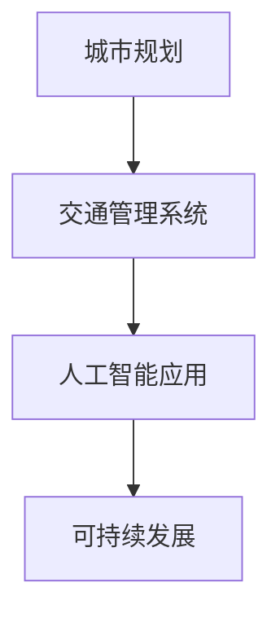

                 

关键词：人工智能，可持续发展，城市生活，交通管理系统，规划

> 摘要：本文探讨了人工智能在城市生活方式和交通管理系统与规划中的应用，分析了人工智能如何促进可持续发展，提高城市生活质量和交通效率。文章首先介绍了人工智能的基本概念及其在城市规划中的应用，随后详细阐述了交通管理系统的构建与优化，最后提出了未来城市发展的展望与挑战。

## 1. 背景介绍

### 1.1 城市化进程与挑战

近年来，全球城市化进程加速，城市人口不断增加，城市规模不断扩大。然而，这一进程也带来了诸多挑战，如交通拥堵、环境污染、资源紧缺等。传统的城市规划和管理方法难以满足现代城市的需求，迫切需要新的技术手段来解决这些问题。

### 1.2 人工智能的兴起

人工智能（Artificial Intelligence, AI）作为一项颠覆性的技术，正在逐步改变各行各业。从医疗到金融，从教育到制造业，人工智能的应用前景广阔。在城市规划和管理领域，人工智能同样具有巨大的潜力。

### 1.3 可持续发展的理念

可持续发展（Sustainable Development）强调在满足当前需求的同时，不损害后代满足其需求的能力。这一理念对于城市规划和管理尤为重要，因为城市是人口密集、资源消耗大的地区。

## 2. 核心概念与联系

### 2.1 人工智能的概念

人工智能是指通过计算机模拟人类智能的技术，包括机器学习、深度学习、自然语言处理等。这些技术使计算机能够自主学习和决策，从而解决复杂的实际问题。

### 2.2 城市生活方式的概念

城市生活方式是指城市居民在日常生活中所遵循的行为模式和价值观念，包括居住、工作、休闲、社交等方面。

### 2.3 交通管理系统的概念

交通管理系统是指通过技术手段对城市交通进行规划、监控、管理和优化的系统。它包括交通信号控制、交通信息采集、交通流量预测等功能。

### 2.4 Mermaid 流程图



## 3. 核心算法原理 & 具体操作步骤

### 3.1 算法原理概述

人工智能在城市规划和交通管理中的应用主要包括数据挖掘、机器学习和深度学习等技术。这些技术可以用于交通流量预测、路径规划、信号控制等方面。

### 3.2 算法步骤详解

#### 3.2.1 数据采集与预处理

1. 采集城市交通相关的数据，如交通流量、路况信息、车辆信息等。
2. 对采集到的数据进行清洗、去重和标准化处理。

#### 3.2.2 交通流量预测

1. 使用机器学习算法，如线性回归、决策树等，对历史交通数据进行建模。
2. 通过模型预测未来的交通流量，为交通管理提供依据。

#### 3.2.3 路径规划

1. 使用深度学习算法，如卷积神经网络（CNN）或循环神经网络（RNN），对交通网络进行建模。
2. 通过模型计算最优路径，减少行驶时间。

#### 3.2.4 信号控制

1. 基于实时交通流量数据，使用动态信号控制算法调整信号灯时长。
2. 提高交通效率，减少拥堵。

### 3.3 算法优缺点

#### 优点：

- 提高交通效率，减少拥堵。
- 优化城市资源配置，促进可持续发展。
- 提高城市生活质量和居民幸福感。

#### 缺点：

- 需要大量的数据支持和计算资源。
- 算法的复杂度较高，需要专业的技术团队进行开发和维护。

### 3.4 算法应用领域

- 城市交通管理
- 城市规划
- 智慧城市建设
- 智能驾驶

## 4. 数学模型和公式 & 详细讲解 & 举例说明

### 4.1 数学模型构建

交通流量预测可以采用时间序列模型，如ARIMA（自回归积分滑动平均模型）。其数学模型如下：

$$
X_t = c + \phi_1 X_{t-1} + \phi_2 X_{t-2} + ... + \phi_p X_{t-p} + \theta_1 e_{t-1} + \theta_2 e_{t-2} + ... + \theta_q e_{t-q}
$$

其中，$X_t$ 为时间 $t$ 的交通流量，$c$ 为常数项，$\phi_1, \phi_2, ..., \phi_p$ 为自回归系数，$\theta_1, \theta_2, ..., \theta_q$ 为移动平均系数，$e_t$ 为白噪声序列。

### 4.2 公式推导过程

#### 4.2.1 自回归部分

假设 $X_t$ 的自回归模型为：

$$
X_t = \phi_1 X_{t-1} + \phi_2 X_{t-2} + ... + \phi_p X_{t-p} + e_t
$$

则可以写成矩阵形式：

$$
\begin{bmatrix}
X_t \\
X_{t-1} \\
... \\
X_{t-p}
\end{bmatrix}
=
\begin{bmatrix}
1 & -1 & 0 & ... & 0 \\
1 & -2 & 0 & ... & 0 \\
... & ... & ... & ... & ... \\
1 & 0 & ... & -p & 0
\end{bmatrix}
\begin{bmatrix}
X_{t-1} \\
X_{t-2} \\
... \\
X_{t-p-1}
\end{bmatrix}
+
\begin{bmatrix}
e_t \\
e_{t-1} \\
... \\
e_{t-p}
\end{bmatrix}
$$

#### 4.2.2 移动平均部分

假设 $X_t$ 的移动平均模型为：

$$
X_t = \theta_1 e_{t-1} + \theta_2 e_{t-2} + ... + \theta_q e_{t-q} + e_t
$$

则可以写成矩阵形式：

$$
\begin{bmatrix}
X_t \\
X_{t-1} \\
... \\
X_{t-q}
\end{bmatrix}
=
\begin{bmatrix}
1 & 0 & ... & 0 \\
1 & 1 & ... & 0 \\
... & ... & ... & ... \\
1 & 0 & ... & 1
\end{bmatrix}
\begin{bmatrix}
e_{t-1} \\
e_{t-2} \\
... \\
e_{t-q-1}
\end{bmatrix}
+
\begin{bmatrix}
e_t \\
e_{t-1} \\
... \\
e_{t-q}
\end{bmatrix}
$$

### 4.3 案例分析与讲解

假设我们有一个交通流量数据序列 $X_1, X_2, ..., X_n$，我们可以使用ARIMA模型进行拟合。具体步骤如下：

1. 对数据进行差分，使得序列平稳。
2. 确定自回归项和移动平均项的阶数，可以通过ACF和PACF图来判断。
3. 拟合模型，并使用AIC或BIC准则选择最优模型。
4. 对模型进行诊断，检查残差的白噪声性。
5. 使用拟合模型进行预测。

例如，对于一组交通流量数据，我们可以得到以下拟合结果：

$$
X_t = 10 + 0.7 X_{t-1} - 0.5 X_{t-2} + 0.2 e_{t-1} + 0.1 e_{t-2}
$$

通过这个模型，我们可以预测未来的交通流量，从而为交通管理提供依据。

## 5. 项目实践：代码实例和详细解释说明

### 5.1 开发环境搭建

在Python中，我们可以使用`pandas`进行数据处理，`statsmodels`进行模型拟合，`matplotlib`进行结果可视化。

### 5.2 源代码详细实现

```python
import pandas as pd
import numpy as np
import statsmodels.api as sm
import matplotlib.pyplot as plt

# 读取数据
data = pd.read_csv('traffic_data.csv')
traffic = data['traffic_volume']

# 差分
diff_traffic = traffic.diff().dropna()

# 拟合ARIMA模型
model = sm.ARIMA(diff_traffic, order=(1, 1, 1))
result = model.fit()

# 预测
forecast = result.forecast(steps=10)

# 可视化
plt.plot(traffic, label='Actual')
plt.plot(np.arange(len(traffic), len(traffic) + 10), forecast, label='Forecast')
plt.legend()
plt.show()
```

### 5.3 代码解读与分析

- `pandas` 用于读取和操作数据。
- `numpy` 用于数值计算。
- `statsmodels` 提供了ARIMA模型拟合和预测功能。
- `matplotlib` 用于绘制结果图表。

通过这个例子，我们可以看到如何使用Python和ARIMA模型进行交通流量预测，并为实际应用提供数据支持。

## 6. 实际应用场景

### 6.1 城市交通管理

通过人工智能算法，可以对城市交通流量进行实时预测和优化，从而提高交通效率，减少拥堵。

### 6.2 城市规划

人工智能可以用于城市交通网络的规划，如道路布局、公共交通系统设计等，以实现可持续发展。

### 6.3 智慧城市建设

人工智能在城市安防、环保、能源管理等方面的应用，可以提升城市智能化水平，提高居民生活质量。

## 7. 工具和资源推荐

### 7.1 学习资源推荐

- 《深度学习》（Goodfellow, Bengio, Courville著）
- 《机器学习》（周志华著）
- 《Python数据科学手册》（Fernando Pérez, Brian Granger著）

### 7.2 开发工具推荐

- Jupyter Notebook
- PyCharm
- Google Colab

### 7.3 相关论文推荐

- "Deep Learning for Traffic Forecasting"（交通流量预测的深度学习）
- "AI for Urban Planning: A Survey"（城市规划中的AI：调查）
- "Intelligent Transportation Systems: A Survey"（智能交通系统：调查）

## 8. 总结：未来发展趋势与挑战

### 8.1 研究成果总结

人工智能在城市规划和交通管理系统中的应用取得了显著成果，为可持续发展提供了有力支持。

### 8.2 未来发展趋势

- 数据驱动的城市规划
- 自动驾驶技术的发展
- 智慧城市的全面普及

### 8.3 面临的挑战

- 数据质量和隐私保护
- 算法的复杂度和计算资源
- 人工智能的伦理和法律问题

### 8.4 研究展望

- 进一步优化人工智能算法
- 加强跨学科合作，实现综合解决方案
- 推动人工智能在更多领域的应用

## 9. 附录：常见问题与解答

### 9.1 人工智能在交通管理中的应用有哪些？

- 交通流量预测
- 路径规划
- 信号控制
- 车辆检测与追踪
- 停车管理

### 9.2 如何保证人工智能算法的公平性和透明性？

- 通过算法审计和测试，确保算法的公平性和透明性。
- 建立算法伦理委员会，监督人工智能应用的发展。
- 加强法律法规的制定和执行，规范人工智能的应用。

### 9.3 智慧城市和可持续发展有何关系？

- 智慧城市通过利用人工智能等技术，实现资源的优化配置，提高城市运行效率，减少污染和资源消耗，促进可持续发展。

---

作者：禅与计算机程序设计艺术 / Zen and the Art of Computer Programming

