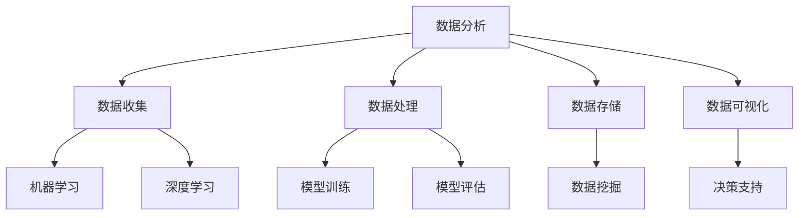

                 

关键词：城市规划、可持续发展、人工智能、计算技术、数据分析、算法应用

> 摘要：本文探讨了如何利用人工智能和计算技术在城市规划和管理中实现可持续发展。通过阐述核心概念与联系，详细介绍核心算法原理与操作步骤，并运用数学模型和具体项目实践，深入分析了这一领域的前沿应用。文章旨在为读者提供一种新的视角，以应对城市发展的挑战。

## 1. 背景介绍

### 1.1 城市规划的重要性

城市规划是指导城市发展的重要手段，关乎城市功能、空间布局、生态环境以及居民生活质量等多个方面。随着城市化进程的加速，城市规划的重要性日益凸显。然而，传统的城市规划方法往往依赖于经验判断，难以应对复杂多变的城市环境。

### 1.2 可持续发展的概念

可持续发展是指在满足当前需求的同时，不损害后代满足其需求的能力。在城市规划中，可持续发展强调的是在资源有限、环境压力增大的背景下，实现城市功能的持续、高效、和谐发展。

### 1.3 人工智能与计算技术的作用

人工智能和计算技术的发展为城市规划提供了新的工具和方法。通过大数据分析、机器学习、深度学习等技术，城市规划可以从海量数据中提取有价值的信息，优化决策过程，提高城市管理效率。

## 2. 核心概念与联系

### 2.1 数据分析

数据分析是城市规划的基础，涉及数据收集、处理、存储、分析和可视化等环节。通过对城市运行数据、社会数据、经济数据等的分析，可以发现城市发展的规律和趋势。

### 2.2 机器学习

机器学习是人工智能的一个重要分支，通过构建模型，让计算机自动从数据中学习规律，用于预测、分类、聚类等任务。在城市规划中，机器学习可以用于交通流量预测、人口增长预测等。

### 2.3 深度学习

深度学习是机器学习的一个子领域，通过神经网络模型，实现更复杂的特征提取和模式识别。在城市规划中，深度学习可以用于图像识别、语音识别等任务。

### 2.4 Mermaid 流程图



## 3. 核心算法原理 & 具体操作步骤

### 3.1 算法原理概述

城市规划中的核心算法主要包括聚类算法、分类算法、预测算法等。这些算法通过分析城市数据，帮助规划者制定更科学的规划方案。

### 3.2 算法步骤详解

#### 3.2.1 聚类算法

1. 数据预处理：清洗、归一化、缺失值处理等。
2. 确定聚类算法：如K-Means、层次聚类等。
3. 运行算法：根据聚类结果，对城市区域进行划分。
4. 评估结果：计算聚类效果，如轮廓系数、内部距离等。

#### 3.2.2 分类算法

1. 数据预处理：同聚类算法。
2. 确定分类算法：如决策树、支持向量机等。
3. 运行算法：对城市规划方案进行分类评估。
4. 优化模型：调整参数，提高分类准确率。

#### 3.2.3 预测算法

1. 数据预处理：同聚类和分类算法。
2. 确定预测算法：如线性回归、时间序列分析等。
3. 运行算法：预测城市人口增长、交通流量等。
4. 分析结果：根据预测结果，制定相应的发展策略。

### 3.3 算法优缺点

#### 3.3.1 优点

- 提高规划效率：算法可以快速处理大量数据，辅助规划决策。
- 提高规划准确性：基于数据分析的算法可以更准确地预测城市发展。
- 个性化规划：根据不同城市的特点，制定个性化规划方案。

#### 3.3.2 缺点

- 数据依赖性：算法效果很大程度上依赖于数据质量和数量。
- 复杂性：算法设计和实现过程较为复杂，需要专业知识和技能。
- 道德和社会问题：算法可能引发隐私、公平性等问题。

### 3.4 算法应用领域

城市规划算法广泛应用于城市交通管理、环境保护、公共安全、城市规划方案评估等多个领域。

## 4. 数学模型和公式 & 详细讲解 & 举例说明

### 4.1 数学模型构建

城市规划中的数学模型主要包括线性回归模型、决策树模型、神经网络模型等。

#### 4.1.1 线性回归模型

$$
Y = \beta_0 + \beta_1 X + \epsilon
$$

其中，$Y$ 是因变量，$X$ 是自变量，$\beta_0$ 和 $\beta_1$ 是模型参数，$\epsilon$ 是误差项。

#### 4.1.2 决策树模型

决策树模型通过一系列条件判断，将数据集划分为多个子集，并选择最优划分方式。

#### 4.1.3 神经网络模型

神经网络模型通过多层神经元之间的非线性变换，实现对输入数据的特征提取和模式识别。

### 4.2 公式推导过程

以线性回归模型为例，推导过程如下：

1. **最小二乘法**：选择最小化误差平方和的参数 $\beta_0$ 和 $\beta_1$。
$$
\min_{\beta_0, \beta_1} \sum_{i=1}^{n} (Y_i - (\beta_0 + \beta_1 X_i))^2
$$

2. **求导**：对 $\beta_0$ 和 $\beta_1$ 求偏导，并令偏导数等于0。
$$
\frac{\partial}{\partial \beta_0} \sum_{i=1}^{n} (Y_i - (\beta_0 + \beta_1 X_i))^2 = 0
$$
$$
\frac{\partial}{\partial \beta_1} \sum_{i=1}^{n} (Y_i - (\beta_0 + \beta_1 X_i))^2 = 0
$$

3. **解方程**：解上述方程组，得到 $\beta_0$ 和 $\beta_1$ 的最优值。

### 4.3 案例分析与讲解

#### 4.3.1 城市人口增长预测

使用线性回归模型预测城市人口增长，输入数据为过去几年的城市人口数据。

1. 数据收集：收集过去10年的城市人口数据。
2. 数据预处理：对数据集进行清洗、归一化处理。
3. 建立模型：使用线性回归模型。
4. 模型训练：训练模型，得到模型参数。
5. 预测：使用训练好的模型，预测未来几年的人口增长。

#### 4.3.2 交通流量预测

使用时间序列分析模型预测交通流量，输入数据为过去一段时间的交通流量数据。

1. 数据收集：收集过去一个月的交通流量数据。
2. 数据预处理：对数据集进行清洗、归一化处理。
3. 建立模型：使用时间序列分析模型，如ARIMA模型。
4. 模型训练：训练模型，得到模型参数。
5. 预测：使用训练好的模型，预测未来一段时间的交通流量。

## 5. 项目实践：代码实例和详细解释说明

### 5.1 开发环境搭建

1. 安装Python环境。
2. 安装必要的库，如NumPy、Pandas、Scikit-learn等。

### 5.2 源代码详细实现

```python
import numpy as np
import pandas as pd
from sklearn.linear_model import LinearRegression
from sklearn.model_selection import train_test_split
from sklearn.metrics import mean_squared_error

# 数据收集与预处理
data = pd.read_csv('city_population.csv')
X = data[['year']]
y = data['population']
X_train, X_test, y_train, y_test = train_test_split(X, y, test_size=0.2, random_state=42)

# 建立模型
model = LinearRegression()
model.fit(X_train, y_train)

# 模型评估
y_pred = model.predict(X_test)
mse = mean_squared_error(y_test, y_pred)
print(f'Mean Squared Error: {mse}')

# 预测
future_years = np.array([[2025], [2030]])
future_population = model.predict(future_years)
print(f'Predicted Population for 2025: {future_population[0][0]}')
print(f'Predicted Population for 2030: {future_population[1][0]}')
```

### 5.3 代码解读与分析

1. **数据收集与预处理**：使用Pandas库读取CSV文件，对数据进行归一化处理。
2. **建立模型**：使用Scikit-learn库中的线性回归模型。
3. **模型评估**：使用均方误差（MSE）评估模型性能。
4. **预测**：使用训练好的模型，预测未来的人口增长。

## 6. 实际应用场景

### 6.1 城市交通管理

利用人工智能算法，可以预测交通流量，优化交通信号控制，减少交通拥堵。

### 6.2 环境保护

通过分析环境数据，可以预测污染源和扩散趋势，制定环境保护策略。

### 6.3 公共安全

利用人工智能和大数据技术，可以预测公共安全事件，提高应急响应能力。

### 6.4 未来应用展望

随着人工智能和计算技术的不断发展，城市规划将更加智能化、个性化。未来的城市规划将更加注重数据驱动和可持续性。

## 7. 工具和资源推荐

### 7.1 学习资源推荐

- 《机器学习实战》
- 《深度学习》
- 《Python数据分析》

### 7.2 开发工具推荐

- Jupyter Notebook
- PyCharm
- Tableau

### 7.3 相关论文推荐

- "Deep Learning for Urban Planning"
- "Data-Driven Urban Planning and Management"
- "Artificial Intelligence in Urban Development and Management"

## 8. 总结：未来发展趋势与挑战

### 8.1 研究成果总结

人工智能和计算技术在城市规划中取得了显著成果，提高了规划效率和准确性。

### 8.2 未来发展趋势

- 数据驱动的城市规划
- 人工智能算法的优化和应用
- 跨学科的融合研究

### 8.3 面临的挑战

- 数据隐私和安全问题
- 算法的公平性和透明性
- 技术人才的培养和引进

### 8.4 研究展望

未来城市规划将更加智能化、个性化，实现可持续发展的目标。同时，需要克服诸多挑战，确保技术应用的合理性和有效性。

## 9. 附录：常见问题与解答

### 9.1 人工智能在规划中的主要应用有哪些？

- 交通流量预测
- 人口增长预测
- 环境监测与污染源预测
- 公共安全管理

### 9.2 数据隐私如何保障？

- 使用加密技术保护数据
- 数据匿名化处理
- 加强法律法规建设

### 9.3 算法公平性和透明性如何保证？

- 公开算法的实现和参数设置
- 定期审计和评估算法性能
- 建立透明、公正的评估机制

## 作者署名

作者：禅与计算机程序设计艺术 / Zen and the Art of Computer Programming
``` 


