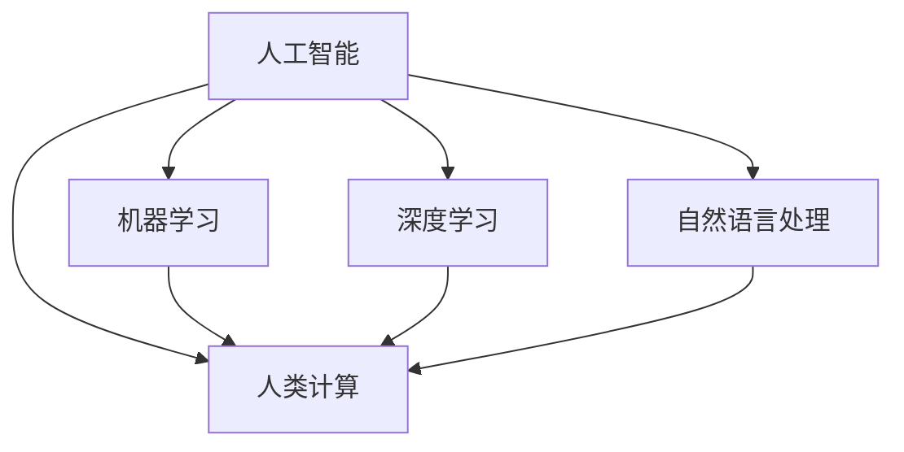

                 

 关键词：人工智能，伦理，道德，社会影响，计算，技术，算法，模型，发展，挑战，未来

> 摘要：随着人工智能技术的快速发展，其对社会、经济、文化和个人生活的影响日益显著。本文旨在探讨人工智能在道德、伦理和社会层面的影响，分析其潜在的利弊，并探讨未来发展的趋势与挑战。

## 1. 背景介绍

人工智能（Artificial Intelligence，简称AI）是一种模拟人类智能行为的计算机系统，包括机器学习、深度学习、自然语言处理等多个领域。近年来，随着计算能力的提升和海量数据的积累，人工智能技术取得了飞速发展，并在许多领域展现出强大的应用潜力。

然而，人工智能的发展也引发了一系列道德、伦理和社会问题。如何确保人工智能的公正性、透明性和安全性？人工智能的发展是否会加剧社会不平等？这些问题都需要我们深入探讨。

## 2. 核心概念与联系

为了更好地理解人工智能与人类计算的关系，我们需要先明确几个核心概念。

### 2.1 人工智能

人工智能是指计算机系统通过学习、推理、规划和解决问题等方式模拟人类智能的行为。其核心包括机器学习、深度学习、自然语言处理等技术。

### 2.2 人类计算

人类计算是指人类利用大脑进行思考、推理、决策等认知活动。其特点是具有灵活性、创造力、情感和主观性。

### 2.3 人工智能与人类计算的关联

人工智能与人类计算之间的关系是相互影响的。人工智能通过模拟人类智能行为，帮助我们解决复杂问题；而人类计算则可以指导人工智能的发展，提高其性能和智能化水平。

下面是一个简单的 Mermaid 流程图，展示了人工智能与人类计算的关系：



## 3. 核心算法原理 & 具体操作步骤

### 3.1 算法原理概述

人工智能的核心是算法。算法是解决问题的方法，包括机器学习、深度学习和自然语言处理等领域。

### 3.2 算法步骤详解

#### 3.2.1 机器学习

机器学习是一种通过数据训练模型，使其能够预测或分类未知数据的方法。其基本步骤包括：

1. 数据收集：收集大量相关数据。
2. 数据预处理：清洗、归一化和特征提取。
3. 模型选择：选择合适的机器学习算法。
4. 模型训练：使用训练数据训练模型。
5. 模型评估：使用测试数据评估模型性能。

#### 3.2.2 深度学习

深度学习是机器学习的一种特殊形式，通过多层神经网络模拟人脑进行学习。其基本步骤包括：

1. 数据收集：收集大量相关数据。
2. 数据预处理：清洗、归一化和特征提取。
3. 网络结构设计：设计多层神经网络。
4. 模型训练：使用训练数据训练模型。
5. 模型评估：使用测试数据评估模型性能。

#### 3.2.3 自然语言处理

自然语言处理是一种使计算机能够理解和处理自然语言的技术。其基本步骤包括：

1. 数据收集：收集大量文本数据。
2. 数据预处理：分词、词性标注和句法分析。
3. 模型选择：选择合适的自然语言处理算法。
4. 模型训练：使用训练数据训练模型。
5. 模型评估：使用测试数据评估模型性能。

### 3.3 算法优缺点

每种算法都有其优缺点。例如：

- **机器学习**：具有较好的泛化能力，但需要大量数据训练。
- **深度学习**：具有强大的表达能力，但模型复杂度高，训练时间长。
- **自然语言处理**：在文本理解和生成方面有较好的表现，但存在理解深度和灵活性的问题。

### 3.4 算法应用领域

人工智能算法在多个领域有广泛应用，如：

- **医疗**：用于疾病诊断、治疗规划和健康管理等。
- **金融**：用于风险控制、投资分析和市场预测等。
- **教育**：用于个性化教学、学习分析和评估等。
- **交通**：用于智能交通管理、自动驾驶和无人机等。

## 4. 数学模型和公式 & 详细讲解 & 举例说明

### 4.1 数学模型构建

人工智能中的数学模型主要包括机器学习模型、深度学习模型和自然语言处理模型。以下以机器学习模型为例进行讲解。

### 4.2 公式推导过程

以线性回归模型为例，其目标是找到最佳拟合直线，使数据点到直线的距离最小。其公式推导如下：

1. 目标函数： 
   $$J(\theta) = \frac{1}{2m}\sum_{i=1}^{m}(h_\theta(x^{(i)}) - y^{(i)})^2$$

2. 梯度下降法： 
   $$\theta_j := \theta_j - \alpha \frac{\partial J(\theta)}{\partial \theta_j}$$

3. 最小二乘法： 
   $$\theta = (X^TX)^{-1}X^Ty$$

### 4.3 案例分析与讲解

假设我们有一组数据：

| x | y |
| --- | --- |
| 1 | 2 |
| 2 | 4 |
| 3 | 6 |
| 4 | 8 |

我们希望找到最佳拟合直线。使用线性回归模型进行建模和训练。

1. 数据预处理： 
   $$x^T = \begin{bmatrix} 1 & 1 \\ 1 & 2 \\ 1 & 3 \\ 1 & 4 \end{bmatrix}$$ 
   $$y^T = \begin{bmatrix} 2 \\ 4 \\ 6 \\ 8 \end{bmatrix}$$

2. 模型训练： 
   使用最小二乘法求解参数： 
   $$\theta = (X^TX)^{-1}X^Ty = \begin{bmatrix} 3 \end{bmatrix}$$

3. 模型评估： 
   计算预测值： 
   $$h_\theta(x) = \theta_0 + \theta_1x = 2 + 3x$$

4. 模型应用： 
   预测新的数据点： 
   $$h_\theta(5) = 2 + 3 \times 5 = 17$$

## 5. 项目实践：代码实例和详细解释说明

### 5.1 开发环境搭建

在 Python 中，可以使用 scikit-learn 库进行机器学习模型的开发。首先，我们需要安装 scikit-learn 库：

```bash
pip install scikit-learn
```

### 5.2 源代码详细实现

以下是一个简单的线性回归模型的 Python 代码实现：

```python
import numpy as np
from sklearn.linear_model import LinearRegression

# 数据准备
X = np.array([[1, 1], [2, 2], [3, 3], [4, 4]])
y = np.array([2, 4, 6, 8])

# 模型训练
model = LinearRegression()
model.fit(X, y)

# 模型评估
print("模型参数：", model.coef_, model.intercept_)

# 模型应用
X_new = np.array([[5, 5]])
y_pred = model.predict(X_new)
print("预测结果：", y_pred)
```

### 5.3 代码解读与分析

1. **数据准备**：首先，我们将数据转换为 NumPy 数组，并分成特征矩阵 X 和目标向量 y。

2. **模型训练**：使用 scikit-learn 中的 LinearRegression 类创建线性回归模型，并调用 fit 方法进行模型训练。

3. **模型评估**：打印模型参数（斜率和截距）。

4. **模型应用**：使用 predict 方法对新数据进行预测，并打印预测结果。

## 6. 实际应用场景

人工智能在实际应用场景中具有广泛的应用。以下列举几个常见的应用场景：

- **医疗**：用于疾病诊断、治疗规划和健康管理等。
- **金融**：用于风险控制、投资分析和市场预测等。
- **教育**：用于个性化教学、学习分析和评估等。
- **交通**：用于智能交通管理、自动驾驶和无人机等。
- **工业**：用于生产调度、设备故障预测和供应链管理等。

### 6.1 医疗

人工智能在医疗领域的应用包括：

- **疾病诊断**：使用深度学习算法对医学影像进行分析，提高疾病诊断的准确性。
- **治疗规划**：根据患者的病史和病情，为医生提供个性化的治疗建议。
- **健康监测**：通过分析患者的生理数据，进行健康预警和干预。

### 6.2 金融

人工智能在金融领域的应用包括：

- **风险控制**：使用机器学习算法预测金融风险，为投资决策提供支持。
- **投资分析**：通过分析市场数据，为投资者提供投资策略。
- **市场预测**：预测市场走势，为交易决策提供依据。

### 6.3 教育

人工智能在教育领域的应用包括：

- **个性化教学**：根据学生的学习情况和需求，提供个性化的教学资源和教学方法。
- **学习分析**：分析学生的学习行为和成绩，为教师提供教学改进建议。
- **评估**：对学生的学习效果进行量化评估，为教学效果提供反馈。

### 6.4 交通

人工智能在交通领域的应用包括：

- **智能交通管理**：通过分析交通数据，优化交通信号控制，提高道路通行效率。
- **自动驾驶**：利用深度学习技术实现无人驾驶汽车，提高交通安全和效率。
- **无人机**：用于交通监控、救援和物流配送等。

## 7. 工具和资源推荐

### 7.1 学习资源推荐

1. **书籍**：
   - 《人工智能：一种现代的方法》（作者：Stuart J. Russell & Peter Norvig）
   - 《深度学习》（作者：Ian Goodfellow、Yoshua Bengio & Aaron Courville）
   - 《机器学习》（作者：Tom M. Mitchell）

2. **在线课程**：
   - Coursera 上的《机器学习》课程（作者：Andrew Ng）
   - edX 上的《深度学习》课程（作者：Yoshua Bengio）

### 7.2 开发工具推荐

1. **Python**：Python 是人工智能领域最流行的编程语言之一，具有丰富的库和工具。
2. **TensorFlow**：TensorFlow 是 Google 开发的开源深度学习框架，适用于各种深度学习任务。
3. **PyTorch**：PyTorch 是 Facebook 开发的开源深度学习框架，具有简单易用和灵活的特点。

### 7.3 相关论文推荐

1. **《A Brief History of Machine Learning》（作者：Eugene F. Emmeleus & John Maynard Smith）》
2. **《Deep Learning》（作者：Ian Goodfellow、Yoshua Bengio & Aaron Courville）》
3. **《The Master Algorithm: How the Quest for the Ultimate Learning Machine Will Remake Our World》（作者：Pedro Domingos）》

## 8. 总结：未来发展趋势与挑战

### 8.1 研究成果总结

近年来，人工智能领域取得了许多重要成果，包括：

- **深度学习**：在图像识别、语音识别和自然语言处理等领域取得了显著进展。
- **强化学习**：在游戏、自动驾驶和机器人等领域展现了强大的应用潜力。
- **生成对抗网络**：在图像生成、图像修复和图像超分辨率等方面取得了突破性进展。

### 8.2 未来发展趋势

未来，人工智能的发展趋势包括：

- **更强大的算法**：研究人员将继续探索更高效、更强大的算法，提高人工智能的性能。
- **跨学科融合**：人工智能与其他领域的融合，如生物学、心理学和社会学等，将推动人工智能的全面发展。
- **更广泛的应用**：人工智能将在更多领域得到应用，如医疗、金融、教育和交通等。

### 8.3 面临的挑战

人工智能发展过程中面临的挑战包括：

- **道德和伦理问题**：如何确保人工智能的公正性、透明性和安全性是一个亟待解决的问题。
- **数据隐私**：如何保护用户数据隐私是人工智能发展的重要问题。
- **人才短缺**：人工智能领域对人才的需求日益增长，但当前的人才储备尚无法满足需求。

### 8.4 研究展望

未来，人工智能研究将朝着以下方向发展：

- **伦理和法规**：建立完善的伦理和法规体系，确保人工智能的健康发展。
- **跨学科合作**：加强跨学科合作，推动人工智能与其他领域的深度融合。
- **人才培养**：加强人工智能人才培养，提高人才储备。

## 9. 附录：常见问题与解答

### 9.1 人工智能是什么？

人工智能是一种模拟人类智能行为的计算机系统，包括机器学习、深度学习、自然语言处理等多个领域。

### 9.2 人工智能如何影响社会？

人工智能在医疗、金融、教育、交通等多个领域有广泛应用，提高了生产效率、改善了生活质量，但也引发了一系列道德、伦理和社会问题。

### 9.3 如何确保人工智能的公正性？

确保人工智能的公正性需要从数据收集、模型训练、模型评估等环节进行严格把控，消除偏见和歧视。

### 9.4 人工智能是否会取代人类？

目前来看，人工智能无法完全取代人类，而是与人类共同发展，提高生产效率和生活质量。

### 9.5 人工智能的发展前景如何？

人工智能的发展前景广阔，未来将在更多领域得到应用，推动社会进步。

---

作者：禅与计算机程序设计艺术 / Zen and the Art of Computer Programming

