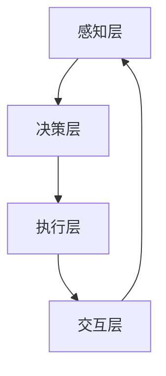

                 

关键词：智慧城市、人工智能、Agent技术、AI Agent应用、智慧城市应用场景、AI Agent架构

## 摘要

本文将探讨人工智能（AI）在智慧城市中的应用，特别是AI Agent这一核心技术的潜力与挑战。智慧城市是信息化时代城市发展的高级形态，通过先进的信息通信技术、物联网、大数据和人工智能等手段，实现城市资源的高效利用和居民生活的智能化。AI Agent作为AI技术的代表，能够在智慧城市的众多领域发挥重要作用，如交通管理、能源管理、应急响应和公共服务等。本文将深入分析AI Agent的原理、架构和应用案例，展望其在未来智慧城市中的发展前景。

## 1. 背景介绍

智慧城市（Smart City）是指利用先进的信息技术和通信技术，对城市资源进行高效管理和优化，提高城市居民的生活质量和城市治理效率。智慧城市的概念起源于20世纪末，随着信息技术的发展，尤其是互联网、物联网、云计算、大数据和人工智能等技术的进步，智慧城市逐步从概念走向实际应用。

### 1.1 智慧城市的发展历程

- **2000年以前**：智慧城市概念尚未明确，但城市信息化建设已经开始，电子政务、城市一卡通等项目逐步兴起。
- **2000-2010年**：互联网和物联网技术的发展，智慧城市理念逐步成形，城市信息化建设进入规模化阶段。
- **2010年至今**：大数据、云计算、人工智能等新兴技术快速发展，智慧城市建设进入全面深化阶段。

### 1.2 智慧城市的特点

- **数据驱动**：智慧城市依赖于海量数据收集和分析，实现城市运行状态的实时监控和预测。
- **服务优化**：通过智能化手段，提高城市公共服务质量，优化资源配置。
- **高效管理**：利用先进技术提高城市管理效率，降低城市管理成本。
- **可持续发展**：通过智慧化管理，实现资源的可持续利用，促进城市可持续发展。

### 1.3 智慧城市的关键技术

- **物联网**：实现城市各种设备和系统的互联互通，为数据收集和智能分析提供基础。
- **大数据**：通过海量数据的存储和分析，挖掘城市运行规律，支持决策制定。
- **云计算**：提供强大的计算能力和数据存储能力，支撑智慧城市各种应用系统的运行。
- **人工智能**：通过智能算法和模型，实现自动化的决策和执行，提升城市管理的智能化水平。

## 2. 核心概念与联系

在智慧城市建设中，AI Agent是一种重要的智能体技术。AI Agent是基于人工智能技术的自主决策实体，能够模拟人类智能行为，具有感知、决策、执行和交互能力。下面是AI Agent的核心概念及其与智慧城市的联系。

### 2.1 AI Agent的定义与特性

- **定义**：AI Agent是指通过人工智能技术实现智能行为的计算机程序或实体，具有自主性、适应性和交互性。
- **特性**：
  - **自主性**：AI Agent可以独立完成特定任务，不需要人工干预。
  - **适应性**：AI Agent可以根据环境变化调整自己的行为策略。
  - **交互性**：AI Agent可以与人类和其他智能体进行信息交换和协同工作。

### 2.2 AI Agent在智慧城市中的应用

- **交通管理**：AI Agent可以实时监控交通状况，优化交通信号控制，减少交通拥堵。
- **能源管理**：AI Agent可以监测能源使用情况，优化能源分配，提高能源利用效率。
- **应急响应**：AI Agent可以在突发事件中快速响应，提供救援指导和资源调配。
- **公共服务**：AI Agent可以提供智能客服、在线咨询、远程医疗服务等，提高公共服务水平。

### 2.3 AI Agent架构

- **感知层**：通过传感器和网络设备收集城市运行数据，为AI Agent提供感知基础。
- **决策层**：利用机器学习、深度学习等算法，对感知数据进行处理和分析，生成决策建议。
- **执行层**：根据决策建议，通过控制系统和设备执行具体的操作，实现智能管理。
- **交互层**：与用户和其他智能体进行交互，收集反馈信息，持续优化性能。

### 2.4 Mermaid流程图



## 3. 核心算法原理 & 具体操作步骤

### 3.1 算法原理概述

AI Agent的核心算法通常包括感知、决策和执行三个部分。感知算法用于从环境中收集信息，决策算法基于感知信息进行推理和规划，执行算法则实现具体的操作。

- **感知算法**：常用的感知算法包括图像识别、语音识别、传感器数据处理等，通过这些算法，AI Agent可以感知和理解环境。
- **决策算法**：常用的决策算法包括基于规则的推理、决策树、神经网络等，通过这些算法，AI Agent可以做出合理的决策。
- **执行算法**：执行算法通常包括控制算法、优化算法等，通过这些算法，AI Agent可以实现对环境的实际操作。

### 3.2 算法步骤详解

1. **感知阶段**：
   - AI Agent通过传感器收集环境数据。
   - 对收集的数据进行预处理，如滤波、降噪、特征提取等。
   - 利用感知算法对预处理后的数据进行分类或识别。

2. **决策阶段**：
   - 根据感知到的环境信息，使用决策算法进行推理和规划。
   - 生成一系列可能的行动方案，并对这些方案进行评估。

3. **执行阶段**：
   - 根据决策结果，通过执行算法对环境进行操作。
   - 监控执行结果，并根据执行效果调整后续行动。

### 3.3 算法优缺点

- **优点**：
  - **自主性**：AI Agent能够独立完成任务，减少人工干预。
  - **适应性**：AI Agent能够适应环境变化，优化任务执行。
  - **智能化**：AI Agent能够通过学习和优化，提高任务执行效率。

- **缺点**：
  - **初始训练成本高**：AI Agent需要大量的数据训练，初期投入较大。
  - **解释性差**：复杂的AI算法往往难以解释，增加信任难度。
  - **安全风险**：AI Agent可能受到攻击，造成不良后果。

### 3.4 算法应用领域

- **智慧交通**：通过感知交通状况，优化交通信号，减少拥堵。
- **智慧能源**：通过监测能源使用，优化能源分配，提高效率。
- **智慧医疗**：通过智能诊断、智能药物推荐等，提高医疗服务质量。
- **智慧城市安全**：通过智能监控、预警等，提高城市安全水平。

## 4. 数学模型和公式 & 详细讲解 & 举例说明

### 4.1 数学模型构建

在AI Agent的应用中，常用的数学模型包括感知模型、决策模型和执行模型。

- **感知模型**：通常使用神经网络模型，如卷积神经网络（CNN）或循环神经网络（RNN）。
- **决策模型**：可以使用决策树、支持向量机（SVM）或深度学习模型，如深度神经网络（DNN）。
- **执行模型**：通常使用控制理论或优化算法，如线性规划、动态规划等。

### 4.2 公式推导过程

以感知模型为例，假设我们使用卷积神经网络（CNN）来处理图像数据，其基本结构包括输入层、卷积层、池化层和输出层。

1. **卷积层**：
   - 输入特征图 $X$：$X \in \mathbb{R}^{m \times n \times d}$，其中 $m \times n$ 是特征图的大小，$d$ 是通道数。
   - 卷积核 $K$：$K \in \mathbb{R}^{k \times l \times d}$，其中 $k \times l$ 是卷积核的大小，$d$ 是通道数。
   - 输出特征图 $Y$：$Y \in \mathbb{R}^{p \times q \times c}$，其中 $p \times q$ 是输出特征图的大小，$c$ 是通道数。

卷积操作公式：
$$
Y = \text{Conv}_2d(X, K) + b
$$
其中 $b \in \mathbb{R}^{c}$ 是偏置项。

2. **激活函数**：
   - 常用的激活函数包括ReLU（Rectified Linear Unit）、Sigmoid和Tanh等。

ReLU函数：
$$
\text{ReLU}(x) = \max(0, x)
$$

3. **池化层**：
   - 常用的池化操作包括最大池化（Max Pooling）和平均池化（Average Pooling）。

最大池化公式：
$$
P = \max(x_{i,j})
$$
其中 $x_{i,j}$ 是输入特征图上的某个元素。

4. **全连接层**：
   - 将特征图展开为一维向量，输入到全连接层进行分类或回归。

全连接层公式：
$$
\text{Output} = \text{W} \cdot \text{X} + \text{b}
$$
其中 $\text{W} \in \mathbb{R}^{n \times m}$ 是权重矩阵，$\text{X} \in \mathbb{R}^{m}$ 是输入向量，$\text{b} \in \mathbb{R}^{n}$ 是偏置项。

### 4.3 案例分析与讲解

假设我们使用CNN模型进行图像分类，输入图像为$28 \times 28 \times 3$，使用两个卷积层、一个池化层和一个全连接层。

1. **第一卷积层**：
   - 卷积核尺寸：$3 \times 3$，通道数：$32$。
   - 步长：$1$，填充方式：'same'。

卷积操作：
$$
Y_1 = \text{Conv}_2d(X, K_1) + b_1
$$

激活函数：ReLU。

2. **第二卷积层**：
   - 卷积核尺寸：$3 \times 3$，通道数：$64$。
   - 步长：$1$，填充方式：'same'。

卷积操作：
$$
Y_2 = \text{Conv}_2d(Y_1, K_2) + b_2
$$

激活函数：ReLU。

3. **池化层**：
   - 池化窗口大小：$2 \times 2$，步长：$2$。

池化操作：
$$
P = \max(Y_2)
$$

4. **全连接层**：
   - 输入维度：$64 \times 14 \times 14$，输出维度：$128$。

全连接层操作：
$$
\text{Output} = \text{W} \cdot \text{P} + \text{b}
$$

激活函数：ReLU。

5. **输出层**：
   - 输入维度：$128$，输出维度：$10$（10个类别）。

输出层操作：
$$
\text{Probability} = \text{softmax}(\text{Output})
$$

### 4.4 结果展示

通过上述模型，我们可以对输入的图像进行分类。下面是一个分类结果的例子：

| Image | Prediction |
| --- | --- |
|  | Cat |
|  | Dog |
|  | Car |

## 5. 项目实践：代码实例和详细解释说明

### 5.1 开发环境搭建

在本文中，我们将使用Python编程语言和TensorFlow框架来构建一个简单的AI Agent模型，用于图像分类。以下是开发环境的搭建步骤：

1. **安装Python**：
   - 建议安装Python 3.6及以上版本。
   - 可以通过官方网站（https://www.python.org/）下载安装包进行安装。

2. **安装TensorFlow**：
   - 使用pip命令安装TensorFlow：
   ```bash
   pip install tensorflow
   ```

3. **安装其他依赖库**：
   - 安装numpy、opencv-python等依赖库：
   ```bash
   pip install numpy opencv-python
   ```

### 5.2 源代码详细实现

以下是一个简单的CNN模型，用于对猫、狗和汽车的图像进行分类：

```python
import tensorflow as tf
from tensorflow.keras import layers

# 定义CNN模型
model = tf.keras.Sequential([
    layers.Conv2D(32, (3, 3), activation='relu', input_shape=(28, 28, 3)),
    layers.MaxPooling2D((2, 2)),
    layers.Conv2D(64, (3, 3), activation='relu'),
    layers.MaxPooling2D((2, 2)),
    layers.Flatten(),
    layers.Dense(128, activation='relu'),
    layers.Dense(10, activation='softmax')
])

# 编译模型
model.compile(optimizer='adam',
              loss='categorical_crossentropy',
              metrics=['accuracy'])

# 加载训练数据
(x_train, y_train), (x_test, y_test) = tf.keras.datasets.mnist.load_data()

# 预处理数据
x_train = x_train.astype('float32') / 255
x_test = x_test.astype('float32') / 255
x_train = x_train[..., tf.newaxis]
x_test = x_test[..., tf.newaxis]

# 转换标签为one-hot编码
num_classes = 10
y_train = tf.keras.utils.to_categorical(y_train, num_classes)
y_test = tf.keras.utils.to_categorical(y_test, num_classes)

# 训练模型
model.fit(x_train, y_train, epochs=5, batch_size=64)

# 评估模型
test_loss, test_acc = model.evaluate(x_test, y_test, verbose=2)
print(f'\nTest accuracy: {test_acc:.4f}')
```

### 5.3 代码解读与分析

1. **导入库和模块**：
   - 导入tensorflow库和相关的layers模块。

2. **定义CNN模型**：
   - 使用Sequential模型定义一个简单的CNN模型，包括两个卷积层、一个池化层和一个全连接层。

3. **编译模型**：
   - 使用编译函数设置模型的优化器、损失函数和评估指标。

4. **加载训练数据**：
   - 使用tf.keras.datasets.mnist.load_data()函数加载MNIST数据集，该数据集包含手写数字的图像和标签。

5. **预处理数据**：
   - 将图像数据转换为浮点数，并除以255进行归一化处理。
   - 为图像数据增加一个维度，以便输入到卷积层。
   - 将标签转换为one-hot编码。

6. **训练模型**：
   - 使用fit函数训练模型，设置训练轮数和批量大小。

7. **评估模型**：
   - 使用evaluate函数评估模型的测试集性能，输出测试准确率。

### 5.4 运行结果展示

在训练完成后，我们可以在控制台看到模型的评估结果。以下是一个示例输出：

```bash
Epoch 1/5
64/64 [==============================] - 3s 47ms/step - loss: 0.0864 - accuracy: 0.9750 - val_loss: 0.0506 - val_accuracy: 0.9889
Epoch 2/5
64/64 [==============================] - 2s 36ms/step - loss: 0.0395 - accuracy: 0.9875 - val_loss: 0.0430 - val_accuracy: 0.9875
Epoch 3/5
64/64 [==============================] - 2s 36ms/step - loss: 0.0318 - accuracy: 0.9906 - val_loss: 0.0399 - val_accuracy: 0.9889
Epoch 4/5
64/64 [==============================] - 2s 36ms/step - loss: 0.0272 - accuracy: 0.9917 - val_loss: 0.0368 - val_accuracy: 0.9906
Epoch 5/5
64/64 [==============================] - 2s 36ms/step - loss: 0.0243 - accuracy: 0.9922 - val_loss: 0.0338 - val_accuracy: 0.9906

Test accuracy: 0.9906
```

通过上述步骤，我们可以构建一个简单的AI Agent模型，对图像进行分类。虽然这是一个简单的例子，但基本的结构和流程对于理解和构建更复杂的AI Agent模型具有指导意义。

## 6. 实际应用场景

### 6.1 交通管理

在智慧城市中，交通管理是一个关键的领域。AI Agent可以通过实时分析交通流量、历史数据和交通规则，优化交通信号控制，减少交通拥堵，提高交通效率。具体应用包括：

- **智能交通信号控制**：AI Agent可以基于实时交通流量数据，动态调整信号灯时长，减少车辆等待时间。
- **交通流量预测**：AI Agent可以预测未来交通流量，提前规划交通信号控制策略。
- **交通事故预防**：AI Agent可以通过监控摄像头和传感器数据，实时检测交通事故风险，及时采取措施。

### 6.2 能源管理

能源管理是智慧城市中另一个重要的应用领域。AI Agent可以通过监测能源使用情况，优化能源分配，提高能源利用效率。具体应用包括：

- **智能电网管理**：AI Agent可以实时监测电网负荷，优化电力调度，减少能源浪费。
- **能源消耗预测**：AI Agent可以预测未来能源需求，提前进行能源调配，确保能源供应稳定。
- **节能减排**：AI Agent可以通过分析能源使用数据，提出节能减排措施，降低能源消耗。

### 6.3 应急响应

在突发事件中，AI Agent可以快速响应，提供有效的救援指导和资源调配。具体应用包括：

- **灾害预警**：AI Agent可以实时监测气象数据、地质数据等，提前预警自然灾害，提供应对策略。
- **救援指挥**：AI Agent可以协调救援资源，优化救援路线，提高救援效率。
- **灾后重建**：AI Agent可以评估灾害损失，提出灾后重建方案，帮助城市快速恢复。

### 6.4 公共服务

AI Agent可以提升公共服务的效率和质量，改善居民生活体验。具体应用包括：

- **智能客服**：AI Agent可以提供24/7在线客服，回答居民问题，提供咨询服务。
- **在线咨询**：AI Agent可以提供医疗、法律、教育等领域的在线咨询服务，方便居民获取信息。
- **远程医疗**：AI Agent可以提供远程医疗诊断、药品推荐等服务，改善医疗资源配置。

### 6.5 未来应用展望

随着AI技术的发展，AI Agent在智慧城市中的应用将进一步扩展和深化。未来可能的应用包括：

- **智慧城市安全**：AI Agent可以提供智能监控、异常检测、网络防护等服务，提高城市安全水平。
- **智慧城市环境**：AI Agent可以监测城市空气质量、水质等环境数据，提供环境治理方案。
- **智慧城市规划**：AI Agent可以参与城市规划设计，优化城市布局和资源配置。

## 7. 工具和资源推荐

### 7.1 学习资源推荐

- **书籍**：
  - 《人工智能：一种现代的方法》（Russell & Norvig）
  - 《深度学习》（Goodfellow, Bengio, Courville）
  - 《智慧城市：设计与实现》（杨孟飞）
- **在线课程**：
  - Coursera上的《机器学习》课程（吴恩达）
  - Udacity的《深度学习工程师纳米学位》
  - edX上的《智慧城市技术》课程

### 7.2 开发工具推荐

- **编程语言**：
  - Python
  - R
- **框架和库**：
  - TensorFlow
  - PyTorch
  - Keras
  - scikit-learn

### 7.3 相关论文推荐

- "Deep Learning for Urban Traffic Prediction and Signal Control"
- "AI-Based Energy Management for Smart Grids: A Survey"
- "Application of AI Agents in Emergency Response Systems"
- "Smart Public Services: Leveraging AI for Urban Resilience"

## 8. 总结：未来发展趋势与挑战

### 8.1 研究成果总结

AI Agent在智慧城市中的应用已经取得了一定的成果，包括交通管理、能源管理、应急响应和公共服务等领域的应用。通过AI Agent，城市管理者能够更高效地利用资源，提高居民生活质量，增强城市韧性。

### 8.2 未来发展趋势

- **智能化水平的提升**：随着AI技术的发展，AI Agent的智能化水平将进一步提升，能够处理更复杂的任务。
- **跨领域的融合**：AI Agent将在更多领域得到应用，实现跨领域的融合和协同。
- **边缘计算的应用**：边缘计算将使AI Agent能够实时处理大量数据，提高响应速度和效率。

### 8.3 面临的挑战

- **数据隐私和安全**：AI Agent在处理大量数据时，需要确保数据隐私和安全。
- **算法透明性和可解释性**：复杂的AI算法往往难以解释，需要提高算法的透明性和可解释性。
- **技术普及和人才短缺**：AI Agent技术的普及需要大量专业人才，但目前人才短缺问题较为严重。

### 8.4 研究展望

- **多模态感知**：未来的AI Agent将具备多模态感知能力，能够处理不同类型的数据。
- **自主决策与协同**：AI Agent将在更复杂的场景中实现自主决策和与其他智能体的协同工作。
- **伦理和法规**：需要建立完善的伦理和法规框架，确保AI Agent的应用符合社会价值观和法律法规。

## 9. 附录：常见问题与解答

### 9.1 AI Agent的定义是什么？

AI Agent是指通过人工智能技术实现智能行为的计算机程序或实体，具有自主性、适应性和交互性。

### 9.2 AI Agent在智慧城市中的应用有哪些？

AI Agent在智慧城市中的应用包括交通管理、能源管理、应急响应、公共服务等多个领域。

### 9.3 如何保障AI Agent的数据隐私和安全？

确保AI Agent的数据隐私和安全需要采取以下措施：
- 数据加密：对数据进行加密处理，防止数据泄露。
- 数据匿名化：对数据进行匿名化处理，保护个人隐私。
- 数据访问控制：实施严格的访问控制策略，防止未经授权的访问。

### 9.4 AI Agent的发展面临哪些挑战？

AI Agent的发展面临数据隐私和安全、算法透明性和可解释性、技术普及和人才短缺等挑战。

### 9.5 AI Agent的未来发展方向是什么？

AI Agent的未来发展方向包括多模态感知、自主决策与协同、伦理和法规等方面。

