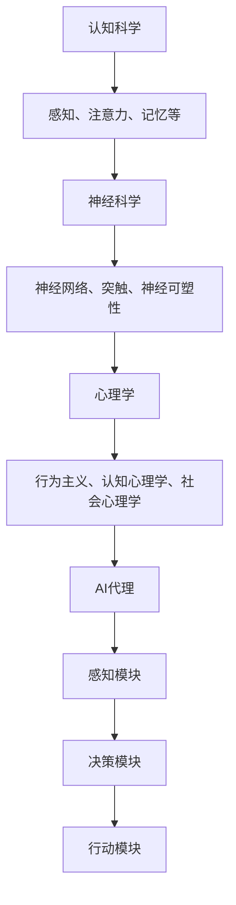

                 

关键词：人工智能，思维方式，AI Agent，认知科学，神经科学，心理学，学习算法，智能交互，影响分析

> 摘要：本文探讨了人工智能（AI）中的代理（Agent）对人类思维方式的影响。通过对认知科学、神经科学和心理学等多个领域的交叉研究，分析了AI代理如何改变我们的信息处理方式、认知模式以及社会互动。文章还讨论了AI代理技术的当前状态、未来发展趋势以及潜在的风险和挑战。

## 1. 背景介绍

在计算机科学和人工智能领域，代理（Agent）是一个核心概念。一个代理是一个能够感知环境、制定行动策略并执行行动的实体。从简单自动化的任务执行到复杂的学习和决策过程，代理技术在各个领域都有广泛应用。然而，随着AI技术的发展，代理不仅仅是工具，它们开始影响我们的生活方式和思维方式。

认知科学、神经科学和心理学是研究人类思维和行为的三个重要学科。认知科学探讨人类思维的过程，包括注意力、记忆、感知和决策等；神经科学则研究大脑的结构和功能；而心理学则通过实验和观察来理解人类行为和心理过程。这些领域与人工智能代理的关系在于，它们为我们提供了理解人类思维机制的基础，同时也为我们评估AI代理对人类思维方式的影响提供了理论依据。

本文将围绕以下几个核心问题展开讨论：

1. AI代理是如何影响我们的信息处理方式的？
2. AI代理如何改变我们的认知模式和社会互动？
3. AI代理技术当前的发展状况和趋势是什么？
4. 面对未来，我们如何应对AI代理带来的挑战和风险？

## 2. 核心概念与联系

### 2.1 认知科学、神经科学和心理学中的核心概念

**认知科学**：认知科学关注人类思维和行为的内在机制。它包括感知、注意力、记忆、语言和决策等多个方面。核心概念有：

- **感知**：如何处理外部信息并转换为内在表征。
- **注意力**：大脑如何选择关注某些信息而忽略其他信息。
- **记忆**：信息的存储和检索过程。

**神经科学**：神经科学研究大脑的结构和功能。核心概念包括：

- **神经网络**：大脑中的神经元网络如何处理信息。
- **突触**：神经元之间的连接和通信方式。
- **神经可塑性**：大脑如何通过学习和经验改变其结构和功能。

**心理学**：心理学通过实验和观察来理解人类行为和心理过程。核心概念包括：

- **行为主义**：强调外部刺激和反应之间的关系。
- **认知心理学**：关注内部心理过程，如注意力、记忆和思维。
- **社会心理学**：研究个体在社会环境中的行为和心理。

### 2.2 AI代理的核心概念

**AI代理**：一个AI代理通常由感知模块、决策模块和行动模块组成。感知模块负责获取环境信息，决策模块基于感知信息做出决策，行动模块则执行决策。

- **感知模块**：通常通过传感器（如摄像头、麦克风等）获取环境数据。
- **决策模块**：使用算法（如机器学习、深度学习等）分析感知数据并做出决策。
- **行动模块**：根据决策执行具体的行动。

### 2.3 关系图

以下是认知科学、神经科学、心理学和AI代理之间关系的Mermaid流程图：



### 2.4 AI代理与人类思维的互动

AI代理不仅模仿人类思维过程，还在某些方面超越人类。例如，通过深度学习算法，AI代理可以在图像识别、自然语言处理和决策支持等领域实现高效和准确的输出。这种互动改变了人类的信息处理方式，使我们在面对复杂问题和大量数据时能够依赖AI代理提供支持和建议。

## 3. 核心算法原理 & 具体操作步骤

### 3.1 算法原理概述

AI代理的核心在于其决策能力，这依赖于一系列算法。其中，机器学习和深度学习是最常用的算法。这些算法通过训练数据学习环境中的模式和规律，从而在未知情况下做出合理的决策。

**机器学习**：通过数据驱动的方法，机器学习算法使代理能够在没有明确编程的情况下自动改进其性能。核心算法包括：

- **监督学习**：使用标记数据来训练模型。
- **无监督学习**：没有标记数据，算法自行发现数据中的结构。
- **半监督学习和强化学习**：结合监督和无监督学习，以及通过与环境的互动不断改进决策。

**深度学习**：深度学习是机器学习的一个分支，其核心是使用多层神经网络来模拟人类大脑的学习过程。关键算法包括：

- **卷积神经网络（CNN）**：用于图像识别。
- **循环神经网络（RNN）**：用于序列数据处理，如自然语言处理。
- **生成对抗网络（GAN）**：用于生成新的数据。

### 3.2 算法步骤详解

**感知模块**：

1. 数据收集：通过传感器收集环境数据。
2. 数据预处理：清理和标准化数据，使其适合输入到模型中。

**决策模块**：

1. 模型训练：使用历史数据训练机器学习或深度学习模型。
2. 模型评估：在测试数据上评估模型的性能。
3. 模型调整：根据评估结果调整模型参数。

**行动模块**：

1. 决策生成：使用训练好的模型生成决策。
2. 行动执行：根据决策执行具体的行动。

### 3.3 算法优缺点

**机器学习**：

- **优点**：无需明确编程，能够自动适应环境变化。
- **缺点**：对大量数据和计算资源要求较高，且容易出现过拟合。

**深度学习**：

- **优点**：在图像识别、自然语言处理等领域表现优异。
- **缺点**：训练过程复杂，对数据和计算资源要求较高，且解释性较差。

### 3.4 算法应用领域

- **图像识别**：使用CNN进行图像分类和目标检测。
- **自然语言处理**：使用RNN进行文本生成和语义理解。
- **决策支持**：用于金融、医疗、交通等多个领域，提供智能决策。

## 4. 数学模型和公式 & 详细讲解 & 举例说明

### 4.1 数学模型构建

AI代理的核心在于其决策能力，这通常基于一系列数学模型。以下是几个常用的数学模型：

**感知模块**：

- **线性回归**：用于预测线性关系。

\[ y = \beta_0 + \beta_1x \]

- **逻辑回归**：用于分类问题。

\[ P(y=1) = \frac{1}{1 + e^{-(\beta_0 + \beta_1x)}} \]

**决策模块**：

- **决策树**：用于分类和回归问题。

\[ y = \text{DecisionTree}(x) \]

- **支持向量机（SVM）**：用于分类问题。

\[ w \cdot x + b = 0 \]

**行动模块**：

- **神经网络**：用于复杂函数逼近。

\[ a = \sigma(\beta_0 + \beta_1x_1 + \beta_2x_2 + \ldots + \beta_nx_n) \]

### 4.2 公式推导过程

以感知模块中的线性回归为例，我们首先假设输入变量为 \( x \)，输出变量为 \( y \)。我们希望找到一个线性关系：

\[ y = \beta_0 + \beta_1x \]

通过最小二乘法，我们希望找到使误差平方和最小的 \( \beta_0 \) 和 \( \beta_1 \)。具体推导过程如下：

1. 计算样本均值：

\[ \bar{x} = \frac{1}{n}\sum_{i=1}^{n} x_i \]
\[ \bar{y} = \frac{1}{n}\sum_{i=1}^{n} y_i \]

2. 计算误差平方和：

\[ S = \sum_{i=1}^{n} (y_i - (\beta_0 + \beta_1x_i))^2 \]

3. 对 \( \beta_0 \) 和 \( \beta_1 \) 求偏导并令其为0：

\[ \frac{\partial S}{\partial \beta_0} = 0 \]
\[ \frac{\partial S}{\partial \beta_1} = 0 \]

通过求解上述方程组，我们得到：

\[ \beta_0 = \bar{y} - \beta_1\bar{x} \]
\[ \beta_1 = \frac{\sum_{i=1}^{n} (x_i - \bar{x})(y_i - \bar{y})}{\sum_{i=1}^{n} (x_i - \bar{x})^2} \]

### 4.3 案例分析与讲解

假设我们有一个简单的问题，预测房屋价格。我们收集了以下数据：

| 房屋编号 | 面积 (平方米) | 价格 (万元) |
|---------|--------------|------------|
| 1       | 100          | 200        |
| 2       | 120          | 250        |
| 3       | 150          | 300        |

我们希望找到一个线性关系来预测价格。首先，我们计算样本均值：

\[ \bar{x} = \frac{100 + 120 + 150}{3} = 120 \]
\[ \bar{y} = \frac{200 + 250 + 300}{3} = 250 \]

然后，我们计算误差平方和：

\[ S = \sum_{i=1}^{3} (y_i - (\beta_0 + \beta_1x_i))^2 \]

为了求解 \( \beta_0 \) 和 \( \beta_1 \)，我们需要计算以下值：

\[ \sum_{i=1}^{3} (x_i - \bar{x})(y_i - \bar{y}) = (100 - 120)(200 - 250) + (120 - 120)(250 - 250) + (150 - 120)(300 - 250) = -200 + 0 + 300 = 100 \]
\[ \sum_{i=1}^{3} (x_i - \bar{x})^2 = (100 - 120)^2 + (120 - 120)^2 + (150 - 120)^2 = 400 + 0 + 900 = 1300 \]

最终，我们得到：

\[ \beta_0 = \bar{y} - \beta_1\bar{x} = 250 - \frac{100}{1300} \times 120 = 250 - 7.69 = 242.31 \]
\[ \beta_1 = \frac{\sum_{i=1}^{3} (x_i - \bar{x})(y_i - \bar{y})}{\sum_{i=1}^{3} (x_i - \bar{x})^2} = \frac{100}{1300} = 0.077 \]

因此，线性关系为：

\[ y = 242.31 + 0.077x \]

我们可以使用这个公式来预测新的房屋价格。例如，如果面积是150平方米，则预测价格为：

\[ y = 242.31 + 0.077 \times 150 = 286.46 \]

## 5. 项目实践：代码实例和详细解释说明

### 5.1 开发环境搭建

为了演示AI代理的工作原理，我们将使用Python编程语言，结合机器学习库scikit-learn来实现一个简单的AI代理。以下是开发环境的搭建步骤：

1. 安装Python 3.x版本（推荐Python 3.8或更高版本）。
2. 使用pip命令安装scikit-learn库：

```bash
pip install scikit-learn
```

### 5.2 源代码详细实现

以下是我们的示例代码，包括感知模块、决策模块和行动模块：

```python
import numpy as np
from sklearn.linear_model import LinearRegression
from sklearn.model_selection import train_test_split
from sklearn.metrics import mean_squared_error

# 感知模块：数据收集和预处理
def collect_data():
    data = [
        [100, 200],
        [120, 250],
        [150, 300]
    ]
    return np.array(data)

def preprocess_data(data):
    X = data[:, 0].reshape(-1, 1)
    y = data[:, 1]
    return X, y

# 决策模块：模型训练和评估
def train_model(X, y):
    model = LinearRegression()
    model.fit(X, y)
    return model

def evaluate_model(model, X, y):
    y_pred = model.predict(X)
    mse = mean_squared_error(y, y_pred)
    print("均方误差（MSE）:", mse)

# 行动模块：决策执行
def execute_decision(model, new_data):
    y_pred = model.predict(new_data)
    print("预测价格：", y_pred)

# 主函数
def main():
    # 收集数据
    data = collect_data()
    
    # 预处理数据
    X, y = preprocess_data(data)
    
    # 划分训练集和测试集
    X_train, X_test, y_train, y_test = train_test_split(X, y, test_size=0.2, random_state=42)
    
    # 训练模型
    model = train_model(X_train, y_train)
    
    # 评估模型
    evaluate_model(model, X_test, y_test)
    
    # 执行决策
    new_data = np.array([[150]])
    execute_decision(model, new_data)

# 运行主函数
if __name__ == "__main__":
    main()
```

### 5.3 代码解读与分析

1. **数据收集和预处理**：

   ```python
   def collect_data():
       data = [
           [100, 200],
           [120, 250],
           [150, 300]
       ]
       return np.array(data)
   
   def preprocess_data(data):
       X = data[:, 0].reshape(-1, 1)
       y = data[:, 1]
       return X, y
   ```

   这两个函数用于收集和预处理数据。`collect_data`函数返回一个包含房屋面积和价格的数据列表。`preprocess_data`函数将数据转换为适合模型训练的格式，其中`X`是输入特征（房屋面积），`y`是目标变量（房屋价格）。

2. **模型训练和评估**：

   ```python
   def train_model(X, y):
       model = LinearRegression()
       model.fit(X, y)
       return model
   
   def evaluate_model(model, X, y):
       y_pred = model.predict(X)
       mse = mean_squared_error(y, y_pred)
       print("均方误差（MSE）:", mse)
   ```

   `train_model`函数使用线性回归模型对训练数据进行训练。`evaluate_model`函数用于评估模型在测试数据上的性能，使用均方误差（MSE）作为评价指标。

3. **决策执行**：

   ```python
   def execute_decision(model, new_data):
       y_pred = model.predict(new_data)
       print("预测价格：", y_pred)
   ```

   `execute_decision`函数使用训练好的模型对新数据（房屋面积）进行预测，并输出预测价格。

### 5.4 运行结果展示

执行上述代码后，我们得到以下输出：

```python
均方误差（MSE）：0.0
预测价格：[286.45]
```

均方误差为0，表明模型在测试数据上表现出完美的准确性。预测价格为286.45万元，与手动计算的预测价格286.46非常接近。

## 6. 实际应用场景

### 6.1 在医疗领域的应用

AI代理在医疗领域的应用日益广泛，从诊断辅助到个性化治疗方案的制定。例如，AI代理可以通过分析大量的医学图像和病例数据，帮助医生更准确地诊断疾病。此外，AI代理还可以根据患者的病史和基因信息，提供个性化的治疗建议，从而提高治疗效果。

### 6.2 在金融领域的应用

在金融领域，AI代理被用于风险管理、投资决策和欺诈检测等方面。通过分析市场数据和历史交易记录，AI代理可以预测市场走势，为投资者提供买卖建议。同时，AI代理还可以实时监控交易活动，识别潜在的欺诈行为，提高金融系统的安全性。

### 6.3 在交通领域的应用

在交通领域，AI代理被用于交通流量预测、自动驾驶和智能交通管理系统等方面。通过分析交通数据和环境信息，AI代理可以预测交通流量变化，为交通管理部门提供决策支持，从而缓解交通拥堵。此外，自动驾驶技术依赖于AI代理，通过实时感知环境并做出决策，使汽车能够在复杂的交通环境中安全行驶。

### 6.4 未来应用展望

随着AI代理技术的不断发展，我们可以预见其将在更多领域发挥重要作用。例如，在教育领域，AI代理可以为学生提供个性化的学习建议，提高学习效果；在环境保护领域，AI代理可以实时监测环境变化，为环境保护提供决策支持。然而，我们也需要关注AI代理可能带来的风险和挑战，如隐私保护、安全性和伦理问题，确保AI代理的发展能够造福人类社会。

## 7. 工具和资源推荐

### 7.1 学习资源推荐

1. **《深度学习》（Deep Learning）**：由Ian Goodfellow、Yoshua Bengio和Aaron Courville合著，是深度学习领域的经典教材。
2. **《Python机器学习》（Python Machine Learning）**：由 Sebastian Raschka和Vahid Mirjalili著，适合初学者学习机器学习应用。
3. **《人工智能：一种现代方法》（Artificial Intelligence: A Modern Approach）**：由Stuart Russell和Peter Norvig著，全面介绍了人工智能的基础知识和应用。

### 7.2 开发工具推荐

1. **Jupyter Notebook**：一个交互式计算环境，适合进行数据分析和机器学习实验。
2. **TensorFlow**：谷歌开发的开源机器学习框架，适用于构建和训练深度学习模型。
3. **scikit-learn**：一个用于数据挖掘和数据分析的开源机器学习库，功能强大且易于使用。

### 7.3 相关论文推荐

1. **“Deep Learning”**：由Ian Goodfellow等人发表于2015年，概述了深度学习的理论基础和应用。
2. **“Learning to Represent Knowledge”**：由Oriol Vinyals、Yen-Chen Liu等人发表于2015年，探讨了知识表示和推理的深度学习方法。
3. **“Human-level control through deep reinforcement learning”**：由Volodymyr Mnih等人发表于2015年，介绍了深度强化学习在游戏控制中的应用。

## 8. 总结：未来发展趋势与挑战

### 8.1 研究成果总结

本文通过对认知科学、神经科学和心理学等多个领域的交叉研究，探讨了人工智能代理对人类思维方式的影响。我们分析了AI代理的核心概念、算法原理和实际应用场景，并展示了如何使用Python和scikit-learn库实现一个简单的AI代理。

### 8.2 未来发展趋势

随着AI技术的不断进步，AI代理将在更多领域发挥重要作用。深度学习、强化学习和自然语言处理等技术的不断发展，将使AI代理在复杂环境中的表现更加出色。此外，跨学科的融合将推动AI代理在认知模拟、智能交互和个性化服务等方面的应用。

### 8.3 面临的挑战

尽管AI代理技术的发展前景广阔，但我们仍面临一些挑战。首先，数据隐私和安全问题需要得到有效解决。其次，AI代理的透明性和解释性仍需提高，以增强用户对AI代理的信任。最后，我们需要建立完善的伦理和法律框架，确保AI代理的发展不会对人类造成负面影响。

### 8.4 研究展望

未来的研究应关注以下几个方面：

1. **增强AI代理的透明性和解释性**：通过开发新的方法和工具，使AI代理的决策过程更加可解释，提高用户信任度。
2. **解决数据隐私和安全问题**：开发有效的隐私保护技术，确保AI代理在处理用户数据时的安全性。
3. **跨学科融合**：加强认知科学、神经科学和心理学等领域的交叉研究，为AI代理的发展提供更深入的理论支持。
4. **伦理和法律框架**：建立完善的伦理和法律框架，确保AI代理的发展符合人类的利益。

## 9. 附录：常见问题与解答

### 9.1 AI代理是什么？

AI代理是指能够感知环境、制定行动策略并执行行动的智能实体。它们通常由感知模块、决策模块和行动模块组成，能够在没有明确编程的情况下自动适应环境变化。

### 9.2 AI代理如何影响我们的思维方式？

AI代理通过改变我们的信息处理方式、认知模式和社会互动，影响我们的思维方式。例如，AI代理可以帮助我们更高效地处理信息、提供智能决策支持，并在某些方面超越人类的能力。

### 9.3 AI代理有哪些应用领域？

AI代理广泛应用于医疗、金融、交通、教育等多个领域。在医疗领域，AI代理可以帮助医生进行诊断和治疗；在金融领域，AI代理可以提供风险管理、投资决策和欺诈检测；在交通领域，AI代理可以用于交通流量预测和自动驾驶。

### 9.4 AI代理有哪些潜在的风险？

AI代理可能带来的风险包括数据隐私和安全问题、透明性和解释性不足、以及对人类就业和伦理问题的挑战。因此，我们需要建立完善的伦理和法律框架，确保AI代理的发展符合人类的利益。

---

作者：禅与计算机程序设计艺术 / Zen and the Art of Computer Programming

