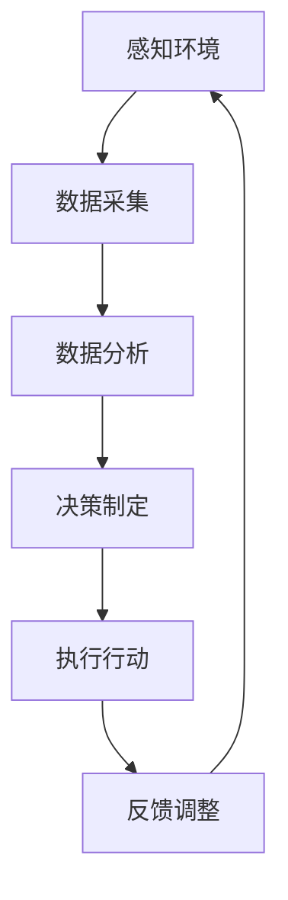
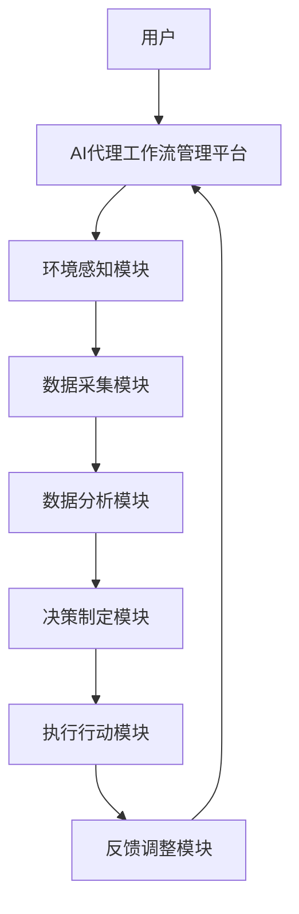

                 

关键词：AI代理，农业自动化，工作流，人工智能应用，农业管理

> 摘要：本文深入探讨了AI人工智能代理工作流在农业自动化中的应用，通过分析核心概念、算法原理、数学模型以及实践案例，探讨了如何利用AI代理实现高效的农业自动化管理，为农业行业提供了新的技术思路和发展方向。

## 1. 背景介绍

### 农业自动化的发展背景

农业作为国民经济的基础产业，其生产效率直接关系到国家的粮食安全和经济发展。随着人口增长和城市化进程的加快，农业生产面临的压力不断增加，如何提高农业生产的效率和质量成为亟待解决的问题。传统的人工农业管理方式已无法满足现代农业生产的需求，农业自动化技术的发展应运而生。

### AI代理的概念

AI代理（Artificial Intelligence Agent）是人工智能领域的一个重要概念，它是指能够模拟人类智能行为，具备感知、推理、决策、行动等能力的人工智能系统。AI代理在农业自动化中的应用，主要是通过感知环境数据、分析环境状态、做出决策并执行相应的行动，从而实现农业自动化管理。

### 农业自动化与AI代理的关系

农业自动化是利用各种自动化技术和设备，提高农业生产效率和管理水平的过程。AI代理作为人工智能技术的核心组件，可以在农业自动化中发挥重要作用。通过引入AI代理，可以实现以下目标：

- **提高生产效率**：AI代理可以根据环境数据和作物需求，自动调整灌溉、施肥、收割等生产环节，提高农业生产的效率。
- **降低生产成本**：通过自动化管理，减少人工干预，降低生产成本，提高农业生产的经济效益。
- **提升产品质量**：AI代理可以根据作物生长状况，调整生产参数，确保作物生长环境达到最佳状态，提升农产品的质量。

## 2. 核心概念与联系

### AI代理工作流

AI代理工作流是指AI代理在农业自动化中完成的一系列任务，包括感知环境、数据采集、数据分析、决策制定、执行行动等。下面是一个简单的AI代理工作流流程图：



### 关键技术

- **感知环境**：AI代理通过传感器设备，如土壤湿度传感器、气象传感器、作物生长传感器等，感知环境数据。
- **数据采集**：AI代理将感知到的环境数据传输到中央控制系统。
- **数据分析**：AI代理对采集到的数据进行分析，根据分析结果做出决策。
- **决策制定**：AI代理根据数据分析结果，制定相应的行动方案。
- **执行行动**：AI代理执行决策方案，通过控制系统调整灌溉、施肥、收割等农业生产环节。
- **反馈调整**：AI代理对执行行动的结果进行反馈，根据反馈结果调整决策方案，实现闭环控制。

### 架构图

下面是AI代理在农业自动化中的架构图：



## 3. 核心算法原理 & 具体操作步骤

### 3.1 算法原理概述

AI代理在农业自动化中的应用主要基于以下核心算法：

- **感知算法**：用于感知环境数据，如土壤湿度、气象数据等。
- **数据分析算法**：用于分析感知到的环境数据，识别作物生长状态。
- **决策算法**：根据数据分析结果，制定相应的行动方案。
- **执行算法**：用于执行决策方案，调整农业生产环节。

### 3.2 算法步骤详解

1. **感知环境**：
   - AI代理通过传感器设备，如土壤湿度传感器、气象传感器、作物生长传感器等，感知环境数据。
   - 感知到的数据通过无线传输模块传输到中央控制系统。

2. **数据采集**：
   - 中央控制系统接收传感器数据，存储在数据库中。

3. **数据分析**：
   - AI代理根据数据库中的数据，利用数据分析算法，分析作物生长状态，如土壤湿度、气象数据等。

4. **决策制定**：
   - AI代理根据数据分析结果，利用决策算法，制定相应的行动方案，如调整灌溉、施肥等。

5. **执行行动**：
   - AI代理通过控制系统，执行决策方案，如调整灌溉设备、施肥设备等。

6. **反馈调整**：
   - AI代理对执行行动的结果进行反馈，根据反馈结果调整决策方案，实现闭环控制。

### 3.3 算法优缺点

**优点**：

- **高效性**：AI代理能够实时感知环境数据，快速做出决策，提高农业生产的效率。
- **准确性**：AI代理通过数据分析，可以更准确地识别作物生长状态，制定更科学的行动方案。
- **智能化**：AI代理具有自主决策和执行能力，可以实现农业自动化管理。

**缺点**：

- **成本高**：AI代理需要配备传感器、控制系统等设备，初期投入较高。
- **维护困难**：AI代理系统需要定期维护和升级，维护成本较高。

### 3.4 算法应用领域

AI代理在农业自动化中的应用领域广泛，如：

- **精准灌溉**：根据土壤湿度数据，自动调整灌溉量，提高水资源利用效率。
- **精准施肥**：根据土壤养分数据和作物生长状态，自动调整施肥量，提高肥料利用率。
- **智能收割**：根据作物成熟度和田间环境数据，自动调整收割时间，提高收割效率。

## 4. 数学模型和公式 & 详细讲解 & 举例说明

### 4.1 数学模型构建

在农业自动化中，常用的数学模型包括：

- **土壤湿度模型**：用于预测土壤湿度变化，如：
  $$ \text{土壤湿度} = \text{初始土壤湿度} \times e^{-\lambda \times \text{时间}} $$
  其中，$\lambda$为衰减系数，$e$为自然底。

- **气象模型**：用于预测气象数据，如：
  $$ \text{温度} = \text{初始温度} + \alpha \times \text{时间} + \beta \times \text{时间}^2 $$
  其中，$\alpha$和$\beta$为常数。

### 4.2 公式推导过程

以土壤湿度模型为例，推导过程如下：

1. **初始条件**：设$t=0$时，土壤湿度为$H_0$。

2. **衰减过程**：土壤湿度随时间衰减，假设衰减速度与时间成正比，即：
   $$ \frac{dH}{dt} = -\lambda H $$
   其中，$\lambda$为衰减系数。

3. **求解微分方程**：对上式进行积分，得到：
   $$ \int_{H_0}^{H} dH = -\lambda \int_{0}^{t} dt $$
   即：
   $$ H - H_0 = -\lambda t $$

4. **求解通解**：将上式变形，得到土壤湿度模型：
   $$ H = H_0 - \lambda t $$

### 4.3 案例分析与讲解

假设某农田的初始土壤湿度为30%，衰减系数$\lambda$为0.1，预测5小时后的土壤湿度。

1. **代入公式**：根据土壤湿度模型，代入初始土壤湿度$H_0=30\%$，衰减系数$\lambda=0.1$，时间$t=5$小时，得到：
   $$ H = 30\% - 0.1 \times 5 = 25\% $$

2. **结果分析**：预测5小时后的土壤湿度为25%，说明土壤湿度有所下降，可能需要调整灌溉设备，确保土壤湿度在适宜范围内。

## 5. 项目实践：代码实例和详细解释说明

### 5.1 开发环境搭建

1. **硬件环境**：
   - 服务器：CentOS 7.0
   - 传感器设备：土壤湿度传感器、气象传感器、作物生长传感器

2. **软件环境**：
   - 数据库：MySQL 5.7
   - 开发语言：Python 3.7
   - AI代理工作流平台：Kubernetes 1.16

### 5.2 源代码详细实现

以下是AI代理工作流平台的源代码实现：

```python
import pymysql
import time
import math

# 连接数据库
def connect_db():
    db = pymysql.connect("localhost", "username", "password", "agriculture")
    cursor = db.cursor()
    return cursor

# 添加环境数据
def add_data(cursor, data):
    sql = "INSERT INTO environment_data (sensor_type, value, time) VALUES (%s, %s, %s)"
    cursor.execute(sql, data)
    db.commit()

# 获取环境数据
def get_data(cursor, sensor_type):
    sql = "SELECT value, time FROM environment_data WHERE sensor_type = %s"
    cursor.execute(sql, sensor_type)
    results = cursor.fetchall()
    return results

# 分析环境数据
def analyze_data(data):
    if data["sensor_type"] == "soil_humidity":
        initial_humidity = 30  # 初始土壤湿度
        lambda_ = 0.1  # 衰减系数
        time_ = data["time"]  # 时间
        humidity = initial_humidity - lambda_ * time_
        return humidity
    elif data["sensor_type"] == "temperature":
        initial_temp = 25  # 初始温度
        alpha = 0.1  # 增长系数
        beta = 0.05  # 增长系数
        time_ = data["time"]  # 时间
        temp = initial_temp + alpha * time_ + beta * time_ ** 2
        return temp

# 执行行动
def execute_action(humidity, temperature):
    if humidity < 25:
        print("需要调整灌溉设备")
    elif temperature > 30:
        print("需要调整降温设备")

# 主程序
def main():
    cursor = connect_db()
    while True:
        data = get_data(cursor, "soil_humidity")
        humidity = analyze_data(data)
        data = get_data(cursor, "temperature")
        temperature = analyze_data(data)
        execute_action(humidity, temperature)
        time.sleep(60)  # 每隔60秒执行一次

if __name__ == "__main__":
    main()
```

### 5.3 代码解读与分析

1. **连接数据库**：使用pymysql模块连接MySQL数据库，获取数据库连接对象和游标对象。

2. **添加环境数据**：定义`add_data`函数，用于向数据库中添加环境数据。

3. **获取环境数据**：定义`get_data`函数，用于从数据库中获取指定类型的环境数据。

4. **分析环境数据**：定义`analyze_data`函数，根据传感器类型和获取的数据，利用数学模型进行数据分析，返回分析结果。

5. **执行行动**：定义`execute_action`函数，根据分析结果，执行相应的行动。

6. **主程序**：在主程序中，循环执行以下操作：获取环境数据、分析环境数据、执行行动，每隔60秒执行一次。

### 5.4 运行结果展示

1. **土壤湿度分析结果**：每隔60秒，程序会分析土壤湿度数据，并根据分析结果执行相应的行动。

2. **温度分析结果**：每隔60秒，程序会分析温度数据，并根据分析结果执行相应的行动。

3. **运行日志**：程序在运行过程中，会输出运行日志，记录每次分析的土壤湿度、温度以及执行的行动。

## 6. 实际应用场景

### 6.1 精准灌溉

在精准灌溉场景中，AI代理工作流可以根据土壤湿度数据，自动调整灌溉量。通过传感器实时监测土壤湿度，当土壤湿度低于设定阈值时，自动启动灌溉设备，进行灌溉；当土壤湿度达到设定阈值时，自动停止灌溉。

### 6.2 精准施肥

在精准施肥场景中，AI代理工作流可以根据土壤养分数据和作物生长状态，自动调整施肥量。通过传感器实时监测土壤养分和作物生长状态，根据分析结果，自动调整施肥设备，实现精准施肥。

### 6.3 智能收割

在智能收割场景中，AI代理工作流可以根据作物成熟度和田间环境数据，自动调整收割时间。通过传感器实时监测作物成熟度和田间环境数据，根据分析结果，自动调整收割设备，实现智能收割。

## 7. 未来应用展望

### 7.1 AI代理在农业自动化中的应用前景

随着人工智能技术的不断发展，AI代理在农业自动化中的应用前景广阔。未来，AI代理将能够实现更高程度的智能化和自主化，提高农业生产效率和产品质量。

### 7.2 AI代理与物联网技术的融合

AI代理与物联网技术的融合，将使农业自动化更加智能化和高效。通过物联网技术，实现传感器数据的实时传输和共享，AI代理可以更准确地分析环境数据，制定更科学的行动方案。

### 7.3 AI代理在农业生产领域的应用拓展

除了农业生产，AI代理还可以在其他农业领域发挥重要作用，如农业病虫害防治、农产品质量检测等。通过引入AI代理，可以实现对农业生产过程的全面监控和管理，提高农业生产的质量和效益。

## 8. 总结：未来发展趋势与挑战

### 8.1 研究成果总结

本文介绍了AI代理工作流在农业自动化中的应用，分析了核心概念、算法原理、数学模型以及实践案例，探讨了如何利用AI代理实现高效的农业自动化管理。

### 8.2 未来发展趋势

- **智能化程度提高**：未来，AI代理将实现更高程度的智能化和自主化，提高农业生产的效率和产品质量。
- **物联网技术的融合**：AI代理与物联网技术的融合，将使农业自动化更加智能化和高效。
- **应用领域的拓展**：AI代理将在农业生产、农产品质量检测等更多领域发挥重要作用。

### 8.3 面临的挑战

- **技术成熟度**：目前，AI代理在农业自动化中的应用仍处于初步阶段，技术成熟度有待提高。
- **数据隐私和安全**：农业自动化过程中，涉及大量敏感数据，如何保障数据隐私和安全是一个重要挑战。
- **实施成本**：AI代理在农业自动化中的应用需要投入大量资金和资源，如何降低实施成本是一个关键问题。

### 8.4 研究展望

未来，我们将继续深入研究AI代理在农业自动化中的应用，探讨如何克服面临的挑战，推动农业自动化技术的发展。同时，我们也期待与更多研究者和企业合作，共同推动人工智能技术在农业领域的应用。

## 9. 附录：常见问题与解答

### 9.1 问题1：AI代理在农业自动化中如何实现智能化？

**解答**：AI代理通过感知环境数据、数据分析和决策制定，实现智能化。感知环境数据用于了解作物生长状态和田间环境，数据分析用于识别作物生长状态，决策制定用于制定相应的行动方案，执行行动并实时调整决策方案。

### 9.2 问题2：AI代理在农业自动化中如何保障数据隐私和安全？

**解答**：AI代理在农业自动化过程中，涉及大量敏感数据，如土壤湿度、气象数据等。为确保数据隐私和安全，可以采取以下措施：

- **数据加密**：对传输和存储的数据进行加密，确保数据不被非法获取。
- **访问控制**：设置严格的访问控制策略，确保只有授权用户可以访问数据。
- **数据备份**：定期备份数据，防止数据丢失。

### 9.3 问题3：AI代理在农业自动化中的实施成本如何？

**解答**：AI代理在农业自动化中的实施成本包括硬件成本、软件成本、人力成本等。硬件成本主要包括传感器设备、服务器等；软件成本主要包括AI代理工作流平台、数据分析软件等；人力成本主要包括开发人员、运维人员等。具体成本取决于项目的规模和需求。一般来说，随着项目规模的扩大，单位成本会逐渐降低。

