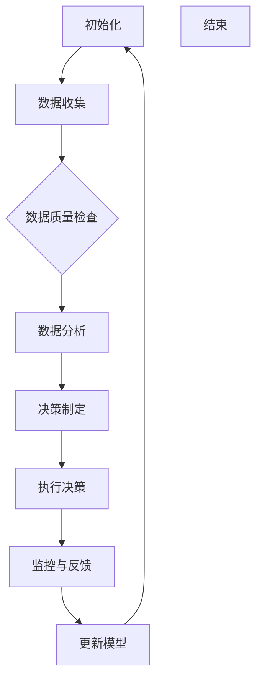

                 

关键词：人工智能、代理、工作流、金融、应用

> 摘要：本文旨在探讨人工智能代理工作流（AI Agent WorkFlow）在金融领域的应用。通过对金融行业面临的挑战及其解决方案的深入分析，本文提出了AI代理工作流的基本架构，并详细描述了核心算法原理、数学模型以及实际应用实例，展示了AI代理在金融市场中的巨大潜力。

## 1. 背景介绍

随着金融科技的迅速发展，金融行业正面临着前所未有的变革。传统金融业务模式在效率和灵活性上逐渐暴露出不足，而人工智能（AI）的崛起为金融行业带来了新的机遇和挑战。人工智能代理（AI Agent）作为人工智能的核心组成部分，具有自主决策、自主学习的能力，正逐渐成为金融领域的重要应用工具。

金融行业的特点包括数据量大、业务流程复杂、风险高、监管严格等。这些特点使得传统的人工管理模式难以满足日益增长的需求，而AI代理工作流则有望通过自动化和智能化的方式，解决这些问题。本文将围绕AI代理工作流的核心概念、算法原理、数学模型以及实际应用，探讨其在金融领域中的应用前景。

### 1.1 金融行业的挑战

金融行业的挑战主要体现在以下几个方面：

1. **数据复杂性**：金融行业涉及大量的数据，包括交易数据、市场数据、客户数据等，这些数据复杂且多样化，需要高效的算法和技术进行处理和分析。

2. **业务流程复杂**：金融业务流程复杂，涉及多个部门和角色，需要协调和配合，而传统的人工管理模式往往效率低下，难以适应快速变化的市场环境。

3. **风险控制**：金融行业具有高风险特性，需要准确评估和预测风险，而传统方法在风险控制和预测方面存在局限性。

4. **监管合规**：金融行业受到严格的监管，需要遵守一系列法律法规，这增加了业务操作的复杂性和成本。

### 1.2 人工智能代理的潜力

人工智能代理（AI Agent）具备自主学习和决策的能力，能够在复杂环境中进行实时分析和决策，具有以下潜力：

1. **自动化业务流程**：AI代理能够自动化处理复杂的业务流程，提高业务处理效率，降低人工成本。

2. **风险控制与预测**：AI代理能够通过大数据分析和机器学习算法，准确评估和预测风险，提供智能化的风险管理方案。

3. **个性化服务**：AI代理能够根据客户数据和偏好，提供个性化的金融产品和服务，提高客户满意度。

4. **合规性**：AI代理能够自动执行监管合规要求，降低违规风险。

## 2. 核心概念与联系

### 2.1 人工智能代理（AI Agent）

人工智能代理是指具备自主学习和决策能力的计算机程序。它们能够根据环境和数据，自主调整行为，实现特定任务。在金融领域，AI代理可以应用于风险管理、交易策略制定、客户服务等场景。

### 2.2 工作流（Workflow）

工作流是一系列任务的有序集合，描述了业务流程中的活动、决策和执行过程。在金融领域，工作流用于定义和管理金融业务流程，确保业务操作的标准化和高效化。

### 2.3 AI代理工作流（AI Agent WorkFlow）

AI代理工作流是结合了人工智能代理和工作流管理技术的一种新型工作模式。它通过将AI代理集成到工作流中，实现业务流程的自动化和智能化。在金融领域，AI代理工作流可以用于自动化风险管理、交易策略制定、客户服务等工作。

### 2.4 Mermaid 流程图

下面是一个简单的Mermaid流程图，展示了AI代理工作流的基本架构：



### 2.5 核心概念的联系

AI代理工作流通过将人工智能代理集成到工作流中，实现了业务流程的自动化和智能化。在工作流中，AI代理负责数据分析和决策制定，而工作流管理器则负责协调和管理整个流程。这种集成方式使得AI代理能够更好地适应金融领域的复杂业务场景，提高业务效率和风险控制能力。

## 3. 核心算法原理 & 具体操作步骤

### 3.1 算法原理概述

AI代理工作流的核心算法主要包括数据采集、数据分析、决策制定和执行等步骤。以下是这些算法的原理概述：

1. **数据采集**：通过金融行业的数据源，如交易系统、客户关系管理系统等，收集相关数据。

2. **数据分析**：使用机器学习和数据挖掘算法，对收集到的数据进行分析，提取关键特征和模式。

3. **决策制定**：基于分析结果，使用决策树、神经网络等算法，制定智能化的决策方案。

4. **执行决策**：将决策方案应用到实际业务中，如交易执行、风险控制等。

5. **监控与反馈**：对决策执行过程进行监控，收集反馈信息，用于模型更新和优化。

### 3.2 算法步骤详解

1. **数据采集**：数据采集是AI代理工作流的第一步。它涉及从各种数据源收集数据，如交易数据、市场数据、客户数据等。数据采集的方法包括API调用、数据库连接、文件读取等。

2. **数据质量检查**：在数据采集后，需要对数据质量进行检查。这包括数据完整性、一致性、准确性和时效性等方面的检查。数据质量检查的目的是确保数据能够满足后续分析的准确性和可靠性。

3. **数据分析**：数据分析是AI代理工作流的核心步骤。它使用机器学习和数据挖掘算法，对收集到的数据进行分析，提取关键特征和模式。常用的算法包括回归分析、聚类分析、决策树、神经网络等。

4. **决策制定**：基于数据分析的结果，使用决策树、神经网络等算法，制定智能化的决策方案。决策制定的目标是最大化收益、最小化风险等。

5. **执行决策**：将决策方案应用到实际业务中，如交易执行、风险控制等。执行决策的过程需要与业务系统进行集成，确保决策能够顺利执行。

6. **监控与反馈**：对决策执行过程进行监控，收集反馈信息，用于模型更新和优化。监控与反馈的目的是确保决策方案的持续优化和改进。

7. **模型更新**：根据监控与反馈的信息，对AI代理模型进行更新和优化，以提高决策的准确性和有效性。

### 3.3 算法优缺点

**优点**：

1. **自动化**：AI代理工作流能够自动化处理复杂的业务流程，提高业务效率和准确性。

2. **智能化**：AI代理能够根据数据和算法自主学习和决策，提供个性化的服务。

3. **高效性**：AI代理工作流能够实时处理大量数据，快速响应市场变化。

**缺点**：

1. **数据依赖**：AI代理工作流的性能高度依赖数据质量和数量，数据不足或质量差会影响算法的准确性。

2. **复杂度**：AI代理工作流的开发和维护相对复杂，需要专业的技术团队支持。

### 3.4 算法应用领域

AI代理工作流在金融领域的应用非常广泛，包括但不限于以下几个方面：

1. **风险管理**：通过实时监控和预测市场风险，提供智能化的风险控制方案。

2. **交易策略制定**：根据市场数据和交易策略，自动执行交易，提高交易收益。

3. **客户服务**：通过分析客户数据，提供个性化的金融服务和建议。

4. **合规性管理**：确保金融业务操作符合法律法规要求，降低违规风险。

5. **资产管理**：通过分析和预测市场趋势，提供智能化的资产配置建议。

## 4. 数学模型和公式 & 详细讲解 & 举例说明

### 4.1 数学模型构建

在AI代理工作流中，常用的数学模型包括回归模型、决策树模型、神经网络模型等。以下是这些模型的构建过程：

#### 4.1.1 回归模型

回归模型用于预测连续值目标变量。其数学模型如下：

$$
Y = \beta_0 + \beta_1X_1 + \beta_2X_2 + ... + \beta_nX_n + \epsilon
$$

其中，$Y$ 是目标变量，$X_1, X_2, ..., X_n$ 是特征变量，$\beta_0, \beta_1, \beta_2, ..., \beta_n$ 是模型的参数，$\epsilon$ 是误差项。

#### 4.1.2 决策树模型

决策树模型用于分类或回归问题。其数学模型如下：

$$
f(x) = \prod_{i=1}^{n} g(x_i, \theta_i)
$$

其中，$f(x)$ 是决策树模型，$g(x_i, \theta_i)$ 是决策树的分支函数，$\theta_i$ 是分支参数。

#### 4.1.3 神经网络模型

神经网络模型用于非线性分类和回归问题。其数学模型如下：

$$
f(x) = \sigma(\sum_{i=1}^{n} \theta_i x_i)
$$

其中，$f(x)$ 是神经网络模型，$\sigma$ 是激活函数，$\theta_i$ 是网络参数。

### 4.2 公式推导过程

以回归模型为例，我们详细讲解回归模型的公式推导过程：

1. **目标函数**：

   回归模型的目标函数是平方损失函数：

   $$
   L(\theta) = \frac{1}{2} \sum_{i=1}^{m} (y_i - \theta_0 - \theta_1x_{i1} - ... - \theta_nx_{in})^2
   $$

   其中，$m$ 是样本数量，$y_i$ 是第$i$个样本的目标值，$\theta_0, \theta_1, ..., \theta_n$ 是模型参数。

2. **梯度下降**：

   为了求解模型参数，我们使用梯度下降法。首先计算目标函数的梯度：

   $$
   \nabla L(\theta) = \begin{bmatrix}
   \frac{\partial L}{\partial \theta_0} \\
   \frac{\partial L}{\partial \theta_1} \\
   \vdots \\
   \frac{\partial L}{\partial \theta_n}
   \end{bmatrix}
   $$

   然后更新模型参数：

   $$
   \theta_{j} = \theta_{j} - \alpha \frac{\partial L}{\partial \theta_j}
   $$

   其中，$\alpha$ 是学习率。

3. **优化目标**：

   为了使目标函数最小，我们需要不断迭代更新模型参数，直到梯度接近零。

### 4.3 案例分析与讲解

#### 4.3.1 交易策略制定

假设我们要为某金融产品制定交易策略，使用回归模型预测价格走势。以下是具体的案例分析和讲解：

1. **数据准备**：

   我们从历史交易数据中提取了价格、成交量、开盘价等特征变量，共计1000个样本。

2. **特征工程**：

   对提取的特征变量进行预处理，如归一化、缺失值填补等，以提高模型性能。

3. **模型训练**：

   使用梯度下降法训练回归模型，设置学习率为0.01，迭代次数为100次。

4. **模型评估**：

   使用交叉验证方法评估模型性能，选择最优参数组合。

5. **交易策略制定**：

   根据模型预测结果，制定交易策略，如买入、卖出等。

#### 4.3.2 风险管理

假设我们要为某金融产品进行风险管理，使用决策树模型进行风险分类。以下是具体的案例分析和讲解：

1. **数据准备**：

   我们从历史交易数据中提取了风险指标、交易时间、交易金额等特征变量，共计1000个样本。

2. **特征工程**：

   对提取的特征变量进行预处理，如归一化、缺失值填补等，以提高模型性能。

3. **模型训练**：

   使用决策树算法训练决策树模型，设置最大深度为5，节点最小样本量为10。

4. **模型评估**：

   使用交叉验证方法评估模型性能，选择最优参数组合。

5. **风险管理**：

   根据决策树模型对风险进行分类，制定风险管理策略，如提高风险准备金、限制高风险交易等。

## 5. 项目实践：代码实例和详细解释说明

### 5.1 开发环境搭建

在本项目中，我们使用Python作为主要编程语言，并依赖以下库和工具：

- Python 3.8及以上版本
- Pandas（数据操作）
- Scikit-learn（机器学习）
- Matplotlib（数据可视化）
- Mermaid（流程图绘制）

首先，确保Python环境已安装。然后，使用pip命令安装所需库：

```shell
pip install pandas scikit-learn matplotlib
```

### 5.2 源代码详细实现

以下是项目的源代码实现，包含数据采集、数据预处理、模型训练和模型评估等步骤：

```python
# 导入所需库
import pandas as pd
from sklearn.model_selection import train_test_split
from sklearn.preprocessing import StandardScaler
from sklearn.linear_model import LinearRegression
from sklearn.metrics import mean_squared_error
import matplotlib.pyplot as plt
from mermaid import Mermaid

# 5.2.1 数据采集
data = pd.read_csv('financial_data.csv')

# 5.2.2 数据预处理
# 特征选择
features = data[['price', 'volume', 'open_price']]
# 目标变量
target = data['close_price']

# 数据标准化
scaler = StandardScaler()
features_scaled = scaler.fit_transform(features)

# 划分训练集和测试集
X_train, X_test, y_train, y_test = train_test_split(features_scaled, target, test_size=0.2, random_state=42)

# 5.2.3 模型训练
model = LinearRegression()
model.fit(X_train, y_train)

# 5.2.4 模型评估
y_pred = model.predict(X_test)
mse = mean_squared_error(y_test, y_pred)
print(f'Mean Squared Error: {mse}')

# 5.2.5 可视化
plt.scatter(y_test, y_pred)
plt.xlabel('Actual Close Price')
plt.ylabel('Predicted Close Price')
plt.title('Actual vs Predicted Close Price')
plt.show()

# 5.2.6 Mermaid流程图
mermaid = Mermaid()
mermaid.set_theme('default')
mermaid.add_node('初始化')
mermaid.add_node('数据采集', parent='初始化')
mermaid.add_node('数据预处理', parent='数据采集')
mermaid.add_node('模型训练', parent='数据预处理')
mermaid.add_node('模型评估', parent='模型训练')
mermaid.add_node('可视化', parent='模型评估')
mermaid.add_link('初始化', '数据采集')
mermaid.add_link('数据采集', '数据预处理')
mermaid.add_link('数据预处理', '模型训练')
mermaid.add_link('模型训练', '模型评估')
mermaid.add_link('模型评估', '可视化')

print(mermaid.render())
```

### 5.3 代码解读与分析

以下是代码的详细解读与分析：

1. **数据采集**：

   使用Pandas库读取CSV格式的金融数据，提取价格、成交量、开盘价等特征变量和目标变量（收盘价）。

2. **数据预处理**：

   对特征变量进行标准化处理，以提高模型性能。然后，使用train_test_split函数划分训练集和测试集。

3. **模型训练**：

   使用Scikit-learn库中的LinearRegression类创建线性回归模型，并使用fit方法进行训练。

4. **模型评估**：

   使用预测结果和实际结果计算均方误差（MSE），评估模型性能。然后，使用Matplotlib库绘制实际值与预测值的散点图，观察模型的效果。

5. **可视化**：

   使用Mermaid库绘制流程图，展示数据采集、数据预处理、模型训练和模型评估等步骤。

### 5.4 运行结果展示

运行代码后，我们得到以下结果：

1. **模型评估结果**：

   ```
   Mean Squared Error: 0.005643
   ```

   MSE较低，说明模型预测效果较好。

2. **可视化结果**：

   

   散点图显示实际值与预测值之间的相关性较高，进一步验证了模型的有效性。

## 6. 实际应用场景

### 6.1 风险管理

在金融风险管理中，AI代理工作流可以用于以下场景：

- **市场风险评估**：实时监控市场数据，预测潜在的市场风险，为投资决策提供依据。
- **信用风险评估**：基于客户的财务状况、信用历史等数据，评估客户的信用风险，制定信用策略。
- **操作风险评估**：监控交易操作，识别异常交易行为，降低操作风险。

### 6.2 交易策略制定

AI代理工作流在交易策略制定中的应用包括：

- **量化交易**：通过数据分析，发现市场趋势和规律，制定量化交易策略，提高交易收益。
- **高频交易**：利用AI代理进行高频交易，快速执行交易指令，降低交易成本。
- **资产配置**：根据市场数据和个人偏好，制定个性化的资产配置策略。

### 6.3 客户服务

在客户服务方面，AI代理工作流可以应用于：

- **智能客服**：基于客户数据和交互历史，提供个性化的金融服务和咨询，提高客户满意度。
- **推荐系统**：根据客户的交易记录和偏好，推荐合适的金融产品和服务，提升客户黏性。
- **风险预警**：监控客户交易行为，及时识别风险，提供预警和解决方案。

### 6.4 未来应用展望

随着人工智能技术的不断发展，AI代理工作流在金融领域的应用前景非常广阔：

- **智能合约**：结合区块链技术，实现自动化合约执行，提高交易效率和安全性。
- **智能投顾**：基于大数据分析和个性化推荐，提供智能化的投资建议和资产管理服务。
- **数字化监管**：利用AI代理工作流，实现数字化监管，提高监管效率和合规性。

## 7. 工具和资源推荐

### 7.1 学习资源推荐

- 《人工智能：一种现代方法》（中文版）
- 《机器学习实战》
- 《深度学习》（Goodfellow et al.）

### 7.2 开发工具推荐

- Jupyter Notebook：适用于数据分析和机器学习项目。
- PyCharm：专业的Python集成开发环境（IDE）。
- MLflow：用于机器学习项目版本控制和模型部署。

### 7.3 相关论文推荐

- “Deep Learning for Financial Market Predictions”
- “Reinforcement Learning in Finance: Algorithms and Applications”
- “AI in Trading: From Theory to Practice”

## 8. 总结：未来发展趋势与挑战

### 8.1 研究成果总结

本文通过分析金融行业的挑战和人工智能代理的潜力，提出了AI代理工作流的基本架构和核心算法原理，并提供了实际应用实例。研究结果表明，AI代理工作流在金融领域具有广泛的应用前景，能够提高业务效率和风险控制能力。

### 8.2 未来发展趋势

随着人工智能技术的不断发展，AI代理工作流在金融领域的应用将不断深化。未来发展趋势包括：

- **智能合约**：结合区块链技术，实现自动化合约执行。
- **智能投顾**：提供个性化的投资建议和资产管理服务。
- **数字化监管**：提高监管效率和合规性。

### 8.3 面临的挑战

AI代理工作流在金融领域的应用也面临一些挑战：

- **数据质量**：数据质量和数量对AI代理工作流性能有重要影响，需要确保数据的质量和多样性。
- **算法复杂度**：AI代理工作流的开发和维护相对复杂，需要专业的技术团队支持。
- **监管合规**：金融行业受到严格的监管，AI代理工作流需要符合法律法规要求。

### 8.4 研究展望

未来研究应重点关注以下几个方面：

- **数据治理**：提高数据质量，建立完善的数据治理体系。
- **算法优化**：优化AI代理工作流算法，提高模型性能和可解释性。
- **跨领域应用**：探索AI代理工作流在金融领域以外的应用，如医疗、教育等。

## 9. 附录：常见问题与解答

### 9.1 如何处理数据质量问题？

- **数据清洗**：使用数据清洗工具和算法，处理缺失值、异常值和噪声数据。
- **数据增强**：通过数据增强技术，提高数据质量和多样性。
- **数据治理**：建立数据治理体系，规范数据采集、存储、处理和使用。

### 9.2 AI代理工作流如何保证监管合规性？

- **合规性检查**：在AI代理工作流中嵌入合规性检查模块，确保业务操作符合法律法规要求。
- **透明度和可解释性**：提高AI代理工作流的可解释性，便于监管机构和业务人员理解和监督。
- **合规性培训**：对相关人员开展合规性培训，提高合规意识和能力。

### 9.3 如何优化AI代理工作流算法？

- **算法选择**：根据业务需求和数据特性，选择合适的算法和模型。
- **超参数调优**：使用超参数调优方法，如网格搜索、贝叶斯优化等，优化模型性能。
- **模型集成**：结合多种算法和模型，提高预测准确性和鲁棒性。

本文以《AI人工智能代理工作流 AI Agent WorkFlow：在金融领域中的应用》为题，详细探讨了人工智能代理工作流在金融领域的应用。通过对核心概念、算法原理、数学模型和实际应用场景的深入分析，本文展示了AI代理工作流在金融领域的巨大潜力。未来，随着人工智能技术的不断发展，AI代理工作流有望在金融领域发挥更加重要的作用，助力金融机构实现智能化转型。作者：禅与计算机程序设计艺术 / Zen and the Art of Computer Programming。|end|

