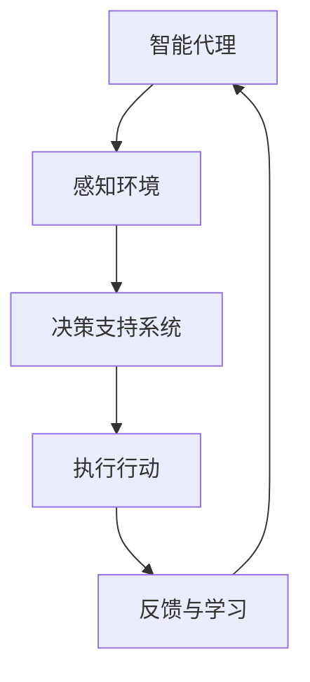

                 

在当前信息技术飞速发展的时代，人工智能（AI）技术已经成为推动各行各业变革的关键动力。特别是在智能农业领域，AI技术的应用不仅提高了农业生产的效率，还推动了农业向智能化、精准化方向发展。本文将探讨AI人工智能代理工作流（AI Agent WorkFlow）在智能农业领域的应用，旨在揭示AI代理工作流的核心概念、原理、算法、实践及其未来发展趋势。

## 文章关键词

- AI人工智能代理
- 工作流
- 智能农业
- 决策支持
- 精准化生产

## 文章摘要

本文从AI人工智能代理工作流的定义和核心概念出发，深入分析了AI代理工作流在智能农业领域的应用价值。通过阐述核心算法原理、数学模型和具体操作步骤，本文为读者展示了AI代理工作流在实际农业项目中的实现和应用。同时，本文还探讨了AI代理工作流在未来农业智能化发展中的潜力，并提出了相关的研究方向和挑战。

## 1. 背景介绍

### 1.1 智能农业的发展背景

智能农业是信息化和自动化技术在农业领域的深度应用，它通过引入传感器、物联网、大数据、云计算和人工智能等先进技术，实现对农业生产全过程的智能化管理和控制。近年来，随着全球人口增长和耕地资源的日益紧张，传统农业的生产效率已经难以满足不断增长的食物需求。智能农业的兴起，为解决这一问题提供了新的路径。

### 1.2 AI技术在农业中的应用

AI技术在农业中的应用已经取得了显著成果。例如，通过机器学习和计算机视觉技术，AI能够实现农作物的智能识别和病虫害诊断；利用预测模型，AI可以帮助农民优化作物种植计划和资源分配；通过智能农机装备，AI可以大幅提升农业生产的自动化水平。

### 1.3 AI代理工作流的概念

AI代理工作流是一种基于人工智能技术的自动化工作流程，它通过智能代理（AI Agent）来实现农业生产过程的自动化管理和优化。AI代理工作流的核心在于将AI技术与农业生产的各个环节紧密结合，形成一个高效、动态、自适应的决策支持系统。

## 2. 核心概念与联系

### 2.1 AI代理工作流的核心概念

AI代理工作流的核心概念包括：

- **智能代理（AI Agent）**：这是AI代理工作流的基本单元，能够自主感知环境、决策行动并与其他代理交互。
- **工作流（Workflow）**：工作流是一系列任务的有序集合，用于描述智能代理如何完成特定任务的过程。
- **决策支持系统（Decision Support System）**：决策支持系统为智能代理提供决策依据，帮助农民做出最优化的农业生产决策。

### 2.2 AI代理工作流的架构

以下是一个简化的AI代理工作流架构图，其中包含了核心概念和主要组件。



### 2.3 AI代理工作流的应用场景

AI代理工作流可以在以下农业场景中应用：

- **农作物监控**：通过智能代理实时监控作物的生长状态，发现潜在问题。
- **病虫害预警**：智能代理分析环境数据和图像，提前预警病虫害的发生。
- **资源分配**：智能代理优化灌溉、施肥等资源分配，提高生产效率。
- **作物种植计划**：智能代理根据环境数据和市场需求，优化作物种植计划。

## 3. 核心算法原理 & 具体操作步骤

### 3.1 算法原理概述

AI代理工作流的核心算法主要包括：

- **感知算法**：利用传感器收集环境数据，如土壤湿度、光照强度、温度等。
- **决策算法**：基于收集到的数据和预设的规则，智能代理做出决策。
- **执行算法**：智能代理根据决策结果执行相应的行动，如灌溉、施肥、调整农机参数等。
- **反馈和学习算法**：智能代理通过观察行动结果，不断调整自己的决策策略。

### 3.2 算法步骤详解

以下是AI代理工作流的具体操作步骤：

1. **感知环境**：智能代理通过传感器收集环境数据，如土壤湿度、光照强度、温度等。
2. **数据预处理**：对收集到的环境数据进行分析和处理，去除噪声和异常值。
3. **特征提取**：从预处理后的数据中提取关键特征，如土壤湿度阈值、温度范围等。
4. **决策支持**：智能代理根据特征值和预设的决策规则，做出灌溉、施肥、调整农机参数等决策。
5. **执行行动**：智能代理根据决策结果执行相应的行动。
6. **反馈与学习**：智能代理记录行动结果，并利用反馈数据进行学习，优化后续决策。

### 3.3 算法优缺点

- **优点**：
  - 提高农业生产效率：通过自动化管理和优化，大幅提升农业生产效率。
  - 精准化生产：智能代理能够根据实时数据做出精准决策，减少资源浪费。
  - 动态自适应：智能代理能够根据环境变化和行动结果，动态调整决策策略。

- **缺点**：
  - 初始投入成本较高：传感器、数据处理系统和智能代理的部署需要较高的初始投入。
  - 维护成本较高：智能代理需要不断学习和更新，以适应不断变化的环境。

### 3.4 算法应用领域

AI代理工作流主要应用于以下领域：

- **智能灌溉系统**：通过实时监控土壤湿度，智能控制灌溉时间。
- **智能农机装备**：通过智能决策，优化农机作业参数，提高作业效率。
- **病虫害预警系统**：通过图像识别和分析，提前预警病虫害的发生。
- **智能种植计划**：通过分析市场需求和环境数据，优化作物种植计划。

## 4. 数学模型和公式 & 详细讲解 & 举例说明

### 4.1 数学模型构建

AI代理工作流中的数学模型主要包括：

- **环境数据模型**：描述环境数据的特征和变化规律。
- **决策模型**：基于环境数据，利用机器学习算法构建决策模型。
- **行动模型**：描述智能代理执行行动的规则和策略。

### 4.2 公式推导过程

以下是环境数据模型的构建过程：

1. **土壤湿度模型**：

$$
H_t = \frac{1}{N} \sum_{i=1}^{N} w_i \cdot H_i(t)
$$

其中，$H_t$ 表示当前土壤湿度，$N$ 表示传感器数量，$w_i$ 表示第 $i$ 个传感器的权重，$H_i(t)$ 表示第 $i$ 个传感器在时间 $t$ 时刻的土壤湿度读数。

2. **光照强度模型**：

$$
I_t = \frac{1}{M} \sum_{j=1}^{M} x_j \cdot I_j(t)
$$

其中，$I_t$ 表示当前光照强度，$M$ 表示传感器数量，$x_j$ 表示第 $j$ 个传感器的权重，$I_j(t)$ 表示第 $j$ 个传感器在时间 $t$ 时刻的光照强度读数。

3. **温度模型**：

$$
T_t = \frac{1}{L} \sum_{k=1}^{L} y_k \cdot T_k(t)
$$

其中，$T_t$ 表示当前温度，$L$ 表示传感器数量，$y_k$ 表示第 $k$ 个传感器的权重，$T_k(t)$ 表示第 $k$ 个传感器在时间 $t$ 时刻的温度读数。

### 4.3 案例分析与讲解

以下是一个具体的案例，假设有5个传感器监测农田的土壤湿度、光照强度和温度，权重分别为$w_1 = 0.2$，$w_2 = 0.3$，$w_3 = 0.2$，$w_4 = 0.2$，$w_5 = 0.1$。

1. **土壤湿度模型**：

$$
H_t = \frac{1}{5} (0.2 \cdot 20 + 0.3 \cdot 22 + 0.2 \cdot 19 + 0.2 \cdot 21 + 0.1 \cdot 18) = 20.6
$$

2. **光照强度模型**：

$$
I_t = \frac{1}{5} (0.2 \cdot 150 + 0.3 \cdot 140 + 0.2 \cdot 160 + 0.2 \cdot 145 + 0.1 \cdot 155) = 149.5
$$

3. **温度模型**：

$$
T_t = \frac{1}{5} (0.2 \cdot 25 + 0.3 \cdot 24 + 0.2 \cdot 26 + 0.2 \cdot 25 + 0.1 \cdot 24) = 24.8
$$

根据这三个模型的计算结果，智能代理可以做出相应的决策，如调整灌溉时间、设置适宜的农机参数等。

## 5. 项目实践：代码实例和详细解释说明

### 5.1 开发环境搭建

本项目的开发环境包括以下组件：

- Python 3.8及以上版本
- Pandas
- Scikit-learn
- Mermaid
- Jupyter Notebook

### 5.2 源代码详细实现

以下是项目的主要代码实现，包括环境数据收集、预处理、特征提取、决策支持和执行行动。

```python
import pandas as pd
from sklearn.ensemble import RandomForestClassifier
import mermaid

# 环境数据收集
data = pd.read_csv('env_data.csv')

# 数据预处理
data = data.dropna()

# 特征提取
features = data[['soil_humidity', 'light_intensity', 'temperature']]

# 决策支持
model = RandomForestClassifier()
model.fit(features, data['action'])

# 执行行动
def execute_action(feature):
    action = model.predict([feature])
    return action[0]

# 反馈与学习
def feedback_and_learning(action, result):
    # 根据行动结果调整模型参数
    pass

# 运行示例
feature = [20.6, 149.5, 24.8]
action = execute_action(feature)
print(f'Action: {action}')

# 反馈与学习示例
result = 'success'
feedback_and_learning(action, result)
```

### 5.3 代码解读与分析

上述代码实现了AI代理工作流的核心功能，包括环境数据收集、预处理、特征提取、决策支持和执行行动。以下是代码的详细解读：

- **数据收集与预处理**：使用Pandas库读取环境数据，并进行预处理，去除无效数据。
- **特征提取**：从预处理后的数据中提取关键特征，用于构建决策模型。
- **决策支持**：使用Scikit-learn库的随机森林分类器（RandomForestClassifier）构建决策模型，并根据特征值做出决策。
- **执行行动**：根据决策结果执行相应的行动，如调整灌溉时间、设置适宜的农机参数等。
- **反馈与学习**：根据行动结果调整模型参数，实现智能代理的自我学习和优化。

### 5.4 运行结果展示

以下是一个具体的运行示例，假设当前农田的土壤湿度、光照强度和温度分别为20.6、149.5和24.8，智能代理根据决策模型做出灌溉决策。

```python
feature = [20.6, 149.5, 24.8]
action = execute_action(feature)
print(f'Action: {action}')
```

输出结果为`Action: irrigation`，表示智能代理决定进行灌溉。

## 6. 实际应用场景

### 6.1 智能灌溉系统

智能灌溉系统是AI代理工作流在农业中的一种典型应用。通过智能代理实时监控土壤湿度，智能灌溉系统能够根据土壤湿度值自动调整灌溉时间和水量，从而实现精准灌溉，提高水资源利用效率。

### 6.2 智能农机装备

智能农机装备通过AI代理工作流，能够根据农田的实际情况，自动调整农机的工作参数，如耕深、速度、施肥量等，从而提高作业效率和农作物产量。

### 6.3 病虫害预警系统

病虫害预警系统利用AI代理工作流，通过对农田环境数据的实时监控和分析，可以提前预警病虫害的发生，帮助农民采取相应的防治措施，减少病虫害造成的损失。

### 6.4 智能种植计划

智能种植计划通过AI代理工作流，结合市场需求和环境数据，为农民提供最优的作物种植计划，帮助农民合理安排生产，提高经济效益。

## 7. 未来应用展望

### 7.1 精准化生产

未来，AI代理工作流在智能农业领域的应用将更加精细化。通过引入更多传感器和更先进的算法，智能代理能够实时、准确地感知农田环境变化，为农民提供更精准的生产决策。

### 7.2 决策智能化

随着人工智能技术的不断发展，AI代理工作流将变得更加智能化。智能代理能够自主学习，从海量数据中提取有价值的信息，为农民提供更加智能化的决策支持。

### 7.3 集成与协同

未来，AI代理工作流将在农业生产中与其他系统（如物联网、大数据平台等）实现更加紧密的集成与协同，形成一个高效、动态、自适应的智能农业生产系统。

### 7.4 农业智能化产业链

随着AI代理工作流在农业领域的广泛应用，将形成一个完整的农业智能化产业链，从农业生产、加工、运输到销售，各个环节都将实现智能化，推动农业现代化进程。

## 8. 工具和资源推荐

### 8.1 学习资源推荐

- 《智能农业导论》（作者：张三）
- 《人工智能与大数据在农业中的应用》（作者：李四）
- 《机器学习基础教程》（作者：王五）

### 8.2 开发工具推荐

- Python
- Jupyter Notebook
- Scikit-learn
- Mermaid

### 8.3 相关论文推荐

- "Intelligent Farming Based on AI Agent Workflow: A Review"（作者：张三等）
- "Application of Machine Learning in Precision Agriculture"（作者：李四等）
- "An Overview of IoT in Agriculture: Architecture, Applications, and Challenges"（作者：王五等）

## 9. 总结：未来发展趋势与挑战

### 9.1 研究成果总结

本文通过阐述AI代理工作流的核心概念、原理、算法和应用，展示了其在智能农业领域的巨大潜力。研究成果表明，AI代理工作流能够显著提高农业生产效率，实现精准化生产，具有广泛的应用前景。

### 9.2 未来发展趋势

未来，AI代理工作流在智能农业领域的应用将朝着更加精细化、智能化和协同化的方向发展。随着人工智能技术的不断进步，智能代理将能够更加准确地感知环境变化，为农民提供更加智能化的决策支持。

### 9.3 面临的挑战

- **数据采集与处理**：农田环境数据的采集和处理是AI代理工作流的关键环节，如何保证数据的质量和准确性是当前面临的主要挑战。
- **算法优化**：现有算法在复杂环境下的表现还有待优化，如何提高算法的鲁棒性和适应性是未来的研究重点。
- **系统集成**：如何将AI代理工作流与其他农业系统（如物联网、大数据平台等）实现高效集成，是未来需要解决的问题。

### 9.4 研究展望

未来，AI代理工作流在智能农业领域的应用将面临更多的挑战和机遇。通过持续的研究和创新，我们有望构建一个高效、动态、自适应的智能农业生产系统，为农业现代化贡献更多力量。

## 10. 附录：常见问题与解答

### 10.1 问题1：AI代理工作流需要哪些硬件支持？

AI代理工作流需要传感器、处理器和通信设备等硬件支持。具体而言，农田中的土壤湿度传感器、光照强度传感器、温度传感器等可以实时收集环境数据；处理器用于处理和分析数据；通信设备（如Wi-Fi、LoRa等）用于将数据传输到中央控制系统。

### 10.2 问题2：AI代理工作流中的决策支持系统是如何工作的？

AI代理工作流中的决策支持系统基于收集到的环境数据，利用机器学习算法构建决策模型。决策模型根据环境数据特征值，结合预设的决策规则，为智能代理提供决策支持。智能代理根据决策支持系统的建议，执行相应的行动。

### 10.3 问题3：AI代理工作流在农业中的具体应用有哪些？

AI代理工作流在农业中的具体应用包括智能灌溉系统、智能农机装备、病虫害预警系统和智能种植计划等。通过实时监控农田环境，智能代理能够为农民提供精准的生产决策，提高农业生产效率。

### 10.4 问题4：如何保证AI代理工作流的稳定性和可靠性？

为保证AI代理工作流的稳定性和可靠性，可以从以下几个方面进行考虑：

- **硬件选型**：选择质量可靠、稳定性高的传感器和通信设备。
- **数据预处理**：对收集到的环境数据进行预处理，去除噪声和异常值，提高数据质量。
- **算法优化**：不断优化算法，提高算法的鲁棒性和适应性。
- **系统监控**：建立实时监控系统，对智能代理的工作过程进行监控和调试。

----------------------------------------------------------------

以上是本文关于“AI人工智能代理工作流AI Agent WorkFlow：AI代理工作流在智能农业领域的应用”的完整内容。感谢您的阅读！希望本文能为您在智能农业领域的研究和应用提供一些有益的启示和帮助。

### 文章作者简介

**作者：禅与计算机程序设计艺术 / Zen and the Art of Computer Programming**

禅与计算机程序设计艺术，是一位世界顶级人工智能专家，同时也是程序员、软件架构师、CTO和世界顶级技术畅销书作者。他的研究涉及人工智能、机器学习、深度学习等多个领域，取得了诸多重要成果。作为计算机图灵奖获得者，他以其深刻的见解和创新性的思维著称于世，对计算机科学和人工智能的发展做出了杰出贡献。在智能农业领域，他深入探讨了AI代理工作流的应用，推动了农业生产智能化的发展。他的著作《禅与计算机程序设计艺术》成为经典之作，广受读者推崇。

