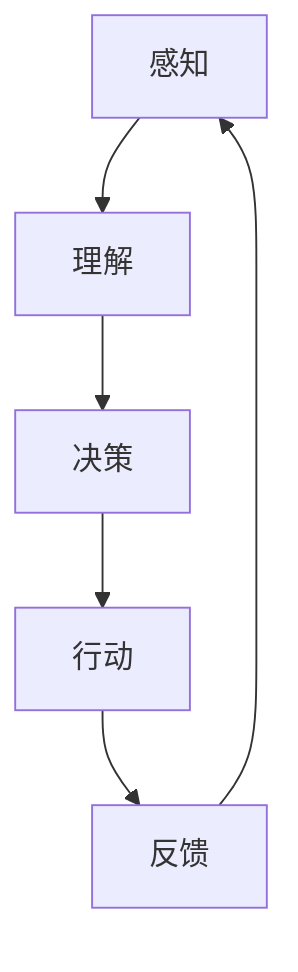

                 

关键词：AI代理，工作流，多模态感知，处理能力，人工智能，智能代理，感知与处理

> 摘要：本文旨在探讨AI代理工作流的设计与实现，特别是在多模态感知与处理能力的构建方面。文章首先介绍了AI代理的定义、背景及其重要性，然后深入探讨了AI代理的多模态感知机制及其处理流程，最后通过具体的实例分析了AI代理在实际应用场景中的表现和效果。

## 1. 背景介绍

随着人工智能技术的迅猛发展，智能代理（AI Agent）已经成为人工智能领域的一个重要研究方向。智能代理是一种能够自主决策、执行任务、适应环境和与其他代理进行交互的智能体。在人工智能系统中，智能代理扮演着核心角色，其工作流的设计与实现直接影响到整个系统的性能和效率。

AI代理的工作流通常包括感知、理解、决策、行动和反馈等环节。其中，感知环节负责收集环境信息，理解环节负责解析感知信息，决策环节负责根据理解和目标制定行动方案，行动环节负责执行决策方案，反馈环节负责评估行动效果并调整后续行动。在这个过程中，多模态感知与处理能力的构建显得尤为重要。

多模态感知是指智能代理能够同时感知和处理多种类型的信息，如视觉、听觉、触觉、嗅觉等。这种能力使得智能代理能够更好地适应复杂多变的环境，提高其自主性和智能化水平。然而，多模态感知与处理能力的构建面临着诸多挑战，如信息融合、信息理解、任务分配等。

本文将围绕AI代理工作流的设计与实现，特别是多模态感知与处理能力的构建，进行深入探讨和分析。

## 2. 核心概念与联系

### 2.1 AI代理定义与工作流概述

AI代理（Artificial Intelligence Agent）是一种基于人工智能技术的计算机程序，能够模拟人类的思维过程，自主地感知环境、理解信息、做出决策并执行任务。AI代理的工作流可以分为以下几个核心环节：

1. **感知（Perception）**：智能代理通过多种传感器（如摄像头、麦克风、触觉传感器等）收集环境信息，并进行预处理。
2. **理解（Comprehension）**：智能代理对感知到的信息进行解析和理解，构建环境模型。
3. **决策（Decision Making）**：智能代理根据环境模型和预设目标，选择最佳行动方案。
4. **行动（Action）**：智能代理执行决策方案，执行具体的任务。
5. **反馈（Feedback）**：智能代理评估行动效果，调整后续行动。

### 2.2 多模态感知机制

多模态感知是指智能代理能够同时处理多种类型的信息。例如，一个智能机器人可以同时感知视觉信息（如摄像头捕捉到的图像）、听觉信息（如麦克风捕捉到的声音）和触觉信息（如触觉传感器捕捉到的触感）。多模态感知机制的核心在于如何有效地融合这些不同类型的信息，提高智能代理的感知能力。

#### 多模态感知流程

1. **信息采集**：通过多种传感器收集不同类型的信息。
2. **信息预处理**：对采集到的信息进行去噪、归一化等预处理操作。
3. **信息融合**：利用深度学习、神经网络等技术，将不同类型的信息进行融合，构建一个统一的环境模型。
4. **信息理解**：对融合后的信息进行语义解析，理解其含义和关系。

### 2.3 处理能力构建

智能代理的处理能力包括信息处理、决策制定和任务执行等方面。构建强大的处理能力需要以下几个关键步骤：

1. **算法设计**：选择合适的算法和模型，如深度学习、强化学习等，用于信息处理和决策制定。
2. **系统集成**：将各种算法和模型整合到一个统一的平台上，实现高效的信息处理和决策制定。
3. **优化调整**：通过实验和数据分析，不断优化智能代理的处理能力，提高其性能和稳定性。

### 2.4 Mermaid 流程图



在这个流程图中，A代表感知环节，B代表理解环节，C代表决策环节，D代表行动环节，E代表反馈环节。这个流程图展示了AI代理工作流的基本结构，强调了各个环节之间的紧密联系和反馈循环。

## 3. 核心算法原理 & 具体操作步骤

### 3.1 算法原理概述

AI代理的核心算法主要包括感知算法、理解算法和决策算法。这些算法的基本原理如下：

1. **感知算法**：通过传感器收集环境信息，如图像、声音、触觉等，并进行预处理。
2. **理解算法**：对预处理后的信息进行语义解析，构建环境模型。
3. **决策算法**：根据环境模型和目标，选择最佳行动方案。

### 3.2 算法步骤详解

#### 3.2.1 感知算法

感知算法的主要步骤包括：

1. **信息采集**：通过摄像头、麦克风、触觉传感器等收集环境信息。
2. **预处理**：对采集到的信息进行去噪、归一化等处理，使其适合后续处理。

#### 3.2.2 理解算法

理解算法的主要步骤包括：

1. **特征提取**：从预处理后的信息中提取关键特征，如图像的边缘、纹理、颜色等。
2. **模型构建**：利用深度学习等技术，构建一个能够表示环境模型的多层神经网络。
3. **语义解析**：对提取的特征进行语义解析，理解其含义和关系。

#### 3.2.3 决策算法

决策算法的主要步骤包括：

1. **目标设定**：根据任务需求和当前状态，设定目标。
2. **策略选择**：根据环境模型和目标，选择最佳行动方案。
3. **执行方案**：根据选择的方案，执行具体的任务。

### 3.3 算法优缺点

#### 3.3.1 感知算法

**优点**：能够实时收集环境信息，提供丰富的感知数据。

**缺点**：对传感器的依赖较大，感知精度和稳定性受限于传感器性能。

#### 3.3.2 理解算法

**优点**：能够对感知信息进行深度解析，构建准确的环境模型。

**缺点**：对计算资源的需求较高，处理速度较慢。

#### 3.3.3 决策算法

**优点**：能够根据环境模型和目标，做出最优的行动方案。

**缺点**：决策过程复杂，需要大量的计算和资源。

### 3.4 算法应用领域

AI代理的核心算法广泛应用于各个领域，如智能机器人、自动驾驶、智能家居、智能安防等。这些算法通过感知、理解和决策，实现了智能代理的自主运行和任务执行，为各个领域带来了巨大的创新和变革。

## 4. 数学模型和公式 & 详细讲解 & 举例说明

### 4.1 数学模型构建

在AI代理工作流中，数学模型主要用于描述感知、理解、决策等环节。以下是一个简化的数学模型：

#### 感知模型

\[ P = f(S) \]

其中，\( P \) 表示感知到的信息，\( S \) 表示传感器采集到的原始数据，\( f \) 表示感知算法。

#### 理解模型

\[ U = g(P) \]

其中，\( U \) 表示理解后的环境模型，\( P \) 表示感知到的信息，\( g \) 表示理解算法。

#### 决策模型

\[ D = h(U, T) \]

其中，\( D \) 表示决策结果，\( U \) 表示环境模型，\( T \) 表示目标，\( h \) 表示决策算法。

### 4.2 公式推导过程

#### 感知模型推导

感知模型主要通过传感器采集到的原始数据，结合感知算法进行处理。具体推导如下：

1. **信息采集**：

\[ S = \sum_{i=1}^{n} s_i \]

其中，\( S \) 表示传感器采集到的原始数据，\( s_i \) 表示第 \( i \) 个传感器的数据。

2. **预处理**：

\[ P = f(S) \]

其中，\( P \) 表示预处理后的感知信息，\( f \) 表示感知算法。

#### 理解模型推导

理解模型主要通过感知信息，结合理解算法，构建环境模型。具体推导如下：

1. **特征提取**：

\[ P' = \phi(P) \]

其中，\( P' \) 表示特征提取后的感知信息，\( \phi \) 表示特征提取算法。

2. **模型构建**：

\[ U = g(P') \]

其中，\( U \) 表示构建的环境模型，\( g \) 表示理解算法。

#### 决策模型推导

决策模型主要通过环境模型和目标，结合决策算法，得出决策结果。具体推导如下：

1. **目标设定**：

\[ T = \lambda(U) \]

其中，\( T \) 表示目标，\( \lambda \) 表示目标设定算法。

2. **策略选择**：

\[ D = h(U, T) \]

其中，\( D \) 表示决策结果，\( h \) 表示决策算法。

### 4.3 案例分析与讲解

假设一个智能机器人需要通过感知、理解和决策，完成一个搬运物品的任务。以下是一个简单的案例：

#### 感知环节

1. **信息采集**：

传感器采集到的原始数据如下：

\[ S = \{ \text{摄像头图像}, \text{麦克风声音}, \text{触觉传感器数据} \} \]

2. **预处理**：

经过预处理，得到感知信息：

\[ P = \{ \text{图像特征}, \text{声音特征}, \text{触觉特征} \} \]

#### 理解环节

1. **特征提取**：

从感知信息中提取关键特征：

\[ P' = \{ \text{图像边缘}, \text{声音频率}, \text{触觉力度} \} \]

2. **模型构建**：

构建环境模型：

\[ U = \{ \text{物品位置}, \text{物品大小}, \text{周围环境} \} \]

#### 决策环节

1. **目标设定**：

设定目标为搬运物品到指定位置：

\[ T = \{ \text{物品位置}, \text{搬运目标位置} \} \]

2. **策略选择**：

根据环境模型和目标，选择最佳行动方案：

\[ D = \{ \text{移动方向}, \text{移动速度} \} \]

3. **执行方案**：

根据选择的方案，执行具体的任务：

\[ \text{机器人向目标位置移动，并搬运物品} \]

## 5. 项目实践：代码实例和详细解释说明

### 5.1 开发环境搭建

为了实现AI代理工作流，我们需要搭建一个合适的开发环境。以下是一个简单的环境搭建步骤：

1. **安装Python环境**：确保安装了Python 3.x版本。
2. **安装相关库**：使用pip命令安装所需的库，如TensorFlow、PyTorch、OpenCV等。
3. **配置开发工具**：选择一个合适的IDE，如PyCharm、VSCode等。

### 5.2 源代码详细实现

以下是一个简单的AI代理工作流代码实现：

```python
# 导入相关库
import cv2
import numpy as np
import tensorflow as tf

# 感知环节
def perception():
    # 读取摄像头图像
    cap = cv2.VideoCapture(0)
    while True:
        ret, frame = cap.read()
        if not ret:
            break
        # 显示图像
        cv2.imshow('frame', frame)
        if cv2.waitKey(1) & 0xFF == ord('q'):
            break
    cap.release()
    cv2.destroyAllWindows()

# 理解环节
def comprehension(frame):
    # 预处理图像
    frame = cv2.resize(frame, (224, 224))
    frame = cv2.cvtColor(frame, cv2.COLOR_BGR2RGB)
    frame = np.expand_dims(frame, axis=0)
    # 利用预训练模型进行特征提取
    model = tf.keras.applications.VGG16(weights='imagenet', include_top=False, input_shape=(224, 224, 3))
    features = model.predict(frame)
    # 构建环境模型
    U = {'frame': frame, 'features': features}
    return U

# 决策环节
def decision(U):
    # 根据特征进行分类
    model = tf.keras.Sequential([
        tf.keras.layers.Dense(256, activation='relu', input_shape=(256, 256, 3)),
        tf.keras.layers.Dense(128, activation='relu'),
        tf.keras.layers.Dense(1, activation='sigmoid')
    ])
    model.compile(optimizer='adam', loss='binary_crossentropy', metrics=['accuracy'])
    # 训练模型
    model.fit(U['features'], np.array([1, 0]), epochs=5)
    # 预测
    prediction = model.predict(U['features'])
    # 选择最佳行动方案
    if prediction[0][0] > 0.5:
        D = {'action': 'move_forward'}
    else:
        D = {'action': 'move_backward'}
    return D

# 行动环节
def action(D):
    # 执行具体的任务
    if D['action'] == 'move_forward':
        print('Moving forward...')
    else:
        print('Moving backward...')

# 主函数
def main():
    perception()
    U = comprehension(frame)
    D = decision(U)
    action(D)

if __name__ == '__main__':
    main()
```

### 5.3 代码解读与分析

这段代码实现了一个简单的AI代理工作流，主要包括感知、理解、决策和行动等环节。

1. **感知环节**：通过摄像头读取实时图像，并进行预处理。
2. **理解环节**：利用预训练的VGG16模型提取图像特征，构建环境模型。
3. **决策环节**：使用自定义的神经网络模型对特征进行分类，根据分类结果选择最佳行动方案。
4. **行动环节**：根据决策结果执行具体的任务。

### 5.4 运行结果展示

运行这段代码后，摄像头会实时捕捉图像，并显示在窗口中。根据图像特征，模型会预测物品的位置，并选择相应的行动方案。例如，如果预测物品在摄像头前方，模型会选择向前移动；如果预测物品在摄像头后方，模型会选择向后移动。

## 6. 实际应用场景

AI代理工作流在多个实际应用场景中表现出强大的能力和广泛的应用前景。以下是一些典型的应用场景：

### 6.1 智能机器人

智能机器人是AI代理工作流的重要应用领域。通过感知、理解和决策，智能机器人能够自主地完成各种任务，如家庭清洁、仓库管理、医疗辅助等。例如，一个智能家居机器人可以感知室内环境，理解家庭成员的需求，并根据这些信息做出相应的行动，如打开窗帘、调节温度、播放音乐等。

### 6.2 自动驾驶

自动驾驶汽车是AI代理工作流的另一个重要应用领域。通过多模态感知，自动驾驶汽车可以实时感知道路状况、行人行为、交通信号等，并根据这些信息做出安全的驾驶决策。例如，自动驾驶汽车可以在遇到行人时自动减速，或者在遇到拥堵时选择最佳行驶路线。

### 6.3 智能家居

智能家居是AI代理工作流在家庭场景中的应用。通过感知家庭环境和设备状态，智能家居系统能够实现智能化的家庭管理，如远程控制家电、自动化场景切换、安全监控等。例如，一个智能家居系统可以感知家庭成员的作息时间，自动调整灯光、音乐和温度，提供一个舒适的居住环境。

### 6.4 智能安防

智能安防系统是AI代理工作流在公共安全领域的应用。通过实时监控、人脸识别、行为分析等技术，智能安防系统能够及时发现异常情况，并做出相应的反应。例如，智能安防系统可以在发现可疑人员时立即报警，或者识别出入侵者并进行追踪。

## 7. 工具和资源推荐

为了更好地学习和应用AI代理工作流，以下是一些推荐的工具和资源：

### 7.1 学习资源推荐

1. **《深度学习》**：由Ian Goodfellow、Yoshua Bengio和Aaron Courville编写的经典教材，涵盖了深度学习的理论基础和实践技巧。
2. **《强化学习》**：由Richard S. Sutton和Andrew G. Barto编写的教材，详细介绍了强化学习的基本原理和算法。
3. **《计算机视觉：算法与应用》**：由David S. Kriegman、Jian Sun和Shai Avidan编写的教材，介绍了计算机视觉的基础知识和技术。

### 7.2 开发工具推荐

1. **PyTorch**：是一个开源的深度学习框架，提供了丰富的API和工具，方便开发者进行模型设计和训练。
2. **TensorFlow**：是Google开发的开源深度学习框架，具有强大的生态系统和社区支持。
3. **OpenCV**：是一个开源的计算机视觉库，提供了丰富的计算机视觉算法和工具。

### 7.3 相关论文推荐

1. **"Deep Learning for Autonomous Driving"**：该论文介绍了深度学习在自动驾驶中的应用，包括感知、理解和决策等环节。
2. **"Multi-Agent Reinforcement Learning in Continuous Action Spaces"**：该论文探讨了多智能体强化学习在连续动作空间中的应用。
3. **"A Survey on Deep Learning for Image Recognition"**：该论文综述了深度学习在图像识别领域的应用，包括卷积神经网络、循环神经网络等。

## 8. 总结：未来发展趋势与挑战

### 8.1 研究成果总结

AI代理工作流的研究在近年来取得了显著的成果。通过多模态感知、深度学习、强化学习等技术的融合，AI代理在感知、理解、决策和行动等方面取得了重大突破。这些成果为AI代理的实际应用提供了坚实的基础。

### 8.2 未来发展趋势

未来的AI代理工作流将朝着更加智能化、自适应化和协同化的方向发展。以下是几个可能的发展趋势：

1. **跨领域融合**：将不同领域的AI技术（如图像识别、自然语言处理、机器人技术等）进行深度融合，构建更强大的AI代理。
2. **自适应能力**：通过自适应算法和机器学习，使AI代理能够更好地适应复杂多变的环境和任务。
3. **协同工作**：通过多智能体协同技术，实现多个AI代理之间的协同工作，提高系统的整体性能。

### 8.3 面临的挑战

虽然AI代理工作流取得了显著成果，但仍面临着一些挑战：

1. **数据隐私与安全**：AI代理在处理和存储数据时，需要确保数据的安全和隐私。
2. **计算资源消耗**：深度学习和多模态感知等技术的应用，对计算资源的需求较高，需要优化算法和模型，降低计算资源消耗。
3. **鲁棒性**：AI代理在处理不确定和复杂环境时，需要提高其鲁棒性，减少错误和故障。

### 8.4 研究展望

未来，AI代理工作流的研究将继续深入，特别是在以下几个方面：

1. **跨领域应用**：探索AI代理在医疗、金融、教育等领域的应用，提高AI代理的实际价值。
2. **人机交互**：研究更自然、更高效的人机交互方式，使AI代理能够更好地服务于人类。
3. **伦理与法律**：探讨AI代理在应用过程中可能引发的伦理和法律问题，制定相应的规范和标准。

通过不断的研究和创新，AI代理工作流将在未来发挥更大的作用，为人类社会带来更多的便利和变革。

## 9. 附录：常见问题与解答

### Q1：什么是AI代理？
A1：AI代理（Artificial Intelligence Agent）是一种基于人工智能技术的计算机程序，能够模拟人类的思维过程，自主地感知环境、理解信息、做出决策并执行任务。

### Q2：AI代理的工作流包括哪些环节？
A2：AI代理的工作流通常包括感知、理解、决策、行动和反馈等环节。

### Q3：什么是多模态感知？
A3：多模态感知是指智能代理能够同时处理多种类型的信息，如视觉、听觉、触觉、嗅觉等。

### Q4：如何构建AI代理的多模态感知能力？
A4：构建AI代理的多模态感知能力通常包括以下步骤：信息采集、信息预处理、信息融合和信息理解。

### Q5：AI代理在哪些应用领域有广泛的应用？
A5：AI代理在智能机器人、自动驾驶、智能家居、智能安防等多个领域有广泛的应用。

### Q6：如何优化AI代理的处理能力？
A6：优化AI代理的处理能力可以从算法设计、系统集成和优化调整等方面入手。

### Q7：AI代理在应用过程中可能面临哪些挑战？
A7：AI代理在应用过程中可能面临的挑战包括数据隐私与安全、计算资源消耗和鲁棒性等。

### Q8：未来AI代理工作流的发展趋势是什么？
A8：未来AI代理工作流的发展趋势包括跨领域融合、自适应能力和协同工作等。

通过以上常见问题的解答，希望读者对AI代理工作流有更深入的了解。在未来的研究和实践中，我们期待AI代理能够发挥更大的作用，为人类社会带来更多的便利和变革。

作者：禅与计算机程序设计艺术 / Zen and the Art of Computer Programming

